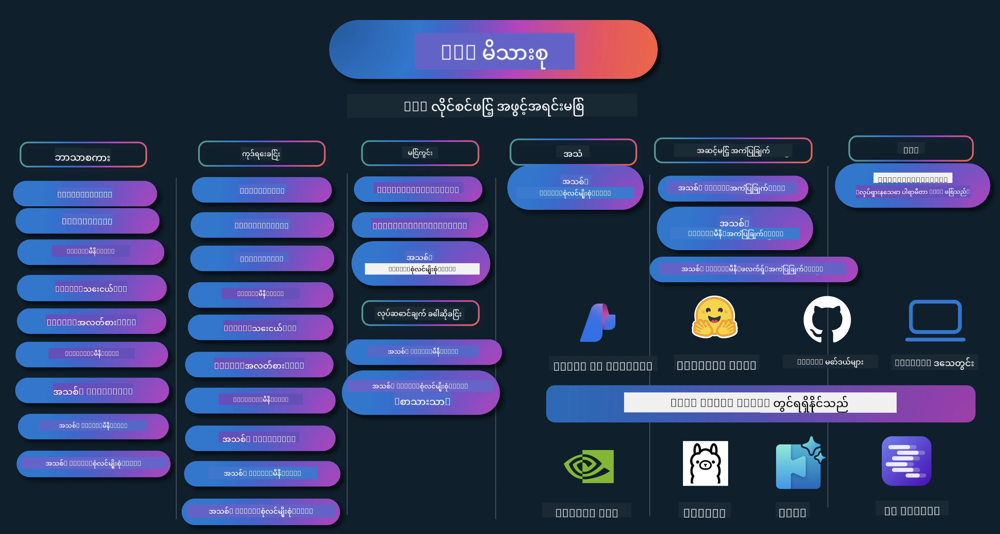

# Phi Cookbook: Microsoft ၏ Phi မော်ဒယ်များနှင့် လက်တွေ့ဥပမာများ

[](https://codespaces.new/microsoft/phicookbook)
[](https://vscode.dev/redirect?url=vscode://ms-vscode-remote.remote-containers/cloneInVolume?url=https://github.com/microsoft/phicookbook)

[](https://GitHub.com/microsoft/phicookbook/graphs/contributors/?WT.mc_id=aiml-137032-kinfeylo)
[](https://GitHub.com/microsoft/phicookbook/issues/?WT.mc_id=aiml-137032-kinfeylo)
[](https://GitHub.com/microsoft/phicookbook/pulls/?WT.mc_id=aiml-137032-kinfeylo)
[](http://makeapullrequest.com?WT.mc_id=aiml-137032-kinfeylo)

[](https://GitHub.com/microsoft/phicookbook/watchers/?WT.mc_id=aiml-137032-kinfeylo)
[](https://GitHub.com/microsoft/phicookbook/network/?WT.mc_id=aiml-137032-kinfeylo)
[](https://GitHub.com/microsoft/phicookbook/stargazers/?WT.mc_id=aiml-137032-kinfeylo)

[](https://discord.com/invite/ByRwuEEgH4)

Phi သည် Microsoft မှ ဖန်တီးထားသော အချက်အလက်ဖွင့်ဆိုင်း AI မော်ဒယ်စီးရီးဖြစ်သည်။

Phi သည် လက်ရှိတွင် အင်အားအပြည့်အဝနှင့် ကုန်ကျစရိတ် ထိရောက်ဆုံးသော စွမ်းအားသေးတဲ့ အဘိဓါန်မော်ဒယ် (SLM) ဖြစ်ပြီး၊ ဘာသာစကားစုံ၊ သဘောတရားရှာဖွေမှု၊ စာသား/စကားဝိုင်းဖန်တီးမှု၊ ကုဒ်ရေးခြင်း၊ ရုပ်ပုံများ၊ အသံနှင့် အခြား အခြေအနေများ၌ အရမ်းကောင်းမွန်သော စမ်းသပ်မှုများ ရရှိထားသည်။

Phi ကို cloud သို့မဟုတ် edge ကိရိယာများပေါ်တွင် တပ်ဆင်နိုင်ပြီး၊ တွက်ချက်မှုစွမ်းအားအနည်းငယ်ဖြင့် ကုန်ကြမ်း AI များ ဖန်တီးတည်ဆောက်နိုင်ပါသည်။

ဤအရင်းအမြစ်များကို အသုံးပြုရန် စတင်ရန် အဆင့်များကို လိုက်နာပါ။
1. **Repository ကို Fork လုပ်ပါ**:  နှိပ်ပါ [](https://GitHub.com/microsoft/phicookbook/network/?WT.mc_id=aiml-137032-kinfeylo)
2. **Repository ကို Clone လုပ်ပါ**:  `git clone https://github.com/microsoft/PhiCookBook.git`
3. [**Microsoft AI Discord Community မှာ အသင်းဝင်ပြီး ကျွမ်းကျင်သူများနှင့် ဖန်တီးသူများနှင့် တွေ့ဆုံဆိုပြီး ပူးပေါင်းထိတွေ့ပါ**](https://discord.com/invite/ByRwuEEgH4?WT.mc_id=aiml-137032-kinfeylo)



### 🌐 ဘာသာစကားစုံ ထောက်ခံမှု

#### GitHub Action အားဖြင့် ထောက်ခံသည် (အလိုအလျောက် နှင့် အမြဲတမ်း Update များ)

<!-- CO-OP TRANSLATOR LANGUAGES TABLE START -->
[Arabic](../ar/README.md) | [Bengali](../bn/README.md) | [Bulgarian](../bg/README.md) | [Burmese (Myanmar)](./README.md) | [Chinese (Simplified)](../zh-CN/README.md) | [Chinese (Traditional, Hong Kong)](../zh-HK/README.md) | [Chinese (Traditional, Macau)](../zh-MO/README.md) | [Chinese (Traditional, Taiwan)](../zh-TW/README.md) | [Croatian](../hr/README.md) | [Czech](../cs/README.md) | [Danish](../da/README.md) | [Dutch](../nl/README.md) | [Estonian](../et/README.md) | [Finnish](../fi/README.md) | [French](../fr/README.md) | [German](../de/README.md) | [Greek](../el/README.md) | [Hebrew](../he/README.md) | [Hindi](../hi/README.md) | [Hungarian](../hu/README.md) | [Indonesian](../id/README.md) | [Italian](../it/README.md) | [Japanese](../ja/README.md) | [Kannada](../kn/README.md) | [Korean](../ko/README.md) | [Lithuanian](../lt/README.md) | [Malay](../ms/README.md) | [Malayalam](../ml/README.md) | [Marathi](../mr/README.md) | [Nepali](../ne/README.md) | [Nigerian Pidgin](../pcm/README.md) | [Norwegian](../no/README.md) | [Persian (Farsi)](../fa/README.md) | [Polish](../pl/README.md) | [Portuguese (Brazil)](../pt-BR/README.md) | [Portuguese (Portugal)](../pt-PT/README.md) | [Punjabi (Gurmukhi)](../pa/README.md) | [Romanian](../ro/README.md) | [Russian](../ru/README.md) | [Serbian (Cyrillic)](../sr/README.md) | [Slovak](../sk/README.md) | [Slovenian](../sl/README.md) | [Spanish](../es/README.md) | [Swahili](../sw/README.md) | [Swedish](../sv/README.md) | [Tagalog (Filipino)](../tl/README.md) | [Tamil](../ta/README.md) | [Telugu](../te/README.md) | [Thai](../th/README.md) | [Turkish](../tr/README.md) | [Ukrainian](../uk/README.md) | [Urdu](../ur/README.md) | [Vietnamese](../vi/README.md)

> **ကိုယ့် ကိုယ် cloning လုပ်ချင်ပါသလား?**

> ဒီ repository မှာ ဘာသာစကား ၅၀ ကျော် အပြန်အလှန် ဘာသာပြန်ထားတာ ကြောင့် download အရေအတွက် ကြီးတယ်။ ဘာသာပြန်တွေ မပါဘဲ cloning လုပ်ချင်ရင် sparse checkout ကို သုံးပါ:
> ```bash
> git clone --filter=blob:none --sparse https://github.com/microsoft/PhiCookBook.git
> cd PhiCookBook
> git sparse-checkout set --no-cone '/*' '!translations' '!translated_images'
> ```
> ဒါက သင့်ကို သင်တန်းကို ပြီးမြောက်စေဖို့ လိုအပ်သမျှ အရာအားလုံးကို ပို၍ မြန်ဆန်တောင့်တင်းစွာ download လုပ်နိုင်စေပါသည်။
<!-- CO-OP TRANSLATOR LANGUAGES TABLE END -->

## မိတ်ဆက် အကြောင်းအရာများ စာရင်း

- နိဒါန်း
  - [Phi မိသားစုသို့ ကြိုဆိုပါသည်](./md/01.Introduction/01/01.PhiFamily.md)
  - [သင့်ပတ်ဝန်းကျင် ကို စတင်ပြင်ဆင်ခြင်း](./md/01.Introduction/01/01.EnvironmentSetup.md)
  - [အဓိက နည်းပညာများကို နားလည်ခြင်း](./md/01.Introduction/01/01.Understandingtech.md)
  - [Phi မော်ဒယ်များအတွက် AI လုံခြုံမှု](./md/01.Introduction/01/01.AISafety.md)
  - [Phi ၏ Hardware ထောက်ခံမှု](./md/01.Introduction/01/01.Hardwaresupport.md)
  - [Phi မော်ဒယ်များ နှင့် platform များပေါ်ရှိ ရရှိနိုင်မှု](./md/01.Introduction/01/01.Edgeandcloud.md)
  - [Guidance-ai နှင့် Phi အသုံးပြုခြင်း](./md/01.Introduction/01/01.Guidance.md)
  - [GitHub Marketplace မော်ဒယ်များ](https://github.com/marketplace/models)
  - [Azure AI မော်ဒယ်ကတ်တလော့](https://ai.azure.com)

- မတူသည့် ပတ်ဝန်းကျင်များတွင် Phi ၏ စမ်းသပ်ချက်
    -  [Hugging face](./md/01.Introduction/02/01.HF.md)
    -  [GitHub မော်ဒယ်များ](./md/01.Introduction/02/02.GitHubModel.md)
    -  [Azure AI Foundry မော်ဒယ်ကတ်တလော့](./md/01.Introduction/02/03.AzureAIFoundry.md)
    -  [Ollama](./md/01.Introduction/02/04.Ollama.md)
    -  [AI Toolkit VSCode (AITK)](./md/01.Introduction/02/05.AITK.md)
    -  [NVIDIA NIM](./md/01.Introduction/02/06.NVIDIA.md)
    -  [Foundry Local](./md/01.Introduction/02/07.FoundryLocal.md)

- Phi မိသားစု၏ စမ်းသပ်မှု
    - [iOS တွင် Phi စမ်းသပ်မှု](./md/01.Introduction/03/iOS_Inference.md)
    - [Android တွင် Phi စမ်းသပ်မှု](./md/01.Introduction/03/Android_Inference.md)
    - [Jetson တွင် Phi စမ်းသပ်မှု](./md/01.Introduction/03/Jetson_Inference.md)
    - [AI PC တွင် Phi စမ်းသပ်မှု](./md/01.Introduction/03/AIPC_Inference.md)
    - [Apple MLX Framework နှင့် Phi စမ်းသပ်မှု](./md/01.Introduction/03/MLX_Inference.md)
    - [Local Server တွင် Phi စမ်းသပ်မှု](./md/01.Introduction/03/Local_Server_Inference.md)
    - [Remote Server တွင် AI Toolkit အသုံးပြုပြီး Phi စမ်းသပ်မှု](./md/01.Introduction/03/Remote_Interence.md)
    - [Rust ဖြင့် Phi စမ်းသပ်မှု](./md/01.Introduction/03/Rust_Inference.md)
    - [Vision Phi ကို ဒေသတွင် စမ်းသပ်မှု](./md/01.Introduction/03/Vision_Inference.md)
    - [Kaito AKS, Azure Containers (တရားဝင် ထောက်ခံချက်) ဖြင့် Phi စမ်းသပ်မှု](./md/01.Introduction/03/Kaito_Inference.md)
-  [Phi မိသားစုကို တိုင်းတာခြင်း](./md/01.Introduction/04/QuantifyingPhi.md)
    - [llama.cpp ပေါ်တွင် Phi-3.5 / 4 ကို Quantize လုပ်ခြင်း](./md/01.Introduction/04/UsingLlamacppQuantifyingPhi.md)
    - [onnxruntime အတွက် Generative AI extension များဖြင့် Phi-3.5 / 4 ကို Quantize လုပ်ခြင်း](./md/01.Introduction/04/UsingORTGenAIQuantifyingPhi.md)
    - [Intel OpenVINO ဖြင့် Phi-3.5 / 4 ကို Quantize လုပ်ခြင်း](./md/01.Introduction/04/UsingIntelOpenVINOQuantifyingPhi.md)
    - [Apple MLX Framework ဖြင့် Phi-3.5 / 4 ကို Quantize လုပ်ခြင်း](./md/01.Introduction/04/UsingAppleMLXQuantifyingPhi.md)

-  Phi ၏ အကဲဖြတ်မှု
    - [တာဝန်ရှိသော AI](./md/01.Introduction/05/ResponsibleAI.md)
    - [Azure AI Foundry အတွက် အကဲဖြတ်မှု](./md/01.Introduction/05/AIFoundry.md)
    - [Promptflow ဖြင့် အကဲဖြတ်မှု](./md/01.Introduction/05/Promptflow.md)
 
- Azure AI Search ဖြင့် RAG
    - [Phi-4-mini နှင့် Phi-4-multimodal (RAG) ကို Azure AI Search နှင့် အသုံးပြုနည်း](https://github.com/microsoft/PhiCookBook/blob/main/code/06.E2E/E2E_Phi-4-RAG-Azure-AI-Search.ipynb)

- Phi အက်ပလီကေးရှင်း ဖွံ့ဖြိုးရေး နမူနာများ
  - စာသား & စကားဝိုင်း အက်ပလီကေးရှင်းများ
    - Phi-4 နမူနာများ 🆕
      - [📓] [Phi-4-mini ONNX မော်ဒယ်ဖြင့် စကားဝိုင်းလုပ်ငန်းဆောင်မှု](./md/02.Application/01.TextAndChat/Phi4/ChatWithPhi4ONNX/README.md)
      - [Phi-4 ဒေသဆိုင်ရာ ONNX မော်ဒယ် .NET ဖြင့် စကားဝိုင်း](../../md/04.HOL/dotnet/src/LabsPhi4-Chat-01OnnxRuntime)
      - [Semantic Kernel အသုံးပြုပြီး Phi-4 ONNX နှင့် Chat .NET Console App](../../md/04.HOL/dotnet/src/LabsPhi4-Chat-02SK)
    - Phi-3 / 3.5 နမူနာများ
      - [Phi3, ONNX Runtime Web နှင့် WebGPU ကို အသုံးပြုပြီး ဒေါင်းလိုက် ထည့်ဝင်ရိုက်နှိပ် Chatbot](https://github.com/microsoft/onnxruntime-inference-examples/tree/main/js/chat)
      - [OpenVino စကားဝိုင်း](./md/02.Application/01.TextAndChat/Phi3/E2E_OpenVino_Chat.md)
      - [Multi Model - Interactive Phi-3-mini and OpenAI Whisper](./md/02.Application/01.TextAndChat/Phi3/E2E_Phi-3-mini_with_whisper.md)
      - [MLFlow - Building a wrapper and using Phi-3 with MLFlow](./md//02.Application/01.TextAndChat/Phi3/E2E_Phi-3-MLflow.md)
      - [Model Optimization - How to optimize Phi-3-min model for ONNX Runtime Web with Olive](https://github.com/microsoft/Olive/tree/main/examples/phi3)
      - [WinUI3 App with Phi-3 mini-4k-instruct-onnx](https://github.com/microsoft/Phi3-Chat-WinUI3-Sample/)
      -[WinUI3 Multi Model AI Powered Notes App Sample](https://github.com/microsoft/ai-powered-notes-winui3-sample)
      - [Fine-tune and Integrate custom Phi-3 models with Prompt flow](./md/02.Application/01.TextAndChat/Phi3/E2E_Phi-3-FineTuning_PromptFlow_Integration.md)
      - [Fine-tune and Integrate custom Phi-3 models with Prompt flow in Azure AI Foundry](./md/02.Application/01.TextAndChat/Phi3/E2E_Phi-3-FineTuning_PromptFlow_Integration_AIFoundry.md)
      - [Evaluate the Fine-tuned Phi-3 / Phi-3.5 Model in Azure AI Foundry Focusing on Microsoft's Responsible AI Principles](./md/02.Application/01.TextAndChat/Phi3/E2E_Phi-3-Evaluation_AIFoundry.md)
      - [📓] [Phi-3.5-mini-instruct language prediction sample (Chinese/English)](./md/02.Application/01.TextAndChat/Phi3/phi3-instruct-demo.ipynb)
      - [Phi-3.5-Instruct WebGPU RAG Chatbot](./md/02.Application/01.TextAndChat/Phi3/WebGPUWithPhi35Readme.md)
      - [Using Windows GPU to create Prompt flow solution with Phi-3.5-Instruct ONNX](./md/02.Application/01.TextAndChat/Phi3/UsingPromptFlowWithONNX.md)
      - [Using Microsoft Phi-3.5 tflite to create Android app](./md/02.Application/01.TextAndChat/Phi3/UsingPhi35TFLiteCreateAndroidApp.md)
      - [Q&A .NET Example using local ONNX Phi-3 model using the Microsoft.ML.OnnxRuntime](../../md/04.HOL/dotnet/src/LabsPhi301)
      - [Console chat .NET app with Semantic Kernel and Phi-3](../../md/04.HOL/dotnet/src/LabsPhi302)

  - Azure AI Inference SDK Code Based Samples 
    - Phi-4 Samples 🆕
      - [📓] [Generate project code using Phi-4-multimodal](./md/02.Application/02.Code/Phi4/GenProjectCode/README.md)
    - Phi-3 / 3.5 Samples
      - [Build your own Visual Studio Code GitHub Copilot Chat with Microsoft Phi-3 Family](./md/02.Application/02.Code/Phi3/VSCodeExt/README.md)
      - [Create your own Visual Studio Code Chat Copilot Agent with Phi-3.5 by GitHub Models](/md/02.Application/02.Code/Phi3/CreateVSCodeChatAgentWithGitHubModels.md)

  - Advanced Reasoning Samples
    - Phi-4 Samples 🆕
      - [📓] [Phi-4-mini-reasoning or Phi-4-reasoning Samples](./md/02.Application/03.AdvancedReasoning/Phi4/AdvancedResoningPhi4mini/README.md)
      - [📓] [Fine-tuning Phi-4-mini-reasoning with Microsoft Olive](./md/02.Application/03.AdvancedReasoning/Phi4/AdvancedResoningPhi4mini/olive_ft_phi_4_reasoning_with_medicaldata.ipynb)
      - [📓] [Fine-tuning Phi-4-mini-reasoning with Apple MLX](./md/02.Application/03.AdvancedReasoning/Phi4/AdvancedResoningPhi4mini/mlx_ft_phi_4_reasoning_with_medicaldata.ipynb)
      - [📓] [Phi-4-mini-reasoning with GitHub Models](./md/02.Application/02.Code/Phi4r/github_models_inference.ipynb)
      - [📓] [Phi-4-mini-reasoning with Azure AI Foundry Models](./md/02.Application/02.Code/Phi4r/azure_models_inference.ipynb)
  - Demos
      - [Phi-4-mini demos hosted on Hugging Face Spaces](https://huggingface.co/spaces/microsoft/phi-4-mini?WT.mc_id=aiml-137032-kinfeylo)
      - [Phi-4-multimodal demos hosted on Hugginge Face Spaces](https://huggingface.co/spaces/microsoft/phi-4-multimodal?WT.mc_id=aiml-137032-kinfeylo)
  - Vision Samples
    - Phi-4 Samples 🆕
      - [📓] [Use Phi-4-multimodal to read images and generate code](./md/02.Application/04.Vision/Phi4/CreateFrontend/README.md) 
    - Phi-3 / 3.5 Samples
      -  [📓][Phi-3-vision-Image text to text](./md/02.Application/04.Vision/Phi3/E2E_Phi-3-vision-image-text-to-text-online-endpoint.ipynb)
      - [Phi-3-vision-ONNX](https://onnxruntime.ai/docs/genai/tutorials/phi3-v.html)
      - [📓][Phi-3-vision CLIP Embedding](./md/02.Application/04.Vision/Phi3/E2E_Phi-3-vision-image-text-to-text-online-endpoint.ipynb)
      - [DEMO: Phi-3 Recycling](https://github.com/jennifermarsman/PhiRecycling/)
      - [Phi-3-vision - Visual language assistant - with Phi3-Vision and OpenVINO](https://docs.openvino.ai/nightly/notebooks/phi-3-vision-with-output.html)
      - [Phi-3 Vision Nvidia NIM](./md/02.Application/04.Vision/Phi3/E2E_Nvidia_NIM_Vision.md)
      - [Phi-3 Vision OpenVino](./md/02.Application/04.Vision/Phi3/E2E_OpenVino_Phi3Vision.md)
      - [📓][Phi-3.5 Vision multi-frame or multi-image sample](./md/02.Application/04.Vision/Phi3/phi3-vision-demo.ipynb)
      - [Phi-3 Vision Local ONNX Model using the Microsoft.ML.OnnxRuntime .NET](../../md/04.HOL/dotnet/src/LabsPhi303)
      - [Menu based Phi-3 Vision Local ONNX Model using the Microsoft.ML.OnnxRuntime .NET](../../md/04.HOL/dotnet/src/LabsPhi304)

  - Math Samples
    -  Phi-4-Mini-Flash-Reasoning-Instruct Samples 🆕 [Math Demo with Phi-4-Mini-Flash-Reasoning-Instruct](./md/02.Application/09.Math/MathDemo.ipynb)

  - Audio Samples
    - Phi-4 Samples 🆕
      - [📓] [Extracting audio transcripts using Phi-4-multimodal](./md/02.Application/05.Audio/Phi4/Transciption/README.md)
      - [📓] [Phi-4-multimodal Audio Sample](./md/02.Application/05.Audio/Phi4/Siri/demo.ipynb)
      - [📓] [Phi-4-multimodal Speech Translation Sample](./md/02.Application/05.Audio/Phi4/Translate/demo.ipynb)
      - [.NET console application using Phi-4-multimodal Audio to analyze an audio file and generate transcript](../../md/04.HOL/dotnet/src/LabsPhi4-MultiModal-02Audio)

  - MOE Samples
    - Phi-3 / 3.5 Samples
      - [📓] [Phi-3.5 Mixture of Experts Models (MoEs) Social Media Sample](./md/02.Application/06.MoE/Phi3/phi3_moe_demo.ipynb)
      - [📓] [Building a Retrieval-Augmented Generation (RAG) Pipeline with NVIDIA NIM Phi-3 MOE, Azure AI Search, and LlamaIndex](./md/02.Application/06.MoE/Phi3/azure-ai-search-nvidia-rag.ipynb)
      - 
  - Function Calling Samples
    - Phi-4 Samples 🆕
      -  [📓] [Using Function Calling With Phi-4-mini](./md/02.Application/07.FunctionCalling/Phi4/FunctionCallingBasic/README.md)
      -  [📓] [Using Function Calling to create multi-agents With Phi-4-mini](./md/02.Application/07.FunctionCalling/Phi4/Multiagents/Phi_4_mini_multiagent.ipynb)
      -  [📓] [Using Function Calling with Ollama](./md/02.Application/07.FunctionCalling/Phi4/Ollama/ollama_functioncalling.ipynb)
      -  [📓] [Using Function Calling with ONNX](./md/02.Application/07.FunctionCalling/Phi4/ONNX/onnx_parallel_functioncalling.ipynb)
  - Multimodal Mixing Samples
    - Phi-4 Samples 🆕
      -  [📓] [Using Phi-4-multimodal as a Technology journalist](./md/02.Application/08.Multimodel/Phi4/TechJournalist/phi_4_mm_audio_text_publish_news.ipynb)
      - [.NET console application using Phi-4-multimodal to analyze images](../../md/04.HOL/dotnet/src/LabsPhi4-MultiModal-01Images)

- Fine-tuning Phi Samples
  - [Fine-tuning Scenarios](./md/03.FineTuning/FineTuning_Scenarios.md)
  - [Fine-tuning vs RAG](./md/03.FineTuning/FineTuning_vs_RAG.md)
  - [Fine-tuning Let Phi-3 become an industry expert](./md/03.FineTuning/LetPhi3gotoIndustriy.md)
  - [Fine-tuning Phi-3 with AI Toolkit for VS Code](./md/03.FineTuning/Finetuning_VSCodeaitoolkit.md)
  - [Fine-tuning Phi-3 with Azure Machine Learning Service](./md/03.FineTuning/Introduce_AzureML.md)
  - [Fine-tuning Phi-3 with Lora](./md/03.FineTuning/FineTuning_Lora.md)
  - [Fine-tuning Phi-3 with QLora](./md/03.FineTuning/FineTuning_Qlora.md)
  - [Fine-tuning Phi-3 with Azure AI Foundry](./md/03.FineTuning/FineTuning_AIFoundry.md)
  - [Fine-tuning Phi-3 with Azure ML CLI/SDK](./md/03.FineTuning/FineTuning_MLSDK.md)
  - [Fine-tuning with Microsoft Olive](./md/03.FineTuning/FineTuning_MicrosoftOlive.md)
  - [Fine-tuning with Microsoft Olive Hands-On Lab](./md/03.FineTuning/olive-lab/readme.md)
  - [Fine-tuning Phi-3-vision with Weights and Bias](./md/03.FineTuning/FineTuning_Phi-3-visionWandB.md)
  - [Fine-tuning Phi-3 with Apple MLX Framework](./md/03.FineTuning/FineTuning_MLX.md)
  - [Fine-tuning Phi-3-vision (official support)](./md/03.FineTuning/FineTuning_Vision.md)
  - [Fine-Tuning Phi-3 with Kaito AKS , Azure Containers(official Support)](./md/03.FineTuning/FineTuning_Kaito.md)
  - [Fine-Tuning Phi-3 and 3.5 Vision](https://github.com/2U1/Phi3-Vision-Finetune)

- Hands on Lab
  - [Exploring cutting-edge models: LLMs, SLMs, local development and more](https://github.com/microsoft/aitour-exploring-cutting-edge-models)
  - [Unlocking NLP Potential: Fine-Tuning with Microsoft Olive](https://github.com/azure/Ignite_FineTuning_workshop)

- Academic Research Papers and Publications
  - [စာအုပ်များသာ လိုအပ်သည် II: phi-1.5 နည်းပညာအစီရင်ခံစာ](https://arxiv.org/abs/2309.05463)
  - [Phi-3 နည်းပညာအစီရင်ခံစာ: သင့်ဖုန်းပေါ်တွင် ဒေသိယကွန်ယက်စွမ်းဆောင်ရည်မြင့် ဘာသာစကားမော်ဒယ်](https://arxiv.org/abs/2404.14219)
  - [Phi-4 နည်းပညာအစီရင်ခံစာ](https://arxiv.org/abs/2412.08905)
  - [Phi-4-Mini နည်းပညာအစီရင်ခံစာ: Mixture-of-LoRAs ဖြင့် သေးငယ်သော်လည်း စွမ်းအင်မြင့် မျိုးစုံမော်ဒယ်များ](https://arxiv.org/abs/2503.01743)
  - [ယာဉ်အတွင်း လုပ်ဆောင်ချက်ခေါ်ယူမှုအတွက် သေးငယ်သည့် ဘာသာစကားမော်ဒယ်များ ပြုပြင်မွမ်းမံခြင်း](https://arxiv.org/abs/2501.02342)
  - [(ဘာကြောင့်PHI) များစွာရွေးချယ် စစ်ဆေးမေးခွန်းဖြေဆိုမှုအတွက် PHI-3 ကို ပြုပြင်ခြင်း: နည်းလမ်း၊ ရလဒ်များနှင့် အခက်အခဲများ](https://arxiv.org/abs/2501.01588)
  - [Phi-4 နည်းပညာအစီရင်ခံစာ](https://www.microsoft.com/en-us/research/wp-content/uploads/2025/04/phi_4_reasoning.pdf)
  - [Phi-4-mini-နည်းပညာအစီရင်ခံစာ](https://huggingface.co/microsoft/Phi-4-mini-reasoning/blob/main/Phi-4-Mini-Reasoning.pdf)

## Phi မော်ဒယ်များ အသုံးပြုခြင်း

### Azure AI Foundry တွင် Phi

Microsoft Phi ကို ဘယ်လိုအသုံးပြုရမည်နဲ့ သင့်ရဲ့ အမျိုးမျိုးသော hardware စက်ပစ္စည်းများတွင် E2E ဖြေရှင်းနည်းများကို စတင်တည်ဆောက်နည်းကို သင်ယူနိုင်သည်။ Phi ကို ကိုယ့်အတွက်အတွေ့အကြုံရရှိရန် ဤမော်ဒယ်များနှင့် အသုံးပြုသူအပေါ်မှာ Phi ကို ကိုယ့်ရဲ့ နယ်ပယ်အလိုက် စိတ်ကြိုက်ပြင်ဆင်ခြင်းဖြင့် စတင်နိုင်ပါသည်။ [Azure AI Foundry Azure AI Model Catalog](https://aka.ms/phi3-azure-ai) ကို အသုံးပြု၍ သင်လေ့လာနိုင်ပါသည်။ [Azure AI Foundry နှင့် စတင်လုပ်ဆောင်ခြင်း](/md/02.QuickStart/AzureAIFoundry_QuickStart.md)တွင် ပိုမိုသိရှိနိုင်ပါသည်။

**ကစားကွင်း**
မော်ဒယ်တစ်ခုစီတွင် မော်ဒယ်ကို စမ်းသပ်နိုင်ရန် သီးသန့်ကစားကွင်းရှိသည် [Azure AI Playground](https://aka.ms/try-phi3)။

### GitHub မော်ဒယ်များတွင် Phi

Microsoft Phi ကို ဘယ်လိုအသုံးပြုရမည်နဲ့ သင့်ရဲ့ အမျိုးမျိုးသော hardware စက်ပစ္စည်းများတွင် E2E ဖြေရှင်းနည်းများကို စတင်တည်ဆောက်နည်းကို သင်ယူနိုင်သည်။ Phi ကို ကိုယ့်အတွက်အတွေ့အကြုံရရှိရန် မော်ဒယ်နှင့်ကစားခြင်းနှင့် ကိုယ့်၏နယ်ပယ်အလိုက် Phi ကိုစိတ်ကြိုက်ပြင်ဆင်ခြင်းဖြင့် စတင်နိုင်ပါသည်။[GitHub Model Catalog](https://github.com/marketplace/models?WT.mc_id=aiml-137032-kinfeylo) အသုံးပြု၍ သင်လေ့လာနိုင်ပါသည်။ [GitHub Model Catalog နှင့် စတင်လုပ်ဆောင်ခြင်း](/md/02.QuickStart/GitHubModel_QuickStart.md) တွင် ပိုမိုသိရှိနိုင်ပါသည်။

**ကစားကွင်း**
မော်ဒယ်တိုင်းတွင် မော်ဒယ်ကို စမ်းသပ်နိုင်သော သီးသန့် [ကစားကွင်း](/md/02.QuickStart/GitHubModel_QuickStart.md) ရှိသည်။

### Hugging Face တွင် Phi

မော်ဒယ်ကို [Hugging Face](https://huggingface.co/microsoft) တွင်လည်း တွေ့နိုင်ပါသည်။

**ကစားကွင်း**
[Hugging Chat ကစားကွင်း](https://huggingface.co/chat/models/microsoft/Phi-3-mini-4k-instruct)

 ## 🎒 အခြား သင်တန်းများ

ကျွန်ုပ်တို့အဖွဲ့က အခြားသင်တန်းများကို ထုတ်လုပ်သည်! စစ်ဆေးကြည့်ပါ-

<!-- CO-OP TRANSLATOR OTHER COURSES START -->
### LangChain
[](https://aka.ms/langchain4j-for-beginners)
[](https://aka.ms/langchainjs-for-beginners?WT.mc_id=m365-94501-dwahlin)
[](https://github.com/microsoft/langchain-for-beginners?WT.mc_id=m365-94501-dwahlin)
---

### Azure / Edge / MCP / Agents
[](https://github.com/microsoft/AZD-for-beginners?WT.mc_id=academic-105485-koreyst)
[](https://github.com/microsoft/edgeai-for-beginners?WT.mc_id=academic-105485-koreyst)
[](https://github.com/microsoft/mcp-for-beginners?WT.mc_id=academic-105485-koreyst)
[](https://github.com/microsoft/ai-agents-for-beginners?WT.mc_id=academic-105485-koreyst)

---
 
### Generative AI Series
[](https://github.com/microsoft/generative-ai-for-beginners?WT.mc_id=academic-105485-koreyst)
[-9333EA?style=for-the-badge&labelColor=E5E7EB&color=9333EA)](https://github.com/microsoft/Generative-AI-for-beginners-dotnet?WT.mc_id=academic-105485-koreyst)
[-C084FC?style=for-the-badge&labelColor=E5E7EB&color=C084FC)](https://github.com/microsoft/generative-ai-for-beginners-java?WT.mc_id=academic-105485-koreyst)
[-E879F9?style=for-the-badge&labelColor=E5E7EB&color=E879F9)](https://github.com/microsoft/generative-ai-with-javascript?WT.mc_id=academic-105485-koreyst)

---
 
### Core Learning
[](https://aka.ms/ml-beginners?WT.mc_id=academic-105485-koreyst)
[](https://aka.ms/datascience-beginners?WT.mc_id=academic-105485-koreyst)
[](https://aka.ms/ai-beginners?WT.mc_id=academic-105485-koreyst)
[](https://github.com/microsoft/Security-101?WT.mc_id=academic-96948-sayoung)
[](https://aka.ms/webdev-beginners?WT.mc_id=academic-105485-koreyst)
[](https://aka.ms/iot-beginners?WT.mc_id=academic-105485-koreyst)
[](https://github.com/microsoft/xr-development-for-beginners?WT.mc_id=academic-105485-koreyst)

---
 
### Copilot Series
[](https://aka.ms/GitHubCopilotAI?WT.mc_id=academic-105485-koreyst)
[](https://github.com/microsoft/mastering-github-copilot-for-dotnet-csharp-developers?WT.mc_id=academic-105485-koreyst)
[](https://github.com/microsoft/CopilotAdventures?WT.mc_id=academic-105485-koreyst)
<!-- CO-OP TRANSLATOR OTHER COURSES END -->

## တာဝန်ယူမှုရှိသော AI

Microsoft သည် ကျွန်ုပ်တို့၏ AI ထုတ်ကုန်များကို တာဝန်ယူစွာ အသုံးပြုနိုင်ရန် မည်သူမဆိုအား ကူညီပံ့ပိုးရန်၊ မျှဝေမှုများပြုလုပ်ခြင်းနှင့် ယုံကြည်မှုအခြေပြု မဟာမိတ်ဆက်မှုများ ဖျော်ဖြေသည့် Transparency Notes နှင့် Impact Assessments ကဲ့သို့သော ကိရိယာများဖြင့် တည်ဆောက်ဆောင်ရွက်လျက်ရှိသည်။ ဤအရင်းအမြစ်များအများစုကို [https://aka.ms/RAI](https://aka.ms/RAI) တွင် ရရှိနိုင်သည်။
Microsoft ၏ တာဝန်ယူမှုရှိသော AI နည်းလမ်းသည် ကျွန်ုပ်တို့၏ AI နည်းပညာ စီမံချက်ဖြစ်သော တရားမျှတမှု၊ ယုံကြည်စိတ်ချရမှုနှင့် လုံခြုံမှု၊ ကိုယ်ရေးရှာမူနှင့် လုံခြုံရေး၊ ပေါင်းစည်းမှု၊ ကြမ်းမိုးလွတ်မြောက်မှုနှင့် တာဝန်ယူမှုတို့ပေါ်တွင် အခြေခံထားသည်။

ဤနမူနာတွင် အသုံးပြုထားသည့် ကြီးမားသော သဘာဝဘာသာစကား၊ ပုံနှင့်အသံ မော်ဒယ်များသည် မတရား၊ ယုံကြည်စိတ်ချရမှုမရှိ၊ သို့မဟုတ် ပျက်စီးမီသော အပြုအမူများ ဖော်ထုတ်ခြင်းဖြင့် အန္တရာယ်ရှိစေနိုင်သည်။ ကျေးဇူးပြု၍ အန္တရာယ်များနှင့် ကန့်သတ်ချက်များအကြောင်းကို သိရှိရန် [Azure OpenAI service Transparency note](https://learn.microsoft.com/legal/cognitive-services/openai/transparency-note?tabs=text) ကို ကြည့်ပါ။

ဤအန္တရာယ်များကို လျှော့ချရန် အဆိုပြုထားသောနည်းလမ်းမှာ သင့်ဆောက်လုပ်မှုတွင် ပျက်စီးမှုမဖြစ်ပေါ်စေရန် ပုံမှန်စောင့်ကြည့်ခြင်းနှင့် တားဆီးပေးနိုင်သော လုံခြုံရေးစနစ် ထည့်သွင်းခြင်းဖြစ်သည်။ [Azure AI Content Safety](https://learn.microsoft.com/azure/ai-services/content-safety/overview) သည် လွတ်လပ်သော ကာကွယ်မှု အလွှာဖြစ်ပြီး၊ သုံးစွဲသူနှင့် AI စွမ်းဆောင်မှုအရ ပျက်စီးမှုရှိသော အကြောင်းအရာများကို တွေ့ရှိနိုင်သည်။ Azure AI Content Safety တွင် စာသားနှင့် ပုံဖော် APIs ပါဝင်ပြီး ပျက်စီးသည့်အရာများကိုသတိထားပေးနိုင်သည်။ Azure AI Foundry ၏ Content Safety ဝန်ဆောင်မှုသည် မတူညီသော ပုံစံများတွင် ပါဝင်သည့် ပျက်စီးမှုရှိနိုင်သည့် အကြောင်းအရာများကို ကြည့်ရှု၊ ရှာဖွေရန်နှင့် နာရီနာမှုကုတ်များအား စမ်းသပ်မှုတို့ကို လုပ်ဆောင်နိုင်သည်။ အောက်ပါ [မိတ်ဆက်စာရွက်စာတမ်း](https://learn.microsoft.com/azure/ai-services/content-safety/quickstart-text?tabs=visual-studio%2Clinux&pivots=programming-language-rest) မှ ဝန်ဆောင်မှုသို့ တောင်းဆိုမှုများပြုလုပ်သည့် နည်းလမ်းကို လမ်းညွှန်ထားသည်။
အခြားတစ်ချက်အနေဖြင့် စဉ်းစားရမည့်အချက်မှာ စုံလင်သော လျှောက်လွှာစွမ်းဆောင်ရည် ဖြစ်ပါသည်။ မျိုးစုံမော်ဒယ်နှင့် မျိုးစုံပုံစံများအသုံးပြုသော လျှောက်လွှာများတွင် စွမ်းဆောင်ရည်ဆိုသည်မှာ သင်နှင့် သင်၏အသုံးပြုသူများ မျှော်လင့်သကဲ့သို့ စနစ်သည် လုပ်ဆောင်ပေးခြင်း၊ ထိခိုက်မှုရှိသော အဖြေများ မထုတ်ပေးခြင်းတို့ကို အဓိပ္ပါယ်ရသည်။ သင်၏ စုံလင်သော လျှောက်လွှာ၏ စွမ်းဆောင်ရည်ကို [Performance and Quality and Risk and Safety evaluators](https://learn.microsoft.com/azure/ai-studio/concepts/evaluation-metrics-built-in) အသုံးပြုပြီး အကဲဖြတ်ခြင်းသည် အရေးကြီးပါသည်။ ထို့အပြင် သင်မှာ [custom evaluators](https://learn.microsoft.com/azure/ai-studio/how-to/develop/evaluate-sdk#custom-evaluators) ဖြင့် ဖန်တီး၍ အကဲဖြတ်နိုင်သည့် စွမ်းရည်လည်းရှိပါသည်။

သင်၏ AI လျှောက်လွှာကို သင်၏ဖွံ့ဖြိုးမှု ပတ်ဝန်းကျင်တွင် [Azure AI Evaluation SDK](https://microsoft.github.io/promptflow/index.html) အသုံးပြု၍ အကဲဖြတ်နိုင်ပါသည်။ စမ်းသပ်ဒေတာစုံ သို့မဟုတ် ရည်မှန်းချက်တစ်ခုရှိပါက သင်၏ ဖန်တီးမှု AI လျှောက်လွှာမှ ထုတ်လုပ်သော မူလဖန်တီးမှုများကို တိုင်းတာချက်ရသော built-in evaluators သို့မဟုတ် သင့်ရွေးချယ်သော custom evaluators ဖြင့် တိကျမှန်ကန်စွာတိုင်းတာမှုပေးပါသည်။ သင့်စနစ်ကို အကဲဖြတ်ရန် azure ai evaluation sdk ဖြင့် စတင်လိုပါက [quickstart guide](https://learn.microsoft.com/azure/ai-studio/how-to/develop/flow-evaluate-sdk) ကို လိုက်နာနိုင်ပါသည်။ မိမိ အကဲဖြတ်ခြင်းကို ဆောင်ရွက်ပြီးတာနောက်မှာ [Azure AI Foundry တွင် ရလဒ်များကို ကြည့်ရှုနိုင်ပါသည်](https://learn.microsoft.com/azure/ai-studio/how-to/evaluate-flow-results)။

## သင်္ကေတများ

ဤပရောဂျက်တွင် ပရောဂျက်များ၊ ထုတ်ကုန်များ သို့မဟုတ် ဝန်ဆောင်မှုများအတွက် သင်္ကေတများ သို့မဟုတ် လိုဂိုများ ပါဝင်နိုင်သည်။ Microsoft ၏ သင်္ကေတများ သို့မဟုတ် လိုဂိုများကို အတည်ပြုခွင့်ရရှိသည့် အသုံးပြုမှုသည် [Microsoft ၏ သင်္ကေတနှင့် အမှတ်တံဆိပ် လမ်းညွှန်ချက်များ](https://www.microsoft.com/legal/intellectualproperty/trademarks/usage/general) ကို လိုက်နာရပါမည်။
Microsoft သင်္ကေတများ သို့မဟုတ် လိုဂိုများကို ဤပရောဂျက်၏ ပြင်ဆင်ထားသောဗားရှင်းများတွင် အသုံးပြုသောအခါ မရောမမှား ဖြစ်စေ သို့မဟုတ် Microsoft ရဲ့ အထောက်အပံ့ ရှိသည်ဟု အတုအယောင်ဖန်တီးခြင်း မပြုသင့်ပါ။ တတိယပါတီသင်္ကေတများ သို့မဟုတ် လိုဂိုများကို အသုံးပြုခြင်းမှာ ထိုတတိယပါတီ၏ မူဝါဒများကို လိုက်နာရမည်ဖြစ်သည်။

## ကူညီမှုရယူခြင်း

AI လျှောက်လွှာများ ဖန်တီးရာတွင် ရပ်တန့် သို့မဟုတ် မေးခွန်းများရှိပါက အောက်ပါမှာ ဝင်ပါ။

[](https://aka.ms/foundry/discord)

ထုတ်ကုန်တုံ့ပြန်ချက် သို့မဟုတ် ဖန်တီးတဲ့အခါ အမှားများရှိပါက အောက်ပါမှာ သွားကြည့်ပါ။

[](https://aka.ms/foundry/forum)

---

<!-- CO-OP TRANSLATOR DISCLAIMER START -->
**ကြိုတင်သတိပြုချက်**  
ဒီစာရွက်စာတမ်းကို AI ဘာသာပြန်ဝန်ဆောင်မှုဖြစ်တဲ့ [Co-op Translator](https://github.com/Azure/co-op-translator) ကို အသုံးပြုပြီး ဘာသာပြန်ထားပါသည်။ တိကျမှန်ကန်မှုအတွက် ကြိုးစားပေမယ့် အလိုအလျောက် ဘာသာပြန်ချက်များတွင် အမှားများ သို့မဟုတ် မမှန်ကန်မှုများ ပါဝင်နိုင်ကြောင်း ကျေးဇူးပြု၍ သတိထားပေးပါရန်။ မူရင်းစာရွက်စာတမ်းကို မူလဘာသာဖြင့် အတည်ပြုရမည့် စံချိန်စံညွှန်းအဖြစ် သတ်မှတ်ကြပါသည်။ အရေးပါတဲ့အချက်အလက်များအတွက် ကျွမ်းကျင်သော လူသားဘာသာပြန်သူ၏ ဘာသာပြန်ချက်ကို သုံးစွဲရန် အကြံပြုပါသည်။ ဤဘာသာပြန်ချက်ကို အသုံးပြုမှုကြောင့် ဖြစ်ပေါ်နိုင်သော အနားလွဲခြင်းများ သို့မဟုတ် မှားဖတ်ခြင်းများအတွက် ကျွန်ုပ်တို့သည် တာဝန်မယူပါ။
<!-- CO-OP TRANSLATOR DISCLAIMER END -->