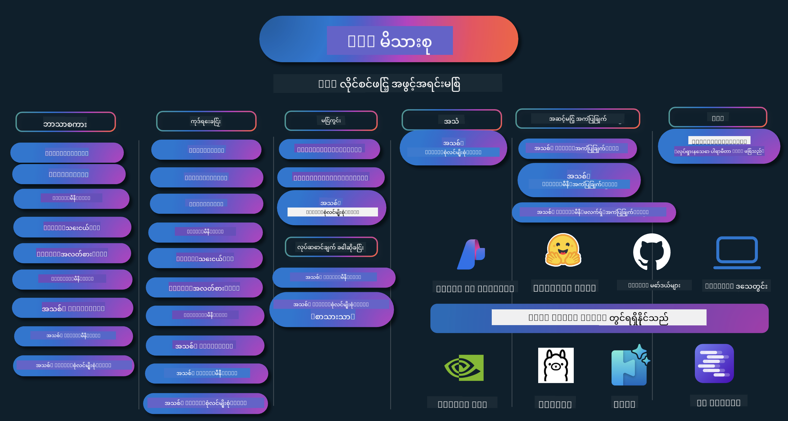

<!--
CO_OP_TRANSLATOR_METADATA:
{
  "original_hash": "ef3a50368712b1a7483d0def1f70c490",
  "translation_date": "2025-12-21T14:11:58+00:00",
  "source_file": "README.md",
  "language_code": "my"
}
-->
# Phi Cookbook: Microsoft ၏ Phi မော်ဒယ်များဖြင့် လက်တွေ့ အလုပ်လုပ်နိုင်သော ဥပမာများ

Phi သည် Microsoft မှ ဖန်တီးထားသော ဖွင့်လှစ် ရင်းမြစ် AI မော်ဒယ် စီးရီးတစ်ခုဖြစ်သည်။ 

လက်ရှိတွင် Phi သည် အင်အားရှင်ရှေ့ဆက် ရှိပြီး ကုန်ကျစရိတ်သက်သာသော သေးငယ်သော ဘာသာစကား မော်ဒယ် (SLM) တစ်ခုဖြစ်သည်။ ဘာသာစကားအမျိုးမျိုး၊ အတွေးအခေါ်နှင့် ရည်ရွယ်ချက်၊ စာသား/စကားပြော ဖန်တီးမှု၊ ကုဒ်ရေးခြင်း၊ ဓာတ်ပုံများ၊ အသံနှင့် အခြား ကိုယ်ပိုင်အခြေအနေများတွင် သတ်မှတ်ချက်များကောင်းမွန်သည်။

Phi ကို cloud သို့မဟုတ် edge စက်ပစ္စည်းများပေါ်တွင် တပ်ဆင်နိုင်ပြီး ကွန်ပျူတာစွမ်းအား ကန့်သတ်မှုရှိသော်လည်း generative AI အက်ပလီကေးရှင်းများကို လွယ်ကူစွာ တည်ဆောက်နိုင်ပါသည်။

ဤ ရင်းမြစ်များကို အသုံးပြု၍ စတင်ရန် အောက်ပါ အဆင့်များကို လိုက်နာပါ။
1. **Repository ကို Fork လုပ်ပါ**: နှိပ်ပါ 
2. **Repository ကို Clone ချပါ**:   `git clone https://github.com/microsoft/PhiCookBook.git`
3. [**Microsoft AI Discord သို့ ဝင်ပါ၊ ကျွမ်းကျင်သူများနှင့် အခြား ဖွံ့ဖြိုးသူများကို တွေ့ဆုံပါ**](https://discord.com/invite/ByRwuEEgH4?WT.mc_id=aiml-137032-kinfeylo)

### 🌐 ဘာသာစကား မျိုးစုံ အထောက်အပံ့

#### GitHub Action ဖြင့် ထောက်ပံ့ (အလိုအလျောက်နှင့် အမြဲနောက်ဆုံး)

<!-- CO-OP TRANSLATOR LANGUAGES TABLE START -->
[အာရေဗစ်](../ar/README.md) | [ဘင်္ဂါလီ](../bn/README.md) | [ဘူလ္ဂေးရီးယန်](../bg/README.md) | [မြန်မာ (Myanmar)](./README.md) | [တရုတ် (ရိုးရှင်း)](../zh/README.md) | [တရုတ် (ရိုးရာ, ဟောင်ကောင်)](../hk/README.md) | [တရုတ် (ရိုးရာ, မကာအို)](../mo/README.md) | [တရုတ် (ရိုးရာ, ထိုင္ဝမ်)](../tw/README.md) | [ခရွိုအေရှား](../hr/README.md) | [ချက်](../cs/README.md) | [ဒီနမတ်](../da/README.md) | [နယ်သာလန်](../nl/README.md) | [အက်စတိုးနီးယား](../et/README.md) | [ဖင်လန်](../fi/README.md) | [ပြင်သစ်](../fr/README.md) | [ဂျာမနီ](../de/README.md) | [ဂရိ](../el/README.md) | [ဟီဘရူး](../he/README.md) | [ဟင်ဒီ](../hi/README.md) | [ဟန်ဂေရီယန်](../hu/README.md) | [အင်ဒိုနီးရှား](../id/README.md) | [အီတလီ](../it/README.md) | [ဂျပန်](../ja/README.md) | [ကန့်နာဒါ](../kn/README.md) | [ကိုရီးယား](../ko/README.md) | [လစ်ထူးအေးနီးယား](../lt/README.md) | [မလေး](../ms/README.md) | [မလေးလမ်](../ml/README.md) | [မာရာသီ](../mr/README.md) | [နီဘေါ်လီ](../ne/README.md) | [နိုင်ဂျီးရီးယား ပစ်ဂင်](../pcm/README.md) | [နော်ဝေ](../no/README.md) | [ပါရှန် (ဖာရှီ)](../fa/README.md) | [ပိုလန်](../pl/README.md) | [ပို르တူဂီส (ဘရာဇီး)](../br/README.md) | [ပို르တူဂီส (ပိုတူဂီ)](../pt/README.md) | [ပန်ဂျာဘီ (ဂူမူခီ)](../pa/README.md) | [ရိုမေးနီးယား](../ro/README.md) | [ရုရှား](../ru/README.md) | [ဆားဘီးယား (စायरလစ်လစ်)](../sr/README.md) | [ဆလိုဗက်](../sk/README.md) | [ဆလိုවැနီးယား](../sl/README.md) | [စပိန်](../es/README.md) | [ဆွါဟီလီ](../sw/README.md) | [ဆွီဒင်](../sv/README.md) | [တာဂလိုဂ် (ဖိလစ်ပိုင်)](../tl/README.md) | [တမီးလ်](../ta/README.md) | [တယ်လူဂူ](../te/README.md) | [ထိုင်း](../th/README.md) | [တူရကီ](../tr/README.md) | [ယူကရိန်း](../uk/README.md) | [အူဒူး](../ur/README.md) | [ဗီယက်နမ်](../vi/README.md)
<!-- CO-OP TRANSLATOR LANGUAGES TABLE END -->

## အကြောင်းအရာ စာရင်း

- မိတ်ဆက်
  - [Phi မိသားစုသို့ ကြိုဆိုပါသည်](./md/01.Introduction/01/01.PhiFamily.md)
  - [သင့် ပတ်ဝန်းကျင် အဆင်သင့်ပြုခြင်း](./md/01.Introduction/01/01.EnvironmentSetup.md)
  - [အဓိက နည်းပညာများကို နားလည်ခြင်း](./md/01.Introduction/01/01.Understandingtech.md)
  - [Phi မော်ဒယ်များအတွက် AI လုံခြုံရေး](./md/01.Introduction/01/01.AISafety.md)
  - [Phi Hardware ထောက်ပံ့မှု](./md/01.Introduction/01/01.Hardwaresupport.md)
  - [Phi မော်ဒယ်များနှင့် ပလက်ဖောင်းအလိုက် ရရှိနိုင်မှု](./md/01.Introduction/01/01.Edgeandcloud.md)
  - [Guidance-ai နှင့် Phi ကို အသုံးချခြင်း](./md/01.Introduction/01/01.Guidance.md)
  - [GitHub Marketplace မော်ဒယ်များ](https://github.com/marketplace/models)
  - [Azure AI မော်ဒယ် ကတ်တလော့ဂ်](https://ai.azure.com)

- မတူညီသော ပတ်ဝန်းကျင်များတွင် Phi ကို inference ပြုလုပ်ခြင်း
    -  [Hugging face](./md/01.Introduction/02/01.HF.md)
    -  [GitHub Models](./md/01.Introduction/02/02.GitHubModel.md)
    -  [Azure AI Foundry Model Catalog](./md/01.Introduction/02/03.AzureAIFoundry.md)
    -  [Ollama](./md/01.Introduction/02/04.Ollama.md)
    -  [AI Toolkit VSCode (AITK)](./md/01.Introduction/02/05.AITK.md)
    -  [NVIDIA NIM](./md/01.Introduction/02/06.NVIDIA.md)
    -  [Foundry Local](./md/01.Introduction/02/07.FoundryLocal.md)

- Phi မိသားစုအတွက် Inference
    - [iOS တွင် Phi Inference](./md/01.Introduction/03/iOS_Inference.md)
    - [Android တွင် Phi Inference](./md/01.Introduction/03/Android_Inference.md)
    - [Jetson တွင် Phi Inference](./md/01.Introduction/03/Jetson_Inference.md)
    - [AI PC တွင် Phi Inference](./md/01.Introduction/03/AIPC_Inference.md)
    - [Apple MLX Framework ဖြင့် Phi Inference](./md/01.Introduction/03/MLX_Inference.md)
    - [Local Server တွင် Phi Inference](./md/01.Introduction/03/Local_Server_Inference.md)
    - [AI Toolkit ဖြင့် Remote Server တွင် Phi Inference](./md/01.Introduction/03/Remote_Interence.md)
    - [Rust ဖြင့် Phi Inference](./md/01.Introduction/03/Rust_Inference.md)
    - [ဒေသခံတွင် Phi--Vision Inference](./md/01.Introduction/03/Vision_Inference.md)
    - [Kaito AKS, Azure Containers ဖြင့် Phi Inference (တရားဝင် ထောက်ပံ့မှု)](./md/01.Introduction/03/Kaito_Inference.md)
-  [Phi မိသားစု အတွက် Quantifying](./md/01.Introduction/04/QuantifyingPhi.md)
    - [llama.cpp ကိုအသုံးပြုပြီး Phi-3.5 / 4 ကို Quantize ပြုလုပ်ခြင်း](./md/01.Introduction/04/UsingLlamacppQuantifyingPhi.md)
    - [onnxruntime အတွက် Generative AI extensions ကိုအသုံးပြုပြီး Phi-3.5 / 4 ကို Quantize ပြုလုပ်ခြင်း](./md/01.Introduction/04/UsingORTGenAIQuantifyingPhi.md)
    - [Intel OpenVINO အသုံးပြု၍ Phi-3.5 / 4 ကို Quantize ပြုလုပ်ခြင်း](./md/01.Introduction/04/UsingIntelOpenVINOQuantifyingPhi.md)
    - [Apple MLX Framework ကိုအသုံးပြု၍ Phi-3.5 / 4 ကို Quantize ပြုလုပ်ခြင်း](./md/01.Introduction/04/UsingAppleMLXQuantifyingPhi.md)

-  Phi အကဲဖြတ်ခြင်း
    - [တာဝန်ရှိသော AI](./md/01.Introduction/05/ResponsibleAI.md)
    - [အကဲဖြတ်ရေးအတွက် Azure AI Foundry](./md/01.Introduction/05/AIFoundry.md)
    - [အကဲဖြတ်ရေးအတွက် Promptflow ကို အသုံးပြုခြင်း](./md/01.Introduction/05/Promptflow.md)
 
- RAG နှင့် Azure AI Search
    - [Phi-4-mini နှင့် Phi-4-multimodal(RAG) ကို Azure AI Search နှင့် မည်သို့ အသုံးပြုမည်](https://github.com/microsoft/PhiCookBook/blob/main/code/06.E2E/E2E_Phi-4-RAG-Azure-AI-Search.ipynb)

- Phi အက်ပလီကေးရှင်း တိုးတက်ရေး နမူနာများ
  - စာသား & စကားပြော အက်ပလီကေးရှင်းများ
    - Phi-4 နမူနာများ 🆕
      - [📓] [Phi-4-mini ONNX မော်ဒယ်ဖြင့် စကားပြော](./md/02.Application/01.TextAndChat/Phi4/ChatWithPhi4ONNX/README.md)
      - [Phi-4 local ONNX မော်ဒယ်ဖြင့် .NET တွင် စကားပြော](../../md/04.HOL/dotnet/src/LabsPhi4-Chat-01OnnxRuntime)
      - [Semantic Kernel အသုံးပြု၍ Phi-4 ONNX ဖြင့် Chat .NET Console App](../../md/04.HOL/dotnet/src/LabsPhi4-Chat-02SK)
    - Phi-3 / 3.5 နမူနာများ
      - [Phi3၊ ONNX Runtime Web နှင့် WebGPU အသုံးပြု၍ ဘရောက်ဇာတွင် ဒေသခံ Chatbot](https://github.com/microsoft/onnxruntime-inference-examples/tree/main/js/chat)
      - [OpenVino ဖြင့် စကားပြော](./md/02.Application/01.TextAndChat/Phi3/E2E_OpenVino_Chat.md)
      - [မော်ဒယ်များစုံ - အပြန်အလှန် Phi-3-mini နှင့် OpenAI Whisper](./md/02.Application/01.TextAndChat/Phi3/E2E_Phi-3-mini_with_whisper.md)
      - [MLFlow - wrapper တစ်ခု တည်ဆောက်ခြင်းနှင့် Phi-3 ကို MLFlow နဲ့ အသုံးပြုခြင်း](./md//02.Application/01.TextAndChat/Phi3/E2E_Phi-3-MLflow.md)
      - [Model Optimization - Olive ဖြင့် ONNX Runtime Web အတွက် Phi-3-min မော်ဒယ်ကို မည်သို့ မြှင့်တင်မည်](https://github.com/microsoft/Olive/tree/main/examples/phi3)
      - [Phi-3 mini-4k-instruct-onnx ဖြင့် WinUI3 အက်ပ်](https://github.com/microsoft/Phi3-Chat-WinUI3-Sample/)
      -[WinUI3 Multi Model AI Powered Notes အက်ပ် ဥပမာ](https://github.com/microsoft/ai-powered-notes-winui3-sample)
      - [Prompt flow ဖြင့် စိတ်ကြိုက် Phi-3 မော်ဒယ်များကို Fine-tune နှင့် ပေါင်းစည်းခြင်း](./md/02.Application/01.TextAndChat/Phi3/E2E_Phi-3-FineTuning_PromptFlow_Integration.md)
      - [Azure AI Foundry တွင် Prompt flow ဖြင့် စိတ်ကြိုက် Phi-3 မော်ဒယ်များကို Fine-tune နှင့် ပေါင်းစည်းခြင်း](./md/02.Application/01.TextAndChat/Phi3/E2E_Phi-3-FineTuning_PromptFlow_Integration_AIFoundry.md)
      - [Microsoft ၏ တာဝန်ရှိသော AI စံသတ်မှတ်ချက်များကို ဦးတည်၍ Azure AI Foundry တွင် Fine-tuned Phi-3 / Phi-3.5 မော်ဒယ်ကို အကဲဖြတ်ခြင်း](./md/02.Application/01.TextAndChat/Phi3/E2E_Phi-3-Evaluation_AIFoundry.md)
      - [📓] [Phi-3.5-mini-instruct ဘာသာစကား ခန့်မှန်းမှု ဥပမာ (တရုတ်/အင်္ဂလိပ်)](./md/02.Application/01.TextAndChat/Phi3/phi3-instruct-demo.ipynb)
      - [Phi-3.5-Instruct WebGPU RAG စကားပြောဘော့](./md/02.Application/01.TextAndChat/Phi3/WebGPUWithPhi35Readme.md)
      - [Phi-3.5-Instruct ONNX ဖြင့် Prompt flow ဖြေရှင်းချက်ကို Windows GPU အသုံးပြု၍ ဖန်တီးခြင်း](./md/02.Application/01.TextAndChat/Phi3/UsingPromptFlowWithONNX.md)
      - [Microsoft Phi-3.5 tflite ကိုအသုံးပြု၍ Android အက်ပ် ဖန်တီးခြင်း](./md/02.Application/01.TextAndChat/Phi3/UsingPhi35TFLiteCreateAndroidApp.md)
      - [Microsoft.ML.OnnxRuntime ကိုအသုံးပြုပြီး ဒေသීය ONNX Phi-3 မော်ဒယ်နှင့် Q&A .NET ဥပမာ](../../md/04.HOL/dotnet/src/LabsPhi301)
      - [Semantic Kernel နှင့် Phi-3 ပါသည့် Console chat .NET အက်ပ်](../../md/04.HOL/dotnet/src/LabsPhi302)

  - Azure AI Inference SDK အခြေခံ အကုဒ် ဥပမာများ 
    - Phi-4 ဥပမာများ 🆕
      - [📓] [Phi-4-multimodal ကို အသုံးပြုပြီး ပရောဂျက်ကုဒ် ထုတ်ယူခြင်း](./md/02.Application/02.Code/Phi4/GenProjectCode/README.md)
    - Phi-3 / 3.5 ဥပမာများ
      - [သင့်ကိုယ်ပိုင် Visual Studio Code GitHub Copilot Chat ကို Microsoft Phi-3 Family ဖြင့် တည်ဆောက်ခြင်း](./md/02.Application/02.Code/Phi3/VSCodeExt/README.md)
      - [GitHub Models မှ Phi-3.5 ဖြင့် သင့်ရဲ့ Visual Studio Code Chat Copilot Agent ကို ဖန်တီးခြင်း](/md/02.Application/02.Code/Phi3/CreateVSCodeChatAgentWithGitHubModels.md)

  - အဆင့်မြင့် အတွေးအခေါ် ဥပမာများ
    - Phi-4 ဥပမာများ 🆕
      - [📓] [Phi-4-mini-reasoning သို့မဟုတ် Phi-4-reasoning ဥပမာများ](./md/02.Application/03.AdvancedReasoning/Phi4/AdvancedResoningPhi4mini/README.md)
      - [📓] [Microsoft Olive ဖြင့် Phi-4-mini-reasoning ကို Fine-tuning ပြုလုပ်ခြင်း](./md/02.Application/03.AdvancedReasoning/Phi4/AdvancedResoningPhi4mini/olive_ft_phi_4_reasoning_with_medicaldata.ipynb)
      - [📓] [Apple MLX ဖြင့် Phi-4-mini-reasoning ကို Fine-tuning ပြုလုပ်ခြင်း](./md/02.Application/03.AdvancedReasoning/Phi4/AdvancedResoningPhi4mini/mlx_ft_phi_4_reasoning_with_medicaldata.ipynb)
      - [📓] [GitHub Models ဖြင့် Phi-4-mini-reasoning](./md/02.Application/02.Code/Phi4r/github_models_inference.ipynb)
      - [📓] [Azure AI Foundry Models ဖြင့် Phi-4-mini-reasoning](./md/02.Application/02.Code/Phi4r/azure_models_inference.ipynb)
  - Demos
      - [Hugging Face Spaces တွင် ဟော့စ်ထားသော Phi-4-mini ဒီမိုများ](https://huggingface.co/spaces/microsoft/phi-4-mini?WT.mc_id=aiml-137032-kinfeylo)
      - [Hugginge Face Spaces တွင် ဟော့စ်ထားသော Phi-4-multimodal ဒီမိုများ](https://huggingface.co/spaces/microsoft/phi-4-multimodal?WT.mc_id=aiml-137032-kinfeylo)
  - ဗစ်ရှင်း ဥပမာများ
    - Phi-4 ဥပမာများ 🆕
      - [📓] [Phi-4-multimodal ကို အသုံးပြုပြီး ပုံများ ဖတ်၍ ကုဒ် ဖန်တီးခြင်း](./md/02.Application/04.Vision/Phi4/CreateFrontend/README.md) 
    - Phi-3 / 3.5 ဥပမာများ
      -  [📓][Phi-3-vision - ပုံမှ စာသား သို့ စာသား ပြောင်းရန်](./md/02.Application/04.Vision/Phi3/E2E_Phi-3-vision-image-text-to-text-online-endpoint.ipynb)
      - [Phi-3-vision-ONNX](https://onnxruntime.ai/docs/genai/tutorials/phi3-v.html)
      - [📓][Phi-3-vision CLIP Embedding](./md/02.Application/04.Vision/Phi3/E2E_Phi-3-vision-image-text-to-text-online-endpoint.ipynb)
      - [DEMO: Phi-3 Recycling](https://github.com/jennifermarsman/PhiRecycling/)
      - [Phi-3-vision - Visual language assistant - Phi3-Vision နှင့် OpenVINO ဖြင့်](https://docs.openvino.ai/nightly/notebooks/phi-3-vision-with-output.html)
      - [Phi-3 Vision Nvidia NIM](./md/02.Application/04.Vision/Phi3/E2E_Nvidia_NIM_Vision.md)
      - [Phi-3 Vision OpenVino](./md/02.Application/04.Vision/Phi3/E2E_OpenVino_Phi3Vision.md)
      - [📓][Phi-3.5 Vision multi-frame သို့မဟုတ် multi-image ဥပမာ](./md/02.Application/04.Vision/Phi3/phi3-vision-demo.ipynb)
      - [Microsoft.ML.OnnxRuntime .NET ကို အသုံးပြုပြီး ဒေသဆိုင်ရာ Phi-3 Vision ONNX မော်ဒယ်](../../md/04.HOL/dotnet/src/LabsPhi303)
      - [မီနူး အခြေပြု Phi-3 Vision ဒေသীয় ONNX မော်ဒယ် Microsoft.ML.OnnxRuntime .NET ဖြင့်](../../md/04.HOL/dotnet/src/LabsPhi304)

  - သင်္ချာ ဥပမာများ
    -  Phi-4-Mini-Flash-Reasoning-Instruct ဥပမာများ 🆕 [Phi-4-Mini-Flash-Reasoning-Instruct ဖြင့် သင်္ချာ ဒီမို](./md/02.Application/09.Math/MathDemo.ipynb)

  - အသံ ဥပမာများ
    - Phi-4 ဥပမာများ 🆕
      - [📓] [Phi-4-multimodal ကို အသုံးပြုပြီး အသံစာတမ်းများ ထုတ်ယူခြင်း](./md/02.Application/05.Audio/Phi4/Transciption/README.md)
      - [📓] [Phi-4-multimodal အသံ ဥပမာ](./md/02.Application/05.Audio/Phi4/Siri/demo.ipynb)
      - [📓] [Phi-4-multimodal စကားပြော ဘာသာပြန် ဥပမာ](./md/02.Application/05.Audio/Phi4/Translate/demo.ipynb)
      - [.NET console အက်ပ် - Phi-4-multimodal အသံကိုအသုံးပြုပြီး အသံဖိုင်ကို သုံးသပ်၍ transcript ဖန်တီးခြင်း](../../md/04.HOL/dotnet/src/LabsPhi4-MultiModal-02Audio)

  - MOE ဥပမာများ
    - Phi-3 / 3.5 ဥပမာများ
      - [📓] [Phi-3.5 Mixture of Experts Models (MoEs) လူမှုမီဒီယာ ဥပမာ](./md/02.Application/06.MoE/Phi3/phi3_moe_demo.ipynb)
      - [📓] [NVIDIA NIM Phi-3 MOE, Azure AI Search နှင့် LlamaIndex ကို သုံးပြီး Retrieval-Augmented Generation (RAG) Pipeline တည်ဆောက်ခြင်း](./md/02.Application/06.MoE/Phi3/azure-ai-search-nvidia-rag.ipynb)
      - 
  - Function Calling ဥပမာများ
    - Phi-4 ဥပမာများ 🆕
      -  [📓] [Phi-4-mini နှင့် Function Calling ကို အသုံးပြုခြင်း](./md/02.Application/07.FunctionCalling/Phi4/FunctionCallingBasic/README.md)
      -  [📓] [Phi-4-mini ဖြင့် multi-agents ဖန်တီးရန် Function Calling အသုံးပြုခြင်း](./md/02.Application/07.FunctionCalling/Phi4/Multiagents/Phi_4_mini_multiagent.ipynb)
      -  [📓] [Ollama နှင့် အတူ Function Calling အသုံးပြုခြင်း](./md/02.Application/07.FunctionCalling/Phi4/Ollama/ollama_functioncalling.ipynb)
      -  [📓] [ONNX နှင့် Function Calling အသုံးပြုခြင်း](../../md/02.Application/07.FunctionCalling/Phi4/ONNX/onnx_parallel_functioncalling_ipynb)
  - Multimodal Mixing ဥပမာများ
    - Phi-4 ဥပမာများ 🆕
      -  [📓] [နည်းပညာ သတင်းထောက်အဖြစ် Phi-4-multimodal ကို အသုံးပြုခြင်း](../../md/02.Application/08.Multimodel/Phi4/TechJournalist/phi_4_mm_audio_text_publish_news_ipynb)
      - [.NET console အက်ပ် - Phi-4-multimodal ကို အသုံးပြုပြီး ပုံများ ကို ခွဲခြမ်းစိတ်ဖြာခြင်း](../../md/04.HOL/dotnet/src/LabsPhi4-MultiModal-01Images)

- Phi မော်ဒယ်များ Fine-tuning
  - [Fine-tuning ဖြစ်စဉ်များ](./md/03.FineTuning/FineTuning_Scenarios.md)
  - [Fine-tuning နှင့် RAG တို့၏ ကြားကွာခြားချက်](./md/03.FineTuning/FineTuning_vs_RAG.md)
  - [Fine-tuning - Phi-3 ကို စက်မှုလုပ်ငန်း ကျွမ်းကျင်သူအဖြစ် ဖြစ်လာစေခြင်း](./md/03.FineTuning/LetPhi3gotoIndustriy.md)
  - [VS Code အတွက် AI Toolkit ဖြင့် Phi-3 ကို Fine-tuning ပြုလုပ်ခြင်း](./md/03.FineTuning/Finetuning_VSCodeaitoolkit.md)
  - [Azure Machine Learning Service ဖြင့် Phi-3 ကို Fine-tuning ပြုလုပ်ခြင်း](./md/03.FineTuning/Introduce_AzureML.md)
  - [Lora ဖြင့် Phi-3 ကို Fine-tuning ပြုလုပ်ခြင်း](./md/03.FineTuning/FineTuning_Lora.md)
  - [QLora ဖြင့် Phi-3 ကို Fine-tuning ပြုလုပ်ခြင်း](./md/03.FineTuning/FineTuning_Qlora.md)
  - [Azure AI Foundry ဖြင့် Phi-3 ကို Fine-tuning ပြုလုပ်ခြင်း](./md/03.FineTuning/FineTuning_AIFoundry.md)
  - [Azure ML CLI/SDK ဖြင့် Phi-3 ကို Fine-tuning ပြုလုပ်ခြင်း](./md/03.FineTuning/FineTuning_MLSDK.md)
  - [Microsoft Olive ဖြင့် Fine-tuning ပြုလုပ်ခြင်း](./md/03.FineTuning/FineTuning_MicrosoftOlive.md)
  - [Microsoft Olive Hands-On Lab ဖြင့် Fine-tuning လေ့ကျင့်ခန်း](./md/03.FineTuning/olive-lab/readme.md)
  - [Weights and Bias ဖြင့် Phi-3-vision ကို Fine-tuning ပြုလုပ်ခြင်း](./md/03.FineTuning/FineTuning_Phi-3-visionWandB.md)
  - [Apple MLX Framework ဖြင့် Phi-3 ကို Fine-tuning ပြုလုပ်ခြင်း](./md/03.FineTuning/FineTuning_MLX.md)
  - [Phi-3-vision ကို Fine-tuning ပြုလုပ်ခြင်း (တရားဝင် ထောက်ခံချက်)](./md/03.FineTuning/FineTuning_Vision.md)
  - [Kaito AKS နှင့် Azure Containers ဖြင့် Phi-3 ကို Fine-Tuning (တရားဝင် ထောက်ခံချက်)](./md/03.FineTuning/FineTuning_Kaito.md)
  - [Phi-3 နှင့် 3.5 Vision များကို Fine-Tuning](https://github.com/2U1/Phi3-Vision-Finetune)

- လက်တွေ့ လေ့ကျင့်ခန်း
  - [နောက်ဆုံးပေါ် မော်ဒယ်များကို ရှာဖွေခြင်း: LLMs, SLMs, ဒေသဆိုင်ရာ ဖွံ့ဖြိုးမှု နှင့် အခြားများ](https://github.com/microsoft/aitour-exploring-cutting-edge-models)
  - [NLP စွမ်းရည်များ ကို ဖွင့်ချခြင်း: Microsoft Olive ဖြင့် Fine-Tuning](https://github.com/azure/Ignite_FineTuning_workshop)

- အတက္ကသိုလ် သုတေသန စာတမ်းများ နှင့် ထုတ်ဝေစာများ
  - [Textbooks Are All You Need II: phi-1.5 နည်းပညာ အစီရင်ခံစာ](https://arxiv.org/abs/2309.05463)
  - [Phi-3 နည်းပညာအစီရင်ခံစာ: သင်၏ ဖုန်းပေါ်တွင် ဒေသဆိုင်ရာ အလွန်ထင်ရှားစွမ်းဆောင်ရည်ရှိသော ဘာသာစကား မော်ဒယ်](https://arxiv.org/abs/2404.14219)
  - [Phi-4 နည်းပညာအစီရင်ခံစာ](https://arxiv.org/abs/2412.08905)
  - [Phi-4-Mini Technical Report: Mixture-of-LoRAs ဖြင့် သေးသိပ်သော်လည်း အင်အားပြင်းသော မော်ဒယ်များ](https://arxiv.org/abs/2503.01743)
  - [ယာဉ်အတွင်း Function-Calling အတွက် သေးငယ်သော ဘာသာစကား မော်ဒယ်များကို ထိရောက်စေရန် ညွှန်ကြားချက်များ](https://arxiv.org/abs/2501.02342)
  - [(WhyPHI) PHI-3 ကို Multiple-Choice မေးခွန်း ဖြေဆိုရန် Fine-Tuning: နည်းစနစ်များ၊ ရလဒ်များနှင့် စိန်ခေါ်မှုများ](https://arxiv.org/abs/2501.01588)
  - [Phi-4-reasoning နည်းပညာအစီရင်ခံစာ](https://www.microsoft.com/en-us/research/wp-content/uploads/2025/04/phi_4_reasoning.pdf)
  - [Phi-4-mini-reasoning နည်းပညာအစီရင်ခံစာ](https://huggingface.co/microsoft/Phi-4-mini-reasoning/blob/main/Phi-4-Mini-Reasoning.pdf)

## Phi မော်ဒယ်များကို အသုံးပြုခြင်း

### Azure AI Foundry တွင် Phi

Microsoft Phi ကို မည်သို့ အသုံးပြုရမည်နှင့် သင့်၏ မတူညီသော ဟာ့ဒ်ဝဲ စက်ပစ္စည်းများပေါ်တွင် E2E ဖြေရှင်းချက်များကို မည်သို့ တည်ဆောက်မည်ကို သင်လေ့လာနိုင်သည်။ Phi ကို ကိုယ်တိုင် စမ်းသပ်လိုပါက မော်ဒယ်များနှင့် ကစားပြီး သင့်ရည်ရွယ်ချက်များအတွက် Phi ကို စိတ်ကြိုက်ပြင်ဆင်ခြင်းဖြင့် စတင်ပါ။ စတင်ရန် [Azure AI Foundry Azure AI Model Catalog](https://aka.ms/phi3-azure-ai) ကို အသုံးပြုနိုင်ပြီး ပိုမိုသိရှိလိုပါက [Azure AI Foundry](/md/02.QuickStart/AzureAIFoundry_QuickStart.md) ဖြင့် စတင်ရန် စာမျက်နှာကို ကြည့်ပါ။

**ကစားကွင်း**
မော်ဒယ်တိုင်းတွင် မော်ဒယ်ကို စမ်းသပ်ရန် သီးသန့် ကစားကွင်း တစ်ခုရှိသည် [Azure AI Playground](https://aka.ms/try-phi3).

### GitHub Models တွင် Phi

Microsoft Phi ကို မည်သို့ အသုံးပြုရမည်နှင့် သင့်၏ မတူညီသော ဟာ့ဒ်ဝဲ စက်ပစ္စည်းများပေါ်တွင် E2E ဖြေရှင်းချက်များကို မည်သို့ တည်ဆောက်မည်ကို သင်လေ့လာနိုင်သည်။ Phi ကို ကိုယ်တိုင် အတွေ့အကြုံယူလိုပါက မော်ဒယ်နှင့် ကစားပြီး သင့် ရည်ရွယ်ချက်များအတွက် Phi ကို စိတ်ကြိုက်ပြင်ဆင်နိုင်သည်။ စတင်ရန် [GitHub Model Catalog](https://github.com/marketplace/models?WT.mc_id=aiml-137032-kinfeylo) ကို အသုံးပြုနိုင်ပြီး ပိုမိုသိရှိလိုပါက Getting Started with [GitHub Model Catalog](/md/02.QuickStart/GitHubModel_QuickStart.md) ကို ကြည့်ပါ။

**ကစားကွင်း**
မော်ဒယ်တိုင်းတွင် သီးသန့် [မော်ဒယ်ကို စမ်းသပ်ရန် ကစားကွင်း](/md/02.QuickStart/GitHubModel_QuickStart.md) ရှိသည်။

### Hugging Face တွင် Phi

မော်ဒယ်ကို [Hugging Face](https://huggingface.co/microsoft) တွင်လည်း ရှာဖွေနိုင်ပါသည်။

**ကစားကွင်း**
[Hugging Chat ကစားကွင်း](https://huggingface.co/chat/models/microsoft/Phi-3-mini-4k-instruct)

 ## 🎒 အခြားသင်တန်းများ

ကျွန်ုပ်တို့ အဖွဲ့က အခြားသင်တန်းများကို ထုတ်လုပ်ထားသည်! ကြည့်ရှုပါ။

<!-- CO-OP TRANSLATOR OTHER COURSES START -->
### LangChain

---

### Azure / Edge / MCP / Agents

---
 
### Generative AI Series

[-9333EA?style=for-the-badge&labelColor=E5E7EB&color=9333EA)](https://github.com/microsoft/Generative-AI-for-beginners-dotnet?WT.mc_id=academic-105485-koreyst)
[-C084FC?style=for-the-badge&labelColor=E5E7EB&color=C084FC)](https://github.com/microsoft/generative-ai-for-beginners-java?WT.mc_id=academic-105485-koreyst)
[-E879F9?style=for-the-badge&labelColor=E5E7EB&color=E879F9)](https://github.com/microsoft/generative-ai-with-javascript?WT.mc_id=academic-105485-koreyst)

---
 
### Core Learning

---
 
### Copilot Series

<!-- CO-OP TRANSLATOR OTHER COURSES END -->

## တာဝန်ရှိသော AI

Microsoft သည် ဖောက်သည်များအား ကျွန်ုပ်တို့၏ AI ထုတ်ကုန်များကို တာဝန်ရှိစွာ အသုံးချနိုင်ရန် ကူညီပေးခြင်း၊ လေ့လာချက်များကို မျှဝေခြင်းနှင့် Transparency Notes နှင့် Impact Assessments ကဲ့သို့သော ကိရိယာများဖြင့် ယုံကြည်မှုအခြေပြု မိတ်ဖက်ဆက်ဆံရေးများကို တည်ဆောက်ပေးရန် ပူးပေါင်းဆောင်ရွက်နေပါသည်။ ဤအရင်းအမြစ်များအများစုကို [https://aka.ms/RAI](https://aka.ms/RAI) တွင် တွေ့နိုင်ပါသည်။
Microsoft ၏ တာဝန်ရှိသော AI သဘောတရားသည် တရားမျှတမှု၊ ယုံကြည်ရမှုနှင့် လုံခြုံမှု၊ ကိုယ်ရေးကိုယ်တာနှင့် လုံခြုံရေး၊ ပါဝင်မှု၊ မြင်သာမှုနှင့် တာဝန်ယူမှုတို့ကို အခြေခံသည်။

ဤ နမူနာတွင် အသုံးပြုထားသော ကြီးမားသော သဘာဝဘာသာစကား၊ ပုံနှင့် အသံ မော်ဒယ်များသည် အချို့အခါ မတရားသော၊ ယုံကြည်စိတ်မရှိသော သို့မဟုတ် ထိခိုက်စေသော အပြုအမူများ ပြုလုပ်နိုင်ပြီး ထိုကြောင့် ထိခိုက်မှုများ ဖြစ်ပေါ်နိုင်သည်။ အန္တရာယ်များနှင့် ကန့်သတ်ချက်များအောက်တွင် သတင်းအချက်အလက် ရရှိရန် [Azure OpenAI service Transparency note](https://learn.microsoft.com/legal/cognitive-services/openai/transparency-note?tabs=text) ကို ကြည့်ပါ။

ဤအန္တရာယ်များကို လျော့ချရန်အတွက် အကြံပြုထားသော နည်းလမ်းမှာ သင့်စနစ်ဖွဲ့စည်းမှုတွင် ပထမကာကွယ်ရေး စနစ်တစ်ခု ထည့်သွင်း၍ ထိခိုက်စေနိုင်သည့် အပြုအမူများကို ရှာဖွေတားဆီးနိုင်စေရန်ဖြစ်သည်။ [Azure AI Content Safety](https://learn.microsoft.com/azure/ai-services/content-safety/overview) သည် လွတ်လပ်သော အကာအကွယ် အလွှာကို ထောက်ပံ့ပေးကာ အပလီကေးရှင်းများနှင့် ဝန်ဆောင်မှုများ၌ အသုံးပြုသူဖန်တီးထားသောနှင့် AI ဖန်တီးထားသော ထိခိုက်စေနိုင်သော အကြောင်းအရာများကို ရှာဖွေနိုင်သည်။ Azure AI Content Safety သည် ထိခိုက်စေနိုင်သော အကြောင်းအရာများကို စစ်ဆေးရန် စာသားနှင့် ပုံ API များကို ပါဝင်ကူညီပေးသည်။ Azure AI Foundry အတွင်း၌ Content Safety ဝန်ဆောင်မှုသည် မတူကွဲပြားသော မော်ဒယ်များအတွင်း ထိခိုက်စေနိုင်သော အကြောင်းအရာများကို ရှာဖွေရန်နှင့် စမ်းသပ်ရန် ဥပမာကုဒ်များကို ကြည့်ရှု၊ စူးစမ်းနှင့် လက်တွေ့ အသုံးပြုနိုင်စေသည်။ အောက်ပါ [quickstart documentation](https://learn.microsoft.com/azure/ai-services/content-safety/quickstart-text?tabs=visual-studio%2Clinux&pivots=programming-language-rest) သည် ၎င်းဝန်ဆောင်မှုသို့ တောင်းဆိုမှုများ ဆောင်ရွက်ပုံကို လမ်းညွန်ပေးပါသည်။

တခြားစိတ်စေ့ဖို့ယူရမည့် အချက်မှာ အကယ်၍ မျိုးစုံမော်ဒယ်နှင့် မျိုးစုံစာရင်းမော်ဒယ်များကို အသုံးပြုသော အပလီကေးရှင်းများတွင် မူလအားဖြင့် စနစ်သည် သင်နှင့် သင့်အသုံးပြုသူများ မျှော်မွန်းသလို ပြုလုပ်နိုင်ရမည်ဟု အဆိုပါလုပ်ဆောင်မှုကို အဓိပ္ပာယ်ရသည်၊ ထို့အပြင် ထိခိုက်စေသော ထုတ်လွှင့်ချက်များ မထုတ်ရန်လည်း ပါဝင်သည်။ သင့်အပလီကေးရှင်း၏ ပေါင်းစုံလုပ်ဆောင်မှုကို [Performance and Quality and Risk and Safety evaluators](https://learn.microsoft.com/azure/ai-studio/concepts/evaluation-metrics-built-in) ကို အသုံးပြု၍ တိုင်းတာခြင်း အရေးကြီးသည်။ သင်သည် [custom evaluators](https://learn.microsoft.com/azure/ai-studio/how-to/develop/evaluate-sdk#custom-evaluators) များကိုဖန်တီး၍ အကဲဖြတ်နိုင်ပါသည်။

သင့် AI အက်ပ်ကို ဖွံ့ဖြိုးရေး ပတ်ဝန်းကျင်တွင် [Azure AI Evaluation SDK](https://microsoft.github.io/promptflow/index.html) ဖြင့် အကဲဖြတ်နိုင်သည်။ စမ်းသပ်ရေး ဒေတာစုစည်းတိုင်း သို့မဟုတ် လक्षितချက် တစ်ခုကို အသေးစိတ် ပေးလိုက်ပါက သင့် generative AI အက်ပ်၏ စီမံထုတ်လုပ်ချက်များကို built-in evaluators သို့မဟုတ် သင်ရွေးချယ်ထားသည့် custom evaluators များဖြင့် အရေအတွက်အရ တိုင်းတာနိုင်ပါသည်။ စနစ်ကို အကဲဖြတ်ရန် azure ai evaluation sdk နှင့် စတင်လိုပါက [quickstart guide](https://learn.microsoft.com/azure/ai-studio/how-to/develop/flow-evaluate-sdk) ကို လိုက်နာပါ။ အကဲဖြတ် run တစ်ခုကို အကောင်အထည်ဖော်လျှင် [Azure AI Foundry တွင် ရလဒ်များကို မြင်ကွင်းဆန်းကြည့်နိုင်ပါသည်](https://learn.microsoft.com/azure/ai-studio/how-to/evaluate-flow-results)။

## ကုန်အမှတ်တံဆိပ်များ
ဤပရောဂျက်တွင် ပရောဂျက်များ၊ ထုတ်ကုန်များ သို့မဟုတ် ဝန်ဆောင်မှုများနှင့် ဆိုင်သော ကုန်အမှတ်တံဆိပ်များ သို့မဟုတ် လိုဂိုများ ပါဝင်နိုင်သည်။ ခွင့်ပြုချက်ရရှိသော Microsoft ၏ ကုန်အမှတ်တံဆိပ်များ သို့မဟုတ် လိုဂိုများ အသုံးပြုခြင်းသည် [Microsoft ၏ ကုန်အမှတ်တံဆိပ်နှင့် အမှတ်တံဆိပ် လမ်းညွှန်ချက်များ](https://www.microsoft.com/legal/intellectualproperty/trademarks/usage/general) အတိုင်းသာ လိုက်နာရမည်။  
ဤပရောဂျက်ကို ပြင်ဆင်ပြောင်းလဲထားသော ဗားရှင်းများတွင် Microsoft ၏ ကုန်အမှတ်တံဆိပ်များ သို့မဟုတ် လိုဂိုများကို အသုံးပြုရာတွင် ရှုပ်ထွေးမှုဖြစ်ပေါ်စေရန် သို့မဟုတ် Microsoft ပံ့ပိုးနေကြောင်း ထင်မြင်စေသည့် အခြေအနေ မဖြစ်စေရန် ဂရုစိုက်ရမည်။ တတိယပါတီများ၏ ကုန်အမှတ်တံဆိပ်များ သို့မဟုတ် လိုဂိုများကို အသုံးပြုခြင်းသည် ထိုတတိယပါတီများ၏ မူဝါဒများအတိုင်းသာ ဖြစ်မည်။

## ကူညီမှု ရယူရန်

AI အက်ပ်များ တည်ဆောက်ရာတွင် အခက်အခဲတွေ့ပါက သို့မဟုတ် မေးခွန်းများရှိပါက ပါဝင်ဆောင်ရွက်ရန်:

ထုတ်ကုန်အတွက် တုံ့ပြန်ချက်များ သို့မဟုတ် တည်ဆောက်စဉ် အမှားများရှိပါက အောက်ပါနေရာကို သွားကြည့်ပါ:

---

<!-- CO-OP TRANSLATOR DISCLAIMER START -->
ငြင်းပယ်ချက်
ဤစာတမ်းကို AI ဘာသာပြန်ဝန်ဆောင်မှုဖြစ်သည့် [Co-op Translator](https://github.com/Azure/co-op-translator) ဖြင့် ဘာသာပြန်ထားပါသည်။ တိကျမှန်ကန်မှုအတွက် ကြိုးပမ်းထားသော်လည်း အလိုအလျောက် ဘာသာပြန်ချက်များတွင် အမှား သို့မဟုတ် မှားယွင်းချက်များ ပါဝင်နိုင်ကြောင်း ကျေးဇူးပြု၍ သတိပြုပါ။ မူလစာတမ်းကို မူရင်းဘာသာဖြင့်သာ တရားဝင် အာဏာရှိသော ရင်းမြစ်အဖြစ် သတ်မှတ်ရပါမည်။ အရေးကြီးသော အချက်အလက်များအတွက် ပရော်ဖက်ရှင်နယ် လူ့ဘာသာပြန်ဝန်ဆောင်မှုကို အသုံးပြုရန် အကြံပြုပါသည်။ ဤဘာသာပြန်ချက်ကို အသုံးပြုခြင်းကြောင့် ဖြစ်ပေါ်နိုင်သည့် နားမလည်မှုများ သို့မဟုတ် အဓိပ္ပာယ်မှားဖော်ပြချက်များအတွက် ကျွန်ုပ်တို့သည် တာဝန်မယူပါကြောင်း အသိပေးပါသည်။
<!-- CO-OP TRANSLATOR DISCLAIMER END -->