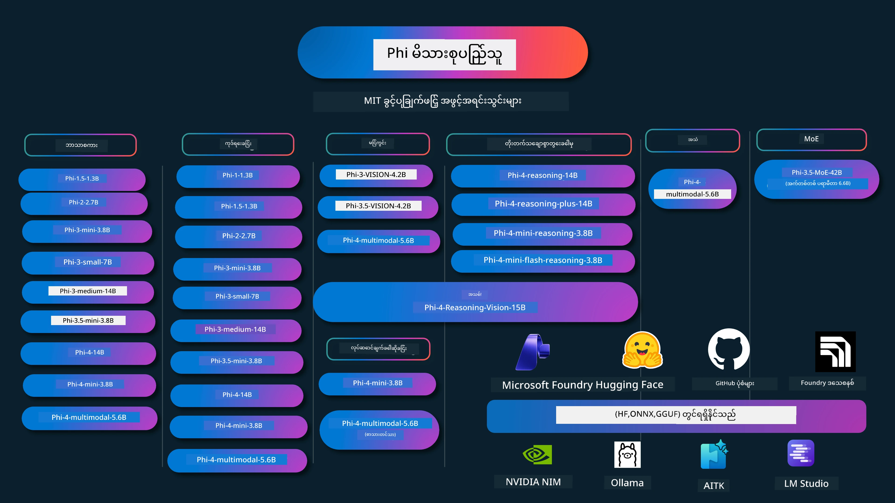

# Phi စားပွဲစာအုပ်: Microsoft ရဲ့ Phi မော်ဒယ်များနှင့် လက်တွေ့ အထောက်အထားများ

[](https://codespaces.new/microsoft/phicookbook)
[](https://vscode.dev/redirect?url=vscode://ms-vscode-remote.remote-containers/cloneInVolume?url=https://github.com/microsoft/phicookbook)

[](https://GitHub.com/microsoft/phicookbook/graphs/contributors/?WT.mc_id=aiml-137032-kinfeylo)
[](https://GitHub.com/microsoft/phicookbook/issues/?WT.mc_id=aiml-137032-kinfeylo)
[](https://GitHub.com/microsoft/phicookbook/pulls/?WT.mc_id=aiml-137032-kinfeylo)
[](http://makeapullrequest.com?WT.mc_id=aiml-137032-kinfeylo)

[](https://GitHub.com/microsoft/phicookbook/watchers/?WT.mc_id=aiml-137032-kinfeylo)
[](https://GitHub.com/microsoft/phicookbook/network/?WT.mc_id=aiml-137032-kinfeylo)
[](https://GitHub.com/microsoft/phicookbook/stargazers/?WT.mc_id=aiml-137032-kinfeylo)

[](https://discord.com/invite/ByRwuEEgH4)

Phi သည် Microsoft မှ ဖန်တီးထားသော ပြည့်ဝသော မြှင့်တင်မှု AI မော်ဒယ် စီးရီးဖြစ်သည်။

Phi သည် လက်ရှိတွင် အများဆုံးစွမ်းဆောင်ရည်ရှိပြီး ကုန်ကျစရိတ်တွက် ပြီးသော သေးငယ်သော ဘာသာစကားမော်ဒယ်(SLM) ဖြစ်ပြီး၊ ဘာသာစကားများစွာ၊ မှတ်ချက်ပေးခြင်း၊ စာသား/စကားပြော များထုတ်လုပ်ခြင်း၊ ကုဒ်ရေးခြင်း၊ ရုပ်ပုံ၊ အသံနှင့် အခြားဖြစ်ရပ်များတွင် အလွန်ကောင်းမွန်သော စမ်းသပ်မှုများရှိပါသည်။

Phi ကို ကောင်းကင် မိုဃ်းဆီသို့ သို့မဟုတ် အနားတွင် ကြိုးမဲ့စက်ပစ္စည်းများတွင် တပ်ဆင်နိုင်ပြီး၊ ကွန်ပျူတာ စွမ်းအားကန့်သတ်ချက်နည်းပါးသည့် အခြေအနေတွင် generative AI အက်ပလီကေးရှင်းများ လွယ်ကူစွာ တည်ဆောက်နိုင်ပါသည်။

ဤ စနစ်များကို အသုံးပြုရန် အစပြုခြင်းအတွက် အောက်ပါအဆင့်များကိုလိုက်နာပါ -
1. **Repository ကို Fork လုပ်ပါ**: နှိပ်ပါ [](https://GitHub.com/microsoft/phicookbook/network/?WT.mc_id=aiml-137032-kinfeylo)
2. **Repository ကို Clone လုပ်ပါ**: `git clone https://github.com/microsoft/PhiCookBook.git`
3. [**Microsoft AI Discord နဲ့ ထပ်တူဆောင်ရွက်သူများနှင့် တွေ့ဆုံဖို့ လက်ခံပါ**](https://discord.com/invite/ByRwuEEgH4?WT.mc_id=aiml-137032-kinfeylo)



### 🌐 ဘာသာစကားများစွာ ထောက်ပံ့မှု

#### GitHub Action ဖြင့် ထောက်ပံ့သည် (အလိုအလျောက်နှင့် အမြဲနောက်ဆုံးပေါ်ဖြစ်နေသည်)

<!-- CO-OP TRANSLATOR LANGUAGES TABLE START -->
[Arabic](../ar/README.md) | [Bengali](../bn/README.md) | [Bulgarian](../bg/README.md) | [Burmese (Myanmar)](./README.md) | [Chinese (Simplified)](../zh-CN/README.md) | [Chinese (Traditional, Hong Kong)](../zh-HK/README.md) | [Chinese (Traditional, Macau)](../zh-MO/README.md) | [Chinese (Traditional, Taiwan)](../zh-TW/README.md) | [Croatian](../hr/README.md) | [Czech](../cs/README.md) | [Danish](../da/README.md) | [Dutch](../nl/README.md) | [Estonian](../et/README.md) | [Finnish](../fi/README.md) | [French](../fr/README.md) | [German](../de/README.md) | [Greek](../el/README.md) | [Hebrew](../he/README.md) | [Hindi](../hi/README.md) | [Hungarian](../hu/README.md) | [Indonesian](../id/README.md) | [Italian](../it/README.md) | [Japanese](../ja/README.md) | [Kannada](../kn/README.md) | [Khmer](../km/README.md) | [Korean](../ko/README.md) | [Lithuanian](../lt/README.md) | [Malay](../ms/README.md) | [Malayalam](../ml/README.md) | [Marathi](../mr/README.md) | [Nepali](../ne/README.md) | [Nigerian Pidgin](../pcm/README.md) | [Norwegian](../no/README.md) | [Persian (Farsi)](../fa/README.md) | [Polish](../pl/README.md) | [Portuguese (Brazil)](../pt-BR/README.md) | [Portuguese (Portugal)](../pt-PT/README.md) | [Punjabi (Gurmukhi)](../pa/README.md) | [Romanian](../ro/README.md) | [Russian](../ru/README.md) | [Serbian (Cyrillic)](../sr/README.md) | [Slovak](../sk/README.md) | [Slovenian](../sl/README.md) | [Spanish](../es/README.md) | [Swahili](../sw/README.md) | [Swedish](../sv/README.md) | [Tagalog (Filipino)](../tl/README.md) | [Tamil](../ta/README.md) | [Telugu](../te/README.md) | [Thai](../th/README.md) | [Turkish](../tr/README.md) | [Ukrainian](../uk/README.md) | [Urdu](../ur/README.md) | [Vietnamese](../vi/README.md)

> **တစ်ကိုယ်တည်း ဒေါင်းလုပ်လုပ်လိုပါသလား?**
>
> ဤ repository တွင် ဘာသာစကား ၅၀ ကျော်ကို ဘာသာပြန်ထားသောကြောင့် ဒေါင်းလုပ်အရွယ်အစား မြင့်မားပါသည်။ ဘာသာပြန်မှုများမပါဘဲ clone လုပ်ရန် sparse checkout ကို အသုံးပြုနိုင်ပါသည်။
>
> **Bash / macOS / Linux:**
> ```bash
> git clone --filter=blob:none --sparse https://github.com/microsoft/PhiCookBook.git
> cd PhiCookBook
> git sparse-checkout set --no-cone '/*' '!translations' '!translated_images'
> ```
>
> **CMD (Windows):**
> ```cmd
> git clone --filter=blob:none --sparse https://github.com/microsoft/PhiCookBook.git
> cd PhiCookBook
> git sparse-checkout set --no-cone "/*" "!translations" "!translated_images"
> ```
>
> ဒါကြောင့် သင့်အတွက် လိုအပ်သမျှအရာအားလုံးကို ပိုမိုလျင်မြန်စွာ ဒေါင်းလုပ်လုပ်နိုင်မည်ဖြစ်သည်။
<!-- CO-OP TRANSLATOR LANGUAGES TABLE END -->

## အကြောင်းအရာ စာရင်း

- အစပြုချက်
  - [Phi မိသားစုမှ ကြိုဆိုပါတယ်](./md/01.Introduction/01/01.PhiFamily.md)
  - [သင်၏ ပတ်ဝန်းကျင်ကို အဆင်သင့် ပြုလုပ်ခြင်း](./md/01.Introduction/01/01.EnvironmentSetup.md)
  - [အဓိက နည်းပညာများကို နားလည်ခြင်း](./md/01.Introduction/01/01.Understandingtech.md)
  - [Phi မော်ဒယ်များအတွက် AI ဘေးကင်းလုံခြုံမှု](./md/01.Introduction/01/01.AISafety.md)
  - [Phi ပစ္စည်းကိရိယာ ထောက်ပံ့မှု](./md/01.Introduction/01/01.Hardwaresupport.md)
  - [Phi မော်ဒယ်များနှင့် ပလက်ဖောင်းများတွင်ရရှိနိုင်မှု](./md/01.Introduction/01/01.Edgeandcloud.md)
  - [Guidance-aiနှင့် Phi ကို အသုံးပြုခြင်း](./md/01.Introduction/01/01.Guidance.md)
  - [GitHub Marketplace မော်ဒယ်များ](https://github.com/marketplace/models)
  - [Azure AI Model ကတ်တာလော့(စာမျက်နှာ)](https://ai.azure.com)

- စိတ်ကူးကြံဆပြီး Phi ကို မတူညီသော ပတ်ဝန်းကျင်များတွင် အသုံးပြုခြင်း
    -  [Hugging face](./md/01.Introduction/02/01.HF.md)
    -  [GitHub မော်ဒယ်များ](./md/01.Introduction/02/02.GitHubModel.md)
    -  [Microsoft Foundry Model ကတ်တာလော့](./md/01.Introduction/02/03.AzureAIFoundry.md)
    -  [Ollama](./md/01.Introduction/02/04.Ollama.md)
    -  [AI Toolkit VSCode (AITK)](./md/01.Introduction/02/05.AITK.md)
    -  [NVIDIA NIM](./md/01.Introduction/02/06.NVIDIA.md)
    -  [Foundry Local](./md/01.Introduction/02/07.FoundryLocal.md)

- Phi မိသားစုကို အသုံးပြုခြင်း
    - [iOS တွင် Phi အသုံးပြုခြင်း](./md/01.Introduction/03/iOS_Inference.md)
    - [Android တွင် Phi အသုံးပြုခြင်း](./md/01.Introduction/03/Android_Inference.md)
    - [Jetson တွင် Phi အသုံးပြုခြင်း](./md/01.Introduction/03/Jetson_Inference.md)
    - [AI PC တွင် Phi အသုံးပြုခြင်း](./md/01.Introduction/03/AIPC_Inference.md)
    - [Apple MLX Framework ဖြင့် Phi အသုံးပြုခြင်း](./md/01.Introduction/03/MLX_Inference.md)
    - [ဒေသိယဆာဗာတွင် Phi အသုံးပြုခြင်း](./md/01.Introduction/03/Local_Server_Inference.md)
    - [AI Toolkit အသုံးပြု၍ အဝေးဆာဗာတွင် Phi အသုံးပြုခြင်း](./md/01.Introduction/03/Remote_Interence.md)
    - [Rust ဖြင့် Phi အသုံးပြုခြင်း](./md/01.Introduction/03/Rust_Inference.md)
    - [ဒေသိယတွင် Phi--Vision အသုံးပြုခြင်း](./md/01.Introduction/03/Vision_Inference.md)
    - [Kaito AKS, Azure Containers (တရားဝင်ထောက်ခံမှု) ဖြင့် Phi အသုံးပြုခြင်း](./md/01.Introduction/03/Kaito_Inference.md)
-  [Phi မိသားစု အရေအတွက်တွက်ချက်ခြင်း](./md/01.Introduction/04/QuantifyingPhi.md)
    - [llama.cpp ဖြင့် Phi-3.5 / 4 အရေအတွက် ခန့်မှန်းခြင်း](./md/01.Introduction/04/UsingLlamacppQuantifyingPhi.md)
    - [onnxruntime အတွက် Generative AI အာရုံအသုံးပြု၍ Phi-3.5 / 4 အရေအတွက် ခန့်မှန်းခြင်း](./md/01.Introduction/04/UsingORTGenAIQuantifyingPhi.md)
    - [Intel OpenVINO အသုံးပြု၍ Phi-3.5 / 4 အရေအတွက် ခန့်မှန်းခြင်း](./md/01.Introduction/04/UsingIntelOpenVINOQuantifyingPhi.md)
    - [Apple MLX Framework ဖြင့် Phi-3.5 / 4 အရေအတွက် ခန့်မှန်းခြင်း](./md/01.Introduction/04/UsingAppleMLXQuantifyingPhi.md)

-  Phi ကို အကဲဖြတ်ခြင်း
    - [အသစ်တင် AI ကို တာဝန်ရှိစွာ သုံးစွဲရန်](./md/01.Introduction/05/ResponsibleAI.md)
    - [Microsoft Foundry ဖြင့် အကဲဖြတ်ခြင်း](./md/01.Introduction/05/AIFoundry.md)
    - [Promptflow အသုံးပြု၍ အကဲဖြတ်ခြင်း](./md/01.Introduction/05/Promptflow.md)
 
- Azure AI Search ဖြင့် RAG
    - [Phi-4-mini နှင့် Phi-4-multimodal(RAG) ကို Azure AI Search နှင့် တွဲသုံးနည်း](https://github.com/microsoft/PhiCookBook/blob/main/code/06.E2E/E2E_Phi-4-RAG-Azure-AI-Search.ipynb)
    - [SQLite FTS5 နှင့် phi-4-mini အသုံးပြုသော Zero-Cloud ဒေသိယ Hybrid RAG](https://github.com/microsoft/PhiCookBook/blob/main/code/06.E2E/E2E_Phi-4-mini_Local_Hybrid_RAG_SQLite_FTS5.ipynb)

- Phi အက်ပလီကေးရှင်း ဖန်တီးခြင်းနမူနာများ
  - စာသားနှင့် စကားပြော အက်ပလီကေးရှင်းများ
    - Phi-4 နမူနာများ
      - [📓] [Phi-4-mini ONNX မော်ဒယ်နှင့် စကားပြော](./md/02.Application/01.TextAndChat/Phi4/ChatWithPhi4ONNX/README.md)
      - [Phi-4 ဒေသိယ ONNX မော်ဒယ်နှင့် စကားပြော .NET](../../md/04.HOL/dotnet/src/LabsPhi4-Chat-01OnnxRuntime)
      - [Phi-4 ONNX ဖြင့် Semantic Kernel အသုံးပြုသော .NET console app စကားပြော](../../md/04.HOL/dotnet/src/LabsPhi4-Chat-02SK)

    - Phi-3 / 3.5 နမူနာများ
      - [Phi3, ONNX Runtime Web နှင့် WebGPU အသုံးပြုသော ဘရောက်ဇာတွင် နေရာတိုင်းတွင်ရှိသော စကားပြောစက်](https://github.com/microsoft/onnxruntime-inference-examples/tree/main/js/chat)
      - [OpenVino စကားပြော](./md/02.Application/01.TextAndChat/Phi3/E2E_OpenVino_Chat.md)
      - [အမျိုးမျိုးသော မော်ဒယ်များ - ဆက်သွယ်မှုရှိသော Phi-3-mini နှင့် OpenAI Whisper](./md/02.Application/01.TextAndChat/Phi3/E2E_Phi-3-mini_with_whisper.md)
      - [MLFlow - Phi-3 နှင့် MLFlow ကိုအသုံးပြု၍ wrapper တည်ဆောက်ခြင်း](./md//02.Application/01.TextAndChat/Phi3/E2E_Phi-3-MLflow.md)
      - [မော်ဒယ် အဆင်ပြေမှု - Olive ဖြင့် ONNX Runtime Web အတွက် Phi-3-min မော်ဒယ် အဆင်ပြေစေရန် မည်သို့လုပ်မည်](https://github.com/microsoft/Olive/tree/main/examples/phi3)
      - [WinUI3 အက်ပ် Phi-3 mini-4k-instruct-onnx ဖြင့်](https://github.com/microsoft/Phi3-Chat-WinUI3-Sample/)
      -[WinUI3 အမျိုးမျိုး မော်ဒယ် AI ထောက်ပံ့မှုပတ်သက်သော မှတ်စု အက်ပ် နမူနာ](https://github.com/microsoft/ai-powered-notes-winui3-sample)
      - [Prompt flow နှင့် စိတ်ကြိုက် Phi-3 မော်ဒယ်များကို fine-tune နှင့် ပေါင်းစပ်ခြင်း](./md/02.Application/01.TextAndChat/Phi3/E2E_Phi-3-FineTuning_PromptFlow_Integration.md)
      - [Microsoft Foundry တွင် Prompt flow ဖြင့် စိတ်ကြိုက် Phi-3 မော်ဒယ်များကို fine-tune နှင့် ပေါင်းစပ်ခြင်း](./md/02.Application/01.TextAndChat/Phi3/E2E_Phi-3-FineTuning_PromptFlow_Integration_AIFoundry.md)
      - [Microsoft ရဲ့ တာဝန်ယူသော AI သဘောတူညီချက်များအပေါ် အာရုံစိုက်၍ Microsoft Foundry တွင် Fine-tuned Phi-3 / Phi-3.5 မော်ဒယ်ကို သုံးသပ်ခြင်း](./md/02.Application/01.TextAndChat/Phi3/E2E_Phi-3-Evaluation_AIFoundry.md)
      - [📓] [Phi-3.5-mini-instruct ဘာသာစကားခန့်မှန်းမှု နမူနာ (တရုတ်/အင်္ဂလိပ်)](./md/02.Application/01.TextAndChat/Phi3/phi3-instruct-demo.ipynb)
      - [Phi-3.5-Instruct WebGPU RAG စကားပြောစက်](./md/02.Application/01.TextAndChat/Phi3/WebGPUWithPhi35Readme.md)
      - [Windows GPU အသုံးပြု၍ Phi-3.5-Instruct ONNX ဖြင့် Prompt flow ဖြေရှင်းချက် ဖန်တီးခြင်း](./md/02.Application/01.TextAndChat/Phi3/UsingPromptFlowWithONNX.md)
      - [Microsoft Phi-3.5 tflite ကို အသုံးပြု၍ Android အက်ပ် ဖန်တီးခြင်း](./md/02.Application/01.TextAndChat/Phi3/UsingPhi35TFLiteCreateAndroidApp.md)
      - [Microsoft.ML.OnnxRuntime ကို အသုံးပြု၍ ဒေသတွင်း ONNX Phi-3 မော်ဒယ်ဖြင့် Q&A .NET နမူနာ](../../md/04.HOL/dotnet/src/LabsPhi301)
      - [Semantic Kernel နှင့် Phi-3 ဖြင့် console chat .NET အက်ပ်](../../md/04.HOL/dotnet/src/LabsPhi302)

  - Azure AI Inference SDK ကုဒ်အခြေပြု နမူနာများ
    - Phi-4 နမူနာများ
      - [📓] [Phi-4-multimodal ကို အသုံးပြု၍ ပရောဂျက်ကုဒ် ထုတ်လုပ်ခြင်း](./md/02.Application/02.Code/Phi4/GenProjectCode/README.md)
    - Phi-3 / 3.5 နမူနာများ
      - [Microsoft Phi-3 မိသားစုနှင့် ကိုယ်ပိုင် Visual Studio Code GitHub Copilot စကားပြော ဖန်တီးခြင်း](./md/02.Application/02.Code/Phi3/VSCodeExt/README.md)
      - [GitHub မော်ဒယ်များဖြင့် Phi-3.5 ဖြင့် ကိုယ်ပိုင် Visual Studio Code စကားပြော Copilot Agent ဖန်တီးခြင်း](/md/02.Application/02.Code/Phi3/CreateVSCodeChatAgentWithGitHubModels.md)

  - အဆင့်မြင့် အကြံပြုမှု နမူနာများ
    - Phi-4 နမူနာများ
      - [📓] [Phi-4-mini-reasoning သို့မဟုတ် Phi-4-reasoning နမူနာများ](./md/02.Application/03.AdvancedReasoning/Phi4/AdvancedResoningPhi4mini/README.md)
      - [📓] [Microsoft Olive ဖြင့် Phi-4-mini-reasoning ကို fine-tune လုပ်ခြင်း](./md/02.Application/03.AdvancedReasoning/Phi4/AdvancedResoningPhi4mini/olive_ft_phi_4_reasoning_with_medicaldata.ipynb)
      - [📓] [Apple MLX ဖြင့် Phi-4-mini-reasoning ကို fine-tune လုပ်ခြင်း](./md/02.Application/03.AdvancedReasoning/Phi4/AdvancedResoningPhi4mini/mlx_ft_phi_4_reasoning_with_medicaldata.ipynb)
      - [📓] [GitHub မော်ဒယ်များဖြင့် Phi-4-mini-reasoning](./md/02.Application/02.Code/Phi4r/github_models_inference.ipynb)
      - [📓] [Microsoft Foundry မော်ဒယ်များဖြင့် Phi-4-mini-reasoning](./md/02.Application/02.Code/Phi4r/azure_models_inference.ipynb)
  - ပြသနာများ
      - [Phi-4-mini ပြသနာများကို Hugging Face Spaces တွင် ဟိုစ့်လုပ်ခြင်း](https://huggingface.co/spaces/microsoft/phi-4-mini?WT.mc_id=aiml-137032-kinfeylo)
      - [Phi-4-multimodal ပြသနာများကို Hugginge Face Spaces တွင် ဟိုစ့်လုပ်ခြင်း](https://huggingface.co/spaces/microsoft/phi-4-multimodal?WT.mc_id=aiml-137032-kinfeylo)
  - တွေ့မြင်နိုင်ခြင်း နမူနာများ
    - Phi-4 နမူနာများ
      - [📓] [Phi-4-multimodal ကို အသုံးပြု၍ ပုံများ ဖတ်ရှုခြင်းနှင့် ကုဒ် ထုတ်လုပ်ခြင်း](./md/02.Application/04.Vision/Phi4/CreateFrontend/README.md)
    - Phi-3 / 3.5 နမူနာများ
      -  [📓][Phi-3-vision-ပုံ မှ စာ ရေးသားခြင်းသို့ စာသား ပြောင်းခြင်း](./md/02.Application/04.Vision/Phi3/E2E_Phi-3-vision-image-text-to-text-online-endpoint.ipynb)
      - [Phi-3-vision-ONNX](https://onnxruntime.ai/docs/genai/tutorials/phi3-v.html)
      - [📓][Phi-3-vision CLIP စားလုံးချက်ထည့်ခြင်း](./md/02.Application/04.Vision/Phi3/E2E_Phi-3-vision-image-text-to-text-online-endpoint.ipynb)
      - [ပြသနာ: Phi-3 ပြန်လည်အသုံးပြုခြင်း](https://github.com/jennifermarsman/PhiRecycling/)
      - [Phi-3-vision - တွေ့မြင်နိုင်သော ဘာသာစကားအကူအညီ - Phi3-Vision နှင့် OpenVINO ဖြင့်](https://docs.openvino.ai/nightly/notebooks/phi-3-vision-with-output.html)
      - [Phi-3 Vision Nvidia NIM](./md/02.Application/04.Vision/Phi3/E2E_Nvidia_NIM_Vision.md)
      - [Phi-3 Vision OpenVino](./md/02.Application/04.Vision/Phi3/E2E_OpenVino_Phi3Vision.md)
      - [📓][Phi-3.5 Vision များစွာသော frame သို့မဟုတ် များစွာသော ပုံ နမူနာ](./md/02.Application/04.Vision/Phi3/phi3-vision-demo.ipynb)
      - [Microsoft.ML.OnnxRuntime .NET ဖြင့် Phi-3 Vision ဒေသတွင်း ONNX မော်ဒယ်](../../md/04.HOL/dotnet/src/LabsPhi303)
      - [Menu အခြေပြု Phi-3 Vision ဒေသတွင်း ONNX မော်ဒယ် Microsoft.ML.OnnxRuntime .NET ဖြင့်](../../md/04.HOL/dotnet/src/LabsPhi304)

  - အကြံပြုမှု-တွေ့မြင်နိုင်ခြင်း နမူနာများ
    - Phi-4-Reasoning-Vision-15B
      - [📓] [Phi-4-Reasoning-Vision-15B အသုံးပြု၍ လမ်းလွှဲခြင်း မှတ်ထားခြင်း](./md/02.Application/10.ReasoningVision/Phi_4_reasoning_vision_15b_Jaywalking.ipynb)
      - [📓] [Phi-4-Reasoning-Vision-15B အား သင်္ချာတွက်ချက်မှုအတွက် အသုံးပြုခြင်း](./md/02.Application/10.ReasoningVision/Phi_4_reasoning_vision_15b_Math.ipynb)
      - [📓] [Phi-4-Reasoning-Vision-15B အသုံးပြု၍ UI မှတ်ယူခြင်း](./md/02.Application/10.ReasoningVision/Phi_4_reasoning_vision_15b_ui.ipynb)

  - သင်္ချာ နမူနာများ
    - Phi-4-Mini-Flash-Reasoning-Instruct နမူနာများ  [Phi-4-Mini-Flash-Reasoning-Instruct နမူနာနှင့် သင်္ချာပြသမှု](./md/02.Application/09.Math/MathDemo.ipynb)

  - အသံ နမူနာများ
    - Phi-4 နမူနာများ
      - [📓] [Phi-4-multimodal ဖြင့် အသံစာသား ထုတ်ယူခြင်း](./md/02.Application/05.Audio/Phi4/Transciption/README.md)
      - [📓] [Phi-4-multimodal အသံ နမူနာ](./md/02.Application/05.Audio/Phi4/Siri/demo.ipynb)
      - [📓] [Phi-4-multimodal စကားပြန် နမူနာ](./md/02.Application/05.Audio/Phi4/Translate/demo.ipynb)
      - [.NET console app ဖြင့် Phi-4-multimodal အသံကို သုံး၍ အသံဖိုင်ခွဲခြမ်းစိတ်ဖြာခြင်းနှင့် စာသားထုတ်ခြင်း](../../md/04.HOL/dotnet/src/LabsPhi4-MultiModal-02Audio)

  - MOE နမူနာများ
    - Phi-3 / 3.5 နမူနာများ
      - [📓] [Phi-3.5 Mixture of Experts Models (MoEs) လူမှုမီဒီယာ နမူနာ](./md/02.Application/06.MoE/Phi3/phi3_moe_demo.ipynb)
      - [📓] [NVIDIA NIM Phi-3 MOE, Azure AI Search နှင့် LlamaIndex ဖြင့် Retrieval-Augmented Generation (RAG) Pipeline တည်ဆောက်ခြင်း](./md/02.Application/06.MoE/Phi3/azure-ai-search-nvidia-rag.ipynb)
      - 
  - Function Calling နမူနာများ
    - Phi-4 နမူနာများ 🆕
      -  [📓] [Phi-4-mini နှင့် Function Calling အသုံးပြုခြင်း](./md/02.Application/07.FunctionCalling/Phi4/FunctionCallingBasic/README.md)
      -  [📓] [Phi-4-mini နှင့် Function Calling အသုံးပြု၍ multi-agents ဖန်တီးခြင်း](./md/02.Application/07.FunctionCalling/Phi4/Multiagents/Phi_4_mini_multiagent.ipynb)
      -  [📓] [Ollama နှင့် Function Calling အသုံးပြုခြင်း](./md/02.Application/07.FunctionCalling/Phi4/Ollama/ollama_functioncalling.ipynb)
      -  [📓] [ONNX နှင့် Function Calling အသုံးပြုခြင်း](./md/02.Application/07.FunctionCalling/Phi4/ONNX/onnx_parallel_functioncalling.ipynb)
  - Multimodal Mixing နမူနာများ
    - Phi-4 နမူနာများ 🆕
      -  [📓] [Phi-4-multimodal ကို နည်းပညာ သတင်းထောက် အဖြစ် အသုံးပြုခြင်း](./md/02.Application/08.Multimodel/Phi4/TechJournalist/phi_4_mm_audio_text_publish_news.ipynb)
      - [.NET console app ဖြင့် Phi-4-multimodal အသုံးပြုကာ ပုံများ ခွဲခြမ်းစိတ်ဖြာခြင်း](../../md/04.HOL/dotnet/src/LabsPhi4-MultiModal-01Images)

- Phi ကို Fine-tuning လုပ်ခြင်း
  - [Fine-tuning အခြေအနေများ](./md/03.FineTuning/FineTuning_Scenarios.md)
  - [Fine-tuning နှင့် RAG](./md/03.FineTuning/FineTuning_vs_RAG.md)
  - [Phi-3 ကို အလုပ်အကိုင်များတွင် ကျွမ်းကျင်သူ ဖြစ်လာစေနိုင်ရန် Fine-tuning လုပ်ခြင်း](./md/03.FineTuning/LetPhi3gotoIndustriy.md)
  - [AI Toolkit for VS Code ဖြင့် Phi-3 ကို Fine-tuning လုပ်ခြင်း](./md/03.FineTuning/Finetuning_VSCodeaitoolkit.md)
  - [Azure Machine Learning Service ဖြင့် Phi-3 ကို Fine-tuning လုပ်ခြင်း](./md/03.FineTuning/Introduce_AzureML.md)
  - [Lora ဖြင့် Phi-3 ကို Fine-tuning လုပ်ခြင်း](./md/03.FineTuning/FineTuning_Lora.md)
  - [QLora ဖြင့် Phi-3 ကို Fine-tuning လုပ်ခြင်း](./md/03.FineTuning/FineTuning_Qlora.md)
  - [Microsoft Foundry နှင့် Phi-3 ကို Fine-tuning လုပ်ခြင်း](./md/03.FineTuning/FineTuning_AIFoundry.md)
  - [Azure ML CLI/SDK ဖြင့် Phi-3 ကို Fine-tuning လုပ်ခြင်း](./md/03.FineTuning/FineTuning_MLSDK.md)
  - [Microsoft Olive ဖြင့် Fine-tuning လုပ်ခြင်း](./md/03.FineTuning/FineTuning_MicrosoftOlive.md)
  - [Microsoft Olive Hands-On Lab ဖြင့် Fine-tuning လုပ်ခြင်း](./md/03.FineTuning/olive-lab/readme.md)
  - [Weights and Bias ဖြင့် Phi-3-vision ကို Fine-tuning လုပ်ခြင်း](./md/03.FineTuning/FineTuning_Phi-3-visionWandB.md)

  - [Apple MLX Framework ဖြင့် Phi-3 ကို ပြုပြင်ပြောင်းလဲခြင်း](./md/03.FineTuning/FineTuning_MLX.md)
  - [Phi-3-vision ကို ပြုပြင်ပြောင်းလဲခြင်း (တရားဝင် ထောက်ခံမှု)](./md/03.FineTuning/FineTuning_Vision.md)
  - [Kaito AKS နှင့် Azure Containers ဖြင့် Phi-3 ကို ပြုပြင်ပြောင်းလဲခြင်း (တရားဝင် ထောက်ခံမှု)](./md/03.FineTuning/FineTuning_Kaito.md)
  - [Phi-3 နှင့် 3.5 Vision ကို ပြုပြင်ပြောင်းလဲခြင်း](https://github.com/2U1/Phi3-Vision-Finetune)

- လက်တွေ့သင်ကြားခန်းမ
  - [နောက်ဆုံးပေါ်ပုံစံများကို လေ့လာခြင်း: LLMs, SLMs, ဒေသတွင်းဖွံ့ဖြိုးတိုးတက်မှုနှင့် အခြားများ](https://github.com/microsoft/aitour-exploring-cutting-edge-models)
  - [NLP အလားအလာဖြင့်ဖွင့်မောင်းခြင်း: Microsoft Olive ဖြင့် ပြုပြင်ပြောင်းလဲခြင်း](https://github.com/azure/Ignite_FineTuning_workshop)

- ပညာရေးလေ့လာမှုစာတမ်းများနှင့် မိတ်ဆက်စာအုပ်များ
  - [စာအုပ်များသာလိုအပ်သည် II: phi-1.5 နည်းပညာအစီရင်ခံစာ](https://arxiv.org/abs/2309.05463)
  - [Phi-3 နည်းပညာအစီရင်ခံစာ: မိုဘိုင်းဖုန်းပေါ်တွင် ထိရောက်သော ဘာသာစကားမော်ဒယ်](https://arxiv.org/abs/2404.14219)
  - [Phi-4 နည်းပညာအစီရင်ခံစာ](https://arxiv.org/abs/2412.08905)
  - [Phi-4-Mini နည်းပညာအစီရင်ခံစာ: Mixture-of-LoRAs မှတဆင့် ကျစ်လစ်ပြီး အင်အားကြီးသော မိုက်တယ်မော်ဒယ်များ](https://arxiv.org/abs/2503.01743)
  - [ကားအတွင်း လုပ်ဆောင်ချက်ခေါ်ဆိုမှုအတွက် အသေးစား ဘာသာစကားမော်ဒယ်များ အကောင်းဆုံးပြုလုပ်ခြင်း](https://arxiv.org/abs/2501.02342)
  - [(WhyPHI) PHI-3 ကို မေးခွန်းအမျိုးအစား အများအပြားအတွက် ပြုပြင်ပြောင်းလဲခြင်း: နည်းလမ်း, ရလဒ်များနှင့် စိန်ခေါ်မှုများ](https://arxiv.org/abs/2501.01588)
  - [Phi-4-reasoning နည်းပညာအစီရင်ခံစာ](https://www.microsoft.com/en-us/research/wp-content/uploads/2025/04/phi_4_reasoning.pdf)
  - [Phi-4-mini-reasoning နည်းပညာအစီရင်ခံစာ](https://huggingface.co/microsoft/Phi-4-mini-reasoning/blob/main/Phi-4-Mini-Reasoning.pdf)

## Phi မော်ဒယ်များ အသုံးပြုခြင်း

### Microsoft Foundry တွင် Phi

Microsoft Phi ကို အသုံးပြုနည်းနှင့် မတူညီသော ဟာ့ဒ်ဝဲ စက်ပစ္စည်းများတွင် E2E ဖြေရှင်းချက်များ ဖန်တီးနည်းကို သင်ယူနိုင်သည်။ သင်၏ ရှုထောင့်များအတွက် Phi ကို စိတ်ကြိုက်ပြင်ဆင်ပြီး မော်ဒယ်များနှင့် ကြိုးစားမောင်းနှင်ပုံကို အတွေ့အကြုံရရှိရန် [Microsoft Foundry Azure AI Model Catalog](https://aka.ms/phi3-azure-ai) ကို ဘယ်လိုစတင်အသုံးပြုမလဲ၊ [Microsoft Foundry](../../../../../../../md/02.QuickStart/AzureAIFoundry_QuickStart.md ) တွင် အသေးစိတ်သိရှိနိုင်သည်။

**ကစားကွင်း**
မော်ဒယ်တိုင်းမှာ မော်ဒယ်ကို စမ်းသပ်ရန် သီးသန့်ကစားကွင်းရှိသည် [Azure AI Playground](https://aka.ms/try-phi3)။

### GitHub မော်ဒယ်များတွင် Phi

Microsoft Phi ကို အသုံးပြုနည်းနှင့် မတူညီသော ဟာ့ဒ်ဝဲ စက်ပစ္စည်းများတွင် E2E ဖြေရှင်းချက်များ ဖန်တီးနည်းကို သင်ယူနိုင်သည်။ သင်၏ ရှုထောင့်များအတွက် Phi ကို စိတ်ကြိုက်ပြင်ဆင်ပြီး မော်ဒယ်နှင့် အတွေ့အကြုံရရှိရန် [GitHub Model Catalog](https://github.com/marketplace/models?WT.mc_id=aiml-137032-kinfeylo) ကို အသုံးပြုပါ၊ [GitHub Model Catalog](/md/02.QuickStart/GitHubModel_QuickStart.md) တွင် စတင်သင်ယူနိုင်သည်။

**ကစားကွင်း**
မော်ဒယ်တိုင်းမှာ မော်ဒယ်ကို စမ်းသပ်ရန် သီးသန့် [ကစားကွင်းရှိသည်](/md/02.QuickStart/GitHubModel_QuickStart.md)။

### Hugging Face တွင် Phi

မော်ဒယ်ကို [Hugging Face](https://huggingface.co/microsoft) တွင်လည်း တွေ့ရှိနိုင်သည်။

**ကစားကွင်း**
 [Hugging Chat ကစားကွင်း](https://huggingface.co/chat/models/microsoft/Phi-3-mini-4k-instruct)

 ## 🎒 အခြား သင်တန်းများ

ကျွန်ုပ်တို့ အဖွဲ့သည် အခြား သင်တန်းများကို ထုတ်လုပ်ပါသည်! ကြည့်ရှုပါ:

<!-- CO-OP TRANSLATOR OTHER COURSES START -->
### LangChain
[](https://aka.ms/langchain4j-for-beginners)
[](https://aka.ms/langchainjs-for-beginners?WT.mc_id=m365-94501-dwahlin)
[](https://github.com/microsoft/langchain-for-beginners?WT.mc_id=m365-94501-dwahlin)
---

### Azure / Edge / MCP / Agents
[](https://github.com/microsoft/AZD-for-beginners?WT.mc_id=academic-105485-koreyst)
[](https://github.com/microsoft/edgeai-for-beginners?WT.mc_id=academic-105485-koreyst)
[](https://github.com/microsoft/mcp-for-beginners?WT.mc_id=academic-105485-koreyst)
[](https://github.com/microsoft/ai-agents-for-beginners?WT.mc_id=academic-105485-koreyst)

---
 
### Generative AI စီးရီး
[](https://github.com/microsoft/generative-ai-for-beginners?WT.mc_id=academic-105485-koreyst)
[-9333EA?style=for-the-badge&labelColor=E5E7EB&color=9333EA)](https://github.com/microsoft/Generative-AI-for-beginners-dotnet?WT.mc_id=academic-105485-koreyst)
[-C084FC?style=for-the-badge&labelColor=E5E7EB&color=C084FC)](https://github.com/microsoft/generative-ai-for-beginners-java?WT.mc_id=academic-105485-koreyst)
[-E879F9?style=for-the-badge&labelColor=E5E7EB&color=E879F9)](https://github.com/microsoft/generative-ai-with-javascript?WT.mc_id=academic-105485-koreyst)

---
 
### အခြေခံသင်ယူမှု
[](https://aka.ms/ml-beginners?WT.mc_id=academic-105485-koreyst)
[](https://aka.ms/datascience-beginners?WT.mc_id=academic-105485-koreyst)
[](https://aka.ms/ai-beginners?WT.mc_id=academic-105485-koreyst)
[](https://github.com/microsoft/Security-101?WT.mc_id=academic-96948-sayoung)
[](https://aka.ms/webdev-beginners?WT.mc_id=academic-105485-koreyst)
[](https://aka.ms/iot-beginners?WT.mc_id=academic-105485-koreyst)
[](https://github.com/microsoft/xr-development-for-beginners?WT.mc_id=academic-105485-koreyst)

---
 
### Copilot စီးရီး
[](https://aka.ms/GitHubCopilotAI?WT.mc_id=academic-105485-koreyst)
[](https://github.com/microsoft/mastering-github-copilot-for-dotnet-csharp-developers?WT.mc_id=academic-105485-koreyst)
[](https://github.com/microsoft/CopilotAdventures?WT.mc_id=academic-105485-koreyst)
<!-- CO-OP TRANSLATOR OTHER COURSES END -->

## တာဝန်ရှိသော AI 

Microsoft သည် ကျွန်ုပ်တို့၏ AI ထုတ်ကုန်များကို တာဝန်ရှိစွာ အသုံးပြုနိုင်ရန် ကူညီပေးခြင်း၊ သင်ယူချက်များ မျှဝေပေးခြင်းနှင့် Transparency Notes နှင့် Impact Assessments ကဲ့သို့သော ကိရိယာများမှတဆင့် ယုံကြည်မှုအခြေခံ မိတ်ဖက်ဆက်ဆံရေးများ တည်ဆောက်ခြင်းတွင် အလေးထားဆောင်ရွက်လျက်ရှိသည်။ ဤအရင်းအမြစ်များပိုများသည် [https://aka.ms/RAI](https://aka.ms/RAI) တွင် တွေ့နိုင်သည်။
Microsoft ၏ တာဝန်ရှိသော AI မှုဟာ တန်ဖိုးတရားမျှတခြင်း၊ ယုံကြည်စိတ်ချရမှုနှင့် ဘေးကင်းလုံခြုံမှု၊ ကိုယ်ရေးရာဇဝင်နှင့် လုံခြုံရေး၊ ပါဝင်ဆောင်ရွက်မှု၊ ဖန်တီးပြန်ဆိုခြင်းနှင့် တာဝန်ယူမှုတို့ အခြေခံသော AI လုပ်ထုံးလုပ်နည်းများပေါ်တွင် တည်ရှိသည်။

ဤနမူနာတွင် သုံးထားသော ဆီးမားအရွယ် ဘာသာစကား၊ ပုံနှင့် အသံပုံစံများသည် မမျှတသော၊ ယုံကြည်စိတ်ချရမှုမရှိသော သို့မဟုတ် တုံ့ပြန်မှု မရွေးမချော် ဖြစ်နိုင်ခြေရှိပြီး ထိခိုက်မှုများ ဖြစ်ပေါ်စေနိုင်သည်။ အန္တရာယ်များနှင့် ကန့်သတ်ချက်များကို သိရှိရန် [Azure OpenAI service Transparency note](https://learn.microsoft.com/legal/cognitive-services/openai/transparency-note?tabs=text) ကို အကြံပြုပါသည်။


ဤအန္တရာယ်များကို လျော့နည်းစေသည့် အကြံပြုနည်းမှာ သင့်အဆောက်အအုံတွင် ထိခိုက်နိုင်သော အပြုအမူများကို စိစစ်၍ ကာကွယ်နိုင်သော လုံခြုံရေးစနစ်တစ်ခု ထည့်သွင်းခြင်းဖြစ်သည်။ [Azure AI Content Safety](https://learn.microsoft.com/azure/ai-services/content-safety/overview) သည် လွတ်လပ်ပြီး သီးခြားသော ကာကွယ်မှုအလွှာတစ်ခုကို ပံ့ပိုးပေးပြီး၊ လျှပ်စစ်နှင့် AI ထုတ်လုပ်သော ထိခိုက်မှုရှိနိုင်သော အကြောင်းအရာများကို အပလီကေးရှင်းများနှင့် ဝန်ဆောင်မှုများတွင် စိစစ်နိုင်စွမ်း ရှိသည်။ Azure AI Content Safety တွင် ထိခိုက်မှုရှိသော အကြောင်းအရာများကို စိစစ်ပေးနိုင်သော စာသားနှင့် ပုံ API များပါဝင်သည်။ Microsoft Foundry တွင် Content Safety ဝန်ဆောင်မှုသည် သင့်ကို ထိခိုက်မှုရှိသော အကြောင်းအရာများကို လေ့လာ၊ ရှာဖွေ၊ နမူနာ ကုဒ်များနှင့် စမ်းသပ်ရန် ခွင့်ပြုသည်။ အောက်ပါ [quickstart documentation](https://learn.microsoft.com/azure/ai-services/content-safety/quickstart-text?tabs=visual-studio%2Clinux&pivots=programming-language-rest) သည် ဝန်ဆောင်မှုသို့ အမိန့်ပေးမှုများပြုလုပ်ရန် ဦးတည် ပြသသည်။

ကိုင်တွယ်စရာ အခြားအချက်မှာ အပလီကေးရှင်း၏ စုစုပေါင်း လုပ်ဆောင်ချက် ဖြစ်သည်။ မျိုးစုံ မော်ဒယ်များနှင့် မျိုးစုံ မော်ဒယ်များပါသော အပလီကေးရှင်းများတွင် လူနှင့် သင့်အသုံးပြုသူများ မျှော်မှန်းသလို စနစ်အလုပ်လုပ်ခြင်းအား ကို လုပ်ဆောင်ချက်ဖြစ်သည်ဟု ရှုမှတ်ပါသည်၊ ထိခိုက်စေသော ထွက်ရှိမှု မဖြစ်ပေါ်စေရန် ပါဝင်သည်။ စုစုပေါင်း အပလီကေးရှင်း၏ လုပ်ဆောင်ချက်ကို [Performance and Quality and Risk and Safety evaluators](https://learn.microsoft.com/azure/ai-studio/concepts/evaluation-metrics-built-in) အသုံးပြု၍ သုံးသပ်ရန် အရေးကြီးသည်။ [custom evaluators](https://learn.microsoft.com/azure/ai-studio/how-to/develop/evaluate-sdk#custom-evaluators) နှင့်တစ်ပြိုင်နက် ဖန်တီးအကဲဖြတ်နိုင်ရန် လည်း ရရှိပါသည်။

သင်၏ AI အပလီကေးရှင်းကို ဖွံ့ဖြိုးတိုးတက်ရေးပတ်ဝန်းကျင်တွင် [Azure AI Evaluation SDK](https://microsoft.github.io/promptflow/index.html) အသုံးပြု၍ အကဲဖြတ်နိုင်သည်။ စမ်းသပ်ဒေတာစနစ် သို့မဟုတ် အာရုံစိုက်ထားသော ရည်မှန်းချက်တစ်ခုဖြင့်၊ သင်၏ စွမ်းဆောင်နိုင်သော AI application ၏ မူလတန်ဖိုးများကို ဆန်းစစ်အကဲဖြတ်မှုတွင် ပါဝင်သော စနစ်တွေ သို့မဟုတ် သင့်ရွေးချယ်သော custom evaluators အသုံးပြု၍ မျှတပြတ်သားစွာ တိုင်းတာသည်။ သင့်စနစ်ကို အကဲဖြတ်ရန် azure ai evaluation sdk ကို စတင်အသုံးပြုရန် အတွက် [quickstart guide](https://learn.microsoft.com/azure/ai-studio/how-to/develop/flow-evaluate-sdk) ကို လိုက်နာနိုင်သည်။ အကဲဖြတ် ချေးပေးမှုပတ်ပတ်လည် လုပ်ဆောင်ပြီးနောက် [Microsoft Foundry တွင် ရလဒ်များကို မြင်ကွင်းဖော်ပြ](https://learn.microsoft.com/azure/ai-studio/how-to/evaluate-flow-results) နိုင်သည်။

## လက်မှတ်များ

ဤပရောဂျက်တွင် ပရောဂျက်များ၊ ထုတ်ကုန်များ သို့မဟုတ် ဝန်ဆောင်မှုများအတွက် လက်မှတ်များ သို့မဟုတ် အမှတ်တံဆိပ်များ ပါဝင်နိုင်သည်။ Microsoft လက်မှတ်များ သို့မဟုတ် အမှတ်တံဆိပ်များကို တရားဝင် အသုံးပြုခြင်းမှာ [Microsoft ၏ လက်မှတ်နှင့် အမှတ်တံဆိပ် လမ်းညွှန်ချက်များ](https://www.microsoft.com/legal/intellectualproperty/trademarks/usage/general) ကို လိုက်နာရမည်။
Microsoft လက်မှတ် သို့မဟုတ် အမှတ်တံဆိပ်များကို ဤပရောဂျက်၏ မူလပုံစံမှ ပြင်ဆင်ထားသည့် ဗားရှင်းများတွင် အသုံးပြုရာ၌ Microsoft ၏ ထောက်ခံမှု ဖြစ်နေသည်ဟု ယူဆပုံမဖန်တီးရ။ တတိယပါတီ လက်မှတ် သို့မဟုတ် အမှတ်တံဆိပ်များကို အသုံးပြုရာတွင် အဆိုပါ တတိယပါတီ၏ မူဝါဒများကို လိုက်နာရမည်။

## ကူညီမှု ရယူခြင်း

AI အက်ပ်များ တည်ဆောက်ရာတွင် ပြဿနာတက်ပါက သို့မဟုတ် မေးခွန်းရှိပါက ပူးပေါင်းပါ။

[](https://aka.ms/foundry/discord)

ထုတ်ကုန်တုံ့ပြန်မှု သို့မဟုတ် အဆင်မပြေမှုများရှိပါက သွားရောက်ဆက်သွယ်ပါ။

[](https://aka.ms/foundry/forum)

---

<!-- CO-OP TRANSLATOR DISCLAIMER START -->
**ပြောကြားချက်**
ဤစာတမ်းကို AI ဘာသာပြန်ဝန်ဆောင်မှု [Co-op Translator](https://github.com/Azure/co-op-translator) အသုံးပြု၍ ဘာသာပြန်ထားပါသည်။ ကျွန်ုပ်တို့သည် တိကျမှန်ကန်မှုအတွက် ကြိုးပမ်းနေသော်လည်း၊ စက်ကိရိယာဘာသာပြန်ခြင်းများတွင် အမှားများ သို့မဟုတ် မှားယွင်းချက်များ ပါဝင်နိုင်ကြောင်း သတိပြုပါရန် လိုအပ်ပါသည်။ မူလစာတမ်းကို မူရင်းဘာသာဖြင့်သာ ယုံကြည်စိတ်ချရသော အချက်အလက်အဖြစ် သတ်မှတ်သင့်သည်။ အရေးကြီးသည့် သတင်းအချက်အလက်များအတွက် ပရော်ဖက်ရှင်နယ် လူသားဘာသာပြန်သူဝန်ဆောင်မှုကို အကြံပြုပါသည်။ ဤဘာသာပြန်ချက်ကို အသုံးပြုခြင်းမှ ဖြစ်ပေါ်လာသော နားလည်မှုကွာခြားမှုများ သို့မဟုတ် မမှန်ကန်သော အသုံးပြုမှုများအတွက် ကျွန်ုပ်တို့ တာဝန်မခံပါ။
<!-- CO-OP TRANSLATOR DISCLAIMER END -->