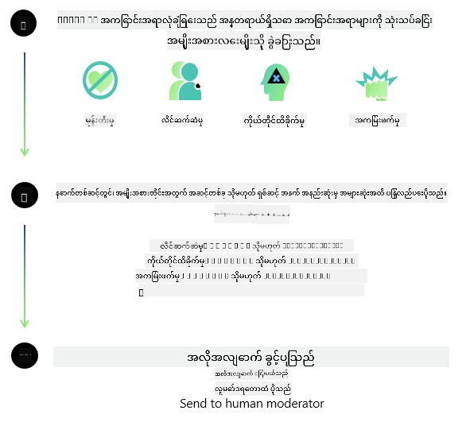

<!--
CO_OP_TRANSLATOR_METADATA:
{
  "original_hash": "c8273672cc57df2be675407a1383aaf0",
  "translation_date": "2025-07-16T17:54:42+00:00",
  "source_file": "md/01.Introduction/01/01.AISafety.md",
  "language_code": "my"
}
-->
# Phi မော်ဒယ်များအတွက် AI လုံခြုံရေး  
Phi မော်ဒယ်များသည် [Microsoft Responsible AI Standard](https://query.prod.cms.rt.microsoft.com/cms/api/am/binary/RE5cmFl) အတိုင်း ဖွံ့ဖြိုးတည်ဆောက်ထားပြီး၊ ၎င်းသည် ကုမ္ပဏီတစ်ခုလုံးအတွက် တာဝန်ယူမှု၊ ထင်ရှားမှု၊ တရားမျှတမှု၊ ယုံကြည်စိတ်ချရမှုနှင့် လုံခြုံမှု၊ ကိုယ်ရေးကိုယ်တာနှင့် လုံခြုံရေး၊ အပါအဝင် [Microsoft ၏ တာဝန်ယူသော AI 원칙များ](https://www.microsoft.com/ai/responsible-ai) အခြေခံထားသော ခြောက်ချက်အခြေခံသဘောတရားများဖြစ်သည်။  

ယခင် Phi မော်ဒယ်များကဲ့သို့ပင်၊ လုံခြုံရေးအကဲဖြတ်ခြင်းနှင့် လုံခြုံရေးလေ့ကျင့်မှုများကို မျိုးစုံအသုံးပြုခဲ့ပြီး၊ ဤထုတ်ဝေမှု၏ ဘာသာစကားစွမ်းရည်များကို ထည့်သွင်းစဉ်းစား၍ ထပ်မံကာကွယ်မှုများကိုလည်း ထည့်သွင်းထားသည်။ လုံခြုံရေးလေ့ကျင့်မှုနှင့် အကဲဖြတ်မှုများ၊ ဘာသာစကားများစွာနှင့် အန္တရာယ်အမျိုးအစားများအပေါ် စမ်းသပ်မှုများအပါအဝင် ကျွန်ုပ်တို့၏ နည်းလမ်းများကို [Phi Safety Post-Training Paper](https://arxiv.org/abs/2407.13833) တွင် ဖော်ပြထားသည်။ Phi မော်ဒယ်များသည် ဤနည်းလမ်းမှ အကျိုးရှိသော်လည်း၊ ဖွံ့ဖြိုးသူများသည် ၎င်းတို့၏ အသုံးပြုမှုအခြေအနေ၊ ယဉ်ကျေးမှုနှင့် ဘာသာစကားဆိုင်ရာ အခြေအနေများနှင့် သက်ဆိုင်သော အန္တရာယ်များကို မြေပုံဆွဲခြင်း၊ တိုင်းတာခြင်းနှင့် လျော့နည်းစေရေးအတွက် တာဝန်ယူသော AI အကောင်းဆုံးလေ့ကျင့်မှုများကို လိုက်နာရန် လိုအပ်သည်။  

## အကောင်းဆုံးလေ့ကျင့်မှုများ  

အခြားမော်ဒယ်များကဲ့သို့ Phi မော်ဒယ်များသည် မတရားမှု၊ ယုံကြည်စိတ်ချရမှုမရှိမှု သို့မဟုတ် မလေးစားဖွယ် အပြုအမူများ ပြုလုပ်နိုင်သည်။  

SLM နှင့် LLM မော်ဒယ်များ၏ ကန့်သတ်ချက်အချို့မှာ အောက်ပါအတိုင်း ဖြစ်သည်-  

- **ဝန်ဆောင်မှုအရည်အသွေး:** Phi မော်ဒယ်များကို အဓိကအားဖြင့် အင်္ဂလိပ်စာပေါ်တွင် လေ့ကျင့်ထားသည်။ အင်္ဂလိပ်မဟုတ်သော ဘာသာစကားများတွင် စွမ်းဆောင်ရည်နည်းပါးနိုင်ပြီး၊ လေ့ကျင့်မှုဒေတာတွင် ကိုယ်စားပြုမှုနည်းသော အင်္ဂလိပ်ဘာသာစကားမျိုးစုံသည် စံအမေရိကန်အင်္ဂလိပ်ထက် ပိုမိုနည်းပါးသော စွမ်းဆောင်ရည်ရှိနိုင်သည်။  
- **ထိခိုက်မှုများကို ကိုယ်စားပြုခြင်းနှင့် စတီရီယိုတိုက်များ ထပ်တလဲလဲဖြစ်ခြင်း:** ဤမော်ဒယ်များသည် လူအုပ်စုတချို့ကို များစွာ သို့မဟုတ် နည်းပါးစွာ ကိုယ်စားပြုနိုင်ပြီး၊ အချို့အုပ်စုများကို မပါဝင်စေခြင်း သို့မဟုတ် အနုတ်လက္ခဏာများ သို့မဟုတ် အနုတ်လက္ခဏာများဖြင့် ပြန်လည်တည်ဆောက်ခြင်းများ ဖြစ်နိုင်သည်။ လုံခြုံရေးလေ့ကျင့်ပြီးဖြစ်သော်လည်း၊ လူအုပ်စုအမျိုးမျိုး၏ ကိုယ်စားပြုမှုအဆင့်ကွဲပြားမှုများ သို့မဟုတ် လေ့ကျင့်မှုဒေတာတွင် ရှိသော အနုတ်လက္ခဏာများ၏ ပုံစံများကြောင့် ဤကန့်သတ်ချက်များ မျှော်လင့်ထားသလို ပြဿနာရှိနိုင်သည်။  
- **မသင့်တော်သော သို့မဟုတ် မလေးစားဖွယ် အကြောင်းအရာများ:** ဤမော်ဒယ်များသည် မသင့်တော်သော သို့မဟုတ် မလေးစားဖွယ် အကြောင်းအရာများကို ထုတ်ပေးနိုင်ပြီး၊ အသုံးပြုမှုအခြေအနေအလိုက် ထပ်မံကာကွယ်မှုများမရှိပါက အထူးသဖြင့် အာရုံစိုက်ရမည့် ပတ်ဝန်းကျင်များတွင် အသုံးပြုရန် မသင့်တော်နိုင်သည်။  
- **သတင်းအချက်အလက် ယုံကြည်စိတ်ချရမှု:** ဘာသာစကားမော်ဒယ်များသည် အဓိပ္ပါယ်မရှိသော အကြောင်းအရာများကို ဖန်တီးနိုင်ပြီး၊ သင့်တော်သည့်အသံဖြင့် ပြောဆိုသော်လည်း မှားယွင်းသော သို့မဟုတ် အဟောင်းအကျန် သတင်းအချက်အလက်များကို ဖန်တီးနိုင်သည်။  
- **ကုဒ်ရေးသားမှုအတွက် ကန့်သတ်ချက်များ:** Phi-3 ၏ လေ့ကျင့်မှုဒေတာအများစုသည် Python ကို အခြေခံပြီး "typing, math, random, collections, datetime, itertools" ကဲ့သို့သော ပက်ကေ့ဂျ်များကို အသုံးပြုသည်။ မော်ဒယ်မှ Python စာသားများကို အခြားပက်ကေ့ဂျ်များ သို့မဟုတ် အခြားဘာသာစကားများဖြင့် စာသားများ ထုတ်ပေးပါက အသုံးပြုသူများသည် API အသုံးပြုမှုအားလုံးကို လက်ဖြင့် စစ်ဆေးရန် အကြံပြုသည်။  

ဖွံ့ဖြိုးသူများသည် တာဝန်ယူသော AI အကောင်းဆုံးလေ့ကျင့်မှုများကို လိုက်နာရမည်ဖြစ်ပြီး၊ သက်ဆိုင်ရာ ဥပဒေများနှင့် စည်းမျဉ်းများ (ဥပမာ- ကိုယ်ရေးကိုယ်တာ၊ ကုန်သွယ်မှု စသည်) နှင့် ကိုက်ညီမှုရှိရန် တာဝန်ရှိသည်။  

## တာဝန်ယူသော AI စဉ်းစားချက်များ  

အခြားဘာသာစကားမော်ဒယ်များကဲ့သို့ Phi မော်ဒယ်များသည် မတရားမှု၊ ယုံကြည်စိတ်ချရမှုမရှိမှု သို့မဟုတ် မလေးစားဖွယ် အပြုအမူများ ပြုလုပ်နိုင်သည်။ သတိပြုရမည့် ကန့်သတ်ချက်အချို့မှာ-  

**ဝန်ဆောင်မှုအရည်အသွေး:** Phi မော်ဒယ်များကို အဓိကအားဖြင့် အင်္ဂလိပ်စာပေါ်တွင် လေ့ကျင့်ထားသည်။ အင်္ဂလိပ်မဟုတ်သော ဘာသာစကားများတွင် စွမ်းဆောင်ရည်နည်းပါးနိုင်သည်။ လေ့ကျင့်မှုဒေတာတွင် ကိုယ်စားပြုမှုနည်းသော အင်္ဂလိပ်ဘာသာစကားမျိုးစုံသည် စံအမေရိကန်အင်္ဂလိပ်ထက် ပိုမိုနည်းပါးသော စွမ်းဆောင်ရည်ရှိနိုင်သည်။  

**ထိခိုက်မှုများကို ကိုယ်စားပြုခြင်းနှင့် စတီရီယိုတိုက်များ ထပ်တလဲလဲဖြစ်ခြင်း:** ဤမော်ဒယ်များသည် လူအုပ်စုတချို့ကို များစွာ သို့မဟုတ် နည်းပါးစွာ ကိုယ်စားပြုနိုင်ပြီး၊ အချို့အုပ်စုများကို မပါဝင်စေခြင်း သို့မဟုတ် အနုတ်လက္ခဏာများကို ပြန်လည်တည်ဆောက်နိုင်သည်။ လုံခြုံရေးလေ့ကျင့်ပြီးဖြစ်သော်လည်း၊ လူအုပ်စုအမျိုးမျိုး၏ ကိုယ်စားပြုမှုအဆင့်ကွဲပြားမှုများ သို့မဟုတ် လေ့ကျင့်မှုဒေတာတွင် ရှိသော အနုတ်လက္ခဏာများ၏ ပုံစံများကြောင့် ဤကန့်သတ်ချက်များ မျှော်လင့်ထားသလို ပြဿနာရှိနိုင်သည်။  

**မသင့်တော်သော သို့မဟုတ် မလေးစားဖွယ် အကြောင်းအရာများ:** ဤမော်ဒယ်များသည် မသင့်တော်သော သို့မဟုတ် မလေးစားဖွယ် အကြောင်းအရာများကို ထုတ်ပေးနိုင်ပြီး၊ အသုံးပြုမှုအခြေအနေအလိုက် ထပ်မံကာကွယ်မှုများမရှိပါက အထူးသဖြင့် အာရုံစိုက်ရမည့် ပတ်ဝန်းကျင်များတွင် အသုံးပြုရန် မသင့်တော်နိုင်သည်။  
သတင်းအချက်အလက် ယုံကြည်စိတ်ချရမှု: ဘာသာစကားမော်ဒယ်များသည် အဓိပ္ပါယ်မရှိသော အကြောင်းအရာများကို ဖန်တီးနိုင်ပြီး၊ သင့်တော်သည့်အသံဖြင့် ပြောဆိုသော်လည်း မှားယွင်းသော သို့မဟုတ် အဟောင်းအကျန် သတင်းအချက်အလက်များကို ဖန်တီးနိုင်သည်။  

**ကုဒ်ရေးသားမှုအတွက် ကန့်သတ်ချက်များ:** Phi-3 ၏ လေ့ကျင့်မှုဒေတာအများစုသည် Python ကို အခြေခံပြီး "typing, math, random, collections, datetime, itertools" ကဲ့သို့သော ပက်ကေ့ဂျ်များကို အသုံးပြုသည်။ မော်ဒယ်မှ Python စာသားများကို အခြားပက်ကေ့ဂျ်များ သို့မဟုတ် အခြားဘာသာစကားများဖြင့် စာသားများ ထုတ်ပေးပါက အသုံးပြုသူများသည် API အသုံးပြုမှုအားလုံးကို လက်ဖြင့် စစ်ဆေးရန် အကြံပြုသည်။  

ဖွံ့ဖြိုးသူများသည် တာဝန်ယူသော AI အကောင်းဆုံးလေ့ကျင့်မှုများကို လိုက်နာရမည်ဖြစ်ပြီး၊ သက်ဆိုင်ရာ ဥပဒေများနှင့် စည်းမျဉ်းများ (ဥပမာ- ကိုယ်ရေးကိုယ်တာ၊ ကုန်သွယ်မှု စသည်) နှင့် ကိုက်ညီမှုရှိရန် တာဝန်ရှိသည်။ စဉ်းစားရန် အရေးကြီးသော နေရာများမှာ-  

**အရင်းအမြစ်ခွဲဝေမှု:** ဤမော်ဒယ်များကို ဥပဒေရေးရာ အခြေအနေများ သို့မဟုတ် အရင်းအမြစ်များ သို့မဟုတ် ဘဝအခွင့်အလမ်းများ ခွဲဝေမှုအပေါ် ထိခိုက်မှုရှိနိုင်သည့် အခြေအနေများတွင် အသုံးမပြုသင့်ပါ၊ ထပ်မံသုံးသပ်ခြင်းနှင့် အပိုဆောင်း အနုတ်လက္ခဏာဖယ်ရှားမှုနည်းလမ်းများ လိုအပ်ပါသည် (ဥပမာ- အိမ်ရာ၊ အလုပ်အကိုင်၊ ခရက်ဒစ် စသည်)။  

**အန္တရာယ်မြင့် အခြေအနေများ:** ဖွံ့ဖြိုးသူများသည် မတရားမှု၊ ယုံကြည်စိတ်ချရမှုမရှိမှု သို့မဟုတ် မလေးစားဖွယ် အဖြေများကြောင့် အလွန်ကြီးမားသော ကုန်ကျစရိတ် သို့မဟုတ် ထိခိုက်မှု ဖြစ်နိုင်သည့် အန္တရာယ်မြင့် အခြေအနေများတွင် မော်ဒယ်အသုံးပြုမှု သင့်တော်မှုကို သုံးသပ်ရမည်။ ၎င်းတွင် တိကျမှန်ကန်မှုနှင့် ယုံကြည်စိတ်ချရမှု အရေးကြီးသော အထူးသဖြင့် ဥပဒေရေးရာ သို့မဟုတ် ကျန်းမာရေးအကြံပေးမှုကဲ့သို့သော အထူးအရည်အချင်းလိုအပ်သော နယ်ပယ်များတွင် အကြံပေးခြင်း ပါဝင်သည်။ အသုံးပြုမှုအခြေအနေအရ အပလီကေးရှင်းအဆင့်တွင် ထပ်မံကာကွယ်မှုများ ထည့်သွင်းရမည်။  

**မှားယွင်းသတင်းအချက်အလက်:** မော်ဒယ်များသည် မှားယွင်းသော သတင်းအချက်အလက် ထုတ်ပေးနိုင်သည်။ ဖွံ့ဖြိုးသူများသည် ထင်ရှားမှုအကောင်းဆုံးလေ့ကျင့်မှုများကို လိုက်နာပြီး၊ အသုံးပြုသူများအား AI စနစ်နှင့် ဆက်သွယ်နေကြောင်း အသိပေးရမည်။ အပလီကေးရှင်းအဆင့်တွင် ဖွံ့ဖြိုးသူများသည် တုံ့ပြန်ချက်များကို အသုံးပြုမှုအခြေအနေ သီးသန့်၊ ပတ်ဝန်းကျင်ဆိုင်ရာ သတင်းအချက်အလက်များနှင့် အခြေခံ၍ တည်ဆောက်နိုင်သော ပြန်လည်ရှာဖွေရေးနည်းလမ်း (Retrieval Augmented Generation - RAG) ကို တည်ဆောက်နိုင်သည်။  

**ထိခိုက်မှုရှိသော အကြောင်းအရာ ထုတ်ပေးခြင်း:** ဖွံ့ဖြိုးသူများသည် ထုတ်လွှင့်ချက်များကို ၎င်းတို့၏ ပတ်ဝန်းကျင်နှင့် ကိုက်ညီမှုရှိမရှိ သုံးသပ်ပြီး၊ အသုံးပြုမှုအခြေအနေသင့်တော်သော လုံခြုံရေး စစ်ဆေးသူများ သို့မဟုတ် စိတ်ကြိုက်ဖြေရှင်းနည်းများကို အသုံးပြုသင့်သည်။  

**မမှန်ကန်သော အသုံးပြုမှု:** လိမ်လည်မှု၊ စပမ်၊ မော်လ်ဝဲ ထုတ်လုပ်မှုကဲ့သို့ မမှန်ကန်သော အသုံးပြုမှုအမျိုးအစားများ ဖြစ်နိုင်ပြီး၊ ဖွံ့ဖြိုးသူများသည် ၎င်းတို့၏ အပလီကေးရှင်းများသည် သက်ဆိုင်ရာ ဥပဒေများနှင့် စည်းမျဉ်းများကို မဖောက်ဖျက်စေရန် သေချာစေရမည်။  

### ဖိုင်နယ်တူနင်းနှင့် AI အကြောင်းအရာ လုံခြုံရေး  

မော်ဒယ်တစ်ခုကို ဖိုင်နယ်တူနင်းပြီးနောက်၊ [Azure AI Content Safety](https://learn.microsoft.com/azure/ai-services/content-safety/overview) ကို အသုံးပြု၍ မော်ဒယ်များထုတ်ပေးသော အကြောင်းအရာများကို စောင့်ကြည့်၊ အန္တရာယ်များ၊ ခြိမ်းခြောက်မှုများနှင့် အရည်အသွေးပြဿနာများကို ရှာဖွေတားဆီးရန် အလွန်အကြံပြုသည်။  

  

[Azure AI Content Safety](https://learn.microsoft.com/azure/ai-services/content-safety/overview) သည် စာသားနှင့် ပုံရိပ် အကြောင်းအရာများကို ထောက်ပံ့ပေးပြီး၊ မိုးကောင်းကင်၊ ခွဲထွက်ထားသော ကွန်တိန်နာများနှင့် အနား/ထည့်သွင်းထားသော စက်ပစ္စည်းများတွင် တပ်ဆင်နိုင်သည်။  

## Azure AI Content Safety အကျဉ်းချုပ်  

Azure AI Content Safety သည် တစ်မျိုးတည်းဖြေရှင်းချက်မဟုတ်ပေ၊ စီးပွားရေးလုပ်ငန်းများ၏ သီးသန့်မူဝါဒများနှင့် ကိုက်ညီအောင် စိတ်ကြိုက်ပြင်ဆင်နိုင်သည်။ ထို့အပြင်၊ ဘာသာစကားစုံ မော်ဒယ်များကြောင့် ဘာသာစကားများစွာကို တပြိုင်နက်နားလည်နိုင်သည်။  

  

- **Azure AI Content Safety**  
- **Microsoft Developer**  
- **ဗီဒီယို ၅ ခု**  

Azure AI Content Safety ဝန်ဆောင်မှုသည် အပလီကေးရှင်းများနှင့် ဝန်ဆောင်မှုများတွင် အသုံးပြုသူများနှင့် AI မှ ထုတ်ပေးသော ထိခိုက်မှုရှိနိုင်သော အကြောင်းအရာများကို ရှာဖွေစစ်ဆေးပေးသည်။ ၎င်းတွင် စာသားနှင့် ပုံရိပ် API များ ပါဝင်ပြီး ထိခိုက်မှုရှိ သို့မဟုတ် မသင့်တော်သော အကြောင်းအရာများကို ရှာဖွေစစ်ဆေးနိုင်သည်။  

[AI Content Safety Playlist](https://www.youtube.com/playlist?list=PLlrxD0HtieHjaQ9bJjyp1T7FeCbmVcPkQ)

**အကြောင်းကြားချက်**  
ဤစာတမ်းကို AI ဘာသာပြန်ဝန်ဆောင်မှု [Co-op Translator](https://github.com/Azure/co-op-translator) ဖြင့် ဘာသာပြန်ထားပါသည်။ ကျွန်ုပ်တို့သည် တိကျမှန်ကန်မှုအတွက် ကြိုးစားသော်လည်း အလိုအလျောက် ဘာသာပြန်ခြင်းတွင် အမှားများ သို့မဟုတ် မှားယွင်းချက်များ ပါဝင်နိုင်ကြောင်း သတိပြုပါရန် မေတ္တာရပ်ခံအပ်ပါသည်။ မူရင်းစာတမ်းကို မူလဘာသာဖြင့်သာ တရားဝင်အချက်အလက်အဖြစ် ယူဆသင့်ပါသည်။ အရေးကြီးသော အချက်အလက်များအတွက် လူ့ဘာသာပြန်ပညာရှင်မှ ဘာသာပြန်ခြင်းကို အကြံပြုပါသည်။ ဤဘာသာပြန်ချက်ကို အသုံးပြုရာမှ ဖြစ်ပေါ်လာနိုင်သည့် နားလည်မှုမှားယွင်းမှုများအတွက် ကျွန်ုပ်တို့သည် တာဝန်မယူပါ။