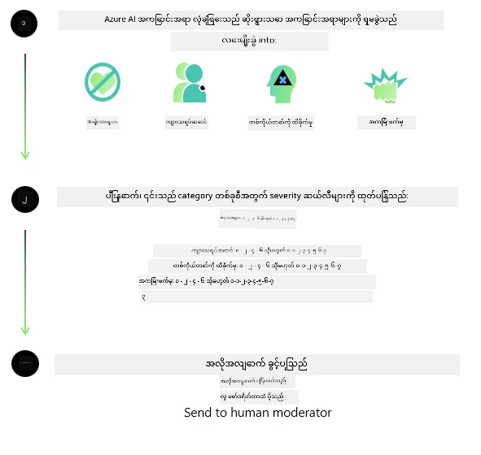
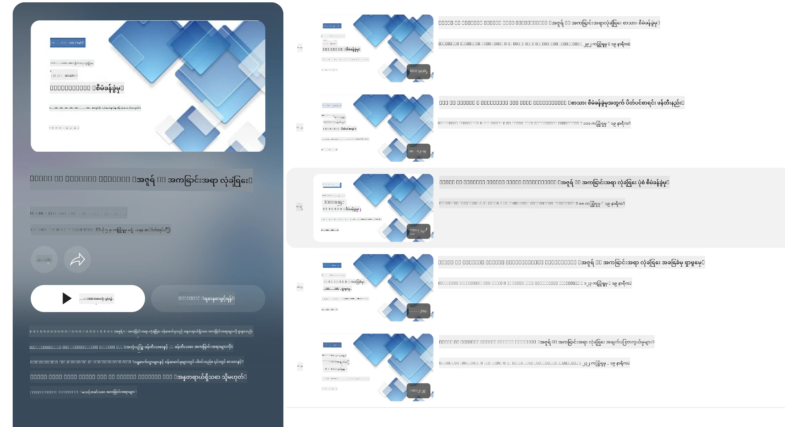

<!--
CO_OP_TRANSLATOR_METADATA:
{
  "original_hash": "839ccc4b3886ef10cfd4e64977f5792d",
  "translation_date": "2026-01-05T15:53:39+00:00",
  "source_file": "md/01.Introduction/01/01.AISafety.md",
  "language_code": "my"
}
-->
# Phi မော်ဒယ်များအတွက် AI လုံခြုံရေး  
Phi မော်ဒယ်တွေကို [Microsoft Responsible AI Standard](https://www.microsoft.com/ai/principles-and-approach#responsible-ai-standard) အရ ဖန်တီးထားပြီး၊ ၎င်းသည် အောက်ပါ ခြောက်ချက်အခြေခံသဘောတရားများ အပေါ် အခြေခံထားသည့် ကုမ္ပဏီအဆင့် တစ်ခုလုံးအတွက် လိုအပ်ချက်များ သတ်မှတ်ချက်များဖြစ်သည် - တာဝန်ခံမှု၊ ဖော်ပြချက် ရှင်းလင်းမှု၊ တရားမျှတမှု၊ ယုံကြည်စိတ်ချစရာနှင့် လုံခြုံမှု၊ ကိုယ်ရေးကာကွယ်မှုနှင့် လုံခြုံမှု၊ နဲ့ ဝင်စားမှု ဖြစ်ပြီး၊ ဤဟာများသည် [Microsoft ၏ တာဝန်ခံ AI သဘောတရားများ](https://www.microsoft.com/ai/responsible-ai) ဖြစ်သည်။

ယခင် Phi မော်ဒယ်များကဲ့သို့ မော်ဒယ်များကို အမျိုးမျိုးသော လုံခြုံရေး စမ်းသပ်မှုများနှင့် လုံခြုံရေး ပြောင်းလဲမှုပြီးနောက် နည်းလမ်းများကို အသုံးပြုခဲ့ပြီး၊ ဤထုတ်ပေးချက်တွင် ဘာသာစကားစုံ စွမ်းဆောင်ရည်များအတွက် ထပ်မံသော အကွာအဝေးများကို ဆောင်ရွက်ခဲ့သည်။ ကျွန်ုပ်တို့၏ လုံခြုံရေး လေ့ကျင့်မှုနှင့် စမ်းသပ်မှုများအတွက် နည်းလမ်းများ၊ ဘာသာစကားစုံနှင့် အန္တရာယ်အမျိုးအစား အားလုံးအတွက် စမ်းသပ်မှုများ ဆောင်ရွက်မှု စသည်တို့ကို [Phi Safety Post-Training Paper](https://arxiv.org/abs/2407.13833) တွင် ဖော်ပြထားသည်။ Phi မော်ဒယ်များသည် ဤနည်းလမ်းများမှ အကျိုးခံစားနိုင်သော်လည်း၊ တီထွင်သူများသည် အသုံးချမှုအမျိုးအစားနှင့် ယဉ်ကျေးမှု၊ ဘာသာစကားဆိုင်ရာ အခြေအနေများနှင့် သက်ဆိုင်သော အန္တရာယ်များကို မြေပုံဆွဲခြင်း၊ တိုင်းတာခြင်း၊ နှင့် လျော့နည်းအောင်လုပ်ခြင်းအပါအဝင် တာဝန်ရှိသော AI ကောင်းမွန်မှုလေ့လာမှုများကို အသုံးပြုသင့်သည်။

## အကောင်းဆုံး လေ့လာမှုများ

အခြား မော်ဒယ်များကဲ့သို့ Phi မော်ဒယ် များလည်း တရားမျှတမှုမရှိ၊ ယုံကြည်စိတ်ချမှုမရှိခြင်း၊ သို့မဟုတ် မရိုးသားမှုရှိသောလှုပ်ရှားမှုများဖြစ်ပေါ်နိုင်သည်။

SLM နှင့် LLM ၏ ကန့်သတ်မှုအချို့ကို သတိပြုရန် အတွက် အောက်ပါအချက်များပါဝင်သည် -

- **ဝန်ဆောင်မှု အရည်အသွေး:** Phi မော်ဒယ်များသည် အဓိကအားဖြင့် အင်္ဂလိပ်ဘာသာစာသားများပေါ်တွင် သင်ကြားထားသည်။ အင်္ဂလိပ်မဟုတ်သော ဘာသာစကားများတွင် ဖော်ဆောင်ချက် ဆိုးကျိုးများ ဖြစ်ပေါ်နိုင်ပြီး၊ သင်ကြားမှု ဒေတာတွင် ကိုယ်စားပြုမှုနည်းသော အင်္ဂလိပ် ဘာသာစကား မျိုးစုံတွင်လည်း စွမ်းဆောင်ချက် နည်းပါးနိုင်သည်။
- **ထိခိုက်မှု နှင့် အကြံရသ မျိုးစုံထားခြင်း:** ဤမော်ဒယ်များသည် လူအုပ်စုတစ်စုများကို မရေရာသော်လည်း တိုးမြှင့်ပြသခြင်း၊ လူအုပ်စုတချို့ကို ဖျက်ဆီးပစ်ခြင်း၊ သို့မဟုတ် သိမ်မွေ့စွာ ဒုက္ခထား သို့မဟုတ် အနုတ်လက္ခဏာ သဘောထားများကို အားပေးပံ့ပိုးနိုင်သည်။ လုံခြုံရေး ပြင်ဆင်ပြီးနောက်တောင်ပါ ဤကန့်သတ်ချက်များမှာ လူအုပ်စုများ၏ ကိုယ်စားပြုမှု မတူညီမှု သို့မဟုတ် ရိုးရာနောက်ခံများမှ ဦးဆောင်သော နမူနာ အနုတ်လက္ခဏာများ ပါဝင်မှုကြောင့် လေ့လာချက်များတွင် လက်ရှိတည်ရှိနိုင်သည်။
- **မသင့်တော် သို့မဟုတ် မရိုးသားသော အကြောင်းအရာများ:** ဤမော်ဒယ်များသည် မသင့်တော်သော သို့မဟုတ် မရိုးသားသော အကြောင်းအရာမျိုးများ ထုတ်လုပ်နိုင်ပြီး၊ အသုံးချမှု အခြေအနေတွင် ထပ်တိုး ကာကွယ်ရေး မရှိပါက မသင့်တော်ဖြစ်နိုင်သည်။
- **သတင်းအချက်အလက် ယုံကြည်စိတ်ချမှု:** ဘာသာစကား မော်ဒယ်များသည် အဓိပ္ပာယ်မရှိသော အကြောင်းအရာများ ထုတ်လုပ်နိုင်ပြီး၊ မွန်ကန်ပုံစံဖြစ်သော်လည်း မှားယွင်း သို့မဟုတ် ရှေးဟောင်း ရုပ်ရှင် တိုက်ဆိုင်သော အချက်အလက်များ ဖန်တီးနိုင်သည်။
- **ကုဒ်အတွက် ကန့်သတ်ထားသော နေရာ:** Phi-3 သင်ကြားမှု ဒေတာများ၏ အများစုကို Python ကို အခြေခံထားပြီး "typing, math, random, collections, datetime, itertools" ကဲ့သို့သော စံအမှတ်တံဆိပ်များကို အသုံးပြုသည်။ မော်ဒယ်သည် အခြား စာကြောင်းပုံစံများ သို့မဟုတ် ဘာသာစကားများဖြင့် Python script များ ထုတ်လုပ်ပါက အသုံးပြုသူများသည် API အသုံးပြုမှု အားလုံးကို လက်ခံစစ်ဆေးရန် အကြံပြုသည်။

တီထွင်သူများသည် တာဝန်ရှိသော AI ကောင်းမွန်မှုနည်းလမ်းများကို အသုံးပြုသင့်ပြီး၊ သတ်မှတ်ထားသော သုံးစွဲမှုကိစ္စသည် သက်ဆိုင်ရာ ဥပဒေများနှင့် စည်းမျဉ်းများနှင့် ကိုက်ညီမှုရှိရန် တာဝန်ရှိကြောင်း သိထားရမည် (ဥပမာ - ကိုယ်ရေးခွင့်ရှိမှု၊ ကုန်သွယ်မှု စသည်)။

## တာဝန်ခံ AI စဉ်းစားချက်များ

အခြား ဘာသာစကား မော်ဒယ်များကဲ့သို့ Phi မော်ဒယ်စီးရီးများသည် တရားမျှတမှုမရှိခြင်း၊ ယုံကြည်စိတ်ချမရခြင်း သို့မဟုတ် မရိုးသားသော လုပ်ဆောင်ချက်များ ဖြစ်ပေါ်နိုင်သည်။ သတိပြုရမည့် ကန့်သတ်ချက် အချို့မှာ -

**ဝန်ဆောင်မှု အရည်အသွေး:** Phi မော်ဒယ်များသည် အဓိကအားဖြင့် အင်္ဂလိပ်စာသားများပေါ်တွင် သင်ကြားထားသဖြင့် အင်္ဂလိပ် မဟုတ်သော ဘာသာစကားများတွင် ဆိုးကျိုးဖြစ်နိုင်ပြီး၊ သင်ကြားမှု ဒေတာမှ ကိုယ်စားပြုမှု နည်းသော အင်္ဂလိပ် ဘာသာစကား မျိုးစုံသည် မြန်မာနိုင်ငံ၏ ကျားမြင်သော အင်္ဂလိပ်ထက် မကောင်းနိုင်ပါ။

**ထိခိုက်မှု နှင့် အကြံရသများ မြှင့်တင်ခြင်း:** မော်ဒယ်များသည် လူအုပ်စုတစ်စုများကို မာန်တက်၊ လျော့နည်းပြသခြင်း၊ လူအုပ်စုတချို့ကို ဖျက်ပစ်ခြင်း သို့မဟုတ် မတရား ပြသခြင်းများ ရှိနိုင်သည်။ လုံခြုံရေး ပြင်ဆင်ပြီးပေမယ့် လူအုပ်စုအမျိုးအစားနှင့် ၎င်းတို့၏ စယ်စုံယုံကြည်မှု မတူညီခြင်းများကြောင့် ထိုကန့်သတ်ချက်များ ရှိနေလျက်ရှိနိုင်သည်။

**မသင့်တော် သို့မဟုတ် မရိုးသားသော အကြောင်းအရာများ:** ဤမော်ဒယ်များသည် မသင့်တော် သို့မဟုတ် မရိုးသားသော အကြောင်းအရာများ ထုတ်ပေးနိုင်၍၊ မသေချာသော သို့မဟုတ် သိမ်းဆည်းရန်သည်မဟုတ်သော ကိစ္စများတွင် သုံးရလျှင် ထပ်တိုး ကာကွယ်မှု လိုအပ်နိုင်သည်။

**သတင်းအချက်အလက် ယုံကြည်စိတ်ချမှု:** သဘောစိတ်မကောင်းသော အကြောင်းအရာများ ထုတ်ပေးနိုင်သည်။

**ကုဒ်အတွက် ကန့်သတ်ထားသော နေရာ:** Phi-3 သင်ကြားမှု ဒေတာများ၏ အများစုသည် Python အပေါ်တွင် အခြေခံ၍ "typing, math, random, collections, datetime, itertools" စသည်ဖြင့် အသုံးပြုသည်။ မော်ဒယ်သည် အခြား package များ သို့မဟုတ် ဘာသာစကားများဖြင့် Python script များ ထုတ်ပေးပါက API အသုံးပြုမှုအားလုံးကို လက်စွဲစစ်ဆေးရန် အားပေးသည်။

တီထွင်သူများသည် တာဝန်ခံ AI ကောင်းမွန်မှုများကို အကောင်အထည်ဖော်ရမည်နှင့် သတ်မှတ်ထားသော သုံးစွဲမှုကိစ္စသည် ဥပဒေရေးရာ ကန့်သတ်ချက်များနှင့် ကိုက်ညီစေရန် တာဝန်ရှိသည် (ဥပမာ: ကိုယ်ရေးကိုယ်တာ၊ ကုန်သွယ်မှု စသည်)။ သတိထားသင့်သည့် အရေးကြီးသော အချက်များမှာ -

**ခွဲဝေမှု:** မော်ဒယ်များကို ဥပဒေသတ်မှတ် အခြေအနေများ သို့မဟုတ် သက်ဆိုင်ရာ အရင်းအမြစ်များ သို့မဟုတ် ဘဝအခွင့်အရေးများ ခွဲဝေမှု အပေါ် အကျိုးသက်ရောက်မှုရှိနိုင်သော နေရာများတွင် (ဥပမာ - နေအိမ်ခြံမြေ, အလုပ်အကိုင်, ခရက်ဒစ် စသည်) အသုံးမပြုသင့်ပါက နောက်ထပ် သုံးသပ်မှုများနှင့် အလျော့နည်း သတ္တုအချို့ တပ်ဆင်သင့်သည်။

**အန္တရာယ်မြင့် အခြေအနေများ:** မော်ဒယ်များကို မတရားပြုမူမှု၊ ယုံကြည်စိတ်ချရမှုမရှိခြင်း သို့မဟုတ် မရိုးသားသော ထွက်ရှိမှုများကြောင့် အလွန်သည်းခံရခက်သော အန္တရာယ်များနှင့် တွန်းလှန်နိုင်သော နေရာများတွင် စမ်းသပ်ရန် တီထွင်သူများ အားပေးရန်လိုအပ်သည်။ ဥပမာ - တရားဥပဒေအကြံပေးခြင်း သို့မဟုတ် ကျန်းမာရေးအကြံပေးခြင်း ကဲ့သို့သော သိပ္ပံကျွမ်းကျင်မှု များလိုအပ်သော နေရာများ။ ထိုအခါ အသုံးပြုမှု အခြေအနေ အရ ကိုက်ညီသော ကာကွယ်ရေးများ ကို အပ်နှံစီစဉ်သင့်သည်။

**သတင်းမှားများ:** မော်ဒယ်များသည် မှားယွင်းသော သတင်းအချက်အလက် ထုတ်ပေးနိုင်သည်။ တီထွင်သူများသည် ဖော်ပြချက်များကို ဖော်ထုတ်ရေးအပေါ် အလေးပေး၍ နောက်ဆုံးအသုံးပြုသူများကို AI စနစ်နှင့် မည်ကဲ့သို့ အပြန်အလှန်ဆက်သွယ်နေကြောင်း အသိပေးသင့်သည်။ များသောအားဖြင့် Application အဆင့်တွင် တုံ့ပြန်မှု စနစ်များနှင့် နောက်ဆုံးအသုံးပြုမှု အခြေအနေများနှင့် သက်ဆိုင်သည့် သတင်းအချက်အလက်များ စုစည်း ထုတ်ပေးနိုင်သော Retrieval Augmented Generation (RAG) နည်းပညာ အသုံးပြုနိုင်သည်။

**ထိခိုက်သော အကြောင်းအရာ ထုတ်ပေးခြင်း:** ထုတ်ပေးမှုများကို အခြေအနေနှင့် ကိုက်ညီမှုပေါ် မူတည်၍ စစ်ဆေးသင့်ပြီး၊ သက်ဆိုင်ရာ လုံခြုံရေး စစ်ဆေးကိရိယာများ သို့မဟုတ် ကိုယ်ပိုင်ဖြေရှင်းနည်းများ အသုံးပြုသင့်သည်။

**မမှန်ကန်သောအသုံးပြုမှု:** လိမ်လည်မှု၊ စပမ်၊ မော်လ်ဝဲရက် (malware) ဖန်တီးမှု နှင့် ကဲ့သို့သော မမှန်ကန်သော အသုံးပြုမှု ပုံစံများ ဖြစ်ပေါ်နိုင်ပြီး၊ တီထွင်သူများက သက်ဆိုင်ရာ ဥပဒေ စည်းမျဉ်းများကို ကာကွယ်ထားရန် တာဝန်ရှိသည်။

### ပုံမှန်ပြန်လည်လေ့ကျင့်ခြင်းနှင့် AI အကြောင်းအရာ လုံခြုံရေး

မော်ဒယ်တစ်ခုကို ပုံမှန်ပြန်လေ့ကျင့်ပြီးနောက်မှာ [Azure AI Content Safety](https://learn.microsoft.com/azure/ai-services/content-safety/overview) ၏ လုံခြုံရေး တိုက်ကြီးမှုများကို အသုံးပြု၍ မော်ဒယ်များထုတ်လုပ်သော အကြောင်းအရာများကို စောင့်ကြည့်ခြင်း၊ ဖြစ်နိုင်သော အန္တရာယ်များ၊ အန္တာရယ်များနှင့် အရည်အသွေးပြဿနာများကို ရှာဖွေ ချုပ်ဆီးခြင်းများ ရှိစေသင့်သည်။

[Azure AI Content Safety](https://learn.microsoft.com/azure/ai-services/content-safety/overview) သည် စာသား နှင့် ပုံများနှစ်မျိုးလုံး အတွက် ထောက်ပံ့ပေးနိုင်ပြီး မတူညီသည့် Cloud၊ ဒါ့အပြင် မကြိုးများမရှိသည့် Containers များနှင့် Edge/Embedded ကိရိယာများတွင် သုံးနိုင်ပါသည်။

## Azure AI Content Safety အကျဉ်းချုပ်

Azure AI Content Safety သည် တစ်မျိုးတည်းသော ဖြေရှင်းချက်မဟုတ်ဘဲ ၊ စီးပွားရေးလုပ်ငန်းများ စီမံချက်နှင့် ကိုက်ညီအောင် စိတ်ကြိုက်ပြင်ဆင်နိုင်သည်။ ထို့အပြင် မော်ဒယ်များသည် ဘာသာစကားအတော်များများကို တစ်ပြိုင်နက် နားလည်နိုင်သည်။

- **Azure AI Content Safety**
- **Microsoft Developer**
- **5 videos**

Azure AI Content Safety နည်းပညာသည် အသုံးပြုသူများဖန်တီးသော နှင့် AI ဖန်တီးသော ထိခိုက်နိုင်သော အကြောင်းအရာများကို စစ်ဆေးဖော်ထုတ်ပေးသည်။ ၎င်းတွင် စာသား နှင့် ပုံ API များ ပါဝင်ပြီး ထိခိုက်နိုင်သော သို့မဟုတ် မသင့်တော်သောအရာများကို ရှာဖွေစစ်ဆေးနိုင်သည်။

[AI Content Safety Playlist](https://www.youtube.com/playlist?list=PLlrxD0HtieHjaQ9bJjyp1T7FeCbmVcPkQ)

---

<!-- CO-OP TRANSLATOR DISCLAIMER START -->
**ချက်ပြောချက်**:
ဤစာတမ်းကို AI ဘာသာပြန်မှုဝန်ဆောင်မှုဖြစ်သော [Co-op Translator](https://github.com/Azure/co-op-translator) ကို အသုံးပြု၍ ဘာသာပြန်ထားပါသည်။ ကျွန်ုပ်တို့သည်မှန်ကန်မှုအတွက် ကြိုးစားပေမယ့် အလိုအလျောက် ဘာသာပြန်ခြင်းတွင် လွဲမှားချက်များ ဒါမှမဟုတ် မှားယွင်းချက်များ ပါဝင်နိုင်ကြောင်း ကျေးဇူးပြု၍ သတိပြုပါရန်။ မူလစာတမ်းကို မိဘဘာသာဖြင့်သာ ယုံကြည်ရန် သင့်တော်ပါသည်။ အရေးကြီးသည့် အချက်အလက်များအတွက် လူ့ဘာသာပြန်အကျွမ်းတဝင်သူ၏ ဘာသာပြန်ချက်ကို အကြံပြုပါသည်။ ဤဘာသာပြန်ချက်အသုံးပြုမှုမှ ဖြစ်ပေါ်သည့် လွဲမှားနားလည်မှုများသို့မဟုတ် မှားယွင်းနားလည်မှုများအတွက် ကျွန်ုပ်တို့သည် တာဝန်မရှိပါ။
<!-- CO-OP TRANSLATOR DISCLAIMER END -->