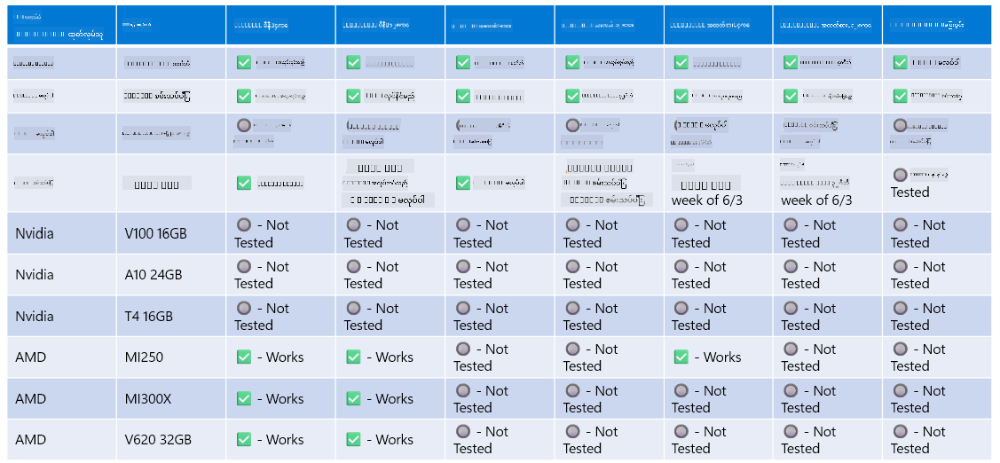

<!--
CO_OP_TRANSLATOR_METADATA:
{
  "original_hash": "8cdc17ce0f10535da30b53d23fe1a795",
  "translation_date": "2025-07-16T18:27:40+00:00",
  "source_file": "md/01.Introduction/01/01.Hardwaresupport.md",
  "language_code": "my"
}
-->
# Phi Hardware Support

Microsoft Phi ကို ONNX Runtime အတွက် အထူးပြုလုပ်ထားပြီး Windows DirectML ကို ထောက်ပံ့ပေးသည်။ GPU, CPU နှင့် မိုဘိုင်းစက်များအပါအဝင် အမျိုးမျိုးသော hardware များတွင် ကောင်းစွာ လည်ပတ်နိုင်သည်။

## Device Hardware  
ထောက်ပံ့ထားသော hardware များမှာ အောက်ပါအတိုင်း ဖြစ်သည်-

- GPU SKU: RTX 4090 (DirectML)
- GPU SKU: 1 A100 80GB (CUDA)
- CPU SKU: Standard F64s v2 (64 vCPUs, 128 GiB memory)

## Mobile SKU

- Android - Samsung Galaxy S21
- Apple iPhone 14 သို့မဟုတ် အထက် A16/A17 Processor

## Phi Hardware Specification

- အနည်းဆုံး လိုအပ်သော ဖွဲ့စည်းမှု
- Windows: DirectX 12 ကို ထောက်ပံ့နိုင်သော GPU နှင့် စုစုပေါင်း RAM 4GB အနည်းဆုံး

CUDA: Compute Capability >= 7.02 ရှိသော NVIDIA GPU



## onnxruntime ကို GPU များစွာပေါ်တွင် လည်ပတ်ခြင်း

လက်ရှိ Phi ONNX မော်ဒယ်များသည် GPU တစ်ခုအတွက်သာ ရရှိနိုင်သည်။ Phi မော်ဒယ်အတွက် multi-gpu ကို ထောက်ပံ့နိုင်သော်လည်း ORT ကို GPU ၂ ခုဖြင့် အသုံးပြုပါက ၂ ခုသော ort instance များနှင့် နှိုင်းယှဉ်လျှင် throughput ပိုမိုကောင်းမွန်မည်ဟု အာမခံမထားနိုင်ပါ။ နောက်ဆုံးအချက်အလက်များအတွက် [ONNX Runtime](https://onnxruntime.ai/) ကို ကြည့်ရှုပါ။

[Build 2024 the GenAI ONNX Team](https://youtu.be/WLW4SE8M9i8?si=EtG04UwDvcjunyfC) မှ Phi မော်ဒယ်များအတွက် multi-gpu မဟုတ်ဘဲ multi-instance ကို ဖွင့်လှစ်ထားကြောင်း ကြေညာခဲ့သည်။

လက်ရှိတွင် CUDA_VISIBLE_DEVICES environment variable ကို အသုံးပြု၍ onnxruntime သို့မဟုတ် onnxruntime-genai instance တစ်ခုကို အောက်ပါအတိုင်း လည်ပတ်နိုင်သည်။

```Python
CUDA_VISIBLE_DEVICES=0 python infer.py
CUDA_VISIBLE_DEVICES=1 python infer.py
```

Phi ကို ပိုမိုလေ့လာလိုပါက [Azure AI Foundry](https://ai.azure.com) တွင် စူးစမ်းနိုင်ပါသည်။

**အကြောင်းကြားချက်**  
ဤစာတမ်းကို AI ဘာသာပြန်ဝန်ဆောင်မှု [Co-op Translator](https://github.com/Azure/co-op-translator) ဖြင့် ဘာသာပြန်ထားပါသည်။ ကျွန်ုပ်တို့သည် တိကျမှန်ကန်မှုအတွက် ကြိုးစားသော်လည်း၊ အလိုအလျောက် ဘာသာပြန်ခြင်းတွင် အမှားများ သို့မဟုတ် မှားယွင်းမှုများ ပါဝင်နိုင်ကြောင်း သတိပြုပါရန် မေတ္တာရပ်ခံအပ်ပါသည်။ မူရင်းစာတမ်းကို မိမိဘာသာစကားဖြင့်သာ တရားဝင်အချက်အလက်အဖြစ် ယူဆသင့်ပါသည်။ အရေးကြီးသော အချက်အလက်များအတွက် လူ့ဘာသာပြန်ပညာရှင်မှ ဘာသာပြန်ခြင်းကို အကြံပြုပါသည်။ ဤဘာသာပြန်ချက်ကို အသုံးပြုရာမှ ဖြစ်ပေါ်လာနိုင်သည့် နားလည်မှုမှားယွင်းမှုများအတွက် ကျွန်ုပ်တို့ တာဝန်မယူပါ။