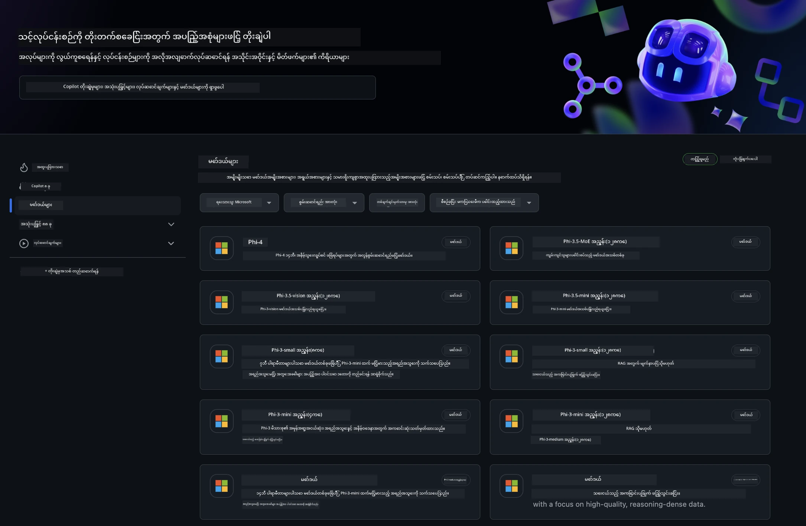
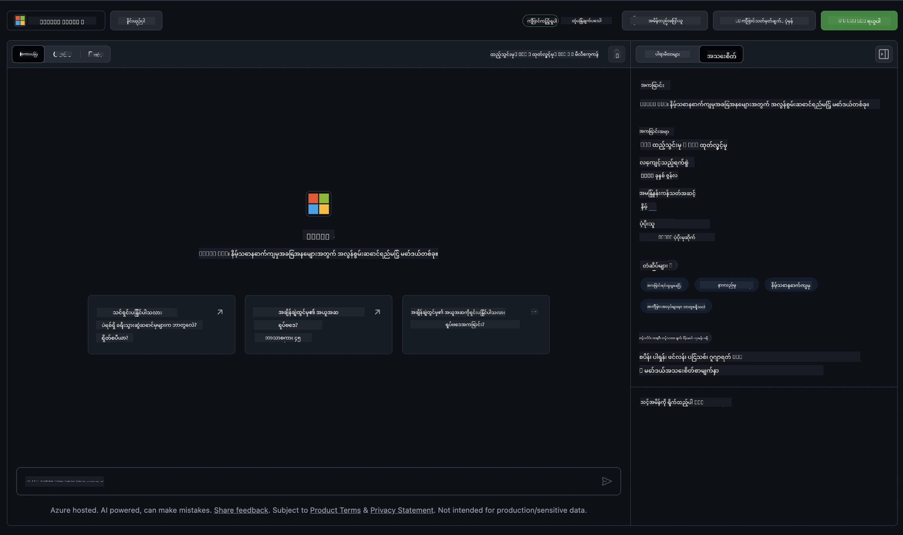
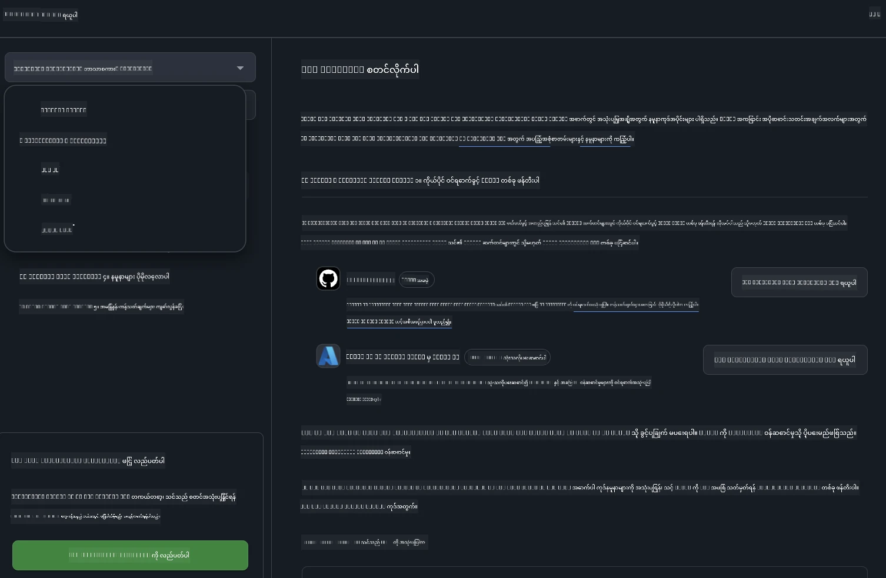

<!--
CO_OP_TRANSLATOR_METADATA:
{
  "original_hash": "fb67a08b9fc911a10ed58081fadef416",
  "translation_date": "2025-07-16T19:05:48+00:00",
  "source_file": "md/01.Introduction/02/02.GitHubModel.md",
  "language_code": "my"
}
-->
## GitHub Models မှ Phi မိသားစု

[GitHub Models](https://github.com/marketplace/models) သို့ ကြိုဆိုပါတယ်! Azure AI ပေါ်တွင် တင်ထားသော AI မော်ဒယ်များကို စူးစမ်းလေ့လာနိုင်ရန် အားလုံး ပြင်ဆင်ပြီး အသင့်ဖြစ်ပါပြီ။



GitHub Models တွင် ရရှိနိုင်သော မော်ဒယ်များအကြောင်း ပိုမိုသိရှိလိုပါက [GitHub Model Marketplace](https://github.com/marketplace/models) ကို ကြည့်ရှုနိုင်ပါသည်။

## ရရှိနိုင်သော မော်ဒယ်များ

မော်ဒယ်တိုင်းအတွက် သီးသန့် playground နှင့် နမူနာကုဒ်များ ရှိပါသည်။



### GitHub Model Catalog မှ Phi မိသားစု

- [Phi-4](https://github.com/marketplace/models/azureml/Phi-4)

- [Phi-3.5-MoE instruct (128k)](https://github.com/marketplace/models/azureml/Phi-3-5-MoE-instruct)

- [Phi-3.5-vision instruct (128k)](https://github.com/marketplace/models/azureml/Phi-3-5-vision-instruct)

- [Phi-3.5-mini instruct (128k)](https://github.com/marketplace/models/azureml/Phi-3-5-mini-instruct)

- [Phi-3-Medium-128k-Instruct](https://github.com/marketplace/models/azureml/Phi-3-medium-128k-instruct)

- [Phi-3-medium-4k-instruct](https://github.com/marketplace/models/azureml/Phi-3-medium-4k-instruct)

- [Phi-3-mini-128k-instruct](https://github.com/marketplace/models/azureml/Phi-3-mini-128k-instruct)

- [Phi-3-mini-4k-instruct](https://github.com/marketplace/models/azureml/Phi-3-mini-4k-instruct)

- [Phi-3-small-128k-instruct](https://github.com/marketplace/models/azureml/Phi-3-small-128k-instruct)

- [Phi-3-small-8k-instruct](https://github.com/marketplace/models/azureml/Phi-3-small-8k-instruct)

## စတင်အသုံးပြုခြင်း

သင်စမ်းသပ်အသုံးပြုနိုင်ရန် အခြေခံနမူနာများ အနည်းငယ်ရှိပြီး၊ samples ဖိုလ်ဒါတွင် တွေ့နိုင်ပါသည်။ သင်နှစ်သက်ရာ ဘာသာစကားသို့ တိုက်ရိုက်သွားလိုပါက အောက်ပါ ဘာသာစကားများအတွက် နမူနာများ ရှိပါသည်-

- Python  
- JavaScript  
- C#  
- Java  
- cURL  

နမူနာများနှင့် မော်ဒယ်များကို လည်ပတ်ရန် Codespaces Environment သီးသန့်လည်း ရှိပါသည်။



## နမူနာကုဒ်

အောက်တွင် အသုံးပြုနိုင်သော နမူနာကုဒ် အပိုင်းများ ပါဝင်သည်။ Azure AI Inference SDK အကြောင်း ပိုမိုသိရှိလိုပါက အပြည့်အစုံစာတမ်းနှင့် နမူနာများကို ကြည့်ရှုနိုင်ပါသည်။

## ပြင်ဆင်ခြင်း

1. ကိုယ်ပိုင် access token တစ်ခု ဖန်တီးပါ  
token အတွက် ခွင့်ပြုချက် မလိုအပ်ပါ။ token သည် Microsoft ဝန်ဆောင်မှုသို့ ပို့ပေးမည်ဖြစ်သည်။

အောက်ပါ ကုဒ်များကို အသုံးပြုရန် သင့် token ကို client ကုဒ်အတွက် key အဖြစ် သတ်မှတ်ထားသော environment variable တစ်ခု ဖန်တီးပါ။

bash အသုံးပြုပါက-  
```
export GITHUB_TOKEN="<your-github-token-goes-here>"
```  
powershell အသုံးပြုပါက-  
```
$Env:GITHUB_TOKEN="<your-github-token-goes-here>"
```  
Windows command prompt အသုံးပြုပါက-  
```
set GITHUB_TOKEN=<your-github-token-goes-here>
```

## Python နမူနာ

### လိုအပ်သော library များ ထည့်သွင်းခြင်း  
pip ဖြင့် Azure AI Inference SDK ကို ထည့်သွင်းပါ (လိုအပ်ချက်- Python >=3.8):

```
pip install azure-ai-inference
```

### အခြေခံနမူနာကုဒ် လည်ပတ်ခြင်း

ဤနမူနာသည် chat completion API ကို အခြေခံခေါ်ဆိုမှုတစ်ခု ပြသသည်။ GitHub AI မော်ဒယ် inference endpoint နှင့် သင့် GitHub token ကို အသုံးပြုထားသည်။ ခေါ်ဆိုမှုသည် synchronous ဖြစ်သည်။

```python
import os
from azure.ai.inference import ChatCompletionsClient
from azure.ai.inference.models import SystemMessage, UserMessage
from azure.core.credentials import AzureKeyCredential

endpoint = "https://models.inference.ai.azure.com"
model_name = "Phi-4"
token = os.environ["GITHUB_TOKEN"]

client = ChatCompletionsClient(
    endpoint=endpoint,
    credential=AzureKeyCredential(token),
)

response = client.complete(
    messages=[
        UserMessage(content="I have $20,000 in my savings account, where I receive a 4% profit per year and payments twice a year. Can you please tell me how long it will take for me to become a millionaire? Also, can you please explain the math step by step as if you were explaining it to an uneducated person?"),
    ],
    temperature=0.4,
    top_p=1.0,
    max_tokens=2048,
    model=model_name
)

print(response.choices[0].message.content)
```

### မျိုးစုံပြောဆိုမှု လည်ပတ်ခြင်း

ဤနမူနာသည် chat completion API ဖြင့် မျိုးစုံပြောဆိုမှုကို ပြသသည်။ chat application အတွက် မော်ဒယ်ကို အသုံးပြုသောအခါ၊ ပြောဆိုမှုမှတ်တမ်းကို စီမံခန့်ခွဲပြီး နောက်ဆုံးစာတိုများကို မော်ဒယ်သို့ ပို့ရန် လိုအပ်ပါသည်။

```
import os
from azure.ai.inference import ChatCompletionsClient
from azure.ai.inference.models import AssistantMessage, SystemMessage, UserMessage
from azure.core.credentials import AzureKeyCredential

token = os.environ["GITHUB_TOKEN"]
endpoint = "https://models.inference.ai.azure.com"
# Replace Model_Name
model_name = "Phi-4"

client = ChatCompletionsClient(
    endpoint=endpoint,
    credential=AzureKeyCredential(token),
)

messages = [
    SystemMessage(content="You are a helpful assistant."),
    UserMessage(content="What is the capital of France?"),
    AssistantMessage(content="The capital of France is Paris."),
    UserMessage(content="What about Spain?"),
]

response = client.complete(messages=messages, model=model_name)

print(response.choices[0].message.content)
```

### ထွက်ရှိမှုကို စီးဆင်းစေခြင်း

အသုံးပြုသူအတွေ့အကြုံ ပိုမိုကောင်းမွန်စေရန် မော်ဒယ်၏ တုံ့ပြန်ချက်ကို စီးဆင်းစေလိုပါက ပထမဆုံး token များကို အစောဆုံး ပြသနိုင်ပြီး ကြာရှည်စောင့်ဆိုင်းရမှုကို ရှောင်ရှားနိုင်ပါသည်။

```
import os
from azure.ai.inference import ChatCompletionsClient
from azure.ai.inference.models import SystemMessage, UserMessage
from azure.core.credentials import AzureKeyCredential

token = os.environ["GITHUB_TOKEN"]
endpoint = "https://models.inference.ai.azure.com"
# Replace Model_Name
model_name = "Phi-4"

client = ChatCompletionsClient(
    endpoint=endpoint,
    credential=AzureKeyCredential(token),
)

response = client.complete(
    stream=True,
    messages=[
        SystemMessage(content="You are a helpful assistant."),
        UserMessage(content="Give me 5 good reasons why I should exercise every day."),
    ],
    model=model_name,
)

for update in response:
    if update.choices:
        print(update.choices[0].delta.content or "", end="")

client.close()
```

## GitHub Models အတွက် အခမဲ့ အသုံးပြုမှုနှင့် အမြန်နှုန်း ကန့်သတ်ချက်များ


[playground နှင့် အခမဲ့ API အသုံးပြုမှုအတွက် rate limits](https://docs.github.com/en/github-models/prototyping-with-ai-models#rate-limits) သည် မော်ဒယ်များကို စမ်းသပ်ရန်နှင့် AI application များကို prototype ပြုလုပ်ရန် အထောက်အကူပြုရန် ရည်ရွယ်ထားသည်။ ထိုကန့်သတ်ချက်များ ကျော်လွန်၍ အသုံးပြုလိုပါက Azure အကောင့်မှ အရင်းအမြစ်များကို စီမံခန့်ခွဲပြီး GitHub personal access token အစား အဲဒီနေရာမှ authentication ပြုလုပ်ရမည်ဖြစ်သည်။ သင့်ကုဒ်တွင် အခြားပြောင်းလဲမှု မလိုအပ်ပါ။ Azure AI တွင် အခမဲ့ အဆင့်ကန့်သတ်ချက်များ ကျော်လွန်ရန် ဤလင့်ခ်ကို အသုံးပြုပါ။

### ထုတ်ဖော်ကြေညာချက်များ

မော်ဒယ်နှင့် ဆက်သွယ်စဉ် AI ကို စမ်းသပ်နေသည်ဖြစ်၍ အကြောင်းအရာအမှားများ ဖြစ်ပေါ်နိုင်သည်ကို မှတ်သားပါ။

ဤ feature သည် မိနစ်နှုန်း၊ တစ်နေ့လျှင် တောင်းဆိုမှုအရေအတွက်၊ တောင်းဆိုမှုတစ်ခုလျှင် token အရေအတွက်၊ နှင့် တပြိုင်နက်တောင်းဆိုမှုအရေအတွက် ကန့်သတ်ချက်များ ရှိပြီး ထုတ်လုပ်မှုအတွက် မသင့်တော်ပါ။

GitHub Models သည် Azure AI Content Safety ကို အသုံးပြုသည်။ GitHub Models အတွေ့အကြုံအတွက် ဤ filter များကို ပိတ်၍ မရပါ။ ပေးချေသုံးစွဲမှု ဝန်ဆောင်မှုမှတဆင့် မော်ဒယ်များကို အသုံးပြုလိုပါက သင့်အကြောင်းအရာ filter များကို သင့်လိုအပ်ချက်အတိုင်း ပြင်ဆင်ပါ။

ဤဝန်ဆောင်မှုသည် GitHub ၏ Pre-release Terms အောက်တွင် ရှိပါသည်။

**အကြောင်းကြားချက်**  
ဤစာတမ်းကို AI ဘာသာပြန်ဝန်ဆောင်မှု [Co-op Translator](https://github.com/Azure/co-op-translator) ဖြင့် ဘာသာပြန်ထားပါသည်။ ကျွန်ုပ်တို့သည် တိကျမှန်ကန်မှုအတွက် ကြိုးစားသော်လည်း အလိုအလျောက် ဘာသာပြန်ခြင်းတွင် အမှားများ သို့မဟုတ် မှားယွင်းချက်များ ပါဝင်နိုင်ကြောင်း သတိပြုပါရန် မေတ္တာရပ်ခံအပ်ပါသည်။ မူရင်းစာတမ်းကို မိမိဘာသာစကားဖြင့်သာ တရားဝင်အချက်အလက်အဖြစ် ယူဆသင့်ပါသည်။ အရေးကြီးသော အချက်အလက်များအတွက် လူ့ဘာသာပြန်ပညာရှင်မှ ဘာသာပြန်ခြင်းကို အကြံပြုပါသည်။ ဤဘာသာပြန်ချက်ကို အသုံးပြုရာမှ ဖြစ်ပေါ်လာနိုင်သည့် နားလည်မှုမှားယွင်းမှုများအတွက် ကျွန်ုပ်တို့သည် တာဝန်မယူပါ။