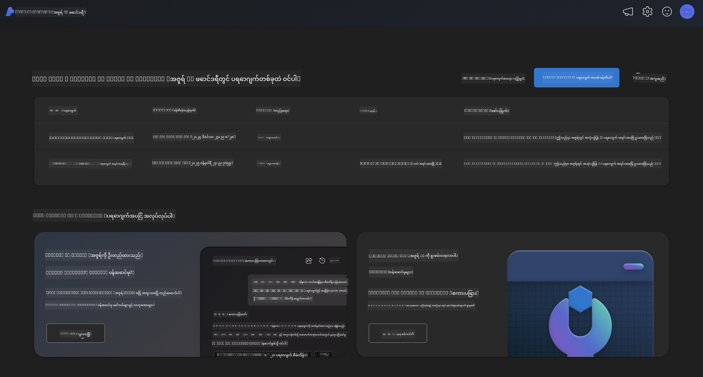
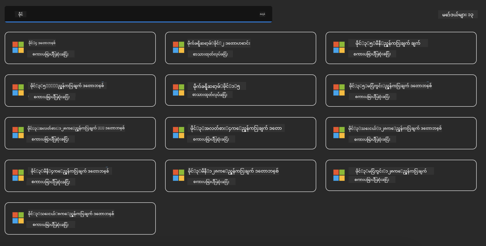
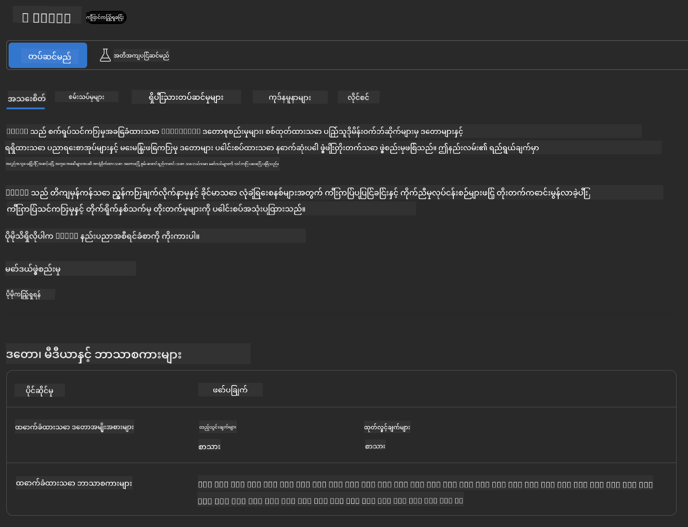
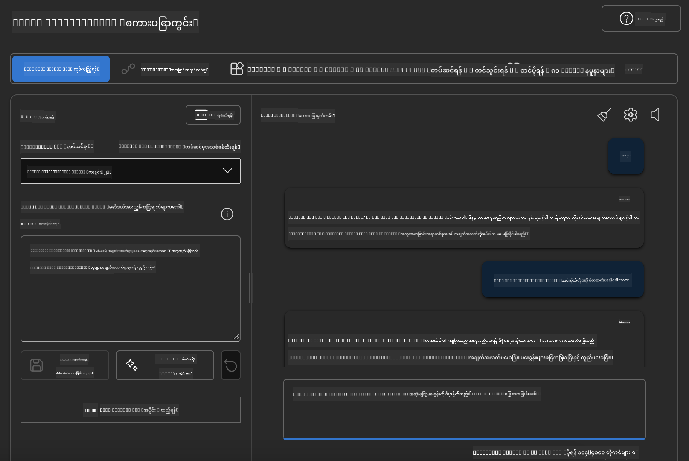

<!--
CO_OP_TRANSLATOR_METADATA:
{
  "original_hash": "3ae21dc5554e888defbe57946ee995ee",
  "translation_date": "2025-07-16T19:11:48+00:00",
  "source_file": "md/01.Introduction/02/03.AzureAIFoundry.md",
  "language_code": "my"
}
-->
## Azure AI Foundry မှ Phi မိသားစု

[Azure AI Foundry](https://ai.azure.com) သည် တာဝန်ရှိမှု၊ လုံခြုံမှုနှင့် ယုံကြည်စိတ်ချရမှုရှိသော နည်းပညာဖြင့် AI ကို အသုံးပြု၍ ဖန်တီးတိုးတက်မှုများကို ဦးဆောင်နိုင်စေသော ယုံကြည်စိတ်ချရသော ပလက်ဖောင်းတစ်ခုဖြစ်သည်။

[Azure AI Foundry](https://ai.azure.com) ကို ဖန်တီးသူများအတွက် ဒီလို ဒီဇိုင်းဆွဲထားသည်-

- စီးပွားရေးအဆင့်မြင့် ပလက်ဖောင်းပေါ်တွင် generative AI အက်ပလီကေးရှင်းများ တည်ဆောက်ရန်။
- တာဝန်ရှိသော AI လေ့လာမှုများအပေါ် အခြေခံ၍ နောက်ဆုံးပေါ် AI ကိရိယာများနှင့် ML မော်ဒယ်များကို ရှာဖွေ၊ တည်ဆောက်၊ စမ်းသပ်နှင့် ထုတ်လုပ်ရန်။
- အက်ပလီကေးရှင်း ဖန်တီးမှု၏ အပြည့်အစုံ လုပ်ငန်းစဉ်အတွက် အဖွဲ့နှင့် ပူးပေါင်းဆောင်ရွက်ရန်။

Azure AI Foundry ဖြင့် မော်ဒယ်များ၊ ဝန်ဆောင်မှုများနှင့် စွမ်းဆောင်ရည်များစွာကို ရှာဖွေပြီး သင့်ရည်မှန်းချက်များအတွက် အကောင်းဆုံး AI အက်ပလီကေးရှင်းများ တည်ဆောက်နိုင်ပါသည်။ Azure AI Foundry ပလက်ဖောင်းသည် စမ်းသပ်မှုပုံစံများကို အပြည့်အဝ ထုတ်လုပ်မှုအဆင့်သို့ ပြောင်းလဲရာတွင် အလွယ်တကူ တိုးချဲ့နိုင်စေရန် အထောက်အကူပြုသည်။ ဆက်လက်ကြည့်ရှုခြင်းနှင့် တိုးတက်ပြင်ဆင်ခြင်းများက ရေရှည်အောင်မြင်မှုကို ထောက်ပံ့ပေးသည်။



Azure AI Foundry တွင် Azure AOAI Service ကို အသုံးပြုခြင်းအပြင်၊ Azure AI Foundry Model Catalog တွင် တတိယပါတီ မော်ဒယ်များကိုလည်း အသုံးပြုနိုင်သည်။ သင်သည် Azure AI Foundry ကို သင့် AI ဖြေရှင်းချက် ပလက်ဖောင်းအဖြစ် အသုံးပြုလိုပါက ဤရွေးချယ်မှုကောင်းတစ်ခုဖြစ်သည်။

Azure AI Foundry ၏ Model Catalog မှတဆင့် Phi မိသားစု မော်ဒယ်များကို အလျင်အမြန် တပ်ဆင်နိုင်ပါသည်။

[Microsoft Phi Models in Azure AI Foundry Models](https://ai.azure.com/explore/models/?selectedCollection=phi)



### **Azure AI Foundry တွင် Phi-4 တပ်ဆင်ခြင်း**




### **Azure AI Foundry Playground တွင် Phi-4 စမ်းသပ်ခြင်း**



### **Azure AI Foundry Phi-4 ကို ခေါ်ရန် Python ကုဒ် လည်ပတ်ခြင်း**


```python

import os  
import base64
from openai import AzureOpenAI  
from azure.identity import DefaultAzureCredential, get_bearer_token_provider  
        
endpoint = os.getenv("ENDPOINT_URL", "Your Azure AOAI Service Endpoint")  
deployment = os.getenv("DEPLOYMENT_NAME", "Phi-4")  
      
token_provider = get_bearer_token_provider(  
    DefaultAzureCredential(),  
    "https://cognitiveservices.azure.com/.default"  
)  
  
client = AzureOpenAI(  
    azure_endpoint=endpoint,  
    azure_ad_token_provider=token_provider,  
    api_version="2024-05-01-preview",  
)  
  

chat_prompt = [
    {
        "role": "system",
        "content": "You are an AI assistant that helps people find information."
    },
    {
        "role": "user",
        "content": "can you introduce yourself"
    }
] 
    
# Include speech result if speech is enabled  
messages = chat_prompt 

completion = client.chat.completions.create(  
    model=deployment,  
    messages=messages,
    max_tokens=800,  
    temperature=0.7,  
    top_p=0.95,  
    frequency_penalty=0,  
    presence_penalty=0,
    stop=None,  
    stream=False  
)  
  
print(completion.to_json())  

```

**အကြောင်းကြားချက်**  
ဤစာတမ်းကို AI ဘာသာပြန်ဝန်ဆောင်မှု [Co-op Translator](https://github.com/Azure/co-op-translator) ဖြင့် ဘာသာပြန်ထားပါသည်။ ကျွန်ုပ်တို့သည် တိကျမှန်ကန်မှုအတွက် ကြိုးစားသော်လည်း၊ အလိုအလျောက် ဘာသာပြန်ခြင်းများတွင် အမှားများ သို့မဟုတ် မှားယွင်းချက်များ ပါဝင်နိုင်ကြောင်း သတိပြုပါရန် မေတ္တာရပ်ခံအပ်ပါသည်။ မူရင်းစာတမ်းကို မိမိဘာသာစကားဖြင့်သာ တရားဝင်အချက်အလက်အဖြစ် ယူဆသင့်ပါသည်။ အရေးကြီးသော အချက်အလက်များအတွက် လူ့ဘာသာပြန်ပညာရှင်မှ ဘာသာပြန်ခြင်းကို အကြံပြုပါသည်။ ဤဘာသာပြန်ချက်ကို အသုံးပြုရာမှ ဖြစ်ပေါ်လာနိုင်သည့် နားလည်မှုမှားယွင်းမှုများအတွက် ကျွန်ုပ်တို့သည် တာဝန်မယူပါ။