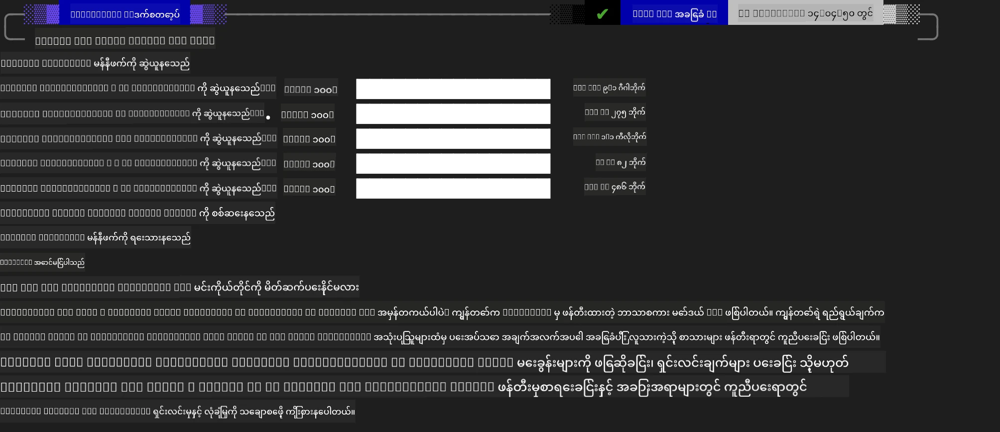
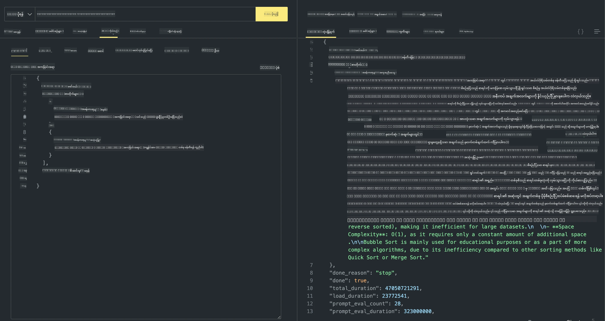

<!--
CO_OP_TRANSLATOR_METADATA:
{
  "original_hash": "2aa35f3c8b437fd5dc9995d53909d495",
  "translation_date": "2025-12-21T14:18:09+00:00",
  "source_file": "md/01.Introduction/02/04.Ollama.md",
  "language_code": "my"
}
-->
## Ollama တွင် Phi မိသားစု


[Ollama](https://ollama.com) သည် လူများအများအတွက် ရိုးရှင်းသော script များဖြင့် open source LLM သို့မဟုတ် SLM များကို တိုက်ရိုက် ထုတ်ပေးနိုင်စေပြီး၊ ဒေသတွင်း Copilot အပလီကေးရှင်း အသုံးပြုမှုအခြေအနေရန် API များလည်း တည်ဆောက်ပေးနိုင်သည်။

## **1. တပ်ဆင်ခြင်း**

Ollama သည် Windows, macOS, နှင့် Linux ပေါ်တွင် လည်ပတ်နိုင်သည်။ သင်သည် Ollama ကို ဤလင့်ခ်မှ တပ်ဆင်နိုင်သည် ([https://ollama.com/download](https://ollama.com/download))။ တပ်ဆင်မှု အောင်မြင်ပြီးနောက် သင်သည် terminal ပြတင်းပေါ်မှ ကိုယ်တိုင် Ollama script ကို အသုံးပြု၍ Phi-3 ကို ခေါ်နိုင်မည်ဖြစ်သည်။ Ollama ထဲရှိ ရနိုင်သော မော်ဒယ်များအားလုံးကို [Ollama မှ ရရှိနိုင်သော library များ](https://ollama.com/library) တွင် ကြည့်ရှုနိုင်သည်။ Codespace တွင် ဤ repository ကို ဖွင့်ထားပါက Ollama ကို ယခင်ကပဲ 설치 ထားပြီးဖြစ်သည်။

```bash

ollama run phi4

```

> [!NOTE]
> မော်ဒယ်ကို ပထမဆုံးအသုံးပြုသောအခါ အရင်ဆုံး ဒေါင်းလုပ်ဆွဲမည်။ သင်သည် ရှိပြီးသား ဒေါင်းလွှာထားသော Phi-4 မော်ဒယ်ကိုလည်း တိုက်ရိုက် သတ်မှတ်နိုင်သည်။ ဥပမာအနေဖြင့် WSL ကို အသုံးပြုပြီး ကွန်မန်း드를 ထည့်သတ်ထားသည်။ မော်ဒယ်ကို အောင်မြင်စွာ ဒေါင်းလုပ်ဆွဲပြီးနောက် terminal ပေါ်တွင် တိုက်ရိုက် ဆက်သွယ်နိုင်ပါသည်။



## **2. Ollama မှ phi-4 API ကို ခေါ်ယူခြင်း**

Ollama မှ ဖန်တီးထားသော Phi-4 API ကို ခေါ်ယူလိုပါက terminal တွင် ဤ command ကို အသုံးပြု၍ Ollama server ကို စတင်နိုင်ပါသည်။

```bash

ollama serve

```

> [!NOTE]
> MacOS သို့မဟုတ် Linux ပေါ်တွင် လည်ပတ်နေပါက အောက်ပါ အမှား **"Error: listen tcp 127.0.0.1:11434: bind: address already in use"** ကို ကြုံတွေ့နိုင်သည်။ ကွန်မန်း드를 ထပ်မံ ဖြည့်သည့်အခါ ဤအမှားကို တွေ့နိုင်ပြီး၊ အများအားဖြင့် server သည် ရှိပြီးသား လည်ပတ်နေသည်ဟု ဆိုလိုသောကြောင့် ဤအမှားကို မလောက်လောက် စိုးမောပဲ လက်လျှော့နိုင်သည်။ သို့မဟုတ် Ollama ကို ရပ်ပြီး ပြန်စတင်နိုင်သည်။

**macOS**

```bash

brew services restart ollama

```

**Linux**

```bash

sudo systemctl stop ollama

```

Ollama သည် API နှစ်မျိုးကို ပံ့ပိုးပေးသည်: generate နှင့် chat။ သင်၏ လိုအပ်ချက်အရ Ollama ပေးထားသော မော်ဒယ် API များကို ခေါ်ရန်၊ ပေါ့(သို့) local service 11434 ပေါ်တွင် လည်ပတ်နေသော endpoint များသို့ တောင်းဆိုမှုများ ပို့နိုင်သည်။

**Chat**

```bash

curl http://127.0.0.1:11434/api/chat -d '{
  "model": "phi3",
  "messages": [
    {
      "role": "system",
      "content": "Your are a python developer."
    },
    {
      "role": "user",
      "content": "Help me generate a bubble algorithm"
    }
  ],
  "stream": false
  
}'
```

ဤသည်မှာ Postman တွင် ရရှိသော ရလဒ် ဖြစ်သည်



## အပိုဆောင်း ရင်းမြစ်များ

Ollama ထဲမှ ရရှိနိုင်သော မော်ဒယ်စာရင်းကို [သူတို့၏ library](https://ollama.com/library) တွင် ကြည့်ရှုပါ။

Ollama server မှ သင်၏ မော်ဒယ်ကို ဆွဲယူရန် ဤ command ကို အသုံးပြုပါ

```bash
ollama pull phi4
```

မော်ဒယ်ကို လည်ပတ်ရန် ဤ command ကို အသုံးပြုပါ

```bash
ollama run phi4
```

***မှတ်ချက်:*** ထပ်မံသိရှိလိုပါက ဤလင့်ခ်ကို ကြည့်ပါ [https://github.com/ollama/ollama/blob/main/docs/api.md](https://github.com/ollama/ollama/blob/main/docs/api.md)

## Python မှ Ollama ကို ခေါ်ယူခြင်း

အထက်တွင် အသုံးပြုထားသည့် local server endpoints များသို့ တောင်းဆိုချက်များ ပြုလုပ်ရန် `requests` သို့မဟုတ် `urllib3` ကို အသုံးပြုနိုင်သည်။ သို့သော် Python တွင် Ollama ကို အသုံးပြုရန် လူကြိုက်များသော နည်းလမ်းမှာ Ollama သည် OpenAI-compatible server endpoints များကိုလည်း ပံ့ပိုးပေးသည့်အတွက် [openai](https://pypi.org/project/openai/) SDK ကို အသုံးပြုခြင်း ဖြစ်သည်။

Here is an example for phi3-mini:

```python
import openai

client = openai.OpenAI(
    base_url="http://localhost:11434/v1",
    api_key="nokeyneeded",
)

response = client.chat.completions.create(
    model="phi4",
    temperature=0.7,
    n=1,
    messages=[
        {"role": "system", "content": "You are a helpful assistant."},
        {"role": "user", "content": "Write a haiku about a hungry cat"},
    ],
)

print("Response:")
print(response.choices[0].message.content)
```

## JavaScript မှ Ollama ကို ခေါ်ယူခြင်း

```javascript
// Phi-4 ဖြင့် ဖိုင်ကို အနှစ်ချုပ်ပြုလုပ်ခြင်း၏ ဥပမာ
script({
    model: "ollama:phi4",
    title: "Summarize with Phi-4",
    system: ["system"],
})

// အနှစ်ချုပ်ပြုလုပ်ခြင်း၏ ဥပမာ
const file = def("FILE", env.files)
$`Summarize ${file} in a single paragraph.`
```

## C# မှ Ollama ကို ခေါ်ယူခြင်း

C# Console application အသစ် တစ်ခု ဖန်တီးပြီး အောက်ပါ NuGet package ကို ထည့်ပါ:

```bash
dotnet add package Microsoft.SemanticKernel --version 1.34.0
```

ထို့နောက် ဤ code ကို `Program.cs` ဖိုင်တွင် အစားထိုးပါ

```csharp
using Microsoft.SemanticKernel;
using Microsoft.SemanticKernel.ChatCompletion;

// add chat completion service using the local ollama server endpoint
#pragma warning disable SKEXP0001, SKEXP0003, SKEXP0010, SKEXP0011, SKEXP0050, SKEXP0052
builder.AddOpenAIChatCompletion(
    modelId: "phi4",
    endpoint: new Uri("http://localhost:11434/"),
    apiKey: "non required");

// invoke a simple prompt to the chat service
string prompt = "Write a joke about kittens";
var response = await kernel.InvokePromptAsync(prompt);
Console.WriteLine(response.GetValue<string>());
```

အက်ပ်ကို အောက်ပါ command ဖြင့် ပြေးပါ:

```bash
dotnet run
```

---

<!-- CO-OP TRANSLATOR DISCLAIMER START -->
သတိပေးချက်:
ဤစာတမ်းကို AI ဘာသာပြန်ဝန်ဆောင်မှု [Co-op Translator](https://github.com/Azure/co-op-translator) အသုံးပြု၍ ဘာသာပြန်ထားပါသည်။ တိကျမှန်ကန်မှုအတွက် ကြိုးပမ်းထားသော်လည်း အလိုအလျောက် ဘာသာပြန်ချက်များတွင် အမှားများ သို့မဟုတ် မမှန်ကန်သော အချက်အလက်များ ပါဝင်နိုင်ကြောင်း ကျေးဇူးပြု၍ သိရှိထားပါ။ မူလစာတမ်းကို မူလဘာသာစကားဖြင့်သာ တရားဝင်သော အရင်းအမြစ်အဖြစ် ယူဆသင့်သည်။ အရေးကြီးသော အချက်အလက်များအတွက် သက်ဆိုင်ရာ ပရော်ဖက်ရှင်နယ် လူဘာသာပြန်နှင့် ဆက်သွယ်ရန် အကြံပြုပါသည်။ ဤဘာသာပြန်ချက်ကို အသုံးပြုခြင်းကနေ ဖြစ်ပေါ်နိုင်သည့် နားမလည်မှုများ သို့မဟုတ် မှားယွင်းဖော်ပြချက်များအတွက် ကျွန်ုပ်တို့ တာဝန်မယူပါ။
<!-- CO-OP TRANSLATOR DISCLAIMER END -->