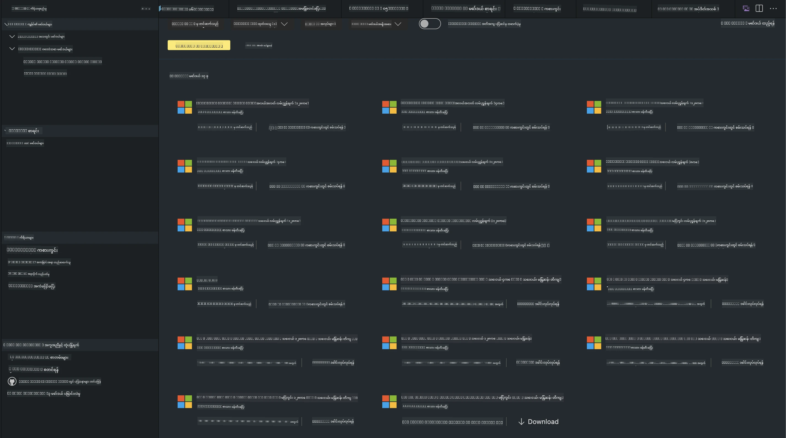
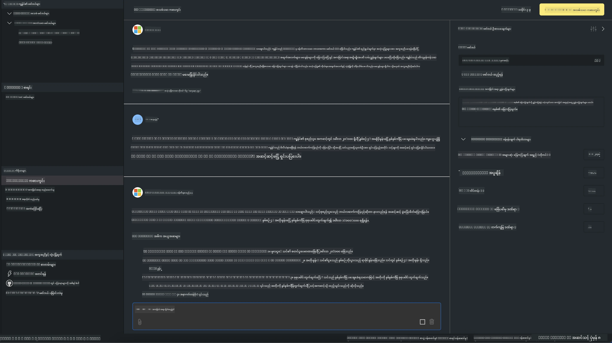

<!--
CO_OP_TRANSLATOR_METADATA:
{
  "original_hash": "4951d458c0b60c02cd1e751b40903877",
  "translation_date": "2025-07-16T19:31:38+00:00",
  "source_file": "md/01.Introduction/02/05.AITK.md",
  "language_code": "my"
}
-->
# Phi Family in AITK

[AI Toolkit for VS Code](https://marketplace.visualstudio.com/items?itemName=ms-windows-ai-studio.windows-ai-studio) သည် Azure AI Foundry Catalog နှင့် Hugging Face ကဲ့သို့သော အခြား catalog များမှ နောက်ဆုံးပေါ် AI ဖွံ့ဖြိုးရေးကိရိယာများနှင့် မော်ဒယ်များကို ပေါင်းစပ်ပေးခြင်းဖြင့် generative AI app ဖန်တီးမှုကို လွယ်ကူစေသည်။ GitHub Models နှင့် Azure AI Foundry Model Catalogs မှ ထောက်ပံ့ထားသော AI မော်ဒယ်များ catalog ကို ကြည့်ရှုနိုင်ပြီး၊ ဒေါင်းလုပ်လုပ်၍ ဒေသတွင်း သို့မဟုတ် ဝေးလံရာမှ fine-tune၊ စမ်းသပ်ပြီး သင့် application တွင် အသုံးပြုနိုင်ပါသည်။

AI Toolkit Preview ကို ဒေသတွင်းတွင် ပြေးဆွဲနိုင်သည်။ ဒေသတွင်း inference သို့မဟုတ် fine-tune လုပ်ခြင်းသည် သင်ရွေးချယ်ထားသော မော်ဒယ်ပေါ် မူတည်ပြီး NVIDIA CUDA GPU ကဲ့သို့သော GPU လိုအပ်နိုင်ပါသည်။ GitHub Models များကိုလည်း AITK ဖြင့် တိုက်ရိုက် ပြေးဆွဲနိုင်ပါသည်။

## စတင်အသုံးပြုခြင်း

[Windows subsystem for Linux ကို မည်သို့ 설치ရမည်ကို ပိုမိုလေ့လာရန်](https://learn.microsoft.com/windows/wsl/install?WT.mc_id=aiml-137032-kinfeylo)

နှင့် [ပုံမှန် Linux distribution ကို ပြောင်းလဲခြင်း](https://learn.microsoft.com/windows/wsl/install#change-the-default-linux-distribution-installed) ကိုလည်း ကြည့်ရှုနိုင်ပါသည်။

[AI Toolkit GitHub Repo](https://github.com/microsoft/vscode-ai-toolkit/)

- Windows, Linux, macOS
- Windows နှင့် Linux နှစ်ခုလုံးတွင် finetuning လုပ်ရန် Nvidia GPU လိုအပ်ပါသည်။ ထို့အပြင် **Windows** တွင် Ubuntu 18.4 သို့မဟုတ် အထက်ရှိ Linux subsystem လိုအပ်ပါသည်။ [Windows subsystem for Linux ကို မည်သို့ 설치ရမည်ကို ပိုမိုလေ့လာရန်](https://learn.microsoft.com/windows/wsl/install) နှင့် [ပုံမှန် distribution ပြောင်းလဲခြင်း](https://learn.microsoft.com/windows/wsl/install#change-the-default-linux-distribution-installed) ကို ကြည့်ရှုပါ။

### AI Toolkit 설치ခြင်း

AI Toolkit သည် [Visual Studio Code Extension](https://code.visualstudio.com/docs/setup/additional-components#_vs-code-extensions) အဖြစ် ထုတ်ပေးထားသောကြောင့် ပထမဦးဆုံး [VS Code](https://code.visualstudio.com/docs/setup/windows?WT.mc_id=aiml-137032-kinfeylo) ကို 설치ပြီးနောက် [VS Marketplace](https://marketplace.visualstudio.com/items?itemName=ms-windows-ai-studio.windows-ai-studio) မှ AI Toolkit ကို ဒေါင်းလုပ်လုပ်ရပါမည်။
[AI Toolkit သည် Visual Studio Marketplace တွင် ရရှိနိုင်ပြီး](https://marketplace.visualstudio.com/items?itemName=ms-windows-ai-studio.windows-ai-studio) အခြား VS Code extension များကဲ့သို့ 설치နိုင်ပါသည်။

VS Code extension 설치မှုကို မသိပါက အောက်ပါအဆင့်များကို လိုက်နာပါ။

### Sign In

1. VS Code ၏ Activity Bar တွင် **Extensions** ကို ရွေးချယ်ပါ
2. Extensions ရှာဖွေရေးဘားတွင် "AI Toolkit" ဟု ရိုက်ထည့်ပါ
3. "AI Toolkit for Visual Studio code" ကို ရွေးချယ်ပါ
4. **Install** ကို နှိပ်ပါ

ယခု extension ကို အသုံးပြုရန် ပြင်ဆင်ပြီးပါပြီ။

GitHub သို့ စာရင်းဝင်ရန် တောင်းဆိုမည်ဖြစ်သောကြောင့် "Allow" ကို နှိပ်၍ ဆက်လက်လုပ်ဆောင်ပါ။ GitHub စာရင်းဝင် စာမျက်နှာသို့ ပြန်လည် ဦးတည်ပါမည်။

စာရင်းဝင်ပြီးနောက် လိုက်နာရမည့် အဆင့်များကို ဆက်လုပ်ဆောင်ပါ။ အောင်မြင်စွာ ပြီးဆုံးပါက VS Code သို့ ပြန်လည် ဦးတည်ပါမည်။

Extension 설치ပြီးပါက Activity Bar တွင် AI Toolkit အိုင်ကွန်ကို တွေ့မြင်ရမည်ဖြစ်သည်။

ရရှိနိုင်သော လုပ်ဆောင်ချက်များကို စတင်လေ့လာကြရအောင်!

### ရရှိနိုင်သော လုပ်ဆောင်ချက်များ

AI Toolkit ၏ အဓိက sidebar ကို အောက်ပါအတိုင်း စီစဉ်ထားသည်။

- **Models**
- **Resources**
- **Playground**
- **Fine-tuning**
- **Evaluation**

Resources အပိုင်းတွင် ရရှိနိုင်သည်။ စတင်ရန် **Model Catalog** ကို ရွေးချယ်ပါ။

### Catalog မှ မော်ဒယ် ဒေါင်းလုပ်လုပ်ခြင်း

VS Code sidebar မှ AI Toolkit ကို ဖွင့်ပြီးနောက် အောက်ပါရွေးချယ်စရာများရှိသည်။



- **Model Catalog** မှ ထောက်ပံ့ထားသော မော်ဒယ်ကို ရှာဖွေပြီး ဒေသတွင်း ဒေါင်းလုပ်လုပ်ပါ
- **Model Playground** တွင် မော်ဒယ် inference ကို စမ်းသပ်ပါ
- **Model Fine-tuning** တွင် ဒေသတွင်း သို့မဟုတ် ဝေးလံရာမှ မော်ဒယ်ကို fine-tune လုပ်ပါ
- AI Toolkit ၏ command palette မှတဆင့် fine-tuned မော်ဒယ်များကို cloud သို့ တင်ပါ
- မော်ဒယ်များကို အကဲဖြတ်ခြင်း

> [!NOTE]
>
> **GPU နှင့် CPU**
>
> မော်ဒယ်ကတ်များတွင် မော်ဒယ်အရွယ်အစား၊ ပလက်ဖောင်းနှင့် အမြန်ဆောင်မှု ပံ့ပိုးသူ (CPU, GPU) အမျိုးအစားကို တွေ့မြင်ရမည်ဖြစ်သည်။ **GPU တစ်ခုခုရှိသော Windows စက်များတွင် အကောင်းဆုံး စွမ်းဆောင်ရည်ရရှိရန်** Windows အတွက်သာ ရည်ရွယ်ထားသော မော်ဒယ်ဗားရှင်းများကို ရွေးချယ်ပါ။
>
> ၎င်းသည် DirectML accelerator အတွက် အကောင်းဆုံး မော်ဒယ်ဖြစ်စေပါသည်။
>
> မော်ဒယ်အမည်များသည် အောက်ပါပုံစံဖြင့် ရေးသားထားသည်။
>
> - `{model_name}-{accelerator}-{quantization}-{format}`။
>
> Windows စက်တွင် GPU ရှိမရှိ စစ်ဆေးရန် **Task Manager** ကို ဖွင့်ပြီး **Performance** tab ကို ရွေးချယ်ပါ။ GPU များရှိပါက "GPU 0" သို့မဟုတ် "GPU 1" ကဲ့သို့ အမည်များဖြင့် ဖော်ပြပါမည်။

### Playground တွင် မော်ဒယ် ပြေးဆွဲခြင်း

parameter များအားလုံး သတ်မှတ်ပြီးပါက **Generate Project** ကို နှိပ်ပါ။

မော်ဒယ် ဒေါင်းလုပ်ပြီးပါက catalog တွင် မော်ဒယ်ကတ်ပေါ်ရှိ **Load in Playground** ကို ရွေးချယ်ပါ။

- မော်ဒယ် ဒေါင်းလုပ်စတင်ပါမည်
- လိုအပ်သော prerequisite များနှင့် dependency များကို 설치ပါမည်
- VS Code workspace ကို ဖန်တီးပါမည်



### သင့် application တွင် REST API အသုံးပြုခြင်း

AI Toolkit သည် ဒေသတွင်း REST API web server **port 5272** တွင် ရရှိနိုင်ပြီး [OpenAI chat completions format](https://platform.openai.com/docs/api-reference/chat/create) ကို အသုံးပြုသည်။

ဤကိရိယာဖြင့် cloud AI မော်ဒယ်ဝန်ဆောင်မှု မလိုအပ်ဘဲ သင့် application ကို ဒေသတွင်း စမ်းသပ်နိုင်ပါသည်။ ဥပမာအနေဖြင့် အောက်ပါ JSON ဖိုင်သည် request body ကို မည်သို့ ဖွဲ့စည်းရမည်ကို ပြသသည်။

```json
{
    "model": "Phi-4",
    "messages": [
        {
            "role": "user",
            "content": "what is the golden ratio?"
        }
    ],
    "temperature": 0.7,
    "top_p": 1,
    "top_k": 10,
    "max_tokens": 100,
    "stream": true
}
```

REST API ကို [Postman](https://www.postman.com/) သို့မဟုတ် CURL (Client URL) utility ဖြင့် စမ်းသပ်နိုင်ပါသည်။

```bash
curl -vX POST http://127.0.0.1:5272/v1/chat/completions -H 'Content-Type: application/json' -d @body.json
```

### Python အတွက် OpenAI client library အသုံးပြုခြင်း

```python
from openai import OpenAI

client = OpenAI(
    base_url="http://127.0.0.1:5272/v1/", 
    api_key="x" # required for the API but not used
)

chat_completion = client.chat.completions.create(
    messages=[
        {
            "role": "user",
            "content": "what is the golden ratio?",
        }
    ],
    model="Phi-4",
)

print(chat_completion.choices[0].message.content)
```

### .NET အတွက် Azure OpenAI client library အသုံးပြုခြင်း

NuGet ဖြင့် [Azure OpenAI client library for .NET](https://www.nuget.org/packages/Azure.AI.OpenAI/) ကို သင့် project တွင် ထည့်ပါ။

```bash
dotnet add {project_name} package Azure.AI.OpenAI --version 1.0.0-beta.17
```

**OverridePolicy.cs** ဟု အမည်ပေးထားသော C# ဖိုင်တစ်ခုကို project တွင် ထည့်ပြီး အောက်ပါ ကုဒ်ကို ကူးထည့်ပါ။

```csharp
// OverridePolicy.cs
using Azure.Core.Pipeline;
using Azure.Core;

internal partial class OverrideRequestUriPolicy(Uri overrideUri)
    : HttpPipelineSynchronousPolicy
{
    private readonly Uri _overrideUri = overrideUri;

    public override void OnSendingRequest(HttpMessage message)
    {
        message.Request.Uri.Reset(_overrideUri);
    }
}
```

နောက်တစ်ဆင့်တွင် **Program.cs** ဖိုင်တွင် အောက်ပါ ကုဒ်ကို ကူးထည့်ပါ။

```csharp
// Program.cs
using Azure.AI.OpenAI;

Uri localhostUri = new("http://localhost:5272/v1/chat/completions");

OpenAIClientOptions clientOptions = new();
clientOptions.AddPolicy(
    new OverrideRequestUriPolicy(localhostUri),
    Azure.Core.HttpPipelinePosition.BeforeTransport);
OpenAIClient client = new(openAIApiKey: "unused", clientOptions);

ChatCompletionsOptions options = new()
{
    DeploymentName = "Phi-4",
    Messages =
    {
        new ChatRequestSystemMessage("You are a helpful assistant. Be brief and succinct."),
        new ChatRequestUserMessage("What is the golden ratio?"),
    }
};

StreamingResponse<StreamingChatCompletionsUpdate> streamingChatResponse
    = await client.GetChatCompletionsStreamingAsync(options);

await foreach (StreamingChatCompletionsUpdate chatChunk in streamingChatResponse)
{
    Console.Write(chatChunk.ContentUpdate);
}
```


## AI Toolkit ဖြင့် Fine Tuning

- မော်ဒယ် ရှာဖွေခြင်းနှင့် playground ဖြင့် စတင်ပါ။
- ဒေသတွင်း ကွန်ပျူတာ အရင်းအမြစ်များ အသုံးပြု၍ မော်ဒယ် fine-tuning နှင့် inference လုပ်ပါ။
- Azure အရင်းအမြစ်များ အသုံးပြု၍ ဝေးလံရာမှ fine-tuning နှင့် inference လုပ်ပါ။

[Fine Tuning with AI Toolkit](../../03.FineTuning/Finetuning_VSCodeaitoolkit.md)

## AI Toolkit Q&A အရင်းအမြစ်များ

အများဆုံး တွေ့ကြုံရသော ပြဿနာများနှင့် ဖြေရှင်းနည်းများအတွက် ကျွန်ုပ်တို့၏ [Q&A စာမျက်နှာ](https://github.com/microsoft/vscode-ai-toolkit/blob/main/archive/QA.md) ကို ကြည့်ရှုပါ။

**အကြောင်းကြားချက်**  
ဤစာတမ်းကို AI ဘာသာပြန်ဝန်ဆောင်မှု [Co-op Translator](https://github.com/Azure/co-op-translator) ဖြင့် ဘာသာပြန်ထားပါသည်။ ကျွန်ုပ်တို့သည် တိကျမှန်ကန်မှုအတွက် ကြိုးစားသော်လည်း၊ အလိုအလျောက် ဘာသာပြန်ခြင်းတွင် အမှားများ သို့မဟုတ် မှားယွင်းချက်များ ပါဝင်နိုင်ကြောင်း သတိပြုပါရန် မေတ္တာရပ်ခံအပ်ပါသည်။ မူရင်းစာတမ်းကို မိမိဘာသာစကားဖြင့်သာ တရားဝင်အချက်အလက်အဖြစ် ယူဆသင့်ပါသည်။ အရေးကြီးသော အချက်အလက်များအတွက် လူ့ဘာသာပြန်ပညာရှင်မှ ဘာသာပြန်ခြင်းကို အကြံပြုပါသည်။ ဤဘာသာပြန်ချက်ကို အသုံးပြုရာမှ ဖြစ်ပေါ်လာနိုင်သည့် နားလည်မှုမှားယွင်းမှုများအတွက် ကျွန်ုပ်တို့ တာဝန်မယူပါ။