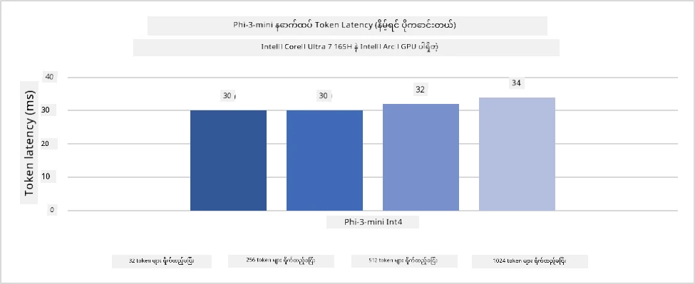
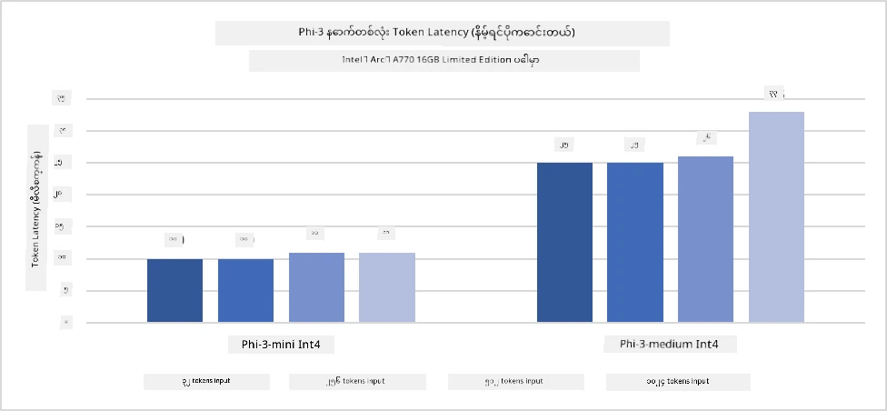
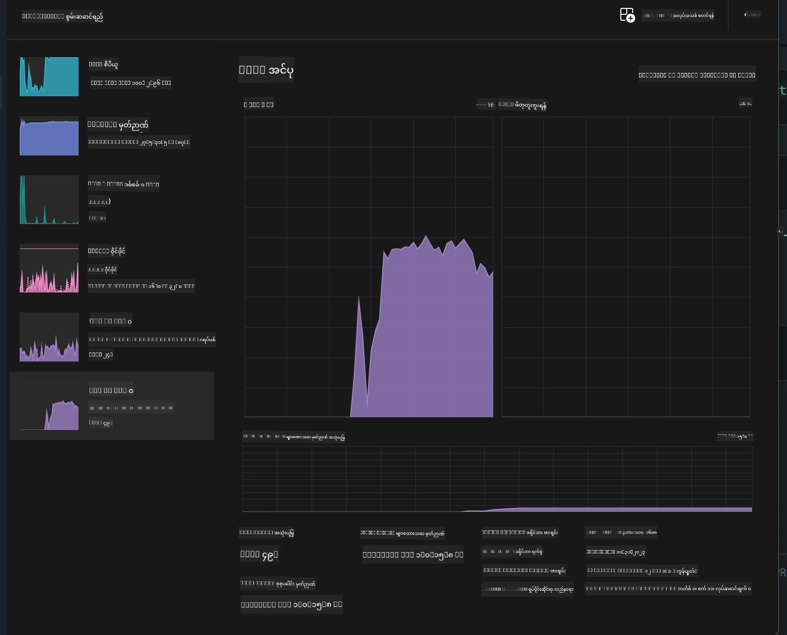
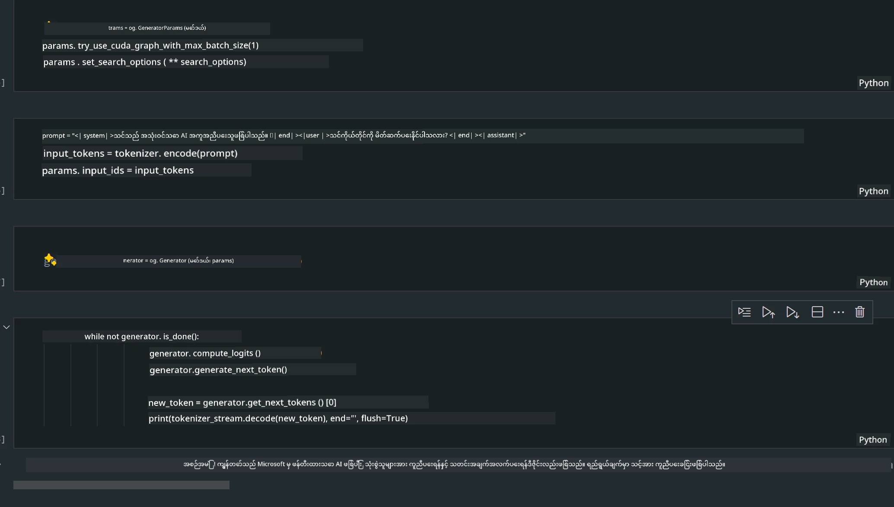
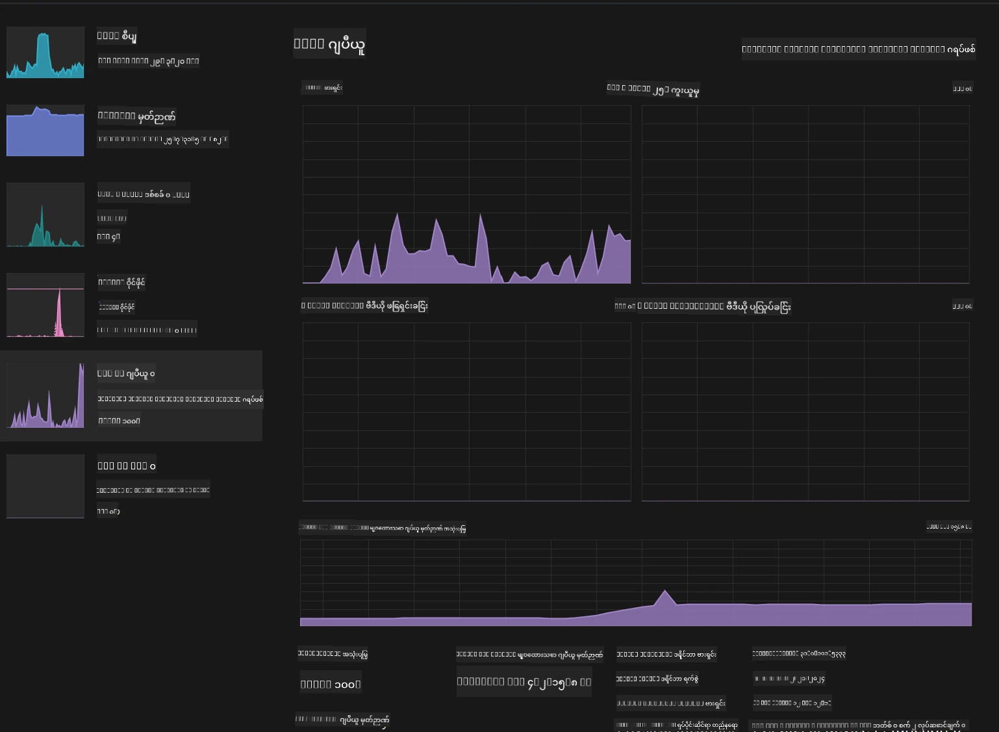

# **AI PC တွင် Phi-3 ကို အနုညာတစွာ အသုံးပြုခြင်း**

Generative AI နည်းပညာတိုးတက်လာခြင်းနှင့် edge device များ၏ hardware စွမ်းဆောင်ရည်တိုးတက်လာခြင်းကြောင့်၊ အသုံးပြုသူများ၏ Bring Your Own Device (BYOD) စက်များတွင် generative AI မော်ဒယ်များ ပိုမိုများပြားစွာ ထည့်သွင်းအသုံးပြုနိုင်လာသည်။ AI PC များသည် ထိုမော်ဒယ်များအနက် တစ်ခုဖြစ်သည်။ ၂၀၂၄ ခုနှစ်မှစ၍ Intel, AMD နှင့် Qualcomm တို့သည် PC ထုတ်လုပ်သူများနှင့် ပူးပေါင်း၍ hardware ပြင်ဆင်မှုများဖြင့် ဒေသတွင်း generative AI မော်ဒယ်များကို တပ်ဆင်အသုံးပြုနိုင်သော AI PC များကို မိတ်ဆက်ခဲ့သည်။ ဤဆွေးနွေးပွဲတွင် Intel AI PC များအပေါ် အာရုံစိုက်ကာ Intel AI PC တစ်လုံးတွင် Phi-3 ကို မည်သို့ တပ်ဆင်အသုံးပြုရမည်ကို ရှင်းလင်းပြသမည်ဖြစ်သည်။

### NPU ဆိုတာဘာလဲ

NPU (Neural Processing Unit) သည် neural network လုပ်ဆောင်ချက်များနှင့် AI အလုပ်များကို မြန်ဆန်စွာ ဆောင်ရွက်ရန် အထူးပြုထားသော processor သို့မဟုတ် processing unit တစ်ခုဖြစ်ပြီး၊ SoC အတွင်းတွင် တပ်ဆင်ထားသည်။ ယေဘုယျ CPU နှင့် GPU များနှင့် မတူဘဲ၊ NPU များသည် ဒေတာအခြေပြု ပုံစံဖြင့် 병렬တွက်ချက်မှုများအတွက် အထူးပြုထားပြီး ဗီဒီယို၊ ပုံရိပ်များကဲ့သို့သော multimedia ဒေတာများကို ထိရောက်စွာ ဆောင်ရွက်နိုင်သည်။ ထို့အပြင် စကားသံအသိအမှတ်ပြုခြင်း၊ ဗီဒီယိုခေါ်ဆိုမှုများတွင် နောက်ခံကို မိုက်ခရိုဖောက်ခြင်း၊ ပုံရိပ် သို့မဟုတ် ဗီဒီယို တည်းဖြတ်ခြင်းကဲ့သို့သော AI ဆိုင်ရာ လုပ်ငန်းများတွင် အထူးကျွမ်းကျင်သည်။

## NPU နှင့် GPU ၏ ကွာခြားချက်

AI နှင့် machine learning အလုပ်များအများစုသည် GPU များပေါ်တွင် လည်ပတ်သော်လည်း၊ GPU နှင့် NPU တို့အကြား အရေးကြီးသော ကွာခြားချက်ရှိသည်။  
GPU များသည် 병렬တွက်ချက်မှုစွမ်းရည်ကြောင့် နာမည်ကြီးသော်လည်း၊ ဂရပ်ဖစ်ဆိုင်ရာ အလုပ်များအပြင် အခြားလုပ်ငန်းများတွင် အားလုံးတူညီစွာ ထိရောက်မှုမရှိကြပါ။ NPU များသည် neural network လုပ်ငန်းစဉ်များတွင် လိုအပ်သော ရှုပ်ထွေးသောတွက်ချက်မှုများအတွက် အထူးပြုထားသောကြောင့် AI လုပ်ငန်းများတွင် ထိရောက်မှုမြင့်မားသည်။

အကျဉ်းချုပ်အားဖြင့် NPU များသည် AI တွက်ချက်မှုများကို အရှိန်မြှင့်ပေးသော သင်္ချာပညာရှင်များကဲ့သို့ ဖြစ်ပြီး AI PC များ၏ နောက်လာမည့်ခေတ်တွင် အရေးပါသော အခန်းကဏ္ဍကို ထမ်းဆောင်သည်။

***ဤဥပမာသည် Intel ၏ နောက်ဆုံးပေါ် Intel Core Ultra Processor အပေါ် အခြေခံထားသည်***

## **၁။ Phi-3 မော်ဒယ်ကို NPU ဖြင့် လည်ပတ်ခြင်း**

Intel® NPU device သည် Intel client CPU များနှင့် ပေါင်းစပ်ထားသော AI inference accelerator ဖြစ်ပြီး Intel® Core™ Ultra CPU များ (ယခင်တွင် Meteor Lake ဟုခေါ်) မှ စတင်ပါဝင်သည်။ ၎င်းသည် artificial neural network လုပ်ငန်းများကို စွမ်းအင်သက်သာစွာ လည်ပတ်စေသည်။





**Intel NPU Acceleration Library**

Intel NPU Acceleration Library [https://github.com/intel/intel-npu-acceleration-library](https://github.com/intel/intel-npu-acceleration-library) သည် Intel Neural Processing Unit (NPU) ၏ စွမ်းအားကို အသုံးပြု၍ သင့် application များ၏ ထိရောက်မှုကို မြှင့်တင်ပေးသည့် Python library တစ်ခုဖြစ်သည်။

Intel® Core™ Ultra processor များဖြင့် အားပေးထားသော AI PC ပေါ်တွင် Phi-3-mini ၏ ဥပမာ။


Python Library ကို pip ဖြင့် ထည့်သွင်းပါ

```bash

   pip install intel-npu-acceleration-library

```

***မှတ်ချက်*** ပရောဂျက်သည် အခုလက်ရှိ ဖွံ့ဖြိုးဆဲဖြစ်သော်လည်း ကိုးကားမော်ဒယ်သည် အလွန်ပြည့်စုံပြီးဖြစ်သည်။

### **Intel NPU Acceleration Library ဖြင့် Phi-3 ကို လည်ပတ်ခြင်း**

Intel NPU acceleration ကို အသုံးပြုသောအခါ၊ ဤ library သည် ရိုးရာ encoding လုပ်ငန်းစဉ်ကို ထိခိုက်စေခြင်းမရှိပါ။ သင်သည် ဤ library ကို အသုံးပြု၍ Phi-3 မော်ဒယ်ကို FP16၊ INT8၊ INT4 ကဲ့သို့ quantize လုပ်ရုံဖြင့် လုံလောက်သည်။

```python
from transformers import AutoTokenizer, pipeline,TextStreamer
from intel_npu_acceleration_library import NPUModelForCausalLM, int4
from intel_npu_acceleration_library.compiler import CompilerConfig
import warnings

model_id = "microsoft/Phi-3-mini-4k-instruct"

compiler_conf = CompilerConfig(dtype=int4)
model = NPUModelForCausalLM.from_pretrained(
    model_id, use_cache=True, config=compiler_conf, attn_implementation="sdpa"
).eval()

tokenizer = AutoTokenizer.from_pretrained(model_id)

text_streamer = TextStreamer(tokenizer, skip_prompt=True)
```

Quantification အောင်မြင်ပြီးပါက NPU ကို ခေါ်ယူ၍ Phi-3 မော်ဒယ်ကို လည်ပတ်စေပါ။

```python
generation_args = {
   "max_new_tokens": 1024,
   "return_full_text": False,
   "temperature": 0.3,
   "do_sample": False,
   "streamer": text_streamer,
}

pipe = pipeline(
   "text-generation",
   model=model,
   tokenizer=tokenizer,
)

query = "<|system|>You are a helpful AI assistant.<|end|><|user|>Can you introduce yourself?<|end|><|assistant|>"

with warnings.catch_warnings():
    warnings.simplefilter("ignore")
    pipe(query, **generation_args)
```

ကုဒ်ကို လည်ပတ်စဉ် NPU ၏ လည်ပတ်မှုအခြေအနေကို Task Manager မှ ကြည့်ရှုနိုင်သည်။



***နမူနာများ*** : [AIPC_NPU_DEMO.ipynb](../../../../../code/03.Inference/AIPC/AIPC_NPU_DEMO.ipynb)

## **၂။ DirectML + ONNX Runtime ဖြင့် Phi-3 မော်ဒယ် လည်ပတ်ခြင်း**

### **DirectML ဆိုတာဘာလဲ**

[DirectML](https://github.com/microsoft/DirectML) သည် machine learning အတွက် hardware-အခြေပြု DirectX 12 library တစ်ခုဖြစ်ပြီး မြန်ဆန်စွာ လည်ပတ်စေသည်။ DirectML သည် AMD, Intel, NVIDIA, Qualcomm ကဲ့သို့သော vendor များ၏ DirectX 12 ကို ထောက်ပံ့သော GPU များအတွက် machine learning အလုပ်များကို GPU acceleration ဖြင့် လုပ်ဆောင်ပေးသည်။

Standalone အဖြစ် အသုံးပြုသောအခါ DirectML API သည် low-level DirectX 12 library ဖြစ်ပြီး framework များ၊ ဂိမ်းများနှင့် အချိန်နှင့်တပြေးညီ လည်ပတ်သည့် application များအတွက် သင့်တော်သည်။ DirectML ၏ Direct3D 12 နှင့် seamless interoperability၊ နည်းပါးသော overhead နှင့် hardware များအတွင်း တူညီသော လုပ်ဆောင်မှုကြောင့် high performance နှင့် ယုံကြည်စိတ်ချရမှုလိုအပ်သော machine learning acceleration အတွက် အထူးသင့်တော်သည်။

***မှတ်ချက်*** : နောက်ဆုံးပေါ် DirectML သည် NPU ကိုလည်း ထောက်ပံ့သည် (https://devblogs.microsoft.com/directx/introducing-neural-processor-unit-npu-support-in-directml-developer-preview/)

### DirectML နှင့် CUDA ၏ စွမ်းဆောင်ရည်နှင့် လုပ်ဆောင်ချက်များ

**DirectML** သည် Microsoft မှ ဖန်တီးထားသော machine learning library ဖြစ်သည်။ Windows စက်များ (desktop, laptop, edge device) ပေါ်တွင် machine learning အလုပ်များကို မြန်ဆန်စွာ လည်ပတ်စေသည်။  
- DX12 အခြေပြု: DirectML သည် DirectX 12 (DX12) အပေါ်တွင် တည်ဆောက်ထားပြီး NVIDIA နှင့် AMD အပါအဝင် GPU များအတွက် hardware support ကျယ်ပြန့်သည်။  
- ပိုမိုကျယ်ပြန့်သော ထောက်ပံ့မှု: DX12 ကို အသုံးပြုသောကြောင့် DX12 ထောက်ပံ့သော GPU များအားလုံးနှင့် အလုပ်လုပ်နိုင်သည်၊ integrated GPU များပါဝင်သည်။  
- ပုံရိပ်ဆိုင်ရာ လုပ်ငန်းများ: DirectML သည် neural network များဖြင့် ပုံရိပ်များနှင့် အခြားဒေတာများကို လုပ်ဆောင်နိုင်ပြီး ပုံရိပ်အသိအမှတ်ပြုခြင်း၊ အရာဝတ္ထုရှာဖွေခြင်း စသည့် လုပ်ငန်းများအတွက် သင့်တော်သည်။  
- တပ်ဆင်ရလွယ်ကူမှု: DirectML ကို တပ်ဆင်ရလွယ်ကူပြီး GPU ထုတ်လုပ်သူများ၏ အထူး SDK များ မလိုအပ်ပါ။  
- စွမ်းဆောင်ရည်: အချို့အခြေအနေများတွင် DirectML သည် CUDA ထက် ပိုမြန်နိုင်သည်၊ အထူးသဖြင့် အချို့သော အလုပ်များတွင်။  
- ကန့်သတ်ချက်များ: သို့သော် float16 အရွယ်အစားကြီးသော batch များတွင် DirectML သည် နည်းနည်းနှေးကွေးနိုင်သည်။

**CUDA** သည် NVIDIA ၏ parallel computing platform နှင့် programming model ဖြစ်ပြီး NVIDIA GPU များ၏ စွမ်းအားကို general-purpose computing အတွက် အသုံးပြုနိုင်စေသည်။  
- NVIDIA အထူးပြု: CUDA သည် NVIDIA GPU များနှင့် အထူးသင့်တော်စွာ ပေါင်းစပ်ထားသည်။  
- အလွန်ထိရောက်သော စွမ်းဆောင်ရည်: NVIDIA GPU များတွင် GPU acceleration လုပ်ငန်းများအတွက် ထူးခြားစွာ မြန်ဆန်သည်။  
- ကျယ်ပြန့်စွာ အသုံးပြု: TensorFlow, PyTorch ကဲ့သို့သော machine learning framework များတွင် CUDA ထောက်ပံ့မှု ရှိသည်။  
- စိတ်ကြိုက်ပြင်ဆင်နိုင်မှု: developer များသည် CUDA ကို အထူးလိုအပ်ချက်များအတွက် ပြင်ဆင်နိုင်ပြီး ထိရောက်မှုအမြင့်ဆုံးရရှိစေသည်။  
- ကန့်သတ်ချက်များ: သို့သော် CUDA သည် NVIDIA hardware အပေါ် မူတည်မှုကြောင့် အခြား GPU များနှင့် အကျယ်ပြန့်စွာ ကိုက်ညီမှုမရှိနိုင်ပါ။

### DirectML နှင့် CUDA တို့အကြား ရွေးချယ်ခြင်း

DirectML နှင့် CUDA တို့ကို ရွေးချယ်ရာတွင် သင့်အသုံးပြုမှု၊ hardware ရရှိနိုင်မှုနှင့် စိတ်ကြိုက်မှုများပေါ် မူတည်သည်။  
ကျယ်ပြန့်သော ကိုက်ညီမှုနှင့် တပ်ဆင်ရလွယ်ကူမှုလိုအပ်ပါက DirectML သည် ကောင်းမွန်သော ရွေးချယ်မှုဖြစ်နိုင်သည်။ သို့သော် NVIDIA GPU များရှိပြီး အလွန်ထိရောက်သော စွမ်းဆောင်ရည်လိုအပ်ပါက CUDA သည် အားကောင်းသော ရွေးချယ်မှုဖြစ်သည်။ အကျဉ်းချုပ်အားဖြင့် DirectML နှင့် CUDA တို့တွင် အားသာချက်နှင့် အားနည်းချက်များ ရှိသဖြင့် သင့်လိုအပ်ချက်နှင့် hardware ရရှိနိုင်မှုအပေါ် မူတည်၍ ဆုံးဖြတ်ပါ။

### **ONNX Runtime ဖြင့် Generative AI**

AI ခေတ်တွင် AI မော်ဒယ်များကို တစ်နေရာမှ တစ်နေရာသို့ လွယ်ကူစွာ သယ်ယူနိုင်ခြင်းမှာ အလွန်အရေးကြီးသည်။ ONNX Runtime သည် သင်ကြားပြီးသော မော်ဒယ်များကို ကိရိယာအမျိုးမျိုးပေါ်တွင် လွယ်ကူစွာ တပ်ဆင်အသုံးပြုနိုင်စေသည်။ developer များသည် inference framework ကို စိတ်မပူပန်ဘဲ တစ်ခုတည်းသော API ဖြင့် မော်ဒယ် inference ကို ပြီးမြောက်စေသည်။ Generative AI ခေတ်တွင် ONNX Runtime သည် code optimization ကိုလည်း ပြုလုပ်ထားပြီး (https://onnxruntime.ai/docs/genai/) quantized generative AI မော်ဒယ်များကို terminal များအမျိုးမျိုးပေါ်တွင် inference ပြုလုပ်နိုင်သည်။ Generative AI with ONNX Runtime တွင် Python, C#, C / C++ API များဖြင့် AI မော်ဒယ် inference ပြုလုပ်နိုင်ပြီး iPhone ပေါ်တွင် C++ API ကို အသုံးပြု၍ deployment ပြုလုပ်နိုင်သည်။

[နမူနာကုဒ်](https://github.com/Azure-Samples/Phi-3MiniSamples/tree/main/onnx)

***Generative AI with ONNX Runtime library ကို compile ပြုလုပ်ခြင်း***

```bash

winget install --id=Kitware.CMake  -e

git clone https://github.com/microsoft/onnxruntime.git

cd .\onnxruntime\

./build.bat --build_shared_lib --skip_tests --parallel --use_dml --config Release

cd ../

git clone https://github.com/microsoft/onnxruntime-genai.git

cd .\onnxruntime-genai\

mkdir ort

cd ort

mkdir include

mkdir lib

copy ..\onnxruntime\include\onnxruntime\core\providers\dml\dml_provider_factory.h ort\include

copy ..\onnxruntime\include\onnxruntime\core\session\onnxruntime_c_api.h ort\include

copy ..\onnxruntime\build\Windows\Release\Release\*.dll ort\lib

copy ..\onnxruntime\build\Windows\Release\Release\onnxruntime.lib ort\lib

python build.py --use_dml


```

**Library ထည့်သွင်းခြင်း**

```bash

pip install .\onnxruntime_genai_directml-0.3.0.dev0-cp310-cp310-win_amd64.whl

```

ဤသည်မှာ လည်ပတ်မှုရလဒ်ဖြစ်သည်



***နမူနာများ*** : [AIPC_DirectML_DEMO.ipynb](../../../../../code/03.Inference/AIPC/AIPC_DirectML_DEMO.ipynb)

## **၃။ Intel OpenVino ဖြင့် Phi-3 မော်ဒယ် လည်ပတ်ခြင်း**

### **OpenVINO ဆိုတာဘာလဲ**

[OpenVINO](https://github.com/openvinotoolkit/openvino) သည် deep learning မော်ဒယ်များကို အဆင်ပြေစွာ optimize ပြုလုပ်ခြင်းနှင့် တပ်ဆင်အသုံးပြုခြင်းအတွက် open-source toolkit ဖြစ်သည်။ TensorFlow, PyTorch ကဲ့သို့သော framework များမှ vision, audio နှင့် language မော်ဒယ်များအတွက် deep learning စွမ်းဆောင်ရည် မြှင့်တင်ပေးသည်။ OpenVINO ကို စတင်အသုံးပြုနိုင်ပြီး CPU နှင့် GPU နှစ်မျိုးလုံးနှင့် ပေါင်းစပ်၍ Phi-3 မော်ဒယ်ကို လည်ပတ်နိုင်သည်။

***မှတ်ချက်***: လက်ရှိတွင် OpenVINO သည် NPU ကို ထောက်ပံ့မထားသေးပါ။

### **OpenVINO Library ထည့်သွင်းခြင်း**

```bash

 pip install git+https://github.com/huggingface/optimum-intel.git

 pip install git+https://github.com/openvinotoolkit/nncf.git

 pip install openvino-nightly

```

### **OpenVINO ဖြင့် Phi-3 ကို လည်ပတ်ခြင်း**

NPU ကဲ့သို့ OpenVINO သည် quantitative မော်ဒယ်များကို လည်ပတ်ခြင်းဖြင့် generative AI မော်ဒယ်များကို ခေါ်ယူသည်။ Phi-3 မော်ဒယ်ကို ပထမဦးဆုံး quantize လုပ်ပြီး optimum-cli ဖြင့် command line မှာ မော်ဒယ် quantization ပြီးမြောက်စေပါ။

**INT4**

```bash

optimum-cli export openvino --model "microsoft/Phi-3-mini-4k-instruct" --task text-generation-with-past --weight-format int4 --group-size 128 --ratio 0.6  --sym  --trust-remote-code ./openvinomodel/phi3/int4

```

**FP16**

```bash

optimum-cli export openvino --model "microsoft/Phi-3-mini-4k-instruct" --task text-generation-with-past --weight-format fp16 --trust-remote-code ./openvinomodel/phi3/fp16

```

ပြောင်းလဲပြီးသော ဖော်မတ်သည် ဤအတိုင်းဖြစ်သည်


model path (model_dir), ဆက်စပ် configuration များ (ov_config = {"PERFORMANCE_HINT": "LATENCY", "NUM_STREAMS": "1", "CACHE_DIR": ""}) နှင့် hardware acceleration device (GPU.0) များကို OVModelForCausalLM မှတဆင့် load ပြုလုပ်ပါ။

```python

ov_model = OVModelForCausalLM.from_pretrained(
     model_dir,
     device='GPU.0',
     ov_config=ov_config,
     config=AutoConfig.from_pretrained(model_dir, trust_remote_code=True),
     trust_remote_code=True,
)

```

ကုဒ်ကို လည်ပတ်စဉ် GPU ၏ လည်ပတ်မှုအခြေအနေကို Task Manager မှ ကြည့်ရှုနိုင်သည်။



***နမူနာများ*** : [AIPC_OpenVino_Demo.ipynb](../../../../../code/03.Inference/AIPC/AIPC_OpenVino_Demo.ipynb)

### ***မှတ်ချက်*** : အထက်ဖော်ပြပါ နည်းလမ်းသုံးခုစလုံးတွင် ကိုယ်ပိုင်အားသာချက်များ ရှိသော်လည်း AI PC inference အတွက် NPU acceleration ကို အသုံးပြုရန် အကြံပြုသည်။

**အကြောင်းကြားချက်**  
ဤစာတမ်းကို AI ဘာသာပြန်ဝန်ဆောင်မှု [Co-op Translator](https://github.com/Azure/co-op-translator) ဖြင့် ဘာသာပြန်ထားပါသည်။ ကျွန်ုပ်တို့သည် တိကျမှန်ကန်မှုအတွက် ကြိုးစားသော်လည်း အလိုအလျောက် ဘာသာပြန်ခြင်းတွင် အမှားများ သို့မဟုတ် မှားယွင်းချက်များ ပါဝင်နိုင်ကြောင်း သတိပြုပါရန် မေတ္တာရပ်ခံအပ်ပါသည်။ မူရင်းစာတမ်းကို မူလဘာသာဖြင့်သာ တရားဝင်အချက်အလက်အဖြစ် ယူဆသင့်ပါသည်။ အရေးကြီးသော အချက်အလက်များအတွက် လူ့ဘာသာပြန်ပညာရှင်မှ ဘာသာပြန်ခြင်းကို အကြံပြုပါသည်။ ဤဘာသာပြန်ချက်ကို အသုံးပြုရာမှ ဖြစ်ပေါ်လာနိုင်သည့် နားလည်မှုမှားယွင်းမှုများအတွက် ကျွန်ုပ်တို့သည် တာဝန်မယူပါ။