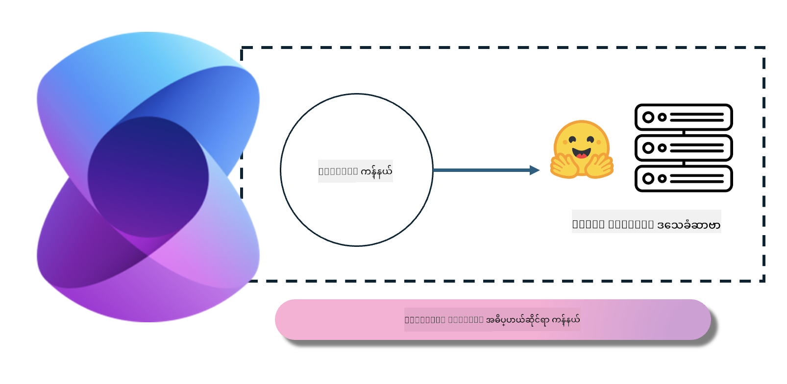
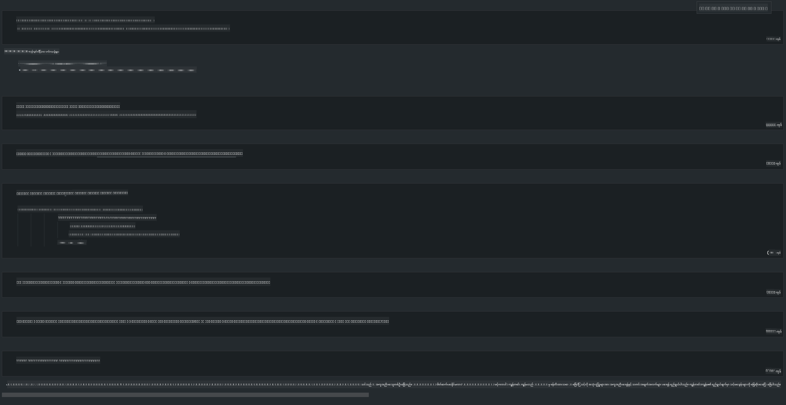

<!--
CO_OP_TRANSLATOR_METADATA:
{
  "original_hash": "bcf5dd7031db0031abdb9dd0c05ba118",
  "translation_date": "2025-07-16T20:59:45+00:00",
  "source_file": "md/01.Introduction/03/Local_Server_Inference.md",
  "language_code": "my"
}
-->
# **Local Server တွင် Phi-3 ဖြင့် အနုတ်ယူခြင်း**

Phi-3 ကို local server ပေါ်တွင် တပ်ဆင်အသုံးပြုနိုင်သည်။ အသုံးပြုသူများသည် [Ollama](https://ollama.com) သို့မဟုတ် [LM Studio](https://llamaedge.com) ဖြေရှင်းချက်များကို ရွေးချယ်နိုင်ပြီး၊ မိမိတို့ကိုယ်ပိုင် ကုဒ်ရေးသားနိုင်ပါသည်။ Phi-3 ၏ local ဝန်ဆောင်မှုများကို [Semantic Kernel](https://github.com/microsoft/semantic-kernel?WT.mc_id=aiml-138114-kinfeylo) သို့မဟုတ် [Langchain](https://www.langchain.com/) မှတဆင့် ချိတ်ဆက်၍ Copilot အက်ပလီကေးရှင်းများ ဖန်တီးနိုင်ပါသည်။

## **Semantic Kernel ဖြင့် Phi-3-mini ကို အသုံးပြုခြင်း**

Copilot အက်ပလီကေးရှင်းတွင် Semantic Kernel / LangChain မှတဆင့် အက်ပလီကေးရှင်းများ ဖန်တီးသည်။ ဒီအမျိုးအစား အက်ပလီကေးရှင်း ဖွဲ့စည်းပုံသည် ယေဘုယျအားဖြင့် Azure OpenAI Service / OpenAI မော်ဒယ်များနှင့် ကိုက်ညီပြီး၊ Hugging Face တွင်ရှိသော open source မော်ဒယ်များနှင့် local မော်ဒယ်များကိုလည်း ထောက်ပံ့နိုင်သည်။ Semantic Kernel ကို အသုံးပြု၍ Phi-3-mini ကို ချိတ်ဆက်လိုပါက ဘာလုပ်ရမလဲ? .NET ကို ဥပမာယူပါက Semantic Kernel တွင် Hugging Face Connector နှင့် ပေါင်းစပ်နိုင်သည်။ ပုံမှန်အားဖြင့် Hugging Face ပေါ်ရှိ မော်ဒယ်အိုင်ဒီနှင့် ကိုက်ညီပြီး (ပထမဆုံးအသုံးပြုသောအခါ မော်ဒယ်ကို Hugging Face မှ ဒေါင်းလုပ်လုပ်ရမည်၊ အချိန်ကြာသည်)၊ သင်သည် ကိုယ်တိုင် တည်ဆောက်ထားသော local ဝန်ဆောင်မှုကိုလည်း ချိတ်ဆက်နိုင်သည်။ နှစ်ခုကို နှိုင်းယှဉ်ပါက နောက်ဆုံးနည်းလမ်းကို အထူးသဖြင့် စီးပွားရေးအက်ပလီကေးရှင်းများတွင် လွတ်လပ်မှုအဆင့်မြင့်သောကြောင့် အကြံပြုပါသည်။

ပုံတွင် Semantic Kernel မှတဆင့် local ဝန်ဆောင်မှုများကို ချိတ်ဆက်ခြင်းဖြင့် ကိုယ်တိုင် တည်ဆောက်ထားသော Phi-3-mini မော်ဒယ်ဆာဗာနှင့် လွယ်ကူစွာ ချိတ်ဆက်နိုင်ကြောင်း ပြထားသည်။ အောက်တွင် လည်ပတ်မှုရလဒ်ကို ဖော်ပြထားသည်။

***နမူနာကုဒ်*** https://github.com/kinfey/Phi3MiniSamples/tree/main/semantickernel

**အကြောင်းကြားချက်**  
ဤစာတမ်းကို AI ဘာသာပြန်ဝန်ဆောင်မှု [Co-op Translator](https://github.com/Azure/co-op-translator) ဖြင့် ဘာသာပြန်ထားပါသည်။ ကျွန်ုပ်တို့သည် တိကျမှန်ကန်မှုအတွက် ကြိုးစားသော်လည်း အလိုအလျောက် ဘာသာပြန်ခြင်းတွင် အမှားများ သို့မဟုတ် မှားယွင်းချက်များ ပါဝင်နိုင်ကြောင်း သတိပြုပါရန် မေတ္တာရပ်ခံအပ်ပါသည်။ မူရင်းစာတမ်းကို မိမိဘာသာစကားဖြင့်သာ တရားဝင်အချက်အလက်အဖြစ် ယူဆသင့်ပါသည်။ အရေးကြီးသော အချက်အလက်များအတွက် လူ့ပညာရှင်များ၏ ပရော်ဖက်ရှင်နယ် ဘာသာပြန်ခြင်းကို အကြံပြုပါသည်။ ဤဘာသာပြန်ချက်ကို အသုံးပြုရာမှ ဖြစ်ပေါ်လာနိုင်သည့် နားလည်မှုမှားယွင်းမှုများအတွက် ကျွန်ုပ်တို့သည် တာဝန်မယူပါ။