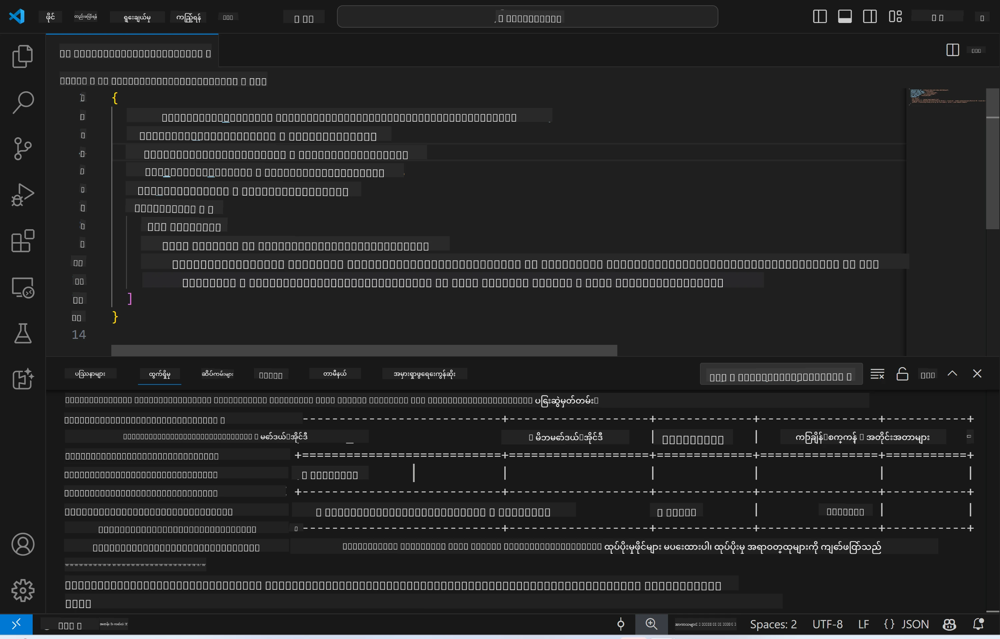
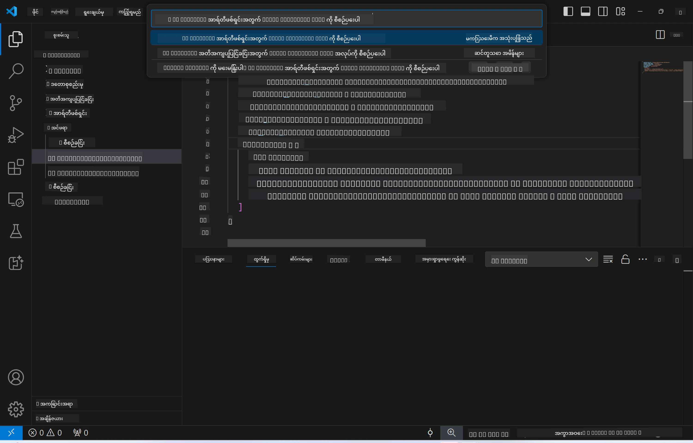
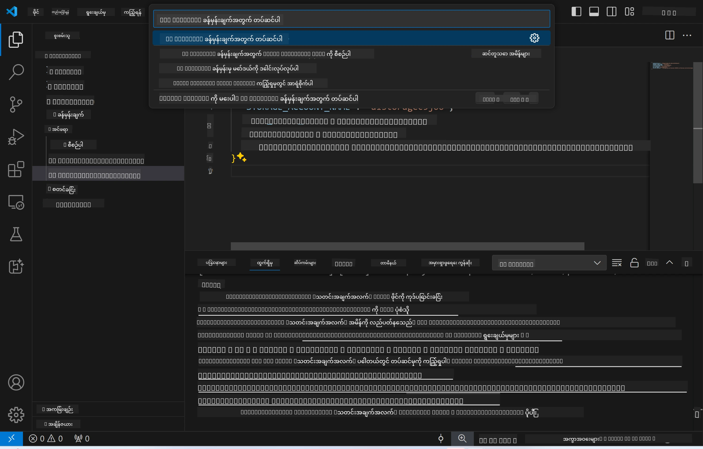
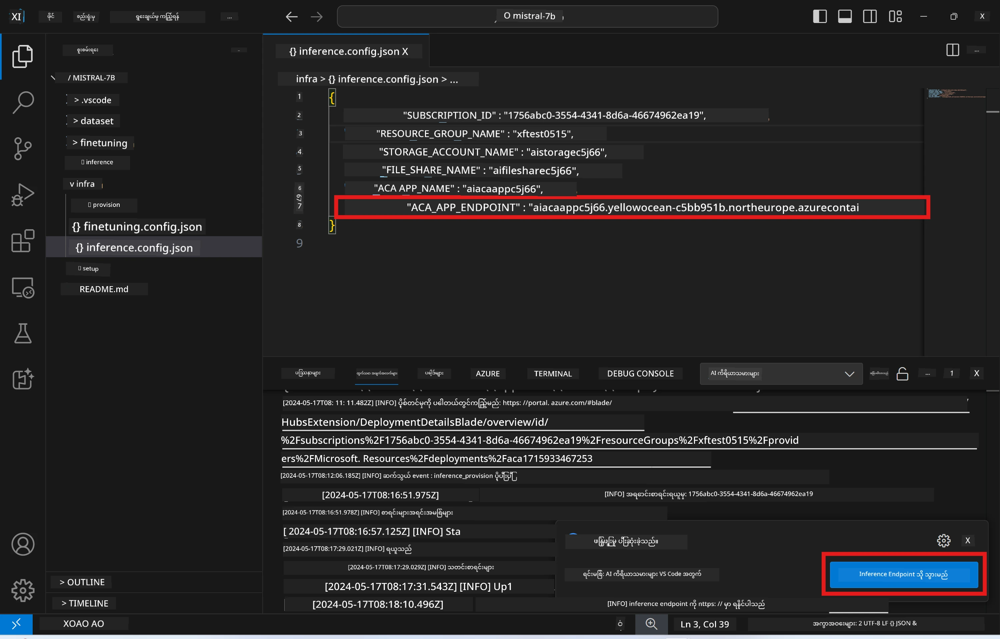

# Remote Inferencing with the fine-tuned model

အဒပ်တာတွေကို remote ပတ်ဝန်းကျင်မှာ သင်ကြားပြီးနောက်၊ မော်ဒယ်နဲ့ အပြန်အလှန် ဆက်သွယ်ဖို့ ရိုးရှင်းတဲ့ Gradio အက်ပ်လီကေးရှင်းကို အသုံးပြုပါ။



### Azure အရင်းအမြစ်များ ပြင်ဆင်ခြင်း  
Remote inference အတွက် Azure အရင်းအမြစ်များကို စီစဉ်ဖို့ `AI Toolkit: Provision Azure Container Apps for inference` ကို command palette မှာ အကောင်အထည်ဖော်ပါ။ ဒီလုပ်ငန်းစဉ်အတွင်းမှာ သင့် Azure Subscription နဲ့ resource group ကို ရွေးချယ်ဖို့ တောင်းခံပါလိမ့်မယ်။  


ပုံမှန်အားဖြင့် subscription နဲ့ resource group တွေဟာ fine-tuning အတွက် အသုံးပြုထားတဲ့ အတိုင်း ဖြစ်သင့်ပါတယ်။ Inference ကတော့ fine-tuning အဆင့်မှာ ဖန်တီးထားတဲ့ Azure Files ထဲမှာ သိမ်းဆည်းထားတဲ့ မော်ဒယ်နဲ့ မော်ဒယ်အဒပ်တာကို အသုံးပြုမယ့် Azure Container App Environment ကို အသုံးပြုပါလိမ့်မယ်။

## AI Toolkit ကို အသုံးပြုခြင်း

### Inference အတွက် Deployment  
Inference ကုဒ်ကို ပြန်လည်ပြင်ဆင်ချင်တာ သို့မဟုတ် inference မော်ဒယ်ကို ပြန်လည်တင်ချင်ရင် `AI Toolkit: Deploy for inference` command ကို အကောင်အထည်ဖော်ပါ။ ဒါက သင့်ရဲ့ နောက်ဆုံးကုဒ်ကို ACA နဲ့ đồng bộ လုပ်ပြီး replica ကို ပြန်စတင်ပေးပါလိမ့်မယ်။



Deployment အောင်မြင်ပြီးနောက် မော်ဒယ်ကို ဒီ endpoint မှတဆင့် သုံးသပ်နိုင်ပါပြီ။

### Inference API ကို ဝင်ရောက်အသုံးပြုခြင်း

VSCode notification မှာ ပြသထားတဲ့ "*Go to Inference Endpoint*" ခလုတ်ကို နှိပ်ပြီး inference API ကို ဝင်ရောက်အသုံးပြုနိုင်ပါတယ်။ ဒါမှမဟုတ် `./infra/inference.config.json` ဖိုင်ထဲရှိ `ACA_APP_ENDPOINT` မှာ သို့မဟုတ် output panel မှာ web API endpoint ကို ရှာဖွေနိုင်ပါတယ်။



> **Note:** Inference endpoint က အပြည့်အဝ လည်ပတ်ဖို့ မိနစ်အနည်းငယ် ကြာနိုင်ပါတယ်။

## Template ထဲ ပါဝင်တဲ့ Inference အစိတ်အပိုင်းများ

| Folder | အကြောင်းအရာ |
| ------ |-------------- |
| `infra` | Remote လုပ်ဆောင်မှုများအတွက် လိုအပ်သော configuration များ ပါဝင်သည်။ |
| `infra/provision/inference.parameters.json` | Azure resource များကို inference အတွက် provision လုပ်ရာတွင် အသုံးပြုသော bicep template များအတွက် parameters များ ပါဝင်သည်။ |
| `infra/provision/inference.bicep` | Azure resource များကို inference အတွက် provision လုပ်ရာတွင် အသုံးပြုသော template များ ပါဝင်သည်။ |
| `infra/inference.config.json` | `AI Toolkit: Provision Azure Container Apps for inference` command ဖြင့် ဖန်တီးသော configuration ဖိုင်ဖြစ်ပြီး အခြား remote command palette များအတွက် input အဖြစ် အသုံးပြုသည်။ |

### AI Toolkit ကို အသုံးပြုပြီး Azure Resource Provision ကို ပြင်ဆင်ခြင်း  
[AI Toolkit](https://marketplace.visualstudio.com/items?itemName=ms-windows-ai-studio.windows-ai-studio) ကို ပြင်ဆင်ပါ။

`Provision Azure Container Apps for inference` command ကို အသုံးပြုပါ။

`./infra/provision/inference.parameters.json` ဖိုင်ထဲမှာ configuration parameters တွေကို တွေ့နိုင်ပါတယ်။ အသေးစိတ်如下:

| Parameter | ဖော်ပြချက် |
| --------- |------------ |
| `defaultCommands` | Web API ကို စတင်ဖို့ အသုံးပြုမယ့် command များဖြစ်သည်။ |
| `maximumInstanceCount` | GPU instance များအတွက် အများဆုံး စွမ်းဆောင်ရည်ကို သတ်မှတ်သည်။ |
| `location` | Azure resource များကို provision လုပ်မယ့် တည်နေရာဖြစ်သည်။ ပုံမှန်တန်ဖိုးမှာ ရွေးချယ်ထားတဲ့ resource group ရဲ့ တည်နေရာနှင့် တူညီသည်။ |
| `storageAccountName`, `fileShareName`, `acaEnvironmentName`, `acaEnvironmentStorageName`, `acaAppName`, `acaLogAnalyticsName` | Azure resource များအတွက် အမည်များ သတ်မှတ်ရာတွင် အသုံးပြုသည်။ ပုံမှန်အားဖြင့် fine-tuning resource နာမည်နှင့် တူညီပါသည်။ သင့်ကိုယ်ပိုင် အမည်အသစ် မသုံးထားသေးသော resource များ ဖန်တီးချင်ရင် အသစ်ထည့်နိုင်ပြီး၊ ရှိပြီးသား Azure resource များကို အသုံးပြုချင်ရင်လည်း အမည်ထည့်နိုင်ပါသည်။ အသေးစိတ်အတွက် [Using existing Azure Resources](../../../../../md/01.Introduction/03) ကို ကြည့်ပါ။ |

### ရှိပြီးသား Azure Resources များကို အသုံးပြုခြင်း

ပုံမှန်အားဖြင့် inference provision က fine-tuning အတွက် အသုံးပြုထားတဲ့ Azure Container App Environment, Storage Account, Azure File Share နဲ့ Azure Log Analytics များကို တူညီစွာ အသုံးပြုပါသည်။ Inference API အတွက် သီးခြား Azure Container App တစ်ခု ဖန်တီးထားပါသည်။

Fine-tuning အဆင့်မှာ Azure resource များကို ကိုယ်တိုင်ပြင်ဆင်ထားပြီး inference အတွက် ကိုယ်ပိုင် Azure resource များကို အသုံးပြုချင်ရင် `./infra/inference.parameters.json` ဖိုင်ထဲမှာ အမည်များကို သတ်မှတ်ပါ။ ထို့နောက် command palette မှာ `AI Toolkit: Provision Azure Container Apps for inference` ကို ပြန်လည် အကောင်အထည်ဖော်ပါ။ ဒါက သတ်မှတ်ထားတဲ့ resource များကို update လုပ်ပြီး မရှိသေးတာတွေကို ဖန်တီးပေးပါလိမ့်မယ်။

ဥပမာအားဖြင့် ရှိပြီးသား Azure container environment ရှိပါက သင့် `./infra/finetuning.parameters.json` ဖိုင်မှာ အောက်ပါအတိုင်း ရှိသင့်ပါသည်-

```json
{
    "$schema": "https://schema.management.azure.com/schemas/2019-04-01/deploymentParameters.json#",
    "contentVersion": "1.0.0.0",
    "parameters": {
      ...
      "acaEnvironmentName": {
        "value": "<your-aca-env-name>"
      },
      "acaEnvironmentStorageName": {
        "value": null
      },
      ...
    }
  }
```

### လက်ဖြင့် Provision လုပ်ခြင်း  
Azure resource များကို လက်ဖြင့် ပြင်ဆင်ချင်ရင် `./infra/provision` ဖိုလ်ဒါထဲရှိ bicep ဖိုင်များကို အသုံးပြုနိုင်ပါတယ်။ AI Toolkit command palette ကို မသုံးဘဲ Azure resource များအားလုံးကို ပြင်ဆင်ပြီးသားဖြစ်ပါက `inference.config.json` ဖိုင်ထဲမှာ resource အမည်များကိုသာ ထည့်သွင်းနိုင်ပါသည်။

ဥပမာ-

```json
{
  "SUBSCRIPTION_ID": "<your-subscription-id>",
  "RESOURCE_GROUP_NAME": "<your-resource-group-name>",
  "STORAGE_ACCOUNT_NAME": "<your-storage-account-name>",
  "FILE_SHARE_NAME": "<your-file-share-name>",
  "ACA_APP_NAME": "<your-aca-name>",
  "ACA_APP_ENDPOINT": "<your-aca-endpoint>"
}
```

**အကြောင်းကြားချက်**  
ဤစာတမ်းကို AI ဘာသာပြန်ဝန်ဆောင်မှု [Co-op Translator](https://github.com/Azure/co-op-translator) ဖြင့် ဘာသာပြန်ထားပါသည်။ ကျွန်ုပ်တို့သည် တိကျမှန်ကန်မှုအတွက် ကြိုးစားသော်လည်း အလိုအလျောက် ဘာသာပြန်ခြင်းတွင် အမှားများ သို့မဟုတ် မှားယွင်းချက်များ ပါဝင်နိုင်ကြောင်း သတိပြုပါရန် မေတ္တာရပ်ခံအပ်ပါသည်။ မူရင်းစာတမ်းကို မိမိဘာသာစကားဖြင့်သာ တရားဝင်အရင်းအမြစ်အဖြစ် ယူဆသင့်ပါသည်။ အရေးကြီးသော အချက်အလက်များအတွက် လူ့ဘာသာပြန်ပညာရှင်မှ ဘာသာပြန်ခြင်းကို အကြံပြုပါသည်။ ဤဘာသာပြန်ချက်ကို အသုံးပြုရာမှ ဖြစ်ပေါ်လာနိုင်သည့် နားလည်မှုမှားယွင်းမှုများအတွက် ကျွန်ုပ်တို့သည် တာဝန်မယူပါ။