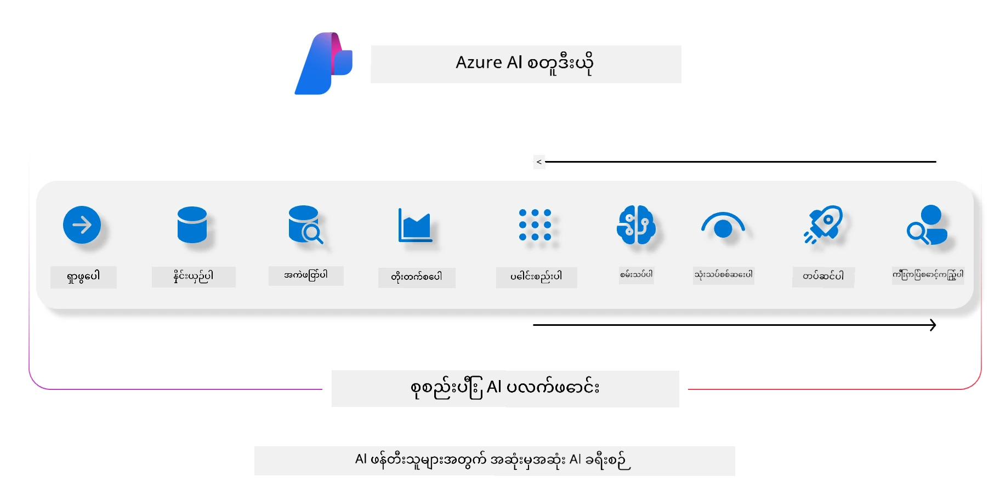
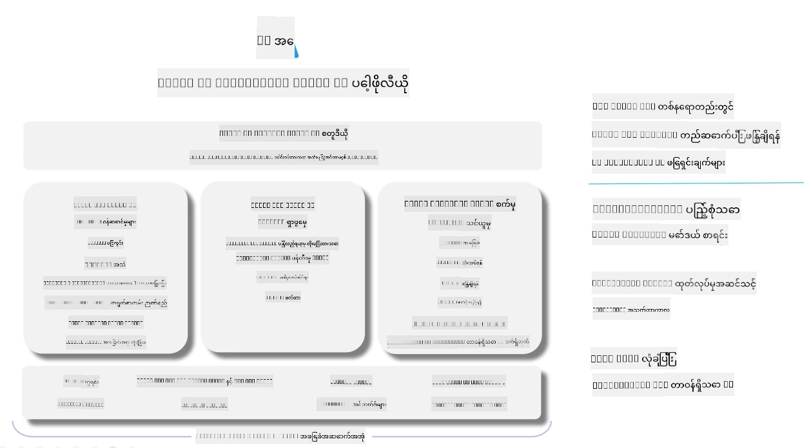

# **Azure AI Foundry ကို အသုံးပြုပြီး အကဲဖြတ်ခြင်း**

[Azure AI Foundry](https://ai.azure.com?WT.mc_id=aiml-138114-kinfeylo) ကို အသုံးပြုပြီး သင်၏ generative AI အက်ပလီကေးရှင်းကို မည်သို့ အကဲဖြတ်ရမည်နည်း။ တစ်ကြိမ်ပြောဆိုမှုဖြစ်စေ၊ မျိုးစုံပြောဆိုမှုဖြစ်စေ Azure AI Foundry သည် မော်ဒယ်၏ စွမ်းဆောင်ရည်နှင့် လုံခြုံမှုကို အကဲဖြတ်ရန် ကိရိယာများကို ပံ့ပိုးပေးသည်။

## Azure AI Foundry ဖြင့် generative AI အက်ပလီကေးရှင်းများကို မည်သို့ အကဲဖြတ်မည်နည်း
အသေးစိတ်လမ်းညွှန်ချက်များအတွက် [Azure AI Foundry Documentation](https://learn.microsoft.com/azure/ai-studio/how-to/evaluate-generative-ai-app?WT.mc_id=aiml-138114-kinfeylo) ကို ကြည့်ရှုပါ။

စတင်ရန် လိုအပ်သော အဆင့်များမှာ -

## Azure AI Foundry တွင် Generative AI မော်ဒယ်များကို အကဲဖြတ်ခြင်း

**လိုအပ်ချက်များ**

- CSV သို့မဟုတ် JSON ဖော်မတ်ဖြင့် စမ်းသပ်ဒေတာစနစ်တစ်ခု။
- တပ်ဆင်ပြီးသား generative AI မော်ဒယ်တစ်ခု (ဥပမာ Phi-3, GPT 3.5, GPT 4, သို့မဟုတ် Davinci မော်ဒယ်များ)။
- အကဲဖြတ်မှုကို ပြုလုပ်ရန် ကွန်ပျူတာ instance ပါရှိသည့် runtime တစ်ခု။

## အတွင်းပိုင်း အကဲဖြတ်မှု မီထရစ်များ

Azure AI Foundry သည် တစ်ကြိမ်ပြောဆိုမှုနှင့် ရှုပ်ထွေးသော မျိုးစုံပြောဆိုမှုများကို နှစ်မျိုးလုံး အကဲဖြတ်နိုင်သည်။
Retrieval Augmented Generation (RAG) အခြေအနေများတွင် မော်ဒယ်သည် သတ်မှတ်ထားသော ဒေတာအပေါ် အခြေခံထားသောကြောင့်၊ အတွင်းပိုင်း အကဲဖြတ်မှု မီထရစ်များဖြင့် စွမ်းဆောင်ရည်ကို တိုင်းတာနိုင်သည်။
ထို့အပြင်၊ အထွေထွေ တစ်ကြိမ်ပြောဆိုမှု မေးခွန်းဖြေဆိုမှု (non-RAG) အခြေအနေများကိုလည်း အကဲဖြတ်နိုင်သည်။

## အကဲဖြတ်မှု Run တစ်ခု ဖန်တီးခြင်း

Azure AI Foundry UI မှ Evaluate စာမျက်နှာ သို့မဟုတ် Prompt Flow စာမျက်နှာသို့ သွားပါ။
အကဲဖြတ်မှု ဖန်တီးခြင်း ဝိဇ္ဇာကို လိုက်နာပြီး အကဲဖြတ်မှု run တစ်ခုကို စတင်ပါ။ အကဲဖြတ်မှုအတွက် အမည်တစ်ခုကို ရွေးချယ်ပေးနိုင်သည်။
သင့်အက်ပလီကေးရှင်းရဲ့ ရည်ရွယ်ချက်နှင့် ကိုက်ညီသော အခြေအနေကို ရွေးချယ်ပါ။
မော်ဒယ်ထုတ်လွှင့်ချက်ကို အကဲဖြတ်ရန် အကဲဖြတ်မှု မီထရစ်တစ်ခု သို့မဟုတ် မီထရစ်များစွာကို ရွေးချယ်ပါ။

## စိတ်ကြိုက် အကဲဖြတ်မှု လည်ပတ်မှု (Optional)

ပိုမိုလွယ်ကူစေရန်၊ သင့်လိုအပ်ချက်အရ စိတ်ကြိုက် အကဲဖြတ်မှု လည်ပတ်မှုတစ်ခုကို ဖန်တီးနိုင်သည်။

## ရလဒ်များ ကြည့်ရှုခြင်း

အကဲဖြတ် run ပြီးနောက်၊ Azure AI Foundry တွင် အသေးစိတ် အကဲဖြတ်မှု မီထရစ်များကို မှတ်တမ်းတင်၊ ကြည့်ရှု၊ နှင့် ခွဲခြမ်းစိတ်ဖြာနိုင်သည်။ သင့်အက်ပလီကေးရှင်း၏ စွမ်းဆောင်ရည်နှင့် ကန့်သတ်ချက်များကို နားလည်နိုင်ပါသည်။

**Note** Azure AI Foundry သည် လက်ရှိတွင် ပြည်သူ့ ကြိုတင်ကြည့်ရှုမှုအဆင့်တွင် ရှိသဖြင့် စမ်းသပ်မှုနှင့် ဖွံ့ဖြိုးတိုးတက်မှုအတွက်သာ အသုံးပြုရန် ဖြစ်သည်။ ထုတ်လုပ်မှုအတွက် အခြားရွေးချယ်စရာများကို စဉ်းစားပါ။ အသေးစိတ်နှင့် လမ်းညွှန်ချက်များအတွက် တရားဝင် [AI Foundry documentation](https://learn.microsoft.com/azure/ai-studio/?WT.mc_id=aiml-138114-kinfeylo) ကို လေ့လာပါ။

**အကြောင်းကြားချက်**  
ဤစာတမ်းကို AI ဘာသာပြန်ဝန်ဆောင်မှု [Co-op Translator](https://github.com/Azure/co-op-translator) ဖြင့် ဘာသာပြန်ထားပါသည်။ ကျွန်ုပ်တို့သည် တိကျမှန်ကန်မှုအတွက် ကြိုးစားသော်လည်း အလိုအလျောက် ဘာသာပြန်ခြင်းတွင် အမှားများ သို့မဟုတ် မှားယွင်းချက်များ ပါဝင်နိုင်ကြောင်း သတိပြုပါရန် မေတ္တာရပ်ခံအပ်ပါသည်။ မူရင်းစာတမ်းကို မိမိဘာသာစကားဖြင့်သာ တရားဝင်အရင်းအမြစ်အဖြစ် ယူဆသင့်ပါသည်။ အရေးကြီးသော အချက်အလက်များအတွက် လူ့ပညာရှင်များ၏ ပရော်ဖက်ရှင်နယ် ဘာသာပြန်ခြင်းကို အကြံပြုပါသည်။ ဤဘာသာပြန်ချက်ကို အသုံးပြုရာမှ ဖြစ်ပေါ်လာနိုင်သည့် နားလည်မှုမှားယွင်းမှုများအတွက် ကျွန်ုပ်တို့သည် တာဝန်မယူပါ။