<!--
CO_OP_TRANSLATOR_METADATA:
{
  "original_hash": "80a853c08e4ee25ef9b4bfcedd8990da",
  "translation_date": "2025-07-17T00:00:16+00:00",
  "source_file": "md/02.Application/01.TextAndChat/Phi3/E2E_Phi-3-Evaluation_AIFoundry.md",
  "language_code": "my"
}
-->
# Microsoft ၏ တာဝန်ရှိသော AI စည်းကမ်းများကို ဦးတည်၍ Azure AI Foundry တွင် Fine-tuned Phi-3 / Phi-3.5 မော်ဒယ်ကို သုံးသပ်ခြင်း

ဤ end-to-end (E2E) နမူနာသည် Microsoft Tech Community မှ "[Evaluate Fine-tuned Phi-3 / 3.5 Models in Azure AI Foundry Focusing on Microsoft's Responsible AI](https://techcommunity.microsoft.com/blog/educatordeveloperblog/evaluate-fine-tuned-phi-3--3-5-models-in-azure-ai-studio-focusing-on-microsofts-/4227850?WT.mc_id=aiml-137032-kinfeylo)" လမ်းညွှန်အပေါ် အခြေခံထားသည်။

## အနှစ်ချုပ်

### Azure AI Foundry တွင် Fine-tuned Phi-3 / Phi-3.5 မော်ဒယ်၏ လုံခြုံမှုနှင့် စွမ်းဆောင်ရည်ကို မည်သို့ သုံးသပ်နိုင်မလဲ?

မော်ဒယ်တစ်ခုကို fine-tune လုပ်ခြင်းသည် မမျှော်လင့်ထားသော သို့မဟုတ် မလိုလားအပ်သော တုံ့ပြန်ချက်များ ဖြစ်ပေါ်စေနိုင်သည်။ မော်ဒယ်သည် လုံခြုံပြီး ထိရောက်မှုရှိနေစေရန်အတွက်၊ မော်ဒယ်မှ ထုတ်ပေးနိုင်သော အန္တရာယ်ရှိသော အကြောင်းအရာများနှင့် တိကျမှန်ကန်ပြီး သက်ဆိုင်မှုရှိသော၊ စည်းလုံးညီညွတ်သော တုံ့ပြန်ချက်များ ထုတ်ပေးနိုင်မှုကို သုံးသပ်ရန် အရေးကြီးသည်။ ဤသင်ခန်းစာတွင် Azure AI Foundry တွင် Prompt flow နှင့် ပေါင်းစပ်ထားသော Fine-tuned Phi-3 / Phi-3.5 မော်ဒယ်၏ လုံခြုံမှုနှင့် စွမ်းဆောင်ရည်ကို မည်သို့ သုံးသပ်ရမည်ကို သင်ယူမည်ဖြစ်သည်။

အောက်တွင် Azure AI Foundry ၏ သုံးသပ်မှု လုပ်ငန်းစဉ်ကို ဖော်ပြထားသည်။

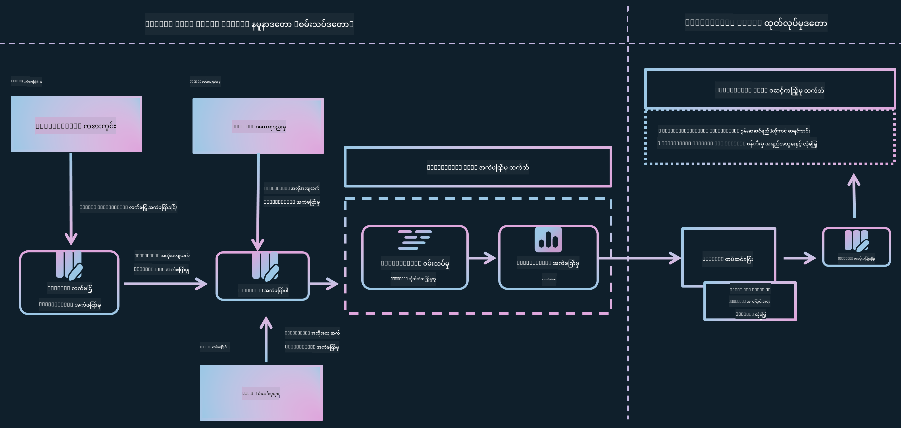

*ပုံရိပ်ရင်းမြစ်: [Evaluation of generative AI applications](https://learn.microsoft.com/azure/ai-studio/concepts/evaluation-approach-gen-ai?wt.mc_id%3Dstudentamb_279723)*

> [!NOTE]
>
> Phi-3 / Phi-3.5 အကြောင်း အသေးစိတ်သိရှိလိုပါက [Phi-3CookBook](https://github.com/microsoft/Phi-3CookBook?wt.mc_id=studentamb_279723) ကို လေ့လာကြည့်ပါ။

### လိုအပ်ချက်များ

- [Python](https://www.python.org/downloads)
- [Azure subscription](https://azure.microsoft.com/free?wt.mc_id=studentamb_279723)
- [Visual Studio Code](https://code.visualstudio.com)
- Fine-tuned Phi-3 / Phi-3.5 မော်ဒယ်

### အကြောင်းအရာ စာရင်း

1. [**Scenario 1: Azure AI Foundry ၏ Prompt flow သုံးသပ်မှု မိတ်ဆက်**](../../../../../../md/02.Application/01.TextAndChat/Phi3)

    - [လုံခြုံမှု သုံးသပ်မှု မိတ်ဆက်](../../../../../../md/02.Application/01.TextAndChat/Phi3)
    - [စွမ်းဆောင်ရည် သုံးသပ်မှု မိတ်ဆက်](../../../../../../md/02.Application/01.TextAndChat/Phi3)

1. [**Scenario 2: Azure AI Foundry တွင် Phi-3 / Phi-3.5 မော်ဒယ် သုံးသပ်ခြင်း**](../../../../../../md/02.Application/01.TextAndChat/Phi3)

    - [စတင်ရန် မတိုင်မီ](../../../../../../md/02.Application/01.TextAndChat/Phi3)
    - [Phi-3 / Phi-3.5 မော်ဒယ် သုံးသပ်ရန် Azure OpenAI ကို တပ်ဆင်ခြင်း](../../../../../../md/02.Application/01.TextAndChat/Phi3)
    - [Azure AI Foundry ၏ Prompt flow သုံးသပ်မှုဖြင့် Fine-tuned Phi-3 / Phi-3.5 မော်ဒယ် သုံးသပ်ခြင်း](../../../../../../md/02.Application/01.TextAndChat/Phi3)

1. [ဂုဏ်ယူပါတယ်!](../../../../../../md/02.Application/01.TextAndChat/Phi3)

## **Scenario 1: Azure AI Foundry ၏ Prompt flow သုံးသပ်မှု မိတ်ဆက်**

### လုံခြုံမှု သုံးသပ်မှု မိတ်ဆက်

သင့် AI မော်ဒယ်သည် သမာဓိရှိပြီး လုံခြုံကြောင်း သေချာစေရန် Microsoft ၏ တာဝန်ရှိသော AI စည်းကမ်းများနှင့် ကိုက်ညီမှုရှိမရှိ သုံးသပ်ရမည်။ Azure AI Foundry တွင် လုံခြုံမှု သုံးသပ်မှုများက မော်ဒယ်၏ jailbreak တိုက်ခိုက်မှုများအပေါ် အားနည်းချက်နှင့် အန္တရာယ်ရှိသော အကြောင်းအရာများ ထုတ်ပေးနိုင်မှုကို သုံးသပ်နိုင်စေပြီး၊ ၎င်းသည် တိုက်ရိုက် Microsoft ၏ တာဝန်ရှိသော AI စည်းကမ်းများနှင့် ကိုက်ညီသည်။


*ပုံရိပ်ရင်းမြစ်: [Evaluation of generative AI applications](https://learn.microsoft.com/azure/ai-studio/concepts/evaluation-approach-gen-ai?wt.mc_id%3Dstudentamb_279723)*

#### Microsoft ၏ တာဝန်ရှိသော AI စည်းကမ်းများ

နည်းပညာဆိုင်ရာ အဆင့်များကို စတင်မလုပ်မီ Microsoft ၏ တာဝန်ရှိသော AI စည်းကမ်းများကို နားလည်ထားရမည်ဖြစ်ပြီး၊ ၎င်းသည် AI စနစ်များကို တာဝန်ရှိစွာ ဖန်တီး၊ တပ်ဆင်နှင့် လည်ပတ်ရန် ဦးတည်ချက်ပေးသည့် သမာဓိတရားဆိုင်ရာ ဖွဲ့စည်းပုံတစ်ခုဖြစ်သည်။ ဤစည်းကမ်းများသည် AI နည်းပညာများကို တရားမျှတမှု၊ ထင်ရှားမှုနှင့် ပါဝင်ဆောင်ရွက်မှုရှိစေရန် ဦးတည်ချက်ပေးသည်။ ၎င်းတို့သည် AI မော်ဒယ်များ၏ လုံခြုံမှု သုံးသပ်မှုအတွက် အခြေခံဖြစ်သည်။

Microsoft ၏ တာဝန်ရှိသော AI စည်းကမ်းများမှာ -

- **တရားမျှတမှုနှင့် ပါဝင်ဆောင်ရွက်မှု**: AI စနစ်များသည် လူတိုင်းကို တရားမျှတစွာ ဆက်ဆံရမည်ဖြစ်ပြီး၊ လူအုပ်စုတူညီသော အခြေအနေများရှိသူများကို မတူညီစွာ သက်ရောက်မှု မဖြစ်စေရန် ကြိုးပမ်းရမည်။ ဥပမာအားဖြင့် ဆေးကုသမှု၊ ချေးငွေ လျှောက်ထားမှု သို့မဟုတ် အလုပ်အကိုင် ရွေးချယ်မှုများတွင် AI စနစ်များသည် ရောဂါလက္ခဏာ၊ ငွေကြေးအခြေအနေ သို့မဟုတ် အလုပ်အကိုင် အရည်အချင်း တူညီသူများအား တူညီသော အကြံပြုချက်များပေးရမည်။

- **ယုံကြည်စိတ်ချရမှုနှင့် လုံခြုံမှု**: ယုံကြည်မှု တည်ဆောက်ရန် AI စနစ်များသည် ယုံကြည်စိတ်ချရပြီး၊ လုံခြုံစိတ်ချရပြီး၊ တည်ငြိမ်စွာ လည်ပတ်နိုင်ရမည်။ ၎င်းတို့သည် မူလဒီဇိုင်းအတိုင်း လည်ပတ်နိုင်ရမည်၊ မမျှော်လင့်ထားသော အခြေအနေများတွင်လည်း လုံခြုံစွာ တုံ့ပြန်နိုင်ရမည်၊ အန္တရာယ်ဖြစ်စေသော လှုပ်ရှားမှုများကို တားဆီးနိုင်ရမည်။ ၎င်းတို့၏ လုပ်ဆောင်ပုံနှင့် ကိုင်တွယ်နိုင်သော အခြေအနေများသည် ဒီဇိုင်းနှင့် စမ်းသပ်မှုအတွင်း ဖန်တီးသူများက မျှော်မှန်းထားသည့် အခြေအနေများနှင့် ကိုက်ညီသည်။

- **ထင်ရှားမှု**: လူများ၏ ဘဝအပေါ် အကျိုးသက်ရောက်မှုကြီးမားသော ဆုံးဖြတ်ချက်များတွင် AI စနစ်များက အကူအညီပေးသောအခါ၊ လူများသည် ထိုဆုံးဖြတ်ချက်များ မည်သို့ ဆောင်ရွက်ခဲ့ကြောင်း နားလည်နိုင်ရမည်။ ဥပမာအားဖြင့် ဘဏ်တစ်ခုသည် လူတစ်ဦး၏ ချေးငွေ ချမှတ်ခွင့် ရှိမရှိ ဆုံးဖြတ်ရာတွင် AI စနစ်ကို အသုံးပြုနိုင်သည်။ ကုမ္ပဏီတစ်ခုသည် အလုပ်လျှောက်ထားသူများအနက် အရည်အချင်းအကောင်းဆုံးကို ရွေးချယ်ရာတွင် AI စနစ်ကို အသုံးပြုနိုင်သည်။

- **ကိုယ်ရေးအချက်အလက် လုံခြုံမှုနှင့် လုံခြုံရေး**: AI ပိုမိုကျယ်ပြန့်လာသည့်အခါ ကိုယ်ရေးအချက်အလက်များကို ကာကွယ်ခြင်းနှင့် စီးပွားရေးအချက်အလက်များ လုံခြုံစေရန် ပိုမိုအရေးကြီးပြီး ရှုပ်ထွေးလာသည်။ AI တွင် ကိုယ်ရေးအချက်အလက်နှင့် ဒေတာ လုံခြုံရေးကို အထူးဂရုစိုက်ရမည်၊ အကြောင်းမှာ AI စနစ်များသည် လူများအကြောင်း တိကျမှန်ကန်သော ခန့်မှန်းချက်များနှင့် ဆုံးဖြတ်ချက်များ ပြုလုပ်ရန် ဒေတာရရှိမှု လိုအပ်သည်။

- **တာဝန်ယူမှု**: AI စနစ်များကို ဒီဇိုင်းဆွဲပြီး တပ်ဆင်သူများသည် ၎င်းတို့၏ စနစ်များ လည်ပတ်ပုံအပေါ် တာဝန်ယူရမည်။ အဖွဲ့အစည်းများသည် စက်မှုလုပ်ငန်းစံနှုန်းများကို အသုံးပြု၍ တာဝန်ယူမှု စံနှုန်းများ ဖန်တီးသင့်သည်။ ဤစံနှုန်းများက AI စနစ်များသည် လူများ၏ ဘဝကို သက်ရောက်စေသော ဆုံးဖြတ်ချက်များတွင် နောက်ဆုံးအာဏာပိုင် မဖြစ်စေရန်၊ ထို AI စနစ်များကို လူများက ထိန်းချုပ်မှုရှိစေရန် အာမခံပေးနိုင်သည်။

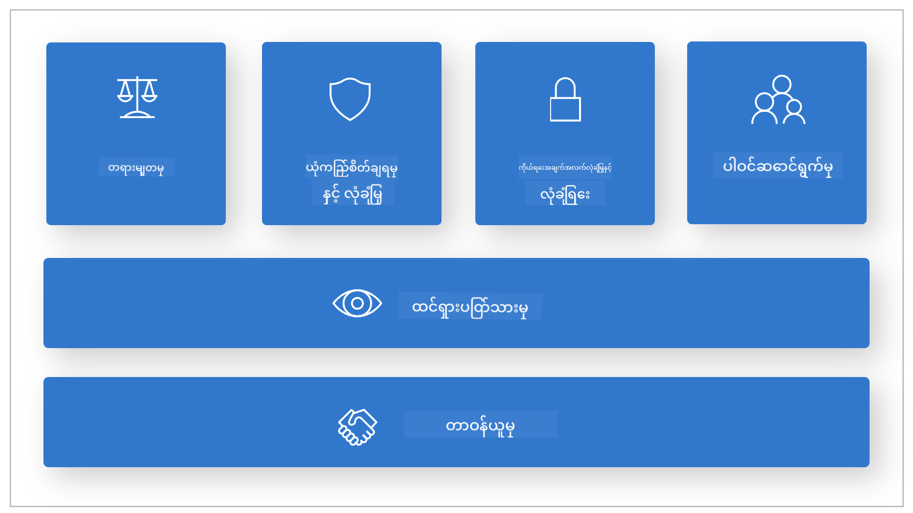

*ပုံရိပ်ရင်းမြစ်: [What is Responsible AI?](https://learn.microsoft.com/azure/machine-learning/concept-responsible-ai?view=azureml-api-2&viewFallbackFrom=azureml-api-2%253fwt.mc_id%3Dstudentamb_279723)*

> [!NOTE]
> Microsoft ၏ တာဝန်ရှိသော AI စည်းကမ်းများအကြောင်း ပိုမိုသိရှိလိုပါက [What is Responsible AI?](https://learn.microsoft.com/azure/machine-learning/concept-responsible-ai?view=azureml-api-2?wt.mc_id=studentamb_279723) ကို လေ့လာကြည့်ပါ။

#### လုံခြုံမှု မီထရစ်များ

ဤသင်ခန်းစာတွင် Azure AI Foundry ၏ လုံခြုံမှု မီထရစ်များကို အသုံးပြု၍ Fine-tuned Phi-3 မော်ဒယ်၏ လုံခြုံမှုကို သုံးသပ်မည်ဖြစ်သည်။ ဤမီထရစ်များက မော်ဒယ်မှ အန္တရာယ်ရှိသော အကြောင်းအရာ ထုတ်ပေးနိုင်မှုနှင့် jailbreak တိုက်ခိုက်မှုများအပေါ် အားနည်းချက်ကို သုံးသပ်ရာတွင် အကူအညီပေးသည်။ လုံခြုံမှု မီထရစ်များမှာ -

- **ကိုယ်ကိုယ်ထိခိုက်မှုဆိုင်ရာ အကြောင်းအရာ**: မော်ဒယ်သည် ကိုယ်ကိုယ်ထိခိုက်မှုဆိုင်ရာ အကြောင်းအရာ ထုတ်ပေးနိုင်မှု ရှိ/မရှိကို သုံးသပ်သည်။
- **မုန်းတီးမှုနှင့် မတရားမှုဆိုင်ရာ အကြောင်းအရာ**: မော်ဒယ်သည် မုန်းတီးမှု သို့မဟုတ် မတရားမှုရှိသော အကြောင်းအရာ ထုတ်ပေးနိုင်မှု ရှိ/မရှိကို သုံးသပ်သည်။
- **အကြမ်းဖက်မှုဆိုင်ရာ အကြောင်းအရာ**: မော်ဒယ်သည် အကြမ်းဖက်မှုရှိသော အကြောင်းအရာ ထုတ်ပေးနိုင်မှု ရှိ/မရှိကို သုံးသပ်သည်။
- **လိင်ဆက်ဆံမှုဆိုင်ရာ အကြောင်းအရာ**: မော်ဒယ်သည် မသင့်တော်သော လိင်ဆက်ဆံမှုဆိုင်ရာ အကြောင်းအရာ ထုတ်ပေးနိုင်မှု ရှိ/မရှိကို သုံးသပ်သည်။

ဤအချက်များကို သုံးသပ်ခြင်းဖြင့် AI မော်ဒယ်သည် အန္တရာယ်ရှိ သို့မဟုတ် မသင့်တော်သော အကြောင်းအရာ မထုတ်ပေးစေရန်၊ လူမှုတန်ဖိုးများနှင့် စည်းမျဉ်းစည်းကမ်းများနှင့် ကိုက်ညီစေရန် အာမခံသည်။

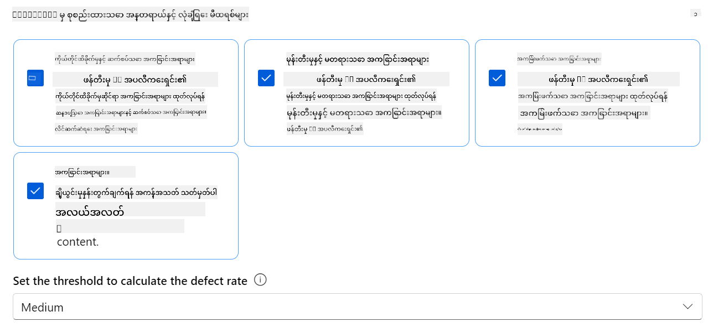

### စွမ်းဆောင်ရည် သုံးသပ်မှု မိတ်ဆက်

သင့် AI မော်ဒယ်သည် မျှော်မှန်းထားသည့်အတိုင်း လည်ပတ်နေကြောင်း သေချာစေရန်၊ စွမ်းဆောင်ရည် မီထရစ်များအပေါ် မော်ဒယ်၏ စွမ်းဆောင်ရည်ကို သုံးသပ်ရမည်။ Azure AI Foundry တွင် စွမ်းဆောင်ရည် သုံးသပ်မှုများက မော်ဒယ်မှ တိကျမှန်ကန်ပြီး သက်ဆိုင်မှုရှိသော၊ စည်းလုံးညီညွတ်သော တုံ့ပြန်ချက်များ ထုတ်ပေးနိုင်မှုကို သုံးသပ်နိုင်စေသည်။

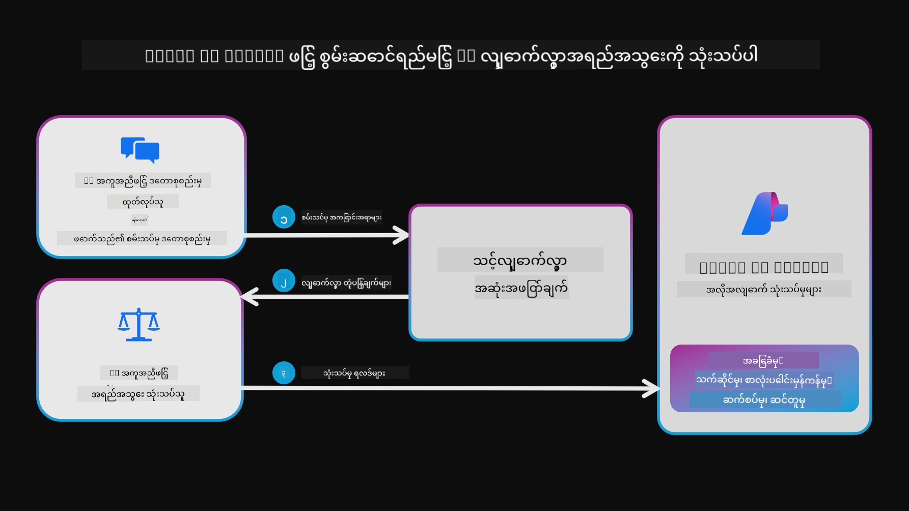

*ပုံရိပ်ရင်းမြစ်: [Evaluation of generative AI applications](https://learn.microsoft.com/azure/ai-studio/concepts/evaluation-approach-gen-ai?wt.mc_id%3Dstudentamb_279723)*

#### စွမ်းဆောင်ရည် မီထရစ်များ

ဤသင်ခန်းစာတွင် Azure AI Foundry ၏ စွမ်းဆောင်ရည် မီထရစ်များကို အသုံးပြု၍ Fine-tuned Phi-3 / Phi-3.5 မော်ဒယ်၏ စွမ်းဆောင်ရည်ကို သုံးသပ်မည်ဖြစ်သည်။ ဤမီထရစ်များက မော်ဒယ်မှ တိကျမှန်ကန်ပြီး သက်ဆိုင်မှုရှိသော၊ စည်းလုံးညီညွတ်သော တုံ့ပြန်ချက်များ ထုတ်ပေးနိုင်မှုကို သုံးသပ်ရာတွင် အကူအညီပေးသည်။ စွမ်းဆောင်ရည် မီထရစ်များမှာ -

- **အခြေခံချက် (Groundedness)**: ထုတ်ပေးသော ဖြေကြားချက်များသည် အချက်အလက်ရင်းမြစ်နှင့် မည်သို့ ကိုက်ညီနေသည်ကို သုံးသပ်သည်။
- **သက်ဆိုင်မှု (Relevance)**: မေးခွန်းများနှင့် ထုတ်ပေးသော တုံ့ပြန်ချက်များ၏ သက်ဆိုင်မှုကို သုံးသပ်သည်။
- **စည်းလုံးညီညွတ်မှု (Coherence)**: ထုတ်ပေးသော စာသားသည် သဘာဝကျပြီး လူသားစကားနှင့် ဆင်တူစွာ စည်းလုံးညီညွတ်စွာ စီးဆင်းနေမှုကို သုံးသပ်သည်။
- **စကားပြောကျွမ်းကျင်မှု (Fluency)**: ထုတ်ပေးသော စာသား၏ ဘာသာစကား ကျွမ်းကျင်မှုကို သုံးသပ်သည်။
- **GPT ဆင်တူမှု (GPT Similarity)**: ထုတ်ပေးသော တုံ့ပြန်ချက်နှင့် အမှန်တကယ် ရှိသော အကြောင်းအရာကို ဆင်တူမှုအရ နှိုင်းယှဉ်သည်။
- **F1 အမှတ် (F1 Score)**: ထုတ်ပေးသော တုံ့ပြန်ချက်နှင့် အချက်အလက်ရင်းမြစ်အကြား မျှဝေသော စကားလုံးများ၏ အချိုးအစားကိုတွက်ချက်သည်။

ဤမီထရစ်များက မော်ဒယ်၏ တိကျမှန်ကန်ပြီး သက်ဆိုင်မှုရှိသော၊ စည်းလုံးညီညွတ်သော တုံ့ပြန်ချက်များ ထုတ်ပေးနိုင်မှုကို သုံးသပ်ရာတွင် အကူအညီပေးသည်။

" တွင် ဖော်ပြထားသည့် low-code နည်းလမ်းကိုလိုက်နာခဲ့ပါက၊ ဤလေ့ကျင့်ခန်းကို ကျော်လွှားပြီး နောက်တစ်ခုသို့ ဆက်လက်လုပ်ဆောင်နိုင်ပါသည်။
> သို့သော် "[Fine-Tune and Integrate Custom Phi-3 Models with Prompt Flow: Step-by-Step Guide](https://techcommunity.microsoft.com/t5/educator-developer-blog/fine-tune-and-integrate-custom-phi-3-models-with-prompt-flow/ba-p/4178612?wt.mc_id=studentamb_279723)" တွင် ဖော်ပြထားသည့် code-first နည်းလမ်းဖြင့် သင့် Phi-3 / Phi-3.5 မော်ဒယ်ကို fine-tune ပြုလုပ်ပြီး တပ်ဆင်ခဲ့ပါက၊ သင့်မော်ဒယ်ကို Prompt flow နှင့် ချိတ်ဆက်ခြင်းလုပ်ငန်းစဉ်မှာ အနည်းငယ်ကွာခြားပါသည်။ ဤလေ့ကျင့်ခန်းတွင် သင်သည် ဤလုပ်ငန်းစဉ်ကို သင်ယူမည်ဖြစ်သည်။
Azure AI Foundry တွင် သင့် fine-tuned Phi-3 / Phi-3.5 မော်ဒယ်ကို Prompt flow ထဲသို့ ပေါင်းစည်းရန် လိုအပ်ပါသည်။

#### Azure AI Foundry Hub တည်ဆောက်ခြင်း

Project တည်ဆောက်မည့်အရင်မှာ Hub တစ်ခု ဖန်တီးရပါမည်။ Hub သည် Resource Group အဖြစ် လုပ်ဆောင်ပြီး Azure AI Foundry အတွင်းရှိ Project များစွာကို စီမံခန့်ခွဲရန် အဆင်ပြေစေပါသည်။

1. [Azure AI Foundry](https://ai.azure.com/?wt.mc_id=studentamb_279723) တွင် လက်မှတ်ထိုးဝင်ပါ။

1. ဘယ်ဘက်ဘားမှ **All hubs** ကို ရွေးချယ်ပါ။

1. နေရာပြောင်းမီနူးမှ **+ New hub** ကို ရွေးချယ်ပါ။

    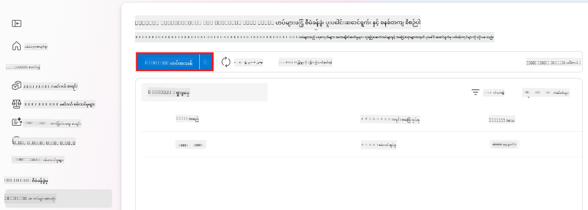

1. အောက်ပါအချက်များကို ပြုလုပ်ပါ-

    - **Hub name** ထည့်ပါ။ ထူးခြားသော အမည်ဖြစ်ရပါမည်။
    - သင့် Azure **Subscription** ကို ရွေးချယ်ပါ။
    - အသုံးပြုမည့် **Resource group** ကို ရွေးချယ်ပါ (လိုအပ်ပါက အသစ်ဖန်တီးပါ)။
    - အသုံးပြုလိုသော **Location** ကို ရွေးချယ်ပါ။
    - အသုံးပြုမည့် **Connect Azure AI Services** ကို ရွေးချယ်ပါ (လိုအပ်ပါက အသစ်ဖန်တီးပါ)။
    - **Connect Azure AI Search** ကို **Skip connecting** အဖြစ် ရွေးချယ်ပါ။

    

1. **Next** ကို နှိပ်ပါ။

#### Azure AI Foundry Project တည်ဆောက်ခြင်း

1. ဖန်တီးထားသော Hub အတွင်းမှ ဘယ်ဘက်ဘားမှ **All projects** ကို ရွေးချယ်ပါ။

1. နေရာပြောင်းမီနူးမှ **+ New project** ကို ရွေးချယ်ပါ။

    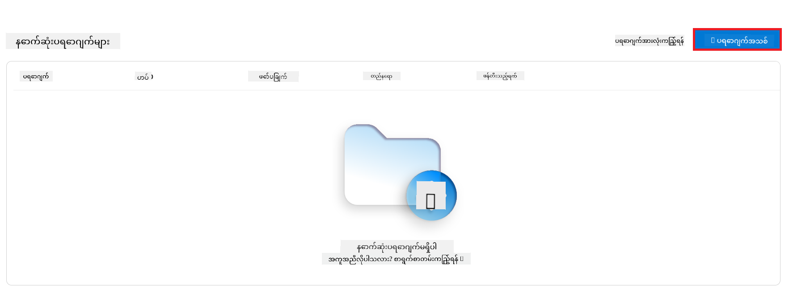

1. **Project name** ထည့်ပါ။ ထူးခြားသော အမည်ဖြစ်ရပါမည်။

    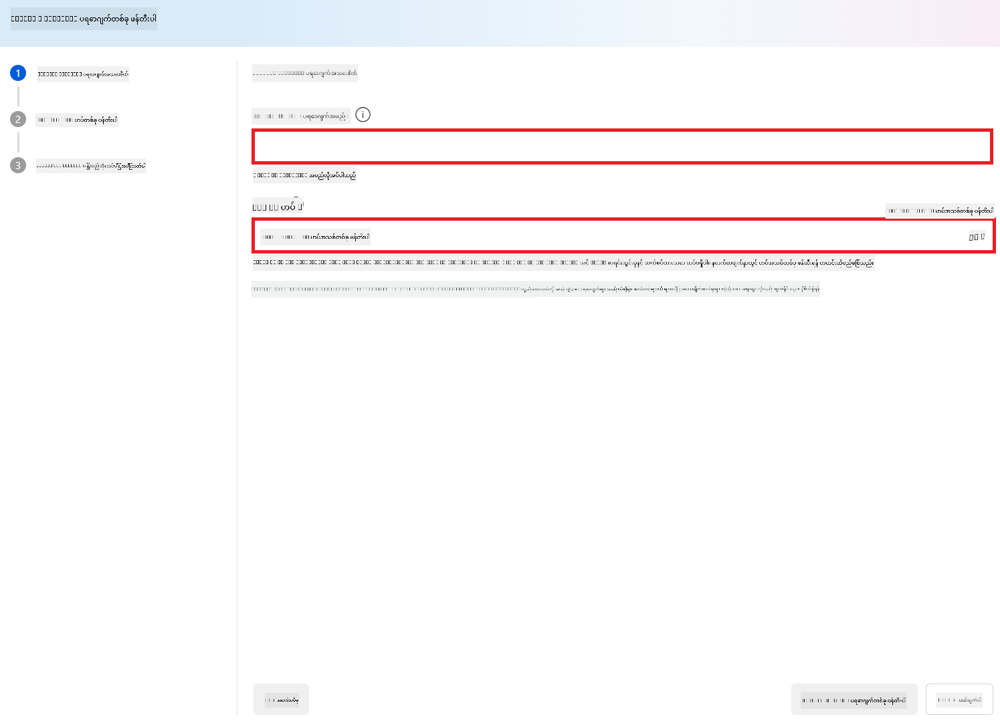

1. **Create a project** ကို ရွေးချယ်ပါ။

#### fine-tuned Phi-3 / Phi-3.5 မော်ဒယ်အတွက် custom connection ထည့်သွင်းခြင်း

သင့် custom Phi-3 / Phi-3.5 မော်ဒယ်ကို Prompt flow နှင့် ပေါင်းစည်းရန် မော်ဒယ်၏ endpoint နှင့် key ကို custom connection အဖြစ် သိမ်းဆည်းရပါမည်။ ဤဆက်တင်သည် Prompt flow တွင် သင့် custom မော်ဒယ်ကို အသုံးပြုနိုင်ရန် အာမခံပေးပါသည်။

#### fine-tuned Phi-3 / Phi-3.5 မော်ဒယ်၏ api key နှင့် endpoint uri သတ်မှတ်ခြင်း

1. [Azure ML Studio](https://ml.azure.com/home?wt.mc_id=studentamb_279723) သို့ သွားပါ။

1. ဖန်တီးထားသော Azure Machine learning workspace သို့ သွားပါ။

1. ဘယ်ဘက်ဘားမှ **Endpoints** ကို ရွေးချယ်ပါ။

    

1. ဖန်တီးထားသော endpoint ကို ရွေးချယ်ပါ။

    

1. နေရာပြောင်းမီနူးမှ **Consume** ကို ရွေးချယ်ပါ။

1. သင့် **REST endpoint** နှင့် **Primary key** ကို ကူးယူပါ။

    

#### Custom Connection ထည့်သွင်းခြင်း

1. [Azure AI Foundry](https://ai.azure.com/?wt.mc_id=studentamb_279723) သို့ သွားပါ။

1. ဖန်တီးထားသော Azure AI Foundry project သို့ သွားပါ။

1. ဖန်တီးထားသော Project အတွင်း ဘယ်ဘက်ဘားမှ **Settings** ကို ရွေးချယ်ပါ။

1. **+ New connection** ကို ရွေးချယ်ပါ။

    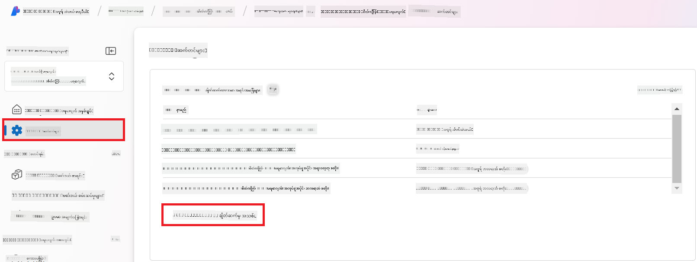

1. နေရာပြောင်းမီနူးမှ **Custom keys** ကို ရွေးချယ်ပါ။

    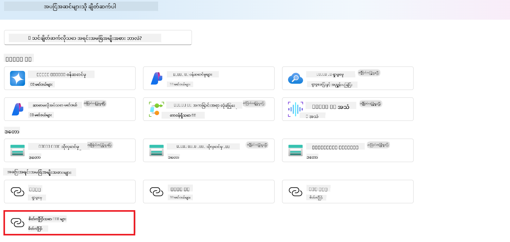

1. အောက်ပါအချက်များကို ပြုလုပ်ပါ-

    - **+ Add key value pairs** ကို ရွေးချယ်ပါ။
    - key အမည်အဖြစ် **endpoint** ထည့်ပြီး Azure ML Studio မှ ကူးယူထားသော endpoint ကို value အဖြစ် ထည့်ပါ။
    - ထပ်မံ **+ Add key value pairs** ကို ရွေးချယ်ပါ။
    - key အမည်အဖြစ် **key** ထည့်ပြီး Azure ML Studio မှ ကူးယူထားသော key ကို value အဖြစ် ထည့်ပါ။
    - key များ ထည့်ပြီးနောက် **is secret** ကို ရွေးချယ်၍ key များ ဖော်ပြခြင်းမှ ကာကွယ်ပါ။

    

1. **Add connection** ကို နှိပ်ပါ။

#### Prompt flow တည်ဆောက်ခြင်း

Azure AI Foundry တွင် custom connection ထည့်သွင်းပြီးပါပြီ။ ယခုအခါ အောက်ပါအဆင့်များဖြင့် Prompt flow တစ်ခု ဖန်တီးပါ။ ထို့နောက် Prompt flow ကို custom connection နှင့် ချိတ်ဆက်၍ fine-tuned မော်ဒယ်ကို Prompt flow အတွင်း အသုံးပြုနိုင်ပါမည်။

1. ဖန်တီးထားသော Azure AI Foundry project သို့ သွားပါ။

1. ဘယ်ဘက်ဘားမှ **Prompt flow** ကို ရွေးချယ်ပါ။

1. နေရာပြောင်းမီနူးမှ **+ Create** ကို ရွေးချယ်ပါ။

    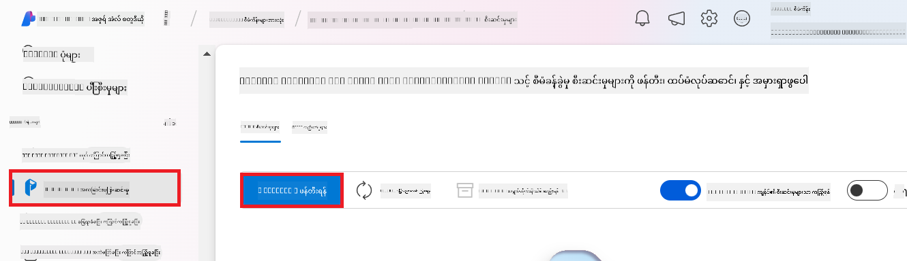

1. နေရာပြောင်းမီနူးမှ **Chat flow** ကို ရွေးချယ်ပါ။

    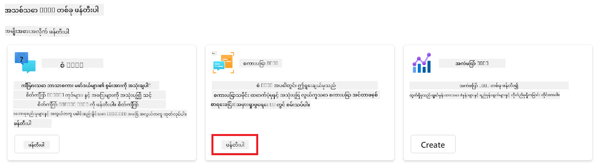

1. အသုံးပြုမည့် **Folder name** ထည့်ပါ။

    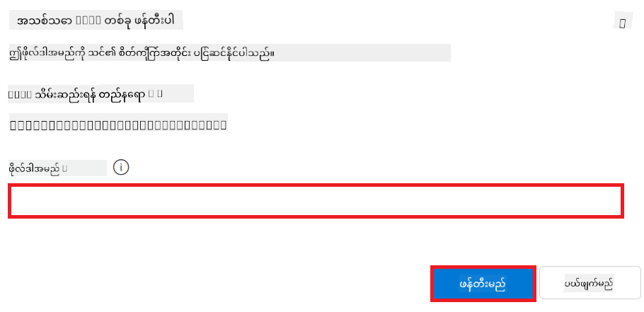

1. **Create** ကို ရွေးချယ်ပါ။

#### သင့် custom Phi-3 / Phi-3.5 မော်ဒယ်နှင့် စကားပြောရန် Prompt flow ကို ပြင်ဆင်ခြင်း

fine-tuned Phi-3 / Phi-3.5 မော်ဒယ်ကို Prompt flow ထဲသို့ ပေါင်းစည်းရန် လိုအပ်ပါသည်။ သို့သော် ပေးထားသော Prompt flow သည် ဤရည်ရွယ်ချက်အတွက် မသင့်တော်ပါ။ ထို့ကြောင့် Prompt flow ကို ပြန်လည်ဒီဇိုင်းဆွဲ၍ custom မော်ဒယ် ပေါင်းစည်းနိုင်ရန် ပြင်ဆင်ရပါမည်။

1. Prompt flow တွင် အောက်ပါအဆင့်များဖြင့် ရှိပြီးသား flow ကို ပြန်လည်တည်ဆောက်ပါ-

    - **Raw file mode** ကို ရွေးချယ်ပါ။
    - *flow.dag.yml* ဖိုင်အတွင်းရှိ ရှိပြီးသားကုဒ်အားလုံးကို ဖျက်ပါ။
    - *flow.dag.yml* ထဲသို့ အောက်ပါကုဒ်ကို ထည့်ပါ။

        ```yml
        inputs:
          input_data:
            type: string
            default: "Who founded Microsoft?"

        outputs:
          answer:
            type: string
            reference: ${integrate_with_promptflow.output}

        nodes:
        - name: integrate_with_promptflow
          type: python
          source:
            type: code
            path: integrate_with_promptflow.py
          inputs:
            input_data: ${inputs.input_data}
        ```

    - **Save** ကို နှိပ်ပါ။

    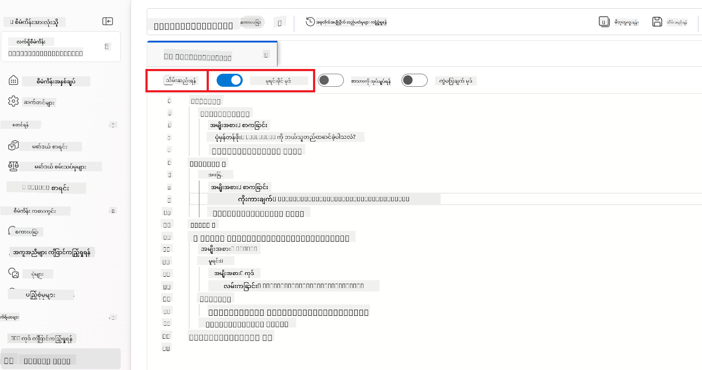

1. Prompt flow တွင် သင့် custom Phi-3 / Phi-3.5 မော်ဒယ်ကို အသုံးပြုရန် *integrate_with_promptflow.py* ထဲသို့ အောက်ပါကုဒ်ကို ထည့်ပါ။

    ```python
    import logging
    import requests
    from promptflow import tool
    from promptflow.connections import CustomConnection

    # Logging setup
    logging.basicConfig(
        format="%(asctime)s - %(levelname)s - %(name)s - %(message)s",
        datefmt="%Y-%m-%d %H:%M:%S",
        level=logging.DEBUG
    )
    logger = logging.getLogger(__name__)

    def query_phi3_model(input_data: str, connection: CustomConnection) -> str:
        """
        Send a request to the Phi-3 / Phi-3.5 model endpoint with the given input data using Custom Connection.
        """

        # "connection" is the name of the Custom Connection, "endpoint", "key" are the keys in the Custom Connection
        endpoint_url = connection.endpoint
        api_key = connection.key

        headers = {
            "Content-Type": "application/json",
            "Authorization": f"Bearer {api_key}"
        }
    data = {
        "input_data": [input_data],
        "params": {
            "temperature": 0.7,
            "max_new_tokens": 128,
            "do_sample": True,
            "return_full_text": True
            }
        }
        try:
            response = requests.post(endpoint_url, json=data, headers=headers)
            response.raise_for_status()
            
            # Log the full JSON response
            logger.debug(f"Full JSON response: {response.json()}")

            result = response.json()["output"]
            logger.info("Successfully received response from Azure ML Endpoint.")
            return result
        except requests.exceptions.RequestException as e:
            logger.error(f"Error querying Azure ML Endpoint: {e}")
            raise

    @tool
    def my_python_tool(input_data: str, connection: CustomConnection) -> str:
        """
        Tool function to process input data and query the Phi-3 / Phi-3.5 model.
        """
        return query_phi3_model(input_data, connection)

    ```

    

> [!NOTE]
> Azure AI Foundry တွင် Prompt flow အသုံးပြုနည်း ပိုမိုအသေးစိတ် သိရှိလိုပါက [Prompt flow in Azure AI Foundry](https://learn.microsoft.com/azure/ai-studio/how-to/prompt-flow) ကို ကြည့်ရှုနိုင်ပါသည်။

1. **Chat input**, **Chat output** ကို ရွေးချယ်၍ မော်ဒယ်နှင့် စကားပြောနိုင်ရန် ဖွင့်ပါ။

    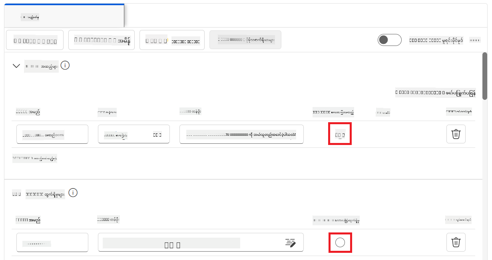

1. ယခု သင့် custom Phi-3 / Phi-3.5 မော်ဒယ်နှင့် စကားပြောရန် အသင့်ဖြစ်ပါပြီ။ နောက်တစ်ခုသော လေ့ကျင့်မှုတွင် Prompt flow ကို စတင်အသုံးပြုနည်းနှင့် fine-tuned Phi-3 / Phi-3.5 မော်ဒယ်နှင့် စကားပြောနည်းကို သင်ယူပါမည်။

> [!NOTE]
>
> ပြန်လည်တည်ဆောက်ထားသော flow သည် အောက်ပါပုံစံကဲ့သို့ ဖြစ်ရပါမည်-
>
> 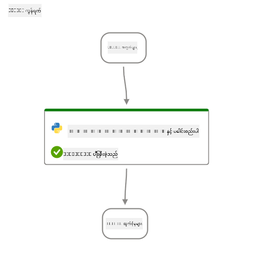
>

#### Prompt flow စတင်ခြင်း

1. Prompt flow စတင်ရန် **Start compute sessions** ကို နှိပ်ပါ။

    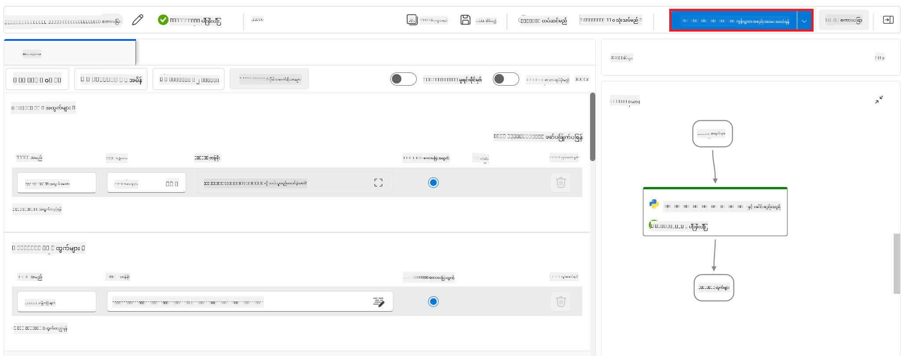

1. ပါရာမီတာများကို ပြန်လည်သတ်မှတ်ရန် **Validate and parse input** ကို နှိပ်ပါ။

    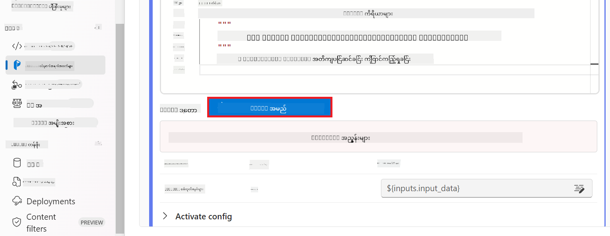

1. ဖန်တီးထားသော custom connection ၏ **connection** အတွက် **Value** ကို ရွေးချယ်ပါ။ ဥပမာ - *connection*။

    

#### သင့် custom Phi-3 / Phi-3.5 မော်ဒယ်နှင့် စကားပြောခြင်း

1. **Chat** ကို ရွေးချယ်ပါ။

    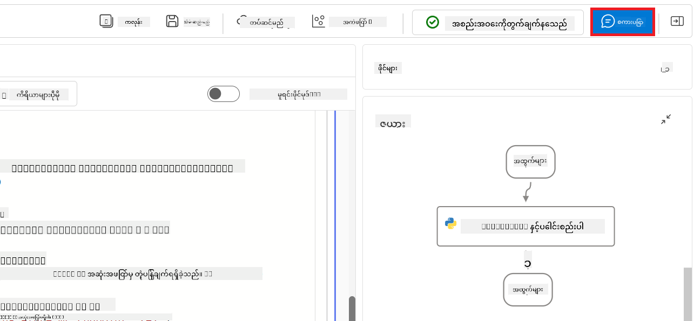

1. ဤမှာ ရလဒ်ဥပမာတစ်ခုဖြစ်သည်- ယခု သင့် custom Phi-3 / Phi-3.5 မော်ဒယ်နှင့် စကားပြောနိုင်ပါပြီ။ fine-tuning အတွက် အသုံးပြုထားသော ဒေတာအပေါ် အခြေခံ၍ မေးခွန်းများ မေးရန် အကြံပြုပါသည်။

    

### Phi-3 / Phi-3.5 မော်ဒယ်ကို သုံးသပ်ရန် Azure OpenAI ကို တပ်ဆင်ခြင်း

Phi-3 / Phi-3.5 မော်ဒယ်ကို Azure AI Foundry တွင် သုံးသပ်ရန် Azure OpenAI မော်ဒယ်တစ်ခု တပ်ဆင်ရပါမည်။ ဤမော်ဒယ်ကို Phi-3 / Phi-3.5 မော်ဒယ်၏ စွမ်းဆောင်ရည်ကို သုံးသပ်ရန် အသုံးပြုပါမည်။

#### Azure OpenAI တပ်ဆင်ခြင်း

1. [Azure AI Foundry](https://ai.azure.com/?wt.mc_id=studentamb_279723) တွင် လက်မှတ်ထိုးဝင်ပါ။

1. ဖန်တီးထားသော Azure AI Foundry project သို့ သွားပါ။

    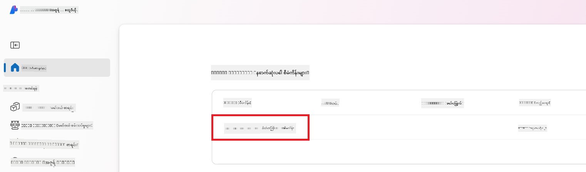

1. ဖန်တီးထားသော Project အတွင်း ဘယ်ဘက်ဘားမှ **Deployments** ကို ရွေးချယ်ပါ။

1. နေရာပြောင်းမီနူးမှ **+ Deploy model** ကို ရွေးချယ်ပါ။

1. **Deploy base model** ကို ရွေးချယ်ပါ။

    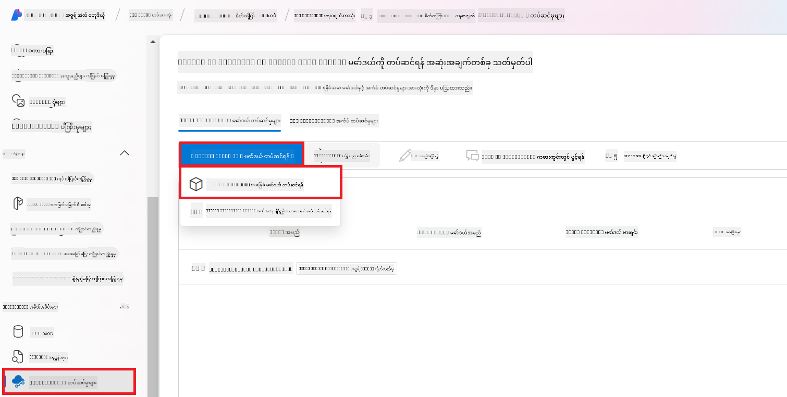

1. အသုံးပြုလိုသော Azure OpenAI မော်ဒယ်ကို ရွေးချယ်ပါ။ ဥပမာ - **gpt-4o**။

    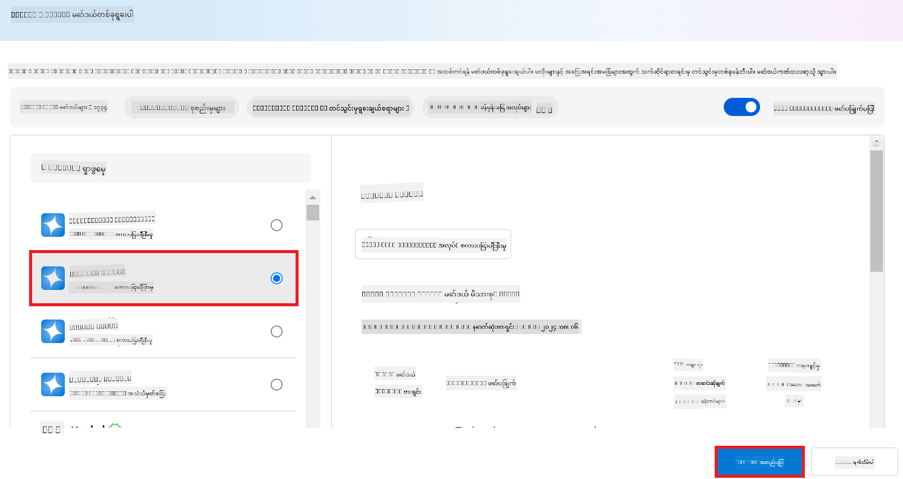

1. **Confirm** ကို နှိပ်ပါ။

### Azure AI Foundry ၏ Prompt flow evaluation ဖြင့် fine-tuned Phi-3 / Phi-3.5 မော်ဒယ်ကို သုံးသပ်ခြင်း

### သုံးသပ်မှုအသစ် စတင်ခြင်း

1. [Azure AI Foundry](https://ai.azure.com/?wt.mc_id=studentamb_279723) သို့ သွားပါ။

1. ဖန်တီးထားသော Azure AI Foundry project သို့ သွားပါ။

    

1. ဖန်တီးထားသော Project အတွင်း ဘယ်ဘက်ဘားမှ **Evaluation** ကို ရွေးချယ်ပါ။

1. နေရာပြောင်းမီနူးမှ **+ New evaluation** ကို ရွေးချယ်ပါ။

    

1. **Prompt flow** evaluation ကို ရွေးချယ်ပါ။

    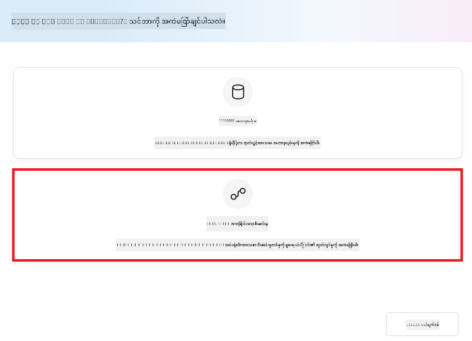

1. အောက်ပါအချက်များကို ပြုလုပ်ပါ-

    - သုံးသပ်မှုအမည် ထည့်ပါ။ ထူးခြားသော အမည်ဖြစ်ရပါမည်။
    - အလုပ်အမျိုးအစားအဖြစ် **Question and answer without context** ကို ရွေးချယ်ပါ။ ဤသင်ခန်းစာတွင် အသုံးပြုသော **UlTRACHAT_200k** ဒေတာစုံတွင် context မပါဝင်ပါ။
    - သုံးသပ်လိုသော prompt flow ကို ရွေးချယ်ပါ။

    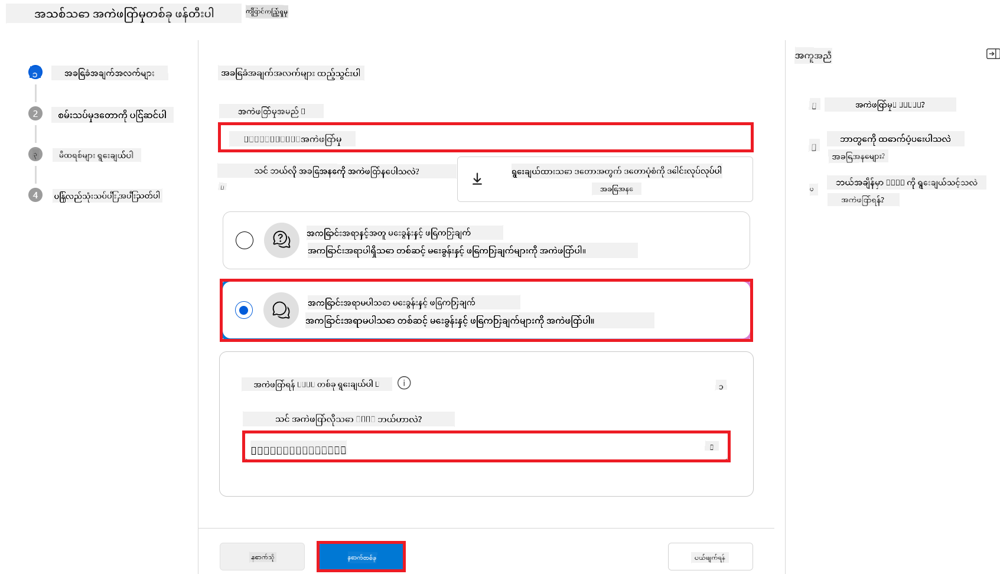

1. **Next** ကို နှိပ်ပါ။

1. အောက်ပါအချက်များကို ပြုလုပ်ပါ-

    - ဒေတာစုံကို တင်ရန် **Add your dataset** ကို ရွေးချယ်ပါ။ ဥပမာ - **ULTRACHAT_200k** ဒေတာစုံကို ဒေါင်းလုပ်လုပ်ရာတွင် ပါဝင်သော *test_data.json1* ဖိုင်ကို တင်နိုင်ပါသည်။
    - သင့်ဒေတာစုံနှင့် ကိုက်ညီသော **Dataset column** ကို ရွေးချယ်ပါ။ ဥပမာ - **ULTRACHAT_200k** ဒေတာစုံကို အသုံးပြုပါက **${data.prompt}** ကို ရွေးချယ်ပါ။

    

1. **Next** ကို နှိပ်ပါ။

1. စွမ်းဆောင်ရည်နှင့် အရည်အသွေး မီထရစ်များကို သတ်မှတ်ရန် အောက်ပါအချက်များကို ပြုလုပ်ပါ-

    - အသုံးပြုလိုသော စွမ်းဆောင်ရည်နှင့် အရည်အသွေး မီထရစ်များကို ရွေးချယ်ပါ။
    - သုံးသပ်မှုအတွက် ဖန်တီးထားသော Azure OpenAI မော်ဒယ်ကို ရွေးချယ်ပါ။ ဥပမာ - **gpt-4o** ကို ရွေးချယ်ပါ။

    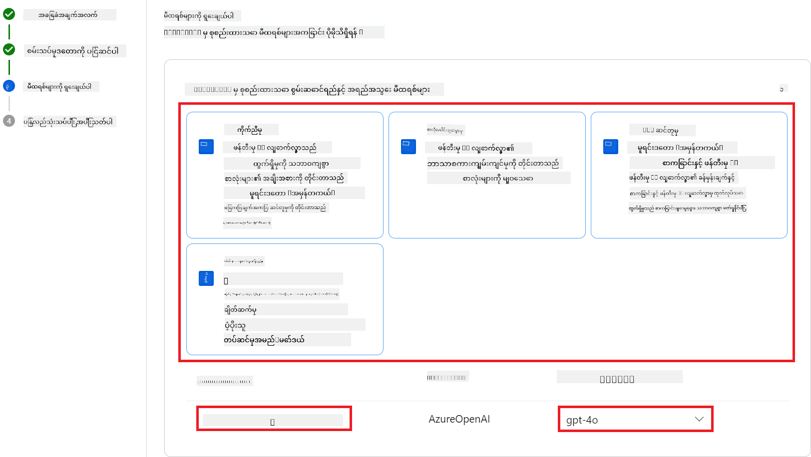

1. အန္တရာယ်နှင့် လုံခြုံရေး မီထရစ်များကို သတ်မှတ်ရန် အောက်ပါအချက်များကို ပြုလုပ်ပါ-

    - အသုံးပြုလိုသော အန္တရာယ်နှင့် လုံခြုံရေး မီထရစ်များကို ရွေးချယ်ပါ။
    - အမှားနှုန်းတွက်ချက်ရန် သတ်မှတ်ချက် (threshold) ကို ရွေးချယ်ပါ။ ဥပမာ - **Medium** ကို ရွေးချယ်ပါ။
    - **question** အတွက် **Data source** ကို **{$data.prompt}** သို့ သတ်မှတ်ပါ။
    - **answer** အတွက် **Data source** ကို **{$run.outputs.answer}** သို့ သတ်မှတ်ပါ။
    - **ground_truth** အတွက် **Data source** ကို **{$data.message}** သို့ သတ်မှတ်ပါ။

    

1. **Next** ကို နှိပ်ပါ။

1. သုံးသပ်မှု စတင်ရန် **Submit** ကို နှိပ်ပါ။

1. သုံးသပ်မှု ပြီးမြောက်ရန် အချိန်ယူပါမည်။ သင်သည် **Evaluation** tab တွင် တိုးတက်မှုကို ကြည့်ရှုနိုင်ပါသည်။

### သုံးသပ်မှုရလဒ်များကို ပြန်လည်သုံးသပ်ခြင်း
> [!NOTE]
> အောက်တွင် ဖော်ပြထားသော ရလဒ်များသည် အကဲဖြတ်မှု လုပ်ငန်းစဉ်ကို ရှင်းလင်းပြသရန် ရည်ရွယ်ထားပါသည်။ ဤသင်ခန်းစာတွင် ကျွန်ုပ်တို့သည် အနည်းငယ်သော ဒေတာစုစည်းမှုတစ်ခုအပေါ် ဖိုင်န့်တူန်းလုပ်ထားသော မော်ဒယ်ကို အသုံးပြုထားပြီး၊ ၎င်းကြောင့် ရလဒ်များသည် အကောင်းဆုံးမဖြစ်နိုင်ပါ။ အမှန်တကယ်ရရှိမည့် ရလဒ်များမှာ အသုံးပြုသည့် ဒေတာ၏ အရွယ်အစား၊ အရည်အသွေးနှင့် မတူကွဲပြားမှု၊ မော်ဒယ်၏ သတ်မှတ်ချက်များအပေါ် မူတည်၍ အလွန်ကွဲပြားနိုင်ပါသည်။
အကဲဖြတ်မှု ပြီးဆုံးသွားပါက၊ သင်သည် စွမ်းဆောင်ရည်နှင့် လုံခြုံရေး မီထရစ်များနှစ်ခုစလုံးအတွက် ရလဒ်များကို ပြန်လည်သုံးသပ်နိုင်ပါသည်။

1. စွမ်းဆောင်ရည်နှင့် အရည်အသွေး မီထရစ်များ -

    - မော်ဒယ်သည် ဆက်စပ်ပြီး၊ စကားလုံးချောမွေ့ပြီး၊ သင့်တော်သော တုံ့ပြန်ချက်များ ထုတ်ပေးနိုင်မှုကို အကဲဖြတ်ပါ။

    

1. အန္တရာယ်နှင့် လုံခြုံရေး မီထရစ်များ -

    - မော်ဒယ်ထုတ်လွှင့်ချက်များသည် လုံခြုံပြီး၊ တာဝန်ရှိသော AI စည်းကမ်းများနှင့် ကိုက်ညီမှုရှိစေရန်၊ ထိခိုက်မှုရှိသော သို့မဟုတ် မလေးစားဖွယ် အကြောင်းအရာများ မပါဝင်စေရန် သေချာစေပါ။

    

1. **အသေးစိတ် မီထရစ် ရလဒ်များ** ကို ကြည့်ရှုရန် အောက်သို့ ဆွဲချနိုင်ပါသည်။

    

1. သင်၏ စိတ်ကြိုက် Phi-3 / Phi-3.5 မော်ဒယ်ကို စွမ်းဆောင်ရည်နှင့် လုံခြုံရေး မီထရစ်များနှစ်ခုစလုံးဖြင့် အကဲဖြတ်ခြင်းအားဖြင့်၊ မော်ဒယ်သည် ထိရောက်မှုရှိသည့်အပြင် တာဝန်ရှိသော AI လုပ်ထုံးလုပ်နည်းများကိုလည်း လိုက်နာထားကြောင်း အတည်ပြုနိုင်ပြီး၊ အမှန်တကယ် အသုံးချနိုင်ရန် အသင့်ဖြစ်ပါသည်။

## ဂုဏ်ယူပါတယ်!

### သင်သည် ဤသင်ခန်းစာကို ပြီးမြောက်လိုက်ပြီ

သင်သည် Azure AI Foundry တွင် Prompt flow ဖြင့် ပေါင်းစပ်ထားသော fine-tuned Phi-3 မော်ဒယ်ကို အောင်မြင်စွာ အကဲဖြတ်နိုင်ခဲ့ပါသည်။ ၎င်းသည် သင်၏ AI မော်ဒယ်များသည် ကောင်းမွန်စွာ လုပ်ဆောင်နိုင်ခြင်းသာမက Microsoft ၏ တာဝန်ရှိသော AI စည်းကမ်းများကိုလည်း လိုက်နာကာ ယုံကြည်စိတ်ချရပြီး ယုံကြည်စိတ်ချရသော AI အက်ပလီကေးရှင်းများ တည်ဆောက်ရာတွင် အရေးကြီးသော အဆင့်ဖြစ်ပါသည်။


## Azure အရင်းအမြစ်များကို သန့်ရှင်းပါ

သင့်အကောင့်တွင် အပိုကြေးများ မဖြစ်ပေါ်စေရန် Azure အရင်းအမြစ်များကို သန့်ရှင်းပါ။ Azure ပေါ်တယ်သို့ သွားပြီး အောက်ပါ အရင်းအမြစ်များကို ဖျက်ပစ်ပါ-

- Azure Machine learning အရင်းအမြစ်
- Azure Machine learning မော်ဒယ် အဆုံးအဖြတ်
- Azure AI Foundry Project အရင်းအမြစ်
- Azure AI Foundry Prompt flow အရင်းအမြစ်

### နောက်တစ်ဆင့်များ

#### စာတမ်းများ

- [Responsible AI dashboard ဖြင့် AI စနစ်များကို အကဲဖြတ်ခြင်း](https://learn.microsoft.com/azure/machine-learning/concept-responsible-ai-dashboard?view=azureml-api-2&source=recommendations?wt.mc_id=studentamb_279723)
- [Generative AI အတွက် အကဲဖြတ်ခြင်းနှင့် စောင့်ကြည့်မှု မီထရစ်များ](https://learn.microsoft.com/azure/ai-studio/concepts/evaluation-metrics-built-in?tabs=definition?wt.mc_id=studentamb_279723)
- [Azure AI Foundry စာတမ်းများ](https://learn.microsoft.com/azure/ai-studio/?wt.mc_id=studentamb_279723)
- [Prompt flow စာတမ်းများ](https://microsoft.github.io/promptflow/?wt.mc_id=studentamb_279723)

#### လေ့ကျင့်မှု အကြောင်းအရာများ

- [Microsoft ၏ တာဝန်ရှိသော AI နည်းလမ်းမိတ်ဆက်](https://learn.microsoft.com/training/modules/introduction-to-microsofts-responsible-ai-approach/?source=recommendations?wt.mc_id=studentamb_279723)
- [Azure AI Foundry မိတ်ဆက်](https://learn.microsoft.com/training/modules/introduction-to-azure-ai-studio/?wt.mc_id=studentamb_279723)

### ကိုးကားချက်များ

- [တာဝန်ရှိသော AI ဆိုတာဘာလဲ?](https://learn.microsoft.com/azure/machine-learning/concept-responsible-ai?view=azureml-api-2?wt.mc_id=studentamb_279723)
- [ပိုမိုလုံခြုံပြီး ယုံကြည်စိတ်ချရသော generative AI အက်ပလီကေးရှင်းများ တည်ဆောက်ရာတွင် ကူညီပေးမည့် Azure AI ၏ ကိရိယာအသစ်များ ကြေညာချက်](https://azure.microsoft.com/blog/announcing-new-tools-in-azure-ai-to-help-you-build-more-secure-and-trustworthy-generative-ai-applications/?wt.mc_id=studentamb_279723)
- [Generative AI အက်ပလီကေးရှင်းများ အကဲဖြတ်ခြင်း](https://learn.microsoft.com/azure/ai-studio/concepts/evaluation-approach-gen-ai?wt.mc_id%3Dstudentamb_279723)

**အကြောင်းကြားချက်**  
ဤစာတမ်းကို AI ဘာသာပြန်ဝန်ဆောင်မှု [Co-op Translator](https://github.com/Azure/co-op-translator) ဖြင့် ဘာသာပြန်ထားပါသည်။ ကျွန်ုပ်တို့သည် တိကျမှန်ကန်မှုအတွက် ကြိုးစားသော်လည်း၊ အလိုအလျောက် ဘာသာပြန်ခြင်းများတွင် အမှားများ သို့မဟုတ် မှားယွင်းချက်များ ပါဝင်နိုင်ကြောင်း သတိပြုပါရန် မေတ္တာရပ်ခံအပ်ပါသည်။ မူရင်းစာတမ်းကို မိမိဘာသာစကားဖြင့်သာ တရားဝင်အရင်းအမြစ်အဖြစ် သတ်မှတ်သင့်ပါသည်။ အရေးကြီးသော အချက်အလက်များအတွက် လူ့ဘာသာပြန်ပညာရှင်မှ ဘာသာပြန်ခြင်းကို အကြံပြုပါသည်။ ဤဘာသာပြန်ချက်ကို အသုံးပြုရာမှ ဖြစ်ပေါ်လာနိုင်သည့် နားလည်မှုမှားယွင်းမှုများအတွက် ကျွန်ုပ်တို့ တာဝန်မယူပါ။