<!--
CO_OP_TRANSLATOR_METADATA:
{
  "original_hash": "7ca2c30fdb802664070e9cfbf92e24fe",
  "translation_date": "2026-01-05T15:50:11+00:00",
  "source_file": "md/02.Application/01.TextAndChat/Phi3/E2E_Phi-3-FineTuning_PromptFlow_Integration.md",
  "language_code": "my"
}
-->
# Fine-tune နှင့် custom Phi-3 မော်ဒယ်များကို Prompt flow နဲ့ပေါင်းစပ်ခြင်း

ဒီ end-to-end (E2E) နမူနာက Microsoft Tech Community မှ "[Fine-Tune and Integrate Custom Phi-3 Models with Prompt Flow: Step-by-Step Guide](https://techcommunity.microsoft.com/t5/educator-developer-blog/fine-tune-and-integrate-custom-phi-3-models-with-prompt-flow/ba-p/4178612?WT.mc_id=aiml-137032-kinfeylo)" လမ်းညွှန်စာအုပ်အပေါ်အခြေခံပြီး ဖြစ်ပါတယ်။ ဒါဟာ fine-tuning၊ ဖြန့်ချိခြင်းနဲ့ custom Phi-3 မော်ဒယ်များကို Prompt flow နဲ့ပေါင်းစပ်တဲ့ လုပ်ငန်းစဉ်တွေကို မိတ်ဆက်ပေးပါတယ်။

## ကိုယ်ပိုင်အကျဉ်းချုပ်

ဒီ E2E နမူနာမှာ သင်ဟာ Phi-3 မော်ဒယ်ကို fine-tune လုပ်နည်းနဲ့ Prompt flow နဲ့ပေါင်းစပ်နည်းကို သင်ယူမှာဖြစ်ပါတယ်။ Azure Machine Learning နဲ့ Prompt flow ကို အသုံးပြုပြီး မိမိတို့ custom AI မော်ဒယ်များကို ဖြန့်ချိခြင်းနဲ့ အသုံးပြုခြင်းအတွက် workflow တစ်ခုဖန်တီးပါမယ်။ ဒီ E2E နမူနာကို သုံးခုသော ကြည့်ရှုခင်းများအဖြစ်ခွဲထားပါတယ်။

**ကြည့်ရှုခင်း ၁: Azure အရင်းအမြစ်များ တပ်ဆင်ခြင်းနှင့် fine-tuning အတွက် ပြင်ဆင်ခြင်း**

**ကြည့်ရှုခင်း ၂: Phi-3 မော်ဒယ်ကို fine-tune လုပ်ခြင်း၊ Azure Machine Learning Studio မှာ ဖြန့်ချိခြင်း**

**ကြည့်ရှုခင်း ၃: Prompt flow နဲ့ ပေါင်းစပ်ခြင်းနဲ့ သင့် custom မော်ဒယ်နဲ့ စကားပြောခြင်း**

ဒီမှာ ဒီ E2E နမူနာအကြောင်းအကျဉ်းက ဒီလို ဖြစ်ပါတယ်။

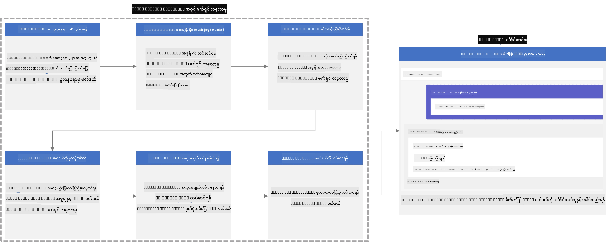

### အကြောင်းအရာဇယား

1. **[ကြည့်ရှုခန်း ၁: Azure အရင်းအမြစ်များ တပ်ဆင်ခြင်းနှင့် fine-tuning အတွက် ပြင်ဆင်ခြင်း](../../../../../../md/02.Application/01.TextAndChat/Phi3)**
    - [Azure Machine Learning Workspace တည်ဆောက်ခြင်း](../../../../../../md/02.Application/01.TextAndChat/Phi3)
    - [Azure Subscription မှ GPU အရေအတွက်တောင်းခံခြင်း](../../../../../../md/02.Application/01.TextAndChat/Phi3)
    - [Role assignment ထည့်သွင်းခြင်း](../../../../../../md/02.Application/01.TextAndChat/Phi3)
    - [ပရောဂျက်ကို တပ်ဆင်ခြင်း](../../../../../../md/02.Application/01.TextAndChat/Phi3)
    - [fine-tuning အတွက် dataset ပြင်ဆင်ခြင်း](../../../../../../md/02.Application/01.TextAndChat/Phi3)

1. **[ကြည့်ရှုခန်း ၂: Phi-3 မော်ဒယ်ကို fine-tune လုပ်ခြင်းနှင့် Azure Machine Learning Studio တွင် ဖြန့်ချိခြင်း](../../../../../../md/02.Application/01.TextAndChat/Phi3)**
    - [Azure CLI ကို သတ်မှတ်ခြင်း](../../../../../../md/02.Application/01.TextAndChat/Phi3)
    - [Phi-3 မော်ဒယ်ကို fine-tune လုပ်ခြင်း](../../../../../../md/02.Application/01.TextAndChat/Phi3)
    - [fine-tuned မော်ဒယ်ကို ဖြန့်ချိခြင်း](../../../../../../md/02.Application/01.TextAndChat/Phi3)

1. **[ကြည့်ရှုခန်း ၃: Prompt flow နဲ့ ပေါင်းစပ်ခြင်းနှင့် သင့် custom မော်ဒယ်နဲ့ စကားပြောခြင်း](../../../../../../md/02.Application/01.TextAndChat/Phi3)**
    - [Custom Phi-3 မော်ဒယ်ကို Prompt flow နဲ့ ပေါင်းစပ်ခြင်း](../../../../../../md/02.Application/01.TextAndChat/Phi3)
    - [သင့် custom မော်ဒယ်နဲ့ စကားပြောခြင်း](../../../../../../md/02.Application/01.TextAndChat/Phi3)

## ကြည့်ရှုခန်း ၁: Azure အရင်းအမြစ်များ တပ်ဆင်ခြင်းနှင့် fine-tuning အတွက် ပြင်ဆင်ခြင်း

### Azure Machine Learning Workspace တည်ဆောက်ခြင်း

1. Portal စာမျက်နှာအပေါ်ဆုံးမှာရှိတဲ့ **search bar** ထဲမှာ *azure machine learning* ဟုတ်ပါတယ်ရေးပြီးပြုစုထွက်လာတဲ့ရွေးချယ်စရာတွေထဲက **Azure Machine Learning** ကို ရွေးချယ်ပါ။

    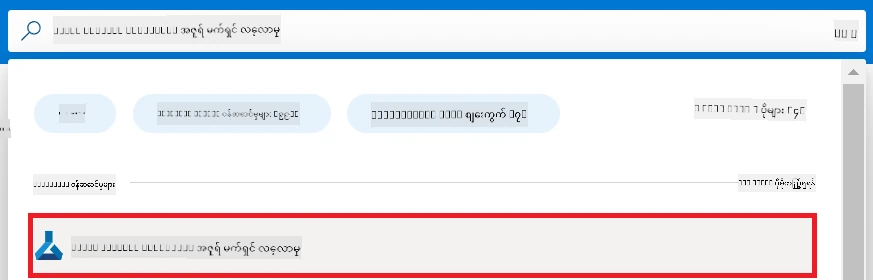

1. နေရာမီနူး (navigation menu) မှာ **+ Create** ကိုရွေးချယ်ပါ။

1. နေရာမီနူး (navigation menu) မှာ **New workspace** ကို ရွေးချယ်ပါ။

    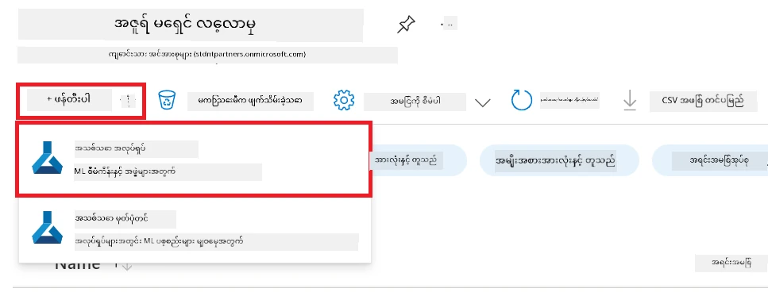

1. အောက်ပါလုပ်ဆောင်ချက်များကို ဆောင်ရွက်ပါ။

    - သင်၏ Azure **Subscription** ကို ရွေးချယ်ပါ။
    - အသုံးပြုမည့် **Resource group** ကို ရွေးပါ (လိုအပ်လျှင် အသစ်ဖန်တီးပါ)။
    - **Workspace Name** ထည့်ပါ။ ပြီးတော့ တူမယ့် တန်ဖိုး မရှိရပါ။
    - အသုံးပြုလိုသည့် **Region** ကို ရွေးပါ။
    - အသုံးပြုမည့် **Storage account** ကို ရွေးပါ (လိုအပ်လျှင် အသစ်ဖန်တီးပါ)။
    - အသုံးပြုမည့် **Key vault** ကို ရွေးပါ (လိုအပ်လျှင် အသစ်ဖန်တီးပါ)။
    - အသုံးပြုမည့် **Application insights** ကို ရွေးပါ (လိုအပ်လျှင် အသစ်ဖန်တီးပါ)။
    - အသုံးပြုမည့် **Container registry** ကို ရွေးပါ (လိုအပ်လျှင် အသစ်ဖန်တီးပါ)။

    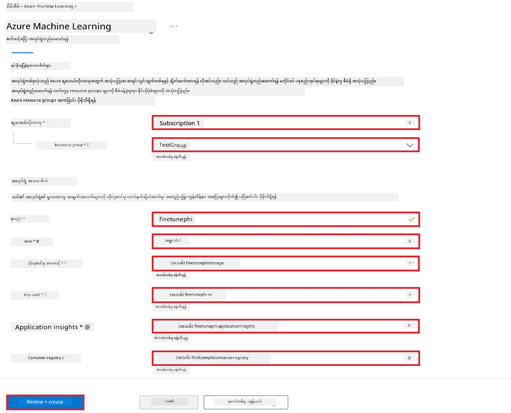

1. **Review + Create** ကို ရွေးပါ။

1. **Create** ကို ရွေးချယ်ပါ။

### Azure Subscription မှ GPU အရေအတွက်တောင်းခံခြင်း

ဒီ E2E နမူနာမှာ သင်ဟာ fine-tuning အတွက် *Standard_NC24ads_A100_v4 GPU* ကိုသုံးမှာ ဖြစ်ပြီး quota တောင်းခံရမယ်၊ deployment အတွက် *Standard_E4s_v3* CPU ကိုသုံးမှာဖြစ်ပြီး quota တောင်းနိုင်ရန်မလိုအပ်ပါ။

> [!NOTE]
>
> Pay-As-You-Go subscription (ပုံမှန် subscription အမျိုးအစား) တွေပဲ GPU ထောက်ပံ့ခွင့်ရရှိနိုင်သည်။ Benefit subscription များကို လက်ရှိမှာ မထောက်ပံ့ပါ။
>
> Benefit subscription (ဥပမာ Visual Studio Enterprise Subscription) သုံးနေသူများ သို့မဟုတ် fine-tuning နဲ့ deployment လုပ်ငန်းစဉ်ကို အမြန်စမ်းသပ်လိုသူများအတွက် ဒီလမ်းညွှန်မှာ CPU ဖြင့် dataset ဆန့်ကျင်မှုနည်းနည်းနဲ့ fine-tune လုပ်နည်းလည်း ပါပါတယ်။ သို့သော် GPU နဲ့ ကြီးမားတဲ့ dataset အသုံးပြုပါက fine-tune ရလဒ်က ပိုကောင်းမှုရှိကြောင်း သတိထားစေရန်အရေးကြီးပါသည်။

1. [Azure ML Studio](https://ml.azure.com/home?wt.mc_id=studentamb_279723) ကို သွားပါ။

1. *Standard NCADSA100v4 Family* quota ကို တောင်းဖို့ အောက်ပါအတိုင်း လုပ်ဆောင်ပါ။

    - ဘယ်ဘက်မှ tab မှာ **Quota** ကို ရွေးပါ။
    - အသုံးပြုမည့် **Virtual machine family** ကို ရွေးပါ။ ဥပမာအနေနဲ့ *Standard NCADSA100v4 Family Cluster Dedicated vCPUs* ကို ရွေးပါ၊ ဒီထဲမှာ *Standard_NC24ads_A100_v4* GPU ပါဝင်ပါတယ်။
    - နေရာမီနူး (navigation menu) မှာ **Request quota** ကို ရွေးပါ။

        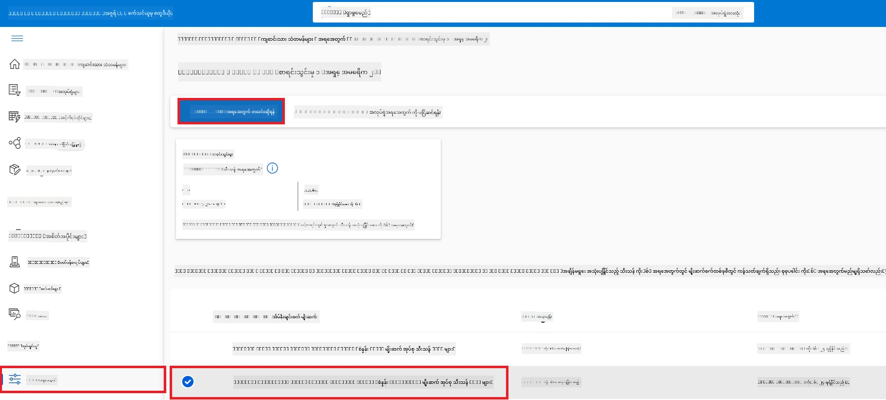

    - Request quota စာမျက်နှာမှာ အသုံးပြုလိုတဲ့ **New cores limit** ကိုထည့်ပါ။ ဥပမာ 24။
    - Request quota စာမျက်နှာမှာ **Submit** ကိုရွေးပြီး GPU quota တောင်းပါ။

> [!NOTE]
> အသင့်တော်ဆုံး GPU သို့မဟုတ် CPU ကို [Sizes for Virtual Machines in Azure](https://learn.microsoft.com/azure/virtual-machines/sizes/overview?tabs=breakdownseries%2Cgeneralsizelist%2Ccomputesizelist%2Cmemorysizelist%2Cstoragesizelist%2Cgpusizelist%2Cfpgasizelist%2Chpcsizelist) စာတမ်းကို ကိုးကားပြီး ရွေးချယ်နိုင်ပါသည်။

### Role assignment ထည့်သွင်းခြင်း

သင့်မော်ဒယ်များကို fine-tune လုပ်နဲ့ ဖြန့်ချိဖို့ User Assigned Managed Identity (UAI) တစ်ခုဖန်တီးပြီး လိုအပ်တဲ့ခွင့်ပြုချက်များထားရှိရမယ်။ ဒီ UAI ကို deployment အတွင်း authentification အတွက်အသုံးပြုမှာဖြစ်ပါတယ်။

#### User Assigned Managed Identity (UAI) ဖန်တီးခြင်း

1. Portal စာမျက်နှာအပေါ်ဆုံး ရှာဖွေရေးခြင်း **search bar** မှာ *managed identities* ဟုတ်ပါတယ်ရေးပြီး ရွေးချယ်ဟန်ချက်တွေထဲက **Managed Identities** ကို ရွေးချယ်ပါ။

    

1. **+ Create** ကို ရွေးပါ။

    

1. အောက်ပါအချက်များကိုပြုလုပ်ပါ။

    - သင့် Azure **Subscription** ကို ရွေးပါ။
    - အသုံးပြုမည့် **Resource group** ကို ရွေးပါ (လိုအပ်လျှင် အသစ်ဖန်တီးပါ)။
    - အသုံးပြုမည့် **Region** ကို ရွေးပါ။
    - **Name** ထည့်ပါ။ တူမယ့် အမည် မရှိရပါ။

1. **Review + create** ကို ရွေးပါ။

1. **+ Create** ကို ရွေးပါ။

#### Contributor role assignment ကို Managed Identity သို့ ထည့်သွင်းခြင်း

1. ဖန်တီးပြီးသား Managed Identity resource သို့ သွားပါ။

1. ဘယ်ဘက်မှ tab မှာ **Azure role assignments** ကို ရွေးပါ။

1. နေရာမီနူး (navigation menu) မှာ **+Add role assignment** ကို ရွေးပါ။

1. Add role assignment စာမျက်နှာအတွင်း အောက်ပါအတိုင်း ပြုလုပ်ပါ။
    - **Scope** ကို **Resource group** သတ်မှတ်ပါ။
    - သင့် Azure **Subscription** ကို ရွေးပါ။
    - အသုံးပြုမည့် **Resource group** ကို ရွေးပါ။
    - **Role** ကို **Contributor** သတ်မှတ်ပါ။

    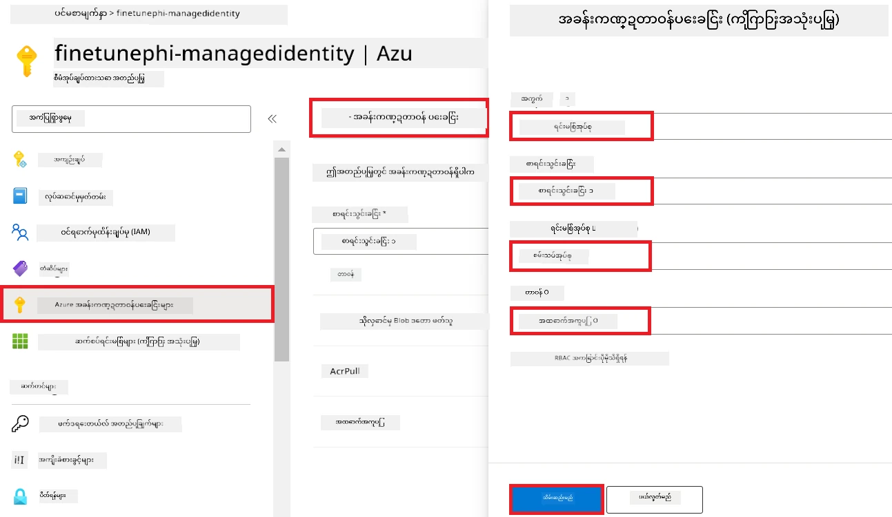

1. **Save** ကို ရွေးပါ။

#### Storage Blob Data Reader role assignment ကို Managed Identity သို့ ထည့်သွင်းခြင်း

1. Portal မှာ **search bar** အပေါ်ဆုံးမှာ *storage accounts* ဟုတ်ပါတယ်ရေးပြီး ရွေးချယ်စရာတွေထဲက **Storage accounts** ကို ရွေးပါ။

    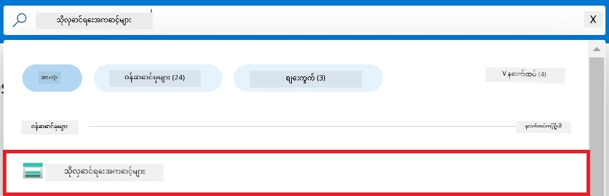

1. Azure Machine Learning workspace ကို ဖန်တီးတဲ့ storage account ကို ရွေးပါ။ ဥပမာ *finetunephistorage*။

1. Add role assignment စာမျက်နှာသို့ သွားဖို့ အောက်ပါအတိုင်း လုပ်ဆောင်ပါ။

    - အသုံးပြုထားသော Azure Storage account သို့ သွားပါ။
    - ဘယ်ဘက် tab မှာ **Access Control (IAM)** ကို ရွေးပါ။
    - နေရာမီနူး (navigation menu) မှာ **+ Add** ကိုရွေးပါ။
    - နေရာမီနူးမှာ **Add role assignment** ကို ရွေးပါ။

    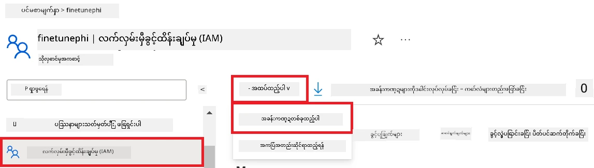

1. Add role assignment စာမျက်နှာအတွင်း အောက်ပါအတိုင်း လုပ်ဆောင်ပါ။

    - Role စာမျက်နှာမှာ **search bar** ထဲ *Storage Blob Data Reader* ဟုတ်ပါတယ်ရေးပြီး ရွေးချယ်ပါ။
    - Role စာမျက်နှာမှာ **Next** ကို ရွေးပါ။
    - Members စာမျက်နှာမှာ **Assign access to** ကို **Managed identity** သတ်မှတ်ပါ။
    - Members စာမျက်နှာမှာ **+ Select members** ကို ရွေးပါ။
    - Select managed identities စာမျက်နှာမှာ သင့် Azure **Subscription** ကို ရွေးပါ။
    - Select managed identities စာမျက်နှာမှာ **Managed identity** ကို **Manage Identity** အဖြစ် ရွေးပါ။
    - Select managed identities စာမျက်နှာမှာ ဖန်တီးထားတဲ့ Manage Identity ကို ရွေးပါ။ ဥပမာ *finetunephi-managedidentity*။
    - Select managed identities စာမျက်နှာမှာ **Select** ကို ရွေးပါ။

    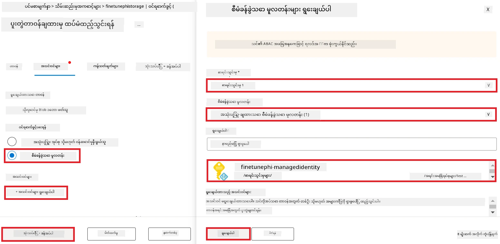

1. **Review + assign** ကို ရွေးပါ။

#### AcrPull role assignment ကို Managed Identity သို့ ထည့်သွင်းခြင်း

1. Portal မှာ **search bar** အပေါ်ဆုံးမှာ *container registries* ဟုတ်ပါတယ်ရေးပြီး ရွေးချယ်စရာတွေထဲက **Container registries** ကို ရွေးပါ။

    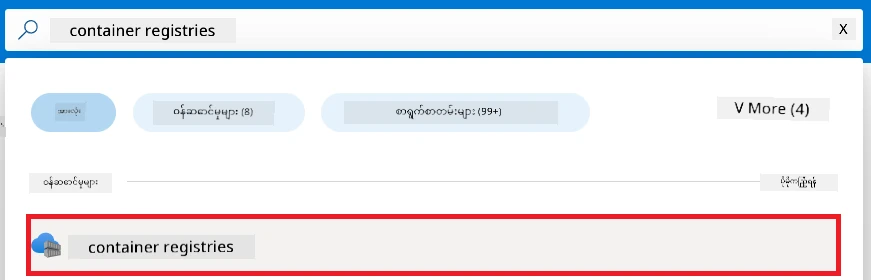

1. Azure Machine Learning workspace နဲ့ ဆက်သွယ်တဲ့ container registry ကို ရွေးပါ။ ဥပမာ *finetunephicontainerregistries*

1. Add role assignment စာမျက်နှာသို့ သွားဖို့ အောက်ပါအတိုင်း လုပ်ဆောင်ပါ။

    - ဘယ်ဘက် tab မှာ **Access Control (IAM)** ကို ရွေးပါ။
    - နေရာမီနူး (navigation menu) မှာ **+ Add** ကို ရွေးပါ။
    - နေရာမီနူးမှာ **Add role assignment** ကို ရွေးပါ။

1. Add role assignment စာမျက်နှာအတွင်း အောက်ပါအတိုင်း လုပ်ဆောင်ပါ။

    - Role စာမျက်နှာမှာ **search bar** ထဲ *AcrPull* ဟုတ်ပါတယ်ရေးပြီး ရွေးချယ်ပါ။
    - Role စာမျက်နှာမှာ **Next** ကို ရွေးပါ။
    - Members စာမျက်နာမှာ **Assign access to** ကို **Managed identity** သတ်မှတ်ပါ။
    - Members စာမျက်နာမှာ **+ Select members** ကို ရွေးပါ။
    - Select managed identities စာမျက်နာမှာ သင့် Azure **Subscription** ကို ရွေးပါ။
    - Select managed identities စာမျက်နာမှာ **Managed identity** ကို **Manage Identity** အဖြစ် ရွေးပါ။
    - Select managed identities စာမျက်နာမှာ ဖန်တီးထားတဲ့ Manage Identity ကို ရွေးပါ။ ဥပမာ *finetunephi-managedidentity*။
    - Select managed identities စာမျက်နာမှာ **Select** ကို ရွေးပါ။
    - **Review + assign** ကို ရွေးပါ။

### ပရောဂျက်တစ်ခု စတင်တည်ဆောက်ခြင်း

အခုတော့ သင်ဟာ အလုပ်လုပ်မယ့် ဖိုင်လ်ဒါတစ်ခု ဖန်တီးပြီး အဖတ်ရတာခံစားချက်ရှိဖို့ အွန်လိုင်း chat ဒေတာများကို Azure Cosmos DB မှ ထိန်းသိမ်းထားတဲ့ chat history ကို အသုံးပြုပြီး အသုံးပြုသူနဲ့ ဆက်ဆံမှုရှိတဲ့ အက်ပလီကေးရှင်းတစ်ခု ဖွံ့ဖြိုးရေးရန် virtual environment တစ်ခု တည်ဆောက်ဖို့ ဆောင်ရွက်မှာ ဖြစ်ပါတယ်။

#### အလုပ်လုပ်မယ့် ဖိုင်လ်ဒါတစ်ခု ဖန်တီးခြင်း

1. Terminal ပေါက်ပြီး ပုံမှန်လမ်းကြောင်းမှာ *finetune-phi* ဆိုတဲ့ ဖိုင်လ်ဒါတစ်ခု ဖန်တီးရန် အောက်ပါ command ကို ရိုက်ထည့်ပါ။

    ```console
    mkdir finetune-phi
    ```

1. ဖန်တီးထားတဲ့ *finetune-phi* ဖိုင်လ်ဒါထဲသို့ သွားရန် အောက်ပါ command ကို terminal ထဲမှာ ရိုက်ထည့်ပါ။

    ```console
    cd finetune-phi
    ```

#### virtual environment တည်ဆောက်ခြင်း

1. *.venv* ဆိုတဲ့ virtual environment တစ်ခု ဖန်တီးရန် အောက်ပါ command ကို terminal ထဲမှာ ရိုက်ထည့်ပါ။

    ```console
    python -m venv .venv
    ```

1. virtual environment ကို လှုပ်ချင်ပါက အောက်ပါ command ကို terminal ထဲမှာ ရိုက်ထည့်ပါ။

    ```console
    .venv\Scripts\activate.bat
    ```

> [!NOTE]
>
> အကယ်၍ အလားတူဖြစ်နေခဲ့လျှင် command prompt ရှေ့မှာ *(.venv)* ဆိုသည်ကို မြင်ရပါမည်။

#### လိုအပ်သော packages များ ထည့်သွင်းခြင်း

1. လိုအပ်တဲ့ packages များကို ထည့်သွင်းဖို့ အောက်ပါ command များကို terminal ထဲတွင် ရိုက်ထည့်ပါ။

    ```console
    pip install datasets==2.19.1
    pip install transformers==4.41.1
    pip install azure-ai-ml==1.16.0
    pip install torch==2.3.1
    pip install trl==0.9.4
    pip install promptflow==1.12.0
    ```

#### ပရောဂျက် ဖိုင်များ ဖန်တီးခြင်း
ဒီ လေ့ကျင့်ခန်းမှာ ကျွန်တော်တို့ project အတွက် အရေးပါတဲ့ ဖိုင်တွေကို ဖန်တီးမှာ ဖြစ်ပါတယ်။ ဒီဖိုင်တွေမှာ ဒေတာစနစ်ဒေါင်းလုပ်လုပ်ဖို့ ဇာတ်ကြောင်း (scripts), Azure Machine Learning ပတ်ဝန်းကျင် ဆောက်လုပ်ခြင်း, Phi-3 မော်ဒယ်ကို ကောင်းမွန်စွာသင်းတင်ခြင်း, သင်းတင်ပြီး မော်ဒယ်ကို ထုတ်ဝေခြင်း စတဲ့အရာတွေ ပါဝင်ပါတယ်။ ကောင်းမွန်စွာ သင်းတင်ဖို့ အတွက် *conda.yml* ဖိုင်ကိုလည်း ဖန်တီးပါမယ်။

ဒီ လေ့ကျင့်ခန်းမှာ သင်မှာ -

- ဒေတာစနစ် ဒေါင်းလုပ်လုပ်ဖို့ *download_dataset.py* ဖိုင်ကို ဖန်တီးပါ။
- Azure Machine Learning ပတ်ဝန်းကျင် စီမံခန့်ခွဲဖို့ *setup_ml.py* ဖိုင်ကို ဖန်တီးပါ။
- *finetuning_dir* ဖိုလ်ဒါထဲမှာ Phi-3 မော်ဒယ်ကို ဒေတာစနစ်အသုံးပြုကာ ကောင်းမွန်စွာ သင်းတင်ဖို့ *fine_tune.py* ဖိုင်ကို ဖန်တီးပါ။
- ကောင်းမွန်စွာ သင်းတင်ပတ်ဝန်းကျင် ပြင်ဆင်ဖို့ *conda.yml* ဖိုင်ကို ဖန်တီးပါ။
- သင်းတင်ပြီး မော်ဒယ်ကို ထုတ်ဝေဖို့ *deploy_model.py* ဖိုင်ကို ဖန်တီးပါ။
- သင်းတင်ပြီး မော်ဒယ်ကို Prompt flow နဲ့ ပေါင်းသင်းပြီး မော်ဒယ်ကို အလိုအလျောက် စမ်းသပ်ရန် *integrate_with_promptflow.py* ဖိုင်ကို ဖန်တီးပါ။
- Prompt flow အလုပ်လုပ်ပုံ စနစ်တကျဖော်ထုတ်ဖို့ *flow.dag.yml* ဖိုင်ကို ဖန်တီးပါ။
- Azure အချက်အလက်တွေ ထည့်ရန် *config.py* ဖိုင်ကို ဖန်တီးပါ။

> [!NOTE]
>
> ပြည့်စုံသော ဖိုလ်ဒါ အဆက်အစပ်များ:
>
> ```text
> └── YourUserName
> .    └── finetune-phi
> .        ├── finetuning_dir
> .        │      └── fine_tune.py
> .        ├── conda.yml
> .        ├── config.py
> .        ├── deploy_model.py
> .        ├── download_dataset.py
> .        ├── flow.dag.yml
> .        ├── integrate_with_promptflow.py
> .        └── setup_ml.py
> ```


1. **Visual Studio Code** ကို ဖွင့်ပါ။

1. မီနူးဘားမှာ **File** ကို ရွေးပါ။

1. **Open Folder** ကို ရွေးပါ။

1. သင့်ဖန်တီးထားသော *finetune-phi* ဖိုလ်ဒါကို ရွေးပါ၊ *C:\Users\yourUserName\finetune-phi* တွင် တည်ရှိသည်။

    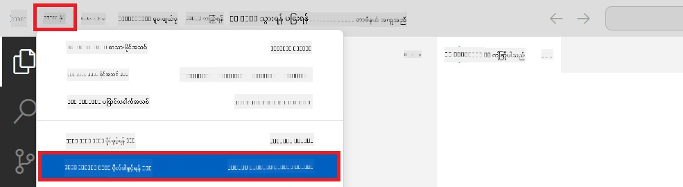

1. Visual Studio Code ၏ ဘယ်ဘက် panel တွင် Right-click လုပ်ပြီး **New File** ကို ရွေး ပြီး *download_dataset.py* အမည်ရှိ ဖိုင်အသစ်တစ်ခု ဖန်တီးပါ။

1. ဘယ်ဘက် panel တွင် Right-click လုပ်ပြီး **New File** ကို ရွေးပြီး *setup_ml.py* အမည်ရှိ ဖိုင်အသစ်တစ်ခု ဖန်တီးပါ။

1. ဘယ်ဘက် panel တွင် Right-click လုပ်ပြီး **New File** ကို ရွေးပြီး *deploy_model.py* အမည်ရှိ ဖိုင်အသစ်တစ်ခု ဖန်တီးပါ။

    

1. ဘယ်ဘက် panel တွင် Right-click လုပ်ပြီး **New Folder** ကို ရွေးပြီး *finetuning_dir* အမည်ရှိ ဖိုလ်ဒါအသစ် တစ်ခု ဖန်တီးပါ။

1. *finetuning_dir* ဖိုလ်ဒါထဲတွင် *fine_tune.py* အမည်ရှိ ဖိုင်အသစ် တစ်ခု ဖန်တီးပါ။

#### *conda.yml* ဖိုင် ဖန်တီးပြီး ပြင်ဆင်ခြင်း

1. Visual Studio Code ၏ ဘယ်ဘက် panel တွင် Right-click လုပ်ပြီး **New File** ကို ရွေးပြီး *conda.yml* အမည်ရှိ ဖိုင်အသစ် တစ်ခု ဖန်တီးပါ။

1. Phi-3 မော်ဒယ်အတွက် ကောင်းမွန်စွာ သင်းတင်ပတ်ဝန်းကျင် ဆောက်လုပ်ရန် *conda.yml* ဖိုင်ထဲသို့ အောက်ပါ ကုဒ်များကိုထည့်ပါ။

    ```yml
    name: phi-3-training-env
    channels:
      - defaults
      - conda-forge
    dependencies:
      - python=3.10
      - pip
      - numpy<2.0
      - pip:
          - torch==2.4.0
          - torchvision==0.19.0
          - trl==0.8.6
          - transformers==4.41
          - datasets==2.21.0
          - azureml-core==1.57.0
          - azure-storage-blob==12.19.0
          - azure-ai-ml==1.16
          - azure-identity==1.17.1
          - accelerate==0.33.0
          - mlflow==2.15.1
          - azureml-mlflow==1.57.0
    ```


#### *config.py* ဖိုင် ဖန်တီးပြီး ပြင်ဆင်ခြင်း

1. Visual Studio Code ၏ ဘယ်ဘက် panel တွင် Right-click လုပ်ပြီး **New File** ကို ရွေးပြီး *config.py* အမည်ရှိ ဖိုင်အသစ် တစ်ခု ဖန်တီးပါ။

1. Azure အချက်အလက်များ ထည့်သွင်းရန် *config.py* ဖိုင်ထဲ သို့ အောက်ပါ ကုဒ်များကို ထည့်ပါ။

    ```python
    # Azure ဆက်တင်များ
    AZURE_SUBSCRIPTION_ID = "your_subscription_id"
    AZURE_RESOURCE_GROUP_NAME = "your_resource_group_name" # "TestGroup"

    # Azure မော်ဒယ်သင်ယူမှုဆက်တင်များ
    AZURE_ML_WORKSPACE_NAME = "your_workspace_name" # "finetunephi-workspace"

    # Azure စီမံအုပ်ချုပ်ထားသည့် မှတဆင့်အတည်ပြုမှတ်ပုံတင် ဆက်တင်များ
    AZURE_MANAGED_IDENTITY_CLIENT_ID = "your_azure_managed_identity_client_id"
    AZURE_MANAGED_IDENTITY_NAME = "your_azure_managed_identity_name" # "finetunephi-mangedidentity"
    AZURE_MANAGED_IDENTITY_RESOURCE_ID = f"/subscriptions/{AZURE_SUBSCRIPTION_ID}/resourceGroups/{AZURE_RESOURCE_GROUP_NAME}/providers/Microsoft.ManagedIdentity/userAssignedIdentities/{AZURE_MANAGED_IDENTITY_NAME}"

    # ဒေတာဖိုင်လမ်းကြောင်းများ
    TRAIN_DATA_PATH = "data/train_data.jsonl"
    TEST_DATA_PATH = "data/test_data.jsonl"

    # လိုက်လံပြုပြင်ထားသည့် မော်ဒယ်ဆက်တင်များ
    AZURE_MODEL_NAME = "your_fine_tuned_model_name" # "finetune-phi-model"
    AZURE_ENDPOINT_NAME = "your_fine_tuned_model_endpoint_name" # "finetune-phi-endpoint"
    AZURE_DEPLOYMENT_NAME = "your_fine_tuned_model_deployment_name" # "finetune-phi-deployment"

    AZURE_ML_API_KEY = "your_fine_tuned_model_api_key"
    AZURE_ML_ENDPOINT = "your_fine_tuned_model_endpoint_uri" # "https://{your-endpoint-name}.{your-region}.inference.ml.azure.com/score"
    ```


#### Azure ပတ်ဝန်းကျင် မဟာတန်းများ ထည့်သွင်းခြင်း

1. Azure Subscription ID ထည့်ရန် အောက်ပါအဆင့်များကို လုပ်ဆောင်ပါ:

    - ပေါ်တယ် မျက်နှာပြင် ထိပ်၌ရှိသည့် **ရှာဖွေမှု စာမျက်နှာ** တွင် *subscriptions* ကို ရိုက်ထည့်ပြီး ပေါ်လာသော ရွေးချယ်စရာများမှ **Subscriptions** ကို ရွေးပါ။
    - သင် အသုံးပြုနေသော Azure Subscription ကို ရွေးပါ။
    - သင့် Subscription ID ကို ကူးယူပြီး *config.py* ဖိုင်ထဲသို့ ကူးထည့်ပါ။

    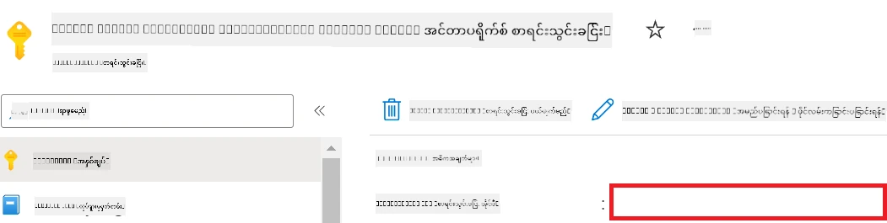

1. Azure Workspace Name ထည့်ရန် အောက်ပါအဆင့်များကို လုပ်ဆောင်ပါ:

    - သင် ဖန်တီးထားသော Azure Machine Learning resource သို့ သွားပါ။
    - သင့်အကောင့်အမည်ကို ကူးယူပြီး *config.py* ဖိုင်ထဲထည့်ပါ။

    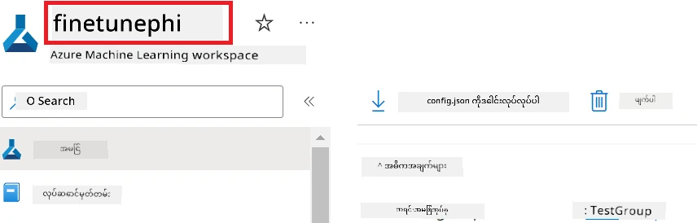

1. Azure Resource Group Name ထည့်ရန် အောက်ပါအဆင့်များကို လုပ်ဆောင်ပါ:

    - သင် ဖန်တီးထားသော Azure Machine Learning resource သို့ သွားပါ။
    - သင့် Azure Resource Group Name ကို ကူးယူပြီး *config.py* ဖိုင် ထဲသို့ ထည့်ပါ။

    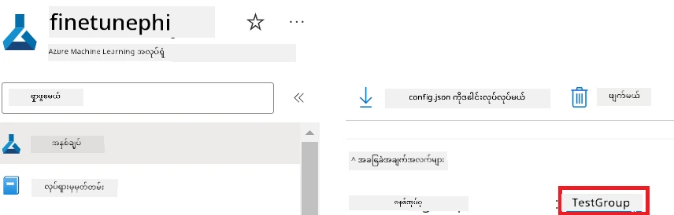

2. Azure Managed Identity name ထည့်ရန် အောက်ပါ အဆင့်များကို လုပ်ဆောင်ပါ

    - သင် ဖန်တီးထားသော Managed Identities resource သို့ သွားပါ။
    - သင့် Azure Managed Identity name ကို ကူးယူပြီး *config.py* ဖိုင် ထဲသို့ထည့်ပါ။

    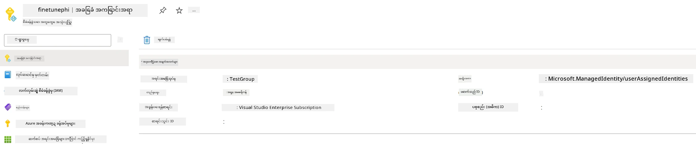

### ကောင်းမွန်စွာ သင်းတင်ရန် ဒေတာစနစ် ပြင်ဆင်ခြင်း

ဒီလေ့ကျင့်ခန်းမှာ *download_dataset.py* ဖိုင်ကို ပြေးသွားပြီး *ULTRACHAT_200k* ဒေတာစုစည်းမှုများကို ဒေသခံ ပတ်ဝန်းကျင်တွင် ဒေါင်းလုပ်လုပ်ပါမယ်။ ထို့နောက် ဒီဒေတာစနစ်ကိုသုံးပြီး Phi-3 မော်ဒယ်ကို Azure Machine Learning မှာ ကောင်းမွန်စွာ သင်းတင်ပါမယ်။

#### *download_dataset.py* ဖြင့် သင့်ဒေတာစနစ် ဒေါင်းလုပ်လုပ်ခြင်း

1. Visual Studio Code မှာ *download_dataset.py* ဖိုင်ကိုဖွင့်ပါ။

1. *download_dataset.py* ဖိုင်ထဲသို့ အောက်ပါကုဒ်များကို ထည့်ပါ။

    ```python
    import json
    import os
    from datasets import load_dataset
    from config import (
        TRAIN_DATA_PATH,
        TEST_DATA_PATH)

    def load_and_split_dataset(dataset_name, config_name, split_ratio):
        """
        Load and split a dataset.
        """
        # သတ်မှတ်ထားသော နာမည်၊ ဖွဲ့စည်းမှု၊ နှင့် ဖြတ်တောက်မှုအချိုးဖြင့် ဒေတာစုစည်းမှုကို ဖတ်ယူပါ
        dataset = load_dataset(dataset_name, config_name, split=split_ratio)
        print(f"Original dataset size: {len(dataset)}")
        
        # ဒေတာစုစည်းမှုကို လေ့လာရေးနှင့် စမ်းသပ်ရေး အစုအဖွဲ့များအဖြစ် (လေ့လာရေး ၈၀%, စမ်းသပ်ရေး ၂၀%) ဖြတ်တောက်ပါ
        split_dataset = dataset.train_test_split(test_size=0.2)
        print(f"Train dataset size: {len(split_dataset['train'])}")
        print(f"Test dataset size: {len(split_dataset['test'])}")
        
        return split_dataset

    def save_dataset_to_jsonl(dataset, filepath):
        """
        Save a dataset to a JSONL file.
        """
        # ဖိုလ်ဒါမရှိပါက ဖိုလ်ဒါကို ဖန်တီးပါ
        os.makedirs(os.path.dirname(filepath), exist_ok=True)
        
        # ဖိုင်ကို ရေးသည့်ပုံစံဖြင့် ဖွင့်ပါ
        with open(filepath, 'w', encoding='utf-8') as f:
            # ဒေတာစုစည်းမှုရှိသော တစ်တန်းစီကို လှုပ်ရှားပါ
            for record in dataset:
                # တစ်တန်းစီကို JSON အဖြစ် အချိတ်ထားပြီး ဖိုင်တွင် ရေးသားလိုက်ပါ
                json.dump(record, f)
                # တစ်တန်းစီအား ခြားနားစေရန် နှစ်ကောင်စာလုံးကို ရေးပါ
                f.write('\n')
        
        print(f"Dataset saved to {filepath}")

    def main():
        """
        Main function to load, split, and save the dataset.
        """
        # သတ်မှတ်ထားသော ဖွဲ့စည်းမှုနှင့် ဖြတ်တောက်မှုအချိုးဖြင့် ULTRACHAT_200k ဒေတာစုစည်းမှုကို ဖတ်ယူ၍ ဖြတ်တောက်ပါ
        dataset = load_and_split_dataset("HuggingFaceH4/ultrachat_200k", 'default', 'train_sft[:1%]')
        
        # ဖြတ်တောက်မှုမှ လေ့လာရေးနှင့် စမ်းသပ်ရေး ဒေတာစုစည်းမှုများကို ထုတ်ယူပါ
        train_dataset = dataset['train']
        test_dataset = dataset['test']

        # လေ့လာရေး ဒေတာစုစည်းမှုကို JSONL ဖိုင်တစ်ခုသို့ သိမ်းဆည်းပါ
        save_dataset_to_jsonl(train_dataset, TRAIN_DATA_PATH)
        
        # စမ်းသပ်ရေး ဒေတာစုစည်းမှုကို မတူညီသော JSONL ဖိုင်တစ်ခုသို့ သိမ်းဆည်းပါ
        save_dataset_to_jsonl(test_dataset, TEST_DATA_PATH)

    if __name__ == "__main__":
        main()

    ```


> [!TIP]
>
> **CPU အသုံးပြု၍ ဒေတာစနစ် သေးငယ်သမျှဖြင့် ကောင်းမွန်စွာ သင်းတင်ခြင်း လမ်းညွှန်**
>
> CPU သုံးယူ လိုသောအခါ၊ Visual Studio Enterprise Subscription ကဲ့သို့သော အကျိုးခံစားခွင့် subscription များရှိသူများသို့မဟုတ် သင်းတင်ခြင်းနှင့် ထုတ်ဝေမှု အသုံးပြုမှုကို မျက်နှာမူမြန်ဆန်စေချင်သူများအတွက် ဤနည်းလမ်း သင့်တော်သည်။
>
> `dataset = load_and_split_dataset("HuggingFaceH4/ultrachat_200k", 'default', 'train_sft[:1%]')` ကို `dataset = load_and_split_dataset("HuggingFaceH4/ultrachat_200k", 'default', 'train_sft[:10]')` ဖြင့် အစားထိုးပါ။
>

1. တာမီနယ်ထဲတွင် အောက်ပါ command ကို ရိုက်ထည့်ကာ စကရစ်ပ်ကို ပြေးပြီး ဒေတာစနစ်ကို ဒေသခံပတ်ဝန်းကျင်သို့ ဒေါင်းလုပ်လုပ်ပါ။

    ```console
    python download_data.py
    ```


1. ဒေတာစနစ်များသည် ဒေသခံ *finetune-phi/data* ဒါရိုက်တရီအတွင်းတွင် အောင်မြင်စွာ သိမ်းဆည်းထားကြောင်း စစ်ဆေးပါ။

> [!NOTE]
>
> **ဒေတာစနစ်အရွယ်အစားနှင့် ကောင်းမွန်စွာ သင်းတင်မှုအချိန်**
>
> ဒီ E2E နမူနာတွင်၊ ဒေတာစနစ်၏ 1% (`train_sft[:1%]`) ကိုသာ သုံးပါသည်။ ဒါက ဒေတာအရေအတွက်ကို ထိရောက်စွာ လျော့ပါးစေပြီး ဒေါင်းလုပ်ရယူခြင်းနှင့် သင်းတင်မှု လုပ်ငန်းစဉ်များကို မြန်ဆန်စေသည်။ သင် သင့်မတ်တပ်ရပ်နှင့် မော်ဒယ်စွမ်းဆောင်ရည်အကြား တိကျသော ဆက်ဆံမှုကို ရှာဖွေရန် ရာခိုင်နှုန်းကို ပြင်ဆင်နိုင်သည်။ ဒေတာစနစ်၏ သေးငယ်သည့် အပိုင်းအစ အသုံးပြုခြင်းက သင်းတင်မှုအချိန်ကို လျှော့ချပြီး E2E နမူနာအတွက် လုပ်ငန်းစဉ်ကို ပိုမိုကောင်းမွန်စေသည်။
>

## နမူနာအကြောင်းအရာ ၂ - Phi-3 မော်ဒယ်ကို ကောင်းမွန်စွာ သင်းတင်ခြင်းနှင့် Azure Machine Learning Studio မှာ ထုတ်ဝေခြင်း

### Azure CLI ကို စတင် သတ်မှတ်ခြင်း

သင့်ပတ်ဝန်းကျင်ကို ချိတ်ဆက်ရေးအတွက် Azure CLI ကို သတ်မှတ်ရန် လိုအပ်သည်။ Azure CLI က command line မှ Azure resource များကို တိုက်ရိုက် စီမံခန့်ခွဲပေးပြီး Azure Machine Learning အတွက် လိုအပ်သော လူကြိုက်များ ရရှိစေသည်။ စတင်ရန် [Azure CLI](https://learn.microsoft.com/cli/azure/install-azure-cli) ကို တပ်ဆင်ပါ။

1. တာမီနယ် ဝင်းဒိုးကို ဖွင့်ပြီး အောက်ပါ command ကို ရိုက်ထည့်ကာ သင့် Azure အကောင့်သို့ ဝင်ရောက်ပါ။

    ```console
    az login
    ```


1. သင်အသုံးပြုမည့် Azure အကောင့်ကို ရွေးပါ။

1. သင်အသုံးပြုမည့် Azure subscription ကို ရွေးပါ။

    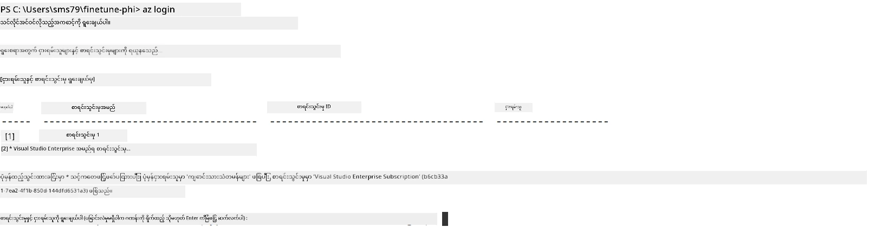

> [!TIP]
>
> Azure သို့ ဝင်ရန် ပြဿနာဖြစ်ပေါ်ပါက device code ကိုသုံး၍ ကြိုးစားပါ။ တာမီနယ် ဝင်းဒိုး ဖွင့်ပြီး အောက်ပါ command ဖြင့် Azure အကောင့်သို့ ဝင်ပါ။
>
> ```console
> az login --use-device-code
> ```
>

### Phi-3 မော်ဒယ်ကို ကောင်းမွန်စွာ သင်းတင်ခြင်း

ဒီလေ့ကျင့်ခန်းမှာ သင် ကြေညာထားသော ဒေတာစနစ်ကို အသုံးပြုကာ Phi-3 မော်ဒယ်ကို ကောင်းမွန်စွာ သင်းတင်ပါမယ်။ ပထမဆုံး *fine_tune.py* ဖိုင်တွင် သင်းတင်မှု အသေးစိတ်ကို သတ်မှတ်ပါမယ်။ ထို့နောက် Azure Machine Learning ပတ်ဝန်းကျင်ကို ပြင်ဆင်ပြီး *setup_ml.py* ဖိုင်ကို ပြေး၍ သင်းတင်မှုလုပ်ငန်းစဉ်ကို စတင်ပါမယ်။ ဒီ script သည် သင်းတင်မှုကို Azure Machine Learning ပတ်ဝန်းကျင်အတွင်း ပြုလုပ်ပါသည်။

*setup_ml.py* ကို ပြေးခြင်းအားဖြင့် သင်သည် Azure Machine Learning ပတ်ဝန်းကျင်တွင် သင်းတင်မှုလုပ်ငန်းစဉ်ကို စတင်ပြေးဆောင်ရွက်မှာ ဖြစ်သည်။

#### *fine_tune.py* ဖိုင်သို့ ကုဒ်ထည့်ခြင်း

1. *finetuning_dir* ဖိုလ်ဒါသို့ သွားပြီး Visual Studio Code မှာ *fine_tune.py* ဖိုင်ကို ဖွင့်ပါ။

1. *fine_tune.py* ဖိုင်ထဲသို့ အောက်ပါကုဒ်များကို ထည့်ပါ။

    ```python
    import argparse
    import sys
    import logging
    import os
    from datasets import load_dataset
    import torch
    import mlflow
    from transformers import AutoModelForCausalLM, AutoTokenizer, TrainingArguments
    from trl import SFTTrainer

    # MLflow မှာ INVALID_PARAMETER_VALUE အမှားကို ရှောင်ရှားဖို့အတွက် MLflow ပေါင်းစပ်မှုကို ပိတ်ထားပါ
    os.environ["DISABLE_MLFLOW_INTEGRATION"] = "True"

    # မှတ်တမ်းတင်ခြင်း စနစ်
    logging.basicConfig(
        format="%(asctime)s - %(levelname)s - %(name)s - %(message)s",
        datefmt="%Y-%m-%d %H:%M:%S",
        handlers=[logging.StreamHandler(sys.stdout)],
        level=logging.WARNING
    )
    logger = logging.getLogger(__name__)

    def initialize_model_and_tokenizer(model_name, model_kwargs):
        """
        Initialize the model and tokenizer with the given pretrained model name and arguments.
        """
        model = AutoModelForCausalLM.from_pretrained(model_name, **model_kwargs)
        tokenizer = AutoTokenizer.from_pretrained(model_name)
        tokenizer.model_max_length = 2048
        tokenizer.pad_token = tokenizer.unk_token
        tokenizer.pad_token_id = tokenizer.convert_tokens_to_ids(tokenizer.pad_token)
        tokenizer.padding_side = 'right'
        return model, tokenizer

    def apply_chat_template(example, tokenizer):
        """
        Apply a chat template to tokenize messages in the example.
        """
        messages = example["messages"]
        if messages[0]["role"] != "system":
            messages.insert(0, {"role": "system", "content": ""})
        example["text"] = tokenizer.apply_chat_template(
            messages, tokenize=False, add_generation_prompt=False
        )
        return example

    def load_and_preprocess_data(train_filepath, test_filepath, tokenizer):
        """
        Load and preprocess the dataset.
        """
        train_dataset = load_dataset('json', data_files=train_filepath, split='train')
        test_dataset = load_dataset('json', data_files=test_filepath, split='train')
        column_names = list(train_dataset.features)

        train_dataset = train_dataset.map(
            apply_chat_template,
            fn_kwargs={"tokenizer": tokenizer},
            num_proc=10,
            remove_columns=column_names,
            desc="Applying chat template to train dataset",
        )

        test_dataset = test_dataset.map(
            apply_chat_template,
            fn_kwargs={"tokenizer": tokenizer},
            num_proc=10,
            remove_columns=column_names,
            desc="Applying chat template to test dataset",
        )

        return train_dataset, test_dataset

    def train_and_evaluate_model(train_dataset, test_dataset, model, tokenizer, output_dir):
        """
        Train and evaluate the model.
        """
        training_args = TrainingArguments(
            bf16=True,
            do_eval=True,
            output_dir=output_dir,
            eval_strategy="epoch",
            learning_rate=5.0e-06,
            logging_steps=20,
            lr_scheduler_type="cosine",
            num_train_epochs=3,
            overwrite_output_dir=True,
            per_device_eval_batch_size=4,
            per_device_train_batch_size=4,
            remove_unused_columns=True,
            save_steps=500,
            seed=0,
            gradient_checkpointing=True,
            gradient_accumulation_steps=1,
            warmup_ratio=0.2,
        )

        trainer = SFTTrainer(
            model=model,
            args=training_args,
            train_dataset=train_dataset,
            eval_dataset=test_dataset,
            max_seq_length=2048,
            dataset_text_field="text",
            tokenizer=tokenizer,
            packing=True
        )

        train_result = trainer.train()
        trainer.log_metrics("train", train_result.metrics)

        mlflow.transformers.log_model(
            transformers_model={"model": trainer.model, "tokenizer": tokenizer},
            artifact_path=output_dir,
        )

        tokenizer.padding_side = 'left'
        eval_metrics = trainer.evaluate()
        eval_metrics["eval_samples"] = len(test_dataset)
        trainer.log_metrics("eval", eval_metrics)

    def main(train_file, eval_file, model_output_dir):
        """
        Main function to fine-tune the model.
        """
        model_kwargs = {
            "use_cache": False,
            "trust_remote_code": True,
            "torch_dtype": torch.bfloat16,
            "device_map": None,
            "attn_implementation": "eager"
        }

        # pretrained_model_name = "microsoft/Phi-3-mini-4k-instruct"
        pretrained_model_name = "microsoft/Phi-3.5-mini-instruct"

        with mlflow.start_run():
            model, tokenizer = initialize_model_and_tokenizer(pretrained_model_name, model_kwargs)
            train_dataset, test_dataset = load_and_preprocess_data(train_file, eval_file, tokenizer)
            train_and_evaluate_model(train_dataset, test_dataset, model, tokenizer, model_output_dir)

    if __name__ == "__main__":
        parser = argparse.ArgumentParser()
        parser.add_argument("--train-file", type=str, required=True, help="Path to the training data")
        parser.add_argument("--eval-file", type=str, required=True, help="Path to the evaluation data")
        parser.add_argument("--model_output_dir", type=str, required=True, help="Directory to save the fine-tuned model")
        args = parser.parse_args()
        main(args.train_file, args.eval_file, args.model_output_dir)

    ```


1. *fine_tune.py* ဖိုင်ကို သိမ်းပြီး ပိတ်ပါ။

> [!TIP]
> **Phi-3.5 မော်ဒယ်ကိုလည်း သင်းတင်နိုင်ပါတယ်**
>
> *fine_tune.py* ဖိုင်ထဲမှာ `pretrained_model_name` ကို `"microsoft/Phi-3-mini-4k-instruct"` မှ `"microsoft/Phi-3.5-mini-instruct"` သို့ ပြောင်းလဲနိုင်ပါတယ်။ ဒါဆိုရင် Phi-3.5-mini-instruct မော်ဒယ်ဖြင့် သင်းတင်မှု လုပ်သွားမှာ ဖြစ်ပါတယ်။ သင်စိတ်ဝင်စားသော မော်ဒယ်နာမည်ကို ရှာဖွေရန် [Hugging Face](https://huggingface.co/) သို့ သွားကြည့်ရှုကာ အကြိုက်ဆုံး မော်ဒယ်နာမည်ကို `pretrained_model_name` မှာ ကူးထည့်နိုင်ပါသည်။
>
> <image type="content" src="../../../../imgs/02/FineTuning-PromptFlow/finetunephi3.5.png" alt-text="Fine tune Phi-3.5.">
>

#### *setup_ml.py* ဖိုင်ထဲက ကုဒ် ထည့်ခြင်း

1. Visual Studio Code မှာ *setup_ml.py* ဖိုင်ကို ဖွင့်ပါ။

1. *setup_ml.py* ဖိုင်ထဲသို့ အောက်ပါကုဒ်များကို ထည့်ပါ။

    ```python
    import logging
    from azure.ai.ml import MLClient, command, Input
    from azure.ai.ml.entities import Environment, AmlCompute
    from azure.identity import AzureCliCredential
    from config import (
        AZURE_SUBSCRIPTION_ID,
        AZURE_RESOURCE_GROUP_NAME,
        AZURE_ML_WORKSPACE_NAME,
        TRAIN_DATA_PATH,
        TEST_DATA_PATH
    )

    # သတ်မှတ်ချက်များ

    # ပညာသင်ကြားမှုအတွက် CPU instance အသုံးပြုရန် အောက်ပါလိုင်းများကို uncomment ပါ
    # COMPUTE_INSTANCE_TYPE = "Standard_E16s_v3" # cpu
    # COMPUTE_NAME = "cpu-e16s-v3"
    # DOCKER_IMAGE_NAME = "mcr.microsoft.com/azureml/openmpi4.1.0-ubuntu20.04:latest"

    # ပညာသင်ကြားမှုအတွက် GPU instance အသုံးပြုရန် အောက်ပါလိုင်းများကို uncomment ပါ
    COMPUTE_INSTANCE_TYPE = "Standard_NC24ads_A100_v4"
    COMPUTE_NAME = "gpu-nc24s-a100-v4"
    DOCKER_IMAGE_NAME = "mcr.microsoft.com/azureml/curated/acft-hf-nlp-gpu:59"

    CONDA_FILE = "conda.yml"
    LOCATION = "eastus2" # သင့် compute cluster ရဲ့တည်နေရာကို ပြောင်းပါ
    FINETUNING_DIR = "./finetuning_dir" # ပညာသင်ကြားမှု script ရဲ့လမ်းကြောင်း
    TRAINING_ENV_NAME = "phi-3-training-environment" # ပညာသင်ကြားမှုပတ်ဝန်းကျင်နာမည်
    MODEL_OUTPUT_DIR = "./model_output" # azure ml မှာ မော်ဒယ် ထွက်လာမည့် ဖိုင်လမ်းကြောင်း

    # လုပ်ငန်းစဉ်ကို မှတ်တမ်းတင်ခြင်း စနစ်
    logger = logging.getLogger(__name__)
    logging.basicConfig(
        format="%(asctime)s - %(levelname)s - %(name)s - %(message)s",
        datefmt="%Y-%m-%d %H:%M:%S",
        level=logging.WARNING
    )

    def get_ml_client():
        """
        Initialize the ML Client using Azure CLI credentials.
        """
        credential = AzureCliCredential()
        return MLClient(credential, AZURE_SUBSCRIPTION_ID, AZURE_RESOURCE_GROUP_NAME, AZURE_ML_WORKSPACE_NAME)

    def create_or_get_environment(ml_client):
        """
        Create or update the training environment in Azure ML.
        """
        env = Environment(
            image=DOCKER_IMAGE_NAME,  # ပတ်ဝန်းကျင်အတွက် Docker image
            conda_file=CONDA_FILE,  # Conda ပတ်ဝန်းကျင် ဖိုင်
            name=TRAINING_ENV_NAME,  # ပတ်ဝန်းကျင်နာမည်
        )
        return ml_client.environments.create_or_update(env)

    def create_or_get_compute_cluster(ml_client, compute_name, COMPUTE_INSTANCE_TYPE, location):
        """
        Create or update the compute cluster in Azure ML.
        """
        try:
            compute_cluster = ml_client.compute.get(compute_name)
            logger.info(f"Compute cluster '{compute_name}' already exists. Reusing it for the current run.")
        except Exception:
            logger.info(f"Compute cluster '{compute_name}' does not exist. Creating a new one with size {COMPUTE_INSTANCE_TYPE}.")
            compute_cluster = AmlCompute(
                name=compute_name,
                size=COMPUTE_INSTANCE_TYPE,
                location=location,
                tier="Dedicated",  # compute cluster အဆင့်
                min_instances=0,  # အနည်းဆုံး instance အရေအတွက်
                max_instances=1  # အများဆုံး instance အရေအတွက်
            )
            ml_client.compute.begin_create_or_update(compute_cluster).wait()  # cluster ဖန်တီးခြင်း ပြီးရန် စောင့်ရန်
        return compute_cluster

    def create_fine_tuning_job(env, compute_name):
        """
        Set up the fine-tuning job in Azure ML.
        """
        return command(
            code=FINETUNING_DIR,  # fine_tune.py ဖိုင်လမ်းကြောင်း
            command=(
                "python fine_tune.py "
                "--train-file ${{inputs.train_file}} "
                "--eval-file ${{inputs.eval_file}} "
                "--model_output_dir ${{inputs.model_output}}"
            ),
            environment=env,  # ပညာသင်ကြားမှု ပတ်ဝန်းကျင်
            compute=compute_name,  # အသုံးပြုမည့် compute cluster
            inputs={
                "train_file": Input(type="uri_file", path=TRAIN_DATA_PATH),  # ပညာသင်ကြားမှု ဒေတာဖိုင် လမ်းကြောင်း
                "eval_file": Input(type="uri_file", path=TEST_DATA_PATH),  # အကဲဖြတ်မှု ဒေတာဖိုင် လမ်းကြောင်း
                "model_output": MODEL_OUTPUT_DIR
            }
        )

    def main():
        """
        Main function to set up and run the fine-tuning job in Azure ML.
        """
        # ML Client ကို စတင်ပြင်ဆင်ခြင်း
        ml_client = get_ml_client()

        # ပတ်ဝန်းကျင် ဖန်တီးခြင်း
        env = create_or_get_environment(ml_client)
        
        # ရှိပြီးသား compute cluster ဖန်တီးခြင်း သို့မဟုတ် ရယူခြင်း
        create_or_get_compute_cluster(ml_client, COMPUTE_NAME, COMPUTE_INSTANCE_TYPE, LOCATION)

        # Fine-Tuning အလုပ် ဖန်တီးပြီး တင်ပြခြင်း
        job = create_fine_tuning_job(env, COMPUTE_NAME)
        returned_job = ml_client.jobs.create_or_update(job)  # အလုပ်ကို တင်ပြပါ
        ml_client.jobs.stream(returned_job.name)  # အလုပ် लॉギများကို ဖလှယ်ပြီး ကြည့်ရှုပါ
        
        # အလုပ်နာမည်ကို ဖမ်းယူပါ
        job_name = returned_job.name
        print(f"Job name: {job_name}")

    if __name__ == "__main__":
        main()

    ```


1. `COMPUTE_INSTANCE_TYPE`, `COMPUTE_NAME` နှင့် `LOCATION` ကို သင့်အချက်အလက်အတိုင်း ပြောင်းလဲပေးပါ။

    ```python
   # ဖောင်းထုတ်ပြီး GPU အင်စတင့်အသုံးပြုရန် လေ့ကျင့်မှုအတွက် အောက်ပါလိုင်းများကို ဖွင့်ပါ
    COMPUTE_INSTANCE_TYPE = "Standard_NC24ads_A100_v4"
    COMPUTE_NAME = "gpu-nc24s-a100-v4"
    ...
    LOCATION = "eastus2" # သင့်ကွန်ပျူတာ ကလပ်စတာတည်နေရာဖြင့် အစားထိုးပါ
    ```


> [!TIP]
>
> **CPU သုံးပြီး ဒေတာစနစ် သေးငယ်သမျှ ဖြင့် ကောင်းမွန်စွာ သင်းတင်ခြင်း လမ်းညွှန်**
>
> CPU သုံးပြီး သင်းတင်ဖို့လိုတဲ့သူများအတွက် ဤနည်းလမ်း သင့်တော်သည်။ Visual Studio Enterprise Subscription ကဲ့သို့ အကျိုးခံစားခွင့် subscription များရှိသူများ သို့မဟုတ် သင်းတင်ခြင်းနှင့် ထုတ်ဝေမှု လုပ်ငန်းစဉ်ကို စမ်းသပ်ရန် အဆင်ပြေသည်။
>
> 1. *setup_ml* ဖိုင်ကို ဖွင့်ပါ။
> 1. `COMPUTE_INSTANCE_TYPE`, `COMPUTE_NAME` နှင့် `DOCKER_IMAGE_NAME` ကို အောက်ပါအတိုင်း ပြောင်းပါ။ *Standard_E16s_v3* သုံးခွင့်မရှိပါက CPU အခြေပြု instance တစ်ခုသို့ အစားထိုး သို့မဟုတ် quota အသစ် တောင်းဆိုနိုင်ပါသည်။
> 1. `LOCATION` ကို သင့်အချက်အလက်အတိုင်း ပြောင်းပါ။
>
>    ```python
>    # Uncomment the following lines to use a CPU instance for training
>    COMPUTE_INSTANCE_TYPE = "Standard_E16s_v3" # cpu
>    COMPUTE_NAME = "cpu-e16s-v3"
>    DOCKER_IMAGE_NAME = "mcr.microsoft.com/azureml/openmpi4.1.0-ubuntu20.04:latest"
>    LOCATION = "eastus2" # Replace with the location of your compute cluster
>    ```
>

1. *setup_ml.py* စကရစ်ပ်ကို ပြေးရန်အတွက် အောက်ပါ command ကို ရိုက်ထည့်ပါ။

    ```python
    python setup_ml.py
    ```


1. ဒီ လေ့ကျင့်ခန်းမှာ သင်သည် Azure Machine Learning အသုံးပြုကာ Phi-3 မော်ဒယ်ကို ကောင်းမွန်စွာ သင်းတင်နိုင်ခဲ့ပါသည်။ *setup_ml.py* ဖိုင်ကို ပြေးခြင်းအားဖြင့် သင်သည် Azure Machine Learning ပတ်ဝန်းကျင်ကို စတင်ပြင်ဆင်ပြီး *fine_tune.py* ဖိုင်တွင် သတ်မှတ်ထားသော သင်းတင်မှု လုပ်ငန်းစဉ်ကို စတင်မောင်းနှင်ခဲ့ပါသည်။ သင်းတင်မှုလုပ်ငန်းစဉ်မှာ အချိန်များကြာနိုင်ပါသည်ကို မှတ်သားပါ။ `python setup_ml.py` ကို Run ပြီးလျှင် လုပ်ငန်းစဉ်ပြီးမြောက်ရန် မျှော်လင့်ရန်လိုပြီး၊ ထိုအချိန်အတွင်း Azure Machine Learning ပေါ်တွင် သင်းတင်မှုလုပ်ငန်း၏ အခြေအနေကို သုံးလုံးထက်သာ Terminal တွင် ပေးထားသော link မှတဆင့် ကြည့်ရှုနိုင်ပါသည်။

    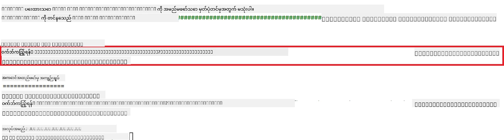

### ကောင်းမွန်စွာ သင်းတင်ပြီး မော်ဒယ် ထုတ်ဝေခြင်း

Phi-3 မော်ဒယ်ကို Prompt Flow နှင့် ပေါင်းစပ်စေနိုင်ရန်၊ သင်းတင်ပြီး မော်ဒယ်ကို တိုက်ရိုက် အသုံးပြုနိုင်ရန် ပြင်ဆင်ပြီး ထုတ်ဝေရန် လိုအပ်ပါသည်။ ၎င်းအား မော်ဒယ်ကို မှတ်ပုံတင်ခြင်း၊ online endpoint ဖန်တီးခြင်းနှင့် deployment လုပ်ခြင်းများ ကုဒ်များအလိုက် ဆောင်ရွက်ပါမည်။

#### မော်ဒယ်နာမည်၊ endpoint နာမည်နှင့် deployment နာမည် သတ်မှတ်ခြင်း

1. *config.py* ဖိုင်ကို ဖွင့်ပါ။

1. `AZURE_MODEL_NAME = "your_fine_tuned_model_name"` ကို သင့်မော်ဒယ်အတွက် ဆန္ဒရှိသော နာမည်ဖြင့် အစားထိုးပါ။

1. `AZURE_ENDPOINT_NAME = "your_fine_tuned_model_endpoint_name"` ကို သင့် endpoint အတွက် ဆန္ဒရှိသော နာမည်ဖြင့် အစားထိုးပါ။

1. `AZURE_DEPLOYMENT_NAME = "your_fine_tuned_model_deployment_name"` ကို သင့် deployment အတွက် ဆန္ဒရှိသော နာမည်ဖြင့် အစားထိုးပါ။

#### *deploy_model.py* ဖိုင်ထဲ သို့ ကုဒ် ထည့်ခြင်း

*deploy_model.py* ဖိုင်ကို ပြေးခြင်းဖြင့် deployment လုပ်ငန်းစဉ်များ အလိုအလျောက် ပြီးစီးမည် ဖြစ်သည်။ ၎င်းက မော်ဒယ်မှတ်ပုံတင်ခြင်း၊ endpoint ဖန်တီးခြင်းများ၊ သတ်မှတ်ထားသော config.py ဖိုင်ထဲ ပြည့်စုံသော မော်ဒယ်နာမည်, endpoint နာမည်နှင့် deployment နာမည် အရ deployment ကို ဆောင်ရွက်ပေးပါမည်။

1. Visual Studio Code မှာ *deploy_model.py* ဖိုင်ကို ဖွင့်ပါ။

1. *deploy_model.py* ဖိုက်ထဲသို့ အောက်ပါကုဒ်များကို ထည့်ပါ။

    ```python
    import logging
    from azure.identity import AzureCliCredential
    from azure.ai.ml import MLClient
    from azure.ai.ml.entities import Model, ProbeSettings, ManagedOnlineEndpoint, ManagedOnlineDeployment, IdentityConfiguration, ManagedIdentityConfiguration, OnlineRequestSettings
    from azure.ai.ml.constants import AssetTypes

    # ပြုပြင်မှုတင်သွင်းခြင်းများ
    from config import (
        AZURE_SUBSCRIPTION_ID,
        AZURE_RESOURCE_GROUP_NAME,
        AZURE_ML_WORKSPACE_NAME,
        AZURE_MANAGED_IDENTITY_RESOURCE_ID,
        AZURE_MANAGED_IDENTITY_CLIENT_ID,
        AZURE_MODEL_NAME,
        AZURE_ENDPOINT_NAME,
        AZURE_DEPLOYMENT_NAME
    )

    # အမြဲတမ်းတန်ဖိုးများ
    JOB_NAME = "your-job-name"
    COMPUTE_INSTANCE_TYPE = "Standard_E4s_v3"

    deployment_env_vars = {
        "SUBSCRIPTION_ID": AZURE_SUBSCRIPTION_ID,
        "RESOURCE_GROUP_NAME": AZURE_RESOURCE_GROUP_NAME,
        "UAI_CLIENT_ID": AZURE_MANAGED_IDENTITY_CLIENT_ID,
    }

    # မှတ်တမ်းတင်ခြင်း ပြင်ဆင်မှု
    logging.basicConfig(
        format="%(asctime)s - %(levelname)s - %(name)s - %(message)s",
        datefmt="%Y-%m-%d %H:%M:%S",
        level=logging.DEBUG
    )
    logger = logging.getLogger(__name__)

    def get_ml_client():
        """Initialize and return the ML Client."""
        credential = AzureCliCredential()
        return MLClient(credential, AZURE_SUBSCRIPTION_ID, AZURE_RESOURCE_GROUP_NAME, AZURE_ML_WORKSPACE_NAME)

    def register_model(ml_client, model_name, job_name):
        """Register a new model."""
        model_path = f"azureml://jobs/{job_name}/outputs/artifacts/paths/model_output"
        logger.info(f"Registering model {model_name} from job {job_name} at path {model_path}.")
        run_model = Model(
            path=model_path,
            name=model_name,
            description="Model created from run.",
            type=AssetTypes.MLFLOW_MODEL,
        )
        model = ml_client.models.create_or_update(run_model)
        logger.info(f"Registered model ID: {model.id}")
        return model

    def delete_existing_endpoint(ml_client, endpoint_name):
        """Delete existing endpoint if it exists."""
        try:
            endpoint_result = ml_client.online_endpoints.get(name=endpoint_name)
            logger.info(f"Deleting existing endpoint {endpoint_name}.")
            ml_client.online_endpoints.begin_delete(name=endpoint_name).result()
            logger.info(f"Deleted existing endpoint {endpoint_name}.")
        except Exception as e:
            logger.info(f"No existing endpoint {endpoint_name} found to delete: {e}")

    def create_or_update_endpoint(ml_client, endpoint_name, description=""):
        """Create or update an endpoint."""
        delete_existing_endpoint(ml_client, endpoint_name)
        logger.info(f"Creating new endpoint {endpoint_name}.")
        endpoint = ManagedOnlineEndpoint(
            name=endpoint_name,
            description=description,
            identity=IdentityConfiguration(
                type="user_assigned",
                user_assigned_identities=[ManagedIdentityConfiguration(resource_id=AZURE_MANAGED_IDENTITY_RESOURCE_ID)]
            )
        )
        endpoint_result = ml_client.online_endpoints.begin_create_or_update(endpoint).result()
        logger.info(f"Created new endpoint {endpoint_name}.")
        return endpoint_result

    def create_or_update_deployment(ml_client, endpoint_name, deployment_name, model):
        """Create or update a deployment."""

        logger.info(f"Creating deployment {deployment_name} for endpoint {endpoint_name}.")
        deployment = ManagedOnlineDeployment(
            name=deployment_name,
            endpoint_name=endpoint_name,
            model=model.id,
            instance_type=COMPUTE_INSTANCE_TYPE,
            instance_count=1,
            environment_variables=deployment_env_vars,
            request_settings=OnlineRequestSettings(
                max_concurrent_requests_per_instance=3,
                request_timeout_ms=180000,
                max_queue_wait_ms=120000
            ),
            liveness_probe=ProbeSettings(
                failure_threshold=30,
                success_threshold=1,
                period=100,
                initial_delay=500,
            ),
            readiness_probe=ProbeSettings(
                failure_threshold=30,
                success_threshold=1,
                period=100,
                initial_delay=500,
            ),
        )
        deployment_result = ml_client.online_deployments.begin_create_or_update(deployment).result()
        logger.info(f"Created deployment {deployment.name} for endpoint {endpoint_name}.")
        return deployment_result

    def set_traffic_to_deployment(ml_client, endpoint_name, deployment_name):
        """Set traffic to the specified deployment."""
        try:
            # လက်ရှိ endpoint အသေးစိတ်ကို ရယူပါ
            endpoint = ml_client.online_endpoints.get(name=endpoint_name)
            
            # ဖွဲ့စည်းမှုကို စစ်ဆေးရန် လက်ရှိလမ်းကြောင်းခွဲဝေပမာဏကို မှတ်တမ်းတင်ပါ
            logger.info(f"Current traffic allocation: {endpoint.traffic}")
            
            # တင်သွင်းမှုအတွက် လမ်းကြောင်းခွဲဝေပမာဏကို သတ်မှတ်ပါ
            endpoint.traffic = {deployment_name: 100}
            
            # လမ်းကြောင်းခွဲဝေပမာဏအသစ်ဖြင့် endpoint ကို update ပြုလုပ်ပါ
            endpoint_poller = ml_client.online_endpoints.begin_create_or_update(endpoint)
            updated_endpoint = endpoint_poller.result()
            
            # ဖွဲ့စည်းမှုကို စစ်ဆေးရန် ပွင့်လင်းထားသော လမ်းကြောင်းခွဲဝေပမာဏကို မှတ်တမ်းတင်ပါ
            logger.info(f"Updated traffic allocation: {updated_endpoint.traffic}")
            logger.info(f"Set traffic to deployment {deployment_name} at endpoint {endpoint_name}.")
            return updated_endpoint
        except Exception as e:
            # လုပ်ငန်းစဉ်အတွင်း ဖြစ်ပေါ်သည့် အမှားများကို မှတ်တမ်းတင်ပါ
            logger.error(f"Failed to set traffic to deployment: {e}")
            raise


    def main():
        ml_client = get_ml_client()

        registered_model = register_model(ml_client, AZURE_MODEL_NAME, JOB_NAME)
        logger.info(f"Registered model ID: {registered_model.id}")

        endpoint = create_or_update_endpoint(ml_client, AZURE_ENDPOINT_NAME, "Endpoint for finetuned Phi-3 model")
        logger.info(f"Endpoint {AZURE_ENDPOINT_NAME} is ready.")

        try:
            deployment = create_or_update_deployment(ml_client, AZURE_ENDPOINT_NAME, AZURE_DEPLOYMENT_NAME, registered_model)
            logger.info(f"Deployment {AZURE_DEPLOYMENT_NAME} is created for endpoint {AZURE_ENDPOINT_NAME}.")

            set_traffic_to_deployment(ml_client, AZURE_ENDPOINT_NAME, AZURE_DEPLOYMENT_NAME)
            logger.info(f"Traffic is set to deployment {AZURE_DEPLOYMENT_NAME} at endpoint {AZURE_ENDPOINT_NAME}.")
        except Exception as e:
            logger.error(f"Failed to create or update deployment: {e}")

    if __name__ == "__main__":
        main()

    ```


1. `JOB_NAME` ရယူရန် အောက်ပါ အဆင့်များကို လုပ်ဆောင်ပါ။

    - သင် ဖန်တီးထားသော Azure Machine Learning resource သို့ သွားပါ။
    - **Studio web URL** ကို ရွေးပြီး Azure Machine Learning workspace ကို ဖွင့်ပါ။
    - ဘယ်ဘက် tab မှ **Jobs** ကို ရွေးပါ။
    - သင်းတင်မှု အတွက် စမ်းသပ်မှု (experiment) ကို ရွေးပါ၊ ဥပမာ *finetunephi*။
    - သင်ဖန်တီးထားသော job ကို ရွေးပါ။
- သင့်အလုပ်အမည်ကို *deploy_model.py* ဖိုင်ရှိ `JOB_NAME = "your-job-name"` ထဲမှာ ကူးယူကပ်ထည့်ပါ။

1. သင့်ရဲ့အသေးစိတ်အချက်အလက်ဖြင့် `COMPUTE_INSTANCE_TYPE` ကို အစားထိုးပါ။

1. *deploy_model.py* script ကို run ချင်တာအတွက်အောက်ပါ command ကိုရိုက်ထည့်ပြီး Azure Machine Learning မှာ deployment လုပ်ငန်းစဉ်ကို စတင်ပါ။

    ```python
    python deploy_model.py
    ```

> [!WARNING]
> သင့်အကောင့်ကို အပိုကြေးပေးရခြင်းမဖြစ်စေဖို့အတွက် Azure Machine Learning workspace မှာ ဖန်တီးထားတဲ့ endpoint ကို ဖျက်ပစ်ရန် သေချာစေပါ။
>

#### Azure Machine Learning Workspace မှာ deployment အခြေအနေ စစ်ဆေးပါ

1. [Azure ML Studio](https://ml.azure.com/home?wt.mc_id=studentamb_279723) ကို သွားပါ။

1. သင့်ဖန်တီးခဲ့တဲ့ Azure Machine Learning workspace ကို သွားပါ။

1. Azure Machine Learning workspace ကိုဖွင့်ရန် **Studio web URL** ကို ရွေးချယ်ပါ။

1. ဘယ်ဘက် tab မှ **Endpoints** ကို ရွေးပါ။

    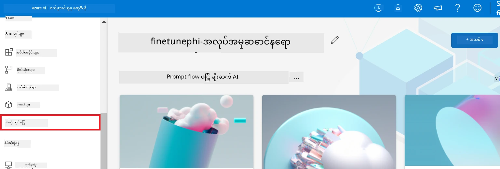

2. သင့်ဖန်တီးထားတဲ့ endpoint ကို ရွေးပါ။

    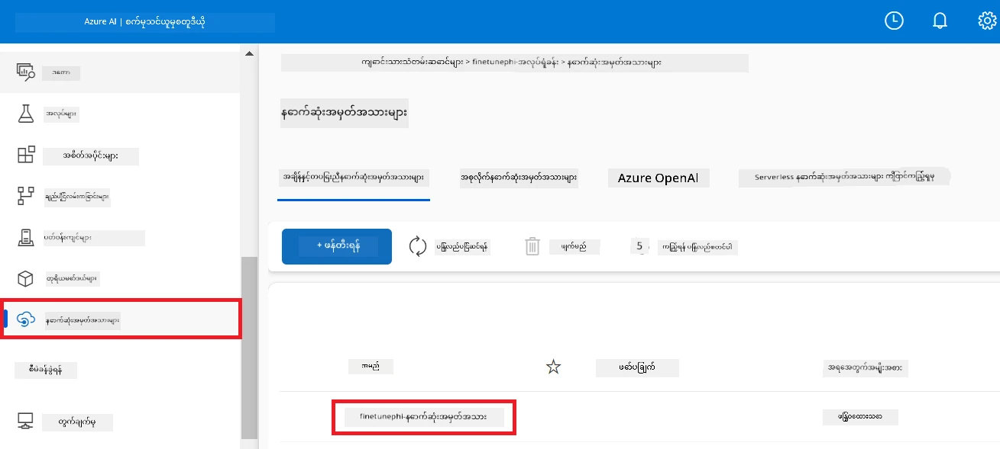

3. ဒီစာမျက်နှာမှာ deployment လုပ်ငန်းစဉ်အတွင်း ဖန်တီးထားသော endpoints များကို စီမံနိုင်သည်။

## စခenario 3: Prompt flow နှင့် ပေါင်းစပ်ပြီး သင့်ကိုယ်ပိုင် မော်ဒယ်ဖြင့် စကားပြောပါ

### Prompt flow နှင့် သင့်ကိုယ်ပိုင် Phi-3 မော်ဒယ် ပေါင်းစပ်ခြင်း

သင့် fine-tuned မော်ဒယ်ကို အောင်မြင်စွာ deploy ပြီးပါက Prompt flow နှင့် ပေါင်းစပ်ပြီး သင့်မော်ဒယ်ကို အချိန်နောက်ခံ application များတွင် အသုံးပြုနိုင်သည်။ ၎င်းဖြင့် သင့်ကိုယ်ပိုင် Phi-3 မော်ဒယ်နှင့် အမျိုးမျိုးသော အပြန်အလှန် လုပ်ငန်းများ ဆောင်ရွက်နိုင်ပါပြီ။

#### fine-tuned Phi-3 မော်ဒယ်ရဲ့ api key နှင့် endpoint uri ကို သတ်မှတ်ရန်

1. သင့်ဖန်တီးထားသော Azure Machine Learning workspace သို့ သွားပါ။
1. ဘယ်ဘက် tab မှ **Endpoints** ကို ရွေးချယ်ပါ။
1. သင့်ဖန်တီးထားသော endpoint ကို ရွေးပါ။
1. ရှေ့ပြေး မီနူးမှ **Consume** ကို ရွေးပါ။
1. သင့် **REST endpoint** ကို ကူးယူပြီး *config.py* ဖိုင်ထဲမှာ `AZURE_ML_ENDPOINT = "your_fine_tuned_model_endpoint_uri"` ကို သင့် **REST endpoint** နဲ့ အစားထိုးပါ။
1. သင့် **Primary key** ကို ကူးယူပြီး *config.py* ဖိုင်ထဲမှာ `AZURE_ML_API_KEY = "your_fine_tuned_model_api_key"` ကို သင့် **Primary key** နဲ့ အစားထိုးပါ။

    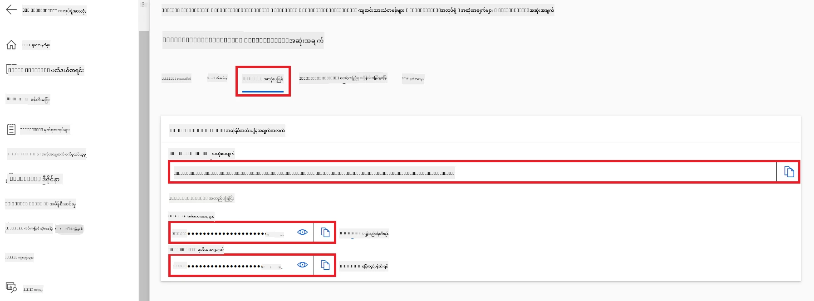

#### *flow.dag.yml* ဖိုင်ထဲ သို့ကုဒ်ထည့်ခြင်း

1. Visual Studio Code မှာ *flow.dag.yml* ဖိုင်ကို ဖွင့်ပါ။

1. *flow.dag.yml* ဖိုင်ထဲ အောက်ပါကုဒ်ကို ထည့်ပါ။

    ```yml
    inputs:
      input_data:
        type: string
        default: "Who founded Microsoft?"

    outputs:
      answer:
        type: string
        reference: ${integrate_with_promptflow.output}

    nodes:
    - name: integrate_with_promptflow
      type: python
      source:
        type: code
        path: integrate_with_promptflow.py
      inputs:
        input_data: ${inputs.input_data}
    ```

#### *integrate_with_promptflow.py* ဖိုင်ထဲ သို့ကုဒ်ထည့်ခြင်း

1. Visual Studio Code မှာ *integrate_with_promptflow.py* ဖိုင်ကို ဖွင့်ပါ။

1. *integrate_with_promptflow.py* ဖိုင်ထဲ အောက်ပါကုဒ်ကို ထည့်ပါ။

    ```python
    import logging
    import requests
    from promptflow.core import tool
    import asyncio
    import platform
    from config import (
        AZURE_ML_ENDPOINT,
        AZURE_ML_API_KEY
    )

    # မှတ်တမ်းတင်ခြင်း ဆက်တင်လုပ်ခြင်း
    logging.basicConfig(
        format="%(asctime)s - %(levelname)s - %(name)s - %(message)s",
        datefmt="%Y-%m-%d %H:%M:%S",
        level=logging.DEBUG
    )
    logger = logging.getLogger(__name__)

    def query_azml_endpoint(input_data: list, endpoint_url: str, api_key: str) -> str:
        """
        Send a request to the Azure ML endpoint with the given input data.
        """
        headers = {
            "Content-Type": "application/json",
            "Authorization": f"Bearer {api_key}"
        }
        data = {
            "input_data": [input_data],
            "params": {
                "temperature": 0.7,
                "max_new_tokens": 128,
                "do_sample": True,
                "return_full_text": True
            }
        }
        try:
            response = requests.post(endpoint_url, json=data, headers=headers)
            response.raise_for_status()
            result = response.json()[0]
            logger.info("Successfully received response from Azure ML Endpoint.")
            return result
        except requests.exceptions.RequestException as e:
            logger.error(f"Error querying Azure ML Endpoint: {e}")
            raise

    def setup_asyncio_policy():
        """
        Setup asyncio event loop policy for Windows.
        """
        if platform.system() == 'Windows':
            asyncio.set_event_loop_policy(asyncio.WindowsSelectorEventLoopPolicy())
            logger.info("Set Windows asyncio event loop policy.")

    @tool
    def my_python_tool(input_data: str) -> str:
        """
        Tool function to process input data and query the Azure ML endpoint.
        """
        setup_asyncio_policy()
        return query_azml_endpoint(input_data, AZURE_ML_ENDPOINT, AZURE_ML_API_KEY)

    ```

### သင့်ကိုယ်ပိုင် မော်ဒယ်ဖြင့် စကားပြောခြင်း

1. *deploy_model.py* script ကို run ချင်တာအတွက် အောက်ပါ command ကို ရိုက်ထည့်ပြီး Azure Machine Learning မှာ deployment စတင်ပါ။

    ```python
    pf flow serve --source ./ --port 8080 --host localhost
    ```

1. ရလာဒ်နမူနာအနေဖြင့် - ယခု သင့်ကိုယ်ပိုင် Phi-3 မော်ဒယ်နှင့် စကားပြောနိုင်ပါပြီ။ fine-tuning အတွက်အသုံးပြုထားသော ဒေတာပေါ် အခြေခံ၍ မေးခွန်းများမေးရန် အကြံပြုသည်။

    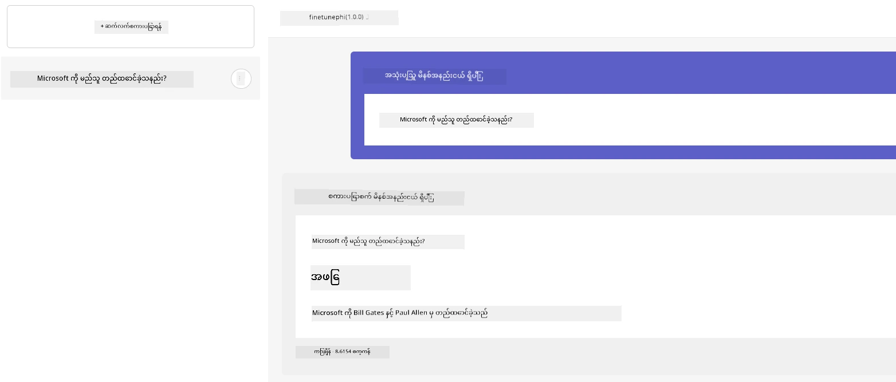

---

<!-- CO-OP TRANSLATOR DISCLAIMER START -->
**တစ်ကြိမ်ပြောကြားချက်**  
ဤစာတမ်းကို AI ဘာသာပြန်မှု ဝန်ဆောင်မှုဖြစ်သော [Co-op Translator](https://github.com/Azure/co-op-translator) ဖြင့် ဘာသာပြန်ထားခြင်းဖြစ်သည်။ တိကျမှန်ကန်မှုအတွက် ကြိုးပမ်းနေသော်လည်း အလိုအလျောက်ဘာသာပြန်မှုတွင် အမှားများ သို့မဟုတ် တိကျမှုကို ချွတ်ယွင်းမှုများ ရှိနိုင်ပါကြောင်း သတိပြုရန်လိုအပ်သည်။ မူလစာတမ်းကို မူရင်းဘာသာဖြင့်သာ ယုံကြည်နိုင်သော အမြောက်အမှတ် အရင်းအမြစ်အဖြစ် သတ်မှတ်အပ်ပါသည်။ အရေးကြီးသည့် အချက်အလက်များအတွက် ကုသိုလ်ရှင်ကျွမ်းကျင်သော လူ့ဘာသာပြန်များ၏ ဝန်ဆောင်မှုကို အကြံပြုပါသည်။ ဤဘာသာပြန်မှုကို အသုံးပြုခြင်းမှ ဖြစ်ပေါ်နိုင်သော မျိုးစုံသော စံချိန် ပြတ်လပ်မှုများ သို့မဟုတ် မှားယွင်းပုံဖြစ်ပေါ်မှုများအတွက် ကျွန်ုပ်တို့ တာဝန်မယူပါ။
<!-- CO-OP TRANSLATOR DISCLAIMER END -->