<!--
CO_OP_TRANSLATOR_METADATA:
{
  "original_hash": "455be2b7b9c3390d367d528f8fab2aa0",
  "translation_date": "2025-07-17T00:51:44+00:00",
  "source_file": "md/02.Application/01.TextAndChat/Phi3/E2E_Phi-3-FineTuning_PromptFlow_Integration.md",
  "language_code": "my"
}
-->
# Fine-tune နှင့် Prompt flow ဖြင့် custom Phi-3 မော်ဒယ်များ ပေါင်းစပ်အသုံးပြုခြင်း

ဤ end-to-end (E2E) နမူနာသည် Microsoft Tech Community မှ "[Fine-Tune and Integrate Custom Phi-3 Models with Prompt Flow: Step-by-Step Guide](https://techcommunity.microsoft.com/t5/educator-developer-blog/fine-tune-and-integrate-custom-phi-3-models-with-prompt-flow/ba-p/4178612?WT.mc_id=aiml-137032-kinfeylo)" လမ်းညွှန်ကို အခြေခံထားပြီး၊ custom Phi-3 မော်ဒယ်များကို fine-tune ပြုလုပ်ခြင်း၊ တပ်ဆင်ခြင်းနှင့် Prompt flow နှင့် ပေါင်းစပ်အသုံးပြုခြင်းလုပ်ငန်းစဉ်များကို မိတ်ဆက်ပေးပါသည်။

## အနှစ်ချုပ်

ဤ E2E နမူနာတွင် Phi-3 မော်ဒယ်ကို fine-tune ပြုလုပ်နည်းနှင့် Prompt flow နှင့် ပေါင်းစပ်အသုံးပြုနည်းကို သင်ယူနိုင်ပါသည်။ Azure Machine Learning နှင့် Prompt flow ကို အသုံးပြု၍ custom AI မော်ဒယ်များကို တပ်ဆင်အသုံးပြုနိုင်မည့် workflow တစ်ခုကို တည်ဆောက်ပါမည်။ ဤ E2E နမူနာကို သုံးခုသော အခြေအနေများအဖြစ် ခွဲခြားထားသည်-

**အခြေအနေ ၁: Azure အရင်းအမြစ်များ တပ်ဆင်ခြင်းနှင့် fine-tuning အတွက် ပြင်ဆင်ခြင်း**

**အခြေအနေ ၂: Phi-3 မော်ဒယ်ကို fine-tune ပြုလုပ်ပြီး Azure Machine Learning Studio တွင် တပ်ဆင်ခြင်း**

**အခြေအနေ ၃: Prompt flow နှင့် ပေါင်းစပ်ပြီး သင့် custom မော်ဒယ်ဖြင့် စကားပြောခြင်း**

ဤ E2E နမူနာ၏ အနှစ်ချုပ်ကို အောက်တွင် ဖော်ပြထားပါသည်။


### အကြောင်းအရာ စာရင်း

1. **[အခြေအနေ ၁: Azure အရင်းအမြစ်များ တပ်ဆင်ခြင်းနှင့် fine-tuning အတွက် ပြင်ဆင်ခြင်း](../../../../../../md/02.Application/01.TextAndChat/Phi3)**
    - [Azure Machine Learning Workspace တည်ဆောက်ခြင်း](../../../../../../md/02.Application/01.TextAndChat/Phi3)
    - [Azure Subscription တွင် GPU ကွိုတားများ တောင်းဆိုခြင်း](../../../../../../md/02.Application/01.TextAndChat/Phi3)
    - [Role assignment ထည့်သွင်းခြင်း](../../../../../../md/02.Application/01.TextAndChat/Phi3)
    - [Project တည်ဆောက်ခြင်း](../../../../../../md/02.Application/01.TextAndChat/Phi3)
    - [Fine-tuning အတွက် dataset ပြင်ဆင်ခြင်း](../../../../../../md/02.Application/01.TextAndChat/Phi3)

1. **[အခြေအနေ ၂: Phi-3 မော်ဒယ်ကို fine-tune ပြုလုပ်ပြီး Azure Machine Learning Studio တွင် တပ်ဆင်ခြင်း](../../../../../../md/02.Application/01.TextAndChat/Phi3)**
    - [Azure CLI တပ်ဆင်ခြင်း](../../../../../../md/02.Application/01.TextAndChat/Phi3)
    - [Phi-3 မော်ဒယ်ကို fine-tune ပြုလုပ်ခြင်း](../../../../../../md/02.Application/01.TextAndChat/Phi3)
    - [Fine-tuned မော်ဒယ်ကို တပ်ဆင်ခြင်း](../../../../../../md/02.Application/01.TextAndChat/Phi3)

1. **[အခြေအနေ ၃: Prompt flow နှင့် ပေါင်းစပ်ပြီး သင့် custom မော်ဒယ်ဖြင့် စကားပြောခြင်း](../../../../../../md/02.Application/01.TextAndChat/Phi3)**
    - [Custom Phi-3 မော်ဒယ်ကို Prompt flow နှင့် ပေါင်းစပ်ခြင်း](../../../../../../md/02.Application/01.TextAndChat/Phi3)
    - [သင့် custom မော်ဒယ်ဖြင့် စကားပြောခြင်း](../../../../../../md/02.Application/01.TextAndChat/Phi3)

## အခြေအနေ ၁: Azure အရင်းအမြစ်များ တပ်ဆင်ခြင်းနှင့် fine-tuning အတွက် ပြင်ဆင်ခြင်း

### Azure Machine Learning Workspace တည်ဆောက်ခြင်း

1. Portal စာမျက်နှာ၏ အပေါ်ဆုံးရှိ **search bar** တွင် *azure machine learning* ဟု ရိုက်ထည့်ပြီး ပေါ်လာသော ရွေးချယ်စရာများထဲမှ **Azure Machine Learning** ကို ရွေးချယ်ပါ။

    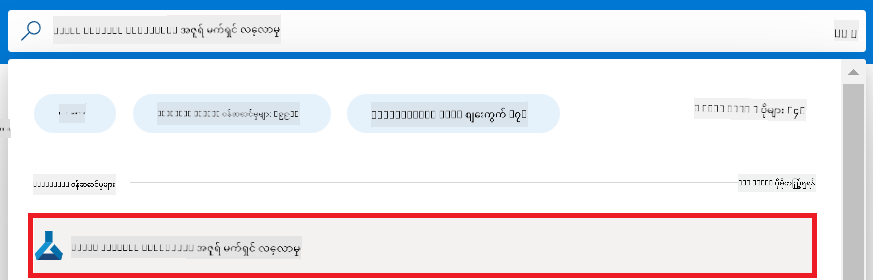

1. နေရာပြောင်းခြင်း မီနူးမှ **+ Create** ကို ရွေးချယ်ပါ။

1. နေရာပြောင်းခြင်း မီနူးမှ **New workspace** ကို ရွေးချယ်ပါ။

    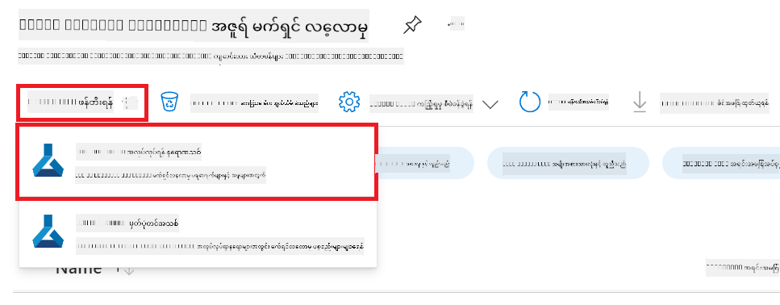

1. အောက်ပါ အချက်များကို ပြုလုပ်ပါ-

    - သင့် Azure **Subscription** ကို ရွေးချယ်ပါ။
    - အသုံးပြုမည့် **Resource group** ကို ရွေးချယ်ပါ (လိုအပ်ပါက အသစ်တစ်ခု ဖန်တီးပါ)။
    - **Workspace Name** ထည့်ပါ။ ထူးခြားသော အမည်ဖြစ်ရမည်။
    - အသုံးပြုလိုသော **Region** ကို ရွေးချယ်ပါ။
    - အသုံးပြုမည့် **Storage account** ကို ရွေးချယ်ပါ (လိုအပ်ပါက အသစ်တစ်ခု ဖန်တီးပါ)။
    - အသုံးပြုမည့် **Key vault** ကို ရွေးချယ်ပါ (လိုအပ်ပါက အသစ်တစ်ခု ဖန်တီးပါ)။
    - အသုံးပြုမည့် **Application insights** ကို ရွေးချယ်ပါ (လိုအပ်ပါက အသစ်တစ်ခု ဖန်တီးပါ)။
    - အသုံးပြုမည့် **Container registry** ကို ရွေးချယ်ပါ (လိုအပ်ပါက အသစ်တစ်ခု ဖန်တီးပါ)။

    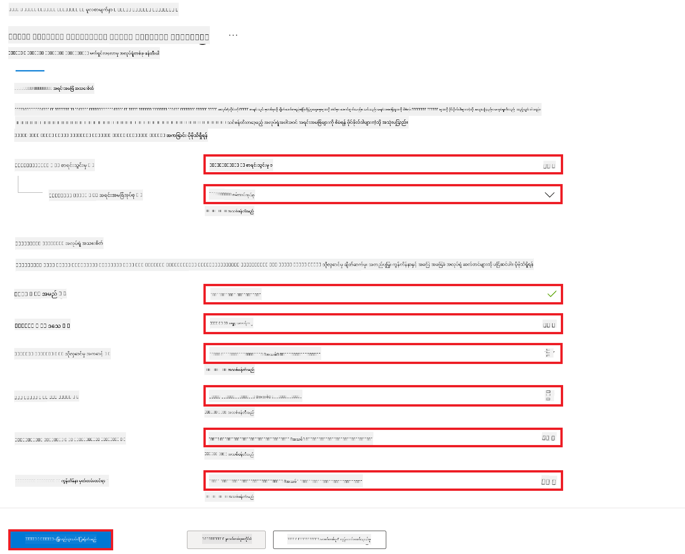

1. **Review + Create** ကို ရွေးချယ်ပါ။

1. **Create** ကို ရွေးချယ်ပါ။

### Azure Subscription တွင် GPU ကွိုတားများ တောင်းဆိုခြင်း

ဤ E2E နမူနာတွင် fine-tuning အတွက် *Standard_NC24ads_A100_v4 GPU* ကို အသုံးပြုမည်ဖြစ်ပြီး ကွိုတားတောင်းဆိုရန် လိုအပ်ပါသည်။ Deployment အတွက် *Standard_E4s_v3* CPU ကို အသုံးပြုမည်ဖြစ်ပြီး ကွိုတားတောင်းဆိုရန် မလိုအပ်ပါ။

> [!NOTE]
>
> Pay-As-You-Go subscription များ (standard subscription အမျိုးအစား) သာ GPU ခွဲဝေပေးခြင်းအတွက် အရည်အချင်းရှိပြီး၊ benefit subscription များကို လက်ရှိတွင် မထောက်ပံ့ပါ။
>
> Benefit subscription များ (ဥပမာ Visual Studio Enterprise Subscription) သို့မဟုတ် fine-tuning နှင့် deployment လုပ်ငန်းစဉ်ကို အမြန်စမ်းသပ်လိုသူများအတွက် CPU ဖြင့် dataset သေးငယ်သုံး၍ fine-tuning ပြုလုပ်နည်းလမ်းညွှန်ချက်များလည်း ပါဝင်သည်။ သို့သော် GPU နှင့် dataset ကြီးများ အသုံးပြုပါက fine-tuning ရလဒ်များ ပိုမိုကောင်းမွန်ပါသည်။

1. [Azure ML Studio](https://ml.azure.com/home?wt.mc_id=studentamb_279723) သို့ သွားပါ။

1. *Standard NCADSA100v4 Family* ကွိုတားတောင်းဆိုရန် အောက်ပါအတိုင်း လုပ်ဆောင်ပါ-

    - ဘယ်ဘက် tab မှ **Quota** ကို ရွေးချယ်ပါ။
    - အသုံးပြုမည့် **Virtual machine family** ကို ရွေးချယ်ပါ။ ဥပမာ *Standard NCADSA100v4 Family Cluster Dedicated vCPUs* (Standard_NC24ads_A100_v4 GPU ပါဝင်သည်) ကို ရွေးချယ်ပါ။
    - နေရာပြောင်းခြင်း မီနူးမှ **Request quota** ကို ရွေးချယ်ပါ။

        

    - Request quota စာမျက်နှာတွင် အသုံးပြုလိုသည့် **New cores limit** ကို ထည့်ပါ။ ဥပမာ 24။
    - Request quota စာမျက်နှာတွင် **Submit** ကို နှိပ်၍ GPU ကွိုတားတောင်းဆိုပါ။

> [!NOTE]
> သင့်လိုအပ်ချက်အတွက် သင့်တော်သော GPU သို့မဟုတ် CPU ကို [Sizes for Virtual Machines in Azure](https://learn.microsoft.com/azure/virtual-machines/sizes/overview?tabs=breakdownseries%2Cgeneralsizelist%2Ccomputesizelist%2Cmemorysizelist%2Cstoragesizelist%2Cgpusizelist%2Cfpgasizelist%2Chpcsizelist) စာရွက်ကို ကိုးကား၍ ရွေးချယ်နိုင်ပါသည်။

### Role assignment ထည့်သွင်းခြင်း

မော်ဒယ်များကို fine-tune ပြုလုပ်ခြင်းနှင့် တပ်ဆင်ခြင်းအတွက် User Assigned Managed Identity (UAI) တစ်ခု ဖန်တီးပြီး သင့်တော်သော ခွင့်ပြုချက်များ ပေးသင့်သည်။ ဤ UAI ကို deployment အတွင်း authentication အတွက် အသုံးပြုမည်ဖြစ်သည်။

#### User Assigned Managed Identity (UAI) ဖန်တီးခြင်း

1. Portal စာမျက်နှာ၏ အပေါ်ဆုံးရှိ **search bar** တွင် *managed identities* ဟု ရိုက်ထည့်ပြီး ပေါ်လာသော ရွေးချယ်စရာများထဲမှ **Managed Identities** ကို ရွေးချယ်ပါ။

    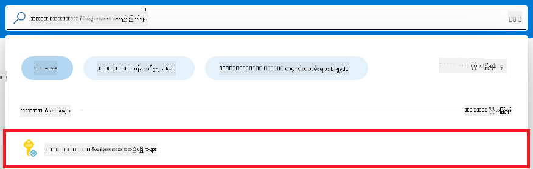

1. **+ Create** ကို ရွေးချယ်ပါ။

    

1. အောက်ပါ အချက်များကို ပြုလုပ်ပါ-

    - သင့် Azure **Subscription** ကို ရွေးချယ်ပါ။
    - အသုံးပြုမည့် **Resource group** ကို ရွေးချယ်ပါ (လိုအပ်ပါက အသစ်တစ်ခု ဖန်တီးပါ)။
    - အသုံးပြုလိုသော **Region** ကို ရွေးချယ်ပါ။
    - **Name** ထည့်ပါ။ ထူးခြားသော အမည်ဖြစ်ရမည်။

1. **Review + create** ကို ရွေးချယ်ပါ။

1. **+ Create** ကို ရွေးချယ်ပါ။

#### Managed Identity သို့ Contributor role assignment ထည့်သွင်းခြင်း

1. ဖန်တီးထားသော Managed Identity resource သို့ သွားပါ။

1. ဘယ်ဘက် tab မှ **Azure role assignments** ကို ရွေးချယ်ပါ။

1. နေရာပြောင်းခြင်း မီနူးမှ **+Add role assignment** ကို ရွေးချယ်ပါ။

1. Add role assignment စာမျက်နှာတွင် အောက်ပါအတိုင်း လုပ်ဆောင်ပါ-
    - **Scope** ကို **Resource group** အဖြစ် သတ်မှတ်ပါ။
    - သင့် Azure **Subscription** ကို ရွေးချယ်ပါ။
    - အသုံးပြုမည့် **Resource group** ကို ရွေးချယ်ပါ။
    - **Role** ကို **Contributor** အဖြစ် ရွေးချယ်ပါ။

    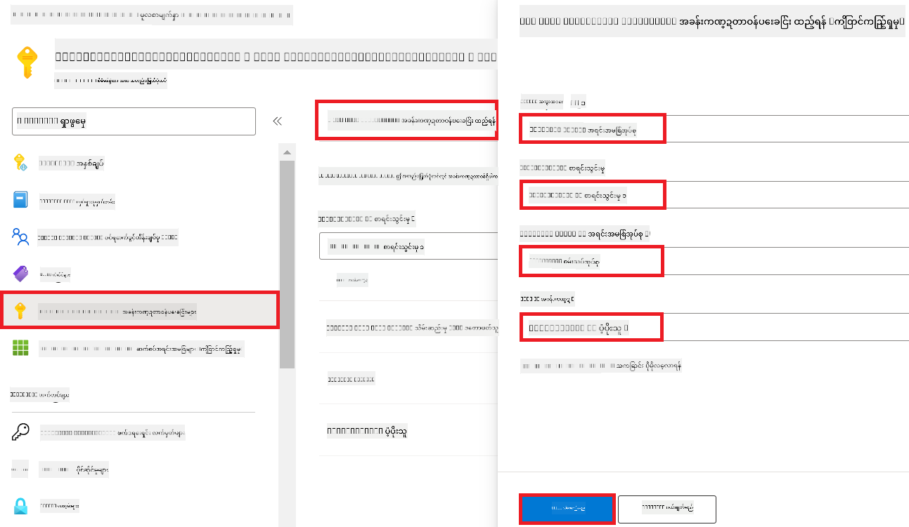

1. **Save** ကို နှိပ်ပါ။

#### Managed Identity သို့ Storage Blob Data Reader role assignment ထည့်သွင်းခြင်း

1. Portal စာမျက်နှာ၏ အပေါ်ဆုံးရှိ **search bar** တွင် *storage accounts* ဟု ရိုက်ထည့်ပြီး ပေါ်လာသော ရွေးချယ်စရာများထဲမှ **Storage accounts** ကို ရွေးချယ်ပါ။

    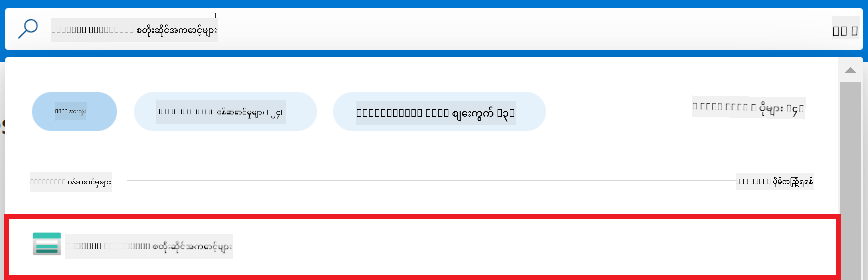

1. Azure Machine Learning workspace နှင့် ဆက်စပ်ထားသော storage account ကို ရွေးချယ်ပါ။ ဥပမာ *finetunephistorage*။

1. Add role assignment စာမျက်နှာသို့ သွားရန် အောက်ပါအတိုင်း လုပ်ဆောင်ပါ-

    - ဖန်တီးထားသော Azure Storage account သို့ သွားပါ။
    - ဘယ်ဘက် tab မှ **Access Control (IAM)** ကို ရွေးချယ်ပါ။
    - နေရာပြောင်းခြင်း မီနူးမှ **+ Add** ကို ရွေးချယ်ပါ။
    - နေရာပြောင်းခြင်း မီနူးမှ **Add role assignment** ကို ရွေးချယ်ပါ။

    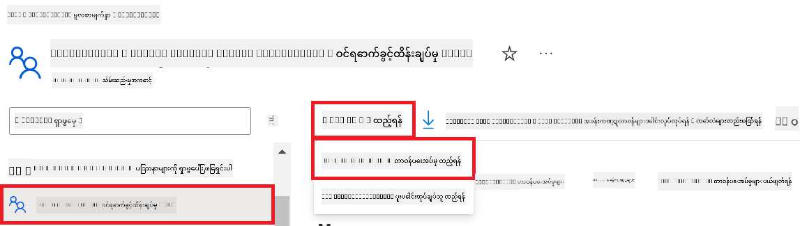

1. Add role assignment စာမျက်နှာတွင် အောက်ပါအတိုင်း လုပ်ဆောင်ပါ-

    - Role စာမျက်နှာတွင် *Storage Blob Data Reader* ဟု ရိုက်ထည့်ပြီး ပေါ်လာသော ရွေးချယ်စရာများထဲမှ **Storage Blob Data Reader** ကို ရွေးချယ်ပါ။
    - Role စာမျက်နှာတွင် **Next** ကို နှိပ်ပါ။
    - Members စာမျက်နှာတွင် **Assign access to** ကို **Managed identity** အဖြစ် ရွေးချယ်ပါ။
    - Members စာမျက်နှာတွင် **+ Select members** ကို နှိပ်ပါ။
    - Select managed identities စာမျက်နှာတွင် သင့် Azure **Subscription** ကို ရွေးချယ်ပါ။
    - Select managed identities စာမျက်နှာတွင် **Managed identity** ကို **Manage Identity** အဖြစ် ရွေးချယ်ပါ။
    - Select managed identities စာမျက်နှာတွင် ဖန်တီးထားသော Manage Identity ကို ရွေးချယ်ပါ။ ဥပမာ *finetunephi-managedidentity*။
    - Select managed identities စာမျက်နှာတွင် **Select** ကို နှိပ်ပါ။

    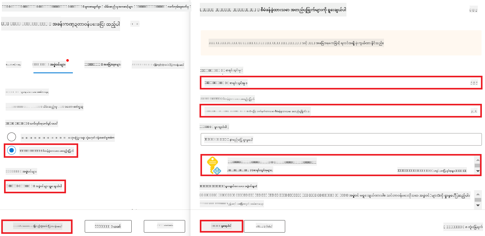

1. **Review + assign** ကို ရွေးချယ်ပါ။

#### Managed Identity သို့ AcrPull role assignment ထည့်သွင်းခြင်း

1. Portal စာမျက်နှာ၏ အပေါ်ဆုံးရှိ **search bar** တွင် *container registries* ဟု ရိုက်ထည့်ပြီး ပေါ်လာသော ရွေးချယ်စရာများထဲမှ **Container registries** ကို ရွေးချယ်ပါ။

    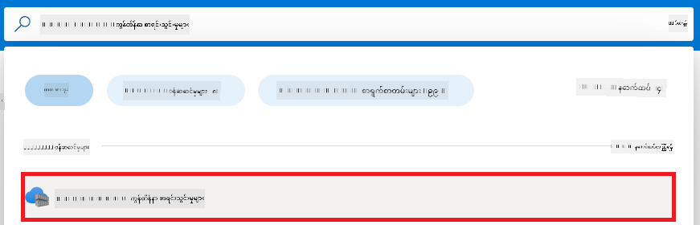

1. Azure Machine Learning workspace နှင့် ဆက်စပ်ထားသော container registry ကို ရွေးချယ်ပါ။ ဥပမာ *finetunephicontainerregistries*။

1. Add role assignment စာမျက်နှာသို့ သွားရန် အောက်ပါအတိုင်း လုပ်ဆောင်ပါ-

    - ဘယ်ဘက် tab မှ **Access Control (IAM)** ကို ရွေးချယ်ပါ။
    - နေရာပြောင်းခြင်း မီနူးမှ **+ Add** ကို ရွေးချယ်ပါ။
    - နေရာပြောင်းခြင်း မီနူးမှ **Add role assignment** ကို ရွေးချယ်ပါ။

1. Add role assignment စာမျက်နှာတွင် အောက်ပါအတိုင်း လုပ်ဆောင်ပါ-

    - Role စာမျက်နှာတွင် *AcrPull* ဟု ရိုက်ထည့်ပြီး ပေါ်လာသော ရွေးချယ်စရာများထဲမှ **AcrPull** ကို ရွေးချယ်ပါ။
    - Role စာမျက်နှာတွင် **Next** ကို နှိပ်ပါ။
    - Members စာမျက်နှာတွင် **Assign access to** ကို **Managed identity** အဖြစ် ရွေးချယ်ပါ။
    - Members စာမျက်နှာတွင် **+ Select members** ကို နှိပ်ပါ။
    - Select managed identities စာမျက်နှာတွင် သင့် Azure **Subscription** ကို ရွေးချယ်ပါ။
    - Select managed identities စာမျက်နှာတွင် **Managed identity** ကို **Manage Identity** အဖြစ် ရွေးချယ်ပါ။
    - Select managed identities စာမျက်နှာတွင် ဖန်တီးထားသော Manage Identity ကို ရွေးချယ်ပါ။ ဥပမာ *finetunephi-managedidentity*။
    - Select managed identities စာမျက်နှာတွင် **Select** ကို နှိပ်ပါ။
    - **Review + assign** ကို ရွေးချယ်ပါ။

### Project တည်ဆောက်ခြင်း

ယခု သင်သည် အလုပ်လုပ်ရန် ဖိုလ်ဒါတစ်ခု ဖန်တီးပြီး၊ အသုံးပြုသူနှင့် ဆက်သွယ်နိုင်သော ပရိုဂရမ်တစ်ခု ဖန်တီးရန် virtual environment တစ်ခု တည်ဆောက်မည်ဖြစ်သည်။ ထို့အပြင် Azure Cosmos DB မှ သိမ်းဆည်းထားသော စကားပြောမှတ်တမ်းများကို အသုံးပြု၍ တုံ့ပြန်ချက်များကို အကောင်းဆုံး ထုတ်ပေးနိုင်မည်ဖြစ်သည်။

#### အလုပ်လုပ်ရန် ဖိုလ်ဒါတစ်ခု ဖန်တီးခြင်း

1. Terminal ပြတင်း
> [!NOTE]
>
> အလုပ်ဖြစ်ခဲ့ရင် command prompt မတိုင်ခင်မှာ *(.venv)* ကိုမြင်ရပါမယ်။
#### လိုအပ်သော package များ 설치ခြင်း

1. လိုအပ်သော package များ 설치ရန် terminal ထဲတွင် အောက်ပါ command များကို ရိုက်ထည့်ပါ။

    ```console
    pip install datasets==2.19.1
    pip install transformers==4.41.1
    pip install azure-ai-ml==1.16.0
    pip install torch==2.3.1
    pip install trl==0.9.4
    pip install promptflow==1.12.0
    ```

#### project ဖိုင်များ ဖန်တီးခြင်း

ဒီလေ့ကျင့်ခန်းမှာ ကျွန်တော်တို့ project အတွက် အရေးကြီးဖိုင်တွေကို ဖန်တီးမှာဖြစ်ပါတယ်။ ဒီဖိုင်တွေမှာ dataset ကို download လုပ်ဖို့ script, Azure Machine Learning ပတ်ဝန်းကျင်ကို စတင်တပ်ဆင်ဖို့ script, Phi-3 model ကို fine-tune လုပ်ဖို့ script နဲ့ fine-tuned model ကို deploy လုပ်ဖို့ script တွေ ပါဝင်ပါတယ်။ ထို့အပြင် fine-tuning ပတ်ဝန်းကျင်ကို တပ်ဆင်ဖို့ *conda.yml* ဖိုင်ကိုလည်း ဖန်တီးပါမယ်။

ဒီလေ့ကျင့်ခန်းမှာ သင်လုပ်ဆောင်မယ့်အရာတွေကတော့ -

- dataset ကို download လုပ်ဖို့ *download_dataset.py* ဖိုင်ကို ဖန်တီးပါ။
- Azure Machine Learning ပတ်ဝန်းကျင်ကို စတင်တပ်ဆင်ဖို့ *setup_ml.py* ဖိုင်ကို ဖန်တီးပါ။
- *finetuning_dir* ဖိုလ်ဒါအတွင်းမှာ Phi-3 model ကို dataset အသုံးပြုပြီး fine-tune လုပ်ဖို့ *fine_tune.py* ဖိုင်ကို ဖန်တီးပါ။
- fine-tuning ပတ်ဝန်းကျင်ကို တပ်ဆင်ဖို့ *conda.yml* ဖိုင်ကို ဖန်တီးပါ။
- fine-tuned model ကို deploy လုပ်ဖို့ *deploy_model.py* ဖိုင်ကို ဖန်တီးပါ။
- fine-tuned model ကို Prompt flow နဲ့ ပေါင်းစည်းပြီး model ကို 실행ဖို့ *integrate_with_promptflow.py* ဖိုင်ကို ဖန်တီးပါ။
- Prompt flow အတွက် workflow ဖွဲ့စည်းမှုကို သတ်မှတ်ဖို့ flow.dag.yml ဖိုင်ကို ဖန်တီးပါ။
- Azure အချက်အလက်များ ထည့်သွင်းရန် *config.py* ဖိုင်ကို ဖန်တီးပါ။

> [!NOTE]
>
> ပြည့်စုံသော ဖိုလ်ဒါဖွဲ့စည်းမှု -
>
> ```text
> └── YourUserName
> .    └── finetune-phi
> .        ├── finetuning_dir
> .        │      └── fine_tune.py
> .        ├── conda.yml
> .        ├── config.py
> .        ├── deploy_model.py
> .        ├── download_dataset.py
> .        ├── flow.dag.yml
> .        ├── integrate_with_promptflow.py
> .        └── setup_ml.py
> ```

1. **Visual Studio Code** ကို ဖွင့်ပါ။

1. မီနူးဘားမှ **File** ကို ရွေးချယ်ပါ။

1. **Open Folder** ကို ရွေးချယ်ပါ။

1. သင်ဖန်တီးထားသော *finetune-phi* ဖိုလ်ဒါကို ရွေးချယ်ပါ၊ အဲဒါက *C:\Users\yourUserName\finetune-phi* မှာရှိပါတယ်။

    

1. Visual Studio Code ၏ ဘယ်ဘက် panel မှာ right-click ပြုလုပ်ပြီး **New File** ကို ရွေးချယ်ကာ *download_dataset.py* ဆိုတဲ့ ဖိုင်အသစ်ကို ဖန်တီးပါ။

1. Visual Studio Code ၏ ဘယ်ဘက် panel မှာ right-click ပြုလုပ်ပြီး **New File** ကို ရွေးချယ်ကာ *setup_ml.py* ဆိုတဲ့ ဖိုင်အသစ်ကို ဖန်တီးပါ။

1. Visual Studio Code ၏ ဘယ်ဘက် panel မှာ right-click ပြုလုပ်ပြီး **New File** ကို ရွေးချယ်ကာ *deploy_model.py* ဆိုတဲ့ ဖိုင်အသစ်ကို ဖန်တီးပါ။

    

1. Visual Studio Code ၏ ဘယ်ဘက် panel မှာ right-click ပြုလုပ်ပြီး **New Folder** ကို ရွေးချယ်ကာ *finetuning_dir* ဆိုတဲ့ ဖိုလ်ဒါအသစ်ကို ဖန်တီးပါ။

1. *finetuning_dir* ဖိုလ်ဒါအတွင်း *fine_tune.py* ဆိုတဲ့ ဖိုင်အသစ်ကို ဖန်တီးပါ။

#### *conda.yml* ဖိုင် ဖန်တီးခြင်းနှင့် ပြင်ဆင်ခြင်း

1. Visual Studio Code ၏ ဘယ်ဘက် panel မှာ right-click ပြုလုပ်ပြီး **New File** ကို ရွေးချယ်ကာ *conda.yml* ဆိုတဲ့ ဖိုင်အသစ်ကို ဖန်တီးပါ။

1. Phi-3 model အတွက် fine-tuning ပတ်ဝန်းကျင်ကို တပ်ဆင်ရန် အောက်ပါ code ကို *conda.yml* ဖိုင်ထဲ ထည့်ပါ။

    ```yml
    name: phi-3-training-env
    channels:
      - defaults
      - conda-forge
    dependencies:
      - python=3.10
      - pip
      - numpy<2.0
      - pip:
          - torch==2.4.0
          - torchvision==0.19.0
          - trl==0.8.6
          - transformers==4.41
          - datasets==2.21.0
          - azureml-core==1.57.0
          - azure-storage-blob==12.19.0
          - azure-ai-ml==1.16
          - azure-identity==1.17.1
          - accelerate==0.33.0
          - mlflow==2.15.1
          - azureml-mlflow==1.57.0
    ```

#### *config.py* ဖိုင် ဖန်တီးခြင်းနှင့် ပြင်ဆင်ခြင်း

1. Visual Studio Code ၏ ဘယ်ဘက် panel မှာ right-click ပြုလုပ်ပြီး **New File** ကို ရွေးချယ်ကာ *config.py* ဆိုတဲ့ ဖိုင်အသစ်ကို ဖန်တီးပါ။

1. သင့် Azure အချက်အလက်များကို ထည့်သွင်းရန် အောက်ပါ code ကို *config.py* ဖိုင်ထဲ ထည့်ပါ။

    ```python
    # Azure settings
    AZURE_SUBSCRIPTION_ID = "your_subscription_id"
    AZURE_RESOURCE_GROUP_NAME = "your_resource_group_name" # "TestGroup"

    # Azure Machine Learning settings
    AZURE_ML_WORKSPACE_NAME = "your_workspace_name" # "finetunephi-workspace"

    # Azure Managed Identity settings
    AZURE_MANAGED_IDENTITY_CLIENT_ID = "your_azure_managed_identity_client_id"
    AZURE_MANAGED_IDENTITY_NAME = "your_azure_managed_identity_name" # "finetunephi-mangedidentity"
    AZURE_MANAGED_IDENTITY_RESOURCE_ID = f"/subscriptions/{AZURE_SUBSCRIPTION_ID}/resourceGroups/{AZURE_RESOURCE_GROUP_NAME}/providers/Microsoft.ManagedIdentity/userAssignedIdentities/{AZURE_MANAGED_IDENTITY_NAME}"

    # Dataset file paths
    TRAIN_DATA_PATH = "data/train_data.jsonl"
    TEST_DATA_PATH = "data/test_data.jsonl"

    # Fine-tuned model settings
    AZURE_MODEL_NAME = "your_fine_tuned_model_name" # "finetune-phi-model"
    AZURE_ENDPOINT_NAME = "your_fine_tuned_model_endpoint_name" # "finetune-phi-endpoint"
    AZURE_DEPLOYMENT_NAME = "your_fine_tuned_model_deployment_name" # "finetune-phi-deployment"

    AZURE_ML_API_KEY = "your_fine_tuned_model_api_key"
    AZURE_ML_ENDPOINT = "your_fine_tuned_model_endpoint_uri" # "https://{your-endpoint-name}.{your-region}.inference.ml.azure.com/score"
    ```

#### Azure ပတ်ဝန်းကျင် အပြောင်းအလဲများ ထည့်သွင်းခြင်း

1. Azure Subscription ID ထည့်သွင်းရန် အောက်ပါအဆင့်များကို လုပ်ဆောင်ပါ။

    - Portal စာမျက်နှာ အပေါ်ဆုံးရှိ **search bar** တွင် *subscriptions* ဟု ရိုက်ထည့်ပြီး ပေါ်လာသော ရွေးချယ်စရာများထဲမှ **Subscriptions** ကို ရွေးချယ်ပါ။
    - သင်အသုံးပြုနေသော Azure Subscription ကို ရွေးချယ်ပါ။
    - Subscription ID ကို ကူးယူပြီး *config.py* ဖိုင်ထဲ ထည့်သွင်းပါ။

    

1. Azure Workspace Name ထည့်သွင်းရန် အောက်ပါအဆင့်များကို လုပ်ဆောင်ပါ။

    - သင်ဖန်တီးထားသော Azure Machine Learning resource သို့ သွားပါ။
    - သင့်အကောင့်နာမည်ကို ကူးယူပြီး *config.py* ဖိုင်ထဲ ထည့်သွင်းပါ။

    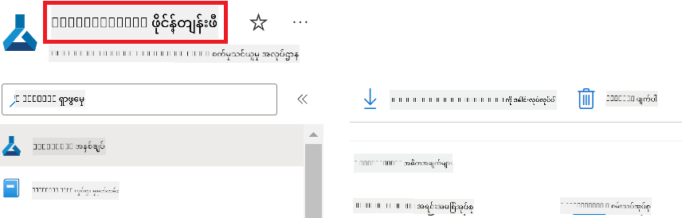

1. Azure Resource Group Name ထည့်သွင်းရန် အောက်ပါအဆင့်များကို လုပ်ဆောင်ပါ။

    - သင်ဖန်တီးထားသော Azure Machine Learning resource သို့ သွားပါ။
    - Azure Resource Group Name ကို ကူးယူပြီး *config.py* ဖိုင်ထဲ ထည့်သွင်းပါ။

    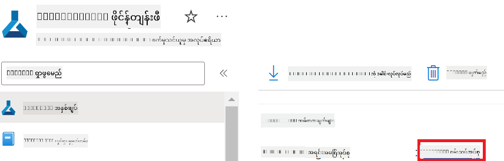

2. Azure Managed Identity name ထည့်သွင်းရန် အောက်ပါအဆင့်များကို လုပ်ဆောင်ပါ။

    - သင်ဖန်တီးထားသော Managed Identities resource သို့ သွားပါ။
    - Azure Managed Identity name ကို ကူးယူပြီး *config.py* ဖိုင်ထဲ ထည့်သွင်းပါ။

    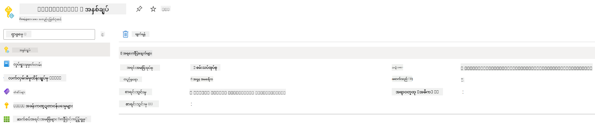

### Fine-tuning အတွက် dataset ပြင်ဆင်ခြင်း

ဒီလေ့ကျင့်ခန်းမှာ *download_dataset.py* ဖိုင်ကို run လုပ်ပြီး *ULTRACHAT_200k* dataset ကို သင့် local ပတ်ဝန်းကျင်သို့ download လုပ်ပါမယ်။ ထို့နောက် ဒီ dataset ကို အသုံးပြုပြီး Azure Machine Learning မှာ Phi-3 model ကို fine-tune လုပ်ပါမယ်။

#### *download_dataset.py* ဖြင့် dataset ကို download လုပ်ခြင်း

1. Visual Studio Code မှာ *download_dataset.py* ဖိုင်ကို ဖွင့်ပါ။

1. အောက်ပါ code ကို *download_dataset.py* ထဲ ထည့်ပါ။

    ```python
    import json
    import os
    from datasets import load_dataset
    from config import (
        TRAIN_DATA_PATH,
        TEST_DATA_PATH)

    def load_and_split_dataset(dataset_name, config_name, split_ratio):
        """
        Load and split a dataset.
        """
        # Load the dataset with the specified name, configuration, and split ratio
        dataset = load_dataset(dataset_name, config_name, split=split_ratio)
        print(f"Original dataset size: {len(dataset)}")
        
        # Split the dataset into train and test sets (80% train, 20% test)
        split_dataset = dataset.train_test_split(test_size=0.2)
        print(f"Train dataset size: {len(split_dataset['train'])}")
        print(f"Test dataset size: {len(split_dataset['test'])}")
        
        return split_dataset

    def save_dataset_to_jsonl(dataset, filepath):
        """
        Save a dataset to a JSONL file.
        """
        # Create the directory if it does not exist
        os.makedirs(os.path.dirname(filepath), exist_ok=True)
        
        # Open the file in write mode
        with open(filepath, 'w', encoding='utf-8') as f:
            # Iterate over each record in the dataset
            for record in dataset:
                # Dump the record as a JSON object and write it to the file
                json.dump(record, f)
                # Write a newline character to separate records
                f.write('\n')
        
        print(f"Dataset saved to {filepath}")

    def main():
        """
        Main function to load, split, and save the dataset.
        """
        # Load and split the ULTRACHAT_200k dataset with a specific configuration and split ratio
        dataset = load_and_split_dataset("HuggingFaceH4/ultrachat_200k", 'default', 'train_sft[:1%]')
        
        # Extract the train and test datasets from the split
        train_dataset = dataset['train']
        test_dataset = dataset['test']

        # Save the train dataset to a JSONL file
        save_dataset_to_jsonl(train_dataset, TRAIN_DATA_PATH)
        
        # Save the test dataset to a separate JSONL file
        save_dataset_to_jsonl(test_dataset, TEST_DATA_PATH)

    if __name__ == "__main__":
        main()

    ```

> [!TIP]
>
> **CPU အသုံးပြုပြီး အနည်းငယ် dataset ဖြင့် fine-tuning လုပ်ရန် လမ်းညွှန်ချက်**
>
> CPU ဖြင့် fine-tuning လုပ်ချင်ပါက ဒီနည်းလမ်းက Visual Studio Enterprise Subscription ကဲ့သို့သော benefit subscription ရှိသူများ သို့မဟုတ် fine-tuning နဲ့ deployment လုပ်ငန်းစဉ်ကို အမြန်စမ်းသပ်ချင်သူများအတွက် သင့်တော်ပါတယ်။
>
> `dataset = load_and_split_dataset("HuggingFaceH4/ultrachat_200k", 'default', 'train_sft[:1%]')` ကို `dataset = load_and_split_dataset("HuggingFaceH4/ultrachat_200k", 'default', 'train_sft[:10]')` ဖြင့် အစားထိုးပါ။
>

1. terminal ထဲတွင် အောက်ပါ command ကို ရိုက်ထည့်ပြီး script ကို run လုပ်ကာ dataset ကို သင့် local ပတ်ဝန်းကျင်သို့ download လုပ်ပါ။

    ```console
    python download_data.py
    ```

1. dataset များကို သင့် local *finetune-phi/data* directory ထဲသို့ အောင်မြင်စွာ သိမ်းဆည်းထားကြောင်း စစ်ဆေးပါ။

> [!NOTE]
>
> **Dataset အရွယ်အစားနှင့် fine-tuning အချိန်**
>
> ဒီ E2E နမူနာမှာ dataset ၏ 1% (`train_sft[:1%]`) ကိုသာ အသုံးပြုထားပါတယ်။ ဒါကြောင့် data အရေအတွက် လျော့နည်းပြီး upload နဲ့ fine-tuning လုပ်ငန်းစဉ်များ မြန်ဆန်စေပါတယ်။ သင် training အချိန်နဲ့ model performance အကြား သင့်တော်တဲ့ အချိုးကို ရှာဖွေရန် အချိုးကို ပြောင်းလဲနိုင်ပါတယ်။ dataset ၏ အနည်းငယ်သာ အသုံးပြုခြင်းက fine-tuning အချိန်ကို လျော့နည်းစေပြီး E2E နမူနာအတွက် လုပ်ငန်းစဉ်ကို ပိုမိုထိရောက်စေပါတယ်။

## Scenario 2: Phi-3 model ကို fine-tune လုပ်ပြီး Azure Machine Learning Studio တွင် Deploy လုပ်ခြင်း

### Azure CLI ကို စတင်တပ်ဆင်ခြင်း

သင့်ပတ်ဝန်းကျင်ကို အတည်ပြုရန် Azure CLI ကို စတင်တပ်ဆင်ရန် လိုအပ်ပါတယ်။ Azure CLI က command line မှတဆင့် Azure resource များကို တိုက်ရိုက်စီမံခန့်ခွဲနိုင်စေပြီး Azure Machine Learning အတွက် လိုအပ်သော အတည်ပြုချက်များကို ပေးစွမ်းပါတယ်။ စတင်ရန် [Azure CLI](https://learn.microsoft.com/cli/azure/install-azure-cli) ကို 설치ပါ။

1. terminal ပြတင်းပေါ်ကို ဖွင့်ပြီး သင့် Azure အကောင့်သို့ login ဝင်ရန် အောက်ပါ command ကို ရိုက်ထည့်ပါ။

    ```console
    az login
    ```

1. သင့် Azure အကောင့်ကို ရွေးချယ်ပါ။

1. သင့် Azure subscription ကို ရွေးချယ်ပါ။

    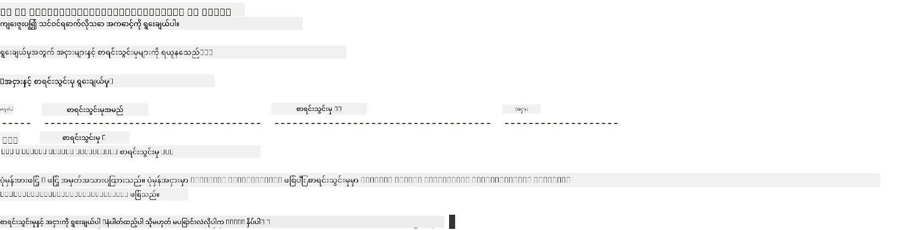

> [!TIP]
>
> Azure သို့ login ဝင်ရာတွင် ပြဿနာရှိပါက device code ကို အသုံးပြုကြည့်ပါ။ terminal ပြတင်းပေါ်ကို ဖွင့်ပြီး အောက်ပါ command ကို ရိုက်ထည့်ကာ Azure အကောင့်သို့ login ဝင်ပါ။
>
> ```console
> az login --use-device-code
> ```
>

### Phi-3 model ကို fine-tune လုပ်ခြင်း

ဒီလေ့ကျင့်ခန်းမှာ သင့်အား ပေးထားသော dataset ကို အသုံးပြုပြီး Phi-3 model ကို fine-tune လုပ်ပါမယ်။ အရင်ဆုံး *fine_tune.py* ဖိုင်ထဲမှာ fine-tuning လုပ်ငန်းစဉ်ကို သတ်မှတ်ပါမယ်။ ထို့နောက် Azure Machine Learning ပတ်ဝန်းကျင်ကို ပြင်ဆင်ပြီး *setup_ml.py* ဖိုင်ကို run လုပ်ကာ fine-tuning လုပ်ငန်းစဉ်ကို စတင်ပါမယ်။ ဒီ script က fine-tuning ကို Azure Machine Learning ပတ်ဝန်းကျင်အတွင်းမှာ ဖြစ်ပေါ်စေပါသည်။

*setup_ml.py* ကို run လုပ်ခြင်းဖြင့် Azure Machine Learning ပတ်ဝန်းကျင်အတွင်း fine-tuning လုပ်ငန်းစဉ်ကို စတင်နိုင်ပါသည်။

#### *fine_tune.py* ဖိုင်ထဲ code ထည့်ခြင်း

1. *finetuning_dir* ဖိုလ်ဒါသို့ သွားပြီး Visual Studio Code မှာ *fine_tune.py* ဖိုင်ကို ဖွင့်ပါ။

1. အောက်ပါ code ကို *fine_tune.py* ထဲ ထည့်ပါ။

    ```python
    import argparse
    import sys
    import logging
    import os
    from datasets import load_dataset
    import torch
    import mlflow
    from transformers import AutoModelForCausalLM, AutoTokenizer, TrainingArguments
    from trl import SFTTrainer

    # To avoid the INVALID_PARAMETER_VALUE error in MLflow, disable MLflow integration
    os.environ["DISABLE_MLFLOW_INTEGRATION"] = "True"

    # Logging setup
    logging.basicConfig(
        format="%(asctime)s - %(levelname)s - %(name)s - %(message)s",
        datefmt="%Y-%m-%d %H:%M:%S",
        handlers=[logging.StreamHandler(sys.stdout)],
        level=logging.WARNING
    )
    logger = logging.getLogger(__name__)

    def initialize_model_and_tokenizer(model_name, model_kwargs):
        """
        Initialize the model and tokenizer with the given pretrained model name and arguments.
        """
        model = AutoModelForCausalLM.from_pretrained(model_name, **model_kwargs)
        tokenizer = AutoTokenizer.from_pretrained(model_name)
        tokenizer.model_max_length = 2048
        tokenizer.pad_token = tokenizer.unk_token
        tokenizer.pad_token_id = tokenizer.convert_tokens_to_ids(tokenizer.pad_token)
        tokenizer.padding_side = 'right'
        return model, tokenizer

    def apply_chat_template(example, tokenizer):
        """
        Apply a chat template to tokenize messages in the example.
        """
        messages = example["messages"]
        if messages[0]["role"] != "system":
            messages.insert(0, {"role": "system", "content": ""})
        example["text"] = tokenizer.apply_chat_template(
            messages, tokenize=False, add_generation_prompt=False
        )
        return example

    def load_and_preprocess_data(train_filepath, test_filepath, tokenizer):
        """
        Load and preprocess the dataset.
        """
        train_dataset = load_dataset('json', data_files=train_filepath, split='train')
        test_dataset = load_dataset('json', data_files=test_filepath, split='train')
        column_names = list(train_dataset.features)

        train_dataset = train_dataset.map(
            apply_chat_template,
            fn_kwargs={"tokenizer": tokenizer},
            num_proc=10,
            remove_columns=column_names,
            desc="Applying chat template to train dataset",
        )

        test_dataset = test_dataset.map(
            apply_chat_template,
            fn_kwargs={"tokenizer": tokenizer},
            num_proc=10,
            remove_columns=column_names,
            desc="Applying chat template to test dataset",
        )

        return train_dataset, test_dataset

    def train_and_evaluate_model(train_dataset, test_dataset, model, tokenizer, output_dir):
        """
        Train and evaluate the model.
        """
        training_args = TrainingArguments(
            bf16=True,
            do_eval=True,
            output_dir=output_dir,
            eval_strategy="epoch",
            learning_rate=5.0e-06,
            logging_steps=20,
            lr_scheduler_type="cosine",
            num_train_epochs=3,
            overwrite_output_dir=True,
            per_device_eval_batch_size=4,
            per_device_train_batch_size=4,
            remove_unused_columns=True,
            save_steps=500,
            seed=0,
            gradient_checkpointing=True,
            gradient_accumulation_steps=1,
            warmup_ratio=0.2,
        )

        trainer = SFTTrainer(
            model=model,
            args=training_args,
            train_dataset=train_dataset,
            eval_dataset=test_dataset,
            max_seq_length=2048,
            dataset_text_field="text",
            tokenizer=tokenizer,
            packing=True
        )

        train_result = trainer.train()
        trainer.log_metrics("train", train_result.metrics)

        mlflow.transformers.log_model(
            transformers_model={"model": trainer.model, "tokenizer": tokenizer},
            artifact_path=output_dir,
        )

        tokenizer.padding_side = 'left'
        eval_metrics = trainer.evaluate()
        eval_metrics["eval_samples"] = len(test_dataset)
        trainer.log_metrics("eval", eval_metrics)

    def main(train_file, eval_file, model_output_dir):
        """
        Main function to fine-tune the model.
        """
        model_kwargs = {
            "use_cache": False,
            "trust_remote_code": True,
            "torch_dtype": torch.bfloat16,
            "device_map": None,
            "attn_implementation": "eager"
        }

        # pretrained_model_name = "microsoft/Phi-3-mini-4k-instruct"
        pretrained_model_name = "microsoft/Phi-3.5-mini-instruct"

        with mlflow.start_run():
            model, tokenizer = initialize_model_and_tokenizer(pretrained_model_name, model_kwargs)
            train_dataset, test_dataset = load_and_preprocess_data(train_file, eval_file, tokenizer)
            train_and_evaluate_model(train_dataset, test_dataset, model, tokenizer, model_output_dir)

    if __name__ == "__main__":
        parser = argparse.ArgumentParser()
        parser.add_argument("--train-file", type=str, required=True, help="Path to the training data")
        parser.add_argument("--eval-file", type=str, required=True, help="Path to the evaluation data")
        parser.add_argument("--model_output_dir", type=str, required=True, help="Directory to save the fine-tuned model")
        args = parser.parse_args()
        main(args.train_file, args.eval_file, args.model_output_dir)

    ```

1. *fine_tune.py* ဖိုင်ကို သိမ်းပြီး ပိတ်ပါ။

> [!TIP]
> **Phi-3.5 model ကိုလည်း fine-tune လုပ်နိုင်ပါတယ်**
>
> *fine_tune.py* ဖိုင်ထဲမှာ `pretrained_model_name` ကို `"microsoft/Phi-3-mini-4k-instruct"` မှ `"microsoft/Phi-3.5-mini-instruct"` သို့ ပြောင်းလဲနိုင်ပါတယ်။ ဒီလိုပြောင်းလဲခြင်းဖြင့် Phi-3.5-mini-instruct model ကို fine-tune လုပ်မှာဖြစ်ပါတယ်။ သင်စိတ်ဝင်စားသော model နာမည်ကို ရှာဖွေရန် [Hugging Face](https://huggingface.co/) ကို သွားပြီး ရှာဖွေကာ `pretrained_model_name` field ထဲသို့ ကူးထည့်နိုင်ပါသည်။
>
> :::image type="content" source="../../imgs/03/FineTuning-PromptFlow/finetunephi3.5.png" alt-text="Fine tune Phi-3.5.":::
>

#### *setup_ml.py* ဖိုင်ထဲ code ထည့်ခြင်း

1. Visual Studio Code မှာ *setup_ml.py* ဖိုင်ကို ဖွင့်ပါ။

1. အောက်ပါ code ကို *setup_ml.py* ထဲ ထည့်ပါ။

    ```python
    import logging
    from azure.ai.ml import MLClient, command, Input
    from azure.ai.ml.entities import Environment, AmlCompute
    from azure.identity import AzureCliCredential
    from config import (
        AZURE_SUBSCRIPTION_ID,
        AZURE_RESOURCE_GROUP_NAME,
        AZURE_ML_WORKSPACE_NAME,
        TRAIN_DATA_PATH,
        TEST_DATA_PATH
    )

    # Constants

    # Uncomment the following lines to use a CPU instance for training
    # COMPUTE_INSTANCE_TYPE = "Standard_E16s_v3" # cpu
    # COMPUTE_NAME = "cpu-e16s-v3"
    # DOCKER_IMAGE_NAME = "mcr.microsoft.com/azureml/openmpi4.1.0-ubuntu20.04:latest"

    # Uncomment the following lines to use a GPU instance for training
    COMPUTE_INSTANCE_TYPE = "Standard_NC24ads_A100_v4"
    COMPUTE_NAME = "gpu-nc24s-a100-v4"
    DOCKER_IMAGE_NAME = "mcr.microsoft.com/azureml/curated/acft-hf-nlp-gpu:59"

    CONDA_FILE = "conda.yml"
    LOCATION = "eastus2" # Replace with the location of your compute cluster
    FINETUNING_DIR = "./finetuning_dir" # Path to the fine-tuning script
    TRAINING_ENV_NAME = "phi-3-training-environment" # Name of the training environment
    MODEL_OUTPUT_DIR = "./model_output" # Path to the model output directory in azure ml

    # Logging setup to track the process
    logger = logging.getLogger(__name__)
    logging.basicConfig(
        format="%(asctime)s - %(levelname)s - %(name)s - %(message)s",
        datefmt="%Y-%m-%d %H:%M:%S",
        level=logging.WARNING
    )

    def get_ml_client():
        """
        Initialize the ML Client using Azure CLI credentials.
        """
        credential = AzureCliCredential()
        return MLClient(credential, AZURE_SUBSCRIPTION_ID, AZURE_RESOURCE_GROUP_NAME, AZURE_ML_WORKSPACE_NAME)

    def create_or_get_environment(ml_client):
        """
        Create or update the training environment in Azure ML.
        """
        env = Environment(
            image=DOCKER_IMAGE_NAME,  # Docker image for the environment
            conda_file=CONDA_FILE,  # Conda environment file
            name=TRAINING_ENV_NAME,  # Name of the environment
        )
        return ml_client.environments.create_or_update(env)

    def create_or_get_compute_cluster(ml_client, compute_name, COMPUTE_INSTANCE_TYPE, location):
        """
        Create or update the compute cluster in Azure ML.
        """
        try:
            compute_cluster = ml_client.compute.get(compute_name)
            logger.info(f"Compute cluster '{compute_name}' already exists. Reusing it for the current run.")
        except Exception:
            logger.info(f"Compute cluster '{compute_name}' does not exist. Creating a new one with size {COMPUTE_INSTANCE_TYPE}.")
            compute_cluster = AmlCompute(
                name=compute_name,
                size=COMPUTE_INSTANCE_TYPE,
                location=location,
                tier="Dedicated",  # Tier of the compute cluster
                min_instances=0,  # Minimum number of instances
                max_instances=1  # Maximum number of instances
            )
            ml_client.compute.begin_create_or_update(compute_cluster).wait()  # Wait for the cluster to be created
        return compute_cluster

    def create_fine_tuning_job(env, compute_name):
        """
        Set up the fine-tuning job in Azure ML.
        """
        return command(
            code=FINETUNING_DIR,  # Path to fine_tune.py
            command=(
                "python fine_tune.py "
                "--train-file ${{inputs.train_file}} "
                "--eval-file ${{inputs.eval_file}} "
                "--model_output_dir ${{inputs.model_output}}"
            ),
            environment=env,  # Training environment
            compute=compute_name,  # Compute cluster to use
            inputs={
                "train_file": Input(type="uri_file", path=TRAIN_DATA_PATH),  # Path to the training data file
                "eval_file": Input(type="uri_file", path=TEST_DATA_PATH),  # Path to the evaluation data file
                "model_output": MODEL_OUTPUT_DIR
            }
        )

    def main():
        """
        Main function to set up and run the fine-tuning job in Azure ML.
        """
        # Initialize ML Client
        ml_client = get_ml_client()

        # Create Environment
        env = create_or_get_environment(ml_client)
        
        # Create or get existing compute cluster
        create_or_get_compute_cluster(ml_client, COMPUTE_NAME, COMPUTE_INSTANCE_TYPE, LOCATION)

        # Create and Submit Fine-Tuning Job
        job = create_fine_tuning_job(env, COMPUTE_NAME)
        returned_job = ml_client.jobs.create_or_update(job)  # Submit the job
        ml_client.jobs.stream(returned_job.name)  # Stream the job logs
        
        # Capture the job name
        job_name = returned_job.name
        print(f"Job name: {job_name}")

    if __name__ == "__main__":
        main()

    ```

1. `COMPUTE_INSTANCE_TYPE`, `COMPUTE_NAME`, နဲ့ `LOCATION` ကို သင့်အချက်အလက်များဖြင့် အစားထိုးပါ။

    ```python
   # Uncomment the following lines to use a GPU instance for training
    COMPUTE_INSTANCE_TYPE = "Standard_NC24ads_A100_v4"
    COMPUTE_NAME = "gpu-nc24s-a100-v4"
    ...
    LOCATION = "eastus2" # Replace with the location of your compute cluster
    ```

> [!TIP]
>
> **CPU အသုံးပြုပြီး အနည်းငယ် dataset ဖြင့် fine-tuning လုပ်ရန် လမ်းညွှန်ချက်**
>
> CPU ဖြင့် fine-tuning လုပ်ချင်ပါက ဒီနည်းလမ်းက Visual Studio Enterprise Subscription ကဲ့သို့သော benefit subscription ရှိသူများ သို့မဟုတ် fine-tuning နဲ့ deployment လုပ်ငန်းစဉ်ကို အမြန်စမ်းသပ်ချင်သူများအတွက် သင့်တော်ပါတယ်။
>
> 1. *setup_ml* ဖိုင်ကို ဖွင့်ပါ။
> 2. `COMPUTE_INSTANCE_TYPE`, `COMPUTE_NAME`, နဲ့ `DOCKER_IMAGE_NAME` ကို အောက်ပါအတိုင်း ပြောင်းလဲပါ။ *Standard_E16s_v3* ကို အသုံးမပြုနိုင်ပါက CPU instance တူညီသည့် အခြား instance သို့မဟုတ် quota အသစ် တောင်းနိုင်ပါသည်။
> 3. `LOCATION` ကို သင့်အချက်အလက်ဖြင့် ပြောင်းလဲပါ။
>
>    ```python
>    # Uncomment the following lines to use a CPU instance for training
>    COMPUTE_INSTANCE_TYPE = "Standard_E16s_v3" # cpu
>    COMPUTE_NAME = "cpu-e16s-v3"
>    DOCKER_IMAGE_NAME = "mcr.microsoft.com/azureml/openmpi4.1.0-ubuntu20.04:latest"
>    LOCATION = "eastus2" # Replace with the location of your compute cluster
>    ```
>

1. *setup_ml.py* script ကို run လုပ်ကာ Azure Machine Learning မှာ fine-tuning လုပ်ငန်းစဉ်ကို စတင်ရန် အောက်ပါ command ကို ရိုက်ထည့်ပါ။

    ```python
    python setup_ml.py
    ```

1. ဒီလေ့ကျင့်ခန်းမှာ သင် Azure Machine Learning ကို အသုံးပြုပြီး Phi-3 model ကို အောင်မြင်စွာ fine-tune လုပ်နိုင်ခဲ့ပါပြီ။ *setup_ml.py* script ကို run လုပ်ခြင်းဖြင့် Azure Machine Learning ပတ်ဝန်းကျင်ကို စတင်တပ်ဆင်ပြီး *fine_tune.py* ဖိုင်ထဲ သတ်မှတ်ထားသော fine-tuning လုပ်ငန်းစဉ်ကို စတင်ခဲ့ပါသည်။ fine-tuning လုပ်ငန်းစဉ်မှာ အချိန်ကြာနိုင်ပါသည်။ `python setup_ml.py` command run ပြီးနောက် လုပ်ငန်းစဉ်ပြီးဆုံးရန် စောင့်ဆိုင်းရပါမည်။ terminal မှာ ပေးထားသော link ကို အသုံးပြုပြီး Azure Machine Learning portal တွင် fine-tuning job အခြေအနေကို ကြည့်ရှုနိုင်ပါသည်။

    

### Fine-tuned model ကို deploy လုပ်ခြင်း

fine-tuned Phi-3 model ကို Prompt Flow နဲ့ ပေါင်းစည်းရန် အတွက် model ကို real-time inference အတွက် အသုံးပြုနိုင်ရန် deploy လုပ်ရပါမယ်။ ဒီလုပ်ငန်းစဉ်မှာ model ကို register လုပ်ခြင်း၊ online endpoint ဖန်တီးခြင်းနဲ့ model ကို deploy လုပ်ခြင်းတို့ ပါဝင်ပါတယ်။

#### deployment အတွက် model နာမည်၊ endpoint နာမည်နဲ့ deployment နာမည် သတ်မှတ်ခြင်း

1. *config.py* ဖိုင်ကို ဖွင့်ပါ။

1. `AZURE_MODEL_NAME = "your_fine_tuned_model_name"` ကို သင့် model အတွက် လိုချင်သော နာမည်ဖြင့် အစားထိုးပါ။

1. `AZURE_ENDPOINT_NAME = "your_fine_tuned_model_endpoint_name"` ကို သင့် endpoint အတွက် လိုချင်သော နာမည်ဖြင့် အစားထိုးပါ။

1. `AZURE_DEPLOYMENT_NAME = "your_fine_tuned_model_deployment_name"` ကို သင့် deployment အတွက် လိုချင်သော နာမည်ဖြင့် အစားထိုးပါ။


- သင့်အလုပ်အမည်ကို *deploy_model.py* ဖိုင်ထဲရှိ `JOB_NAME = "your-job-name"` မှာ ကူးထည့်ပါ။

1. `COMPUTE_INSTANCE_TYPE` ကို သင့်အသေးစိတ်အချက်အလက်များဖြင့် အစားထိုးပါ။

1. *deploy_model.py* စာရင်းကို အောက်ပါ command ဖြင့် run လုပ်ပြီး Azure Machine Learning တွင် deployment လုပ်ငန်းစဉ်ကို စတင်ပါ။

    ```python
    python deploy_model.py
    ```


> [!WARNING]
> သင့်အကောင့်တွင် အပိုကြေးများ မဖြစ်ပေါ်စေရန် Azure Machine Learning workspace တွင် ဖန်တီးထားသော endpoint ကို ဖျက်ပစ်ရန် သေချာစေပါ။
>

#### Azure Machine Learning Workspace တွင် deployment အခြေအနေ စစ်ဆေးခြင်း

1. [Azure ML Studio](https://ml.azure.com/home?wt.mc_id=studentamb_279723) သို့ သွားပါ။

1. သင်ဖန်တီးထားသော Azure Machine Learning workspace သို့ သွားပါ။

1. Azure Machine Learning workspace ကို ဖွင့်ရန် **Studio web URL** ကို ရွေးချယ်ပါ။

1. ဘယ်ဘက် tab မှ **Endpoints** ကို ရွေးချယ်ပါ။

    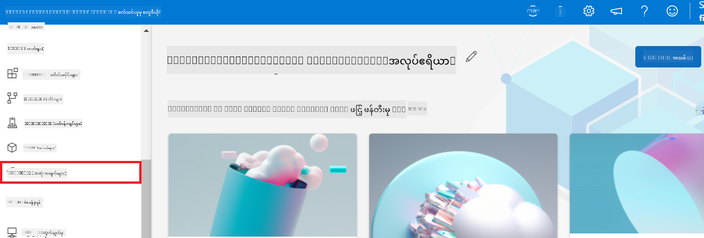

2. သင်ဖန်တီးထားသော endpoint ကို ရွေးချယ်ပါ။

    

3. ဒီစာမျက်နှာတွင် deployment လုပ်ငန်းစဉ်အတွင်း ဖန်တီးထားသော endpoints များကို စီမံခန့်ခွဲနိုင်ပါသည်။

## အခြေအနေ ၃: Prompt flow နှင့် ပေါင်းစည်းပြီး သင့်စိတ်ကြိုက်မော်ဒယ်ဖြင့် စကားပြောခြင်း

### သင့်စိတ်ကြိုက် Phi-3 မော်ဒယ်ကို Prompt flow နှင့် ပေါင်းစည်းခြင်း

သင့် fine-tuned မော်ဒယ်ကို အောင်မြင်စွာ deploy ပြီးနောက် Prompt flow နှင့် ပေါင်းစည်း၍ သင့်မော်ဒယ်ကို အချိန်နဲ့တပြေးညီ အသုံးပြုနိုင်ပြီး သင့်စိတ်ကြိုက် Phi-3 မော်ဒယ်ဖြင့် အမျိုးမျိုးသော အပြန်အလှန် လုပ်ဆောင်ချက်များ ပြုလုပ်နိုင်ပါသည်။

#### fine-tuned Phi-3 မော်ဒယ်၏ api key နှင့် endpoint uri ကို သတ်မှတ်ခြင်း

1. သင်ဖန်တီးထားသော Azure Machine learning workspace သို့ သွားပါ။
1. ဘယ်ဘက် tab မှ **Endpoints** ကို ရွေးချယ်ပါ။
1. သင်ဖန်တီးထားသော endpoint ကို ရွေးချယ်ပါ။
1. navigation menu မှ **Consume** ကို ရွေးချယ်ပါ။
1. သင့် **REST endpoint** ကို ကူးယူပြီး *config.py* ဖိုင်ထဲရှိ `AZURE_ML_ENDPOINT = "your_fine_tuned_model_endpoint_uri"` ကို သင့် **REST endpoint** ဖြင့် အစားထိုးပါ။
1. သင့် **Primary key** ကို ကူးယူပြီး *config.py* ဖိုင်ထဲရှိ `AZURE_ML_API_KEY = "your_fine_tuned_model_api_key"` ကို သင့် **Primary key** ဖြင့် အစားထိုးပါ။

    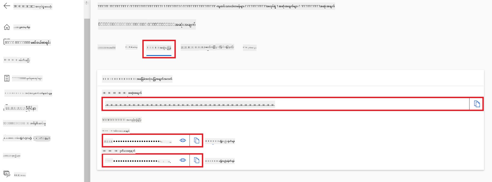

#### *flow.dag.yml* ဖိုင်ထဲ ကုဒ်ထည့်ခြင်း

1. Visual Studio Code တွင် *flow.dag.yml* ဖိုင်ကို ဖွင့်ပါ။

1. အောက်ပါကုဒ်ကို *flow.dag.yml* ထဲသို့ ထည့်ပါ။

    ```yml
    inputs:
      input_data:
        type: string
        default: "Who founded Microsoft?"

    outputs:
      answer:
        type: string
        reference: ${integrate_with_promptflow.output}

    nodes:
    - name: integrate_with_promptflow
      type: python
      source:
        type: code
        path: integrate_with_promptflow.py
      inputs:
        input_data: ${inputs.input_data}
    ```

#### *integrate_with_promptflow.py* ဖိုင်ထဲ ကုဒ်ထည့်ခြင်း

1. Visual Studio Code တွင် *integrate_with_promptflow.py* ဖိုင်ကို ဖွင့်ပါ။

1. အောက်ပါကုဒ်ကို *integrate_with_promptflow.py* ထဲသို့ ထည့်ပါ။

    ```python
    import logging
    import requests
    from promptflow.core import tool
    import asyncio
    import platform
    from config import (
        AZURE_ML_ENDPOINT,
        AZURE_ML_API_KEY
    )

    # Logging setup
    logging.basicConfig(
        format="%(asctime)s - %(levelname)s - %(name)s - %(message)s",
        datefmt="%Y-%m-%d %H:%M:%S",
        level=logging.DEBUG
    )
    logger = logging.getLogger(__name__)

    def query_azml_endpoint(input_data: list, endpoint_url: str, api_key: str) -> str:
        """
        Send a request to the Azure ML endpoint with the given input data.
        """
        headers = {
            "Content-Type": "application/json",
            "Authorization": f"Bearer {api_key}"
        }
        data = {
            "input_data": [input_data],
            "params": {
                "temperature": 0.7,
                "max_new_tokens": 128,
                "do_sample": True,
                "return_full_text": True
            }
        }
        try:
            response = requests.post(endpoint_url, json=data, headers=headers)
            response.raise_for_status()
            result = response.json()[0]
            logger.info("Successfully received response from Azure ML Endpoint.")
            return result
        except requests.exceptions.RequestException as e:
            logger.error(f"Error querying Azure ML Endpoint: {e}")
            raise

    def setup_asyncio_policy():
        """
        Setup asyncio event loop policy for Windows.
        """
        if platform.system() == 'Windows':
            asyncio.set_event_loop_policy(asyncio.WindowsSelectorEventLoopPolicy())
            logger.info("Set Windows asyncio event loop policy.")

    @tool
    def my_python_tool(input_data: str) -> str:
        """
        Tool function to process input data and query the Azure ML endpoint.
        """
        setup_asyncio_policy()
        return query_azml_endpoint(input_data, AZURE_ML_ENDPOINT, AZURE_ML_API_KEY)

    ```

### သင့်စိတ်ကြိုက်မော်ဒယ်ဖြင့် စကားပြောခြင်း

1. *deploy_model.py* စာရင်းကို အောက်ပါ command ဖြင့် run လုပ်ပြီး Azure Machine Learning တွင် deployment လုပ်ငန်းစဉ်ကို စတင်ပါ။

    ```python
    pf flow serve --source ./ --port 8080 --host localhost
    ```

1. ရလဒ်ဥပမာ - ယခု သင့်စိတ်ကြိုက် Phi-3 မော်ဒယ်နှင့် စကားပြောနိုင်ပါပြီ။ fine-tuning အတွက် အသုံးပြုထားသော ဒေတာအပေါ် အခြေခံ၍ မေးခွန်းများ မေးရန် အကြံပြုပါသည်။

    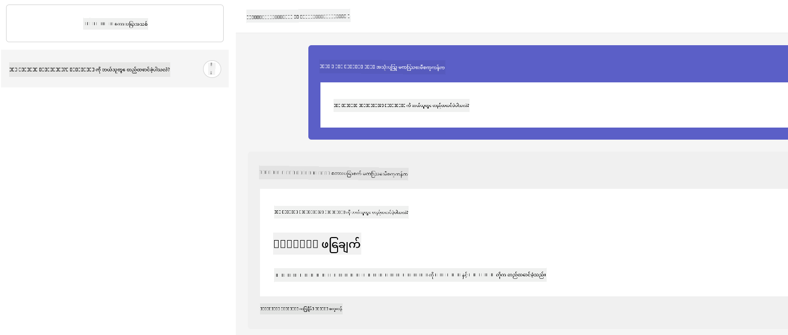

**အကြောင်းကြားချက်**  
ဤစာတမ်းကို AI ဘာသာပြန်ဝန်ဆောင်မှု [Co-op Translator](https://github.com/Azure/co-op-translator) ဖြင့် ဘာသာပြန်ထားပါသည်။ ကျွန်ုပ်တို့သည် တိကျမှန်ကန်မှုအတွက် ကြိုးစားသော်လည်း အလိုအလျောက် ဘာသာပြန်ခြင်းတွင် အမှားများ သို့မဟုတ် မှားယွင်းချက်များ ပါဝင်နိုင်ကြောင်း သတိပြုပါရန် မေတ္တာရပ်ခံအပ်ပါသည်။ မူရင်းစာတမ်းကို မူလဘာသာဖြင့်သာ တရားဝင်အချက်အလက်အဖြစ် ယူဆသင့်ပါသည်။ အရေးကြီးသော အချက်အလက်များအတွက် လူ့ဘာသာပြန်ပညာရှင်မှ ဘာသာပြန်ခြင်းကို အကြံပြုပါသည်။ ဤဘာသာပြန်ချက်ကို အသုံးပြုရာမှ ဖြစ်ပေါ်လာနိုင်သည့် နားလည်မှုမှားယွင်းမှုများအတွက် ကျွန်ုပ်တို့သည် တာဝန်မယူပါ။