# Prompt flow နှင့်အတူ ကိစၥရုပ် Phi-3 မော်ဒယ်များကို မှန်မှန်ကန်ကန် ပြင်ဆင်၍ ပေါင်းစပ်ခြင်း

Microsoft Tech Community မှ " [Prompt Flow ဖြင့် စိတ်ကြိုက် Phi-3 မော်ဒယ်များ ကို ရှင်းလင်းပြင်ဆင်ပြီး ပေါင်းစပ်ခြင်း: အဆင့်ဆင့် လမ်းညွှန်ချက်](https://techcommunity.microsoft.com/t5/educator-developer-blog/fine-tune-and-integrate-custom-phi-3-models-with-prompt-flow/ba-p/4178612?WT.mc_id=aiml-137032-kinfeylo) " လမ်းညွှန်ချက်အရ တည်ဆောက်ထားသော ဒီ end-to-end (E2E) နမူနာသည် စိတ်ကြိုက် Phi-3 မော်ဒယ်များကို မှန်မှန်ကန်ကန် ပြင်ဆင်ခြင်း၊ တပ်ဆင်ခြင်းနဲ့ Prompt flow နှင့် ပေါင်းစပ်ခြင်းလုပ်ငန်းစဉ်များကို မိတ်ဆက်ပေးပါသည်။

## အနှစ်ချုပ်

ဒီ E2E နမူနာမှာ Phi-3 မော်ဒယ်ကို ပြန်ပြင်၍ Prompt flow နှင့်ပေါင်းစပ်တာကို သင်ယူနိုင်မှာဖြစ်ပြီး Azure Machine Learning နှင့် Prompt flow ကို အသုံးပြုပြီး စိတ်ကြိုက် AI မော်ဒယ်များကို တပ်ဆင် အသုံးပြုနိုင်ရန် workflow တစ်ခု ချမှတ်ပေးပါမယ်။ ဒီ E2E နမူနာကို သုံးခွဲ သတ်မှတ်ချက်များသုံးခုအလိုက် ဖွဲ့စည်းထားသည်။

**သတ်မှတ်ချက် ၁: Azure အရင်းအမြစ်များ တပ်ဆင်ခြင်းနှင့် ပြင်ဆင်မှုအတွက် အသင့်ပြင်ဆင်ခြင်း**

**သတ်မှတ်ချက် ၂: Phi-3 မော်ဒယ် ပြုပြင်ခြင်းနှင့် Azure Machine Learning Studio တွင် တပ်ဆင်ခြင်း**

**သတ်မှတ်ချက် ၃: Prompt flow နှင့် ပေါင်းစပ်ပြီး သင့်စိတ်ကြိုက် မော်ဒယ်ဖြင့် စကားပြောခြင်း**

ဒီ E2E နမူနာ၏ အနှစ်ချုပ်မှာ ဒီအတိုင်းဖြစ်ပါတယ်။

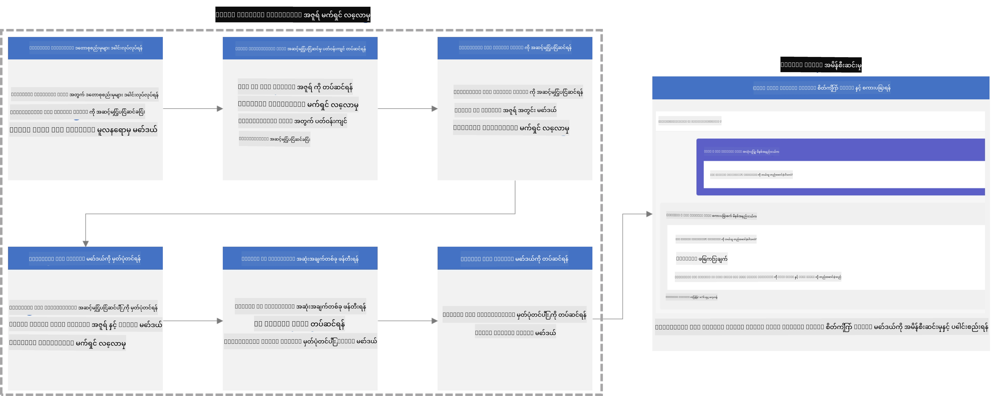

### အကြောင်းအရာ အညွှန်း

1. **[သတ်မှတ်ချက် ၁: Azure အရင်းအမြစ်များ တပ်ဆင်ခြင်းနှင့် ပြင်ဆင်မှုအတွက် အသင့်ပြင်ဆင်ခြင်း](#သတ်မှတ်ချက်-၁-azure-အရင်းအမြစ်များ-တပ်ဆင်ခြင်းနှင့်-ပြင်ဆင်မှုအတွက်-အသင့်ပြင်ဆင်ခြင်း)**
    - [Azure Machine Learning Workspace တည်ဆောက်ခြင်း](#azure-machine-learning-workspace-တည်ဆောက်ခြင်း)
    - [Azure Subscription တွင် GPU မှတ်ပုံတင် တောင်းဆိုခြင်း](#azure-subscription-တွင်-gpu-မှတ်ပုံတင်-တောင်းဆိုခြင်း)
    - [Role တာဝန်ပေးခြင်း](#role-တာဝန်ပေးခြင်း-ထည့်သွင်းခြင်း)
    - [Project တည်ဆောက်ခြင်း](#project-တည်ဆောက်ခြင်း)
    - [ပြင်ဆင်မှုအတွက် dataset ပြင်ဆင်ခြင်း](#fine-tuning-အတွက်-dataset-ပြင်ဆင်ခြင်း)

1. **[သတ်မှတ်ချက် ၂: Phi-3 မော်ဒယ် ပြုပြင်ခြင်းနှင့် Azure Machine Learning Studio တွင် တပ်ဆင်ခြင်း](#ဒုတိယ-အခန်းကဏ္ဍ-phi-3-မော်ဒယ်-fine-tune-လုပ်ပြီး-azure-machine-learning-studio-တွင်-deploy-ပြုလုပ်ခြင်း)**
    - [Azure CLI တပ်ဆင်ခြင်း](#azure-cli-ချိန်ညှိခြင်း)
    - [Phi-3 မော်ဒယ်ကို ပြင်ဆင်ခြင်း](#phi-3-မော်ဒယ်-fine-tune-လုပ်ခြင်း)
    - [ပြင်ဆင်ပြီးမော်ဒယ်ကို တပ်ဆင်ခြင်း](#fine-tuned-မော်ဒယ်ကို-deploy-ပြုလုပ်ခြင်း)

1. **[သတ်မှတ်ချက် ၃: Prompt flow နှင့် ပေါင်းစပ်ပြီး သင့်စိတ်ကြိုက်မော်ဒယ်ဖြင့် စကားပြောခြင်း](#အခြေအနေ-၃-prompt-flow-နှင့်ပေါင်းစပ်ပြီး-သင့်စိတ်ကြိုက်မော်ဒယ်နှင့်-စကားပြောရန်)**
    - [စိတ်ကြိုက် Phi-3 မော်ဒယ်ကို Prompt flow နှင့် ပေါင်းစပ်ခြင်း](#သင့်စိတ်ကြိုက်-phi-3-မော်ဒယ်ကို-prompt-flow-နှင့်ပေါင်းစပ်ခြင်း)
    - [စိတ်ကြိုက်မော်ဒယ် ဖြင့် စကားပြောခြင်း](#သင့်စိတ်ကြိုက်မော်ဒယ်နှင့်-စကားပြောခြင်း)

## သတ်မှတ်ချက် ၁: Azure အရင်းအမြစ်များ တပ်ဆင်ခြင်းနှင့် ပြင်ဆင်မှုအတွက် အသင့်ပြင်ဆင်ခြင်း

### Azure Machine Learning Workspace တည်ဆောက်ခြင်း

1. Portal စာမျက်နှာအပေါ်မှာ ရှာဖွေရေး အဆင့်ကျသော အပိုင်းတွင် *azure machine learning* ဟု ရိုက်ထည့်ပြီး စာရင်းထဲမှ **Azure Machine Learning** ကို ရွေးချယ်ပါ။

    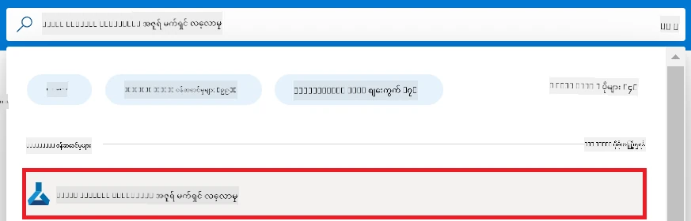

1. navigation menu မှ **+ Create** ကို ရွေးချယ်ပါ။

1. navigation menu မှ **New workspace** ကို ရွေးချယ်ပါ။

    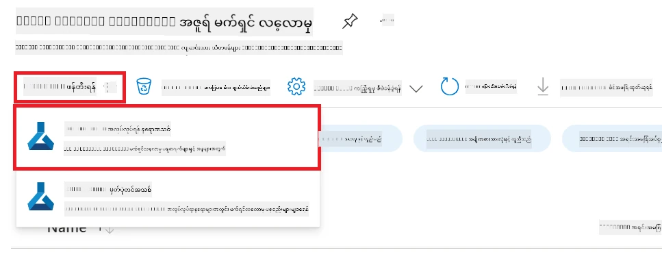

1. အောက်ပါ အလုပ်ဆောင်ချက်များ ဆောင်ရွက်ပါ။

    - သင့် Azure **Subscription** ကို ရွေးချယ်ပါ။
    - အသုံးပြုမည့် **Resource group** ကို ရွေးချယ်ပါ (လိုအပ်ပါက အသစ်တစ်ခု ဖန်တီးပါ)။
    - **Workspace Name** ထည့်ပါ။ တစ်ခုထူးခြားသော တန်ဖိုးဖြစ်ရပါမည်။
    - အသုံးပြုလိုသည့် **Region** ကို ရွေးချယ်ပါ။
    - အသုံးပြုမည့် **Storage account** ကို ရွေးချယ်ပါ (လိုအပ်ပါက အသစ်ဖန်တီးပါ)။
    - အသုံးပြုမည့် **Key vault** ကို ရွေးချယ်ပါ (လိုအပ်ပါက အသစ်ဖန်တီးပါ)။
    - အသုံးပြုမည့် **Application insights** ကို ရွေးချယ်ပါ (လိုအပ်ပါက အသစ်ဖန်တီးပါ)။
    - အသုံးပြုမည့် **Container registry** ကို ရွေးချယ်ပါ (လိုအပ်ပါက အသစ်ဖန်တီးပါ)။

    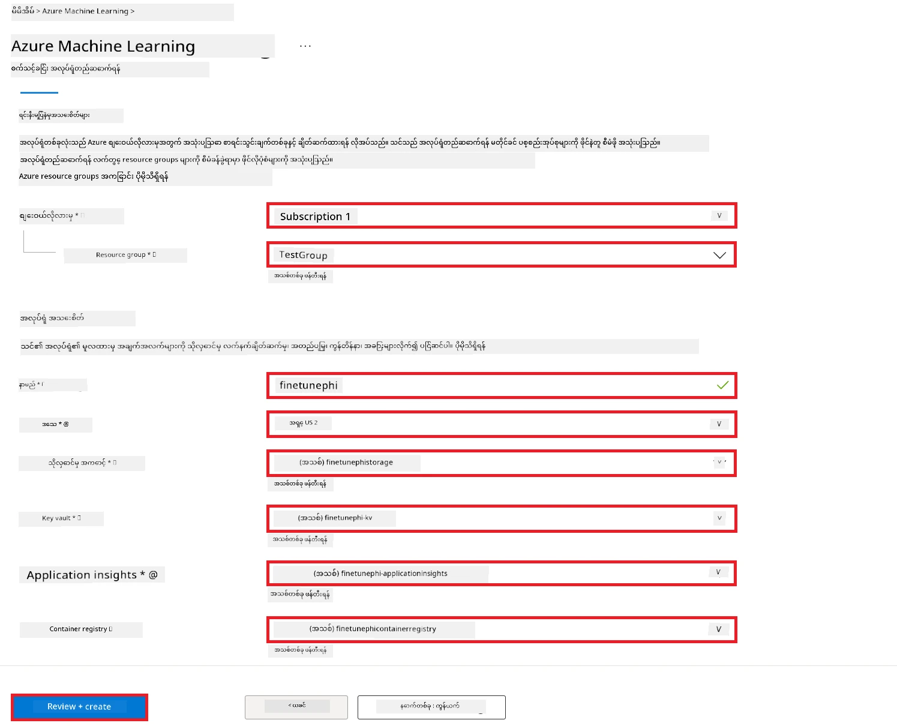

1. **Review + Create** ကို ရွေးချယ်ပါ။

1. **Create** ကို ရွေးချယ်ပါ။

### Azure Subscription တွင် GPU မှတ်ပုံတင် တောင်းဆိုခြင်း

ဒီ E2E နမူနာမှာ fine-tuning အတွက် *Standard_NC24ads_A100_v4 GPU* ကို အသုံးပြုမယ်၊ အဲဒါက quota request လုပ်ရန် လိုအပ်ပြီး၊ deployment အတွက် *Standard_E4s_v3* CPU ကို အသုံးပြုမယ်၊ အဲဒါက quota request လုပ်ရန် မလိုပါ။

> [!NOTE]
>
> GPU ကွေ့သည် Pay-As-You-Go subscription များတွင်သာ သုံးနိုင်ပြီး Benefit subscription များအား ထောက်ပံ့မထားပါ။
>
> Benefit subscription များနဲ့ (ဥပမာ Visual Studio Enterprise Subscription) သို့မဟုတ် fine-tuning နှင့် deployment လုပ်ငန်းစဉ်ကို မြန်မြန်စမ်းသပ်ချင်သူများအတွက် CPU ကို သေးငယ်တဲ့ dataset နဲ့ fine-tuning လုပ်နိုင်တဲ့ လမ်းညွှန်ချက်လည်း ပါဝင်သည်။ သို့သော် fine-tuning ရလဒ်များသည် GPU အသုံးပြုခြင်း၊ ပိုကြီးသော dataset နှင့်အတူ အသုံးပြုသောအခါ ပိုကောင်းသည်ကို သတိပြုပါ။

1. [Azure ML Studio](https://ml.azure.com/home?wt.mc_id=studentamb_279723) ကို သွားရောက်ပါ။

1. *Standard NCADSA100v4 Family* quota ကို တောင်းဆိုရန် အောက်ပါအလုပ်ဆောင်ချက်များ ဆောင်ရွက်ပါ။

    - ဘယ်ဘက် tab မှ **Quota** ကို ရွေးချယ်ပါ။
    - အသုံးပြုမည့် **Virtual machine family** ကို ရွေးချယ်ပါ။ ဥပမာ *Standard NCADSA100v4 Family Cluster Dedicated vCPUs* (Standard_NC24ads_A100_v4 GPU ပါသည်) ကို ရွေးပါ။
    - navigation menu မှ **Request quota** ကို ရွေးချယ်ပါ။

        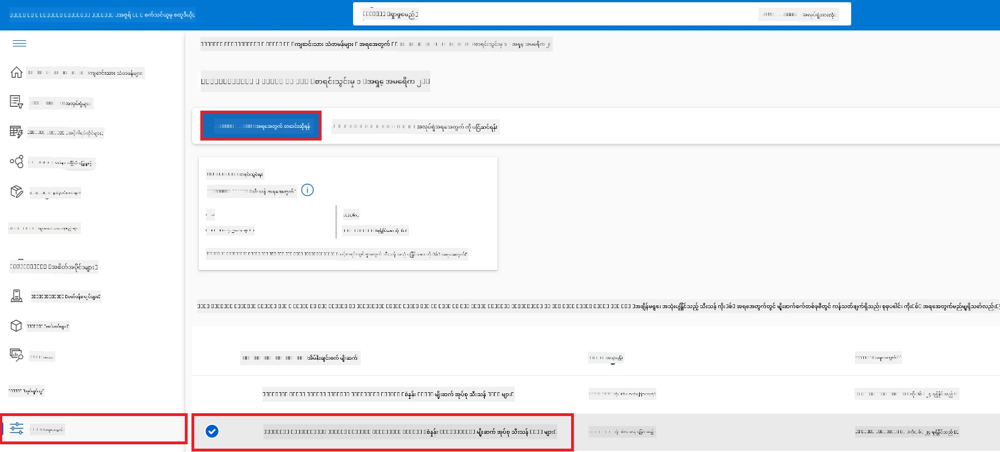

    - Request quota စာမျက်နှာတွင် အသုံးပြုလိုသော **New cores limit** ကို ထည့်ပါ (ဥပမာ 24)။
    - Request quota စာမျက်နှာတွင် **Submit** ကို နှိပ်၍ GPU quota တောင်းဆိုပါ။

> [!NOTE]
> သင့်လိုအပ်ချက်အတွက် သင့်တော်သော GPU သို့မဟုတ် CPU ကို ရွေးချယ်နိုင်ရန် [Sizes for Virtual Machines in Azure](https://learn.microsoft.com/azure/virtual-machines/sizes/overview?tabs=breakdownseries%2Cgeneralsizelist%2Ccomputesizelist%2Cmemorysizelist%2Cstoragesizelist%2Cgpusizelist%2Cfpgasizelist%2Chpcsizelist) စာရွက်ကို ကြည့်ရှုနိုင်သည်။

### Role တာဝန်ပေးခြင်း ထည့်သွင်းခြင်း

မော်ဒယ်များကို ပြင်ဆင်တပ်ဆင်ဖို့ User Assigned Managed Identity (UAI) တစ်ခု ဖန်တီးပြီး သင့်တပ်ဆင်မှုအတွက် လိုအပ်သော အခွင့်အရေးများပေးဖို့ လိုသည်။

#### User Assigned Managed Identity (UAI) ဖန်တီးခြင်း

1. Portal စာမျက်နှာအပေါ် ရှာဖွေရေး အဆင့်ကျသော အပိုင်းတွင် *managed identities* ဟု ရိုက်ထည့်ပြီး **Managed Identities** ကို ရွေးချယ်ပါ။

    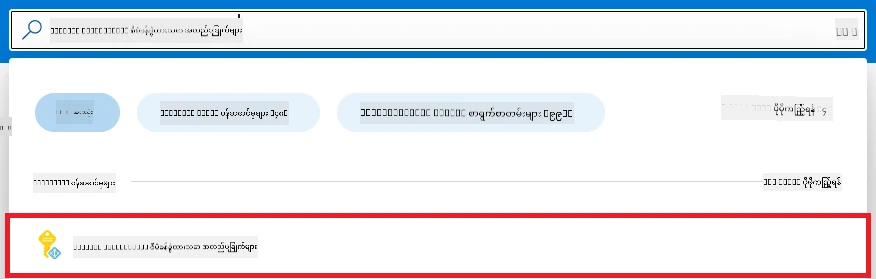

1. **+ Create** ကို ရွေးချယ်ပါ။

    

1. အောက်ပါအလုပ်ဆောင်ချက်များ ဆောင်ရွက်ပါ။

    - သင့် Azure **Subscription** ကို ရွေးချယ်ပါ။
    - အသုံးပြုမည့် **Resource group** ကို ရွေးချယ်ပါ (လိုအပ်ပါက အသစ် ဖန်တီးပါ)။
    - အသုံးပြုလိုသည့် **Region** ကို ရွေးချယ်ပါ။
    - **Name** ထည့်ပါ၊ တစ်ခုထူးခြားသောတန်ဖိုး ဖြစ်ရပါမည်။

1. **Review + create** ကို ရွေးချယ်ပါ။

1. **+ Create** ကို ရွေးချယ်ပါ။

#### Managed Identity ထံ Contributor role တာဝန်ပေးခြင်း ထည့်သွင်းခြင်း

1. ဖန်တီးပြီးသော Managed Identity အရင်းအမြစ်သို့ သွားပါ။

1. ဘယ်ဘက် tab မှ **Azure role assignments** ကို ရွေးချယ်ပါ။

1. navigation menu မှ **+Add role assignment** ကို ရွေးချယ်ပါ။

1. Add role assignment စာမျက်နှာအတွင်း အောက်ပါ အလုပ်ဆောင်ချက်များ ဆောင်ရွက်ပါ။
    - **Scope** ကို **Resource group** သို့ ပြောင်းပါ။
    - သင့် Azure **Subscription** ကို ရွေးချယ်ပါ။
    - အသုံးပြုမည့် **Resource group** ကို ရွေးချယ်ပါ။
    - **Role** ကို **Contributor** ဟု ရွေးချယ်ပါ။

    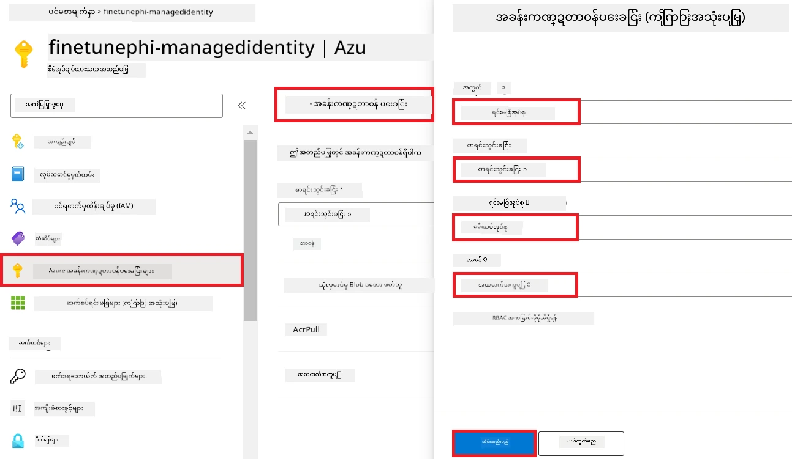

1. **Save** ကို နှိပ်ပါ။

#### Managed Identity ထံ Storage Blob Data Reader role တာဝန်ပေးခြင်း ထည့်သွင်းခြင်း

1. Portal စာမျက်နှာအပေါ် ရှာဖွေရေး အဆင့်ကျသော အပိုင်းတွင် *storage accounts* ဟု ရိုက်ထည့်ပြီး **Storage accounts** ကို ရွေးချယ်ပါ။

    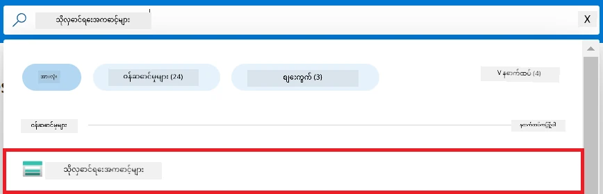

1. Azure Machine Learning workspace တည်ဆောက်ရာတွင် အသုံးပြုထားသော storage account ကို ရွေးချယ်ပါ။ ဥပမာ *finetunephistorage*။

1. Add role assignment စာမျက်နှာ သို့ သွားရှိရန် အောက်ပါ အလုပ်ဆောင်ချက်များ ဆောင်ရွက်ပါ။

    - ဖန်တီးထားသော Azure Storage account သို့ သွားပါ။
    - ဘယ်ဘက် tab မှ **Access Control (IAM)** ကို ရွေးချယ်ပါ။
    - navigation menu မှ **+ Add** ကို ရွေးချယ်ပါ။
    - navigation menu မှ **Add role assignment** ကို ရွေးချယ်ပါ။

    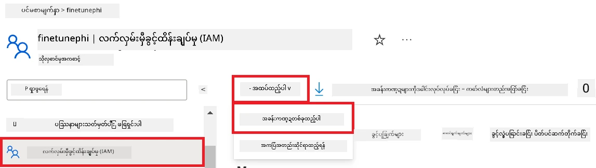

1. Add role assignment စာမျက်နှာအတွင်း အောက်ပါ အလုပ်ဆောင်ချက်များ ဆောင်ရွက်ပါ။

    - Role စာမျက်နှာတွင် *Storage Blob Data Reader* ဟု ရိုက်ထည့်ပြီး သက်ဆိုင်ရာ ရွေးချယ်ပါ။
    - Role စာမျက်နှာတွင် **Next** ကို နှိပ်ပါ။
    - Members စာမျက်နှာတွင် **Assign access to** အား **Managed identity** ဟု ရွေးပါ။
    - Members စာမျက်နှာတွင် **+ Select members** ကို နှိပ်ပါ။
    - Select managed identities စာမျက်နှာတွင် သင့် Azure **Subscription** ကို ရွေးချယ်ပါ။
    - Select managed identities စာမျက်နှာတွင် **Managed identity** အတွက် **Manage Identity** ကို ရွေးပါ။
    - Select managed identities စာမျက်နှာတွင် ဖန်တီးထားသော Manage Identity ကို ရွေးပါ။ ဥပမာ *finetunephi-managedidentity*။
    - Select managed identities စာမျက်နှာတွင် **Select** ကို နှိပ်ပါ။

    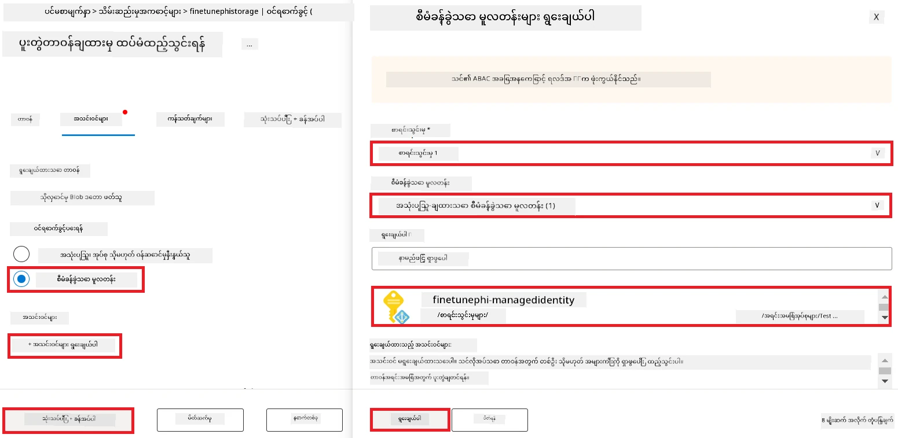

1. **Review + assign** ကို နှိပ်ပါ။

#### Managed Identity ထံ AcrPull role တာဝန်ပေးခြင်း ထည့်သွင်းခြင်း

1. Portal စာမျက်နှာအပေါ် ရှာဖွေရေး အဆင့်ကျသော အပိုင်းတွင် *container registries* ဟု ရိုက်ထည့်ပြီး **Container registries** ကို ရွေးချယ်ပါ။

    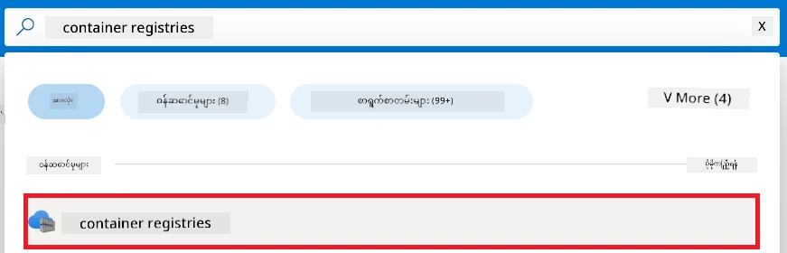

1. Azure Machine Learning workspace တွင် အသုံးပြုသော container registry ကို ရွေးချယ်ပါ။ ဥပမာ *finetunephicontainerregistries*။

1. Add role assignment သို့သွားရန် အောက်ပါ အလုပ်ဆောင်ချက်များ ဆောင်ရွက်ပါ။

    - ဘယ်ဘက် tab မှ **Access Control (IAM)** ကို ရွေးချယ်ပါ။
    - navigation menu မှ **+ Add** ကို ရွေးချယ်ပါ။
    - navigation menu မှ **Add role assignment** ကို ရွေးချယ်ပါ။

1. Add role assignment စာမျက်နှာတွင် အောက်ပါ အလုပ်များ ဆောင်ရွက်ပါ။

    - Role စာမျက်နှာတွင် *AcrPull* ဟု ရိုက်ထည့်ပြီး သက်ဆိုင်ရာ ရွေးချယ်ပါ။
    - Role စာမျက်နှာတွင် **Next** ကို နှိပ်ပါ။
    - Members စာမျက်နှာတွင် **Assign access to** အား **Managed identity** ဟု ရွေးပါ။
    - Members စာမျက်နှာတွင် **+ Select members** ကို နှိပ်ပါ။
    - Select managed identities စာမျက်နှာတွင် သင့် Azure **Subscription** ကို ရွေးချယ်ပါ။
    - Select managed identities စာမျက်နှာတွင် **Managed identity** အတွက် **Manage Identity** ကို ရွေးပါ။
    - Select managed identities စာမျက်နှာတွင် ဖန်တီးထားသော Manage Identity ကို ရွေးပါ။ ဥပမာ *finetunephi-managedidentity*။
    - Select managed identities စာမျက်နှာတွင် **Select** ကို နှိပ်ပါ။
    - **Review + assign** ကို ရွေးချယ်ပါ။

### Project တည်ဆောက်ခြင်း

ယခု သင်သည် အလုပ်လုပ်ရန် ဖိုလ်ဒါတစ်ခု ဖန်တီးပြီး အသုံးပြုသူများနှင့် ဆက်သွယ် ဆောင်ရွက်မည့် ပြုပြင်ရေးစနစ်တစ်ခု ဖန်တီးရာတွင် virtual environment ကို တည်ဆောက်သွားမှာဖြစ်သည်။ ထိုစနစ်တွင် Azure Cosmos DB တွင် သိမ်းဆည်းထားသော စကားပြောမှတ်တမ်းများကို အသုံးပြုပြီး တုံ့ပြန်ချက်ပေးသည်။

#### အလုပ်လုပ်မည့် ဖိုလ်ဒါ ဖန်တီးခြင်း

1. Terminal ဝင်းဒိုးဖြင့် *finetune-phi* ဟု နေရာအန္တရာယ်လမ်းကြောင်းတွင် ဖိုလ်ဒါဖန်တီးရန် အောက်ပါ command ကို ရိုက်ထည့်ပါ။

    ```console
    mkdir finetune-phi
    ```

1. ဖန်တီးထားသော *finetune-phi* ဖိုလ်ဒါထဲသို့ သွားရန် terminal တွင် အောက်ပါ command ကို ရိုက်ထည့်ပါ။

    ```console
    cd finetune-phi
    ```

#### Virtual environment တည်ဆောက်ခြင်း

1. *.venv* ဟု အမည်ပေးထားသော virtual environment ဖန်တီးရန် terminal တွင် နောက်ထပ် command ကို ရိုက်ထည့်ပါ။

    ```console
    python -m venv .venv
    ```

1. Virtual environment ကို ဖွင့်ရန် terminal တွင် အောက်ပါ command ကို ရိုက်ထည့်ပါ။

    ```console
    .venv\Scripts\activate.bat
    ```

> [!NOTE]
>
> အလုပ်လုပ်မှုမှန်ကန်ပါက command prompt မတိုင်မီ *(.venv)* ဟု မြင်ရပါလိမ့်မည်။

#### လိုအပ်သော packages များ ထည့်သွင်းခြင်း

1. လိုအပ်သော packages များ အပ်ဒိတ်အတွက် terminal ထဲတွင် အောက်ပါ command များ ရိုက်ထည့်ပါ။

    ```console
    pip install datasets==2.19.1
    pip install transformers==4.41.1
    pip install azure-ai-ml==1.16.0
    pip install torch==2.3.1
    pip install trl==0.9.4
    pip install promptflow==1.12.0
    ```

#### Project ဖိုင်များ ဖန်တီးခြင်း

ဒီ လေ့ကျင့်မှုမှာ စာရင်းထဲက အဓိကဖိုင်တွေမှာ dataset ကို ဒေါင်းလုပ်လုပ်တဲ့ script, Azure Machine Learning environment ကို ပြင်ဆင်ထားတဲ့ script, Phi-3 မော်ဒယ်ကို ပြင်ဆင်ရာ script နဲ့ ပြင်ဆင်ပြီး မော်ဒယ်ကို တပ်ဆင်တဲ့ script အပါအဝင် ဖိုင်တွေကို ဖန်တီးသွားမှာဖြစ်ပြီး fine-tuning environment အတွက် *conda.yml* ဖိုင်ကိုလည်း တည်ဆောက်ပါမယ်။

ဒီ လေ့ကျင့်မှုတွင် သင်လုပ်ဆောင်မည့်အချက်များမှာ -

- Dataset ကို ဒေါင်းလုပ်လုပ်ရန် *download_dataset.py* ဖိုင်တစ်ခု ဖန်တီးခြင်း။

- Azure Machine Learning ပတ်ဝန်းကျင်ကို စတင်ဆောက်လုပ်ရန် *setup_ml.py* ဖိုင်တစ်ခုဖန်တီးပါ။
- ဒေတာစနစ်ကို အသုံးပြုကာ Phi-3 မော်ဒယ်ကို တိကျစွာသင်ကြားရန်အတွက် *finetuning_dir* ဖိုလ်ဒါတွင် *fine_tune.py* ဖိုင်တစ်ခုဖန်တီးပါ။
- fine-tuning ပတ်ဝန်းကျင်ကို ဆောက်လုပ်ရန် *conda.yml* ဖိုင်တစ်ခုဖန်တီးပါ။
- fine-tuned မော်ဒယ်ကို deploy ပြုလုပ်ရန် *deploy_model.py* ဖိုင်တစ်ခုဖန်တီးပါ။
- fine-tuned မော်ဒယ်နှင့် Prompt flow ကို ပေါင်းစည်းအသုံးပြုရန်နှင့် မော်ဒယ်ကို Prompt flow ဖြင့် 실행ရန် *integrate_with_promptflow.py* ဖိုင်တစ်ခုဖန်တီးပါ။
- Prompt flow အတွက် workflow ဖွဲ့စည်းမှုကို စတင်ဆောက်လုပ်ရန် flow.dag.yml ဖိုင်တစ်ခု ဖန်တီးပါ။
- Azure သတင်းအချက်အလက်များကို ထည့်သွင်းရန် *config.py* ဖိုင်တစ်ခု ဖန်တီးပါ။

> [!NOTE]
>
> ပြည့်စုံသောဖိုလ်ဒါ ဖွဲ့စည်းမှု -
>
> ```text
> └── YourUserName
> .    └── finetune-phi
> .        ├── finetuning_dir
> .        │      └── fine_tune.py
> .        ├── conda.yml
> .        ├── config.py
> .        ├── deploy_model.py
> .        ├── download_dataset.py
> .        ├── flow.dag.yml
> .        ├── integrate_with_promptflow.py
> .        └── setup_ml.py
> ```

1. **Visual Studio Code** ကို ဖွင့်ပါ။

1. မီနူးဘားမှ **File** ကို ရွေးချယ်ပါ။

1. **Open Folder** ကို ရွေးချယ်ပါ။

1. သင်ဖန်တီးထားသော *finetune-phi* ဖိုလ်ဒါ၊ တည်နေရာမှာ *C:\Users\yourUserName\finetune-phi* ကို ရွေးချယ်ပါ။

    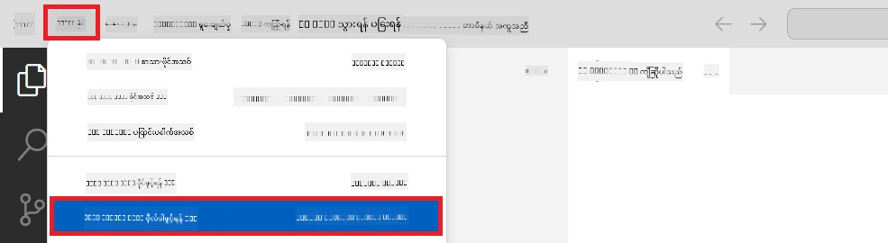

1. Visual Studio Code ၏ ဘယ်ဖက်ပောက်အရှေ့တွင် ညာနှိပ်ပြီး **New File** ကို ရွေးချယ်ကာ *download_dataset.py* ဆိုသော ဖိုင်အသစ်ကို ဖန်တီးပါ။

1. Visual Studio Code ၏ ဘယ်ဖက်ပောက်အရှေ့တွင် ညာနှိပ်ပြီး **New File** ကို ရွေးချယ်ကာ *setup_ml.py* ဆိုသော ဖိုင်အသစ်ကို ဖန်တီးပါ။

1. Visual Studio Code ၏ ဘယ်ဖက်ပောက်အရှေ့တွင် ညာနှိပ်ပြီး **New File** ကို ရွေးချယ်ကာ *deploy_model.py* ဆိုသော ဖိုင်အသစ်ကို ဖန်တီးပါ။

    

1. Visual Studio Code ၏ ဘယ်ဖက်ပေါ်တွင် ညာနှိပ်ပြီး **New Folder** ကို ရွေးချယ်ကာ *finetuning_dir* ဆိုသော ဖိုလ်ဒါအသစ်တစ်ခု ဖန်တီးပါ။

1. *finetuning_dir* ဖိုလ်ဒါအတွင်းတွင် *fine_tune.py* ဖိုင်အသစ်ကို ဖန်တီးပါ။

#### *conda.yml* ဖိုင် ဖန်တီး၍ ဆက်တင်လုပ်ငန်းများပြုလုပ်ခြင်း

1. Visual Studio Code ၏ ဘယ်ဖက်ပေါ်တွင် ညာနှိပ်ပြီး **New File** ကို ရွေးချယ်ကာ *conda.yml* ဖိုင်အသစ်ကို ဖန်တီးပါ။

1. Phi-3 မော်ဒယ်အတွက် fine-tuning ပတ်ဝန်းကျင်ကို စတင်ဆောက်လုပ်ရန် *conda.yml* ဖိုင်တွင် အောက်ပါ ကုဒ်များထည့်ပါ။

    ```yml
    name: phi-3-training-env
    channels:
      - defaults
      - conda-forge
    dependencies:
      - python=3.10
      - pip
      - numpy<2.0
      - pip:
          - torch==2.4.0
          - torchvision==0.19.0
          - trl==0.8.6
          - transformers==4.41
          - datasets==2.21.0
          - azureml-core==1.57.0
          - azure-storage-blob==12.19.0
          - azure-ai-ml==1.16
          - azure-identity==1.17.1
          - accelerate==0.33.0
          - mlflow==2.15.1
          - azureml-mlflow==1.57.0
    ```

#### *config.py* ဖိုင် ဖန်တီး၍ ဆက်တင်ပြင်ဆင်ခြင်း

1. Visual Studio Code ၏ ဘယ်ဖက်ပေါ်တွင် ညာနှိပ်ပြီး **New File** ကို ရွေးချယ်ကာ *config.py* ဖိုင်အသစ်ကို ဖန်တီးပါ။

1. Azure သတင်းအချက်အလက်များကို ထည့်သွင်းရန်အတွက် *config.py* ဖိုင်တွင် အောက်ပါ ကုဒ်များထည့်ပါ။

    ```python
    # Azure ဆက်တင်များ
    AZURE_SUBSCRIPTION_ID = "your_subscription_id"
    AZURE_RESOURCE_GROUP_NAME = "your_resource_group_name" # "TestGroup"

    # Azure Machine Learning ဆက်တင်များ
    AZURE_ML_WORKSPACE_NAME = "your_workspace_name" # "finetunephi-workspace"

    # Azure စီမံခန့်ခွဲသော ကိုယ်ပိုင်အတူတကွ အကြောင်းအရာများ
    AZURE_MANAGED_IDENTITY_CLIENT_ID = "your_azure_managed_identity_client_id"
    AZURE_MANAGED_IDENTITY_NAME = "your_azure_managed_identity_name" # "finetunephi-mangedidentity"
    AZURE_MANAGED_IDENTITY_RESOURCE_ID = f"/subscriptions/{AZURE_SUBSCRIPTION_ID}/resourceGroups/{AZURE_RESOURCE_GROUP_NAME}/providers/Microsoft.ManagedIdentity/userAssignedIdentities/{AZURE_MANAGED_IDENTITY_NAME}"

    # ဒေတာစုဆောင်းမှုဖိုင်လမ်းကြောင်းများ
    TRAIN_DATA_PATH = "data/train_data.jsonl"
    TEST_DATA_PATH = "data/test_data.jsonl"

    # ပြင်ဆင်ပြီး မော်ဒယ်ဆက်တင်များ
    AZURE_MODEL_NAME = "your_fine_tuned_model_name" # "finetune-phi-model"
    AZURE_ENDPOINT_NAME = "your_fine_tuned_model_endpoint_name" # "finetune-phi-endpoint"
    AZURE_DEPLOYMENT_NAME = "your_fine_tuned_model_deployment_name" # "finetune-phi-deployment"

    AZURE_ML_API_KEY = "your_fine_tuned_model_api_key"
    AZURE_ML_ENDPOINT = "your_fine_tuned_model_endpoint_uri" # "https://{your-endpoint-name}.{your-region}.inference.ml.azure.com/score"
    ```

#### Azure ပတ်ဝန်းကျင် environment variables ထည့်သွင်းခြင်း

1. Azure Subscription ID ထည့်ရန်အတွက် အောက်ပါ လုပ်ဆောင်ချက်များ ပြုလုပ်ပါ။

    - ပေါ်တယ်၏ အပေါ်အကြောင်းကြားစာသား search bar တွင် *subscriptions* ဟု ရိုက်ထည့်ပြီး ဖော်ပြသော options များထဲမှ **Subscriptions** ကို ရွေးချယ်ပါ။
    - သင့်ကေန အခုအသုံးပြုနေသော Azure Subscription ကို ရွေးချယ်ပါ။
    - Subscription ID ကို ကူးယူပြီး *config.py* ဖိုင်ထဲသို့ ပ Paste လုပ်ပါ။

    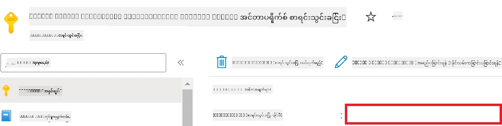

1. Azure Workspace Name ထည့်ရန်အတွက် အောက်ပါ လုပ်ဆောင်ချက်များ ပြုလုပ်ပါ။

    - ဖန်တီးထားသော Azure Machine Learning resource သို့ သွားပါ။
    - အကောင့်အမည်ကို ကူးယူပြီး *config.py* ဖိုင်ထဲသို့ ပ Paste လုပ်ပါ။

    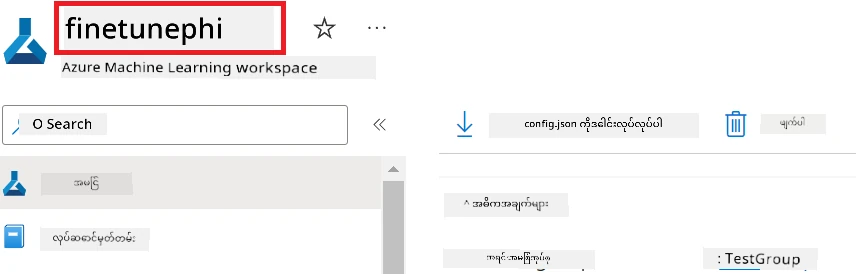

1. Azure Resource Group Name ထည့်ရန်အတွက် အောက်ပါ လုပ်ဆောင်ချက်များ ပြုလုပ်ပါ။

    - ဖန်တီးထားသော Azure Machine Learning resource သို့ သွားပါ။
    - Azure Resource Group Name ကို ကူးယူပြီး *config.py* ဖိုင်ထဲသို့ ပ Paste လုပ်ပါ။

    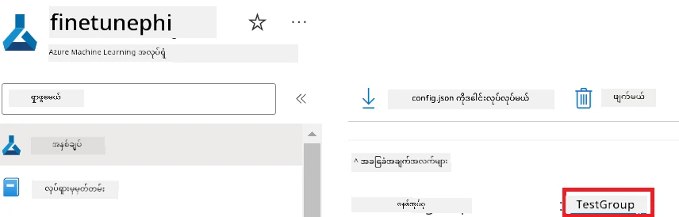

2. Azure Managed Identity အမည် ထည့်ရန် အောက်ပါ လုပ်ဆောင်ချက်များ ပြုလုပ်ပါ။

    - ဖန်တီးထားသော Managed Identities resource သို့ သွားပါ။
    - Azure Managed Identity အမည်ကို ကူးယူပြီး *config.py* ဖိုင်ထဲသို့ ပ Paste လုပ်ပါ။

    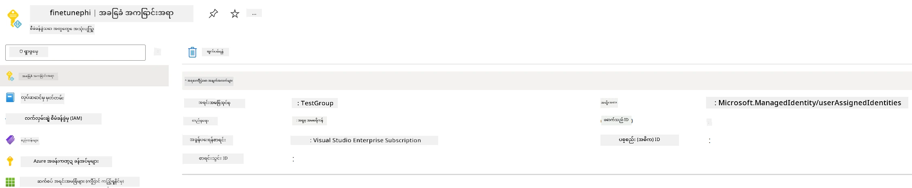

### fine-tuning အတွက် dataset ပြင်ဆင်ခြင်း

ဒီလေ့ကျင့်ခန်းတွင် *download_dataset.py* ဖိုင်ကို လည်ပတ်ကာ *ULTRACHAT_200k* dataset များကို သင့်ဒေသတွင် ဒေါင်းလုပ်လုပ်ပါမည်။ နောက်ဆုံးတွင် ဤ dataset များကို အသုံးပြုကာ Azure Machine Learning တွင် Phi-3 မော်ဒယ်ကို fine-tune ပြုလုပ်ပါမည်။

#### *download_dataset.py* ဖြင့် dataset ကို ဒေါင်းလုပ်လုပ်ခြင်း

1. Visual Studio Code တွင် *download_dataset.py* ဖိုင် ကို ဖွင့်ပါ။

1. အောက်ပါ ကုဒ်ကို *download_dataset.py* ထဲသို့ ထည့်သွင်းပါ။

    ```python
    import json
    import os
    from datasets import load_dataset
    from config import (
        TRAIN_DATA_PATH,
        TEST_DATA_PATH)

    def load_and_split_dataset(dataset_name, config_name, split_ratio):
        """
        Load and split a dataset.
        """
        # သတ်မှတ်ထားသောနာမည်၊ ဖွဲ့စည်းမှုနှင့် ခွဲခြားအချိုးအစားဖြင့် ဒေတာစုစည်းမှုကို ဖွင့်ပါ
        dataset = load_dataset(dataset_name, config_name, split=split_ratio)
        print(f"Original dataset size: {len(dataset)}")
        
        # ဒေတာစုစည်းမှုကို သင်ကြားမှုနှင့် စမ်းသပ်မှု အစုအဖွဲ့များ (သင်ကြားမှု ၈၀%၊ စမ်းသပ်မှု ၂၀%) ခွဲထုတ်ပါ
        split_dataset = dataset.train_test_split(test_size=0.2)
        print(f"Train dataset size: {len(split_dataset['train'])}")
        print(f"Test dataset size: {len(split_dataset['test'])}")
        
        return split_dataset

    def save_dataset_to_jsonl(dataset, filepath):
        """
        Save a dataset to a JSONL file.
        """
        # မရှိပါက ဖိုင်ဖိုလ်ဒါကို ဖန်တီးပါ
        os.makedirs(os.path.dirname(filepath), exist_ok=True)
        
        # ဖိုင်ကို ရေးသည့် မုဒ်ဖြင့် ဖွင့်ပါ
        with open(filepath, 'w', encoding='utf-8') as f:
            # ဒေတာစုစည်းမှုရှိ တစ်ခုချင်းစီသော မှတ်တမ်းများကို လည်ပတ်ပါ
            for record in dataset:
                # မှတ်တမ်းကို JSON အရာဝတ္ထုအနေနဲ့ ဒေါင်းလုပ်ဆွဲပြီး ဖိုင်ထဲသို့ ရေးပါ
                json.dump(record, f)
                # မှတ်တမ်းများကို ခွဲခြားရန် လိုင်း အသစ်အက္ခရာ ထည့်ပါ
                f.write('\n')
        
        print(f"Dataset saved to {filepath}")

    def main():
        """
        Main function to load, split, and save the dataset.
        """
        # သတ်မှတ်ထားသော ဖွဲ့စည်းမှုနှင့် ခွဲခြားအချိုးအစားဖြင့် ULTRACHAT_200k ဒေတာစုစည်းမှုကို ဖွင့်ပြီး ခွဲပါ
        dataset = load_and_split_dataset("HuggingFaceH4/ultrachat_200k", 'default', 'train_sft[:1%]')
        
        # ခွဲထုတ်ထားသော အစုများမှ သင်ကြားမှုနှင့် စမ်းသပ်မှု ဒေတာစုစည်းမှုများကို ဆွဲထုတ်ပါ
        train_dataset = dataset['train']
        test_dataset = dataset['test']

        # သင်ကြားမှု ဒေတာစုစည်းမှုကို JSONL ဖိုင်တွင် သိမ်းဆည်းပါ
        save_dataset_to_jsonl(train_dataset, TRAIN_DATA_PATH)
        
        # စမ်းသပ်မှု ဒေတာစုစည်းမှုကို အခြား JSONL ဖိုင်တစ်ခုတွင် သိမ်းဆည်းပါ
        save_dataset_to_jsonl(test_dataset, TEST_DATA_PATH)

    if __name__ == "__main__":
        main()

    ```

> [!TIP]
>
> **CPU အသုံးပြု၍ အနည်းဆုံး dataset ဖြင့် fine-tuning လုပ်ခြင်းအတွက် ညွှန်ကြားချက်**
>
> CPU ကို အသုံးပြုကာ fine-tuning လုပ်လိုပါက၊ ဤနည်းလမ်းသည် benefit subscription (ဥပမာ Visual Studio Enterprise Subscription) အတွက် သင့်တော်ပြီး၊ fine-tuning နှင့် deployment လုပ်ငန်းစဉ်ကို လျင်မြန်စွာ စမ်းသပ်လိုသူများအတွက် ရည်ရွယ်သည်။
>
> `dataset = load_and_split_dataset("HuggingFaceH4/ultrachat_200k", 'default', 'train_sft[:1%]')` ကို `dataset = load_and_split_dataset("HuggingFaceH4/ultrachat_200k", 'default', 'train_sft[:10]')` ဖြင့် အစားထိုးပါ။
>

1. သင့် terminal မှာ အောက်ပါ command ကို ရိုက်ထည့်ကာ script ကို 실행၍ ဒေတာများကို ဒေသခံ ပတ်ဝန်းကျင်သို့ ဒေါင်းလုပ်လုပ်ပါ။

    ```console
    python download_data.py
    ```

1. ဒေတာများကို သင့်ဒေသခံ *finetune-phi/data* directory ထဲသို့ အောင်မြင်စွာ သိမ်းဆည်းထားကြောင်း စစ်ဆေးပါ။

> [!NOTE]
>
> **Dataset အရွယ်အစားနှင့် fine-tuning အချိန်**
>
> ဤ E2E နမူနာတွင် dataset ၏ 1% (`train_sft[:1%]`) ကိုသာ အသုံးပြုသည်။ ၎င်းသည်ဒေတာပမာဏကို လျော့ခ်ပြီး upload နှင့် fine-tuning လုပ်ငန်းစဉ်တို့ကို နှေးကွေးမှုမရှိစေပါ။ သင့်တော်သောသင်ကြားချိန်နှင့် မော်ဒယ် စွမ်းဆောင်ရည်အလျောက် ရှေ့နောက်ညှိနှိုင်းနိုင်သည်။ Dataset ၏ အနည်းငယ်သာ အသုံးပြုခြင်းသည် fine-tuning လုပ်ငန်းစဉ်အချိန်ကို လျော့ချပေးပြီး E2E နမူနာအတွက် လွယ်ကူစေသည်။

## ဒုတိယ အခန်းကဏ္ဍ- Phi-3 မော်ဒယ် fine-tune လုပ်ပြီး Azure Machine Learning Studio တွင် Deploy ပြုလုပ်ခြင်း

### Azure CLI ချိန်ညှိခြင်း

သင်၏ ပတ်ဝန်းကျင် အချိတ်အဆက် ပြုလုပ်ရန် Azure CLI ကို ဆက်တင်လုပ်ထားရမည်။ Azure CLI သည် command line မှတဆင့် Azure ရင်းမြစ်များကို တိုက်ရိုက်စီမံခန့်ခွဲခြင်းနဲ့ Azure Machine Learning သုံးမှုအတွက် လိုအပ်သော ချိတ်ဆက်သက်မှတ်ချက်များကို ပေးသည်။ စတင်ရန် [Azure CLI](https://learn.microsoft.com/cli/azure/install-azure-cli) ကို 설치 လုပ်ပါ။

1. terminal ပြတင်းပိတ်ကို ဖွင့်ကာ သင့် Azure အကောင့်သို့ လော့ဂ်အင် ဝင်ရန် အောက်ပါ command ကို ရိုက်ထည့်ပါ။

    ```console
    az login
    ```

1. သင့် Azure အကောင့်ကို ရွေးချယ်ပြီး သုံးပါ။

1. သင့် Azure subscription ကို ရွေးချယ်ပြီး အသုံးပြုပါ။

    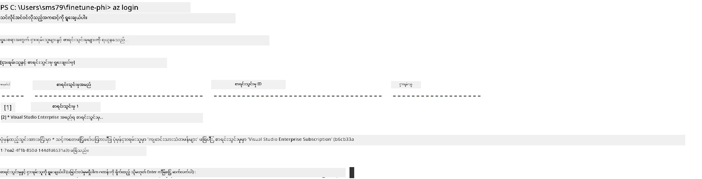

> [!TIP]
>
> Azure မှ ဝင်ရောက်ရန် အခက်အခဲရှိပါက device code အသုံးပြုပါ။ terminal ပြတင်းပိတ်ကို ဖွင့်ကာ အောက်ပါ command ဖြင့် Azure အကောင့်သို့ ဝင်ရောက်နိုင်သည်။
>
> ```console
> az login --use-device-code
> ```
>

### Phi-3 မော်ဒယ် fine-tune လုပ်ခြင်း

ဤလေ့ကျင့်ခန်းတွင် ပေးထားသော dataset သုံးပြီး Phi-3 မော်ဒယ်ကို fine-tune လုပ်ပါမည်။ ပထမဆုံး *fine_tune.py* ဖိုင်တွင် fine-tuning လုပ်ငန်းစဉ်ကို သတ်မှတ်ပါမည်။ ထို့နောက် Azure Machine Learning ပတ်ဝန်းကျင်ကို ဆက်တင်ပြင်ဆင်၍ *setup_ml.py* ဖိုင်ကို 실행ကာ fine-tuning လုပ်ငန်းစဉ်ကို စတင်ပါမည်။ ဤ script သည် Azure Machine Learning ပတ်ဝန်းကျင်အတွင်း ချိန်ညှိ fine-tuning ကို အာမခံသည်။

*setup_ml.py* ကို 실행ခြင်းအားဖြင့် Azure Machine Learning ပတ်ဝန်းကျင်တွင် fine-tuning လုပ်ငန်းစဉ်ကို လည်ပတ်စေနိုင်သည်။

#### *fine_tune.py* ဖိုင်သို့ ကုဒ်ထည့်သွင်းခြင်း

1. *finetuning_dir* ဖိုလ်ဒါသို့ သွား၍ *fine_tune.py* ဖိုင်ကို Visual Studio Code တွင် ဖွင့်ပါ။

1. အောက်ပါ ကုဒ်များကို *fine_tune.py* ဖိုင်တွင် ထည့်သွင်းပါ။

    ```python
    import argparse
    import sys
    import logging
    import os
    from datasets import load_dataset
    import torch
    import mlflow
    from transformers import AutoModelForCausalLM, AutoTokenizer, TrainingArguments
    from trl import SFTTrainer

    # MLflow တွင် INVALID_PARAMETER_VALUE အမှားကိုရှောင်ရန် MLflow ပေါင်းစည်းမှုကိုပိတ်ပါ
    os.environ["DISABLE_MLFLOW_INTEGRATION"] = "True"

    # မှတ်တမ်းတင်ခြင်း စနစ်တည်ဆောက်မှု
    logging.basicConfig(
        format="%(asctime)s - %(levelname)s - %(name)s - %(message)s",
        datefmt="%Y-%m-%d %H:%M:%S",
        handlers=[logging.StreamHandler(sys.stdout)],
        level=logging.WARNING
    )
    logger = logging.getLogger(__name__)

    def initialize_model_and_tokenizer(model_name, model_kwargs):
        """
        Initialize the model and tokenizer with the given pretrained model name and arguments.
        """
        model = AutoModelForCausalLM.from_pretrained(model_name, **model_kwargs)
        tokenizer = AutoTokenizer.from_pretrained(model_name)
        tokenizer.model_max_length = 2048
        tokenizer.pad_token = tokenizer.unk_token
        tokenizer.pad_token_id = tokenizer.convert_tokens_to_ids(tokenizer.pad_token)
        tokenizer.padding_side = 'right'
        return model, tokenizer

    def apply_chat_template(example, tokenizer):
        """
        Apply a chat template to tokenize messages in the example.
        """
        messages = example["messages"]
        if messages[0]["role"] != "system":
            messages.insert(0, {"role": "system", "content": ""})
        example["text"] = tokenizer.apply_chat_template(
            messages, tokenize=False, add_generation_prompt=False
        )
        return example

    def load_and_preprocess_data(train_filepath, test_filepath, tokenizer):
        """
        Load and preprocess the dataset.
        """
        train_dataset = load_dataset('json', data_files=train_filepath, split='train')
        test_dataset = load_dataset('json', data_files=test_filepath, split='train')
        column_names = list(train_dataset.features)

        train_dataset = train_dataset.map(
            apply_chat_template,
            fn_kwargs={"tokenizer": tokenizer},
            num_proc=10,
            remove_columns=column_names,
            desc="Applying chat template to train dataset",
        )

        test_dataset = test_dataset.map(
            apply_chat_template,
            fn_kwargs={"tokenizer": tokenizer},
            num_proc=10,
            remove_columns=column_names,
            desc="Applying chat template to test dataset",
        )

        return train_dataset, test_dataset

    def train_and_evaluate_model(train_dataset, test_dataset, model, tokenizer, output_dir):
        """
        Train and evaluate the model.
        """
        training_args = TrainingArguments(
            bf16=True,
            do_eval=True,
            output_dir=output_dir,
            eval_strategy="epoch",
            learning_rate=5.0e-06,
            logging_steps=20,
            lr_scheduler_type="cosine",
            num_train_epochs=3,
            overwrite_output_dir=True,
            per_device_eval_batch_size=4,
            per_device_train_batch_size=4,
            remove_unused_columns=True,
            save_steps=500,
            seed=0,
            gradient_checkpointing=True,
            gradient_accumulation_steps=1,
            warmup_ratio=0.2,
        )

        trainer = SFTTrainer(
            model=model,
            args=training_args,
            train_dataset=train_dataset,
            eval_dataset=test_dataset,
            max_seq_length=2048,
            dataset_text_field="text",
            tokenizer=tokenizer,
            packing=True
        )

        train_result = trainer.train()
        trainer.log_metrics("train", train_result.metrics)

        mlflow.transformers.log_model(
            transformers_model={"model": trainer.model, "tokenizer": tokenizer},
            artifact_path=output_dir,
        )

        tokenizer.padding_side = 'left'
        eval_metrics = trainer.evaluate()
        eval_metrics["eval_samples"] = len(test_dataset)
        trainer.log_metrics("eval", eval_metrics)

    def main(train_file, eval_file, model_output_dir):
        """
        Main function to fine-tune the model.
        """
        model_kwargs = {
            "use_cache": False,
            "trust_remote_code": True,
            "torch_dtype": torch.bfloat16,
            "device_map": None,
            "attn_implementation": "eager"
        }

        # pretrained_model_name = "microsoft/Phi-3-mini-4k-instruct"
        pretrained_model_name = "microsoft/Phi-3.5-mini-instruct"

        with mlflow.start_run():
            model, tokenizer = initialize_model_and_tokenizer(pretrained_model_name, model_kwargs)
            train_dataset, test_dataset = load_and_preprocess_data(train_file, eval_file, tokenizer)
            train_and_evaluate_model(train_dataset, test_dataset, model, tokenizer, model_output_dir)

    if __name__ == "__main__":
        parser = argparse.ArgumentParser()
        parser.add_argument("--train-file", type=str, required=True, help="Path to the training data")
        parser.add_argument("--eval-file", type=str, required=True, help="Path to the evaluation data")
        parser.add_argument("--model_output_dir", type=str, required=True, help="Directory to save the fine-tuned model")
        args = parser.parse_args()
        main(args.train_file, args.eval_file, args.model_output_dir)

    ```

1. *fine_tune.py* ဖိုင်ကို သိမ်းပြီး ပိတ်ပါ။

> [!TIP]
> **Phi-3.5 မော်ဒယ်ကိုလည်း fine-tune လုပ်နိုင်သည်**
>
> *fine_tune.py* ဖိုင်တွင် `pretrained_model_name` ကို `"microsoft/Phi-3-mini-4k-instruct"` မှ `"microsoft/Phi-3.5-mini-instruct"` သို့မဟုတ် သင်လိုချင်သည့် မော်ဒယ်အမည်သို့ ပြောင်းလဲနိုင်သည်။ သင်စိတ်ပါဝင်စားသည့် မော်ဒယ်အမည်ကို ရှာဖွေရန် [Hugging Face](https://huggingface.co/) သို့ သွားပြီး သင်ရွေးချယ်သော မော်ဒယ်အမည်ကို ကူးယူပြီး script အတွင်း `pretrained_model_name` သို့ ထည့်ပါ။
>
> <image type="content" src="../../../../imgs/02/FineTuning-PromptFlow/finetunephi3.5.png" alt-text="Fine tune Phi-3.5.">
>

#### *setup_ml.py* ဖိုင်ထဲသို့ ကုဒ်ထည့်သွင်းခြင်း

1. *setup_ml.py* ဖိုင်ကို Visual Studio Code တွင် ဖွင့်ပါ။

1. အောက်ပါ ကုဒ်ကို *setup_ml.py* ဖိုင်ထဲသို့ ထည့်ပါ။

    ```python
    import logging
    from azure.ai.ml import MLClient, command, Input
    from azure.ai.ml.entities import Environment, AmlCompute
    from azure.identity import AzureCliCredential
    from config import (
        AZURE_SUBSCRIPTION_ID,
        AZURE_RESOURCE_GROUP_NAME,
        AZURE_ML_WORKSPACE_NAME,
        TRAIN_DATA_PATH,
        TEST_DATA_PATH
    )

    # အမြဲတမ်းတန်ဖိုးများ

    # သင်ကြားမှုအတွက် CPU အ实例 အသုံးပြုရန် အောက်ပါလိုင်းများမှ remark မယူပါ
    # COMPUTE_INSTANCE_TYPE = "Standard_E16s_v3" # cpu
    # COMPUTE_NAME = "cpu-e16s-v3"
    # DOCKER_IMAGE_NAME = "mcr.microsoft.com/azureml/openmpi4.1.0-ubuntu20.04:latest"

    # သင်ကြားမှုအတွက် GPU အ实例 အသုံးပြုရန် အောက်ပါလိုင်းများမှ remark မယူပါ
    COMPUTE_INSTANCE_TYPE = "Standard_NC24ads_A100_v4"
    COMPUTE_NAME = "gpu-nc24s-a100-v4"
    DOCKER_IMAGE_NAME = "mcr.microsoft.com/azureml/curated/acft-hf-nlp-gpu:59"

    CONDA_FILE = "conda.yml"
    LOCATION = "eastus2" # သင့် compute cluster のတည်နေရာဖြင့် အစားထိုးပါ
    FINETUNING_DIR = "./finetuning_dir" # fine-tuning script ၏ လမ်းကြောင်း
    TRAINING_ENV_NAME = "phi-3-training-environment" # သင်ကြားမှုပတ်ဝန်းကျင်အမည်
    MODEL_OUTPUT_DIR = "./model_output" # azure ml တွင် မော်ဒယ်ထွက်နိုင်ရာ directory ၏ လမ်းကြောင်း

    # သင်ကြားမှုလုပ်ငန်းစဉ် စောင့်ကြည့်ရေး logging ပြင်ဆင်မှု
    logger = logging.getLogger(__name__)
    logging.basicConfig(
        format="%(asctime)s - %(levelname)s - %(name)s - %(message)s",
        datefmt="%Y-%m-%d %H:%M:%S",
        level=logging.WARNING
    )

    def get_ml_client():
        """
        Initialize the ML Client using Azure CLI credentials.
        """
        credential = AzureCliCredential()
        return MLClient(credential, AZURE_SUBSCRIPTION_ID, AZURE_RESOURCE_GROUP_NAME, AZURE_ML_WORKSPACE_NAME)

    def create_or_get_environment(ml_client):
        """
        Create or update the training environment in Azure ML.
        """
        env = Environment(
            image=DOCKER_IMAGE_NAME,  # ပတ်ဝန်းကျင်အတွက် Docker image
            conda_file=CONDA_FILE,  # Conda ပတ်ဝန်းကျင် ဖိုင်
            name=TRAINING_ENV_NAME,  # ပတ်ဝန်းကျင်အမည်
        )
        return ml_client.environments.create_or_update(env)

    def create_or_get_compute_cluster(ml_client, compute_name, COMPUTE_INSTANCE_TYPE, location):
        """
        Create or update the compute cluster in Azure ML.
        """
        try:
            compute_cluster = ml_client.compute.get(compute_name)
            logger.info(f"Compute cluster '{compute_name}' already exists. Reusing it for the current run.")
        except Exception:
            logger.info(f"Compute cluster '{compute_name}' does not exist. Creating a new one with size {COMPUTE_INSTANCE_TYPE}.")
            compute_cluster = AmlCompute(
                name=compute_name,
                size=COMPUTE_INSTANCE_TYPE,
                location=location,
                tier="Dedicated",  # compute cluster တန်းများ
                min_instances=0,  # အနည်းဆုံး ဂဏန်း
                max_instances=1  # အများဆုံး ဂဏန်း
            )
            ml_client.compute.begin_create_or_update(compute_cluster).wait()  # cluster ဖန်တီးပြီးမရမချင်း စောင့်ပါ
        return compute_cluster

    def create_fine_tuning_job(env, compute_name):
        """
        Set up the fine-tuning job in Azure ML.
        """
        return command(
            code=FINETUNING_DIR,  # fine_tune.py ၏ လမ်းကြောင်း
            command=(
                "python fine_tune.py "
                "--train-file ${{inputs.train_file}} "
                "--eval-file ${{inputs.eval_file}} "
                "--model_output_dir ${{inputs.model_output}}"
            ),
            environment=env,  # သင်ကြားမှုပတ်ဝန်းကျင်
            compute=compute_name,  # အသုံးပြုမည့် compute cluster
            inputs={
                "train_file": Input(type="uri_file", path=TRAIN_DATA_PATH),  # သင်ကြားမှုဒေတာဖိုင်၏ လမ်းကြောင်း
                "eval_file": Input(type="uri_file", path=TEST_DATA_PATH),  # အကဲဖြတ်မှုဒေတာဖိုင်၏ လမ်းကြောင်း
                "model_output": MODEL_OUTPUT_DIR
            }
        )

    def main():
        """
        Main function to set up and run the fine-tuning job in Azure ML.
        """
        # ML Client ကို စတင်ဖန်တီးပါ
        ml_client = get_ml_client()

        # ပတ်ဝန်းကျင် ဖန်တီးပါ
        env = create_or_get_environment(ml_client)
        
        # ရှိပြီးသား compute cluster ကို ဖန်တီး သို့မဟုတ် ရယူပါ
        create_or_get_compute_cluster(ml_client, COMPUTE_NAME, COMPUTE_INSTANCE_TYPE, LOCATION)

        # Fine-Tuning အလုပ်ကို ဖန်တီး ထည့်သွင်းပါ
        job = create_fine_tuning_job(env, COMPUTE_NAME)
        returned_job = ml_client.jobs.create_or_update(job)  # အလုပ်ကို တင်ပြပါ
        ml_client.jobs.stream(returned_job.name)  # အလုပ်ရဲ့ logs ကို စီးဆင်းပါ
        
        # အလုပ်နာမည်ကို ဖမ်းယူပါ
        job_name = returned_job.name
        print(f"Job name: {job_name}")

    if __name__ == "__main__":
        main()

    ```

1. `COMPUTE_INSTANCE_TYPE`, `COMPUTE_NAME`, နှင့် `LOCATION` ကို သင်၏ အသေးစိတ်အချက်အလက်များဖြင့် အစားထိုးပါ။

    ```python
   # သင်ကြားရေးအတွက် GPU အင်စတာန်စ်အသုံးပြုရန် အောက်ပါလိုင်းများကို မှတ်ချက်ဖြုတ်ပါ
    COMPUTE_INSTANCE_TYPE = "Standard_NC24ads_A100_v4"
    COMPUTE_NAME = "gpu-nc24s-a100-v4"
    ...
    LOCATION = "eastus2" # သင့်တွက်ချက်ချက်အစုအဝေးတည်နေရာဖြင့် အစားထိုးပါ
    ```

> [!TIP]
>
> **CPU အသုံးပြု၍ အနည်းငယ် dataset ဖြင့် fine-tuning လုပ်ခြင်းအတွက် ညွှန်ကြားချက်**
>
> CPU ကို ပြုလုပ်သည့် အခါ၊ ဤနည်းလမ်းသည် benefit subscription များ (ဥပမာ Visual Studio Enterprise Subscription) သုံးသူများနှင့် fine-tuning/deployment တိုင်းတာခြင်းအတွက် အကောင်းဆုံးဖြစ်သည်။
>
> 1. *setup_ml* ဖိုင်ကို ဖွင့်ပါ။
> 1. `COMPUTE_INSTANCE_TYPE`, `COMPUTE_NAME`, နှင့် `DOCKER_IMAGE_NAME` ကို အောက်တွင် ဖော်ပြထားသောအတိုင်း ပြောင်းလဲပါ။ *Standard_E16s_v3* အတွက် ဝင်ခွင့်မရှိပါက အစားထိုး CPU instance တစ်ခု သို့မဟုတ် အသစ်တောင်းခံနိုင်ပါသည်။
> 1. `LOCATION` ကို သင်၏ အသေးစိတ်အချက်အလက်များဖြင့် ပြောင်းပါ။
>
>    ```python
>    # Uncomment the following lines to use a CPU instance for training
>    COMPUTE_INSTANCE_TYPE = "Standard_E16s_v3" # cpu
>    COMPUTE_NAME = "cpu-e16s-v3"
>    DOCKER_IMAGE_NAME = "mcr.microsoft.com/azureml/openmpi4.1.0-ubuntu20.04:latest"
>    LOCATION = "eastus2" # Replace with the location of your compute cluster
>    ```
>

1. *setup_ml.py* script ကို 실행ရန်အတွက် အောက်ပါ command ကို ရိုက်ထည့်ကာ Azure Machine Learning တွင် fine-tuning လုပ်ငန်းစဉ်ကို စတင်ပါ။

    ```python
    python setup_ml.py
    ```

1. ဤလေ့ကျင့်ခန်းတွင် သင်သည် Azure Machine Learning ကို အသုံးပြုကာ Phi-3 မော်ဒယ်ကို အောင်မြင်စွာ fine-tune လုပ်နိုင်ခဲ့သည်။ *setup_ml.py* script ကို 실행ခြင်းဖြင့် Azure Machine Learning ပတ်ဝန်းကျင်ကို စတင်တပ်ဆင်ပြီး *fine_tune.py* ဖိုင်တွင် သတ်မှတ်ထားသော fine-tuning လုပ်ငန်းစဉ်ကို စတင်ကြောင်း မှတ်သားပါ။ fine-tuning ပြီးဆုံးရန် အချိန်ကြာနိုင်ပါသည်။ `python setup_ml.py` command 실행ပြီးနောက် လုပ်ငန်းစဉ် ပြီးဆုံးတာကို စောင့်ဆိုင်းရန် လိုအပ်သည်။ terminal တွင် ဖော်ပြထားသော Azure Machine Learning ပေါ်တယ်လ်ကို လင့်ခ်အား အသုံးပြု၍ fine-tuning အခြေအနေကို ကြည့်ရှုနိုင်ပါသည်။

    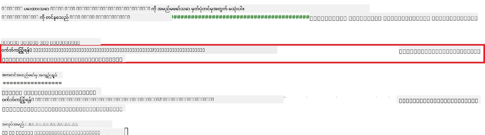

### fine-tuned မော်ဒယ်ကို deploy ပြုလုပ်ခြင်း

fine-tuned Phi-3 မော်ဒယ်ကို Prompt Flow နှင့် ပေါင်းစည်းအသုံးပြုရန်အတွက် မော်ဒယ်ကို အွန်လိုင်းမှ real-time inference အတွက် ရရှိနိုင်အောင် deploy ပြုလုပ်ရမည်။ ၎င်းလုပ်ငန်းစဉ်တွင် မော်ဒယ်မှတ်ပုံတင်ခြင်း၊ online endpoint ဖန်တီးခြင်းနှင့် မော်ဒယ် deploy ပြုလုပ်ခြင်းတို့ ပါဝင်သည်။

#### Deploy ပြုလုပ်ရန် မော်ဒယ်အမည်၊ endpoint အမည်နှင့် deployment အမည် သတ်မှတ်ခြင်း

1. *config.py* ဖိုင်ကို ဖွင့်ပါ။

1. `AZURE_MODEL_NAME = "your_fine_tuned_model_name"` ကို သင်လိုချင်သည့် မော်ဒယ်အမည်ဖြင့် ဖေါ်ပြပါ။

1. `AZURE_ENDPOINT_NAME = "your_fine_tuned_model_endpoint_name"` ကို သင်လိုချင်သည့် endpoint အမည်ဖြင့် ပြောင်းပါ။

1. `AZURE_DEPLOYMENT_NAME = "your_fine_tuned_model_deployment_name"` ကို သင်လိုချင်သည့် deployment အမည်ဖြင့် ပြောင်းပါ။

#### *deploy_model.py* ဖိုင်ထဲသို့ ကုဒ်ထည့်သွင်းခြင်း

*deploy_model.py* ဖိုင်ကို 실행ခြင်းအားဖြင့် စုံလင်သော deployment လုပ်ငန်းစဉ်ကို အလိုအလျောက် ဆောင်ရွက်နိုင်သည်။ ၎င်းသည် မော်ဒယ်မွတ်ပုံတင်ခြင်း၊ endpoint ဖန်တီးခြင်း နှင့် config.py ဖိုင်တွင် သတ်မှတ်ထားသော မော်ဒယ်အမည်၊ endpoint အမည်နှင့် deployment အမည်အားအခြေခံ၍ deployment ကို ဆောင်ရွက်သည်။

1. Visual Studio Code တွင် *deploy_model.py* ဖိုင်ကို ဖွင့်ပါ။

1. *deploy_model.py* ထဲသို့ အောက်ပါ ကုဒ်များ ထည့်ပါ။

    ```python
    import logging
    from azure.identity import AzureCliCredential
    from azure.ai.ml import MLClient
    from azure.ai.ml.entities import Model, ProbeSettings, ManagedOnlineEndpoint, ManagedOnlineDeployment, IdentityConfiguration, ManagedIdentityConfiguration, OnlineRequestSettings
    from azure.ai.ml.constants import AssetTypes

    # ပုံသေချုပ်များအား သွင်းယူခြင်း
    from config import (
        AZURE_SUBSCRIPTION_ID,
        AZURE_RESOURCE_GROUP_NAME,
        AZURE_ML_WORKSPACE_NAME,
        AZURE_MANAGED_IDENTITY_RESOURCE_ID,
        AZURE_MANAGED_IDENTITY_CLIENT_ID,
        AZURE_MODEL_NAME,
        AZURE_ENDPOINT_NAME,
        AZURE_DEPLOYMENT_NAME
    )

    # သတ်မှတ်ချက်များ
    JOB_NAME = "your-job-name"
    COMPUTE_INSTANCE_TYPE = "Standard_E4s_v3"

    deployment_env_vars = {
        "SUBSCRIPTION_ID": AZURE_SUBSCRIPTION_ID,
        "RESOURCE_GROUP_NAME": AZURE_RESOURCE_GROUP_NAME,
        "UAI_CLIENT_ID": AZURE_MANAGED_IDENTITY_CLIENT_ID,
    }

    # မှတ်တမ်းတင်ခြင်း စနစ် သတ်မှတ်ခြင်း
    logging.basicConfig(
        format="%(asctime)s - %(levelname)s - %(name)s - %(message)s",
        datefmt="%Y-%m-%d %H:%M:%S",
        level=logging.DEBUG
    )
    logger = logging.getLogger(__name__)

    def get_ml_client():
        """Initialize and return the ML Client."""
        credential = AzureCliCredential()
        return MLClient(credential, AZURE_SUBSCRIPTION_ID, AZURE_RESOURCE_GROUP_NAME, AZURE_ML_WORKSPACE_NAME)

    def register_model(ml_client, model_name, job_name):
        """Register a new model."""
        model_path = f"azureml://jobs/{job_name}/outputs/artifacts/paths/model_output"
        logger.info(f"Registering model {model_name} from job {job_name} at path {model_path}.")
        run_model = Model(
            path=model_path,
            name=model_name,
            description="Model created from run.",
            type=AssetTypes.MLFLOW_MODEL,
        )
        model = ml_client.models.create_or_update(run_model)
        logger.info(f"Registered model ID: {model.id}")
        return model

    def delete_existing_endpoint(ml_client, endpoint_name):
        """Delete existing endpoint if it exists."""
        try:
            endpoint_result = ml_client.online_endpoints.get(name=endpoint_name)
            logger.info(f"Deleting existing endpoint {endpoint_name}.")
            ml_client.online_endpoints.begin_delete(name=endpoint_name).result()
            logger.info(f"Deleted existing endpoint {endpoint_name}.")
        except Exception as e:
            logger.info(f"No existing endpoint {endpoint_name} found to delete: {e}")

    def create_or_update_endpoint(ml_client, endpoint_name, description=""):
        """Create or update an endpoint."""
        delete_existing_endpoint(ml_client, endpoint_name)
        logger.info(f"Creating new endpoint {endpoint_name}.")
        endpoint = ManagedOnlineEndpoint(
            name=endpoint_name,
            description=description,
            identity=IdentityConfiguration(
                type="user_assigned",
                user_assigned_identities=[ManagedIdentityConfiguration(resource_id=AZURE_MANAGED_IDENTITY_RESOURCE_ID)]
            )
        )
        endpoint_result = ml_client.online_endpoints.begin_create_or_update(endpoint).result()
        logger.info(f"Created new endpoint {endpoint_name}.")
        return endpoint_result

    def create_or_update_deployment(ml_client, endpoint_name, deployment_name, model):
        """Create or update a deployment."""

        logger.info(f"Creating deployment {deployment_name} for endpoint {endpoint_name}.")
        deployment = ManagedOnlineDeployment(
            name=deployment_name,
            endpoint_name=endpoint_name,
            model=model.id,
            instance_type=COMPUTE_INSTANCE_TYPE,
            instance_count=1,
            environment_variables=deployment_env_vars,
            request_settings=OnlineRequestSettings(
                max_concurrent_requests_per_instance=3,
                request_timeout_ms=180000,
                max_queue_wait_ms=120000
            ),
            liveness_probe=ProbeSettings(
                failure_threshold=30,
                success_threshold=1,
                period=100,
                initial_delay=500,
            ),
            readiness_probe=ProbeSettings(
                failure_threshold=30,
                success_threshold=1,
                period=100,
                initial_delay=500,
            ),
        )
        deployment_result = ml_client.online_deployments.begin_create_or_update(deployment).result()
        logger.info(f"Created deployment {deployment.name} for endpoint {endpoint_name}.")
        return deployment_result

    def set_traffic_to_deployment(ml_client, endpoint_name, deployment_name):
        """Set traffic to the specified deployment."""
        try:
            # လက်ရှိ endpoint အသေးစိတ် ကို ယူယူခြင်း
            endpoint = ml_client.online_endpoints.get(name=endpoint_name)
            
            # တောင့်တယ်မှုများပြီး မြင်ခြင်းအတွက် လက်ရှိ traffic allocation ကို မှတ်တမ်းတင်ခြင်း
            logger.info(f"Current traffic allocation: {endpoint.traffic}")
            
            # deployment အတွက် traffic allocation ကို သတ်မှတ်ခြင်း
            endpoint.traffic = {deployment_name: 100}
            
            # endpoint ကို traffic allocation အသစ်ဖြင့် update ပြုလုပ်ခြင်း
            endpoint_poller = ml_client.online_endpoints.begin_create_or_update(endpoint)
            updated_endpoint = endpoint_poller.result()
            
            # ပြန်လည်ပြောင်းလဲထားသော traffic allocation ကို ကြည့်ရှုရန် မှတ်တမ်းတင်ခြင်း
            logger.info(f"Updated traffic allocation: {updated_endpoint.traffic}")
            logger.info(f"Set traffic to deployment {deployment_name} at endpoint {endpoint_name}.")
            return updated_endpoint
        except Exception as e:
            # လုပ်ငန်းစဉ်အတွင်း ဖြစ်ပွားသည့် အမှားများကို မှတ်တမ်းတင်ခြင်း
            logger.error(f"Failed to set traffic to deployment: {e}")
            raise


    def main():
        ml_client = get_ml_client()

        registered_model = register_model(ml_client, AZURE_MODEL_NAME, JOB_NAME)
        logger.info(f"Registered model ID: {registered_model.id}")

        endpoint = create_or_update_endpoint(ml_client, AZURE_ENDPOINT_NAME, "Endpoint for finetuned Phi-3 model")
        logger.info(f"Endpoint {AZURE_ENDPOINT_NAME} is ready.")

        try:
            deployment = create_or_update_deployment(ml_client, AZURE_ENDPOINT_NAME, AZURE_DEPLOYMENT_NAME, registered_model)
            logger.info(f"Deployment {AZURE_DEPLOYMENT_NAME} is created for endpoint {AZURE_ENDPOINT_NAME}.")

            set_traffic_to_deployment(ml_client, AZURE_ENDPOINT_NAME, AZURE_DEPLOYMENT_NAME)
            logger.info(f"Traffic is set to deployment {AZURE_DEPLOYMENT_NAME} at endpoint {AZURE_ENDPOINT_NAME}.")
        except Exception as e:
            logger.error(f"Failed to create or update deployment: {e}")

    if __name__ == "__main__":
        main()

    ```

1. `JOB_NAME` ကို ရယူရန်အတွက် အောက်ပါ လုပ်ဆောင်ချက်များ ပြုလုပ်ပါ။

    - ဖန်တီးထားသော Azure Machine Learning resource သို့ သွားပါ။
    - Azure Machine Learning workspace ကို ဖွင့်ရန် **Studio web URL** ကို ရွေးချယ်ပါ။
    - ဘယ်ဘက်ခွဲထဲမှ **Jobs** ကို ရွေးချယ်ပါ။
    - fine-tuning အတွက် experiment ကို ရွေးပါ။ ဥပမာ *finetunephi* ဖြစ်သည်။
    - အမှာအဆိုပြုထားသော job ကို ရွေးချယ်ပါ။
    - သင့် job အမည်ကို ကူးယူပြီး *deploy_model.py* ဖိုင်အတွင်း `JOB_NAME = "your-job-name"` ထဲသို့ ထည့်ပါ။

1. `COMPUTE_INSTANCE_TYPE` ကို သင့်အသေးစိတ်များဖြင့် အစားထိုးပါ။

1. *deploy_model.py* script ကို 실행ကာ Azure Machine Learning တွင် deployment လုပ်ငန်းစဉ် စတင်ရန် အောက်ပါ command ကို ရိုက်ထည့်ပါ။

    ```python
    python deploy_model.py
    ```

> [!WARNING]
> သင့်အကောင့်အတွက် ထပ်မံကြေးနွယ်မှုပြုမိမည်မဖြစ်စေရန် အတွက် Azure Machine Learning workspace တွင် ဖန်တီးထားသော endpoint ကို ဖျက်ပစ်ရန် သေချာစေပါ။
>

#### Azure Machine Learning Workspace တွင် deployment အခြေအနေစစ်ဆေးခြင်း

1. [Azure ML Studio](https://ml.azure.com/home?wt.mc_id=studentamb_279723) သို့ သွားပါ။

1. ဖန်တီးထားသော Azure Machine Learning workspace သို့ သွားပါ။


1. **Studio web URL** ကိုရွေးပြီး Azure Machine Learning ဝေါ့ခ််စ်ကိုဖွင့်ပါ။

1. ဘယ်ဘက်တစ်ဖက်မှ **Endpoints** ကိုရွေးပါ။

    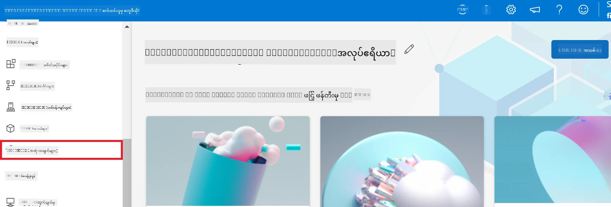

2. သင့်အားဖန်တီးထားသော endpoint ကိုရွေးပါ။

    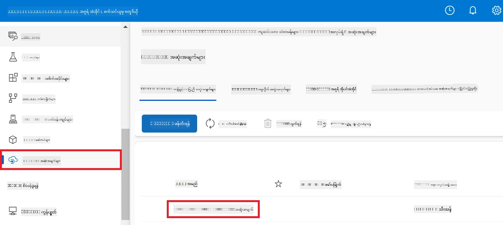

3. ဤစာမျက်နှာတွင် deployment လုပ်ရင်း ဖန်တီးထားသော endpoints များကိုစီမံနိုင်ပါသည်။

## အခြေအနေ ၃: Prompt flow နှင့်ပေါင်းစပ်ပြီး သင့်စိတ်ကြိုက်မော်ဒယ်နှင့် စကားပြောရန်

### သင့်စိတ်ကြိုက် Phi-3 မော်ဒယ်ကို Prompt flow နှင့်ပေါင်းစပ်ခြင်း

သင်၏ fine-tuned မော်ဒယ် အောင်မြင်စွာ deployment ပြီးပါက၊ Prompt flow နှင့်ပေါင်းစပ်၍ real-time applications များတွင် သင့်မော်ဒယ်ကို အသုံးပြုနိုင်ပြီး၊ သင့်စိတ်ကြိုက် Phi-3 မော်ဒယ်ဖြင့် အမျိုးမျိုးသော အပြန်အလှန် လုပ်ဆောင်ချက်များ ဆောင်ရွက်နိုင်ပါသည်။

#### fine-tuned Phi-3 မော်ဒယ်၏ API key နှင့် endpoint URI ကို သတ်မှတ်ခြင်း

1. သင်ဖန်တီးထားသော Azure Machine learning workspace သို့သွားပါ။
1. ဘယ်ဘက် tab မှ **Endpoints** ကိုရွေးပါ။
1. သင့်ဖန်တီးထားသော endpoint ကိုရွေးပါ။
1. navigation မီနူးမှ **Consume** ကိုရွေးပါ။
1. သင့် **REST endpoint** ကို *config.py* ဖိုင်တွင် `AZURE_ML_ENDPOINT = "your_fine_tuned_model_endpoint_uri"` အစား ထည့်သွင်းပါ။
1. သင့် **Primary key** ကို *config.py* ဖိုင်တွင် `AZURE_ML_API_KEY = "your_fine_tuned_model_api_key"` အစား ထည့်သွင်းပါ။

    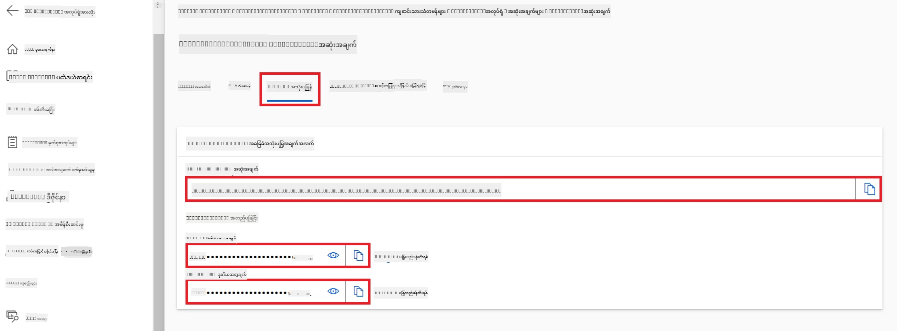

#### *flow.dag.yml* ဖိုင်သို့ ကုဒ်များထည့်သွင်းခြင်း

1. Visual Studio Code တွင် *flow.dag.yml* ဖိုင်ကိုဖွင့်ပါ။

1. *flow.dag.yml* ထဲသို့ အောက်ပါကုဒ်ကို ထည့်ပါ။

    ```yml
    inputs:
      input_data:
        type: string
        default: "Who founded Microsoft?"

    outputs:
      answer:
        type: string
        reference: ${integrate_with_promptflow.output}

    nodes:
    - name: integrate_with_promptflow
      type: python
      source:
        type: code
        path: integrate_with_promptflow.py
      inputs:
        input_data: ${inputs.input_data}
    ```

#### *integrate_with_promptflow.py* ဖိုင်သို့ ကုဒ်များထည့်သွင်းခြင်း

1. Visual Studio Code တွင် *integrate_with_promptflow.py* ဖိုင်ကိုဖွင့်ပါ။

1. *integrate_with_promptflow.py* ထဲသို့ အောက်ပါကုဒ်ကို ထည့်ပါ။

    ```python
    import logging
    import requests
    from promptflow.core import tool
    import asyncio
    import platform
    from config import (
        AZURE_ML_ENDPOINT,
        AZURE_ML_API_KEY
    )

    # မှတ်တမ်းတင်ခြင်း စနစ်စီစဉ်ခြင်း
    logging.basicConfig(
        format="%(asctime)s - %(levelname)s - %(name)s - %(message)s",
        datefmt="%Y-%m-%d %H:%M:%S",
        level=logging.DEBUG
    )
    logger = logging.getLogger(__name__)

    def query_azml_endpoint(input_data: list, endpoint_url: str, api_key: str) -> str:
        """
        Send a request to the Azure ML endpoint with the given input data.
        """
        headers = {
            "Content-Type": "application/json",
            "Authorization": f"Bearer {api_key}"
        }
        data = {
            "input_data": [input_data],
            "params": {
                "temperature": 0.7,
                "max_new_tokens": 128,
                "do_sample": True,
                "return_full_text": True
            }
        }
        try:
            response = requests.post(endpoint_url, json=data, headers=headers)
            response.raise_for_status()
            result = response.json()[0]
            logger.info("Successfully received response from Azure ML Endpoint.")
            return result
        except requests.exceptions.RequestException as e:
            logger.error(f"Error querying Azure ML Endpoint: {e}")
            raise

    def setup_asyncio_policy():
        """
        Setup asyncio event loop policy for Windows.
        """
        if platform.system() == 'Windows':
            asyncio.set_event_loop_policy(asyncio.WindowsSelectorEventLoopPolicy())
            logger.info("Set Windows asyncio event loop policy.")

    @tool
    def my_python_tool(input_data: str) -> str:
        """
        Tool function to process input data and query the Azure ML endpoint.
        """
        setup_asyncio_policy()
        return query_azml_endpoint(input_data, AZURE_ML_ENDPOINT, AZURE_ML_API_KEY)

    ```

### သင့်စိတ်ကြိုက်မော်ဒယ်နှင့် စကားပြောခြင်း

1. *deploy_model.py* script ကို run ပြုလုပ်ရန် အောက်ပါ command ကို ရိုက်ထည့်ပြီး Azure Machine Learning တွင် deployment လုပ်ငန်းစဉ်ကို စတင်ပါ။

    ```python
    pf flow serve --source ./ --port 8080 --host localhost
    ```

1. ဤမှာရလဒ်တစ်ခု၏ဥပမာပြပါသည်- ယခု သင့်စိတ်ကြိုက် Phi-3 မော်ဒယ်နှင့် စကားပြောနိုင်ပါပြီ။ Fine-tuning အတွက်အသုံးပြုထားသော ဒေတာအပေါ် မေးခွန်းများမေးရန် အကြံပြုပါသည်။

    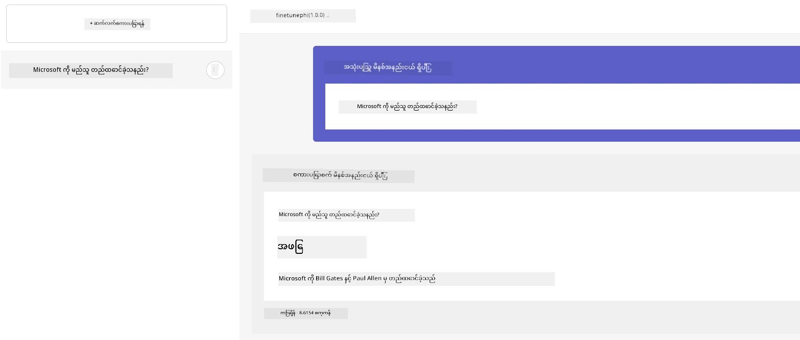

---

<!-- CO-OP TRANSLATOR DISCLAIMER START -->
**ပြောကြားချက်**
ဤစာတမ်းကို AI ဘာသာပြန်ဝန်ဆောင်မှု [Co-op Translator](https://github.com/Azure/co-op-translator) အသုံးပြု၍ ဘာသာပြန်ထားပါသည်။ ကျွန်ုပ်တို့သည် တိကျမှန်ကန်မှုအတွက် ကြိုးပမ်းနေသော်လည်း၊ စက်ကိရိယာဘာသာပြန်ခြင်းများတွင် အမှားများ သို့မဟုတ် မှားယွင်းချက်များ ပါဝင်နိုင်ကြောင်း သတိပြုပါရန် လိုအပ်ပါသည်။ မူလစာတမ်းကို မူရင်းဘာသာဖြင့်သာ ယုံကြည်စိတ်ချရသော အချက်အလက်အဖြစ် သတ်မှတ်သင့်သည်။ အရေးကြီးသည့် သတင်းအချက်အလက်များအတွက် ပရော်ဖက်ရှင်နယ် လူသားဘာသာပြန်သူဝန်ဆောင်မှုကို အကြံပြုပါသည်။ ဤဘာသာပြန်ချက်ကို အသုံးပြုခြင်းမှ ဖြစ်ပေါ်လာသော နားလည်မှုကွာခြားမှုများ သို့မဟုတ် မမှန်ကန်သော အသုံးပြုမှုများအတွက် ကျွန်ုပ်တို့ တာဝန်မခံပါ။
<!-- CO-OP TRANSLATOR DISCLAIMER END -->