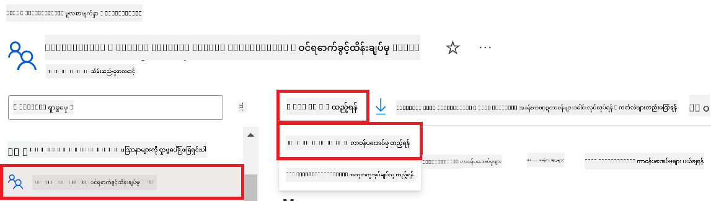
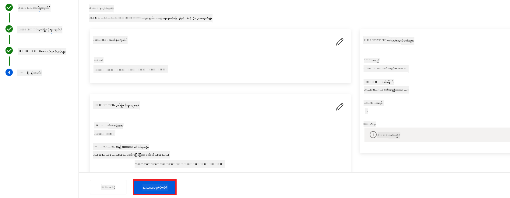
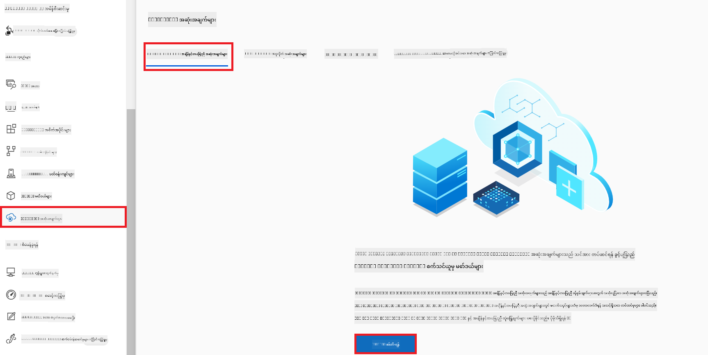
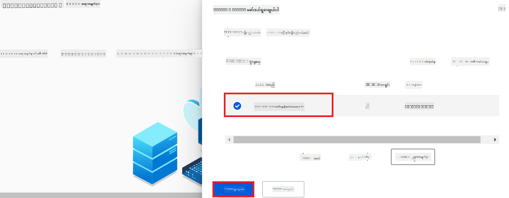
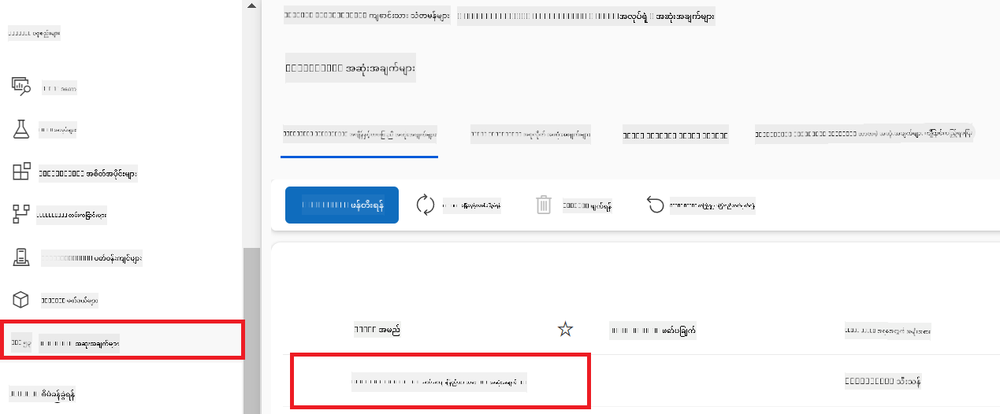

<!--
CO_OP_TRANSLATOR_METADATA:
{
  "original_hash": "0df910a227098303cc392b6ad204c271",
  "translation_date": "2026-01-06T05:22:49+00:00",
  "source_file": "md/02.Application/01.TextAndChat/Phi3/E2E_Phi-3-FineTuning_PromptFlow_Integration_AIFoundry.md",
  "language_code": "my"
}
-->
# Fine-tune and Integrate custom Phi-3 models with Prompt flow in Azure AI Foundry

This end-to-end (E2E) sample is based on the guide "[Fine-Tune and Integrate Custom Phi-3 Models with Prompt Flow in Azure AI Foundry](https://techcommunity.microsoft.com/t5/educator-developer-blog/fine-tune-and-integrate-custom-phi-3-models-with-prompt-flow-in/ba-p/4191726?WT.mc_id=aiml-137032-kinfeylo)" from the Microsoft Tech Community. It introduces the processes of fine-tuning, deploying, and integrating custom Phi-3 models with Prompt flow in Azure AI Foundry.
Unlike the E2E sample, "[Fine-Tune and Integrate Custom Phi-3 Models with Prompt Flow](./E2E_Phi-3-FineTuning_PromptFlow_Integration.md)", which involved running code locally, this tutorial focuses entirely on fine-tuning and integrating your model within the Azure AI / ML Studio.

## Overview

In this E2E sample, you will learn how to fine-tune the Phi-3 model and integrate it with Prompt flow in Azure AI Foundry. By leveraging Azure AI / ML Studio, you will establish a workflow for deploying and utilizing custom AI models. This E2E sample is divided into three scenarios:

**Scenario 1: Set up Azure resources and Prepare for fine-tuning**

**Scenario 2: Fine-tune the Phi-3 model and Deploy in Azure Machine Learning Studio**

**Scenario 3: Integrate with Prompt flow and Chat with your custom model in Azure AI Foundry**

Here is an overview of this E2E sample.


### Table of Contents

1. **[Scenario 1: Set up Azure resources and Prepare for fine-tuning](../../../../../../md/02.Application/01.TextAndChat/Phi3)**
    - [Create an Azure Machine Learning Workspace](../../../../../../md/02.Application/01.TextAndChat/Phi3)
    - [Request GPU quotas in Azure Subscription](../../../../../../md/02.Application/01.TextAndChat/Phi3)
    - [Add role assignment](../../../../../../md/02.Application/01.TextAndChat/Phi3)
    - [Set up project](../../../../../../md/02.Application/01.TextAndChat/Phi3)
    - [Prepare dataset for fine-tuning](../../../../../../md/02.Application/01.TextAndChat/Phi3)

1. **[Scenario 2: Fine-tune Phi-3 model and Deploy in Azure Machine Learning Studio](../../../../../../md/02.Application/01.TextAndChat/Phi3)**
    - [Fine-tune the Phi-3 model](../../../../../../md/02.Application/01.TextAndChat/Phi3)
    - [Deploy the fine-tuned Phi-3 model](../../../../../../md/02.Application/01.TextAndChat/Phi3)

1. **[Scenario 3: Integrate with Prompt flow and Chat with your custom model in Azure AI Foundry](../../../../../../md/02.Application/01.TextAndChat/Phi3)**
    - [Integrate the custom Phi-3 model with Prompt flow](../../../../../../md/02.Application/01.TextAndChat/Phi3)
    - [Chat with your custom Phi-3 model](../../../../../../md/02.Application/01.TextAndChat/Phi3)

## Scenario 1: Set up Azure resources and Prepare for fine-tuning

### Create an Azure Machine Learning Workspace

1. Type *azure machine learning* in the **search bar** at the top of the portal page and select **Azure Machine Learning** from the options that appear.

    

2. Select **+ Create** from the navigation menu.

3. Select **New workspace** from the navigation menu.

    

4. Perform the following tasks:

    - Select your Azure **Subscription**.
    - Select the **Resource group** to use (create a new one if needed).
    - Enter **Workspace Name**. It must be a unique value.
    - Select the **Region** you'd like to use.
    - Select the **Storage account** to use (create a new one if needed).
    - Select the **Key vault** to use (create a new one if needed).
    - Select the **Application insights** to use (create a new one if needed).
    - Select the **Container registry** to use (create a new one if needed).

    

5. Select **Review + Create**.

6. Select **Create**.

### Request GPU quotas in Azure Subscription

In this tutorial, you will learn how to fine-tune and deploy a Phi-3 model, using GPUs. For fine-tuning, you will use the *Standard_NC24ads_A100_v4* GPU, which requires a quota request. For deployment, you will use the *Standard_NC6s_v3* GPU, which also requires a quota request.

> [!NOTE]
>
> Only Pay-As-You-Go subscriptions (the standard subscription type) are eligible for GPU allocation; benefit subscriptions are not currently supported.
>

1. Visit [Azure ML Studio](https://ml.azure.com/home?wt.mc_id=studentamb_279723).

1. Perform the following tasks to request *Standard NCADSA100v4 Family* quota:

    - Select **Quota** from the left side tab.
    - Select the **Virtual machine family** to use. For example, select **Standard NCADSA100v4 Family Cluster Dedicated vCPUs**, which includes the *Standard_NC24ads_A100_v4* GPU.
    - Select the **Request quota** from the navigation menu.

        

    - Inside the Request quota page, enter the **New cores limit** you'd like to use. For example, 24.
    - Inside the Request quota page, select **Submit** to request the GPU quota.

1. Perform the following tasks to request *Standard NCSv3 Family* quota:

    - Select **Quota** from the left side tab.
    - Select the **Virtual machine family** to use. For example, select **Standard NCSv3 Family Cluster Dedicated vCPUs**, which includes the *Standard_NC6s_v3* GPU.
    - Select the **Request quota** from the navigation menu.
    - Inside the Request quota page, enter the **New cores limit** you'd like to use. For example, 24.
    - Inside the Request quota page, select **Submit** to request the GPU quota.

### Add role assignment

To fine-tune and deploy your models, you must first create a User Assigned Managed Identity (UAI) and assign it the appropriate permissions. This UAI will be used for authentication during deployment

#### Create User Assigned Managed Identity(UAI)

1. Type *managed identities* in the **search bar** at the top of the portal page and select **Managed Identities** from the options that appear.

    

1. Select **+ Create**.

    

1. Perform the following tasks:

    - Select your Azure **Subscription**.
    - Select the **Resource group** to use (create a new one if needed).
    - Select the **Region** you'd like to use.
    - Enter the **Name**. It must be a unique value.

    

1. Select **Review + create**.

1. Select **+ Create**.

#### Add Contributor role assignment to Managed Identity

1. Navigate to the Managed Identity resource that you created.

1. Select **Azure role assignments** from the left side tab.

1. Select **+Add role assignment** from the navigation menu.

1. Inside Add role assignment page, Perform the following tasks:
    - Select the **Scope** to **Resource group**.
    - Select your Azure **Subscription**.
    - Select the **Resource group** to use.
    - Select the **Role** to **Contributor**.

    

2. Select **Save**.

#### Add Storage Blob Data Reader role assignment to Managed Identity

1. Type *storage accounts* in the **search bar** at the top of the portal page and select **Storage accounts** from the options that appear.

    

1. Select the storage account that associated with the Azure Machine Learning workspace that you created. For example, *finetunephistorage*.

1. Perform the following tasks to navigate to Add role assignment page:

    - Navigate to the Azure Storage account that you created.
    - Select **Access Control (IAM)** from the left side tab.
    - Select **+ Add** from the navigation menu.
    - Select **Add role assignment** from the navigation menu.

    

1. Inside Add role assignment page, Perform the following tasks:

    - Inside the Role page, type *Storage Blob Data Reader* in the **search bar** and select **Storage Blob Data Reader** from the options that appear.
    - Inside the Role page, select **Next**.
    - Inside the Members page, select **Assign access to** **Managed identity**.
    - Inside the Members page, select **+ Select members**.
    - Inside Select managed identities page, select your Azure **Subscription**.
    - Inside Select managed identities page, select the **Managed identity** to **Manage Identity**.
    - Inside Select managed identities page, select the Manage Identity that you created. For example, *finetunephi-managedidentity*.
    - Inside Select managed identities page, select **Select**.

    

1. Select **Review + assign**.

#### Add AcrPull role assignment to Managed Identity

1. Type *container registries* in the **search bar** at the top of the portal page and select **Container registries** from the options that appear.

    

1. Select the container registry that associated with the Azure Machine Learning workspace. For example, *finetunephicontainerregistry*

1. Perform the following tasks to navigate to Add role assignment page:

    - Select **Access Control (IAM)** from the left side tab.
    - Select **+ Add** from the navigation menu.
    - Select **Add role assignment** from the navigation menu.

1. Inside Add role assignment page, Perform the following tasks:

    - Inside the Role page, Type *AcrPull* in the **search bar** and select **AcrPull** from the options that appear.
    - Inside the Role page, select **Next**.
    - Inside the Members page, select **Assign access to** **Managed identity**.
    - Inside the Members page, select **+ Select members**.
    - Inside Select managed identities page, select your Azure **Subscription**.
    - Inside Select managed identities page, select the **Managed identity** to **Manage Identity**.
    - Inside Select managed identities page, select the Manage Identity that you created. For example, *finetunephi-managedidentity*.
    - Inside Select managed identities page, select **Select**.
    - Select **Review + assign**.

### Set up project

To download the datasets needed for fine-tuning, you will set up a local environment.

In this exercise, you will

- Create a folder to work inside it.
- Create a virtual environment.
- Install the required packages.
- Create a *download_dataset.py* file to download the dataset.

#### Create a folder to work inside it

1. Open a terminal window and type the following command to create a folder named *finetune-phi* in the default path.

    ```console
    mkdir finetune-phi
    ```

2. သင်ဖန်တီးထားသော *finetune-phi* ဖိုလ်ဒါအတွင်းသို့ ရောက်ရှိရန် terminal ထဲသို့ အောက်ဖော်ပြပါ command ကို ရိုက်ထည့်ပါ။

    ```console
    cd finetune-phi
    ```

#### ဗားချူးအင်ဗိုင်ရွန်မင့်တစ်ခု ဖန်တီးခြင်း

1. *.venv* ဟု အမည်ပေးထားသော ဗားချူးအင်ဗိုင်ရွန်မင့်ကို ဖန်တီးရန် terminal အတွင်း အောက်ဖော်ပြပါ command ကို ရိုက်ထည့်ပါ။

    ```console
    python -m venv .venv
    ```

2. ဗားချူးအင်ဗိုင်ရွန်မင့်ကို ဖွင့်ရန် terminal အတွင်း အောက်ဖော်ပြပါ command ကို ရိုက်ထည့်ပါ။

    ```console
    .venv\Scripts\activate.bat
    ```

> [!NOTE]
> အလုပ်ဖြစ်ပါက command prompt မတိုင်မီ *(.venv)* ကို မြင်ရမှာ ဖြစ်သည်။

#### လိုအပ်သော အထုပ်များ စက်သွင်းခြင်း

1. လိုအပ်သော အထုပ်များကို စက်သွင်းရန် terminal အတွင်း အောက်ဖော်ပြပါ command များကို ရိုက်ထည့်ပါ။

    ```console
    pip install datasets==2.19.1
    ```

#### `download_dataset.py` ဖိုင်ကို ဖန်တီးခြင်း

> [!NOTE]
> ပြည့်စုံသော ဖိုလ်ဒါ ဖွဲ့စည်းမှု-
>
> ```text
> └── YourUserName
> .    └── finetune-phi
> .        └── download_dataset.py
> ```

1. **Visual Studio Code** ကို ဖွင့်ပါ။

1. မီနူးဘားမှ **File** ကို ရွေးချယ်ပါ။

1. **Open Folder** ကို ရွေးချယ်ပါ။

1. သင်ဖန်တီးထားသော *finetune-phi* ဖိုလ်ဒါကို ရွေးချယ်ပါ၊ ထိုဖိုလ်ဒါသည် *C:\Users\yourUserName\finetune-phi* တွင်ရှိသည်။

    

1. Visual Studio Code ၏ ဘယ်ဘက်နေရာတွင် right-click ပြုလုပ်ပြီး **New File** ကို ရွေး၍ *download_dataset.py* ဟု နာမည်ပေးသည့် ဖိုင်အသစ်ကို ဖန်တီးပါ။

    

### Fine-tuning အတွက် ဒေတာစုစည်းမှု ပြင်ဆင်ခြင်း

ဤလေ့ကျင့်ခန်း၌ သင်သည် *download_dataset.py* ဖိုင်ကို အလုပ်လုပ်စေပြီး *ultrachat_200k* ဒေတာများကို ဒေသခံ ပတ်ဝန်းကျင်သို့ ဒေါင်းလုပ်ဆွဲပါမည်။ ထို့နောက် ဤဒေတာများကို အသုံးပြု၍ Azure Machine Learning တွင် Phi-3 မော်ဒယ်ကို fine-tune ပြုလုပ်မည်ဖြစ်သည်။

ဤလေ့ကျင့်ခန်းတွင် သင်သည်-

- *download_dataset.py* ဖိုင်ထဲသို့ ဒေတာဒေါင်းလုပ်ဆွဲရန် ကုဒ်ထည့်ရေးမည်။
- ဒေတာများကို ဒေသခံ ပတ်ဝန်းကျင်သို့ ဒေါင်းလုပ်ဆွဲရန် *download_dataset.py* ဖိုင်ကို အလုပ်လုပ်ခိုင်းမည်။

#### *download_dataset.py* အသုံးပြု၍ ဒေတာကို ဒေါင်းလုပ်ဆွဲပါ

1. Visual Studio Code တွင် *download_dataset.py* ဖိုင်ကို ဖွင့်ပါ။

1. အောက်ဖော်ပြပါ ကုဒ်များကို *download_dataset.py* ဖိုင်ထဲသို့ ထည့်ပါ။

    ```python
    import json
    import os
    from datasets import load_dataset

    def load_and_split_dataset(dataset_name, config_name, split_ratio):
        """
        Load and split a dataset.
        """
        # သတ်မှတ်ထားသော အမည်၊ ဆက်တင်များနှင့် အပိုင်းနှုန်းဖြင့် ဒေတာစက်ကိုလွှတ်ပါ
        dataset = load_dataset(dataset_name, config_name, split=split_ratio)
        print(f"Original dataset size: {len(dataset)}")
        
        # ဒေတာစက်ကို လေ့ကျင့်မှုနှင့် စမ်းသပ်မှု အပိုင်းများသို့ (လေ့ကျင့်မှု ၈၀%, စမ်းသပ်မှု ၂၀%) ခွဲထုတ်ပါ
        split_dataset = dataset.train_test_split(test_size=0.2)
        print(f"Train dataset size: {len(split_dataset['train'])}")
        print(f"Test dataset size: {len(split_dataset['test'])}")
        
        return split_dataset

    def save_dataset_to_jsonl(dataset, filepath):
        """
        Save a dataset to a JSONL file.
        """
        # ဖိုင်လ်ဒါမရှိပါက ဖန်တီးပါ
        os.makedirs(os.path.dirname(filepath), exist_ok=True)
        
        # ဖိုင်ကို ရေးသားမှုမုဒ်ဖြင့် ဖွင့်ပါ
        with open(filepath, 'w', encoding='utf-8') as f:
            # ဒေတာစက်ရှိ မည်သည့်မှတ်တမ်းတစ်ခုချင်းစီကို မောင်းနှင့်ပါ
            for record in dataset:
                # မှတ်တမ်းကို JSON အရာဝတ္ထုအဖြစ် လွှတ်ပြီး ဖိုင်တွင် ရေးပါ
                json.dump(record, f)
                # မှတ်တမ်းများအကြား အကြောင်းကြားချက်အနေနှင့် new line ကို ရေးပါ
                f.write('\n')
        
        print(f"Dataset saved to {filepath}")

    def main():
        """
        Main function to load, split, and save the dataset.
        """
        # ULTRACHAT_200k ဒေတာစက်ကို သတ်မှတ်ထားသော ဆက်တင်နှင့် အပိုင်းနှုန်းဖြင့် လွှတ်ပြီး ခွဲထုတ်ပါ
        dataset = load_and_split_dataset("HuggingFaceH4/ultrachat_200k", 'default', 'train_sft[:1%]')
        
        # ခွဲထုတ်မှုမှ လေ့ကျင့်မှုနှင့် စမ်းသပ်မှု ဒေတာစက်များကို ထုတ်ယူပါ
        train_dataset = dataset['train']
        test_dataset = dataset['test']

        # လေ့ကျင့်မှု ဒေတာစက်ကို JSONL ဖိုင်သို့ သိမ်းဆည်းပါ
        save_dataset_to_jsonl(train_dataset, "data/train_data.jsonl")
        
        # စမ်းသပ်မှု ဒေတာစက်ကို သီးခြား JSONL ဖိုင်သို့ သိမ်းဆည်းပါ
        save_dataset_to_jsonl(test_dataset, "data/test_data.jsonl")

    if __name__ == "__main__":
        main()

    ```

1. ဒေတာဒေါင်းလုပ်ဆွဲရန် script ကို အလုပ်လုပ်စေဘို့ terminal တွင် အောက်ဖော်ပြပါ command ကို ရိုက်ထည့်ပါ။

    ```console
    python download_dataset.py
    ```

1. ဒေတာများအား သင့်ဒေသခံ *finetune-phi/data* ဖိုလ်ဒါတွင် အောင်မြင်စွာ သိမ်းဆည်းထားကြောင်း သေချာသည်။

> [!NOTE]
>
> #### ဒေတာအရွယ်အစားနှင့် fine-tuning အချိန်အတွင်း မှတ်ချက်
>
> ဤသင်ခန်းစာတွင် သင်သည် ဒေတာ၏ ၁% (`split='train[:1%]'`) သာ အသုံးပြုထားသည်။ ၎င်းသည် ဒေတာပမာဏကို ထိရောက်စွာ လျှော့ချသဖြင့် upload နှင့် fine-tuning လုပ်ငန်းစဉ်များကို အလျင်မြန်စေသည်။ သင်သည် သင့်လိုအပ်ချက်အပေါ်မူတည်၍ training အချိန်နှင့် မော်ဒယ်စွမ်းဆောင်မှုအတွက် သင့်တော်သောတစ်ခုကို ရွေးချယ်နိုင်သည်။ ဒေတာအပိုင်းသေးငယ်သော သုံးစွဲမှုသည် fine-tuning အချိန်ကို လျှော့နည်းစေပြီး သင်ခန်းစာအတွက် လွယ်ကူစေပါသည်။

## ရှေ့ပြေး ၂: Phi-3 မော်ဒယ်ကို fine-tune ပြုလုပ်ခြင်း နှင့် Azure Machine Learning Studio တွင် တင်ဆက်ခြင်း

### Phi-3 မော်ဒယ်ကို fine-tune ပြုလုပ်ခြင်း

ဤလေ့ကျင့်ခန်းတွင် သင်သည် Azure Machine Learning Studio တွင် Phi-3 မော်ဒယ်ကို fine-tune ပြုလုပ်မည်။

ဤလေ့ကျင့်ခန်းတွင် သင်မှာ-

- fine-tuning အတွက် ကွန်ပျူတာ cluster တည်ဆောက်ခြင်း။
- Azure Machine Learning Studio တွင် Phi-3 မော်ဒယ်ကို fine-tune ပြုလုပ်ခြင်း။

#### fine-tuning အတွက် ကွန်ပျူတာ cluster တည်ဆောက်ခြင်း

1. [Azure ML Studio](https://ml.azure.com/home?wt.mc_id=studentamb_279723) သို့ ဝင်ရောက်ပါ။

1. ဘယ်ဘက် tab မှ **Compute** ကို ရွေးချယ်ပါ။

1. နေရာရွေး menu မှ **Compute clusters** ကို ရွေးပါ။

1. **+ New** ကို နှိပ်ပါ။

    

1. အောက်ပါ အချက်အလက်များကို ဖြည့်စွက်လုပ်ဆောင်ပါ-

    - သင်အသုံးပြုလိုသော **Region** ကို ရွေးပါ။
    - **Virtual machine tier** တွင် **Dedicated** ကို ရွေးပါ။
    - **Virtual machine type** တွင် **GPU** ကို ရွေးပါ။
    - **Virtual machine size** ချိတ်ဆက်ကို **Select from all options** ဟု ပြောင်းပါ။
    - **Virtual machine size** တွင် **Standard_NC24ads_A100_v4** ကို ရွေးချယ်ပါ။

    

1. **Next** ကို နှိပ်ပါ။

1. အောက်ပါ အချက်အလက်များ ဖြည့်ပါ-

    - **Compute name** ကို ထည့်ပါ။ တူညီမှုမရှိသော တန်ဖိုးဖြစ်ရပါမည်။
    - **Minimum number of nodes** ကို **0** ဟု ရွေးပါ။
    - **Maximum number of nodes** ကို **1** ဟု ရွေးပါ။
    - **Idle seconds before scale down** ကို **120** ဟု ရွေးချယ်ပါ။

    

1. **Create** ကို နှိပ်ပါ။

#### Phi-3 မော်ဒယ်ကို fine-tune ပြုလုပ်ခြင်း

1. [Azure ML Studio](https://ml.azure.com/home?wt.mc_id=studentamb_279723) သို့ ဝင်ရောက်ပါ။

1. သင်ဖန်တီးထားသော Azure Machine Learning workspace ကို ရွေးချယ်ပါ။

    

1. အောက်ပါ လုပ်ဆောင်ချက်များ ပြုလုပ်ပါ-

    - ဘယ်ဘက် tab မှ **Model catalog** ကို ရွေးပါ။
    - **search bar** တွင် *phi-3-mini-4k* ရိုက်ထည့်ပြီး လျာထားသော ရွေးချယ်စရာများထဲမှ **Phi-3-mini-4k-instruct** ကို ရွေးချယ်ပါ။

    

1. နေရာရွေး menu မှ **Fine-tune** ကို ရွေးချယ်ပါ။

    

1. အောက်ပါ အချက်အလက်များကို ဖြည့်ပါ-

    - **Select task type** တွင် **Chat completion** ကို ရွေးပါ။
    - **+ Select data** ကို နှိပ်ပြီး **Training data** ကို upload ပြုလုပ်ပါ။
    - Validation data upload အမျိုးအစားအား **Provide different validation data** ထားပါ။
    - **+ Select data** ကို နှိပ်ပြီး **Validation data** ကို upload ပြုလုပ်ပါ။

    

> [!TIP]
>
> **Advanced settings** ကို ရွေး၍ **learning_rate** နှင့် **lr_scheduler_type** ကဲ့သို့သော ကြီးကြပ်မှုများကို သင့်လိုအပ်ချက်များနှင့် ရိုးရာ fine-tuning လုပ်ငန်းစဉ်များအတွက် ပြုလုပ်နိုင်ပါသည်။

1. **Finish** ကို နှိပ်ပါ။

1. ဤလေ့ကျင့်ခန်းတွင် သင်သည် Azure Machine Learning ကို အသုံးပြု၍ Phi-3 မော်ဒယ်ကို အောင်မြင်စွာ fine-tune ပြုလုပ်ခဲ့ပါသည်။ သတိပြုရန်က fine-tuning လုပ်ငန်းစဉ်သည် အချိန်အတော်ကြာနိုင်ပါသည်။ Fine-tuning လုပ်ငန်းစဉ်ကို စတင်ပြုလုပ်ပြီးနောက် ပြီးမြောက်မှုအတွက် စောင့်ဆိုင်းရပါမည်။ Azure Machine Learning Workspace ၏ ဘယ်ဘက် tab မှ Jobs tab သို့ သွားရောက်ကာ fine-tuning အလုပ်အမှုအခြေအနေကို စောင့်ကြည့်နိုင်ပါသည်။ နောက်ထပ် အစိတ်အပိုင်းတွင် fine-tune ပြုလုပ်ပြီး မော်ဒယ်ကို တင်ဆက်ခြင်းနှင့် Prompt flow နှင့် ပေါင်းစည်းခြင်းမပြုလုပ်မည်ဖြစ်သည်။

    

### Fine-tune ခြင်းပြီးသား Phi-3 မော်ဒယ်ကို တင်ဆက်ခြင်း

Fine-tune ပြီး Phi-3 မော်ဒယ်အား Prompt flow နှင့် ပေါင်းစည်းရန် model ကို တိုက်ရိုက်သုံးနိုင်ရန်အတွက်ဖြစ်သည်။ ဤလုပ်ငန်းစဉ်တွင် မော်ဒယ်ကို မှတ်ပုံတင်ပြုလုပ်ခြင်း၊ Online endpoint ဖန်တီးခြင်းနှင့် မော်ဒယ် တင်ဆက်ခြင်းတို့ ပါဝင်သည်။

ဤလေ့ကျင့်ခန်းတွင် သင်သည်-

- Fine-tune ပြီးမော်ဒယ်ကို Azure Machine Learning workspace တွင် မှတ်ပုံတင်ပါမည်။
- Online endpoint တည်ဆောက်မည်။
- မှတ်ပုံတင်ထားသော fine-tuned Phi-3 မော်ဒယ်ကို တင်ဆက်မည်။

#### Fine-tuned မော်ဒယ်ကို မှတ်ပုံတင်ခြင်း

1. [Azure ML Studio](https://ml.azure.com/home?wt.mc_id=studentamb_279723) သို့ ဝင်ရောက်ပါ။

1. သင်ဖန်တီးထားသော Azure Machine Learning workspace ကို ရွေးချယ်ပါ။

    

1. ဘယ်ဘက် tab မှ **Models** ကို ရွေးပါ။

1. **+ Register** ကို ရွေးချယ်ပါ။

1. **From a job output** ကို ရွေးပါ။

    

1. သင်ဖန်တီးထားသော job ကို ရွေးချယ်ပါ။

    

1. **Next** ကို နှိပ်ပါ။

1. **Model type** တွင် **MLflow** ကို ရွေးပါ။

1. **Job output** သည် အလိုအလျောက် ရွေးချယ်ထားရှိရမည်။

    

2. **Next** ကိုနှိပ်ပါ။

3. **Register** ကို နှိပ်ပါ။

    

4. ဘယ်ဘက် tab မှ **Models** ကို ဝင်ကြည့်၍ သင့်မှတ်ပုံတင်ထားသော မော်ဒယ်ကို ကြည့်ရှုနိုင်ပါသည်။

    

#### Fine-tuned မော်ဒယ်ကို တင်ဆက်ခြင်း

1. သင်ဖန်တီးထားသော Azure Machine Learning workspace သို့ သွားပါ။

1. ဘယ်ဘက် tab မှ **Endpoints** ကို ရွေးပါ။

1. နေရာရွေး menu မှ **Real-time endpoints** ကို ရွေးပါ။

    

1. **Create** ကို နှိပ်ပါ။

1. သင်မှတ်ပုံတင်ထားသော မော်ဒယ်ကို ရွေးချယ်ပါ။

    

1. **Select** ကို နှိပ်ပါ။

1. အောက်ပါ အချက်အလက်များဖြည့်ပါ-

    - **Virtual machine** ကို *Standard_NC6s_v3* ဟု ရွေးချယ်ပါ။
    - သင်အသုံးပြုလိုသော **Instance count** ကို ကိန်းဂဏန်းဖြင့် ထည့်ပါ (ဥပမာ၊ *1*)။
    - **Endpoint** ကို **New** ဟု ရွေးပါ။
    - **Endpoint name** ကို ထည့်ပါ။ တူညီမှုမရှိရပါ။
    - **Deployment name** ကို ထည့်ပါ။ တူညီမှုမရှိရပါ။

    

1. **Deploy** ကို နှိပ်ပါ။

> [!WARNING]
> သင့်အကောင့်သို့ အပိုအခကြေးများ မဖြစ်စေရန် Azure Machine Learning workspace တွင် ဖန်တီးထားသော endpoint ကို ဖျက်ပစ်ရန် သတိပြုပါ။
>

#### Azure Machine Learning Workspace တွင် တင်ဆက်မှု အခြေအနေ စစ်ဆေးခြင်း

1. သင်ဖန်တီးထားသော Azure Machine Learning workspace သို့ သွားပါ။

1. ဘယ်ဘက် tab မှ **Endpoints** ကို ရွေးပါ။

1. သင့်ဖန်တီးထားသော endpoint ကို ရွေးချယ်ပါ။

    

1. ဤစာမျက်နှာတွင် တင်ဆက်မှု ပိုင်းဆိုင်ရာ endpoint များကို စီမံနိုင်ပါသည်။

> [!NOTE]
> တင်ဆက်မှု ပြီးဆုံးပါက **Live traffic** ကို **100%** သို့ သတ်မှတ်ထားကြောင်း အတည်ပြုပါ။ မဟုတ်ပါက **Update traffic** ကို နှိပ်ကာ traffic ဆက်တင်များ ပြင်ဆင်ပါ။ traffic ကို 0% သတ်မှတ်ထားလျှင် မော်ဒယ် စမ်းသပ်၍ မရပါ။
>
> 
>

## ရှေ့ပြေး ၃: Prompt flow နှင့် ပေါင်းစည်းခြင်း သင့်စိတ်ကြိုက် မော်ဒယ်ဖြင့် ချတ်ပြောခြင်း (Azure AI Foundry တွင်)

### Prompt flow နှင့် သင့်စိတ်ကြိုက် Phi-3 မော်ဒယ် ပေါင်းစည်းခြင်း

fine-tune ပြီးမော်ဒယ်အား တင်ဆက်ပြီးလျှင် Prompt Flow နှင့် ပေါင်းစည်းကာ စိတ်ကြိုက် Phi-3 မော်ဒယ်ကို တိုက်ရိုက် အသုံးပြုနိုင်မည်ဖြစ်သည်။ ၎င်းအား နောက်တိုးများသော interactive လုပ်ငန်းများတွင် အသုံးပြုနိုင်ပါသည်။

ဤလေ့ကျင့်ခန်းတွင် သင်သည်-

- Azure AI Foundry Hub ဖန်တီးခြင်း။
- Azure AI Foundry Project ဖန်တီးခြင်း။
- Prompt flow ဖန်တီးခြင်း။
- fine-tune ပြီး Phi-3 မော်ဒယ်အတွက် စိတ်ကြိုက် ချိတ်ဆက်မှု ထည့်သွင်းခြင်း။
- သင့်စိတ်ကြိုက် Phi-3 မော်ဒယ်နှင့် Prompt flow သုံး၍ ချတ်ပြောခြင်း ပြုလုပ်ခြင်း။

> [!NOTE]
> Azure ML Studio ကို အသုံးပြု၍ Promptflow နှင့် ပေါင်းစည်းနိုင်ပါသည်။ ထိုပေါင်းစည်းမှု လုပ်ငန်းစဉ်ကို Azure ML Studio တွင်လည်း အသုံးပြုနိုင်ပါသည်။

#### Azure AI Foundry Hub ဖန်တီးခြင်း

Project ဖန်တီးရန်အတွက် Hub တစ်ခု ဖန်တီးရမည် ဖြစ်သည်။ Hub သည် Resource Group တစ်ခုအနေဖြင့် အသုံးပြု၍ Azure AI Foundry တွင် Project များစွာကို စီမံနိုင်ပါသည်။

1. [Azure AI Foundry](https://ai.azure.com/?WT.mc_id=aiml-137032-kinfeylo) သို့ ဝင်ရောက်ပါ။

1. ဘယ်ဘက် tab မှ **All hubs** ကို ရွေးပါ။

1. နေရာရွေး menu မှ **+ New hub** ကို ရွေးပါ။
    

1. အောက်ပါအလုပ်များကို ပြုလုပ်ပါ-

    - **Hub name** ကိုထည့်ပါ။ အထူးပြုတန်ဖိုး ဖြစ်ရမည်။
    - သင့် Azure **Subscription** ကိုရွေးချယ်ပါ။
    - အသုံးပြုမည့် **Resource group** ကိုရွေးချယ်ပါ (လိုအပ်ပါလျှင် အသစ်တစ်ခု ဖန်တီးပါ)။
    - အသုံးပြုလိုသည့် **Location** ကိုရွေးချယ်ပါ။
    - အသုံးပြုမည့် **Connect Azure AI Services** ကိုရွေးချယ်ပါ (လိုအပ်ပါလျှင် အသစ်တစ်ခု ဖန်တီးပါ)။
    - **Connect Azure AI Search** ကို **Skip connecting** အဖြစ်ရွေးချယ်ပါ။

    

1. **Next** ကိုရွေးပါ။

#### Azure AI Foundry Project ဖန်တီးခြင်း

1. သင်ဖန်တီးထားသော Hub တွင် ဘာသာစကားဘက်တစ်ဖက်မှ **All projects** ကိုရွေးချယ်ပါ။

1. နေရာပြောင်းခြင်းမီနူးမှ **+ New project** ကိုရွေးပါ။

    

1. **Project name** ကိုထည့်ပါ။ အထူးပြုတန်ဖိုး ဖြစ်ရမည်။

    

1. **Create a project** ကိုရွေးချယ်ပါ။

#### fine-tuned Phi-3 ပုံစံအတွက် custom connection တစ်ခု ထည့်သွင်းခြင်း

သင့်၏ custom Phi-3 ပုံစံကို Prompt flow နှင့် ပေါင်းစည်းရန်၊ ပုံစံ၏ endpoint နှင့် key ကို custom connection တွင် သိမ်းဆည်းရပါမည်။ ဤစနစ်ပြုခြင်းဖြင့် Prompt flow တွင် သင့် custom Phi-3 ပုံစံကို အသုံးပြုခွင့် ရရှိစေရန် ဖြစ်သည်။

#### fine-tuned Phi-3 ပုံစံအတွက် api key နှင့် endpoint uri သတ်မှတ်ခြင်း

1. [Azure ML Studio](https://ml.azure.com/home?WT.mc_id=aiml-137032-kinfeylo) ကို သွားပါ။

1. သင်ဖန်တီးထားသော Azure Machine learning workspace သို့ သွားပါ။

1. ဘာသာစကားဘက်တစ်ဖက်မှ **Endpoints** ကိုရွေးချယ်ပါ။

    

1. သင်ဖန်တီးထားသော endpoint ကိုရွေးချယ်ပါ။

    

1. မီနူးမှ **Consume** ကိုရွေးချယ်ပါ။

1. သင့် **REST endpoint** နှင့် **Primary key** ကို ကူးယူပါ။

    

#### Custom Connection ထည့်သွင်းခြင်း

1. [Azure AI Foundry](https://ai.azure.com/?WT.mc_id=aiml-137032-kinfeylo) သို့ သွားပါ။

1. သင်ဖန်တီးထားသော Azure AI Foundry project သို့ သွားပါ။

1. သင်ဖန်တီးထားသော Project တွင် ဘာသာစကားဘက်တစ်ဖက်မှ **Settings** ကိုရွေးပါ။

1. **+ New connection** ကိုရွေးပါ။

    

1. မီနူးမှ **Custom keys** ကိုရွေးပါ။

    

1. အောက်ပါအတိုင်း လုပ်ဆောင်ပါ-

    - **+ Add key value pairs** ကိုရွေးချယ်ပါ။
    - key အမည်အတွက် **endpoint** ဟု ထည့်၍ Azure ML Studio မှ ကူးထားသော endpoint ကို value နယ်ပယ်တွင် ပက်စ်ထည့်ပါ။
    - ထပ်မံ **+ Add key value pairs** ကိုရွေးပါ။
    - key အမည်အတွက် **key** ဟုထည့်၍ Azure ML Studio မှ ကူးထားသော key ကို value နယ်ပယ်တွင် ပက်စ်ထည့်ပါ။
    - keys တွေ ထည့်ပြီးနောက် **is secret** ကို ရွေး၍ key မပြပေါ်ပါစေပါ။

    

1. **Add connection** ကိုရွေးပါ။

#### Prompt flow ဖန်တီးခြင်း

သင့်သည် Azure AI Foundry တွင် custom connection ကို ထည့်သွင်းခဲ့ပြီးဖြစ်သည်။ ယခု အောက်ပါအဆင့်များဖြင့် Prompt flow တစ်ခု ဖန်တီးလိုက်ရအောင်။ ထို့နောက် ဒီ Prompt flow ကို custom connection နှင့် ချိတ်ဆက်ပြီး fine-tuned ပုံစံကို Prompt flow မှာ အသုံးပြုနိုင်မည်ဖြစ်သည်။

1. သင်ဖန်တီးထားသော Azure AI Foundry project သို့ သွားပါ။

1. ဘာသာစကားဘက်တစ်ဖက်မှ **Prompt flow** ကိုရွေးပါ။

1. navigation မီနူးမှ **+ Create** ကိုရွေးပါ။

    

1. မီနူးမှ **Chat flow** ကိုရွေးပါ။

    

1. အသုံးပြုမည့် **Folder name** ကိုထည့်ပါ။

    

2. **Create** ကိုရွေးချယ်ပါ။

#### သင့် custom Phi-3 မော်ဒယ်နှင့် စကားပြောရန် Prompt flow ကို ပြင်ဆင်ခြင်း

သင့် fine-tuned Phi-3 ပုံစံကို Prompt flow တွင် ပေါင်းစည်းရန်လိုအပ်သည်။ သို့သော် ဖြန့်ဝေထားသည့် Prompt flow မှ လုပ်ဆောင်မှုအတွက် မဒီဇိုင်းပုံစံမရှိပါ။ ထို့ကြောင့် Prompt flow ကို ပြန်လည်ဒီဇိုင်းဆွဲပြီး custom ပုံစံပေါင်းစည်းနိုင်စေရန် လိုအပ်သည်။

1. Prompt flow တွင် ရှိပြီးသား flow ကို ပြန်လည်တည်ဆောက်ရန် အောက်ပါအတိုင်း လုပ်ဆောင်ပါ-

    - **Raw file mode** ကိုရွေးပါ။
    - *flow.dag.yml* ဖိုင်ရှိ ကုဒ်အားလုံးကို ဖျက်ပါ။
    - *flow.dag.yml* ဖိုင်တွင် အောက်တွင်ပါတဲ့ကုဒ်များ ထည့်ပါ။

        ```yml
        inputs:
          input_data:
            type: string
            default: "Who founded Microsoft?"

        outputs:
          answer:
            type: string
            reference: ${integrate_with_promptflow.output}

        nodes:
        - name: integrate_with_promptflow
          type: python
          source:
            type: code
            path: integrate_with_promptflow.py
          inputs:
            input_data: ${inputs.input_data}
        ```

    - **Save** ကိုရွေးချယ်ပါ။

    

1. *integrate_with_promptflow.py* ဖိုင်တွင် အောက်ပါကုဒ်များ ထည့်ပါ၊ ယင်းသည် Prompt flow တွင် custom Phi-3 ပုံစံကို အသုံးပြုရန်ဖြစ်သည်။

    ```python
    import logging
    import requests
    from promptflow import tool
    from promptflow.connections import CustomConnection

    # မှတ်တမ်းစနစ်ပြင်ဆင်ခြင်း
    logging.basicConfig(
        format="%(asctime)s - %(levelname)s - %(name)s - %(message)s",
        datefmt="%Y-%m-%d %H:%M:%S",
        level=logging.DEBUG
    )
    logger = logging.getLogger(__name__)

    def query_phi3_model(input_data: str, connection: CustomConnection) -> str:
        """
        Send a request to the Phi-3 model endpoint with the given input data using Custom Connection.
        """

        # "connection" သည် Custom Connection အမည်ဖြစ်ပြီး၊ "endpoint", "key" များမှာ Custom Connection တွင်သောသောသောသောသောသောသောသောသောသောသောသောသောသောသောသောသောသောသောသောသောသောသောသောသောသောသောသောသောသောသောသောသောသောသောသောသောသောသောသောသောသောသောသောသောသောသောသောသောသောသောသောသောသောသောသောသောသောသောသောသောသောသောသောသောသောသောသောသောသောသောသောသောသောသောသောသောသောသောသောသောသောသောသောသောသောသောသောသောသောသောသောသောသောသောသောသောသောသောသောသောသောသောသောသောသောသောသောသောသောသောသောသောသောသောသောသောသောသောသောသောသောသောသောသောသောသောသောသောသောသောသောသောသောသောသောသောသောသောသောသောသောသောသောသောသောသောသောသောသောသောသောသောသောသောသောသောသောသောသောသောသောသောသောသောသောသောသောသောသောသောသောသောသောသောသောသောသောသောသောသောသောသောသောသောသောသောသောသောသောသောသောသောသောသောသောသောသောသောသောသောသောသောသောသောသောသောသောသောသောသောသောသောသောသောသောသောသောသောသောသောသောသောသောသောသောသောသောသောသောသောသောသောသောသောသောသောသောသောသောသောသောသောသောသောသောသောသောသောသောသောသောသောသောသည်ခြင်းမှ။
        endpoint_url = connection.endpoint
        api_key = connection.key

        headers = {
            "Content-Type": "application/json",
            "Authorization": f"Bearer {api_key}"
        }
        data = {
            "input_data": {
                "input_string": [
                    {"role": "user", "content": input_data}
                ],
                "parameters": {
                    "temperature": 0.7,
                    "max_new_tokens": 128
                }
            }
        }
        try:
            response = requests.post(endpoint_url, json=data, headers=headers)
            response.raise_for_status()
            
            # ပြည့်စုံသော JSON တုံ့ပြန်မှုကို မှတ်တမ်းတင်ပါ။
            logger.debug(f"Full JSON response: {response.json()}")

            result = response.json()["output"]
            logger.info("Successfully received response from Azure ML Endpoint.")
            return result
        except requests.exceptions.RequestException as e:
            logger.error(f"Error querying Azure ML Endpoint: {e}")
            raise

    @tool
    def my_python_tool(input_data: str, connection: CustomConnection) -> str:
        """
        Tool function to process input data and query the Phi-3 model.
        """
        return query_phi3_model(input_data, connection)

    ```

    

> [!NOTE]
> Azure AI Foundry တွင် Prompt flow ကို အသုံးပြုရာတွင် အသေးစိတ်သိရှိလိုပါက [Prompt flow in Azure AI Foundry](https://learn.microsoft.com/azure/ai-studio/how-to/prompt-flow) ကို ကြည့်ရှုနိုင်ပါသည်။

1. **Chat input**, **Chat output** ကိုရွေး၍ သင့်ပုံစံနှင့် စကားပြောရန် ခွင့်ပြုပါ။

    

1. ယခု သင့် custom Phi-3 မော်ဒယ်နှင့် စကားပြောရန် ပြင်ဆင်ပြီးဖြစ်ပါသည်။ နောက်တစ်ခေါက် လေ့ကျင့်မှုတွင် Prompt flow ကို စတင်ခြင်းနှင့် fine-tuned Phi-3 မော်ဒယ်ဖြင့် စကားပြောခြင်းနည်းကို သင်ယူပါမည်။

> [!NOTE]
>
> ပြန်လည်တည်ဆောက်ထားသော flow မျာအောက်ပါပုံစံမျိုး ဖြစ်ရပါမည်-
>
> 
>

### သင့် custom Phi-3 မော်ဒယ်နှင့် စကားပြောခြင်း

ယခု သင် fine-tuned Phi-3 မော်ဒယ်ကို Prompt flow နှင့် ပေါင်းစည်းပြီးဖြစ်သောကြောင့် ၎င်းနှင့် စတင် chatting ပိတ်ဆို့ရန် ပြင်ဆင်ပြီးဖြစ်ပါသည်။ ဒီလေ့ကျင့်ခန်းမှတဆင့် သင့်မော်ဒယ်အား Prompt flow အသုံးပြုပြီး စကားပြောရန် လမ်းညွှန်ပေးပါမည်။ ၎င်းအဆင့်ဆင့်ကိုလိုက်နာခြင်းအားဖြင့် သင့် fine-tuned Phi-3 မော်ဒယ်၏စွမ်းရည်များကို စုံလင်စွာအသုံးချနိုင်ပါလိမ့်မည်။

- Prompt flow အသုံးပြု၍ သင့် custom Phi-3 မော်ဒယ်နှင့် စကားပြောပါ။

#### Prompt flow စတင်ခြင်း

1. Prompt flow ကို စတင်ရန် **Start compute sessions** ကိုရွေးချယ်ပါ။

    

1. ပရမီတာများကို ပြန်လည်အသစ်ထည့်ရန် **Validate and parse input** ကိုရွေးပါ။

    

1. သင် ဖန်တီးထားသော custom connection ၏ **connection** အချက်တန်ဖိုးကိုရွေးချယ်ပါ။ ဥပမာ *connection*။

    

#### သင့် custom ပုံစံနှင့် စကားပြောခြင်း

1. **Chat** ကိုရွေးပါ။

    

1. ရလဒ်ဥပမာ - ယခု သင်သည် သင့် custom Phi-3 မော်ဒယ်နှင့် စကားပြောနိုင်ပါပြီ။ fine-tuning အတွက် အသုံးပြုထားသည့် ဒေတာအပေါ် မေးခွန်းများ မေးရန် အကြံပြုသည်။

    

---

<!-- CO-OP TRANSLATOR DISCLAIMER START -->
**ချက်ပြောချက်**  
ဤစာတမ်းကို AI ဘာသာပြန်ဝန်ဆောင်မှု [Co-op Translator](https://github.com/Azure/co-op-translator) ကို အသုံးပြု၍ ဘာသာပြန်ထားပါသည်။ ကျွန်ုပ်တို့သည် တိကျမှုအတွက် ကြိုးစားအလုပ်လုပ်သော်လည်း၊ အလိုအလျောက်ဘာသာပြန်ခြင်းများတွင် အမှားများ သို့မဟုတ် မှန်ကန်မှုနည်းပါးမှုများ ဖြစ်ပေါ်နိုင်ကြောင်း သတိပြုပါရန် မေတ္တာရပ်ခံအပ်ပါသည်။ မူရင်းစာတမ်းကို သင်၏ဘာသာစကားဖြင့် မှန်ကန်သောရင်းမြစ်ဟု ထင်မြင်သင့်ပါသည်။ အရေးကြီးသော သတင်းအချက်အလက်များအတွက် ပရော်ဖက်ရှင်နယ် လူသားဘာသာပြန်ခြင်းကို အကြံပြုပါသည်။ ဤဘာသာပြန်မှုအသုံးပြုမှုကြောင့် ဖြစ်ပေါ်နိုင်သည့် နားလည်မှုစွန့်လွှတ်မှုများ သို့မဟုတ် မှားယွင်းမှုများအတွက် ကျွန်ုပ်တို့ ဘာသာပြန်သူအနေနှင့် တာဝန်မရှိပါ။
<!-- CO-OP TRANSLATOR DISCLAIMER END -->