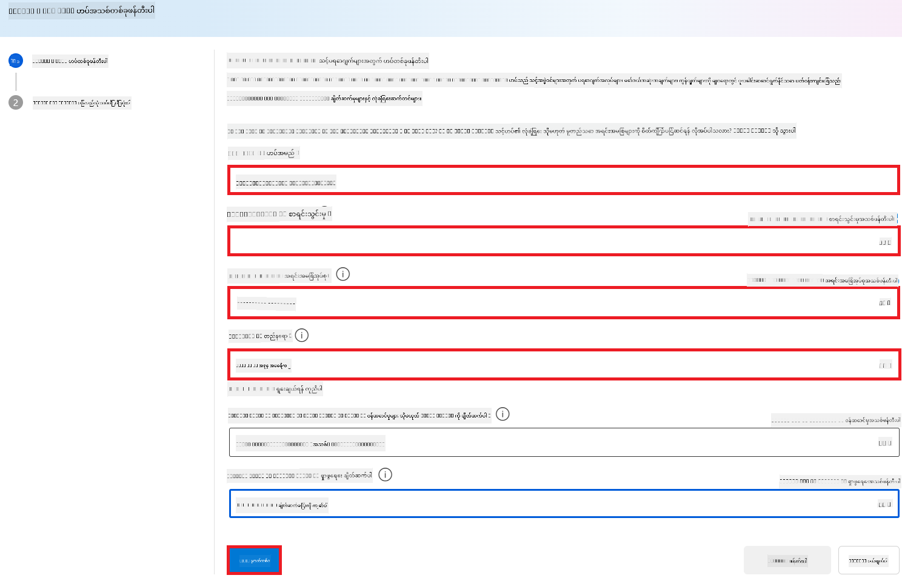
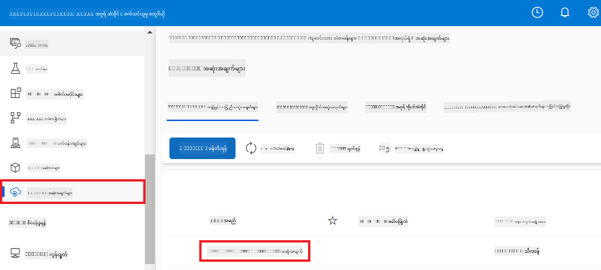

<!--
CO_OP_TRANSLATOR_METADATA:
{
  "original_hash": "ecbd9179a21edbaafaf114d47f09f3e3",
  "translation_date": "2025-07-17T02:04:48+00:00",
  "source_file": "md/02.Application/01.TextAndChat/Phi3/E2E_Phi-3-FineTuning_PromptFlow_Integration_AIFoundry.md",
  "language_code": "my"
}
-->
Translation for chunk 1 skipped due to timeout.
#### အတုပတ်ဝန်းကျင် တည်ဆောက်ခြင်း

1. Terminal ထဲမှာ အောက်ပါ command ကို ရိုက်ထည့်ပြီး *.venv* ဆိုတဲ့ အတုပတ်ဝန်းကျင်ကို ဖန်တီးပါ။

2. Terminal ထဲမှာ အောက်ပါ command ကို ရိုက်ထည့်ပြီး အတုပတ်ဝန်းကျင်ကို ဖွင့်ပါ။

> [!NOTE]
> အလုပ်လုပ်ခဲ့ရင် command prompt မတိုင်ခင်မှာ *(.venv)* ကို တွေ့ရပါမယ်။

#### လိုအပ်သော package များ ထည့်သွင်းခြင်း

1. Terminal ထဲမှာ အောက်ပါ command များကို ရိုက်ထည့်ပြီး လိုအပ်သော package များကို ထည့်သွင်းပါ။

#### `download_dataset.py` ဖိုင် ဖန်တီးခြင်း

> [!NOTE]
> ဖိုင်ဖွဲ့စည်းမှု အပြည့်အစုံ:
>
> ```text
> └── YourUserName
> .    └── finetune-phi
> .        └── download_dataset.py
> ```

1. **Visual Studio Code** ကို ဖွင့်ပါ။

1. မီနူးဘားမှ **File** ကို ရွေးချယ်ပါ။

1. **Open Folder** ကို ရွေးချယ်ပါ။

1. သင်ဖန်တီးထားသော *finetune-phi* ဖိုလ်ဒါကို ရွေးချယ်ပါ၊ အဲဒီဖိုလ်ဒါက *C:\Users\yourUserName\finetune-phi* မှာရှိပါတယ်။

    

1. Visual Studio Code ၏ ဘယ်ဘက် panel မှာ right-click လုပ်ပြီး **New File** ကို ရွေးချယ်ကာ *download_dataset.py* ဆိုတဲ့ ဖိုင်အသစ်ကို ဖန်တီးပါ။

    

### Fine-tuning အတွက် dataset ပြင်ဆင်ခြင်း

ဒီလေ့ကျင့်ခန်းမှာ *download_dataset.py* ဖိုင်ကို အသုံးပြုပြီး *ultrachat_200k* datasets ကို သင့်ဒေသတွင်း ပတ်ဝန်းကျင်သို့ ဒေါင်းလုပ်လုပ်ပါမယ်။ ထို့နောက် ဒီ datasets ကို အသုံးပြုပြီး Azure Machine Learning မှာ Phi-3 မော်ဒယ်ကို fine-tune လုပ်ပါမယ်။

ဒီလေ့ကျင့်ခန်းမှာ သင်လုပ်ဆောင်မယ့်အရာတွေကတော့ -

- *download_dataset.py* ဖိုင်ထဲကို datasets ဒေါင်းလုပ်လုပ်ဖို့ ကုဒ်ထည့်ခြင်း။
- *download_dataset.py* ဖိုင်ကို run လုပ်ပြီး datasets ကို ဒေသတွင်း ပတ်ဝန်းကျင်သို့ ဒေါင်းလုပ်လုပ်ခြင်း။

#### *download_dataset.py* ဖြင့် dataset ကို ဒေါင်းလုပ်လုပ်ခြင်း

1. Visual Studio Code မှာ *download_dataset.py* ဖိုင်ကို ဖွင့်ပါ။

1. အောက်ပါကုဒ်ကို *download_dataset.py* ဖိုင်ထဲ ထည့်ပါ။

1. Terminal ထဲမှာ အောက်ပါ command ကို ရိုက်ထည့်ပြီး script ကို run လုပ်ကာ dataset ကို ဒေသတွင်း ပတ်ဝန်းကျင်သို့ ဒေါင်းလုပ်လုပ်ပါ။

1. datasets များကို သင့်ဒေသတွင်း *finetune-phi/data* ဖိုလ်ဒါထဲမှာ အောင်မြင်စွာ သိမ်းဆည်းထားကြောင်း စစ်ဆေးပါ။

> [!NOTE]
>
> #### Dataset အရွယ်အစားနှင့် fine-tuning အချိန်အကြောင်း မှတ်ချက်
>
> ဒီသင်ခန်းစာမှာ dataset ရဲ့ ၁% (`split='train[:1%]'`) ကိုသာ အသုံးပြုထားပါတယ်။ ဒါကြောင့် ဒေတာအရေအတွက် လျော့နည်းပြီး upload နဲ့ fine-tuning လုပ်ချိန်တွေ လျင်မြန်စေပါတယ်။ သင့်လိုအပ်ချက်အရ training အချိန်နဲ့ မော်ဒယ်စွမ်းဆောင်ရည်အကြား သင့်တော်တဲ့ အချိုးကို ရှာဖွေနိုင်ဖို့ ရာခိုင်နှုန်းကို ပြင်ဆင်နိုင်ပါတယ်။ Dataset အနည်းငယ်သာ အသုံးပြုခြင်းက fine-tuning အချိန်ကို လျော့နည်းစေပြီး သင်ခန်းစာအတွက် လုပ်ငန်းစဉ်ကို ပိုမိုထိန်းချုပ်နိုင်စေပါတယ်။

## အခြေအနေ ၂: Phi-3 မော်ဒယ်ကို Fine-tune လုပ်ပြီး Azure Machine Learning Studio မှာ Deploy လုပ်ခြင်း

### Phi-3 မော်ဒယ်ကို Fine-tune လုပ်ခြင်း

ဒီလေ့ကျင့်ခန်းမှာ Azure Machine Learning Studio မှာ Phi-3 မော်ဒယ်ကို fine-tune လုပ်ပါမယ်။

ဒီလေ့ကျင့်ခန်းမှာ သင်လုပ်ဆောင်မယ့်အရာတွေက -

- Fine-tuning အတွက် computer cluster တည်ဆောက်ခြင်း။
- Azure Machine Learning Studio မှာ Phi-3 မော်ဒယ်ကို fine-tune လုပ်ခြင်း။

#### Fine-tuning အတွက် computer cluster တည်ဆောက်ခြင်း

1. [Azure ML Studio](https://ml.azure.com/home?wt.mc_id=studentamb_279723) သို့ သွားပါ။

1. ဘယ်ဘက် tab မှ **Compute** ကို ရွေးချယ်ပါ။

1. navigation menu မှ **Compute clusters** ကို ရွေးချယ်ပါ။

1. **+ New** ကို နှိပ်ပါ။

    

1. အောက်ပါအချက်များကို ပြုလုပ်ပါ -

    - သင်အသုံးပြုလိုသော **Region** ကို ရွေးချယ်ပါ။
    - **Virtual machine tier** ကို **Dedicated** အဖြစ် ရွေးချယ်ပါ။
    - **Virtual machine type** ကို **GPU** အဖြစ် ရွေးချယ်ပါ။
    - **Virtual machine size** filter ကို **Select from all options** အဖြစ် ရွေးချယ်ပါ။
    - **Virtual machine size** ကို **Standard_NC24ads_A100_v4** အဖြစ် ရွေးချယ်ပါ။

    

1. **Next** ကို နှိပ်ပါ။

1. အောက်ပါအချက်များကို ပြုလုပ်ပါ -

    - **Compute name** ထည့်ပါ။ ထူးခြားသော အမည်ဖြစ်ရပါမယ်။
    - **Minimum number of nodes** ကို **0** အဖြစ် ရွေးချယ်ပါ။
    - **Maximum number of nodes** ကို **1** အဖြစ် ရွေးချယ်ပါ။
    - **Idle seconds before scale down** ကို **120** အဖြစ် သတ်မှတ်ပါ။

    

1. **Create** ကို နှိပ်ပါ။

#### Phi-3 မော်ဒယ်ကို Fine-tune လုပ်ခြင်း

1. [Azure ML Studio](https://ml.azure.com/home?wt.mc_id=studentamb_279723) သို့ သွားပါ။

1. သင်ဖန်တီးထားသော Azure Machine Learning workspace ကို ရွေးချယ်ပါ။

    

1. အောက်ပါအချက်များကို ပြုလုပ်ပါ -

    - ဘယ်ဘက် tab မှ **Model catalog** ကို ရွေးချယ်ပါ။
    - **search bar** မှာ *phi-3-mini-4k* ဟု ရိုက်ထည့်ပြီး ပေါ်လာသော ရွေးချယ်စရာများထဲမှ **Phi-3-mini-4k-instruct** ကို ရွေးချယ်ပါ။

    

1. navigation menu မှ **Fine-tune** ကို ရွေးချယ်ပါ။

    

1. အောက်ပါအချက်များကို ပြုလုပ်ပါ -

    - **Select task type** ကို **Chat completion** အဖြစ် ရွေးချယ်ပါ။
    - **+ Select data** ကို နှိပ်ပြီး **Training data** ကို အပ်လုဒ်ပါ။
    - Validation data upload အမျိုးအစားကို **Provide different validation data** အဖြစ် ရွေးချယ်ပါ။
    - **+ Select data** ကို နှိပ်ပြီး **Validation data** ကို အပ်လုဒ်ပါ။

    

    > [!TIP]
    >
    > **Advanced settings** ကို ရွေးချယ်ပြီး **learning_rate** နဲ့ **lr_scheduler_type** စတဲ့ ဖန်တီးမှုများကို သင့်လိုအပ်ချက်အတိုင်း ပြင်ဆင်နိုင်ပါတယ်။

1. **Finish** ကို နှိပ်ပါ။

1. ဒီလေ့ကျင့်ခန်းမှာ သင် Azure Machine Learning ကို အသုံးပြုပြီး Phi-3 မော်ဒယ်ကို အောင်မြင်စွာ fine-tune လုပ်နိုင်ခဲ့ပါပြီ။ fine-tuning လုပ်ငန်းစဉ်မှာ အချိန်ကြာနိုင်တာကို သတိပြုပါ။ fine-tuning job ကို run လုပ်ပြီးနောက် အပြီးသတ်ရန် စောင့်ဆိုင်းရပါမယ်။ Azure Machine Learning Workspace ၏ ဘယ်ဘက် tab မှ Jobs tab ကို သွားပြီး fine-tuning job ၏ အခြေအနေကို ကြည့်ရှုနိုင်ပါတယ်။ နောက်တစ်ကြိမ်မှာ fine-tuned မော်ဒယ်ကို deploy လုပ်ပြီး Prompt flow နဲ့ ပေါင်းစည်းသွားမှာ ဖြစ်ပါတယ်။

    

### Fine-tuned Phi-3 မော်ဒယ်ကို Deploy လုပ်ခြင်း

Fine-tuned Phi-3 မော်ဒယ်ကို Prompt flow နဲ့ ပေါင်းစည်းဖို့အတွက် မော်ဒယ်ကို real-time inference အတွက် အသုံးပြုနိုင်ရန် deploy လုပ်ရပါမယ်။ ဒီလုပ်ငန်းစဉ်မှာ မော်ဒယ်ကို register လုပ်ခြင်း၊ online endpoint တည်ဆောက်ခြင်းနဲ့ မော်ဒယ်ကို deploy လုပ်ခြင်းတို့ ပါဝင်ပါတယ်။

ဒီလေ့ကျင့်ခန်းမှာ သင်လုပ်ဆောင်မယ့်အရာတွေက -

- Azure Machine Learning workspace မှာ fine-tuned မော်ဒယ်ကို register လုပ်ခြင်း။
- Online endpoint တည်ဆောက်ခြင်း။
- Register လုပ်ထားသော fine-tuned Phi-3 မော်ဒယ်ကို deploy လုပ်ခြင်း။

#### Fine-tuned မော်ဒယ်ကို Register လုပ်ခြင်း

1. [Azure ML Studio](https://ml.azure.com/home?wt.mc_id=studentamb_279723) သို့ သွားပါ။

1. သင်ဖန်တီးထားသော Azure Machine Learning workspace ကို ရွေးချယ်ပါ။

    

1. ဘယ်ဘက် tab မှ **Models** ကို ရွေးချယ်ပါ။

1. **+ Register** ကို နှိပ်ပါ။

1. **From a job output** ကို ရွေးချယ်ပါ။

    

1. သင်ဖန်တီးထားသော job ကို ရွေးချယ်ပါ။

    

1. **Next** ကို နှိပ်ပါ။

1. **Model type** ကို **MLflow** အဖြစ် ရွေးချယ်ပါ။

1. **Job output** ကို ရွေးထားပြီးဖြစ်ကြောင်း သေချာပါစေ၊ အလိုအလျောက် ရွေးထားပြီးဖြစ်ပါမယ်။

    

2. **Next** ကို နှိပ်ပါ။

3. **Register** ကို နှိပ်ပါ။

    

4. ဘယ်ဘက် tab မှ **Models** မီနူးကို သွားပြီး သင့် register လုပ်ထားသော မော်ဒယ်ကို ကြည့်ရှုနိုင်ပါသည်။

    

#### Fine-tuned မော်ဒယ်ကို Deploy လုပ်ခြင်း

1. သင်ဖန်တီးထားသော Azure Machine Learning workspace သို့ သွားပါ။

1. ဘယ်ဘက် tab မှ **Endpoints** ကို ရွေးချယ်ပါ။

1. navigation menu မှ **Real-time endpoints** ကို ရွေးချယ်ပါ။

    

1. **Create** ကို နှိပ်ပါ။

1. သင် register လုပ်ထားသော မော်ဒယ်ကို ရွေးချယ်ပါ။

    

1. **Select** ကို နှိပ်ပါ။

1. အောက်ပါအချက်များကို ပြုလုပ်ပါ -

    - **Virtual machine** ကို *Standard_NC6s_v3* အဖြစ် ရွေးချယ်ပါ။
    - သင်အသုံးပြုလိုသော **Instance count** ကို ရွေးချယ်ပါ၊ ဥပမာ *1*။
    - **Endpoint** ကို **New** အဖြစ် ရွေးချယ်ကာ endpoint အသစ် တည်ဆောက်ပါ။
    - **Endpoint name** ထည့်ပါ။ ထူးခြားသော အမည်ဖြစ်ရပါမယ်။
    - **Deployment name** ထည့်ပါ။ ထူးခြားသော အမည်ဖြစ်ရပါမယ်။

    

1. **Deploy** ကို နှိပ်ပါ။

> [!WARNING]
> သင့်အကောင့်ကို အပိုကြေးများ မဖြစ်စေရန် Azure Machine Learning workspace မှာ ဖန်တီးထားသော endpoint ကို ဖျက်ပစ်ရန် သေချာပါစေ။
>

#### Azure Machine Learning Workspace မှာ Deployment အခြေအနေ စစ်ဆေးခြင်း

1. သင်ဖန်တီးထားသော Azure Machine Learning workspace သို့ သွားပါ။

1. ဘယ်ဘက် tab မှ **Endpoints** ကို ရွေးချယ်ပါ။

1. သင်ဖန်တီးထားသော endpoint ကို ရွေးချယ်ပါ။

    

1. ဒီစာမျက်နှာမှာ deployment လုပ်စဉ်အတွင်း endpoint များကို စီမံခန့်ခွဲနိုင်ပါသည်။

> [!NOTE]
> Deployment ပြီးဆုံးသွားပါက **Live traffic** ကို **100%** အဖြစ် သတ်မှတ်ထားကြောင်း သေချာစေပါ။ မဟုတ်ပါက **Update traffic** ကို နှိပ်ပြီး traffic ကို ပြင်ဆင်နိုင်ပါသည်။ Traffic ကို 0% သတ်မှတ်ထားရင် မော်ဒယ်ကို စမ်းသပ်၍ မရပါ။
>
> 
>

## အခြေအနေ ၃: Prompt flow နဲ့ ပေါင်းစည်းပြီး သင့်စိတ်ကြိုက် မော်ဒယ်နဲ့ Azure AI Foundry မှာ စကားပြောခြင်း

### စိတ်ကြိုက် Phi-3 မော်ဒယ်ကို Prompt flow နဲ့ ပေါင်းစည်းခြင်း

Fine-tuned မော်ဒယ်ကို အောင်မြင်စွာ deploy လုပ်ပြီးနောက် Prompt Flow နဲ့ ပေါင်းစည်းနိုင်ပြီဖြစ်ပါတယ်။ ဒါက သင့်စိတ်ကြိုက် Phi-3 မော်ဒယ်နဲ့ အချိန်နဲ့တပြေးညီ အသုံးပြုနိုင်တဲ့ အမျိုးမျိုးသော အပြန်အလှန် လုပ်ဆောင်ချက်များကို လုပ်ဆောင်နိုင်စေပါသည်။

ဒီလေ့ကျင့်ခန်းမှာ သင်လုပ်ဆောင်မယ့်အရာတွေက -

- Azure AI Foundry Hub တည်ဆောက်ခြင်း။
- Azure AI Foundry Project ဖန်တီးခြင်း။
- Prompt flow ဖန်တီးခြင်း။
- Fine-tuned Phi-3 မော်ဒယ်အတွက် စိတ်ကြိုက် ချိတ်ဆက်မှု ထည့်သွင်းခြင်း။
- သင့်စိတ်ကြိုက် Phi-3 မော်ဒယ်နဲ့ စကားပြောရန် Prompt flow ကို ပြင်ဆင်ခြင်း။
> [!NOTE]
> သင်သည် Azure ML Studio ကို အသုံးပြု၍ Promptflow နှင့် ပေါင်းစည်းနိုင်ပါသည်။ အဲဒီပေါင်းစည်းမှုလုပ်ငန်းစဉ်ကို Azure ML Studio တွင်လည်း အတူတူ အသုံးပြုနိုင်ပါသည်။
#### Azure AI Foundry Hub ဖန်တီးခြင်း

Project ဖန်တီးမပြုမီ Hub တစ်ခု ဖန်တီးရပါမည်။ Hub သည် Resource Group အဖြစ် လုပ်ဆောင်ပြီး Azure AI Foundry အတွင်းရှိ Project များစွာကို စီမံခန့်ခွဲရန် အဆင်ပြေစေပါသည်။

1. [Azure AI Foundry](https://ai.azure.com/?WT.mc_id=aiml-137032-kinfeylo) သို့ သွားပါ။

1. ဘယ်ဘက်ဘားမှ **All hubs** ကို ရွေးချယ်ပါ။

1. နေရာပြောင်းမီနူးမှ **+ New hub** ကို ရွေးချယ်ပါ။

    

1. အောက်ပါအချက်များကို ပြုလုပ်ပါ-

    - **Hub name** ထည့်ပါ။ ထူးခြားသော အမည်ဖြစ်ရပါမည်။
    - သင့် Azure **Subscription** ကို ရွေးချယ်ပါ။
    - အသုံးပြုမည့် **Resource group** ကို ရွေးချယ်ပါ (လိုအပ်ပါက အသစ်ဖန်တီးပါ)။
    - အသုံးပြုလိုသော **Location** ကို ရွေးချယ်ပါ။
    - အသုံးပြုမည့် **Connect Azure AI Services** ကို ရွေးချယ်ပါ (လိုအပ်ပါက အသစ်ဖန်တီးပါ)။
    - **Connect Azure AI Search** ကို **Skip connecting** အဖြစ် ရွေးချယ်ပါ။

    

1. **Next** ကို နှိပ်ပါ။

#### Azure AI Foundry Project ဖန်တီးခြင်း

1. ဖန်တီးထားသော Hub အတွင်းမှ ဘယ်ဘက်ဘားမှ **All projects** ကို ရွေးချယ်ပါ။

1. နေရာပြောင်းမီနူးမှ **+ New project** ကို ရွေးချယ်ပါ။

    

1. **Project name** ထည့်ပါ။ ထူးခြားသော အမည်ဖြစ်ရပါမည်။

    

1. **Create a project** ကို နှိပ်ပါ။

#### fine-tuned Phi-3 မော်ဒယ်အတွက် custom connection ထည့်ခြင်း

သင့် custom Phi-3 မော်ဒယ်ကို Prompt flow နှင့် ပေါင်းစည်းရန် မော်ဒယ်၏ endpoint နှင့် key ကို custom connection ထဲသို့ သိမ်းဆည်းရပါမည်။ ဤဆက်တင်သည် Prompt flow တွင် သင့် custom Phi-3 မော်ဒယ်ကို အသုံးပြုနိုင်ရန် အာမခံပေးပါသည်။

#### fine-tuned Phi-3 မော်ဒယ်၏ api key နှင့် endpoint uri သတ်မှတ်ခြင်း

1. [Azure ML Studio](https://ml.azure.com/home?WT.mc_id=aiml-137032-kinfeylo) သို့ သွားပါ။

1. သင်ဖန်တီးထားသော Azure Machine learning workspace သို့ သွားပါ။

1. ဘယ်ဘက်ဘားမှ **Endpoints** ကို ရွေးချယ်ပါ။

    

1. ဖန်တီးထားသော endpoint ကို ရွေးချယ်ပါ။

    

1. နေရာပြောင်းမီနူးမှ **Consume** ကို ရွေးချယ်ပါ။

1. သင့် **REST endpoint** နှင့် **Primary key** ကို ကူးယူပါ။

    

#### Custom Connection ထည့်ခြင်း

1. [Azure AI Foundry](https://ai.azure.com/?WT.mc_id=aiml-137032-kinfeylo) သို့ သွားပါ။

1. သင်ဖန်တီးထားသော Azure AI Foundry project သို့ သွားပါ။

1. ဖန်တီးထားသော Project အတွင်း ဘယ်ဘက်ဘားမှ **Settings** ကို ရွေးချယ်ပါ။

1. **+ New connection** ကို ရွေးချယ်ပါ။

    

1. နေရာပြောင်းမီနူးမှ **Custom keys** ကို ရွေးချယ်ပါ။

    

1. အောက်ပါအချက်များကို ပြုလုပ်ပါ-

    - **+ Add key value pairs** ကို ရွေးချယ်ပါ။
    - key name အဖြစ် **endpoint** ထည့်ပြီး Azure ML Studio မှ ကူးယူထားသော endpoint ကို value field ထဲတွင် ပက်စ်ထည့်ပါ။
    - ထပ်မံ၍ **+ Add key value pairs** ကို ရွေးချယ်ပါ။
    - key name အဖြစ် **key** ထည့်ပြီး Azure ML Studio မှ ကူးယူထားသော key ကို value field ထဲတွင် ပက်စ်ထည့်ပါ။
    - key များ ထည့်ပြီးနောက် **is secret** ကို ရွေးချယ်၍ key များ ဖော်ပြမခံရအောင် ကာကွယ်ပါ။

    

1. **Add connection** ကို နှိပ်ပါ။

#### Prompt flow ဖန်တီးခြင်း

Azure AI Foundry တွင် custom connection ထည့်ပြီးပါပြီ။ ယခုအခါ အောက်ပါအဆင့်များဖြင့် Prompt flow တစ်ခု ဖန်တီးပါမည်။ ထို့နောက် ဤ Prompt flow ကို custom connection နှင့် ချိတ်ဆက်ပြီး fine-tuned မော်ဒယ်ကို Prompt flow အတွင်း အသုံးပြုနိုင်ပါမည်။

1. သင်ဖန်တီးထားသော Azure AI Foundry project သို့ သွားပါ။

1. ဘယ်ဘက်ဘားမှ **Prompt flow** ကို ရွေးချယ်ပါ။

1. နေရာပြောင်းမီနူးမှ **+ Create** ကို ရွေးချယ်ပါ။

    

1. နေရာပြောင်းမီနူးမှ **Chat flow** ကို ရွေးချယ်ပါ။

    

1. အသုံးပြုမည့် **Folder name** ထည့်ပါ။

    

2. **Create** ကို နှိပ်ပါ။

#### သင့် custom Phi-3 မော်ဒယ်နှင့် စကားပြောရန် Prompt flow ကို ပြင်ဆင်ခြင်း

fine-tuned Phi-3 မော်ဒယ်ကို Prompt flow ထဲသို့ ပေါင်းစည်းရန် လိုအပ်ပါသည်။ သို့သော် ယခင်ရှိသော Prompt flow သည် ဤရည်ရွယ်ချက်အတွက် မသင့်တော်ပါ။ ထို့ကြောင့် custom မော်ဒယ် ပေါင်းစည်းနိုင်ရန် Prompt flow ကို ပြန်လည်ဒီဇိုင်းဆွဲရပါမည်။

1. Prompt flow အတွင်း အောက်ပါအချက်များကို ပြုလုပ်၍ ရှိပြီးသား flow ကို ပြန်လည်တည်ဆောက်ပါ-

    - **Raw file mode** ကို ရွေးချယ်ပါ။
    - *flow.dag.yml* ဖိုင်အတွင်းရှိ ရှိပြီးသားကုဒ်အားလုံးကို ဖျက်ပါ။
    - *flow.dag.yml* ဖိုင်တွင် အောက်ပါကုဒ်ကို ထည့်ပါ။

        ```yml
        inputs:
          input_data:
            type: string
            default: "Who founded Microsoft?"

        outputs:
          answer:
            type: string
            reference: ${integrate_with_promptflow.output}

        nodes:
        - name: integrate_with_promptflow
          type: python
          source:
            type: code
            path: integrate_with_promptflow.py
          inputs:
            input_data: ${inputs.input_data}
        ```

    - **Save** ကို နှိပ်ပါ။

    

1. Prompt flow တွင် သင့် custom Phi-3 မော်ဒယ်ကို အသုံးပြုရန် *integrate_with_promptflow.py* ဖိုင်တွင် အောက်ပါကုဒ်ကို ထည့်ပါ။

    ```python
    import logging
    import requests
    from promptflow import tool
    from promptflow.connections import CustomConnection

    # Logging setup
    logging.basicConfig(
        format="%(asctime)s - %(levelname)s - %(name)s - %(message)s",
        datefmt="%Y-%m-%d %H:%M:%S",
        level=logging.DEBUG
    )
    logger = logging.getLogger(__name__)

    def query_phi3_model(input_data: str, connection: CustomConnection) -> str:
        """
        Send a request to the Phi-3 model endpoint with the given input data using Custom Connection.
        """

        # "connection" is the name of the Custom Connection, "endpoint", "key" are the keys in the Custom Connection
        endpoint_url = connection.endpoint
        api_key = connection.key

        headers = {
            "Content-Type": "application/json",
            "Authorization": f"Bearer {api_key}"
        }
        data = {
            "input_data": {
                "input_string": [
                    {"role": "user", "content": input_data}
                ],
                "parameters": {
                    "temperature": 0.7,
                    "max_new_tokens": 128
                }
            }
        }
        try:
            response = requests.post(endpoint_url, json=data, headers=headers)
            response.raise_for_status()
            
            # Log the full JSON response
            logger.debug(f"Full JSON response: {response.json()}")

            result = response.json()["output"]
            logger.info("Successfully received response from Azure ML Endpoint.")
            return result
        except requests.exceptions.RequestException as e:
            logger.error(f"Error querying Azure ML Endpoint: {e}")
            raise

    @tool
    def my_python_tool(input_data: str, connection: CustomConnection) -> str:
        """
        Tool function to process input data and query the Phi-3 model.
        """
        return query_phi3_model(input_data, connection)

    ```

    

> [!NOTE]
> Azure AI Foundry တွင် Prompt flow အသုံးပြုနည်း ပိုမိုအသေးစိတ် သိရှိလိုပါက [Prompt flow in Azure AI Foundry](https://learn.microsoft.com/azure/ai-studio/how-to/prompt-flow) ကို ကြည့်ရှုနိုင်ပါသည်။

1. **Chat input**, **Chat output** ကို ရွေးချယ်၍ မော်ဒယ်နှင့် စကားပြောနိုင်ရန် ဖွင့်ပါ။

    

1. ယခု သင့် custom Phi-3 မော်ဒယ်နှင့် စကားပြောရန် အသင့်ဖြစ်ပါပြီ။ နောက်ထပ် လေ့ကျင့်မှုတွင် Prompt flow ကို စတင်အသုံးပြုခြင်းနှင့် fine-tuned Phi-3 မော်ဒယ်နှင့် စကားပြောနည်းကို သင်ယူပါမည်။

> [!NOTE]
>
> ပြန်လည်တည်ဆောက်ထားသော flow သည် အောက်ပါပုံစံကဲ့သို့ ဖြစ်ရပါမည်-
>
> 
>

### သင့် custom Phi-3 မော်ဒယ်နှင့် စကားပြောခြင်း

fine-tuned ပြီး သင့် custom Phi-3 မော်ဒယ်ကို Prompt flow နှင့် ပေါင်းစည်းပြီးဖြစ်သောကြောင့် ယခု မော်ဒယ်နှင့် ဆက်သွယ်စကားပြောရန် အသင့်ဖြစ်ပါပြီ။ ဤလေ့ကျင့်မှုသည် Prompt flow ကို အသုံးပြု၍ မော်ဒယ်နှင့် စကားပြောရန် ပြင်ဆင်ခြင်းနှင့် စတင်ခြင်းကို လမ်းညွှန်ပေးပါမည်။ ဤအဆင့်များကို လိုက်နာခြင်းဖြင့် သင့် fine-tuned Phi-3 မော်ဒယ်၏ စွမ်းဆောင်ရည်များကို အပြည့်အဝ အသုံးချနိုင်ပါမည်။

- Prompt flow ကို အသုံးပြု၍ သင့် custom Phi-3 မော်ဒယ်နှင့် စကားပြောပါ။

#### Prompt flow စတင်ခြင်း

1. Prompt flow စတင်ရန် **Start compute sessions** ကို နှိပ်ပါ။

    

1. ပါရာမီတာများကို ပြန်လည်သတ်မှတ်ရန် **Validate and parse input** ကို နှိပ်ပါ။

    

1. သင်ဖန်တီးထားသော custom connection ၏ **connection** အတွက် **Value** ကို ရွေးချယ်ပါ။ ဥပမာ- *connection*။

    

#### သင့် custom မော်ဒယ်နှင့် စကားပြောခြင်း

1. **Chat** ကို ရွေးချယ်ပါ။

    

1. ရလဒ်ဥပမာ- ယခု သင့် custom Phi-3 မော်ဒယ်နှင့် စကားပြောနိုင်ပါပြီ။ fine-tuning အတွက် အသုံးပြုထားသော ဒေတာအပေါ် အခြေခံ၍ မေးခွန်းများ မေးရန် အကြံပြုပါသည်။

    

**အကြောင်းကြားချက်**  
ဤစာတမ်းကို AI ဘာသာပြန်ဝန်ဆောင်မှု [Co-op Translator](https://github.com/Azure/co-op-translator) ဖြင့် ဘာသာပြန်ထားပါသည်။ ကျွန်ုပ်တို့သည် တိကျမှန်ကန်မှုအတွက် ကြိုးစားသော်လည်း၊ အလိုအလျောက် ဘာသာပြန်ခြင်းများတွင် အမှားများ သို့မဟုတ် မှားယွင်းချက်များ ပါဝင်နိုင်ကြောင်း သတိပြုပါရန် မေတ္တာရပ်ခံအပ်ပါသည်။ မူရင်းစာတမ်းကို မိမိဘာသာစကားဖြင့်သာ တရားဝင်အချက်အလက်အဖြစ် ယူဆသင့်ပါသည်။ အရေးကြီးသော အချက်အလက်များအတွက် လူ့ဘာသာပြန်ပညာရှင်မှ ဘာသာပြန်ခြင်းကို အကြံပြုပါသည်။ ဤဘာသာပြန်ချက်ကို အသုံးပြုမှုကြောင့် ဖြစ်ပေါ်လာနိုင်သည့် နားလည်မှုမှားယွင်းမှုများအတွက် ကျွန်ုပ်တို့ တာဝန်မယူပါ။