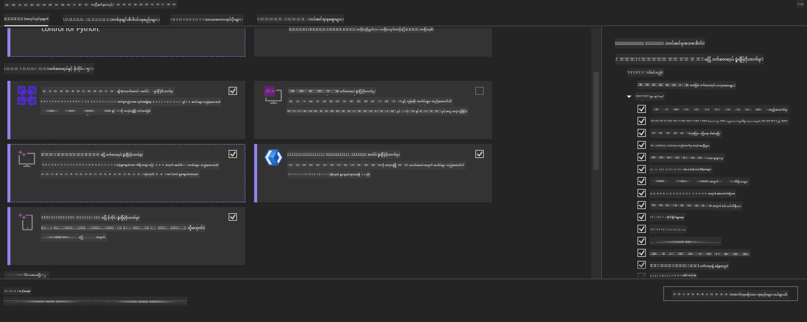
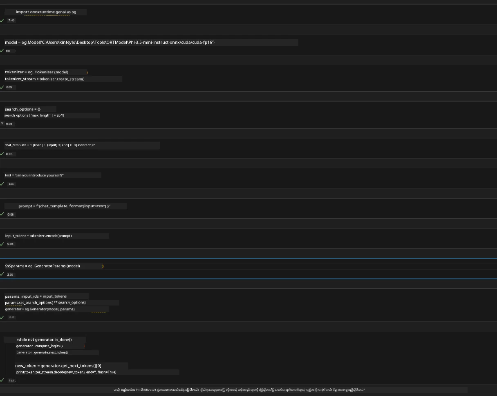
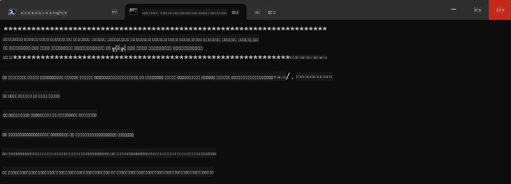

# **OnnxRuntime GenAI Windows GPU အတွက် လမ်းညွှန်ချက်**

ဤလမ်းညွှန်ချက်သည် Windows ပေါ်တွင် GPU များဖြင့် ONNX Runtime (ORT) ကို တပ်ဆင်အသုံးပြုခြင်းဆိုင်ရာ အဆင့်များကို ပေးပါသည်။ သင့် မော်ဒယ်များအတွက် GPU ကြောင့် လျှင်မြန်မှုနှင့် ထိရောက်မှုတိုးတက်စေရန် ဒီလမ်းညွှန်ချက်ကို အသုံးပြုနိုင်မှာဖြစ်သည်။

စာရွက်ဖြစ်သည်မှာ အောက်ပါအချက်များကို လမ်းညွှန်ပေးသည်-

- ပတ်ဝန်းကျင် ပြင်ဆင်ခြင်း: CUDA၊ cuDNN၊ နှင့် ONNX Runtime ကဲ့သို့ လိုအပ်သော အကူအညီပစ္စည်းများတပ်ဆင်နည်း။
- ဆက်တင် ပြင်ဆင်ခြင်း: GPU အရင်းအမြစ်များကို ထိရောက်စွာ အသုံးပြုနိုင်ရန် ပတ်ဝန်းကျင်နှင့် ONNX Runtime ကို ပြင်ဆင်နည်း။
- ပြုပြင်တိုးတတ်နည်းအကြံပြုချက်များ: စွမ်းဆောင်ရည်အကောင်းဆုံးရရှိစေရန် GPU ဆက်တင်များကို ညှိနှိုင်းနည်း။

### **1. Python 3.10.x /3.11.8**

   ***မှတ်ချက်*** သင့် Python ပတ်ဝန်းကျင်အဖြစ် [miniforge](https://github.com/conda-forge/miniforge/releases/latest/download/Miniforge3-Windows-x86_64.exe) ကို အသုံးပြုရန် အကြံပြုသည်

   ```bash

   conda create -n pydev python==3.11.8

   conda activate pydev

   ```

   ***သတိပေးချက်*** Python ONNX 라이브러리를 တပ်ဆင်ပြီးသားရှိပါက အရင်ဆုံး ဖျက်ပစ်ရန်။

### **2. winget ဖြင့် CMake တပ်ဆင်ခြင်း**


   ```bash

   winget install -e --id Kitware.CMake

   ```

### **3. Visual Studio 2022 - Desktop Development with C++ တပ်ဆင်ခြင်း**

   ***မှတ်ချက်*** သင် compile မလုပ်ချင်ပါက ဒီအဆင့်ကို ကျော်လွှားနိုင်သည်




### **4. NVIDIA Driver တပ်ဆင်ခြင်း**

1. **NVIDIA GPU Driver**  [https://www.nvidia.com/en-us/drivers/](https://www.nvidia.com/en-us/drivers/)

2. **NVIDIA CUDA 12.4** [https://developer.nvidia.com/cuda-12-4-0-download-archive](https://developer.nvidia.com/cuda-12-4-0-download-archive)

3. **NVIDIA CUDNN 9.4**  [https://developer.nvidia.com/cudnn-downloads](https://developer.nvidia.com/cudnn-downloads)

***သတိပေးချက်*** တပ်ဆင်သည့်အခါ Default ဆက်တင်များကို အသုံးပြုရန်

### **5. NVIDIA Env ကို သတ်မှတ်ခြင်း**

NVIDIA CUDNN 9.4 lib, bin, include များကို NVIDIA CUDA 12.4 lib, bin, include ထဲသို့ ကူးယူပါ

- *'C:\Program Files\NVIDIA\CUDNN\v9.4\bin\12.6'* များကို *'C:\Program Files\NVIDIA GPU Computing Toolkit\CUDA\v12.4\bin'* သို့ ကူးပါ

- *'C:\Program Files\NVIDIA\CUDNN\v9.4\include\12.6'* များကို *'C:\Program Files\NVIDIA GPU Computing Toolkit\CUDA\v12.4\include'* သို့ ကူးပါ

- *'C:\Program Files\NVIDIA\CUDNN\v9.4\lib\12.6'* များကို *'C:\Program Files\NVIDIA GPU Computing Toolkit\CUDA\v12.4\lib\x64'* သို့ ကူးပါ


### **6. Phi-3.5-mini-instruct-onnx ကို ဒေါင်းလုပ်လုပ်ခြင်း**


   ```bash

   winget install -e --id Git.Git

   winget install -e --id GitHub.GitLFS

   git lfs install

   git clone https://huggingface.co/microsoft/Phi-3.5-mini-instruct-onnx

   ```

### **7. InferencePhi35Instruct.ipynb ကို ပြေးခြင်း**

   [Notebook](../../../../code/09.UpdateSamples/Aug/ortgpu-phi35-instruct.ipynb) ကို ဖွင့်၍ အောက်ပါအတိုင်း အကောင်အထည်ဖော်ပါ





### **8. ORT GenAI GPU ကို Compile ပြုလုပ်ခြင်း**


   ***မှတ်ချက်*** 
   
   1. ပထမဆုံး အထက်ပါ ONNX နှင့် ONNX Runtime နှင့် ONNX Runtime GenAI library များအားလုံးကို ဖျက်ပစ်ပါ

   
   ```bash

   pip list 
   
   ```

   ထို့နောက် onnxruntime library များအားလုံးကို ဖျက်ပစ်ပါ။


   ```bash

   pip uninstall onnxruntime

   pip uninstall onnxruntime-genai

   pip uninstall onnxruntume-genai-cuda
   
   ```

   2. Visual Studio Extension ပံ့ပိုးမှုကို စစ်ဆေးပါ

   C:\Program Files\NVIDIA GPU Computing Toolkit\CUDA\v12.4\extras တွင် C:\Program Files\NVIDIA GPU Computing Toolkit\CUDA\v12.4\extras\visual_studio_integration ဖိုင်လ်ကို တွေ့ရှိရမည်။
   
   မတွေ့လျှင် အခြား CUDA toolkit driver ဖိုလ်ဒါများအား စစ်ဆေး၍ visual_studio_integration ဖိုလ်ဒါနှင့် ထဲတွင်းပါဝင်ပစ္စည်းများကို C:\Program Files\NVIDIA GPU Computing Toolkit\CUDA\v12.4\extras\visual_studio_integration ထဲသို့ ကူးပါ


   - သင် compile မလုပ်ချင်ပါက ဒီအဆင့်ကို ကျော်လွှားနိုင်သည်


   ```bash

   git clone https://github.com/microsoft/onnxruntime-genai

   ```

   - [https://github.com/microsoft/onnxruntime/releases/download/v1.19.2/onnxruntime-win-x64-gpu-1.19.2.zip](https://github.com/microsoft/onnxruntime/releases/download/v1.19.2/onnxruntime-win-x64-gpu-1.19.2.zip) ကို ဒေါင်းလုပ်လုပ်ပါ

   - onnxruntime-win-x64-gpu-1.19.2.zip ကိုဖွင့်ပြီး **ort** ဟူ၍ အမည်ပြောင်းပြီး onnxruntime-genai ထဲသို့ ort ဖိုလ်ဒါကို ကူးပါ

   - Windows Terminal ကို အသုံးပြု၍ Developer Command Prompt for VS 2022 သို့သွားပြီး onnxruntime-genai ထဲသို့ ဝင်ပါ



   - သင့် Python ပတ်ဝန်းကျင်ဖြင့် compile လုပ်ပါ

   
   ```bash

   cd onnxruntime-genai

   python build.py --use_cuda  --cuda_home "C:\Program Files\NVIDIA GPU Computing Toolkit\CUDA\v12.4" --config Release
 

   cd build/Windows/Release/Wheel

   pip install .whl

   ```

---

<!-- CO-OP TRANSLATOR DISCLAIMER START -->
**ပြောကြားချက်**
ဤစာတမ်းကို AI ဘာသာပြန်ဝန်ဆောင်မှု [Co-op Translator](https://github.com/Azure/co-op-translator) အသုံးပြု၍ ဘာသာပြန်ထားပါသည်။ ကျွန်ုပ်တို့သည် တိကျမှန်ကန်မှုအတွက် ကြိုးပမ်းနေသော်လည်း၊ စက်ကိရိယာဘာသာပြန်ခြင်းများတွင် အမှားများ သို့မဟုတ် မှားယွင်းချက်များ ပါဝင်နိုင်ကြောင်း သတိပြုပါရန် လိုအပ်ပါသည်။ မူလစာတမ်းကို မူရင်းဘာသာဖြင့်သာ ယုံကြည်စိတ်ချရသော အချက်အလက်အဖြစ် သတ်မှတ်သင့်သည်။ အရေးကြီးသည့် သတင်းအချက်အလက်များအတွက် ပရော်ဖက်ရှင်နယ် လူသားဘာသာပြန်သူဝန်ဆောင်မှုကို အကြံပြုပါသည်။ ဤဘာသာပြန်ချက်ကို အသုံးပြုခြင်းမှ ဖြစ်ပေါ်လာသော နားလည်မှုကွာခြားမှုများ သို့မဟုတ် မမှန်ကန်သော အသုံးပြုမှုများအတွက် ကျွန်ုပ်တို့ တာဝန်မခံပါ။
<!-- CO-OP TRANSLATOR DISCLAIMER END -->