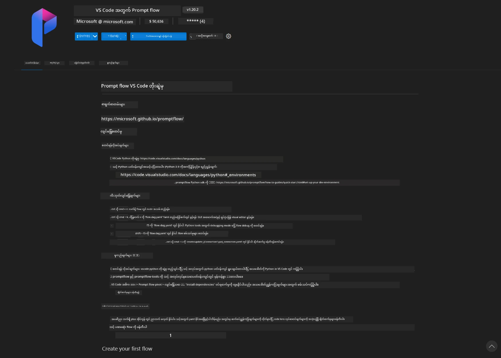
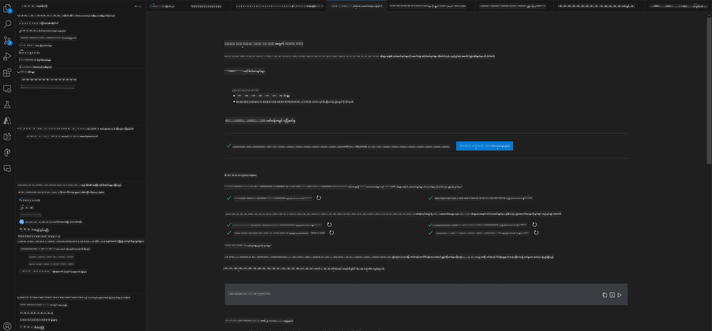
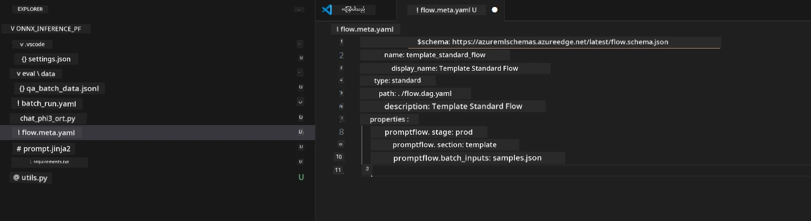
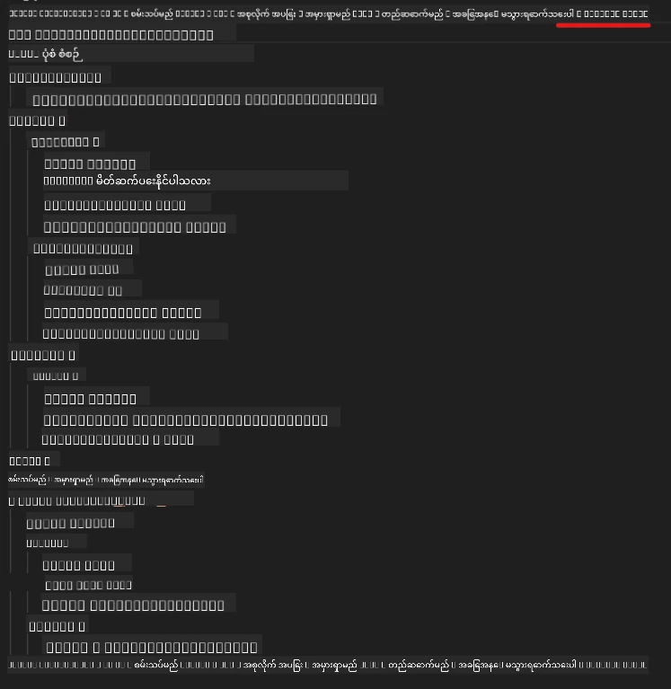
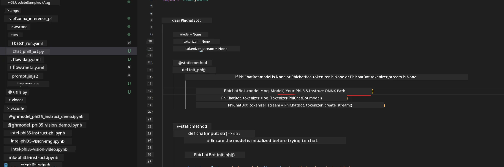
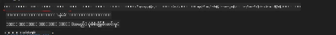
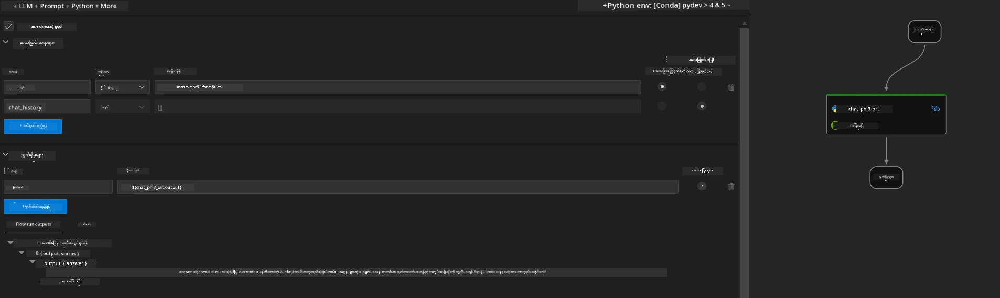
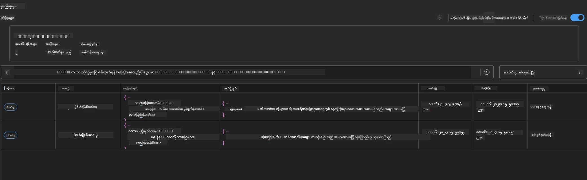

# Windows GPU ကို အသုံးပြုပြီး Phi-3.5-Instruct ONNX ဖြင့် Prompt flow ဖြေရှင်းချက် ဖန်တီးခြင်း

အောက်ပါစာတမ်းသည် Phi-3 မော်ဒယ်များအပေါ် အခြေခံ၍ AI အက်ပလီကေးရှင်းများ ဖန်တီးရာတွင် ONNX (Open Neural Network Exchange) နှင့် PromptFlow ကို မည်သို့ အသုံးပြုရမည်ကို ဥပမာပြထားသည်။

PromptFlow သည် LLM (Large Language Model) အခြေခံ AI အက်ပလီကေးရှင်းများ၏ စဉ်ဆက်မပြတ် ဖန်တီးမှု လုပ်ငန်းစဉ်ကို အဆင်ပြေစေရန် ဖန်တီးထားသော ဖွံ့ဖြိုးရေးကိရိယာများ စုစည်းမှုဖြစ်ပြီး စိတ်ကူးကနေ စမ်းသပ်ခြင်း၊ သုံးသပ်ခြင်းအထိ အဆင့်ဆင့် လုပ်ငန်းစဉ်များကို လွယ်ကူစွာ စီမံခန့်ခွဲနိုင်စေသည်။

PromptFlow ကို ONNX နှင့် ပေါင်းစပ်အသုံးပြုခြင်းဖြင့် ဖွံ့ဖြိုးသူများသည် -

- မော်ဒယ်စွမ်းဆောင်ရည် တိုးတက်စေခြင်း - ONNX ကို အသုံးပြု၍ မော်ဒယ် inference နှင့် တပ်ဆင်ခြင်းကို ထိရောက်စွာ ပြုလုပ်နိုင်သည်။
- ဖွံ့ဖြိုးရေး လုပ်ငန်းစဉ် လွယ်ကူစေခြင်း - PromptFlow ဖြင့် workflow ကို စီမံခန့်ခွဲပြီး ထပ်ခါထပ်ခါ လုပ်ဆောင်ရသော အလုပ်များကို အလိုအလျောက် ပြုလုပ်နိုင်သည်။
- ပူးပေါင်းဆောင်ရွက်မှု တိုးတက်စေခြင်း - တစ်ဖက်သတ် ဖွံ့ဖြိုးရေးပတ်ဝန်းကျင်တစ်ခုဖြင့် အဖွဲ့ဝင်များအကြား ပိုမိုကောင်းမွန်သော ပူးပေါင်းဆောင်ရွက်မှုကို အထောက်အကူပြုသည်။

**Prompt flow** သည် LLM အခြေခံ AI အက်ပလီကေးရှင်းများ၏ စိတ်ကူးကနေ စမ်းသပ်ခြင်း၊ သုံးသပ်ခြင်း၊ ထုတ်လုပ်မှု တပ်ဆင်ခြင်းနှင့် စောင့်ကြည့်ခြင်းအထိ စဉ်ဆက်မပြတ် ဖွံ့ဖြိုးရေးလုပ်ငန်းစဉ်ကို လွယ်ကူစေရန် ဖန်တီးထားသော ကိရိယာများ စုစည်းမှုဖြစ်သည်။ Prompt engineering ကို ပိုမိုလွယ်ကူစေပြီး ထုတ်လုပ်မှုအရည်အသွေးရှိသော LLM အက်ပလီကေးရှင်းများ ဖန်တီးနိုင်စေသည်။

Prompt flow သည် OpenAI, Azure OpenAI Service နှင့် စိတ်ကြိုက်ပြင်ဆင်နိုင်သော မော်ဒယ်များ (Huggingface, ဒေသခံ LLM/SLM) နှင့် ချိတ်ဆက်နိုင်သည်။ Phi-3.5 ၏ quantized ONNX မော်ဒယ်ကို ဒေသခံ အက်ပလီကေးရှင်းများတွင် တပ်ဆင်ရန် မျှော်လင့်ထားသည်။ Prompt flow သည် Phi-3.5 အခြေခံ ဒေသခံ ဖြေရှင်းချက်များကို ပိုမိုကောင်းမွန်စွာ စီမံခန့်ခွဲနိုင်ရန် အထောက်အကူပြုနိုင်သည်။ ဤဥပမာတွင် Windows GPU အခြေခံ ONNX Runtime GenAI Library ကို ပေါင်းစပ်၍ Prompt flow ဖြေရှင်းချက်ကို ပြီးမြောက်စေမည်ဖြစ်သည်။

## **တပ်ဆင်ခြင်း**

### **Windows GPU အတွက် ONNX Runtime GenAI**

Windows GPU အတွက် ONNX Runtime GenAI ကို တပ်ဆင်ရန် ဤလမ်းညွှန်ကို ဖတ်ပါ [click here](./ORTWindowGPUGuideline.md)

### **VSCode တွင် Prompt flow ကို စတင်တပ်ဆင်ခြင်း**

1. Prompt flow VS Code Extension ကို တပ်ဆင်ပါ



2. Prompt flow VS Code Extension တပ်ဆင်ပြီးနောက်၊ extension ကို နှိပ်ပြီး **Installation dependencies** ကို ရွေးချယ်ပါ၊ ဤလမ်းညွှန်အတိုင်း Prompt flow SDK ကို သင့်ပတ်ဝန်းကျင်တွင် တပ်ဆင်ပါ



3. [နမူနာကုဒ်](../../../../../../code/09.UpdateSamples/Aug/pf/onnx_inference_pf) ကို ဒေါင်းလုပ်လုပ်ပြီး VS Code ဖြင့် ဖွင့်ပါ



4. **flow.dag.yaml** ကို ဖွင့်ပြီး သင့် Python ပတ်ဝန်းကျင်ကို ရွေးချယ်ပါ



   **chat_phi3_ort.py** ကို ဖွင့်ပြီး သင့် Phi-3.5-instruct ONNX မော်ဒယ် တည်နေရာကို ပြောင်းလဲပါ



5. သင့် prompt flow ကို စမ်းသပ်ရန် ပြေးပါ

**flow.dag.yaml** ကို ဖွင့်ပြီး visual editor ကို နှိပ်ပါ



နှိပ်ပြီးနောက် စမ်းသပ်ရန် ပြေးပါ



1. terminal တွင် batch ကို ပြေး၍ ပိုမိုသော ရလဒ်များကို စစ်ဆေးနိုင်သည်

```bash

pf run create --file batch_run.yaml --stream --name 'Your eval qa name'    

```

သင့်ပုံမှန် browser တွင် ရလဒ်များကို စစ်ဆေးနိုင်သည်



**အကြောင်းကြားချက်**  
ဤစာတမ်းကို AI ဘာသာပြန်ဝန်ဆောင်မှု [Co-op Translator](https://github.com/Azure/co-op-translator) ဖြင့် ဘာသာပြန်ထားပါသည်။ ကျွန်ုပ်တို့သည် တိကျမှန်ကန်မှုအတွက် ကြိုးစားသော်လည်း၊ အလိုအလျောက် ဘာသာပြန်ခြင်းများတွင် အမှားများ သို့မဟုတ် မှားယွင်းချက်များ ပါဝင်နိုင်ကြောင်း သတိပြုပါရန် မေတ္တာရပ်ခံအပ်ပါသည်။ မူရင်းစာတမ်းကို မိမိဘာသာစကားဖြင့်သာ တရားဝင်အချက်အလက်အဖြစ် ယူဆသင့်ပါသည်။ အရေးကြီးသော အချက်အလက်များအတွက် လူ့ဘာသာပြန်ပညာရှင်မှ ဘာသာပြန်ခြင်းကို အကြံပြုပါသည်။ ဤဘာသာပြန်ချက်ကို အသုံးပြုရာမှ ဖြစ်ပေါ်လာနိုင်သည့် နားလည်မှုမှားယွင်းမှုများအတွက် ကျွန်ုပ်တို့သည် တာဝန်မယူပါ။