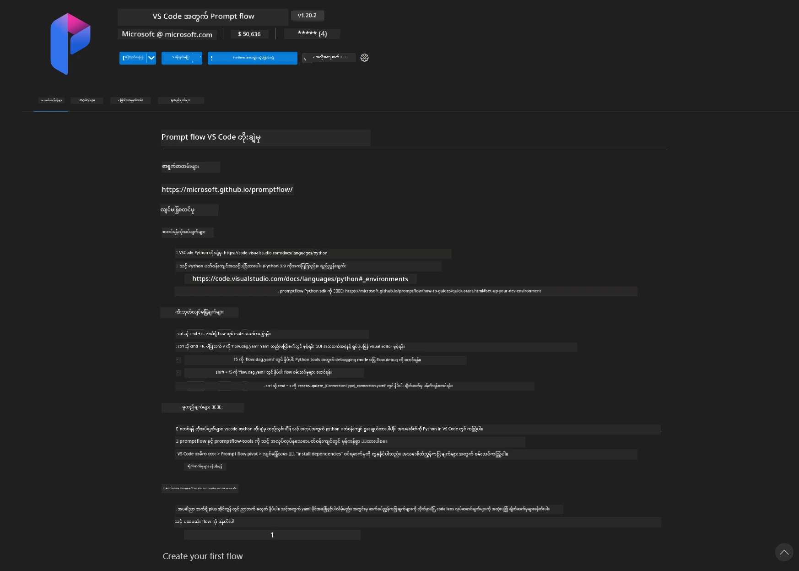
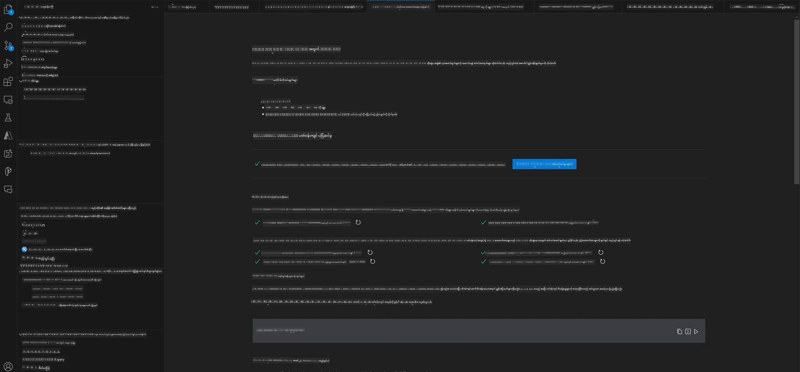
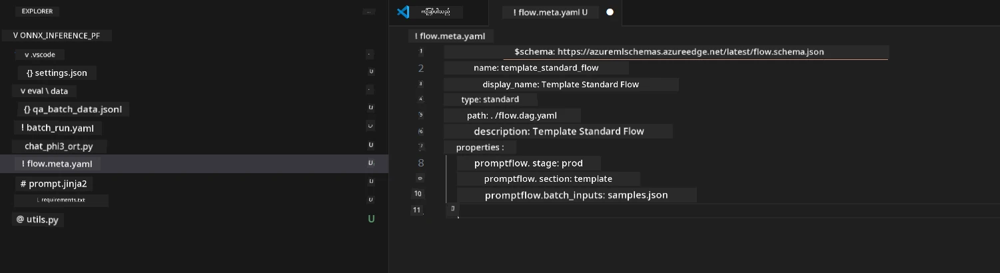
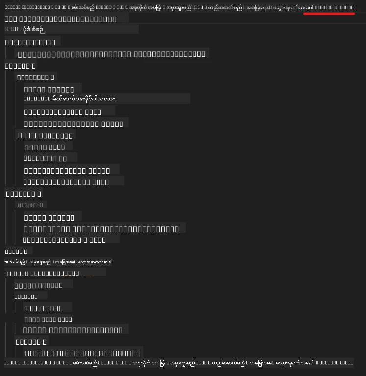
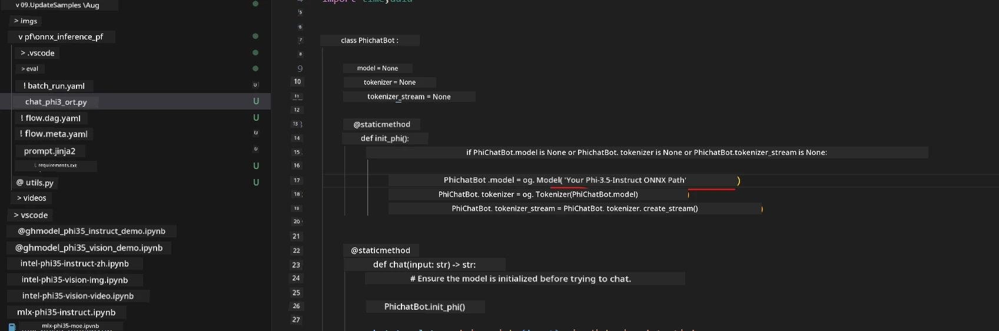
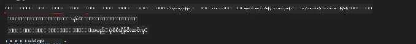
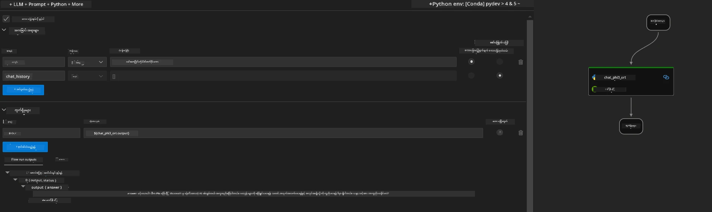
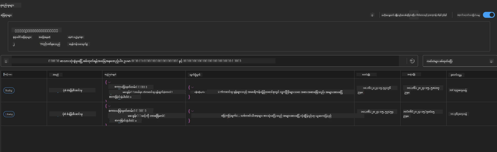

# Phi-3.5-Instruct ONNX နှင့်အတူ Windows GPU ကိုအသုံးပြုကာ Prompt flow ဖြေရှင်းချက် ဖန်တီးခြင်း

အောက်ပါစာရွက်စာတမ်းမှာ Phi-3 မော်ဒယ်များအခြေခံ၍ AI ဆော့ဖ်ဝဲများဖန်တီးရာတွင် ONNX (Open Neural Network Exchange) နှင့် PromptFlow ကို မည်သို့အသုံးပြုရမည်ကို နမူနာဖော်ပြထားသည်။

PromptFlow သည် LLM အခြေခံ AI ဆော့ဖ်ဝဲများ၏ အတွင်းစဉ်ဖွံ့ဖြိုးတိုးတက်မှု အရွယ်အစားအပြည့်အစုံကို အဆိုပြုစီမံခန့်ခွဲပေးသည့် ဖွံ့ဖြိုးရေးကိရိယာစုစည်းမှုဖြစ်ပြီး စဉ်းစားတည်ဆောက်ခြင်း၊ မော်ကွန်းပြုလုပ်ခြင်းမှစ၍ စမ်းသပ်ခြင်းနှင့် အကဲဖြတ်ခြင်းအထိ လွယ်ကူစွာ လုပ်ကိုင်နိုင်စေသည်။

PromptFlow ကို ONNX နှင့် ပေါင်းစပ်၍ ဖွံ့ဖြိုးသူများသည် -

- မော်ဒယ်စွမ်းဆောင်ရည် တိုးတက်စေရန်: မော်ဒယ်အထွက်မှတ်တမ်းများကို ပိုမိုထိရောက်စွာ ပြုလုပ်နိုင်ရန် ONNX ကိုအသုံးပြုပါ။
- ဖွံ့ဖြိုးရေး လွယ်ကူစေရန်: PromptFlow ဖြင့် အလုပ်စဉ်ကို စီမံ၍ ပြန်လည်လုပ်ဆောင်မည့် အလုပ်များကို အလိုအလျောက်ပြုလုပ်ပါ။
- ပူးပေါင်းဆောင်ရွက်မှု မြှင့်တင်ရန်: အသင်းဖွဲ့ဝင်များအကြား ပူးပေါင်းဆောင်ရွက်မှုကို ကောင်းမွန်စေရန် စုံလင်သော ဖွံ့ဖြိုးရေးပတ်ဝန်းကျင် ပံ့ပိုးပေးပါ။

**Prompt flow** သည် LLM အခြေခံ AI ဆော့ဖ်ဝဲများ၏ စဉ်းစားတည်ဆောက်ခြင်း၊ မော်ကွန်းပြုလုပ်ခြင်း၊ စမ်းသပ်ခြင်း၊ အကဲဖြတ်ခြင်းမှ စပြီး ထုတ်လုပ်မှု ထည့်သွင်းခြင်းနှင့် ထိန်းသိမ်းမှုအထိ အလုပ်စဉ်အများဆုံးကို လွယ်ကူမြန်ဆန်စွာ တည်ဆောက်နိုင်သော ဖွံ့ဖြိုးရေးကိရိယာစုစည်းမှုဖြစ်ပြီး prompt engineering ကို ပို၍ လွယ်ကူစေပြီး ထုတ်လုပ်မှုအရည်အသွေးရှိသော LLM app များ တည်ဆောက်နိုင်စေသည်။

Prompt flow သည် OpenAI, Azure OpenAI Service နှင့် ကိုယ်ပိုင်ပြုပြင်နိုင်သော မော်ဒယ်များ (Huggingface, ဒေသတွင်း LLM/SLM) နှင့် ချိတ်ဆက်နိုင်သည်။ ကျွန်ုပ်တို့တွင် Phi-3.5 ၏ quantized ONNX မော်ဒယ်ကို ဒေသတွင်း ဆော့ဖ်ဝဲများအတွက် ထည့်သွင်းအသုံးပြုရန် ရည်ရွယ်သည်။ Prompt flow သည် ကျွန်ုပ်တို့၏ စီးပွားရေးအစီအစဉ်များကို ပိုမိုအစီအစဉ်ပြုနိုင်ချင်းနှင့် Phi-3.5 အခြေခံ ဒေသတွင်း ဖြေရှင်းချက်များကို ပြီးမြောက်စွာ တည်ဆောက်နိုင်ရန် ကူညီပေးနိုင်သည်။ ဤနမူနာတွင် Windows GPU အခြေခံ ONNX Runtime GenAI စာကြည့်တိုက်ကို ပေါင်းစပ်ပြီး Prompt flow ဖြေရှင်းချက်ကို ပြီးမြောက်စေရမည်ဖြစ်သည်။

## **တပ်ဆင်ခြင်း**

### **Windows GPU အတွက် ONNX Runtime GenAI**

Windows GPU အတွက် ONNX Runtime GenAI ကို တပ်ဆင်ရန် လမ်းညွှန်ချက်တွင် ဖတ်ရှုရန် [click here](./ORTWindowGPUGuideline.md)

### **VSCode တွင် Prompt flow ကို စတင်တပ်ဆင်ခြင်း**

1. Prompt flow VS Code Extension ကို တပ်ဆင်ပါ



2. Prompt flow VS Code Extension တပ်ဆင်ပြီးပါက Extension ကိုနှိပ်ပြီး **Installation dependencies** ကို ရွေးချယ်ပြီး မှတ်စုရန် လမ်းညွှန်ချက်အတိုင်း Prompt flow SDK ကို သင့်ပတ်ဝန်းကျင်တွင် တပ်ဆင်ပါ။



3. [Sample Code](../../../../../../code/09.UpdateSamples/Aug/pf/onnx_inference_pf) ကိုဒေါင်းလုပ်လုပ်ပြီး VS Code ဖြင့် ဒီနမူနာကို ဖွင့်ပါ



4. **flow.dag.yaml** ကိုဖွင့်ပြီး သင့် Python ပတ်ဝန်းကျင်ကို ရွေးချယ်ပါ



   **chat_phi3_ort.py** ကိုဖွင့်၍ သင့် Phi-3.5-instruct ONNX မော်ဒယ်တည်နေရာကို ပြောင်းလဲပါ



5. သင့် prompt flow ကို စမ်းသပ်ရန် အမေးအဖြေပြုလုပ်ပါ

**flow.dag.yaml** ကိုဖွင့်ပြီး visual editor ကိုနှိပ်ပါ



၎င်းကို နှိပ်ပြီး စမ်းသပ်ရန် ဂရုစိုက်ဆောင်ရွက်ပါ



1. terminal မှ batch ကို လည်ပတ်စေ၍ နောက်ထပ်ရလဒ်များကို စစ်ဆေးနိုင်သည်


```bash

pf run create --file batch_run.yaml --stream --name 'Your eval qa name'    

```

သင်၏ သတ်မှတ်ထားသော browser တွင် ရလဒ်များကို ကြည့်ရှုနိုင်ပါသည်။




---

<!-- CO-OP TRANSLATOR DISCLAIMER START -->
**ပြောကြားချက်**
ဤစာတမ်းကို AI ဘာသာပြန်ဝန်ဆောင်မှု [Co-op Translator](https://github.com/Azure/co-op-translator) အသုံးပြု၍ ဘာသာပြန်ထားပါသည်။ ကျွန်ုပ်တို့သည် တိကျမှန်ကန်မှုအတွက် ကြိုးပမ်းနေသော်လည်း၊ စက်ကိရိယာဘာသာပြန်ခြင်းများတွင် အမှားများ သို့မဟုတ် မှားယွင်းချက်များ ပါဝင်နိုင်ကြောင်း သတိပြုပါရန် လိုအပ်ပါသည်။ မူလစာတမ်းကို မူရင်းဘာသာဖြင့်သာ ယုံကြည်စိတ်ချရသော အချက်အလက်အဖြစ် သတ်မှတ်သင့်သည်။ အရေးကြီးသည့် သတင်းအချက်အလက်များအတွက် ပရော်ဖက်ရှင်နယ် လူသားဘာသာပြန်သူဝန်ဆောင်မှုကို အကြံပြုပါသည်။ ဤဘာသာပြန်ချက်ကို အသုံးပြုခြင်းမှ ဖြစ်ပေါ်လာသော နားလည်မှုကွာခြားမှုများ သို့မဟုတ် မမှန်ကန်သော အသုံးပြုမှုများအတွက် ကျွန်ုပ်တို့ တာဝန်မခံပါ။
<!-- CO-OP TRANSLATOR DISCLAIMER END -->