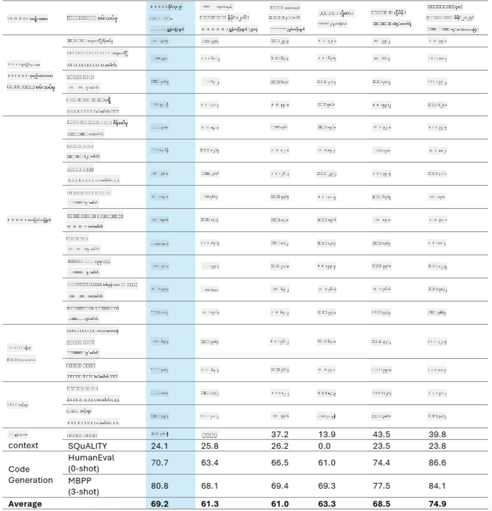
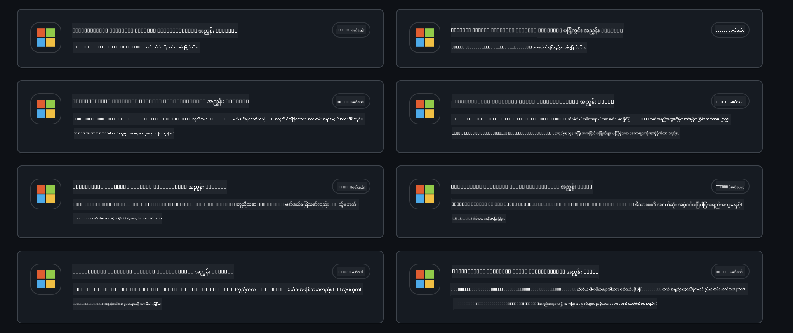
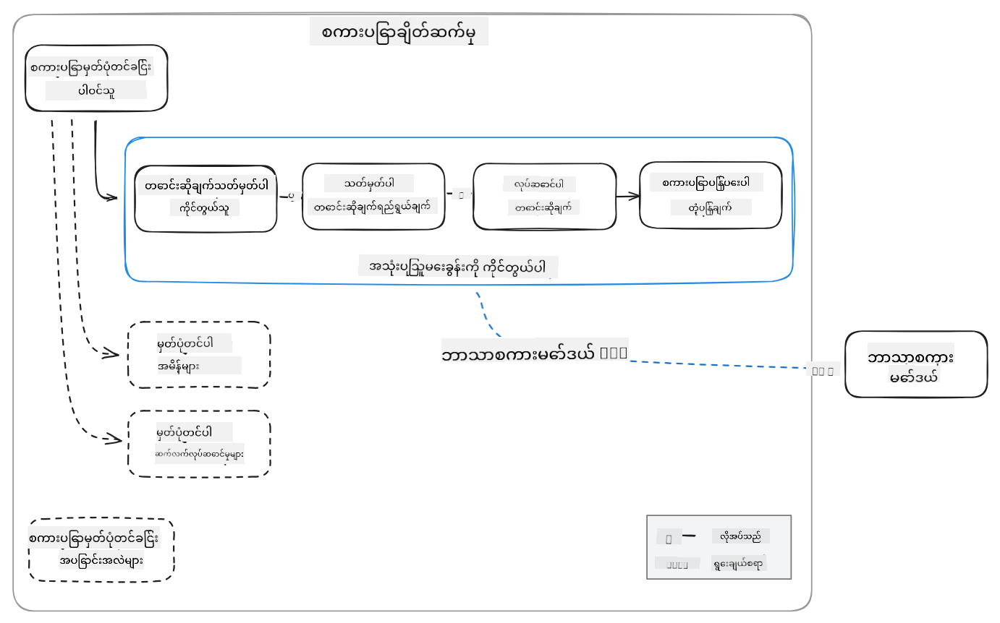
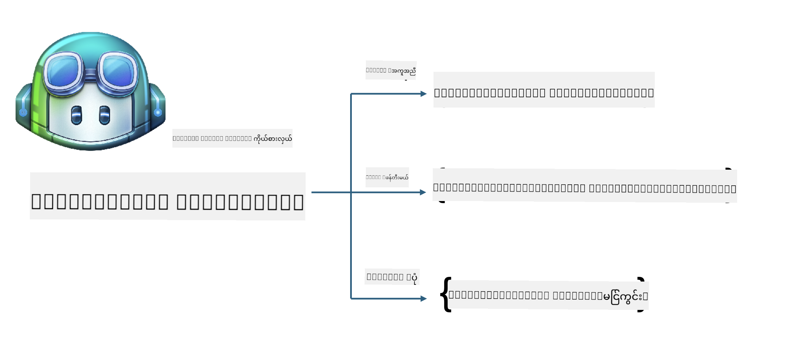
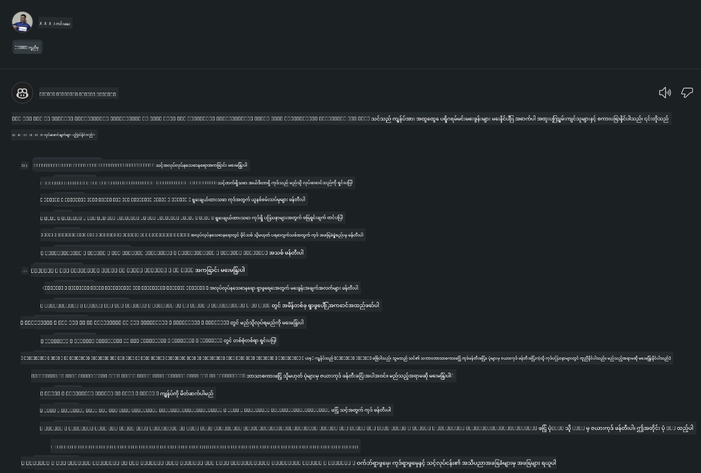
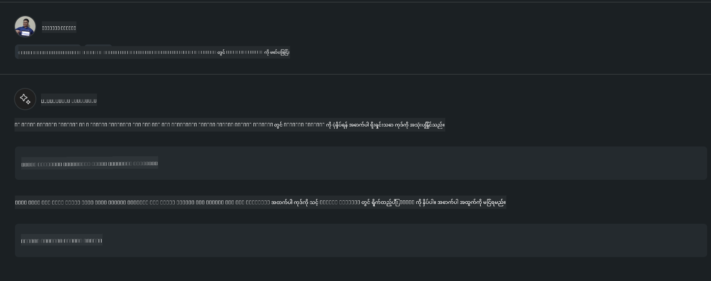

<!--
CO_OP_TRANSLATOR_METADATA:
{
  "original_hash": "35bf81388ac6917277b8d9a0c39bdc70",
  "translation_date": "2025-07-17T03:31:30+00:00",
  "source_file": "md/02.Application/02.Code/Phi3/CreateVSCodeChatAgentWithGitHubModels.md",
  "language_code": "my"
}
-->
# **GitHub Models ဖြင့် Phi-3.5 ကို အသုံးပြု၍ သင့်ကိုယ်ပိုင် Visual Studio Code Chat Copilot Agent ဖန်တီးခြင်း**

သင် Visual Studio Code Copilot ကို အသုံးပြုနေပါသလား? အထူးသဖြင့် Chat တွင် သင့်ရဲ့ Visual Studio Code မှာ ပရောဂျက်များ ဖန်တီးရေးသားထိန်းသိမ်းနိုင်စွမ်းကို တိုးတက်စေရန် အမျိုးမျိုးသော Agent များကို အသုံးပြုနိုင်ပါတယ်။ Visual Studio Code သည် ကုမ္ပဏီများနှင့် တစ်ဦးချင်းစီအတွက် မိမိတို့လုပ်ငန်းအပေါ် အခြေခံ၍ အမျိုးမျိုးသော Agent များ ဖန်တီးနိုင်ရန် API ကို ပံ့ပိုးပေးထားပြီး၊ မတူညီသော ပိုင်ဆိုင်မှုနယ်ပယ်များတွင် စွမ်းဆောင်ရည်များကို တိုးချဲ့နိုင်စေပါတယ်။ ဤဆောင်းပါးတွင် GitHub Models ၏ **Phi-3.5-mini-instruct (128k)** နှင့် **Phi-3.5-vision-instruct (128k)** ကို အခြေခံ၍ သင့်ကိုယ်ပိုင် Visual Studio Code Agent ကို ဖန်တီးခြင်းအပေါ် အာရုံစိုက်ပါမည်။

## **GitHub Models တွင် Phi-3.5 အကြောင်း**

Phi-3/3.5 မိသားစုရှိ Phi-3/3.5-mini-instruct သည် ကုဒ်နားလည်မှုနှင့် ဖန်တီးနိုင်စွမ်းများအားကောင်းပြီး Gemma-2-9b နှင့် Mistral-Nemo-12B-instruct-2407 ထက် အားသာချက်ရှိကြောင်း ကျွန်ုပ်တို့ သိရှိထားပါသည်။



နောက်ဆုံးထွက် GitHub Models များတွင် Phi-3.5-mini-instruct (128k) နှင့် Phi-3.5-vision-instruct (128k) မော်ဒယ်များကို ရရှိနိုင်ပြီး၊ ဖန်တီးသူများသည် OpenAI SDK၊ Azure AI Inference SDK နှင့် REST API များမှတဆင့် ဝင်ရောက်အသုံးပြုနိုင်ပါသည်။



***Note: *** ထုတ်လုပ်မှုပတ်ဝန်းကျင်တွင် Azure Model Catalog နှင့် ပိုမိုကောင်းမွန်စွာ ပြောင်းလဲအသုံးပြုနိုင်သောကြောင့် Azure AI Inference SDK ကို အသုံးပြုရန် အကြံပြုပါသည်။

အောက်တွင် GitHub Models နှင့် ချိတ်ဆက်ပြီးနောက် **Phi-3.5-mini-instruct (128k)** နှင့် **Phi-3.5-vision-instruct (128k)** မော်ဒယ်များ၏ ကုဒ်ဖန်တီးမှု စမ်းသပ်ရလဒ်များနှင့် နမူနာများကို ပြထားပါသည်။

**Demo: GitHub Models Phi-3.5-mini-instruct (128k) မှ Prompt ဖြင့် ကုဒ်ဖန်တီးခြင်း** ([ဒီလင့်ခ်ကိုနှိပ်ပါ](../../../../../../code/09.UpdateSamples/Aug/ghmodel_phi35_instruct_demo.ipynb))

**Demo: GitHub Models Phi-3.5-vision-instruct (128k) မှ ပုံမှန် ကုဒ်ဖန်တီးခြင်း** ([ဒီလင့်ခ်ကိုနှိပ်ပါ](../../../../../../code/09.UpdateSamples/Aug/ghmodel_phi35_vision_demo.ipynb))


## **GitHub Copilot Chat Agent အကြောင်း**

GitHub Copilot Chat Agent သည် ကုဒ်အခြေခံ၍ ပရောဂျက်အမျိုးမျိုးတွင် မတူညီသောတာဝန်များကို ပြီးမြောက်စေပါသည်။ စနစ်တွင် Agent လေးမျိုးရှိသည်- workspace, github, terminal, vscode


Agent အမည်ကို ‘@’ ဖြင့် ထည့်သွင်းခြင်းအားဖြင့် သက်ဆိုင်ရာ အလုပ်များကို အမြန်ဆုံး ပြီးမြောက်စေနိုင်သည်။ စီးပွားရေးလုပ်ငန်းများအတွက် မိမိလုပ်ငန်းနှင့်ဆိုင်သော လိုအပ်ချက်များ၊ ကုဒ်ရေးသားခြင်း၊ စမ်းသပ်မှုစံနှုန်းများနှင့် ထုတ်ပြန်ခြင်းများကို ထည့်သွင်းပါက GitHub Copilot အခြေခံ စီးပွားရေးလုပ်ငန်းပုဂ္ဂိုလ်ရေး လုပ်ဆောင်ချက်များ ပိုမိုခိုင်မာစေပါသည်။

Visual Studio Code Chat Agent သည် ယခုအခါ တရားဝင် API ကို ထုတ်ပြန်ပြီးဖြစ်ကာ၊ စီးပွားရေးလုပ်ငန်းများ သို့မဟုတ် စီးပွားရေးလုပ်ငန်း ဖန်တီးသူများအနေဖြင့် မတူညီသော ဆော့ဖ်ဝဲလုပ်ငန်းစဉ်ပတ်ဝန်းကျင်များအပေါ် အခြေခံ၍ Agent များ ဖန်တီးနိုင်ပါသည်။ Visual Studio Code Extension Development နည်းလမ်းအတိုင်း ဖန်တီးခြင်းဖြင့် Visual Studio Code Chat Agent API ၏ အင်တာဖေ့စ်ကို လွယ်ကူစွာ ဝင်ရောက်အသုံးပြုနိုင်ပါသည်။ ဤလုပ်ငန်းစဉ်အပေါ် အခြေခံ၍ ဖန်တီးနိုင်ပါသည်။



ဖန်တီးမှုအခြေအနေတွင် တတိယပါတီ မော်ဒယ် API များ (GitHub Models, Azure Model Catalog, နှင့် open source မော်ဒယ်များအပေါ် အခြေခံ၍ ကိုယ်ပိုင်တည်ဆောက်ထားသော ဝန်ဆောင်မှုများ) ကို ဝင်ရောက်အသုံးပြုနိုင်ပြီး GitHub Copilot မှ ပံ့ပိုးပေးသော gpt-35-turbo, gpt-4, gpt-4o မော်ဒယ်များကိုလည်း အသုံးပြုနိုင်ပါသည်။

## **Phi-3.5 အခြေခံ၍ @phicoding Agent ထည့်သွင်းခြင်း**

Phi-3.5 ၏ ပရိုဂရမ်ရေးသားနိုင်စွမ်းများကို ပေါင်းစပ်၍ ကုဒ်ရေးသားခြင်း၊ ပုံမှန် ကုဒ်ဖန်တီးခြင်းနှင့် အခြားတာဝန်များ ပြီးမြောက်စေရန် ကြိုးစားပါသည်။ Phi-3.5 အပေါ် အခြေခံ၍ ဖန်တီးထားသော Agent - @PHI ၏ အချို့သော လုပ်ဆောင်ချက်များမှာ

1. GitHub Copilot မှ ပံ့ပိုးသော GPT-4o ကို အသုံးပြု၍ **@phicoding /help** command ဖြင့် ကိုယ်တိုင်မိတ်ဆက်စာ ဖန်တီးခြင်း

2. **Phi-3.5-mini-instruct (128k)** အပေါ် အခြေခံ၍ **@phicoding /gen** command ဖြင့် အမျိုးမျိုးသော programming language များအတွက် ကုဒ်ဖန်တီးခြင်း

3. **Phi-3.5-vision-instruct (128k)** နှင့် ပုံမှန် ပြီးမြောက်မှုအပေါ် အခြေခံ၍ **@phicoding /image** command ဖြင့် ကုဒ်ဖန်တီးခြင်း



## **ဆက်စပ်အဆင့်များ**

1. npm ကို အသုံးပြု၍ Visual Studio Code Extension ဖန်တီးမှု ပံ့ပိုးမှုကို ထည့်သွင်းပါ

```bash

npm install --global yo generator-code 

```

2. Visual Studio Code Extension plugin တစ်ခု ဖန်တီးပါ (Typescript ဖန်တီးမှုနည်းလမ်းဖြင့်၊ အမည်ပေးခြင်း - phiext)

```bash

yo code 

```

3. ဖန်တီးထားသော ပရောဂျက်ကို ဖွင့်ပြီး package.json ကို ပြင်ဆင်ပါ။ ဤနေရာတွင် ဆက်စပ်ညွှန်ကြားချက်များ၊ GitHub Models ၏ ဖွဲ့စည်းမှုများ ပါဝင်ပြီး GitHub Models token ကို ထည့်သွင်းရန် လိုအပ်ပါသည်။

```json

{
  "name": "phiext",
  "displayName": "phiext",
  "description": "",
  "version": "0.0.1",
  "engines": {
    "vscode": "^1.93.0"
  },
  "categories": [
    "AI",
    "Chat"
  ],
  "activationEvents": [],
  "enabledApiProposals": [
      "chatVariableResolver"
  ],
  "main": "./dist/extension.js",
  "contributes": {
    "chatParticipants": [
        {
            "id": "chat.phicoding",
            "name": "phicoding",
            "description": "Hey! I am Microsoft Phi-3.5, She can help me with coding problems, such as generation code with your natural language, or even generation code about chart from images. Just ask me anything!",
            "isSticky": true,
            "commands": [
                {
                    "name": "help",
                    "description": "Introduce myself to you"
                },
                {
                    "name": "gen",
                    "description": "Generate code for you with Microsoft Phi-3.5-mini-instruct"
                },
                {
                    "name": "image",
                    "description": "Generate code for chart from image(png or jpg) with Microsoft Phi-3.5-vision-instruct, please add image url like this : https://ajaytech.co/wp-content/uploads/2019/09/index.png"
                }
            ]
        }
    ],
    "commands": [
        {
            "command": "phicoding.namesInEditor",
            "title": "Use Microsoft Phi 3.5 in Editor"
        }
    ],
    "configuration": {
      "type": "object",
      "title": "githubmodels",
      "properties": {
        "githubmodels.endpoint": {
          "type": "string",
          "default": "https://models.inference.ai.azure.com",
          "description": "Your GitHub Models Endpoint",
          "order": 0
        },
        "githubmodels.api_key": {
          "type": "string",
          "default": "Your GitHub Models Token",
          "description": "Your GitHub Models Token",
          "order": 1
        },
        "githubmodels.phi35instruct": {
          "type": "string",
          "default": "Phi-3.5-mini-instruct",
          "description": "Your Phi-35-Instruct Model",
          "order": 2
        },
        "githubmodels.phi35vision": {
          "type": "string",
          "default": "Phi-3.5-vision-instruct",
          "description": "Your Phi-35-Vision Model",
          "order": 3
        }
      }
    }
  },
  "scripts": {
    "vscode:prepublish": "npm run package",
    "compile": "webpack",
    "watch": "webpack --watch",
    "package": "webpack --mode production --devtool hidden-source-map",
    "compile-tests": "tsc -p . --outDir out",
    "watch-tests": "tsc -p . -w --outDir out",
    "pretest": "npm run compile-tests && npm run compile && npm run lint",
    "lint": "eslint src",
    "test": "vscode-test"
  },
  "devDependencies": {
    "@types/vscode": "^1.93.0",
    "@types/mocha": "^10.0.7",
    "@types/node": "20.x",
    "@typescript-eslint/eslint-plugin": "^8.3.0",
    "@typescript-eslint/parser": "^8.3.0",
    "eslint": "^9.9.1",
    "typescript": "^5.5.4",
    "ts-loader": "^9.5.1",
    "webpack": "^5.94.0",
    "webpack-cli": "^5.1.4",
    "@vscode/test-cli": "^0.0.10",
    "@vscode/test-electron": "^2.4.1"
  },
  "dependencies": {
    "@types/node-fetch": "^2.6.11",
    "node-fetch": "^3.3.2",
    "@azure-rest/ai-inference": "latest",
    "@azure/core-auth": "latest",
    "@azure/core-sse": "latest"
  }
}


```

4. src/extension.ts ကို ပြင်ဆင်ပါ

```typescript

// The module 'vscode' contains the VS Code extensibility API
// Import the module and reference it with the alias vscode in your code below
import * as vscode from 'vscode';
import ModelClient from "@azure-rest/ai-inference";
import { AzureKeyCredential } from "@azure/core-auth";


interface IPhiChatResult extends vscode.ChatResult {
    metadata: {
        command: string;
    };
}


const MODEL_SELECTOR: vscode.LanguageModelChatSelector = { vendor: 'copilot', family: 'gpt-4o' };

function isValidImageUrl(url: string): boolean {
    const regex = /^(https?:\/\/.*\.(?:png|jpg))$/i;
    return regex.test(url);
}
  

// This method is called when your extension is activated
// Your extension is activated the very first time the command is executed
export function activate(context: vscode.ExtensionContext) {

    const codinghandler: vscode.ChatRequestHandler = async (request: vscode.ChatRequest, context: vscode.ChatContext, stream: vscode.ChatResponseStream, token: vscode.CancellationToken): Promise<IPhiChatResult> => {


        const config : any = vscode.workspace.getConfiguration('githubmodels');
        const endPoint: string = config.get('endpoint');
        const apiKey: string = config.get('api_key');
        const phi35instruct: string = config.get('phi35instruct');
        const phi35vision: string = config.get('phi35vision');
        
        if (request.command === 'help') {

            const content = "Welcome to Coding assistant with Microsoft Phi-3.5"; 
            stream.progress(content);


            try {
                const [model] = await vscode.lm.selectChatModels(MODEL_SELECTOR);
                if (model) {
                    const messages = [
                        vscode.LanguageModelChatMessage.User("Please help me express this content in a humorous way: I am a programming assistant who can help you convert natural language into code and generate code based on the charts in the images. output format like this : Hey I am Phi ......")
                    ];
                    const chatResponse = await model.sendRequest(messages, {}, token);
                    for await (const fragment of chatResponse.text) {
                        stream.markdown(fragment);
                    }
                }
            } catch(err) {
                console.log(err);
            }


            return { metadata: { command: 'help' } };

        }

        
        if (request.command === 'gen') {

            const content = "Welcome to use phi-3.5 to generate code";

            stream.progress(content);

            const client = new ModelClient(endPoint, new AzureKeyCredential(apiKey));

            const response = await client.path("/chat/completions").post({
              body: {
                messages: [
                  { role:"system", content: "You are a coding assistant.Help answer all code generation questions." },
                  { role:"user", content: request.prompt }
                ],
                model: phi35instruct,
                temperature: 0.4,
                max_tokens: 1000,
                top_p: 1.
              }
            });

            stream.markdown(response.body.choices[0].message.content);

            return { metadata: { command: 'gen' } };

        }


        
        if (request.command === 'image') {


            const content = "Welcome to use phi-3.5 to generate code from image(png or jpg),image url like this:https://ajaytech.co/wp-content/uploads/2019/09/index.png";

            stream.progress(content);

            if (!isValidImageUrl(request.prompt)) {
                stream.markdown('Please provide a valid image URL');
                return { metadata: { command: 'image' } };
            }
            else
            {

                const client = new ModelClient(endPoint, new AzureKeyCredential(apiKey));
    
                const response = await client.path("/chat/completions").post({
                    body: {
                      messages: [
                        { role: "system", content: "You are a helpful assistant that describes images in details." },
                        { role: "user", content: [
                            { type: "text", text: "Please generate code according to the chart in the picture according to the following requirements\n1. Keep all information in the chart, including data and text\n2. Do not generate additional information that is not included in the chart\n3. Please extract data from the picture, do not generate it from csv\n4. Please save the regenerated chart as a chart and save it to ./output/demo.png"},
                            { type: "image_url", image_url: {url: request.prompt}
                            }
                          ]
                        }
                      ],
                      model: phi35vision,
                      temperature: 0.4,
                      max_tokens: 2048,
                      top_p: 1.
                    }
                  });
    
                
                stream.markdown(response.body.choices[0].message.content);
    
                return { metadata: { command: 'image' } };
            }


        }


        return { metadata: { command: '' } };
    };


    const phi_ext = vscode.chat.createChatParticipant("chat.phicoding", codinghandler);

    phi_ext.iconPath = new vscode.ThemeIcon('sparkle');


    phi_ext.followupProvider = {
        provideFollowups(result: IPhiChatResult, context: vscode.ChatContext, token: vscode.CancellationToken) {
            return [{
                prompt: 'Let us coding with Phi-3.5 😋😋😋😋',
                label: vscode.l10n.t('Enjoy coding with Phi-3.5'),
                command: 'help'
            } satisfies vscode.ChatFollowup];
        }
    };

    context.subscriptions.push(phi_ext);
}

// This method is called when your extension is deactivated
export function deactivate() {}


```

6. လည်ပတ်ခြင်း

***/help***



***@phicoding /help***


***@phicoding /gen***



***@phicoding /image***


နမူနာကုဒ်ကို ဒေါင်းလုပ်လုပ်နိုင်ပါသည် :[click](../../../../../../code/09.UpdateSamples/Aug/vscode)

## **အရင်းအမြစ်များ**

1. GitHub Models အတွက် စာရင်းသွင်းရန် [https://gh.io/models](https://gh.io/models)

2. Visual Studio Code Extension ဖန်တီးမှုကို လေ့လာရန် [https://code.visualstudio.com/api/get-started/your-first-extension](https://code.visualstudio.com/api/get-started/your-first-extension)

3. Visual Studio Code Copilot Chat API အကြောင်း လေ့လာရန် [https://code.visualstudio.com/api/extension-guides/chat](https://code.visualstudio.com/api/extension-guides/chat)

**အကြောင်းကြားချက်**  
ဤစာတမ်းကို AI ဘာသာပြန်ဝန်ဆောင်မှု [Co-op Translator](https://github.com/Azure/co-op-translator) ဖြင့် ဘာသာပြန်ထားပါသည်။ ကျွန်ုပ်တို့သည် တိကျမှန်ကန်မှုအတွက် ကြိုးစားသော်လည်း အလိုအလျောက် ဘာသာပြန်ခြင်းတွင် အမှားများ သို့မဟုတ် မှားယွင်းချက်များ ပါဝင်နိုင်ကြောင်း သတိပြုပါရန် မေတ္တာရပ်ခံအပ်ပါသည်။ မူရင်းစာတမ်းကို မူလဘာသာဖြင့်သာ တရားဝင်အချက်အလက်အဖြစ် ယူဆသင့်ပါသည်။ အရေးကြီးသော အချက်အလက်များအတွက် လူ့ဘာသာပြန်ပညာရှင်မှ ဘာသာပြန်ခြင်းကို အကြံပြုပါသည်။ ဤဘာသာပြန်ချက်ကို အသုံးပြုရာမှ ဖြစ်ပေါ်လာနိုင်သည့် နားလည်မှုမှားယွင်းမှုများအတွက် ကျွန်ုပ်တို့သည် တာဝန်မယူပါ။