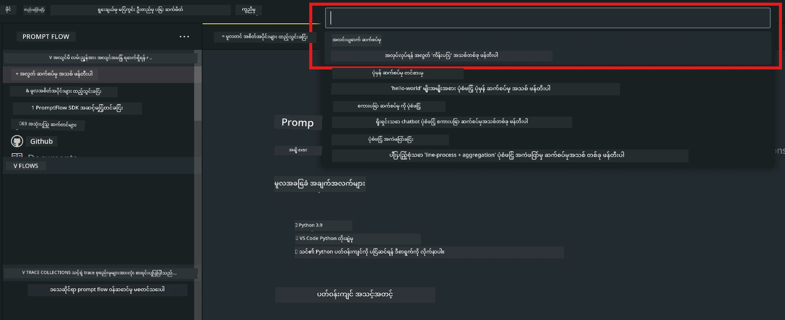
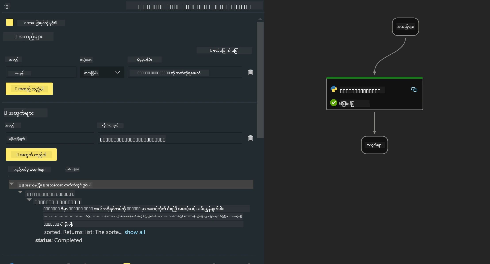

# **Lab 2 - Phi-3-mini နဲ့ AIPC မှာ Prompt flow ကို ပြေးကြည့်ခြင်း**

## **Prompt flow ဆိုတာဘာလဲ**

Prompt flow က LLM အခြေပြု AI အက်ပလီကေးရှင်းတွေကို စဉ်ဆက်မပြတ် ဖန်တီးဖို့အတွက် အစဉ်အလာတစ်ခုလုံးကို လွယ်ကူစေဖို့ ရည်ရွယ်ထားတဲ့ ဖွံ့ဖြိုးရေးကိရိယာစုစည်းမှုတစ်ခုပါ။ စိတ်ကူးထုတ်ခြင်း၊ ပုံစံပြုလုပ်ခြင်း၊ စမ်းသပ်ခြင်း၊ အကဲဖြတ်ခြင်းမှ စပြီး ထုတ်လုပ်မှုအဆင့်သို့ တင်သွင်းခြင်းနှင့် စောင့်ကြည့်ခြင်းအထိ အဆင့်ဆင့် လုပ်ဆောင်နိုင်ပါတယ်။ Prompt engineering ကို ပိုမိုလွယ်ကူစေပြီး ထုတ်လုပ်မှုအရည်အသွေးရှိတဲ့ LLM အက်ပလီကေးရှင်းတွေ ဖန်တီးနိုင်စေပါတယ်။

Prompt flow နဲ့ သင်လုပ်နိုင်တာတွေကတော့ -

- LLM, prompt, Python ကုဒ်နဲ့ အခြားကိရိယာတွေကို ချိတ်ဆက်ပြီး အလုပ်လုပ်နိုင်တဲ့ workflow တစ်ခု ဖန်တီးနိုင်ခြင်း။

- သင့် flow တွေကို အထူးသဖြင့် LLM တွေနဲ့ ဆက်သွယ်မှုကို အဆင်ပြေစွာ ပြန်လည်စစ်ဆေးပြီး ပြင်ဆင်နိုင်ခြင်း။

- သင့် flow တွေကို အကဲဖြတ်ပြီး အရည်အသွေးနဲ့ စွမ်းဆောင်ရည် မီထရစ်တွေကို ကြီးမားတဲ့ ဒေတာအစုအဝေးနဲ့တွက်ချက်နိုင်ခြင်း။

- စမ်းသပ်ခြင်းနဲ့ အကဲဖြတ်ခြင်းကို CI/CD စနစ်ထဲ ထည့်သွင်းပြီး သင့် flow ရဲ့ အရည်အသွေးကို သေချာစေခြင်း။

- သင့် flow တွေကို သင်ရွေးချယ်ထားတဲ့ ဝန်ဆောင်မှု ပလက်ဖောင်းပေါ် သို့မဟုတ် သင့်အက်ပလီကေးရှင်းကုဒ်အခြေခံထဲ လွယ်ကူစွာ ထည့်သွင်းနိုင်ခြင်း။

- (ရွေးချယ်စရာဖြစ်ပေမယ့် အကြံပြု) Azure AI မှာရှိတဲ့ Prompt flow ၏ cloud ဗားရှင်းကို အသုံးပြုပြီး သင့်အဖွဲ့နှင့် ပူးပေါင်းဆောင်ရွက်နိုင်ခြင်း။

## **AIPC ဆိုတာဘာလဲ**

AI PC မှာ CPU, GPU နဲ့ NPU တို့ပါဝင်ပြီး AI အမြန်ဆန်စေမှု အထူးပြုစွမ်းရည်တွေရှိပါတယ်။ NPU (neural processing unit) ဆိုတာက AI နဲ့ machine learning လုပ်ငန်းတွေကို cloud ကို မပို့ပဲ PC အတွင်းမှာ တိုက်ရိုက် ဆောင်ရွက်ပေးတဲ့ အထူးပြု အမြန်ဆန်စက်တစ်ခုပါ။ GPU နဲ့ CPU တွေကလည်း ဒီလုပ်ငန်းတွေကို ဆောင်ရွက်နိုင်ပေမယ့် NPU က အားနည်းစွမ်းအင်နဲ့ AI တွေတွက်ချက်ရာမှာ အထူးကောင်းမွန်ပါတယ်။ AI PC က ကျွန်တော်တို့ကွန်ပျူတာတွေ လုပ်ဆောင်ပုံမှာ အခြေခံပြောင်းလဲမှုတစ်ခု ဖြစ်ပါတယ်။ ယခင်က မရှိခဲ့တဲ့ ပြဿနာတစ်ခုအတွက် ဖြေရှင်းချက်မဟုတ်ပေမယ့် နေ့စဉ် PC အသုံးပြုမှုတွေမှာ အလွန်ကောင်းမွန်တဲ့ တိုးတက်မှုတစ်ခု ဖြစ်လာမှာပါ။

ဒါဆို AI PC က ဘယ်လို လုပ်ဆောင်သလဲ? ပြီးပြည့်စုံတဲ့ generative AI နဲ့ အများပြည်သူဒေတာများစွာနဲ့ သင်ကြားထားတဲ့ ကြီးမားတဲ့ LLM များနှင့် နှိုင်းယှဉ်လျှင် PC ပေါ်မှာ ဖြစ်ပေါ်မယ့် AI က ပိုမိုလွယ်ကူစွာ အသုံးပြုနိုင်ပြီး နားလည်ရလွယ်ကူပါတယ်။ သင့်ဒေတာနဲ့ သင်ကြားထားတာကြောင့် cloud ကို မလိုအပ်ဘဲ အသုံးပြုနိုင်ပြီး လူအများအတွက် ချက်ချင်း အကျိုးရှိစေပါတယ်။

နီးစပ်လာမယ့် အချိန်မှာ AI PC က ပုဂ္ဂိုလ်ရေး အကူအညီပေးသူတွေနဲ့ သေးငယ်တဲ့ AI မော်ဒယ်တွေကို သင့် PC ပေါ်မှာ တိုက်ရိုက် ပြေးဆွဲပြီး သင့်ဒေတာကို အသုံးပြုကာ ပုဂ္ဂိုလ်ရေး၊ ကိုယ်ပိုင်၊ လုံခြုံမှုမြင့် AI တိုးတက်မှုတွေ ပေးနိုင်မှာဖြစ်ပါတယ်။ ဥပမာ - အစည်းအဝေးမှတ်တမ်းရေးခြင်း၊ fantasy football league စီမံခန့်ခွဲခြင်း၊ ဓာတ်ပုံနဲ့ ဗီဒီယို တည်းဖြတ်မှုအတွက် အလိုအလျောက်တိုးတက်မှုများ၊ မိသားစုတွေ့ဆုံပွဲအတွက် လူတိုင်းရောက်ရှိချိန်နဲ့ ထွက်ခွာချိန်အပေါ် အခြေခံပြီး အကောင်းဆုံး ခရီးစဉ်အစီအစဉ်ရေးဆွဲခြင်း စသဖြင့်။

## **AIPC ပေါ်မှာ generation code flow တွေ ဖန်တီးခြင်း**

***Note*** ： ပတ်ဝန်းကျင်တပ်ဆင်မှု မပြီးစီးသေးပါက [Lab 0 -Installations](./01.Installations.md) ကို သွားကြည့်ပါ။

1. Visual Studio Code မှာ Prompt flow Extension ကို ဖွင့်ပြီး အလွတ် flow project တစ်ခု ဖန်တီးပါ။



2. Inputs နဲ့ Outputs parameter တွေ ထည့်ပြီး Python Code ကို flow အသစ်အဖြစ် ထည့်ပါ။



ဒီဖွဲ့စည်းပုံ (flow.dag.yaml) ကို ကိုးကားပြီး သင့် flow ကို တည်ဆောက်နိုင်ပါတယ်။

```yaml

inputs:
  question:
    type: string
    default: how to write Bubble Algorithm
outputs:
  answer:
    type: string
    reference: ${Chat_With_Phi3.output}
nodes:
- name: Chat_With_Phi3
  type: python
  source:
    type: code
    path: Chat_With_Phi3.py
  inputs:
    question: ${inputs.question}


```

3. ***Chat_With_Phi3.py*** ထဲမှာ ကုဒ် ထည့်ပါ။

```python


from promptflow.core import tool

# import torch
from transformers import AutoTokenizer, pipeline,TextStreamer
import intel_npu_acceleration_library as npu_lib

import warnings

import asyncio
import platform

class Phi3CodeAgent:
    
    model = None
    tokenizer = None
    text_streamer = None
    
    model_id = "microsoft/Phi-3-mini-4k-instruct"

    @staticmethod
    def init_phi3():
        
        if Phi3CodeAgent.model is None or Phi3CodeAgent.tokenizer is None or Phi3CodeAgent.text_streamer is None:
            Phi3CodeAgent.model = npu_lib.NPUModelForCausalLM.from_pretrained(
                                    Phi3CodeAgent.model_id,
                                    torch_dtype="auto",
                                    dtype=npu_lib.int4,
                                    trust_remote_code=True
                                )
            Phi3CodeAgent.tokenizer = AutoTokenizer.from_pretrained(Phi3CodeAgent.model_id)
            Phi3CodeAgent.text_streamer = TextStreamer(Phi3CodeAgent.tokenizer, skip_prompt=True)

    

    @staticmethod
    def chat_with_phi3(prompt):
        
        Phi3CodeAgent.init_phi3()

        messages = "<|system|>You are a AI Python coding assistant. Please help me to generate code in Python.The answer only genertated Python code, but any comments and instructions do not need to be generated<|end|><|user|>" + prompt +"<|end|><|assistant|>"


        generation_args = {
            "max_new_tokens": 1024,
            "return_full_text": False,
            "temperature": 0.3,
            "do_sample": False,
            "streamer": Phi3CodeAgent.text_streamer,
        }

        pipe = pipeline(
            "text-generation",
            model=Phi3CodeAgent.model,
            tokenizer=Phi3CodeAgent.tokenizer,
            # **generation_args
        )

        result = ''

        with warnings.catch_warnings():
            warnings.simplefilter("ignore")
            response = pipe(messages, **generation_args)
            result =response[0]['generated_text']
            return result


@tool
def my_python_tool(question: str) -> str:
    if platform.system() == 'Windows':
        asyncio.set_event_loop_policy(asyncio.WindowsSelectorEventLoopPolicy())
    return Phi3CodeAgent.chat_with_phi3(question)


```

4. Debug သို့မဟုတ် Run မှတစ်ဆင့် flow ကို စမ်းသပ်ပြီး generation code မှန်ကန်မှုကို စစ်ဆေးနိုင်ပါတယ်။


5. Terminal မှာ development API အဖြစ် flow ကို ပြေးပါ။

```

pf flow serve --source ./ --port 8080 --host localhost   

```

Postman / Thunder Client မှာ စမ်းသပ်နိုင်ပါတယ်။

### **Note**

1. ပထမဆုံး ပြေးတဲ့အခါ အချိန်ကြာနိုင်ပါတယ်။ Hugging face CLI မှ phi-3 model ကို ဒေါင်းလုပ်လုပ်ရန် အကြံပြုပါတယ်။

2. Intel NPU ရဲ့ ကန့်သတ်ထားတဲ့ စွမ်းဆောင်ရည်ကြောင့် Phi-3-mini-4k-instruct ကို အသုံးပြုရန် အကြံပြုပါတယ်။

3. Intel NPU Acceleration ကို INT4 conversion အတွက် အသုံးပြုထားပေမယ့် ဝန်ဆောင်မှုကို ပြန်လည်ပြေးမယ်ဆို cache နဲ့ nc_workshop ဖိုလ်ဒါတွေကို ဖျက်ပစ်ရပါမယ်။

## **အရင်းအမြစ်များ**

1. Promptflow ကို လေ့လာရန် [https://microsoft.github.io/promptflow/](https://microsoft.github.io/promptflow/)

2. Intel NPU Acceleration ကို လေ့လာရန် [https://github.com/intel/intel-npu-acceleration-library](https://github.com/intel/intel-npu-acceleration-library)

3. နမူနာကုဒ်၊ ဒေါင်းလုပ်လုပ်ရန် [Local NPU Agent Sample Code](../../../../../../../../../code/07.Lab/01/AIPC)

**အကြောင်းကြားချက်**  
ဤစာတမ်းကို AI ဘာသာပြန်ဝန်ဆောင်မှု [Co-op Translator](https://github.com/Azure/co-op-translator) ဖြင့် ဘာသာပြန်ထားပါသည်။ ကျွန်ုပ်တို့သည် တိကျမှန်ကန်မှုအတွက် ကြိုးစားသော်လည်း အလိုအလျောက် ဘာသာပြန်ခြင်းတွင် အမှားများ သို့မဟုတ် မှားယွင်းချက်များ ပါဝင်နိုင်ကြောင်း သတိပြုပါရန် မေတ္တာရပ်ခံအပ်ပါသည်။ မူရင်းစာတမ်းကို မိမိဘာသာစကားဖြင့်သာ တရားဝင်အချက်အလက်အဖြစ် ယူဆသင့်ပါသည်။ အရေးကြီးသော အချက်အလက်များအတွက် လူ့ဘာသာပြန်ပညာရှင်မှ ဘာသာပြန်ခြင်းကို အကြံပြုပါသည်။ ဤဘာသာပြန်ချက်ကို အသုံးပြုရာမှ ဖြစ်ပေါ်လာနိုင်သည့် နားလည်မှုမှားယွင်းမှုများအတွက် ကျွန်ုပ်တို့သည် တာဝန်မယူပါ။