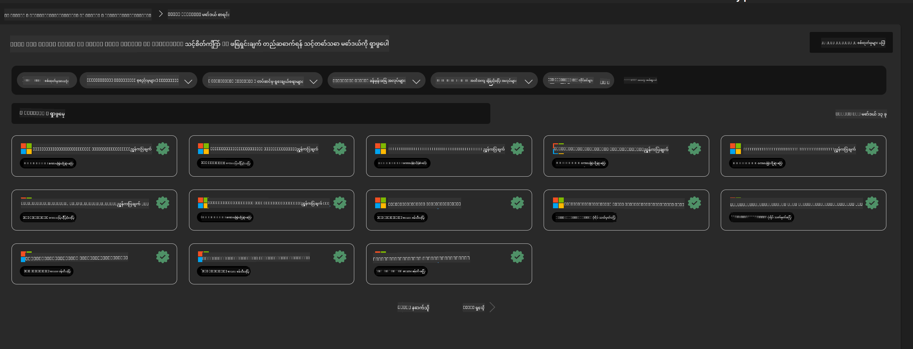
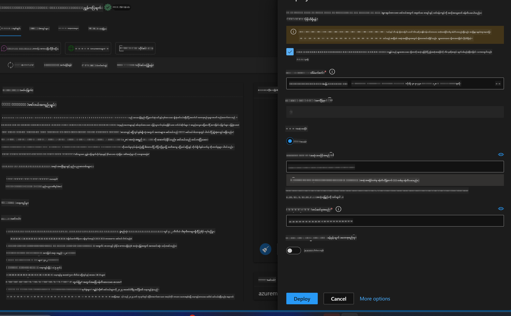
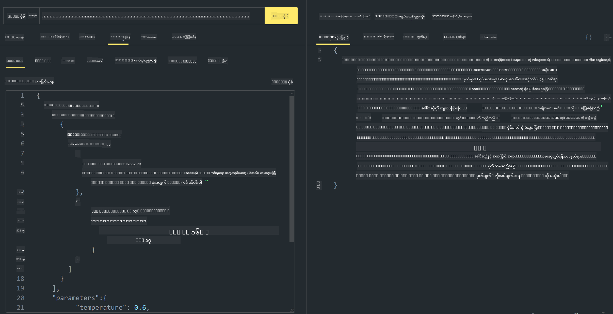

<!--
CO_OP_TRANSLATOR_METADATA:
{
  "original_hash": "20cb4e6ac1686248e8be913ccf6c2bc2",
  "translation_date": "2025-07-17T04:36:26+00:00",
  "source_file": "md/02.Application/02.Code/Phi3/VSCodeExt/HOL/Apple/03.DeployPhi3VisionOnAzure.md",
  "language_code": "my"
}
-->
# **Lab 3 - Azure Machine Learning Service ပေါ်တွင် Phi-3-vision ကို တပ်ဆင်ခြင်း**

ကျွန်တော်တို့ NPU ကို အသုံးပြုပြီး ဒေသတွင်းကုဒ်ကို ထုတ်လုပ်မှုအဆင့်သို့ တပ်ဆင်ပြီးနောက်၊ PHI-3-VISION ကို ထည့်သွင်းနိုင်စွမ်းကို မိတ်ဆက်ပေးလိုသည်။ ဤနည်းဖြင့် ပုံများမှ ကုဒ်များကို ဖန်တီးနိုင်ပါသည်။

ဤမိတ်ဆက်မှုတွင် Azure Machine Learning Service တွင် Model As Service အဖြစ် Phi-3 Vision ဝန်ဆောင်မှုကို အလျင်အမြန် တည်ဆောက်နိုင်ပါသည်။

***Note***： Phi-3 Vision သည် အမြန်နှုန်းမြင့်စွာ အကြောင်းအရာ ဖန်တီးနိုင်ရန်တွက် ကွန်ပျူတာစွမ်းအားလိုအပ်သည်။ ဤအတွက် မိုးကောင်းကင်ကွန်ပျူတာစွမ်းအားကူညီပေးရမည်ဖြစ်သည်။


### **1. Azure Machine Learning Service တည်ဆောက်ခြင်း**

Azure Portal တွင် Azure Machine Learning Service တစ်ခုကို ဖန်တီးရမည်။ ဘယ်လိုလုပ်ရမည်ကို သိလိုပါက ဒီလင့်ခ်ကို သွားကြည့်ပါ [https://learn.microsoft.com/azure/machine-learning/quickstart-create-resources?view=azureml-api-2](https://learn.microsoft.com/azure/machine-learning/quickstart-create-resources?view=azureml-api-2)


### **2. Azure Machine Learning Service တွင် Phi-3 Vision ရွေးချယ်ခြင်း**




### **3. Azure တွင် Phi-3-Vision တပ်ဆင်ခြင်း**





### **4. Postman တွင် Endpoint စမ်းသပ်ခြင်း**





***Note***

1. ပေးပို့ရမည့် ပါရာမီတာများတွင် Authorization, azureml-model-deployment, နှင့် Content-Type ပါဝင်ရမည်။ တပ်ဆင်မှုအချက်အလက်များကို စစ်ဆေး၍ ရယူရမည်။

2. ပါရာမီတာများ ပေးပို့ရာတွင် Phi-3-Vision သည် ပုံလင့်ခ်တစ်ခုကို ပေးပို့ရမည်။ GPT-4-Vision နည်းလမ်းအတိုင်း ပါရာမီတာများ ပေးပို့ရန် ကိုးကားပါ၊ ဥပမာ -

```json

{
  "input_data":{
    "input_string":[
      {
        "role":"user",
        "content":[ 
          {
            "type": "text",
            "text": "You are a Python coding assistant.Please create Python code for image "
          },
          {
              "type": "image_url",
              "image_url": {
                "url": "https://ajaytech.co/wp-content/uploads/2019/09/index.png"
              }
          }
        ]
      }
    ],
    "parameters":{
          "temperature": 0.6,
          "top_p": 0.9,
          "do_sample": false,
          "max_new_tokens": 2048
    }
  }
}

```

3. Post method ဖြင့် **/score** ကို ခေါ်ဆိုပါ။

**အောင်မြင်ပါပြီ** ！သင်သည် အမြန် PHI-3-VISION တပ်ဆင်မှုကို ပြီးမြောက်ပြီး ပုံများမှ ကုဒ်ဖန်တီးနည်းကို စမ်းသပ်နိုင်ပါပြီ။ နောက်တစ်ဆင့်တွင် NPU နှင့် မိုးကောင်းကင်များ ပေါင်းစပ်၍ အက်ပလီကေးရှင်းများ တည်ဆောက်နိုင်ပါသည်။

**အကြောင်းကြားချက်**  
ဤစာတမ်းကို AI ဘာသာပြန်ဝန်ဆောင်မှု [Co-op Translator](https://github.com/Azure/co-op-translator) ဖြင့် ဘာသာပြန်ထားပါသည်။ ကျွန်ုပ်တို့သည် တိကျမှန်ကန်မှုအတွက် ကြိုးစားသော်လည်း အလိုအလျောက် ဘာသာပြန်ခြင်းတွင် အမှားများ သို့မဟုတ် မှားယွင်းချက်များ ပါဝင်နိုင်ကြောင်း သတိပြုပါရန် မေတ္တာရပ်ခံအပ်ပါသည်။ မူရင်းစာတမ်းကို မိမိဘာသာစကားဖြင့်သာ တရားဝင်အရင်းအမြစ်အဖြစ် ယူဆသင့်ပါသည်။ အရေးကြီးသော အချက်အလက်များအတွက် လူ့ဘာသာပြန်ပညာရှင်မှ ဘာသာပြန်ခြင်းကို အကြံပြုပါသည်။ ဤဘာသာပြန်ချက်ကို အသုံးပြုရာမှ ဖြစ်ပေါ်လာနိုင်သည့် နားလည်မှုမှားယွင်းမှုများအတွက် ကျွန်ုပ်တို့သည် တာဝန်မခံပါ။