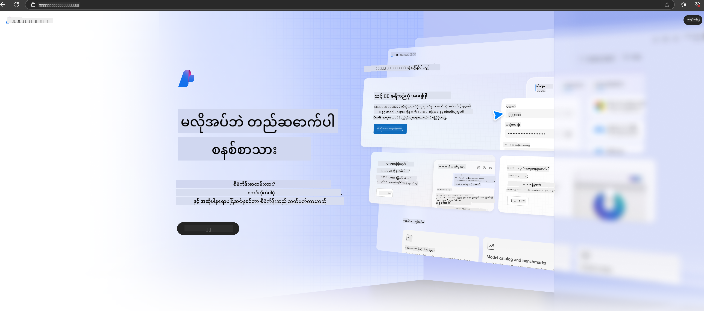

<!--
CO_OP_TRANSLATOR_METADATA:
{
  "original_hash": "3a1e48b628022485aac989c9f733e792",
  "translation_date": "2025-07-17T05:29:11+00:00",
  "source_file": "md/02.QuickStart/AzureAIFoundry_QuickStart.md",
  "language_code": "my"
}
-->
# **Azure AI Foundry တွင် Phi-3 ကို အသုံးပြုခြင်း**

Generative AI တိုးတက်လာခြင်းနှင့်အတူ၊ LLM နှင့် SLM များ၊ စီးပွားရေးဒေတာပေါင်းစည်းခြင်း၊ fine-tuning/RAG လုပ်ငန်းစဉ်များ၊ LLM နှင့် SLM ပေါင်းစည်းပြီးနောက် စီးပွားရေးလုပ်ငန်းအမျိုးမျိုးကို အကဲဖြတ်ခြင်းတို့ကို တစ်ခုတည်းသော ပလက်ဖောင်းဖြင့် စီမံခန့်ခွဲနိုင်ရန် မျှော်လင့်ထားပါသည်။ ထို့ကြောင့် generative AI ကို Smart application များအဖြစ် ပိုမိုကောင်းမွန်စွာ အကောင်အထည်ဖော်နိုင်ပါသည်။ [Azure AI Foundry](https://ai.azure.com) သည် စီးပွားရေးအဆင့် generative AI application ပလက်ဖောင်းတစ်ခုဖြစ်သည်။

Azure AI Foundry ဖြင့် သင်သည် large language model (LLM) ၏ တုံ့ပြန်ချက်များကို အကဲဖြတ်နိုင်ပြီး prompt flow ဖြင့် prompt application အစိတ်အပိုင်းများကို စီမံခန့်ခွဲ၍ ပိုမိုကောင်းမွန်သော စွမ်းဆောင်ရည်ရရှိစေပါသည်။ ဤပလက်ဖောင်းသည် proof of concept များကို အပြည့်အဝ ထုတ်လုပ်မှုအဆင့်သို့ လွယ်ကူစွာ ပြောင်းလဲနိုင်ရန် စွမ်းဆောင်ရည်တိုးမြှင့်မှုကို အထောက်အပံ့ပေးပါသည်။ ဆက်လက်စောင့်ကြည့်ခြင်းနှင့် ပြုပြင်မွမ်းမံခြင်းများက ရေရှည်အောင်မြင်မှုအတွက် အထောက်အကူဖြစ်စေပါသည်။

Phi-3 မော်ဒယ်ကို Azure AI Foundry တွင် လွယ်ကူစွာ တပ်ဆင်နိုင်ပြီး၊ ထို့နောက် Azure AI Foundry ကို အသုံးပြု၍ Phi-3 နှင့်ဆက်စပ်သော Playground/Chat, Fine-tuning, အကဲဖြတ်ခြင်းနှင့် အခြားဆက်စပ်လုပ်ငန်းများကို ပြီးမြောက်စေပါသည်။

## **1. ပြင်ဆင်မှု**

သင်၏စက်တွင် [Azure Developer CLI](https://learn.microsoft.com/azure/developer/azure-developer-cli/overview?WT.mc_id=aiml-138114-kinfeylo) ရှိပြီးသားဖြစ်ပါက၊ ဤ template ကို အသုံးပြုရန် သင့်အား directory အသစ်တစ်ခုတွင် ဤ command ကို ရိုက်ထည့်ခြင်းသာ လိုအပ်ပါသည်။

## လက်ဖြင့် ဖန်တီးခြင်း

Microsoft Azure AI Foundry project နှင့် hub တည်ဆောက်ခြင်းသည် သင့် AI လုပ်ငန်းများကို စနစ်တကျ စီမံခန့်ခွဲရန် အကောင်းဆုံးနည်းလမ်းဖြစ်သည်။ စတင်ရန် အဆင့်ဆင့် လမ်းညွှန်ချက်如下:

### Azure AI Foundry တွင် Project တည်ဆောက်ခြင်း

1. **Azure AI Foundry သို့ သွားပါ**: Azure AI Foundry portal တွင် လက်မှတ်ထိုးဝင်ပါ။
2. **Project တစ်ခု ဖန်တီးပါ**:
   - သင်သည် project အတွင်းရှိပါက၊ စာမျက်နှာ၏ ဘယ်ဘက်အပေါ်တွင် "Azure AI Foundry" ကို ရွေးချယ်၍ Home စာမျက်နှာသို့ ပြန်သွားပါ။
   - "+ Create project" ကို ရွေးချယ်ပါ။
   - Project အမည်တစ်ခု ထည့်ပါ။
   - Hub ရှိပါက အလိုအလျောက် ရွေးချယ်ထားမည်။ Hub များစွာကို အသုံးပြုခွင့်ရှိပါက dropdown မှ အခြား hub တစ်ခုကို ရွေးချယ်နိုင်သည်။ Hub အသစ်တစ်ခု ဖန်တီးလိုပါက "Create new hub" ကို ရွေးပြီး အမည်ထည့်ပါ။
   - "Create" ကို နှိပ်ပါ။

### Azure AI Foundry တွင် Hub တည်ဆောက်ခြင်း

1. **Azure AI Foundry သို့ သွားပါ**: သင့် Azure အကောင့်ဖြင့် လက်မှတ်ထိုးဝင်ပါ။
2. **Hub တစ်ခု ဖန်တီးပါ**:
   - ဘယ်ဘက် menu မှ Management center ကို ရွေးချယ်ပါ။
   - "All resources" ကို ရွေးပြီး "+ New project" အနားရှိ အောက်ဆွဲအရိုးကို နှိပ်၍ "+ New hub" ကို ရွေးပါ။
   - "Create a new hub" စာမျက်နှာတွင် hub အမည် (ဥပမာ contoso-hub) ထည့်ပြီး အခြားအချက်အလက်များကို လိုအပ်သလို ပြင်ဆင်ပါ။
   - "Next" ကို နှိပ်ပြီး အချက်အလက်များကို ပြန်လည်စစ်ဆေးပြီး "Create" ကို နှိပ်ပါ။

အသေးစိတ် လမ်းညွှန်ချက်များအတွက် တရားဝင် [Microsoft စာတမ်း](https://learn.microsoft.com/azure/ai-studio/how-to/create-projects) ကို ကြည့်ရှုနိုင်ပါသည်။

ဖန်တီးမှုအောင်မြင်ပြီးနောက် [ai.azure.com](https://ai.azure.com/) မှတဆင့် သင်ဖန်တီးထားသော studio သို့ ဝင်ရောက်နိုင်ပါသည်။

AI Foundry တစ်ခုတွင် project များစွာ ရှိနိုင်ပါသည်။ AI Foundry တွင် project တစ်ခု ဖန်တီး၍ ပြင်ဆင်ပါ။

Azure AI Foundry [QuickStarts](https://learn.microsoft.com/azure/ai-studio/quickstarts/get-started-code) များကို ဖန်တီးပါ။

## **2. Azure AI Foundry တွင် Phi မော်ဒယ် တပ်ဆင်ခြင်း**

Project ၏ Explore ရွေးချယ်မှုကို နှိပ်၍ Model Catalog သို့ ဝင်ပြီး Phi-3 ကို ရွေးချယ်ပါ။

Phi-3-mini-4k-instruct ကို ရွေးချယ်ပါ။

Phi-3-mini-4k-instruct မော်ဒယ်ကို တပ်ဆင်ရန် 'Deploy' ကို နှိပ်ပါ။

> [!NOTE]
>
> တပ်ဆင်စဉ်တွင် ကွန်ပျူတာစွမ်းအားကို ရွေးချယ်နိုင်ပါသည်။

## **3. Azure AI Foundry တွင် Playground Chat Phi အသုံးပြုခြင်း**

Deployment စာမျက်နှာသို့ သွားပြီး Playground ကို ရွေးချယ်ကာ Azure AI Foundry ၏ Phi-3 နှင့် စကားပြောပါ။

## **4. Azure AI Foundry မှ မော်ဒယ် တပ်ဆင်ခြင်း**

Azure Model Catalog မှ မော်ဒယ်တစ်ခု တပ်ဆင်ရန် အောက်ပါအဆင့်များကို လိုက်နာနိုင်ပါသည်။

- Azure AI Foundry တွင် လက်မှတ်ထိုးဝင်ပါ။
- Azure AI Foundry model catalog မှ တပ်ဆင်လိုသော မော်ဒယ်ကို ရွေးချယ်ပါ။
- မော်ဒယ်၏ Details စာမျက်နှာတွင် Deploy ကို နှိပ်ပြီး Serverless API with Azure AI Content Safety ကို ရွေးချယ်ပါ။
- မော်ဒယ်များကို တပ်ဆင်လိုသော project ကို ရွေးချယ်ပါ။ Serverless API ကို အသုံးပြုရန် workspace သည် East US 2 သို့မဟုတ် Sweden Central ဒေသတွင် ရှိရမည်။ Deployment အမည်ကို စိတ်ကြိုက်ပြင်ဆင်နိုင်ပါသည်။
- Deployment wizard တွင် Pricing နှင့် terms ကို ရွေးချယ်ကာ စျေးနှုန်းနှင့် အသုံးပြုခွင့်စည်းမျဉ်းများကို လေ့လာပါ။
- Deploy ကို နှိပ်ပါ။ တပ်ဆင်မှု ပြီးစီးသည်အထိ စောင့်ပါ၊ ပြီးလျှင် Deployments စာမျက်နှာသို့ ပြန်လည်သွားပါမည်။
- Open in playground ကို နှိပ်ကာ မော်ဒယ်နှင့် အပြန်အလှန် ဆက်သွယ်မှု စတင်ပါ။
- Deployments စာမျက်နှာသို့ ပြန်သွား၍ တပ်ဆင်မှုကို ရွေးချယ်ကာ endpoint ၏ Target URL နှင့် Secret Key ကို မှတ်သားပါ၊ ၎င်းတို့ကို အသုံးပြု၍ တပ်ဆင်မှုကို ခေါ်ယူပြီး completion များ ဖန်တီးနိုင်ပါသည်။
- Build tab တွင် Components အပိုင်းမှ Deployments ကို ရွေးချယ်ကာ endpoint ၏ အသေးစိတ်၊ URL နှင့် access keys များကို အမြဲ ရှာဖွေနိုင်ပါသည်။

> [!NOTE]
> ဤအဆင့်များကို လုပ်ဆောင်ရန် သင့်အကောင့်တွင် Resource Group အတွက် Azure AI Developer role ခွင့်ပြုချက် ရှိရမည်ဖြစ်ကြောင်း သတိပြုပါ။

## **5. Azure AI Foundry တွင် Phi API အသုံးပြုခြင်း**

https://{Your project name}.region.inference.ml.azure.com/swagger.json ကို Postman GET ဖြင့် ဝင်ရောက်နိုင်ပြီး Key နှင့် ပေါင်းစပ်၍ ပေးထားသော interface များကို လေ့လာနိုင်ပါသည်။

တောင်းဆိုမှု parameters များနှင့် တုံ့ပြန်မှု parameters များကို အလွန်လွယ်ကူစွာ ရယူနိုင်ပါသည်။

**အကြောင်းကြားချက်**  
ဤစာတမ်းကို AI ဘာသာပြန်ဝန်ဆောင်မှု [Co-op Translator](https://github.com/Azure/co-op-translator) ဖြင့် ဘာသာပြန်ထားပါသည်။ ကျွန်ုပ်တို့သည် တိကျမှန်ကန်မှုအတွက် ကြိုးစားသော်လည်း အလိုအလျောက် ဘာသာပြန်ခြင်းတွင် အမှားများ သို့မဟုတ် မှားယွင်းချက်များ ပါဝင်နိုင်ကြောင်း သတိပြုပါရန် မေတ္တာရပ်ခံအပ်ပါသည်။ မူရင်းစာတမ်းကို မူလဘာသာဖြင့်သာ တရားဝင်အရင်းအမြစ်အဖြစ် သတ်မှတ်သင့်ပါသည်။ အရေးကြီးသော အချက်အလက်များအတွက် လူ့ဘာသာပြန်ပညာရှင်မှ ဘာသာပြန်ခြင်းကို အကြံပြုပါသည်။ ဤဘာသာပြန်ချက်ကို အသုံးပြုရာမှ ဖြစ်ပေါ်လာနိုင်သည့် နားလည်မှုမှားယွင်းမှုများအတွက် ကျွန်ုပ်တို့ တာဝန်မယူပါ။