<!--
CO_OP_TRANSLATOR_METADATA:
{
  "original_hash": "c1559c5af6caccf6f623fd43a6b3a9a3",
  "translation_date": "2025-07-17T06:16:36+00:00",
  "source_file": "md/03.FineTuning/FineTuning_AIFoundry.md",
  "language_code": "my"
}
-->
# Azure AI Foundry ဖြင့် Phi-3 ကို Fine-tuning ပြုလုပ်ခြင်း

Microsoft ၏ Phi-3 Mini ဘာသာစကားမော်ဒယ်ကို Azure AI Foundry အသုံးပြု၍ fine-tune ပြုလုပ်နည်းကို လေ့လာကြမယ်။ Fine-tuning က Phi-3 Mini ကို သတ်မှတ်ထားသော အလုပ်များအတွက် ကိုက်ညီစေရန် အထူးပြုလုပ်နိုင်ပြီး ပိုမိုစွမ်းဆောင်ရည်မြင့်မားပြီး context ကို ပိုမိုနားလည်စေပါတယ်။

## စဉ်းစားစရာများ

- **စွမ်းဆောင်ရည်များ:** မည်သည့်မော်ဒယ်များကို fine-tune ပြုလုပ်နိုင်သလဲ? မူလမော်ဒယ်ကို ဘာတွေပြောင်းလဲနိုင်သလဲ?
- **ကုန်ကျစရိတ်:** Fine-tuning အတွက် စျေးနှုန်းမော်ဒယ်က ဘယ်လိုရှိသလဲ?
- **စိတ်ကြိုက်ပြင်ဆင်နိုင်မှု:** မူလမော်ဒယ်ကို ဘယ်လောက်ပြောင်းလဲနိုင်မလဲ၊ ဘယ်လိုနည်းလမ်းတွေနဲ့လဲ?
- **အဆင်ပြေမှု:** Fine-tuning ကို ဘယ်လိုလုပ်ရမလဲ၊ ကိုယ်ပိုင်ကုဒ်ရေးရမလား? ကိုယ်ပိုင်ကွန်ပျူတာလိုအပ်မလား?
- **လုံခြုံရေး:** Fine-tuned မော်ဒယ်တွေမှာ လုံခြုံရေးဆိုင်ရာ အန္တရာယ်ရှိနိုင်တာကြောင့် မလိုလားအပ်တဲ့ထိခိုက်မှုမှ ကာကွယ်ဖို့ ဘာတွေရှိသလဲ?

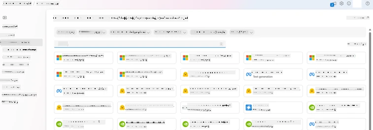

## Fine-tuning အတွက် ပြင်ဆင်မှု

### မလိုအပ်သောအချက်များ

> [!NOTE]
> Phi-3 မော်ဒယ်များအတွက် pay-as-you-go မော်ဒယ်ဖြင့် fine-tune လုပ်ခြင်းကို **East US 2** ဒေသတွင် ဖန်တီးထားသော hubs တွင်သာ အသုံးပြုနိုင်ပါသည်။

- Azure subscription တစ်ခု။ Azure subscription မရှိပါက [paid Azure account](https://azure.microsoft.com/pricing/purchase-options/pay-as-you-go) တစ်ခု ဖန်တီးပါ။

- [AI Foundry project](https://ai.azure.com?WT.mc_id=aiml-138114-kinfeylo) တစ်ခု။
- Azure role-based access controls (Azure RBAC) ကို Azure AI Foundry တွင် လုပ်ဆောင်ချက်များအတွက် ခွင့်ပြုရန် အသုံးပြုသည်။ ဤဆောင်းပါးတွင် ဖော်ပြထားသော အဆင့်များကို လုပ်ဆောင်ရန် သင့် user account ကို resource group တွင် __Azure AI Developer role__ ဖြင့် သတ်မှတ်ထားရမည်။

### Subscription provider မှတ်ပုံတင်ခြင်း

Subscription သည် `Microsoft.Network` resource provider တွင် မှတ်ပုံတင်ထားကြောင်း အတည်ပြုပါ။

1. [Azure portal](https://portal.azure.com) တွင် လက်မှတ်ထိုးဝင်ပါ။
2. ဘယ်ဘက်မီနူးမှ **Subscriptions** ကို ရွေးချယ်ပါ။
3. အသုံးပြုလိုသော subscription ကို ရွေးချယ်ပါ။
4. ဘယ်ဘက်မီနူးမှ **AI project settings** > **Resource providers** ကို ရွေးချယ်ပါ။
5. **Microsoft.Network** သည် resource providers စာရင်းတွင် ရှိကြောင်း အတည်ပြုပါ။ မရှိပါက ထည့်သွင်းပါ။

### ဒေတာပြင်ဆင်ခြင်း

သင်၏ မော်ဒယ်ကို fine-tune ပြုလုပ်ရန် သင်ကြားရေးနှင့် အတည်ပြုဒေတာများကို ပြင်ဆင်ပါ။ သင်ကြားရေးဒေတာနှင့် အတည်ပြုဒေတာများတွင် မော်ဒယ်ကို မည်သို့ လုပ်ဆောင်စေလိုသည်ကို ဖော်ပြသည့် input-output နမူနာများ ပါဝင်ရမည်။

သင်ကြားရေးနမူနာများအားလုံးသည် inference အတွက် မျှော်မှန်းထားသော ဖော်မတ်နှင့် ကိုက်ညီကြောင်း သေချာစေပါ။ မော်ဒယ်များကို ထိရောက်စွာ fine-tune ပြုလုပ်ရန် အချက်အလက်များကို သွန်းညှိထားပြီး မတူညီသော အခြေအနေများပါဝင်သော dataset ကို အသုံးပြုပါ။

ဤသည်မှာ ဒေတာညီမျှမှုကို ထိန်းသိမ်းခြင်း၊ အခြေအနေမျိုးစုံပါဝင်ခြင်းနှင့် သင်ကြားရေးဒေတာကို အချိန်နှင့်တပြေးညီ ပြင်ဆင်ခြင်းတို့ဖြင့် အမှန်တကယ်လိုအပ်သည့် မျှော်မှန်းချက်များနှင့် ကိုက်ညီစေရန် ဖြစ်သည်။ ၎င်းက မော်ဒယ်၏ တုံ့ပြန်မှုများကို ပိုမိုတိကျပြီး ညီမျှစေပါသည်။

မော်ဒယ်အမျိုးအစားအလိုက် သင်ကြားရေးဒေတာဖော်မတ်ကွဲပြားပါသည်။

### Chat Completion

သင်အသုံးပြုမည့် သင်ကြားရေးနှင့် အတည်ပြုဒေတာများကို JSON Lines (JSONL) ဖိုင်အဖြစ် ဖော်မတ်ထားရမည်။ `Phi-3-mini-128k-instruct` အတွက် fine-tuning dataset သည် Chat completions API အသုံးပြုသော စကားပြောဖော်မတ်ဖြင့် ဖော်မတ်ထားရမည်။

### နမူနာဖိုင်ဖော်မတ်

```json
    {"messages": [{"role": "system", "content": "You are an Xbox customer support agent whose primary goal is to help users with issues they are experiencing with their Xbox devices. You are friendly and concise. You only provide factual answers to queries, and do not provide answers that are not related to Xbox."}, {"role": "user", "content": "Is Xbox better than PlayStation?"}, {"role": "assistant", "content": "I apologize, but I cannot provide personal opinions. My primary job is to assist you with any issues related to your Xbox device. Do you have any Xbox-related issues that need addressing?"}]}
    {"messages": [{"role": "system", "content": "You are an Xbox customer support agent whose primary goal is to help users with issues they are experiencing with their Xbox devices. You are friendly and concise. You only provide factual answers to queries, and do not provide answers that are not related to Xbox."}, {"role": "user", "content": "Can I play PC games on my Xbox?"}, {"role": "assistant", "content": "While Xbox consoles don't natively support PC games, they can play an array of Xbox games, many of which are also available on PC. Can I assist you with finding games compatible with your Xbox device?"}]}
    {"messages": [{"role": "system", "content": "You are an Xbox customer support agent whose primary goal is to help users with issues they are experiencing with their Xbox devices. You are friendly and concise. You only provide factual answers to queries, and do not provide answers that are not related to Xbox."}, {"role": "user", "content": "I'm having trouble connecting my Xbox to the Wi-Fi."}, {"role": "assistant", "content": "No worries, let's go through the network settings on your Xbox. Can you please tell me what happens when you try to connect it to the Wi-Fi?"}]}
```

ထောက်ခံထားသော ဖိုင်အမျိုးအစားမှာ JSON Lines ဖြစ်သည်။ ဖိုင်များကို default datastore သို့ တင်ပြီး သင့် project တွင် အသုံးပြုနိုင်သည်။

## Azure AI Foundry ဖြင့် Phi-3 ကို Fine-Tuning ပြုလုပ်ခြင်း

Azure AI Foundry သည် fine-tuning ဟုခေါ်သော လုပ်ငန်းစဉ်ဖြင့် မိမိ၏ dataset များအတွက် ဘာသာစကားမော်ဒယ်ကြီးများကို ကိုက်ညီစေရန် ခွင့်ပြုသည်။ Fine-tuning သည် အထူးပြုလုပ်ခြင်းနှင့် အကောင်းဆုံးစွမ်းဆောင်ရည်ရရှိစေရန် အရေးကြီးသော တန်ဖိုးများကို ပေးစွမ်းသည်။ ၎င်းက စွမ်းဆောင်ရည်တိုးတက်မှု၊ ကုန်ကျစရိတ်သက်သာမှု၊ အချိန်လျှော့ချမှုနှင့် စိတ်ကြိုက်ထွက်ရှိမှုများကို ဖြစ်စေသည်။

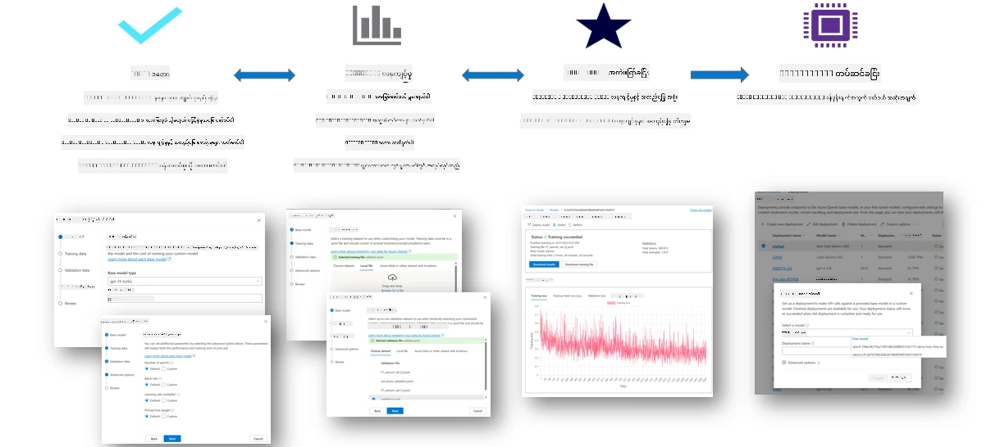

### Project အသစ် ဖန်တီးခြင်း

1. [Azure AI Foundry](https://ai.azure.com) တွင် လက်မှတ်ထိုးဝင်ပါ။

2. Azure AI Foundry တွင် project အသစ် ဖန်တီးရန် **+New project** ကို ရွေးချယ်ပါ။

    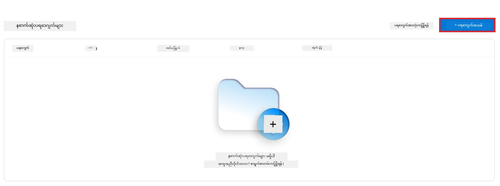

3. အောက်ပါအချက်များကို ပြုလုပ်ပါ။

    - Project **Hub name** ကို ထည့်ပါ။ ထူးခြားသောတန်ဖိုးဖြစ်ရမည်။
    - အသုံးပြုမည့် **Hub** ကို ရွေးချယ်ပါ (လိုအပ်ပါက အသစ်ဖန်တီးပါ)။

    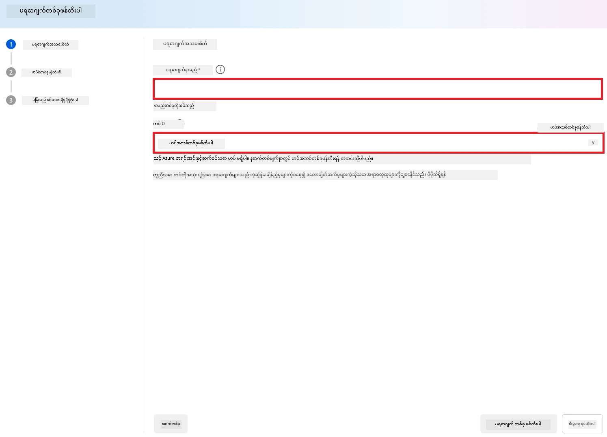

4. Hub အသစ် ဖန်တီးရန် အောက်ပါအချက်များကို ပြုလုပ်ပါ။

    - **Hub name** ထည့်ပါ။ ထူးခြားသောတန်ဖိုးဖြစ်ရမည်။
    - သင့် Azure **Subscription** ကို ရွေးချယ်ပါ။
    - အသုံးပြုမည့် **Resource group** ကို ရွေးချယ်ပါ (လိုအပ်ပါက အသစ်ဖန်တီးပါ)။
    - အသုံးပြုမည့် **Location** ကို ရွေးချယ်ပါ။
    - အသုံးပြုမည့် **Connect Azure AI Services** ကို ရွေးချယ်ပါ (လိုအပ်ပါက အသစ်ဖန်တီးပါ)။
    - **Connect Azure AI Search** ကို **Skip connecting** အဖြစ် ရွေးချယ်ပါ။

    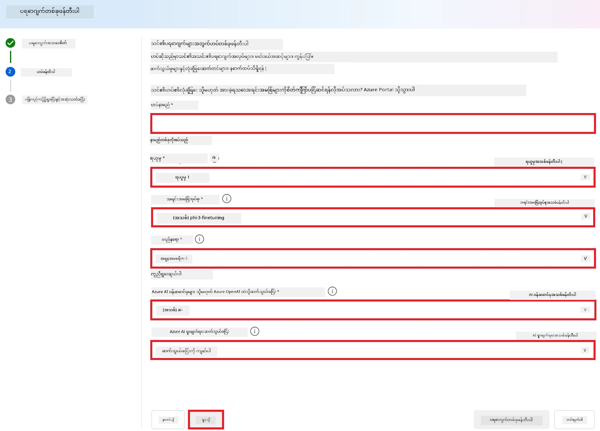

5. **Next** ကို ရွေးချယ်ပါ။
6. **Create a project** ကို ရွေးချယ်ပါ။

### ဒေတာပြင်ဆင်ခြင်း

Fine-tuning မပြုလုပ်မီ သင့်အလုပ်အတွက် သက်ဆိုင်သော dataset (chat အညွှန်းများ၊ မေးခွန်း-အဖြေ စုံများ သို့မဟုတ် အခြားစာသားဒေတာများ) ကို စုဆောင်း သို့မဟုတ် ဖန်တီးပါ။ ဤဒေတာကို သန့်ရှင်းစင်ကြယ်စေရန် အညစ်အကြေး ဖယ်ရှားခြင်း၊ မရှိသောတန်ဖိုးများကို ကိုင်တွယ်ခြင်းနှင့် စာသားကို tokenization ပြုလုပ်ခြင်းတို့ ပြုလုပ်ပါ။

### Azure AI Foundry တွင် Phi-3 မော်ဒယ်များကို Fine-tune ပြုလုပ်ခြင်း

> [!NOTE]
> Phi-3 မော်ဒယ်များ၏ fine-tuning ကို လက်ရှိတွင် East US 2 ဒေသရှိ project များတွင်သာ ထောက်ခံသည်။

1. ဘယ်ဘက် tab မှ **Model catalog** ကို ရွေးချယ်ပါ။

2. **search bar** တွင် *phi-3* ဟု ရိုက်ထည့်ပြီး အသုံးပြုလိုသော phi-3 မော်ဒယ်ကို ရွေးချယ်ပါ။

    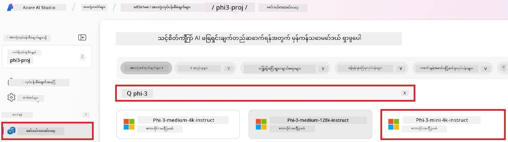

3. **Fine-tune** ကို ရွေးချယ်ပါ။

    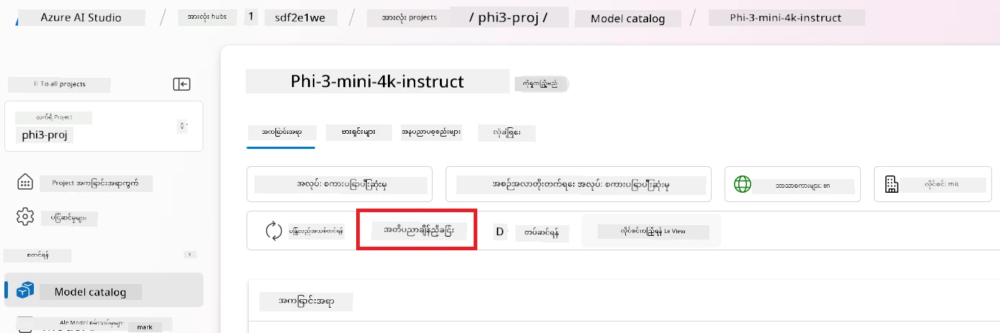

4. **Fine-tuned model name** ကို ထည့်ပါ။

    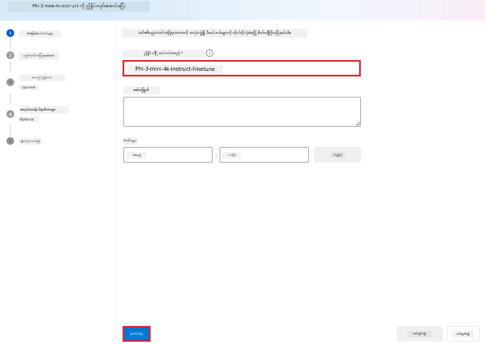

5. **Next** ကို ရွေးချယ်ပါ။

6. အောက်ပါအချက်များကို ပြုလုပ်ပါ။

    - **task type** ကို **Chat completion** အဖြစ် ရွေးချယ်ပါ။
    - အသုံးပြုမည့် **Training data** ကို ရွေးချယ်ပါ။ Azure AI Foundry ၏ ဒေတာမှ သို့မဟုတ် ကိုယ်ပိုင်ပတ်ဝန်းကျင်မှ တင်နိုင်သည်။

    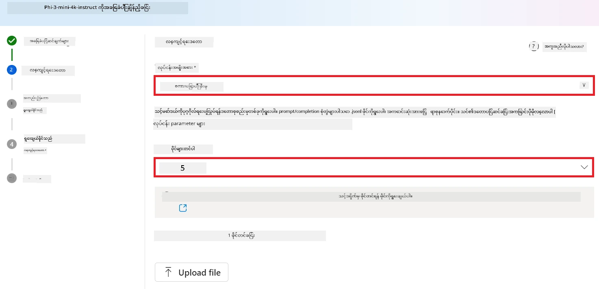

7. **Next** ကို ရွေးချယ်ပါ။

8. အသုံးပြုမည့် **Validation data** ကို တင်ပါ၊ သို့မဟုတ် **Automatic split of training data** ကို ရွေးချယ်နိုင်သည်။

    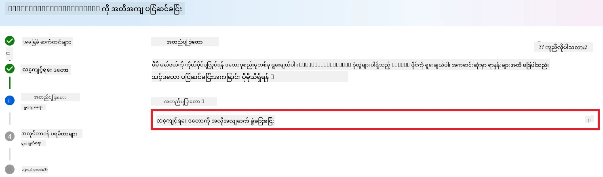

9. **Next** ကို ရွေးချယ်ပါ။

10. အောက်ပါအချက်များကို ပြုလုပ်ပါ။

    - အသုံးပြုမည့် **Batch size multiplier** ကို ရွေးချယ်ပါ။
    - အသုံးပြုမည့် **Learning rate** ကို ရွေးချယ်ပါ။
    - အသုံးပြုမည့် **Epochs** ကို ရွေးချယ်ပါ။

    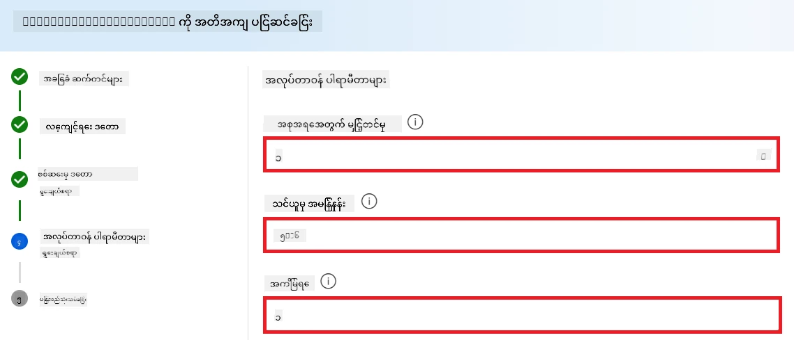

11. Fine-tuning လုပ်ငန်းစဉ် စတင်ရန် **Submit** ကို နှိပ်ပါ။

    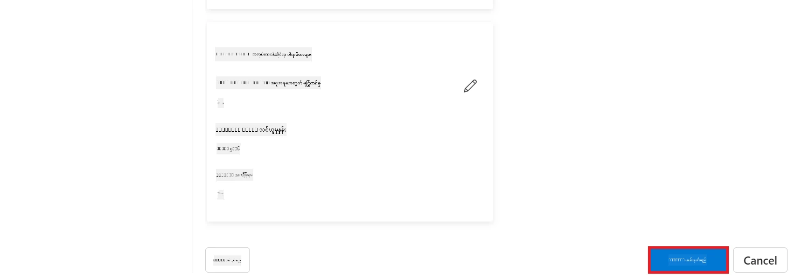

12. မော်ဒယ် fine-tune ပြီးပါက အခြေအနေကို **Completed** ဟု ပြသမည်။ ယခု မော်ဒယ်ကို deploy ပြုလုပ်၍ ကိုယ်ပိုင် application, playground သို့မဟုတ် prompt flow တွင် အသုံးပြုနိုင်ပါသည်။ အသေးစိတ်အချက်အလက်များအတွက် [How to deploy Phi-3 family of small language models with Azure AI Foundry](https://learn.microsoft.com/azure/ai-studio/how-to/deploy-models-phi-3?tabs=phi-3-5&pivots=programming-language-python) ကို ကြည့်ပါ။

    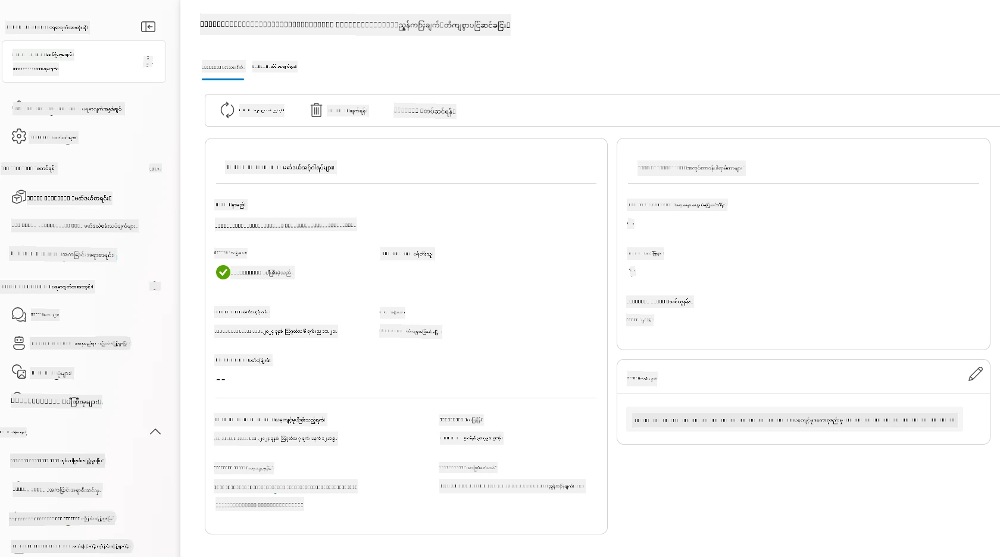

> [!NOTE]
> Phi-3 မော်ဒယ်များကို fine-tune ပြုလုပ်ခြင်းနှင့် ပတ်သက်၍ အသေးစိတ်အချက်အလက်များအတွက် [Fine-tune Phi-3 models in Azure AI Foundry](https://learn.microsoft.com/azure/ai-studio/how-to/fine-tune-phi-3?tabs=phi-3-mini) ကို လေ့လာပါ။

## Fine-tuned မော်ဒယ်များကို ရှင်းလင်းခြင်း

[Azure AI Foundry](https://ai.azure.com) တွင် fine-tuning မော်ဒယ်စာရင်းမှ သို့မဟုတ် မော်ဒယ်အသေးစိတ်စာမျက်နှာမှ fine-tuned မော်ဒယ်ကို ဖျက်နိုင်သည်။ Fine-tuning စာမျက်နှာတွင် ဖျက်လိုသော မော်ဒယ်ကို ရွေးချယ်ပြီး Delete ခလုတ်ကို နှိပ်ပါ။

> [!NOTE]
> မော်ဒယ် deployment ရှိနေပါက custom မော်ဒယ်ကို ဖျက်၍ မရပါ။ မော်ဒယ် deployment ကို ပထမဦးစွာ ဖျက်ရမည်။

## ကုန်ကျစရိတ်နှင့် အရေအတွက်ကန့်သတ်ချက်များ

### Phi-3 မော်ဒယ်များကို service အဖြစ် fine-tune ပြုလုပ်ရာတွင် ကုန်ကျစရိတ်နှင့် အရေအတွက်စဉ်းစားချက်များ

Phi မော်ဒယ်များကို Microsoft မှ service အဖြစ် ပေးအပ်ပြီး Azure AI Foundry နှင့် ပေါင်းစပ်အသုံးပြုနိုင်သည်။ မော်ဒယ်များကို [deploy](https://learn.microsoft.com/azure/ai-studio/how-to/deploy-models-phi-3?tabs=phi-3-5&pivots=programming-language-python) သို့မဟုတ် fine-tune ပြုလုပ်ရာတွင် စျေးနှုန်းနှင့် စည်းကမ်းချက်များကို deployment wizard ၏ Pricing and terms tab တွင် ကြည့်ရှုနိုင်သည်။

## အကြောင်းအရာ စစ်ထုတ်ခြင်း

Pay-as-you-go service အဖြစ် deploy ပြုလုပ်သော မော်ဒယ်များကို Azure AI Content Safety က ကာကွယ်ပေးသည်။ real-time endpoints တွင် deploy ပြုလုပ်သောအခါ ဤစနစ်ကို ရွေးချယ်၍ မပါဝင်စေလိုပါက opt-out လုပ်နိုင်သည်။ Azure AI content safety ဖွင့်ထားပါက prompt နှင့် completion နှစ်ခုလုံးကို အန္တရာယ်ရှိနိုင်သော အကြောင်းအရာများကို ရှာဖွေကာ တားဆီးရန် classification မော်ဒယ်များစုစည်းထားသော စနစ်ဖြင့် စစ်ဆေးသည်။ အကြောင်းအရာ စစ်ထုတ်ခြင်းစနစ်သည် input prompt နှင့် output completion များတွင် ဖြစ်နိုင်သော အန္တရာယ်ရှိသော အကြောင်းအရာအမျိုးအစားများကို ရှာဖွေကာ လိုက်နာဆောင်ရွက်သည်။ [Azure AI Content Safety](https://learn.microsoft.com/azure/ai-studio/concepts/content-filtering) အကြောင်း ပိုမိုသိရှိလိုပါက ကြည့်ရှုနိုင်သည်။

**Fine-Tuning ဆက်တင်များ**

Hyperparameters: learning rate, batch size, training epochs အစရှိသည့် hyperparameters များကို သတ်မှတ်ပါ။

**Loss Function**

သင့်အလုပ်အတွက် သင့်တော်သော loss function (ဥပမာ cross-entropy) ကို ရွေးချယ်ပါ။

**Optimizer**

သင်ကြားမှုအတွင်း gradient update များအတွက် optimizer (ဥပမာ Adam) ကို ရွေးချယ်ပါ။

**Fine-Tuning လုပ်ငန်းစဉ်**

- Pre-Trained Model ကို load ပြုလုပ်ပါ။ Phi-3 Mini checkpoint ကို load လုပ်ပါ။
- Custom Layers ထည့်ပါ။ အလုပ်အမျိုးအစားအလိုက် အထူးပြုလုပ်ထားသော layer များ (ဥပမာ chat အညွှန်းများအတွက် classification head) ထည့်ပါ။

**မော်ဒယ်ကို သင်ကြားပါ**

ပြင်ဆင်ထားသော dataset ဖြင့် မော်ဒယ်ကို fine-tune ပြုလုပ်ပါ။ သင်ကြားမှုတိုးတက်မှုကို စောင့်ကြည့်ပြီး hyperparameters များကို လိုအပ်သလို ပြင်ဆင်ပါ။

**အကဲဖြတ်ခြင်းနှင့် အတည်ပြုခြင်း**

Validation Set: သင့်ဒေတာကို သင်ကြားရေးနှင့် အတည်ပြုဒေတာအဖြစ် ခွဲထုတ်ပါ။

**စွမ်းဆောင်ရည် အကဲဖြတ်ခြင်း**

accuracy, F1-score, perplexity စသည့် မီထရစ်များဖြင့် မော်ဒယ်စွမ်းဆောင်ရည်ကို သုံးသပ်ပါ။

## Fine-Tuned မော်ဒယ်ကို သိမ်းဆည်းခြင်း

**Checkpoint**

နောက်တစ်ကြိမ်အသုံးပြုရန် fine-tuned မော်ဒယ် checkpoint ကို သိမ်းဆည်းပါ။

## Deployment

- Web Service အဖြစ် deploy ပြုလုပ်ပါ။ Azure AI Foundry တွင် fine-tuned မော်ဒယ်ကို web service အဖြစ် deploy ပြုလုပ်ပါ။
- Endpoint ကို စမ်းသပ်ပါ။ Deploy ပြုလုပ်ထားသော endpoint သို့ စမ်းသပ်မေးခွန်းများ ပို့၍ လုပ်ဆောင်နိုင်မှုကို စစ်ဆေးပါ။

## ပြန်လည်ပြင်ဆင်ခြင်းနှင့် တိုးတက်အောင်လုပ်ခြင်း

ပြန်လည်ပြင်ဆင်ပါ။ စွမ်းဆောင်ရည် မ

**အကြောင်းကြားချက်**  
ဤစာတမ်းကို AI ဘာသာပြန်ဝန်ဆောင်မှု [Co-op Translator](https://github.com/Azure/co-op-translator) ဖြင့် ဘာသာပြန်ထားပါသည်။ ကျွန်ုပ်တို့သည် တိကျမှန်ကန်မှုအတွက် ကြိုးစားသော်လည်း အလိုအလျောက် ဘာသာပြန်ခြင်းတွင် အမှားများ သို့မဟုတ် မှားယွင်းချက်များ ပါဝင်နိုင်ကြောင်း သတိပြုပါရန် မေတ္တာရပ်ခံအပ်ပါသည်။ မူရင်းစာတမ်းကို မိမိဘာသာစကားဖြင့်သာ တရားဝင်အရင်းအမြစ်အဖြစ် သတ်မှတ်သင့်ပါသည်။ အရေးကြီးသော အချက်အလက်များအတွက် လူ့ဘာသာပြန်ပညာရှင်မှ ဘာသာပြန်ခြင်းကို အကြံပြုပါသည်။ ဤဘာသာပြန်ချက်ကို အသုံးပြုရာမှ ဖြစ်ပေါ်လာနိုင်သည့် နားလည်မှုမှားယွင်းမှုများအတွက် ကျွန်ုပ်တို့သည် တာဝန်မခံပါ။