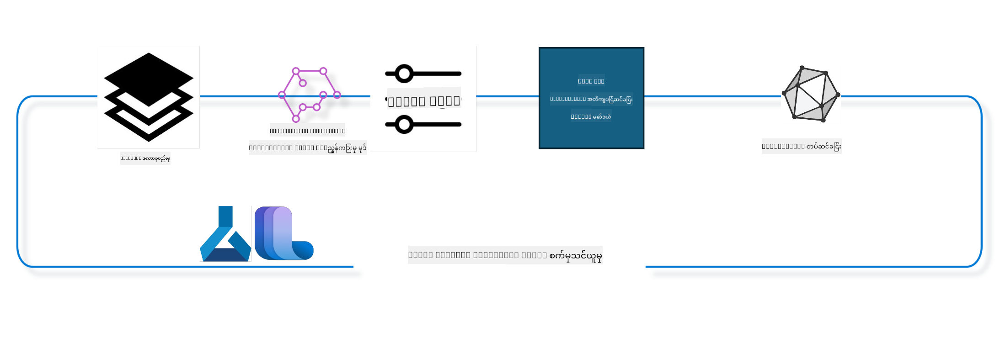

<!--
CO_OP_TRANSLATOR_METADATA:
{
  "original_hash": "944949f040e61b2ea25b3460f7394fd4",
  "translation_date": "2025-07-17T07:53:03+00:00",
  "source_file": "md/03.FineTuning/FineTuning_MLSDK.md",
  "language_code": "my"
}
-->
## Azure ML စနစ်မှ chat-completion ကွန်ပိုနင့်များကို အသုံးပြုပြီး မော်ဒယ်ကို အတိအကျ ပြင်ဆင်နည်း

ဤဥပမာတွင် ultrachat_200k ဒေတာစုံစုကို အသုံးပြု၍ လူနှစ်ဦးအကြား စကားပြောပြီးဆုံးရန် Phi-3-mini-4k-instruct မော်ဒယ်ကို အတိအကျ ပြင်ဆင်မည်ဖြစ်သည်။



ဥပမာတွင် Azure ML SDK နှင့် Python ကို အသုံးပြုပြီး အတိအကျ ပြင်ဆင်ခြင်းကို ပြသပြီး ပြင်ဆင်ပြီးသော မော်ဒယ်ကို အွန်လိုင်း endpoint တွင် တိုက်ရိုက်ခန့်မှန်းမှုအတွက် တပ်ဆင်ပေးမည်ဖြစ်သည်။

### လေ့ကျင့်ရေးဒေတာ

ultrachat_200k ဒေတာစုံစုကို အသုံးပြုမည်ဖြစ်သည်။ ၎င်းသည် UltraChat ဒေတာစုံစု၏ အလွန်စစ်ထုတ်ထားသော ဗားရှင်းဖြစ်ပြီး Zephyr-7B-β (နောက်ဆုံးပေါ် 7b စကားပြောမော်ဒယ်) ကို လေ့ကျင့်ရန် အသုံးပြုခဲ့သည်။

### မော်ဒယ်

chat-completion လုပ်ငန်းအတွက် မော်ဒယ်ကို အတိအကျ ပြင်ဆင်နည်းကို ပြသရန် Phi-3-mini-4k-instruct မော်ဒယ်ကို အသုံးပြုမည်ဖြစ်သည်။ သင်သည် အထူးသတ်မှတ်ထားသော မော်ဒယ်ကတ်မှ ဒီ notebook ကို ဖွင့်ထားပါက မော်ဒယ်အမည်ကို အစားထိုးရန် မမေ့ပါနှင့်။

### လုပ်ငန်းများ

- အတိအကျ ပြင်ဆင်ရန် မော်ဒယ်ရွေးချယ်ပါ။
- လေ့ကျင့်ရေးဒေတာကို ရွေးချယ်ပြီး စူးစမ်းပါ။
- အတိအကျ ပြင်ဆင်ရေး အလုပ်ကို စီမံခန့်ခွဲပါ။
- အတိအကျ ပြင်ဆင်ရေး အလုပ်ကို လည်ပတ်ပါ။
- လေ့ကျင့်မှုနှင့် သုံးသပ်မှု မီထရစ်များကို ပြန်လည်သုံးသပ်ပါ။
- အတိအကျ ပြင်ဆင်ပြီး မော်ဒယ်ကို မှတ်ပုံတင်ပါ။
- အတိအကျ ပြင်ဆင်ပြီး မော်ဒယ်ကို တိုက်ရိုက်ခန့်မှန်းမှုအတွက် တပ်ဆင်ပါ။
- အရင်းအမြစ်များကို သန့်ရှင်းပါ။

## ၁။ မလိုအပ်မီ အဆင်သင့်ပြင်ဆင်ခြင်း

- လိုအပ်သော dependency များကို ထည့်သွင်းပါ။
- AzureML Workspace နှင့် ချိတ်ဆက်ပါ။ SDK authentication ကို စတင်ရန် set up SDK authentication ကို လေ့လာပါ။ အောက်ပါ <WORKSPACE_NAME>, <RESOURCE_GROUP> နှင့် <SUBSCRIPTION_ID> ကို အစားထိုးပါ။
- azureml system registry နှင့် ချိတ်ဆက်ပါ။
- ရွေးချယ်နိုင်သော experiment name တစ်ခု သတ်မှတ်ပါ။
- Compute ကို စစ်ဆေး သို့မဟုတ် ဖန်တီးပါ။

> [!NOTE]
> တစ်ခုတည်းသော GPU node တစ်ခုတွင် GPU ကတ်များစွာ ပါနိုင်သည်။ ဥပမာ၊ Standard_NC24rs_v3 node တစ်ခုတွင် NVIDIA V100 GPU ၄ လုံးရှိပြီး Standard_NC12s_v3 တွင် NVIDIA V100 GPU ၂ လုံးရှိသည်။ ဤအချက်အလက်များအတွက် စာရွက်စာတမ်းများကို ရည်ညွှန်းပါ။ တစ် node လျှင် GPU ကတ်အရေအတွက်ကို အောက်ပါ param gpus_per_node တွင် သတ်မှတ်ထားသည်။ ဤတန်ဖိုးကို မှန်ကန်စွာ သတ်မှတ်ခြင်းဖြင့် node အတွင်းရှိ GPU များအားလုံးကို အသုံးပြုနိုင်မည်ဖြစ်သည်။ အကြံပြုထားသော GPU compute SKU များကို ဒီနေရာနှင့် ဒီနေရာတွင် တွေ့နိုင်ပါသည်။

### Python စာကြည့်တိုက်များ

အောက်ပါ cell ကို လည်ပတ်ခြင်းဖြင့် dependency များ ထည့်သွင်းပါ။ ၎င်းသည် အသစ်သော ပတ်ဝန်းကျင်တွင် လည်ပတ်ပါက ရွေးချယ်စရာ မဟုတ်ပါ။

```bash
pip install azure-ai-ml
pip install azure-identity
pip install datasets==2.9.0
pip install mlflow
pip install azureml-mlflow
```

### Azure ML နှင့် ဆက်သွယ်ခြင်း

1. ဤ Python script သည် Azure Machine Learning (Azure ML) ဝန်ဆောင်မှုနှင့် ဆက်သွယ်ရန် အသုံးပြုသည်။ ၎င်း၏ လုပ်ဆောင်ချက်များကို အောက်ပါအတိုင်း ဖော်ပြထားသည်-

    - azure.ai.ml, azure.identity, နှင့် azure.ai.ml.entities package များမှ လိုအပ်သော module များကို import လုပ်သည်။ time module ကိုလည်း import လုပ်သည်။

    - DefaultAzureCredential() ဖြင့် အတည်ပြုမှုကို ကြိုးစားသည်။ ၎င်းသည် Azure cloud တွင် လျင်မြန်စွာ application များ ဖန်တီးရန် အလွယ်တကူ အတည်ပြုမှု အတွေ့အကြုံကို ပေးသည်။ မအောင်မြင်ပါက InteractiveBrowserCredential() သို့ ပြန်လည်သုံးသည်၊ ၎င်းသည် အပြန်အလှန် login prompt ကို ပေးသည်။

    - from_config method ဖြင့် MLClient instance တစ်ခု ဖန်တီးရန် ကြိုးစားသည်။ ၎င်းသည် default config ဖိုင် (config.json) မှ configuration ကို ဖတ်သည်။ မအောင်မြင်ပါက subscription_id, resource_group_name, workspace_name ကို လက်ဖြင့် ပေးသည့် MLClient instance တစ်ခု ဖန်တီးသည်။

    - Azure ML registry အတွက် "azureml" ဟု အမည်ပေးထားသော MLClient instance တစ်ခု ဖန်တီးသည်။ ၎င်း registry တွင် မော်ဒယ်များ၊ အတိအကျ ပြင်ဆင်ရေး pipeline များနှင့် ပတ်ဝန်းကျင်များ သိမ်းဆည်းထားသည်။

    - experiment_name ကို "chat_completion_Phi-3-mini-4k-instruct" ဟု သတ်မှတ်သည်။

    - ယခုအချိန် (epoch မှ စတင်၍ စက္ကန့်အဖြစ်) ကို integer သို့ ပြောင်းပြီး string အဖြစ် ပြောင်း၍ ထူးခြားသော timestamp တစ်ခု ဖန်တီးသည်။ ၎င်း timestamp ကို ထူးခြားသော အမည်များနှင့် ဗားရှင်းများ ဖန်တီးရာတွင် အသုံးပြုနိုင်သည်။

    ```python
    # Import necessary modules from Azure ML and Azure Identity
    from azure.ai.ml import MLClient
    from azure.identity import (
        DefaultAzureCredential,
        InteractiveBrowserCredential,
    )
    from azure.ai.ml.entities import AmlCompute
    import time  # Import time module
    
    # Try to authenticate using DefaultAzureCredential
    try:
        credential = DefaultAzureCredential()
        credential.get_token("https://management.azure.com/.default")
    except Exception as ex:  # If DefaultAzureCredential fails, use InteractiveBrowserCredential
        credential = InteractiveBrowserCredential()
    
    # Try to create an MLClient instance using the default config file
    try:
        workspace_ml_client = MLClient.from_config(credential=credential)
    except:  # If that fails, create an MLClient instance by manually providing the details
        workspace_ml_client = MLClient(
            credential,
            subscription_id="<SUBSCRIPTION_ID>",
            resource_group_name="<RESOURCE_GROUP>",
            workspace_name="<WORKSPACE_NAME>",
        )
    
    # Create another MLClient instance for the Azure ML registry named "azureml"
    # This registry is where models, fine-tuning pipelines, and environments are stored
    registry_ml_client = MLClient(credential, registry_name="azureml")
    
    # Set the experiment name
    experiment_name = "chat_completion_Phi-3-mini-4k-instruct"
    
    # Generate a unique timestamp that can be used for names and versions that need to be unique
    timestamp = str(int(time.time()))
    ```

## ၂။ အတိအကျ ပြင်ဆင်ရန် မူလမော်ဒယ် ရွေးချယ်ခြင်း

1. Phi-3-mini-4k-instruct သည် 3.8B parameters ပါရှိသော အလေးချိန်နည်းပြီး နောက်ဆုံးပေါ် ဖွင့်လှစ်မော်ဒယ်တစ်ခုဖြစ်သည်။ Phi-2 အတွက် အသုံးပြုသော ဒေတာစုံစုများအပေါ် တည်ဆောက်ထားသည်။ မော်ဒယ်သည် Phi-3 မော်ဒယ် မိသားစုတွင် ပါဝင်ပြီး Mini ဗားရှင်းတွင် 4K နှင့် 128K (token အရေအတွက်) ဆိုသည့် နှစ်မျိုးရှိသည်။ သင့်ရည်ရွယ်ချက်အတွက် မော်ဒယ်ကို အတိအကျ ပြင်ဆင်ရန် လိုအပ်သည်။ AzureML Studio ၏ Model Catalog တွင် chat-completion လုပ်ငန်းအတွက် စစ်ထုတ်၍ မော်ဒယ်များကို ကြည့်ရှုနိုင်သည်။ ဤဥပမာတွင် Phi-3-mini-4k-instruct မော်ဒယ်ကို အသုံးပြုသည်။ သင်သည် အခြားမော်ဒယ်အတွက် notebook ကို ဖွင့်ထားပါက မော်ဒယ်အမည်နှင့် ဗားရှင်းကို သင့်တော်စွာ အစားထိုးပါ။

    > [!NOTE]
    > မော်ဒယ်၏ id property ဖြစ်သည်။ ၎င်းကို အတိအကျ ပြင်ဆင်ရေး အလုပ်တွင် input အဖြစ် ပေးပို့မည်ဖြစ်သည်။ AzureML Studio Model Catalog ၏ မော်ဒယ်အသေးစိတ် စာမျက်နှာတွင် Asset ID အဖြစ်လည်း ရနိုင်သည်။

2. ဤ Python script သည် Azure Machine Learning (Azure ML) ဝန်ဆောင်မှုနှင့် ဆက်သွယ်နေသည်။ လုပ်ဆောင်ချက်များကို အောက်ပါအတိုင်း ဖော်ပြထားသည်-

    - model_name ကို "Phi-3-mini-4k-instruct" ဟု သတ်မှတ်သည်။

    - registry_ml_client object ၏ models property ၏ get method ကို အသုံးပြု၍ Azure ML registry မှ မော်ဒယ်အမည်နှင့် label "latest" ဖြင့် မော်ဒယ်၏ နောက်ဆုံးဗားရှင်းကို ရယူသည်။

    - အတိအကျ ပြင်ဆင်ရန် အသုံးပြုမည့် မော်ဒယ်၏ အမည်၊ ဗားရှင်းနှင့် id ကို console တွင် ပုံနှိပ်ပြသသည်။ string ၏ format method ဖြင့် မော်ဒယ်၏ အမည်၊ ဗားရှင်းနှင့် id ကို စာသားထဲသို့ ထည့်သွင်းသည်။ မော်ဒယ်၏ အမည်၊ ဗားရှင်းနှင့် id ကို foundation_model object ၏ property များအဖြစ် ရယူသည်။

    ```python
    # Set the model name
    model_name = "Phi-3-mini-4k-instruct"
    
    # Get the latest version of the model from the Azure ML registry
    foundation_model = registry_ml_client.models.get(model_name, label="latest")
    
    # Print the model name, version, and id
    # This information is useful for tracking and debugging
    print(
        "\n\nUsing model name: {0}, version: {1}, id: {2} for fine tuning".format(
            foundation_model.name, foundation_model.version, foundation_model.id
        )
    )
    ```

## ၃။ အလုပ်အတွက် အသုံးပြုမည့် compute ဖန်တီးခြင်း

finetune အလုပ်သည် GPU compute ဖြင့်သာ လည်ပတ်သည်။ compute ၏ အရွယ်အစားသည် မော်ဒယ်၏ အရွယ်အစားပေါ် မူတည်ပြီး အများအားဖြင့် အလုပ်အတွက် သင့်တော်သော compute ကို ရွေးချယ်ရခက်ခဲသည်။ ဤ cell တွင် အသုံးပြုသူအား အလုပ်အတွက် သင့်တော်သော compute ကို ရွေးချယ်ရန် လမ်းညွှန်ပေးသည်။

> [!NOTE]
> အောက်ပါ compute များသည် အကောင်းဆုံး စနစ်တကျ ဖွဲ့စည်းထားသော configuration ဖြင့် လည်ပတ်သည်။ configuration တွင် ပြောင်းလဲမှုများ ပြုလုပ်ပါက Cuda Out Of Memory error ဖြစ်နိုင်သည်။ ၎င်းအခြေအနေများတွင် compute ကို ပိုကြီးသော အရွယ်အစားသို့ မြှင့်တင်ရန် ကြိုးစားပါ။

> [!NOTE]
> အောက်ပါ compute_cluster_size ကို ရွေးချယ်စဉ်တွင် သင့် resource group တွင် compute ရရှိနိုင်မှုကို သေချာစစ်ဆေးပါ။ သတ်မှတ်ထားသော compute မရရှိပါက compute resource များသို့ ဝင်ရောက်ခွင့် ရယူရန် တောင်းဆိုနိုင်သည်။

### အတိအကျ ပြင်ဆင်မှုကို ထောက်ပံ့နိုင်မှုအတွက် မော်ဒယ် စစ်ဆေးခြင်း

1. ဤ Python script သည် Azure Machine Learning (Azure ML) မော်ဒယ်နှင့် ဆက်သွယ်နေသည်။ လုပ်ဆောင်ချက်များကို အောက်ပါအတိုင်း ဖော်ပြထားသည်-

    - Python abstract syntax grammar tree များကို ပြုလုပ်ရန် ast module ကို import လုပ်သည်။

    - foundation_model object တွင် finetune_compute_allow_list ဟု အမည်ရသော tag ရှိမရှိ စစ်ဆေးသည်။ Azure ML တွင် tag များသည် key-value စနစ်ဖြင့် မော်ဒယ်များကို စစ်ထုတ်ခြင်းနှင့် စီမံခန့်ခွဲရန် အသုံးပြုသည်။

    - finetune_compute_allow_list tag ရှိပါက ast.literal_eval function ဖြင့် tag ၏ string တန်ဖိုးကို Python list အဖြစ် လုံခြုံစွာ ပြောင်းလဲပြီး computes_allow_list သို့ သတ်မှတ်သည်။ ထို့နောက် list မှ compute များကို ဖန်တီးရန် သတင်းပို့သည်။

    - finetune_compute_allow_list tag မရှိပါက computes_allow_list ကို None သတ်မှတ်ပြီး မော်ဒယ် tag များတွင် finetune_compute_allow_list မပါဝင်ကြောင်း သတင်းပို့သည်။

    - အကျဉ်းချုပ်အားဖြင့် မော်ဒယ် metadata တွင် tag တစ်ခု ရှိမရှိ စစ်ဆေးခြင်း၊ ရှိပါက tag ၏ တန်ဖိုးကို list အဖြစ် ပြောင်းလဲခြင်းနှင့် အသုံးပြုသူအား တုံ့ပြန်ချက် ပေးခြင်း ဖြစ်သည်။

    ```python
    # Import the ast module, which provides functions to process trees of the Python abstract syntax grammar
    import ast
    
    # Check if the 'finetune_compute_allow_list' tag is present in the model's tags
    if "finetune_compute_allow_list" in foundation_model.tags:
        # If the tag is present, use ast.literal_eval to safely parse the tag's value (a string) into a Python list
        computes_allow_list = ast.literal_eval(
            foundation_model.tags["finetune_compute_allow_list"]
        )  # convert string to python list
        # Print a message indicating that a compute should be created from the list
        print(f"Please create a compute from the above list - {computes_allow_list}")
    else:
        # If the tag is not present, set computes_allow_list to None
        computes_allow_list = None
        # Print a message indicating that the 'finetune_compute_allow_list' tag is not part of the model's tags
        print("`finetune_compute_allow_list` is not part of model tags")
    ```

### Compute Instance စစ်ဆေးခြင်း

1. ဤ Python script သည် Azure Machine Learning (Azure ML) ဝန်ဆောင်မှုနှင့် ဆက်သွယ်ပြီး compute instance တစ်ခုအား စစ်ဆေးမှုများ ပြုလုပ်သည်။ လုပ်ဆောင်ချက်များကို အောက်ပါအတိုင်း ဖော်ပြထားသည်-

    - compute_cluster တွင် သိမ်းထားသော အမည်ဖြင့် Azure ML workspace မှ compute instance ကို ရယူရန် ကြိုးစားသည်။ compute instance ၏ provisioning state သည် "failed" ဖြစ်ပါက ValueError ကို ထုတ်ပေးသည်။

    - computes_allow_list သည် None မဟုတ်ပါက list အတွင်းရှိ compute အရွယ်အစားများအားလုံးကို lowercase သို့ ပြောင်းပြီး လက်ရှိ compute instance ၏ အရွယ်အစားသည် list တွင် ရှိမရှိ စစ်ဆေးသည်။ မရှိပါက ValueError ကို ထုတ်ပေးသည်။

    - computes_allow_list သည် None ဖြစ်ပါက လက်ရှိ compute instance ၏ အရွယ်အစားသည် မထောက်ခံသော GPU VM အရွယ်အစားများ စာရင်းတွင် ရှိမရှိ စစ်ဆေးသည်။ ရှိပါက ValueError ကို ထုတ်ပေးသည်။

    - workspace တွင် ရရှိနိုင်သော compute အရွယ်အစားများ စာရင်းကို ရယူသည်။ စာရင်းအတွင်းရှိ compute အရွယ်အစားတစ်ခုချင်းစီကို လည်ပတ်ပြီး လက်ရှိ compute instance ၏ အရွယ်အစားနှင့် ကိုက်ညီပါက compute အရွယ်အစားအတွက် GPU အရေအတွက်ကို ရယူပြီး gpu_count_found ကို True သတ်မှတ်သည်။

    - gpu_count_found သည် True ဖြစ်ပါက compute instance တွင် GPU အရေအတွက်ကို ပုံနှိပ်ပြသသည်။ မဟုတ်ပါက ValueError ကို ထုတ်ပေးသည်။

    - အကျဉ်းချုပ်အားဖြင့် Azure ML workspace တွင် compute instance တစ်ခု၏ provisioning state, အရွယ်အစား (allow list သို့မဟုတ် deny list နှင့် နှိုင်းယှဉ်ခြင်း), GPU အရေအတွက် စသည်တို့ကို စစ်ဆေးသည်။

    ```python
    # Print the exception message
    print(e)
    # Raise a ValueError if the compute size is not available in the workspace
    raise ValueError(
        f"WARNING! Compute size {compute_cluster_size} not available in workspace"
    )
    
    # Retrieve the compute instance from the Azure ML workspace
    compute = workspace_ml_client.compute.get(compute_cluster)
    # Check if the provisioning state of the compute instance is "failed"
    if compute.provisioning_state.lower() == "failed":
        # Raise a ValueError if the provisioning state is "failed"
        raise ValueError(
            f"Provisioning failed, Compute '{compute_cluster}' is in failed state. "
            f"please try creating a different compute"
        )
    
    # Check if computes_allow_list is not None
    if computes_allow_list is not None:
        # Convert all compute sizes in computes_allow_list to lowercase
        computes_allow_list_lower_case = [x.lower() for x in computes_allow_list]
        # Check if the size of the compute instance is in computes_allow_list_lower_case
        if compute.size.lower() not in computes_allow_list_lower_case:
            # Raise a ValueError if the size of the compute instance is not in computes_allow_list_lower_case
            raise ValueError(
                f"VM size {compute.size} is not in the allow-listed computes for finetuning"
            )
    else:
        # Define a list of unsupported GPU VM sizes
        unsupported_gpu_vm_list = [
            "standard_nc6",
            "standard_nc12",
            "standard_nc24",
            "standard_nc24r",
        ]
        # Check if the size of the compute instance is in unsupported_gpu_vm_list
        if compute.size.lower() in unsupported_gpu_vm_list:
            # Raise a ValueError if the size of the compute instance is in unsupported_gpu_vm_list
            raise ValueError(
                f"VM size {compute.size} is currently not supported for finetuning"
            )
    
    # Initialize a flag to check if the number of GPUs in the compute instance has been found
    gpu_count_found = False
    # Retrieve a list of all available compute sizes in the workspace
    workspace_compute_sku_list = workspace_ml_client.compute.list_sizes()
    available_sku_sizes = []
    # Iterate over the list of available compute sizes
    for compute_sku in workspace_compute_sku_list:
        available_sku_sizes.append(compute_sku.name)
        # Check if the name of the compute size matches the size of the compute instance
        if compute_sku.name.lower() == compute.size.lower():
            # If it does, retrieve the number of GPUs for that compute size and set gpu_count_found to True
            gpus_per_node = compute_sku.gpus
            gpu_count_found = True
    # If gpu_count_found is True, print the number of GPUs in the compute instance
    if gpu_count_found:
        print(f"Number of GPU's in compute {compute.size}: {gpus_per_node}")
    else:
        # If gpu_count_found is False, raise a ValueError
        raise ValueError(
            f"Number of GPU's in compute {compute.size} not found. Available skus are: {available_sku_sizes}."
            f"This should not happen. Please check the selected compute cluster: {compute_cluster} and try again."
        )
    ```

## ၄။ မော်ဒယ်အတိအကျ ပြင်ဆင်ရန် ဒေတာစုံစု ရွေးချယ်ခြင်း

1. ultrachat_200k ဒေတာစုံစုကို အသုံးပြုမည်ဖြစ်သည်။ ဒေတာစုံစုတွင် Supervised fine-tuning (sft) အတွက် သင့်တော်သော စိတ်ပိုင်းခြားထားသော စိတ်ပိုင်း ၄ ခု ပါဝင်သည်။ Generation ranking (gen) ဖြစ်သည်။ စိတ်ပိုင်းတစ်ခုလျှင် နမူနာအရေအတွက်ကို အောက်ပါအတိုင်း ပြသထားသည်-

    ```bash
    train_sft test_sft  train_gen  test_gen
    207865  23110  256032  28304
    ```

1. နောက်ထပ် cell များတွင် အတိအကျ ပြင်ဆင်ရေးအတွက် အခြေခံ ဒေတာပြင်ဆင်မှုများ ပြသထားသည်-

### ဒေတာတန်းအချို့ကို မြင်ကွင်းပြုခြင်း

ဤနမူနာကို လျင်မြန်စွာ လည်ပတ်စေရန် train_sft, test_sft ဖိုင်များတွင် ရှင်းလင်းပြီးသား ဒေတာတန်းများ၏ ၅% ကို သိမ်းဆည်းထားသည်။ ၎င်းကြောင့် အတိအကျ ပြင်ဆင်ပြီး မော်ဒယ်၏ တိကျမှုနည်းပါးမည်ဖြစ်ပြီး အမှန်တကယ် အသုံးပြုရန် မသင့်တော်ပါ။ download-dataset.py ကို ultrachat_200k ဒေတာစုံစုကို ဒေါင်းလုပ်လုပ်ရန်နှင့် ဒေတာစုံစုကို finetune pipeline component အသုံးပြုနိုင်သော ပုံစံသို့ ပြောင်းလဲရန် အသုံးပြုသည်။ ဒေတာစုံစုသည် ကြီးမားသောကြောင့် အပိုင်းတစ်စိတ်တစ်ပိုင်းသာ ပါဝင်သည်။

1. အောက်ပါ script ကို လည်ပတ်ခြင်းဖြင့် ဒေတာ၏ ၅% ကိုသာ ဒေါင်းလုပ်လုပ်မည်ဖြစ်သည်။ dataset_split_pc parameter ကို လိုသလို ပြောင်းလဲ၍ တိုးမြှင့်နိုင်သည်။

    > [!NOTE]
    > ဘာသာစကား မော်ဒယ်အချို့တွင် ဘာသာစကားကုဒ် မတူညီမှုရှိနိုင်ပြီး ဒေတာစုံစုတွင် ကော်လံအမည်များသည် ထိုအတိုင်း ပြောင်းလဲထားသင့်သည်။

1. ဒေတာသည် အောက်ပါပုံစံအတိုင်း ဖြစ်ရမည်ဖြစ်သည်။
chat-completion ဒေတာစုံစုကို parquet ပုံစံဖြင့် သိမ်းဆည်းထားပြီး အချက်အလက်တစ်ခုစီသည် အောက်ပါ schema ကို အသုံးပြုသည်-

    - ၎င်းသည် JSON (JavaScript Object Notation) စာရွက်ဖြစ်ပြီး ဒေတာလဲလှယ်ရန် လူကြိုက်များသော ပုံစံဖြစ်သည်။ အကောင်အထည်မဖော်နိုင်သော်လည်း ဒေတာ သိမ်းဆည်းခြင်းနှင့် သယ်ယူပို့ဆောင်ခြင်းအတွက် အသုံးပြုသည်
- DataFrame ရဲ့ ပထမဆုံး ၅ လိုင်းကို ပြသဖို့ head method ကို အသုံးပြုထားပါတယ်။ DataFrame ရဲ့ လိုင်းအရေအတွက် ၅ ထက်နည်းရင်တော့ အားလုံးကို ပြသပါလိမ့်မယ်။

- အကျဉ်းချုပ်အားဖြင့် ဒီ script က JSON Lines ဖိုင်ကို DataFrame ထဲသို့ load လုပ်ပြီး ပထမဆုံး ၅ လိုင်းကို ကော်လံစာသားအပြည့်အစုံနဲ့ ပြသနေပါတယ်။

```python
    # Import the pandas library, which is a powerful data manipulation and analysis library
    import pandas as pd
    
    # Set the maximum column width for pandas' display options to 0
    # This means that the full text of each column will be displayed without truncation when the DataFrame is printed
    pd.set_option("display.max_colwidth", 0)
    
    # Use the pd.read_json function to load the train_sft.jsonl file from the ultrachat_200k_dataset directory into a DataFrame
    # The lines=True argument indicates that the file is in JSON Lines format, where each line is a separate JSON object
    df = pd.read_json("./ultrachat_200k_dataset/train_sft.jsonl", lines=True)
    
    # Use the head method to display the first 5 rows of the DataFrame
    # If the DataFrame has less than 5 rows, it will display all of them
    df.head()
    ```

## ၅။ model နဲ့ data ကို input အဖြစ် အသုံးပြုပြီး fine tuning job ကို submit လုပ်ခြင်း

chat-completion pipeline component ကို အသုံးပြုတဲ့ job ကို ဖန်တီးပါ။ fine tuning အတွက် support လုပ်တဲ့ parameter တွေကို ပိုမိုလေ့လာနိုင်ပါတယ်။

### finetune parameters ကို သတ်မှတ်ခြင်း

1. finetune parameters တွေကို training parameters နဲ့ optimization parameters ဆိုပြီး ၂ မျိုးခွဲနိုင်ပါတယ်။

1. Training parameters တွေက training ဆိုင်ရာ အချက်အလက်တွေကို သတ်မှတ်ပေးပါတယ် -

    - အသုံးပြုမယ့် optimizer နဲ့ scheduler
    - finetune ကို optimize လုပ်ဖို့ metric
    - training steps အရေအတွက်၊ batch size စသဖြင့်
    - Optimization parameters တွေက GPU memory ကို ထိရောက်စွာ အသုံးပြုနိုင်ဖို့နဲ့ compute resources တွေကို အကျိုးရှိစွာ အသုံးပြုဖို့ ကူညီပေးပါတယ်။

1. အောက်မှာ optimization parameters အနည်းငယ်ကို ဖော်ပြထားပါတယ်။ optimization parameters တွေဟာ model အလိုက် ကွဲပြားပြီး model နဲ့အတူ package ထဲမှာ ပါဝင်ပါတယ်။

    - deepspeed နဲ့ LoRA ကို ဖွင့်ထားခြင်း
    - mixed precision training ကို ဖွင့်ထားခြင်း
    - multi-node training ကို ဖွင့်ထားခြင်း


> [!NOTE]
> Supervised finetuning က alignment ပျောက်ဆုံးခြင်း သို့မဟုတ် catastrophic forgetting ဖြစ်စေနိုင်ပါတယ်။ ဒီပြဿနာကို စစ်ဆေးပြီး finetune ပြီးနောက် alignment အဆင့်ကို ပြန်လည်ပြုလုပ်ဖို့ အကြံပြုပါတယ်။

### Fine Tuning Parameters

1. ဒီ Python script က machine learning model ကို fine-tuning လုပ်ဖို့ parameter တွေကို သတ်မှတ်နေပါတယ်။ အောက်မှာ အကြောင်းအရာကို ဖော်ပြထားပါတယ်-

    - training epochs အရေအတွက်၊ training နဲ့ evaluation အတွက် batch size တွေ၊ learning rate နဲ့ learning rate scheduler အမျိုးအစား စသည့် default training parameters တွေကို သတ်မှတ်ထားပါတယ်။

    - Layer-wise Relevance Propagation (LoRa) နဲ့ DeepSpeed ကို အသုံးပြုမလား၊ DeepSpeed stage ဘယ်လိုရှိမလဲ ဆိုတဲ့ default optimization parameters တွေကို သတ်မှတ်ထားပါတယ်။

    - training parameters နဲ့ optimization parameters တွေကို finetune_parameters ဆိုတဲ့ dictionary တစ်ခုထဲ ပေါင်းစပ်ထားပါတယ်။

    - foundation_model မှာ model-specific default parameters ရှိမရှိ စစ်ဆေးပြီး ရှိရင် warning message တစ်ခု print ထုတ်ပြီး finetune_parameters dictionary ကို model-specific default တွေနဲ့ update လုပ်ပါတယ်။ ast.literal_eval function ကို string မှ Python dictionary သို့ ပြောင်းဖို့ အသုံးပြုပါတယ်။

    - run အတွက် အသုံးပြုမယ့် fine-tuning parameters အဆုံးသတ်ကို print ထုတ်ပြထားပါတယ်။

    - အကျဉ်းချုပ်အားဖြင့် ဒီ script က machine learning model ကို fine-tuning လုပ်ဖို့ parameter တွေကို သတ်မှတ်ပြီး ပြသနေပြီး default parameters တွေကို model-specific parameters တွေနဲ့ override လုပ်နိုင်ပါတယ်။

```python
    # Set up default training parameters such as the number of training epochs, batch sizes for training and evaluation, learning rate, and learning rate scheduler type
    training_parameters = dict(
        num_train_epochs=3,
        per_device_train_batch_size=1,
        per_device_eval_batch_size=1,
        learning_rate=5e-6,
        lr_scheduler_type="cosine",
    )
    
    # Set up default optimization parameters such as whether to apply Layer-wise Relevance Propagation (LoRa) and DeepSpeed, and the DeepSpeed stage
    optimization_parameters = dict(
        apply_lora="true",
        apply_deepspeed="true",
        deepspeed_stage=2,
    )
    
    # Combine the training and optimization parameters into a single dictionary called finetune_parameters
    finetune_parameters = {**training_parameters, **optimization_parameters}
    
    # Check if the foundation_model has any model-specific default parameters
    # If it does, print a warning message and update the finetune_parameters dictionary with these model-specific defaults
    # The ast.literal_eval function is used to convert the model-specific defaults from a string to a Python dictionary
    if "model_specific_defaults" in foundation_model.tags:
        print("Warning! Model specific defaults exist. The defaults could be overridden.")
        finetune_parameters.update(
            ast.literal_eval(  # convert string to python dict
                foundation_model.tags["model_specific_defaults"]
            )
        )
    
    # Print the final set of fine-tuning parameters that will be used for the run
    print(
        f"The following finetune parameters are going to be set for the run: {finetune_parameters}"
    )
    ```

### Training Pipeline

1. ဒီ Python script က machine learning training pipeline အတွက် display name တစ်ခု generate လုပ်ဖို့ function တစ်ခု သတ်မှတ်ပြီး ထို function ကို ခေါ်ယူကာ display name ကို generate လုပ်ပြီး print ထုတ်နေပါတယ်။ အောက်မှာ အကြောင်းအရာကို ဖော်ပြထားပါတယ်-

1. get_pipeline_display_name function ကို သတ်မှတ်ထားပါတယ်။ ဒီ function က training pipeline နဲ့ဆိုင်တဲ့ parameter များအပေါ် မူတည်ပြီး display name တစ်ခု generate လုပ်ပါတယ်။

1. function အတွင်းမှာ per-device batch size, gradient accumulation steps အရေအတွက်, GPUs per node အရေအတွက်နဲ့ fine-tuning အတွက် အသုံးပြုမယ့် nodes အရေအတွက်ကို multiply လုပ်ကာ total batch size ကိုတွက်ချက်ပါတယ်။

1. learning rate scheduler အမျိုးအစား၊ DeepSpeed အသုံးပြုမလား၊ DeepSpeed stage, Layer-wise Relevance Propagation (LoRa) အသုံးပြုမလား၊ model checkpoints ထိန်းသိမ်းမယ့် အရေအတွက် ကန့်သတ်ချက်နဲ့ maximum sequence length စသည့် parameter များကို ရယူပါတယ်။

1. ဒီ parameter တွေကို hyphen ဖြင့် ခွဲထားတဲ့ string တစ်ခုအဖြစ် ဖန်တီးပါတယ်။ DeepSpeed သို့မဟုတ် LoRa အသုံးပြုမယ်ဆိုရင် "ds" နဲ့ DeepSpeed stage သို့မဟုတ် "lora" ကို string ထဲထည့်ပါတယ်။ မသုံးရင် "nods" သို့မဟုတ် "nolora" ပါဝင်ပါတယ်။

1. function က ဒီ string ကို return ပြန်ပေးပြီး training pipeline အတွက် display name အဖြစ် အသုံးပြုပါတယ်။

1. function သတ်မှတ်ပြီးနောက် display name ကို generate လုပ်ဖို့ ခေါ်ယူပြီး print ထုတ်ပါတယ်။

1. အကျဉ်းချုပ်အားဖြင့် ဒီ script က machine learning training pipeline အတွက် parameter များအပေါ် မူတည်ပြီး display name တစ်ခု generate လုပ်ကာ ထို display name ကို print ထုတ်နေပါတယ်။

```python
    # Define a function to generate a display name for the training pipeline
    def get_pipeline_display_name():
        # Calculate the total batch size by multiplying the per-device batch size, the number of gradient accumulation steps, the number of GPUs per node, and the number of nodes used for fine-tuning
        batch_size = (
            int(finetune_parameters.get("per_device_train_batch_size", 1))
            * int(finetune_parameters.get("gradient_accumulation_steps", 1))
            * int(gpus_per_node)
            * int(finetune_parameters.get("num_nodes_finetune", 1))
        )
        # Retrieve the learning rate scheduler type
        scheduler = finetune_parameters.get("lr_scheduler_type", "linear")
        # Retrieve whether DeepSpeed is applied
        deepspeed = finetune_parameters.get("apply_deepspeed", "false")
        # Retrieve the DeepSpeed stage
        ds_stage = finetune_parameters.get("deepspeed_stage", "2")
        # If DeepSpeed is applied, include "ds" followed by the DeepSpeed stage in the display name; if not, include "nods"
        if deepspeed == "true":
            ds_string = f"ds{ds_stage}"
        else:
            ds_string = "nods"
        # Retrieve whether Layer-wise Relevance Propagation (LoRa) is applied
        lora = finetune_parameters.get("apply_lora", "false")
        # If LoRa is applied, include "lora" in the display name; if not, include "nolora"
        if lora == "true":
            lora_string = "lora"
        else:
            lora_string = "nolora"
        # Retrieve the limit on the number of model checkpoints to keep
        save_limit = finetune_parameters.get("save_total_limit", -1)
        # Retrieve the maximum sequence length
        seq_len = finetune_parameters.get("max_seq_length", -1)
        # Construct the display name by concatenating all these parameters, separated by hyphens
        return (
            model_name
            + "-"
            + "ultrachat"
            + "-"
            + f"bs{batch_size}"
            + "-"
            + f"{scheduler}"
            + "-"
            + ds_string
            + "-"
            + lora_string
            + f"-save_limit{save_limit}"
            + f"-seqlen{seq_len}"
        )
    
    # Call the function to generate the display name
    pipeline_display_name = get_pipeline_display_name()
    # Print the display name
    print(f"Display name used for the run: {pipeline_display_name}")
    ```

### Configuring Pipeline

ဒီ Python script က Azure Machine Learning SDK ကို အသုံးပြုပြီး machine learning pipeline တစ်ခုကို သတ်မှတ်ပြီး configure လုပ်နေပါတယ်။ အောက်မှာ အကြောင်းအရာကို ဖော်ပြထားပါတယ်-

1. Azure AI ML SDK မှ လိုအပ်တဲ့ module များကို import လုပ်ထားပါတယ်။

1. registry မှ "chat_completion_pipeline" ဆိုတဲ့ pipeline component ကို ရယူထားပါတယ်။

1. `@pipeline` decorator နဲ့ `create_pipeline` function ကို သတ်မှတ်ထားပြီး pipeline အမည်ကို `pipeline_display_name` အဖြစ် သတ်မှတ်ထားပါတယ်။

1. `create_pipeline` function အတွင်းမှာ ရယူထားတဲ့ pipeline component ကို model path, compute clusters များ၊ training နဲ့ testing dataset splits, fine-tuning အတွက် အသုံးပြုမယ့် GPU အရေအတွက်နဲ့ အခြား fine-tuning parameters များဖြင့် initialize လုပ်ထားပါတယ်။

1. fine-tuning job ရဲ့ output ကို pipeline job ရဲ့ output နဲ့ map လုပ်ထားပါတယ်။ ဒါက fine-tuned model ကို အလွယ်တကူ register လုပ်နိုင်ဖို့အတွက်ဖြစ်ပြီး model ကို online သို့မဟုတ် batch endpoint တွင် deploy လုပ်ဖို့ လိုအပ်ပါတယ်။

1. `create_pipeline` function ကို ခေါ်ယူကာ pipeline instance တစ်ခု ဖန်တီးထားပါတယ်။

1. pipeline ရဲ့ `force_rerun` ကို `True` သတ်မှတ်ထားပြီး ယခင် job များရဲ့ cached result များကို အသုံးမပြုပါ။

1. pipeline ရဲ့ `continue_on_step_failure` ကို `False` သတ်မှတ်ထားပြီး step တစ်ခုခု မအောင်မြင်ပါက pipeline ကို ရပ်တန့်ပါလိမ့်မယ်။

1. အကျဉ်းချုပ်အားဖြင့် ဒီ script က Azure Machine Learning SDK ကို အသုံးပြုပြီး chat completion task အတွက် machine learning pipeline တစ်ခုကို သတ်မှတ်ပြီး configure လုပ်နေပါတယ်။

```python
    # Import necessary modules from the Azure AI ML SDK
    from azure.ai.ml.dsl import pipeline
    from azure.ai.ml import Input
    
    # Fetch the pipeline component named "chat_completion_pipeline" from the registry
    pipeline_component_func = registry_ml_client.components.get(
        name="chat_completion_pipeline", label="latest"
    )
    
    # Define the pipeline job using the @pipeline decorator and the function create_pipeline
    # The name of the pipeline is set to pipeline_display_name
    @pipeline(name=pipeline_display_name)
    def create_pipeline():
        # Initialize the fetched pipeline component with various parameters
        # These include the model path, compute clusters for different stages, dataset splits for training and testing, the number of GPUs to use for fine-tuning, and other fine-tuning parameters
        chat_completion_pipeline = pipeline_component_func(
            mlflow_model_path=foundation_model.id,
            compute_model_import=compute_cluster,
            compute_preprocess=compute_cluster,
            compute_finetune=compute_cluster,
            compute_model_evaluation=compute_cluster,
            # Map the dataset splits to parameters
            train_file_path=Input(
                type="uri_file", path="./ultrachat_200k_dataset/train_sft.jsonl"
            ),
            test_file_path=Input(
                type="uri_file", path="./ultrachat_200k_dataset/test_sft.jsonl"
            ),
            # Training settings
            number_of_gpu_to_use_finetuning=gpus_per_node,  # Set to the number of GPUs available in the compute
            **finetune_parameters
        )
        return {
            # Map the output of the fine tuning job to the output of pipeline job
            # This is done so that we can easily register the fine tuned model
            # Registering the model is required to deploy the model to an online or batch endpoint
            "trained_model": chat_completion_pipeline.outputs.mlflow_model_folder
        }
    
    # Create an instance of the pipeline by calling the create_pipeline function
    pipeline_object = create_pipeline()
    
    # Don't use cached results from previous jobs
    pipeline_object.settings.force_rerun = True
    
    # Set continue on step failure to False
    # This means that the pipeline will stop if any step fails
    pipeline_object.settings.continue_on_step_failure = False
    ```

### Submit the Job

1. ဒီ Python script က Azure Machine Learning workspace သို့ machine learning pipeline job တစ်ခုကို submit လုပ်ပြီး job ပြီးဆုံးရန် စောင့်ဆိုင်းနေပါတယ်။ အောက်မှာ အကြောင်းအရာကို ဖော်ပြထားပါတယ်-

    - workspace_ml_client ရဲ့ jobs object မှ create_or_update method ကို ခေါ်ယူကာ pipeline job ကို submit လုပ်ပါတယ်။ run မယ့် pipeline ကို pipeline_object နဲ့ သတ်မှတ်ပြီး job ကို run မယ့် experiment ကို experiment_name နဲ့ သတ်မှတ်ထားပါတယ်။

    - ပြီးနောက် workspace_ml_client ရဲ့ jobs object မှ stream method ကို ခေါ်ယူကာ pipeline job ပြီးဆုံးရန် စောင့်ဆိုင်းပါတယ်။ စောင့်ဆိုင်းမယ့် job ကို pipeline_job object ရဲ့ name attribute နဲ့ သတ်မှတ်ထားပါတယ်။

    - အကျဉ်းချုပ်အားဖြင့် ဒီ script က Azure Machine Learning workspace သို့ machine learning pipeline job တစ်ခုကို submit လုပ်ပြီး job ပြီးဆုံးရန် စောင့်ဆိုင်းနေပါတယ်။

```python
    # Submit the pipeline job to the Azure Machine Learning workspace
    # The pipeline to be run is specified by pipeline_object
    # The experiment under which the job is run is specified by experiment_name
    pipeline_job = workspace_ml_client.jobs.create_or_update(
        pipeline_object, experiment_name=experiment_name
    )
    
    # Wait for the pipeline job to complete
    # The job to wait for is specified by the name attribute of the pipeline_job object
    workspace_ml_client.jobs.stream(pipeline_job.name)
    ```

## ၆။ fine tuned model ကို workspace တွင် register လုပ်ခြင်း

fine tuning job ရဲ့ output မှ model ကို register လုပ်မှာဖြစ်ပြီး fine tuned model နဲ့ fine tuning job အကြား lineage ကို ထိန်းသိမ်းပေးပါလိမ့်မယ်။ fine tuning job က foundation model, data နဲ့ training code အကြား lineage ကို ထပ်မံထိန်းသိမ်းပါလိမ့်မယ်။

### ML Model ကို Register လုပ်ခြင်း

1. ဒီ Python script က Azure Machine Learning pipeline မှာ training လုပ်ပြီးတဲ့ machine learning model ကို register လုပ်နေပါတယ်။ အောက်မှာ အကြောင်းအရာကို ဖော်ပြထားပါတယ်-

    - Azure AI ML SDK မှ လိုအပ်တဲ့ module များကို import လုပ်ထားပါတယ်။

    - pipeline job မှ trained_model output ရှိမရှိ workspace_ml_client ရဲ့ jobs object မှ get method ကို ခေါ်ယူကာ outputs attribute ကို access လုပ်ပြီး စစ်ဆေးပါတယ်။

    - pipeline job နဲ့ output အမည် ("trained_model") ကို အသုံးပြုပြီး trained model ရဲ့ path ကို ဖန်တီးထားပါတယ်။

    - fine-tuned model အမည်ကို မူလ model အမည်နဲ့ "-ultrachat-200k" ကို ပေါင်းပြီး slash များကို hyphen ဖြင့် အစားထိုးထားပါတယ်။

    - Model object တစ်ခု ဖန်တီးကာ model path, model အမျိုးအစား (MLflow model), model အမည်နဲ့ version, model ဖော်ပြချက် စသည့် parameter များကို သတ်မှတ်ထားပါတယ်။

    - workspace_ml_client ရဲ့ models object မှ create_or_update method ကို ခေါ်ယူကာ Model object ဖြင့် model ကို register လုပ်ပါတယ်။

    - register လုပ်ပြီးတဲ့ model ကို print ထုတ်ပြထားပါတယ်။

1. အကျဉ်းချုပ်အားဖြင့် ဒီ script က Azure Machine Learning pipeline မှာ training လုပ်ပြီးတဲ့ machine learning model ကို register လုပ်နေပါတယ်။

```python
    # Import necessary modules from the Azure AI ML SDK
    from azure.ai.ml.entities import Model
    from azure.ai.ml.constants import AssetTypes
    
    # Check if the `trained_model` output is available from the pipeline job
    print("pipeline job outputs: ", workspace_ml_client.jobs.get(pipeline_job.name).outputs)
    
    # Construct a path to the trained model by formatting a string with the name of the pipeline job and the name of the output ("trained_model")
    model_path_from_job = "azureml://jobs/{0}/outputs/{1}".format(
        pipeline_job.name, "trained_model"
    )
    
    # Define a name for the fine-tuned model by appending "-ultrachat-200k" to the original model name and replacing any slashes with hyphens
    finetuned_model_name = model_name + "-ultrachat-200k"
    finetuned_model_name = finetuned_model_name.replace("/", "-")
    
    print("path to register model: ", model_path_from_job)
    
    # Prepare to register the model by creating a Model object with various parameters
    # These include the path to the model, the type of the model (MLflow model), the name and version of the model, and a description of the model
    prepare_to_register_model = Model(
        path=model_path_from_job,
        type=AssetTypes.MLFLOW_MODEL,
        name=finetuned_model_name,
        version=timestamp,  # Use timestamp as version to avoid version conflict
        description=model_name + " fine tuned model for ultrachat 200k chat-completion",
    )
    
    print("prepare to register model: \n", prepare_to_register_model)
    
    # Register the model by calling the create_or_update method of the models object in the workspace_ml_client with the Model object as the argument
    registered_model = workspace_ml_client.models.create_or_update(
        prepare_to_register_model
    )
    
    # Print the registered model
    print("registered model: \n", registered_model)
    ```

## ၇။ fine tuned model ကို online endpoint သို့ deploy လုပ်ခြင်း

Online endpoints တွေက model ကို အသုံးပြုဖို့ လိုအပ်တဲ့ application တွေနဲ့ ပေါင်းစည်းနိုင်တဲ့ တည်တံ့သော REST API ကို ပေးစွမ်းပါတယ်။

### Endpoint ကို စီမံခန့်ခွဲခြင်း

1. ဒီ Python script က Azure Machine Learning မှာ registered model အတွက် managed online endpoint တစ်ခု ဖန်တီးနေပါတယ်။ အောက်မှာ အကြောင်းအရာကို ဖော်ပြထားပါတယ်-

    - Azure AI ML SDK မှ လိုအပ်တဲ့ module များကို import လုပ်ထားပါတယ်။

    - online endpoint အတွက် unique အမည်တစ်ခုကို "ultrachat-completion-" string နဲ့ timestamp ကို ပေါင်းပြီး သတ်မှတ်ထားပါတယ်။

    - ManagedOnlineEndpoint object တစ်ခု ဖန်တီးကာ endpoint အမည်၊ ဖော်ပြချက်နဲ့ authentication mode ("key") စသည့် parameter များကို သတ်မှတ်ထားပါတယ်။

    - workspace_ml_client ရဲ့ begin_create_or_update method ကို ခေါ်ယူကာ ManagedOnlineEndpoint object ဖြင့် online endpoint ကို ဖန်တီးပြီး wait method ကို ခေါ်ယူကာ ဖန်တီးမှု ပြီးဆုံးရန် စောင့်ဆိုင်းပါတယ်။

1. အကျဉ်းချုပ်အားဖြင့် ဒီ script က Azure Machine Learning မှာ registered model အတွက် managed online endpoint တစ်ခု ဖန်တီးနေပါတယ်။

```python
    # Import necessary modules from the Azure AI ML SDK
    from azure.ai.ml.entities import (
        ManagedOnlineEndpoint,
        ManagedOnlineDeployment,
        ProbeSettings,
        OnlineRequestSettings,
    )
    
    # Define a unique name for the online endpoint by appending a timestamp to the string "ultrachat-completion-"
    online_endpoint_name = "ultrachat-completion-" + timestamp
    
    # Prepare to create the online endpoint by creating a ManagedOnlineEndpoint object with various parameters
    # These include the name of the endpoint, a description of the endpoint, and the authentication mode ("key")
    endpoint = ManagedOnlineEndpoint(
        name=online_endpoint_name,
        description="Online endpoint for "
        + registered_model.name
        + ", fine tuned model for ultrachat-200k-chat-completion",
        auth_mode="key",
    )
    
    # Create the online endpoint by calling the begin_create_or_update method of the workspace_ml_client with the ManagedOnlineEndpoint object as the argument
    # Then wait for the creation operation to complete by calling the wait method
    workspace_ml_client.begin_create_or_update(endpoint).wait()
    ```

> [!NOTE]
> deployment အတွက် support လုပ်တဲ့ SKU များစာရင်းကို ဒီနေရာမှာ ရှာဖွေနိုင်ပါတယ် - [Managed online endpoints SKU list](https://learn.microsoft.com/azure/machine-learning/reference-managed-online-endpoints-vm-sku-list)

### ML Model ကို Deploy လုပ်ခြင်း

1. ဒီ Python script က registered machine learning model ကို Azure Machine Learning မှ managed online endpoint သို့ deploy လုပ်နေပါတယ်။ အောက်မှာ အကြောင်းအရာကို ဖော်ပြထားပါတယ်-

    - Python abstract syntax grammar tree များကို process လုပ်ဖို့ ast module ကို import လုပ်ထားပါတယ်။

    - deployment အတွက် instance type ကို "Standard_NC6s_v3" အဖြစ် သတ်မှတ်ထားပါတယ်။

    - foundation model မှ inference_compute_allow_list tag ရှိမရှိ စစ်ဆေးပြီး ရှိရင် string မှ Python list သို့ ပြောင်းပြီး inference_computes_allow_list ကို သတ်မှတ်ထားပါတယ်။ မရှိရင် None သတ်မှတ်ထားပါတယ်။

    - သတ်မှတ်ထားတဲ့ instance type က allow list ထဲမှာ ရှိမရှိ စစ်ဆေးပြီး မရှိရင် allow list ထဲက instance type တစ်ခုကို ရွေးချယ်ဖို့ အသုံးပြုသူကို ပြောကြားပါတယ်။

    - ManagedOnlineDeployment object တစ်ခု ဖန်တီးကာ deployment အမည်၊ endpoint အမည်၊ model ID, instance type နဲ့ count, liveness probe settings နဲ့ request settings စသည့် parameter များကို သတ်မှတ်ထားပါတယ်။

    - workspace_ml_client ရဲ့ begin_create_or_update method ကို ခေါ်ယူကာ ManagedOnlineDeployment object ဖြင့် deployment ကို ဖန်တီးပြီး wait method ကို ခေါ်ယူကာ ဖန်တီးမှု ပြီးဆုံးရန် စောင့်ဆိုင်းပါတယ်။

    - endpoint traffic ကို "demo" deployment သို့ ၁၀၀% လမ်းကြောင်း သတ်မှတ်ထားပါတယ်။

    - workspace_ml_client ရဲ့ begin_create_or_update method ကို ခေါ်ယူကာ endpoint ကို update လုပ်ပြီး result method ကို ခေါ်ယူကာ update ပြီးဆုံးရန် စောင့်ဆိုင်းပါတယ်။

1. အကျဉ်းချုပ်အားဖြင့် ဒီ script က registered machine learning model ကို Azure Machine Learning မှ managed online endpoint သို့ deploy လုပ်နေပါတယ်။

```python
    # Import the ast module, which provides functions to process trees of the Python abstract syntax grammar
    import ast
    
    # Set the instance type for the deployment
    instance_type = "Standard_NC6s_v3"
    
    # Check if the `inference_compute_allow_list` tag is present in the foundation model
    if "inference_compute_allow_list" in foundation_model.tags:
        # If it is, convert the tag value from a string to a Python list and assign it to `inference_computes_allow_list`
        inference_computes_allow_list = ast.literal_eval(
            foundation_model.tags["inference_compute_allow_list"]
        )
        print(f"Please create a compute from the above list - {computes_allow_list}")
    else:
        # If it's not, set `inference_computes_allow_list` to `None`
        inference_computes_allow_list = None
        print("`inference_compute_allow_list` is not part of model tags")
    
    # Check if the specified instance type is in the allow list
    if (
        inference_computes_allow_list is not None
        and instance_type not in inference_computes_allow_list
    ):
        print(
            f"`instance_type` is not in the allow listed compute. Please select a value from {inference_computes_allow_list}"
        )
    
    # Prepare to create the deployment by creating a `ManagedOnlineDeployment` object with various parameters
    demo_deployment = ManagedOnlineDeployment(
        name="demo",
        endpoint_name=online_endpoint_name,
        model=registered_model.id,
        instance_type=instance_type,
        instance_count=1,
        liveness_probe=ProbeSettings(initial_delay=600),
        request_settings=OnlineRequestSettings(request_timeout_ms=90000),
    )
    
    # Create the deployment by calling the `begin_create_or_update` method of the `workspace_ml_client` with the `ManagedOnlineDeployment` object as the argument
    # Then wait for the creation operation to complete by calling the `wait` method
    workspace_ml_client.online_deployments.begin_create_or_update(demo_deployment).wait()
    
    # Set the traffic of the endpoint to direct 100% of the traffic to the "demo" deployment
    endpoint.traffic = {"demo": 100}
    
    # Update the endpoint by calling the `begin_create_or_update` method of the `workspace_ml_client` with the `endpoint` object as the argument
    # Then wait for the update operation to complete by calling the `result` method
    workspace_ml_client.begin_create_or_update(endpoint).result()
    ```

## ၈။ sample data နဲ့ endpoint ကို စမ်းသပ်ခြင်း

test dataset မှ sample data အနည်းငယ် ရယူပြီး online endpoint သို့ inference အတွက် submit လုပ်ပါမယ်။ ပြီးနောက် scored labels တွေကို ground truth labels တွေနဲ့အတူ ပြသပါမယ်။

### ရလဒ်များကို ဖတ်ရှုခြင်း

1. ဒီ Python script က JSON Lines ဖိုင်ကို pandas DataFrame ထဲသို့ ဖတ်ယူပြီး random sample တစ်ခုယူကာ index ကို reset လုပ်နေပါတယ်။ အောက်မှာ အကြောင်းအရာကို ဖော်ပြထားပါတယ်-

    - ./ultrachat_200k_dataset/test_gen.jsonl ဖိုင်ကို pandas DataFrame ထဲသို့ ဖတ်ယူထားပါတယ်။ read_json function ကို lines=True argument နဲ့ အသုံးပြုထားတာက ဖိုင်ဟာ JSON Lines format ဖြစ်ပြီး တစ်လိုင်းစီမှာ JSON object တစ်ခုစီ ပါဝင်တာကြောင့်ပါ။

    - DataFrame မှ random sample ၁ လိုင်းကို sample function နဲ့ n=1 argument ဖြင့် ရွေးယူထားပါတယ်။

    - DataFrame ရဲ့ index ကို reset_index function နဲ့ drop=True argument ဖြင့် reset လုပ်ထားပြီး မူလ index ကို ဖယ်ရှားထားပါတယ်။

    - DataFrame ရဲ့ ပထမ ၂ လိုင်းကို head function နဲ့ ပြသထားပါတယ်။ သို့သော် sample လုပ်ပြီးနောက် DataFrame မှာ လိုင်းတစ်လိုင်းသာရှိတာကြောင့် တစ်လိုင်းပဲ ပြသပါလိမ့်မယ်။

1. အကျဉ်းချုပ်အားဖြင့် ဒီ script က JSON Lines ဖိုင်ကို pandas DataFrame ထဲသို့ ဖတ်ယူပြီး random sample ၁ လိုင်းယူကာ index ကို reset လုပ်ပြီး ပထမ လိုင်းကို ပြသနေပါတယ်။

```python
    # Import pandas library
    import pandas as pd
    
    # Read the JSON Lines file './ultrachat_200k_dataset/test_gen.jsonl' into a pandas DataFrame
    # The 'lines=True' argument indicates that the file is in JSON Lines format, where each line is a separate JSON object
    test_df = pd.read_json("./ultrachat_200k_dataset/test_gen.jsonl", lines=True)
    
    # Take a random sample of 1 row from the DataFrame
    # The 'n=1' argument specifies the number of random rows to select
    test_df = test_df.sample(n=1)
    
    # Reset the index of the DataFrame
    # The 'drop=True' argument indicates that the original index should be dropped and replaced with a new index of default integer values
    # The 'inplace=True' argument indicates that the DataFrame should be modified in place (without creating a new object)
    test_df.reset_index(drop=True, inplace=True)
    
    # Display the first 2 rows of the DataFrame
    # However, since the DataFrame only contains one row after the sampling, this will only display that one row
    test_df.head(2)
    ```

### JSON Object ဖန်တီးခြင်း

1. ဒီ Python script က specific parameter တွေနဲ့ JSON object တစ်ခု ဖန်တီးပြီး ဖိုင်ထဲသို့ သိမ်းဆည်းနေပါတယ်။ အောက်မှာ အကြောင်းအရာကို ဖော်ပြထားပါတယ်-

    - JSON data တွေနဲ့ လုပ်ဆောင်ဖို့ json module ကို import လုပ်ထားပါတယ်။

    - machine learning model အတွက် parameter တွေကို ကိုယ်စားပြုတဲ့ dictionary parameters ကို ဖန်တီးထားပြီး key တွေမှာ "temperature", "top_p", "do_sample", "max_new_tokens" ပါဝင်ပြီး တန်ဖိုးတွေက 0.6, 0.9, True, 200 ဖြစ်ပါတယ်။

    - test_json ဆိုတဲ့ dictionary တစ်ခု ဖန်တီးထားပြီး "input_data" နဲ့ "params" ဆိုတဲ့ key ၂ ခု ပါဝင်ပါတယ်။ "input_data" ရဲ့ တန်ဖိုးက input_string နဲ့ parameters ပါဝင်တဲ့ dictionary တစ်ခုဖြစ်ပြီး input_string က test_df DataFrame မှ ပထမဆုံး message ကို list အဖြစ် ထည့်ထားပါတယ်။ parameters ကတော့ အထက်ဖော်ပြထားတဲ့ parameters dictionary ဖြစ်ပါတယ်။ "params" ရဲ့ တန်ဖိုးကတော့ အလွတ် dictionary ဖြစ်ပါတယ်။
- sample_score.json ဆိုတဲ့ဖိုင်ကိုဖွင့်တယ်

### Endpoint ကိုခေါ်ယူခြင်း

1. ဒီ Python script က Azure Machine Learning မှာရှိတဲ့ online endpoint ကိုခေါ်ယူပြီး JSON ဖိုင်ကို စစ်ဆေး scoring လုပ်တာဖြစ်ပါတယ်။ အလုပ်လုပ်ပုံကို အောက်ပါအတိုင်းရှင်းပြပါမယ်-

    - workspace_ml_client object ရဲ့ online_endpoints property ထဲက invoke method ကိုခေါ်သုံးပါတယ်။ ဒီ method က online endpoint ကို request ပို့ပြီး response ရယူဖို့အသုံးပြုပါတယ်။

    - endpoint နဲ့ deployment အမည်တွေကို endpoint_name နဲ့ deployment_name arguments တွေနဲ့ သတ်မှတ်ပေးပါတယ်။ ဒီနေရာမှာ endpoint အမည်ကို online_endpoint_name variable ထဲမှာသိမ်းထားပြီး deployment အမည်က "demo" ဖြစ်ပါတယ်။

    - scoring လုပ်မယ့် JSON ဖိုင်လမ်းကြောင်းကို request_file argument နဲ့ သတ်မှတ်ပေးပါတယ်။ ဒီနေရာမှာ ဖိုင်လမ်းကြောင်းက ./ultrachat_200k_dataset/sample_score.json ဖြစ်ပါတယ်။

    - endpoint ကနေရလာတဲ့ response ကို response variable ထဲသိမ်းထားပါတယ်။

    - raw response ကို print ထုတ်ပြပါတယ်။

1. အကျဉ်းချုပ်အားဖြင့် ဒီ script က Azure Machine Learning မှာရှိတဲ့ online endpoint ကိုခေါ်ယူပြီး JSON ဖိုင်ကို scoring လုပ်ပြီး response ကို print ထုတ်တာဖြစ်ပါတယ်။

## 9. online endpoint ကို ဖျက်ပစ်ခြင်း

1. online endpoint ကို ဖျက်ပစ်ဖို့ မမေ့ပါနဲ့၊ မဟုတ်ရင် endpoint က အသုံးပြုတဲ့ compute အတွက် billing meter က ဆက်လက်လည်ပတ်နေပါလိမ့်မယ်။ ဒီ Python code တစ်ကြောင်းက Azure Machine Learning မှာရှိတဲ့ online endpoint တစ်ခုကို ဖျက်ပစ်တာဖြစ်ပါတယ်။ အလုပ်လုပ်ပုံကို အောက်ပါအတိုင်းရှင်းပြပါမယ်-

    - workspace_ml_client object ရဲ့ online_endpoints property ထဲက begin_delete method ကိုခေါ်သုံးပါတယ်။ ဒီ method က online endpoint ဖျက်ပစ်ခြင်းကို စတင်ဖို့အသုံးပြုပါတယ်။

    - ဖျက်ပစ်မယ့် endpoint အမည်ကို name argument နဲ့ သတ်မှတ်ပေးပါတယ်။ ဒီနေရာမှာ endpoint အမည်ကို online_endpoint_name variable ထဲမှာသိမ်းထားပါတယ်။

    - ဖျက်ပစ်ခြင်း လုပ်ငန်းစဉ်ပြီးဆုံးရန်အတွက် wait method ကိုခေါ်သုံးပြီး စောင့်ဆိုင်းပါတယ်။ ဒီဟာက blocking operation ဖြစ်ပြီး ဖျက်ပစ်ခြင်းပြီးဆုံးမှ script က ဆက်လက်လုပ်ဆောင်နိုင်ပါမယ်။

    - အကျဉ်းချုပ်အားဖြင့် ဒီ code တစ်ကြောင်းက Azure Machine Learning မှာရှိတဲ့ online endpoint ဖျက်ပစ်ခြင်းကို စတင်ပြီး ဖျက်ပစ်ခြင်းပြီးဆုံးရန် စောင့်ဆိုင်းနေပါတယ်။

**အကြောင်းကြားချက်**  
ဤစာတမ်းကို AI ဘာသာပြန်ဝန်ဆောင်မှု [Co-op Translator](https://github.com/Azure/co-op-translator) ဖြင့် ဘာသာပြန်ထားပါသည်။ ကျွန်ုပ်တို့သည် တိကျမှန်ကန်မှုအတွက် ကြိုးစားသော်လည်း အလိုအလျောက် ဘာသာပြန်ခြင်းတွင် အမှားများ သို့မဟုတ် မှားယွင်းချက်များ ပါဝင်နိုင်ကြောင်း သတိပြုပါရန် မေတ္တာရပ်ခံအပ်ပါသည်။ မူရင်းစာတမ်းကို မိမိဘာသာစကားဖြင့်သာ တရားဝင်အရင်းအမြစ်အဖြစ် ယူဆသင့်ပါသည်။ အရေးကြီးသော အချက်အလက်များအတွက် လူ့ဘာသာပြန်ပညာရှင်မှ ဘာသာပြန်ခြင်းကို အကြံပြုပါသည်။ ဤဘာသာပြန်ချက်ကို အသုံးပြုရာမှ ဖြစ်ပေါ်လာနိုင်သည့် နားလည်မှုမှားယွင်းမှုများအတွက် ကျွန်ုပ်တို့သည် တာဝန်မယူပါ။