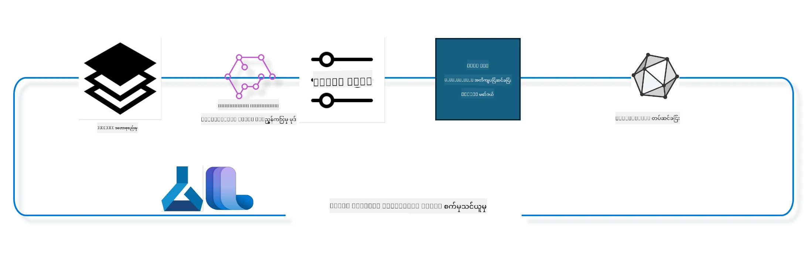

## Azure ML စနစ်မှ မှတ်ပုံတင်ထားသော chat-completion အစိတ်အပိုင်းများကို အသုံးပြု၍ မော်ဒယ်တစ်ခုကို စိတ်ကြိုက်သင်ရိုးပြင်ဆင်ခြင်း

ဤဥပမာတွင် ultrachat_200k ဒေတာစုစည်းမှုကို အသုံးပြု၍ လူ ၂ ဦးအကြား စကားပြောဆိုမှု ပြီးစီးရန် Phi-3-mini-4k-instruct မော်ဒယ်ကို စိတ်ကြိုက်သင်ရိုးပြင်ဆင်မည်။



ဥပမာတွင် Azure ML SDK နှင့် Python ကို အသုံးပြု၍ စိတ်ကြိုက်သင်ရိုးပြင်ဆင်ခြင်းကို ပြသကာ၊ ပြင်ဆင်ပြီး မော်ဒယ်ကို အွန်လိုင်း အဆုံးအထိမှတ်ရာတွင် ထည့်သွင်း၍ အချိန်နှင့်တပြေးညီ ခန့်မှန်းခြင်းလုပ်ဆောင်သည့် နည်းလမ်းကို ပြသမည်။

### သင်ရိုးဒေတာ

ultrachat_200k ဒေတာစုစည်းမှုကို အသုံးပြုမည်။ ဤသည်မှာ UltraChat ဒေတာ၏ အလွန်စစ်သားမှု ပြုလုပ်ထားသည့် ဗားရှင်းဖြစ်ပြီး Zephyr-7B-β အတွင်းမှာ အသုံးပြု၍ ဆောင်းပါး အဆက်သွယ်မှု မော်ဒယ် 7b ကို သင်ကြားရန်အသုံးပြုခဲ့သည်။

### မော်ဒယ်

Phi-3-mini-4k-instruct မော်ဒယ်ကို အသုံးပြုကာ အသုံးပြုသူအနေနှင့် chat-completion လုပ်ငန်းတာဝန်အတွက် မော်ဒယ်ကို စိတ်ကြိုက်သင်ရိုးပြင်ဆင်နည်းကို ပြသမည်။ ထူးခြားသည့် မော်ဒယ်ကတ်မှ このအနုတ်ကိုဖွင့်လှစ်ခဲ့ပါက သက်ဆိုင်ရာ မော်ဒယ်အမည်ကို အစားထိုးရန်မမေ့ပါနှင့်။

### လုပ်ငန်းတာဝန်များ

- စိတ်ကြိုက်သင်ရိုးပြင်ဆင်မည့် မော်ဒယ်တစ်ခု ရွေးချယ်ပါ။
- သင်ရိုးဒေတာကို ရွေးချယ်၍ စူးစမ်းလေ့လာပါ။
- စိတ်ကြိုက်သင်ရိုးပြင်ဆင်မှု အလုပ်ကို စီစဉ်ပါ။
- စိတ်ကြိုက်သင်ရိုးပြင်ဆင်ရေး အလုပ်ကို လုပ်ဆောင်ပါ။
- သင်ကြားမှုနှင့် သုံးသပ်မှု တိုင်းတာချက်များကို ပြန်လည်ဆန်းစစ်ပါ။
- စိတ်ကြိုက်သင်ရိုးပြင်ဆင်ထားသော မော်ဒယ်ကို မှတ်ပုံတင်ပါ။
- စိတ်ကြိုက်သင်ရိုးပြင်ဆင်ထားသော မော်ဒယ်ကို အချိန်နှင့်တပြေးညီ ခန့်မှန်းခြင်းအတွက် ထည့်သွင်းပါ။
- အရင်းအမြစ်များကို သန့်ရှင်းပါ။

## 1. ကြိုတင်ပြင်ဆင်ရန်လိုအပ်ချက်များ

- လိုအပ်သော အခြားအရာများကို ထည့်သွင်း 설치။
- AzureML ဝတ်စုံဆက်သွယ်ပါ။ အခြား အသေးစိတ်ကို SDK authentication ကို စတင်ပြုလုပ်ရန် မှတ်စုမှာလေ့လာနိုင်သည်။ အောက်တွင် <WORKSPACE_NAME>, <RESOURCE_GROUP> နှင့် <SUBSCRIPTION_ID> များကို အစားထိုးပါ။
- azureml system registry နှင့် ဆက်သွယ်ပါ။
- အရမ်းမလိုအပ်သော အုပ်ချုပ်မှုအမည် ထားပါ။
- စစ်ဆေးခြင်း သော်လည်း မရှိ ဖန်တီးပါ။

> [!NOTE]
> တစ်ခုသော GPU node သည် ကတ်များစုံပါဝင်နိုင်သည်။ ဥပမာ - Standard_NC24rs_v3 ၏ node တစ်ခုတွင် NVIDIA V100 GPU ၄ လုံးပါရှိပြီး Standard_NC12s_v3 တွင် NVIDIA V100 GPU ၂ လုံးရှိသည်။ ဒီအချက်အလက်များကို docs တွင်လေ့လာနိုင်သည်။ node အလိုက် GPU ကတ်ရေအရ gpus_per_node ဆိုသော parameter တွင် ပြင်ဆင်ထားသည်။ အဖော်ပြထားသည့် GPU compute SKU များကို ဤနေရာနှင့် ဤနေရာ မှကြည့်ရှုနိုင်သည်။

### Python кітапханаများ

အောက်တွင်ရှိသော code ကို အသုံးပြု၍ လိုအပ်သော package များကို 설치 လုပ်ပါ။ ၎င်းသည် အသစ်သော ပတ်ဝန်းကျင်တွင်သာ မဖြစ်မနေ လုပ်ဆောင်ရမည့် အဆင့်ဖြစ်သည်။

```bash
pip install azure-ai-ml
pip install azure-identity
pip install datasets==2.9.0
pip install mlflow
pip install azureml-mlflow
```

### Azure ML နှင့် အပြန်အလှန် ဆက်သွယ်ခြင်း

1. ဤ Python script သည် Azure Machine Learning (Azure ML) ဝန်ဆောင်မှုနှင့် အပြန်အလှန် အပြုအမူလုပ်ဆောင်ရန် အတွက် ဖြစ်သည်။ အောက်ပါအတိုင်းခွဲခြမ်းဖော်ပြပါသည်-

    - azure.ai.ml, azure.identity, နှင့် azure.ai.ml.entities package များမှ လိုအပ် modules များကို import လုပ်သည်။ time module ကိုလည်း import လုပ်သည်။

    - DefaultAzureCredential() ကို အသုံးပြု၍ အတည်ပြုခြင်းကို ကြိုးစားသည်၊ ၎င်းသည် Azure Cloud တွင် app များကို မြန်ဆန်စွာ ဖန်တီးရန် အလွယ်တကူ အသုံးပြုနိုင်သည့် အတည်ပြုခြင်းဖြစ်သည်။ မအောင်မြင်ပါက InteractiveBrowserCredential() သို့ ပြန်လည်ပြောင်းရွေ့သည်၊ ၎င်းသည် အသုံးပြုသူ အင်တာဖေ့့စ်တစ်ခုဖြင့် အတည်ပြုခြင်း လုပ်ဆောင်သည်။

    - from_config နည်းလမ်းဖြင့် MLClient instance တစ်ခု ဖန်တီးရန် ကြိုးစားသည်၊ ၎င်းသည် ဟုတ်ကဲ့ ဖိုင် config.json မှ ဖတ်ယူသည်။ မအောင်မြင်ပါက subscription_id, resource_group_name, workspace_name ကို ကိုယ်တိုင်ထည့်သွင်း၍ MLClient ကို ဖန်တီးသည်။

    - ထပ်မံ၍ azureml ဟူသော Azure ML မှတ်ပုံတင်ထားသော ပရိုဂရမ်အတွက် MLClient တစ်ခု ဖန်တီးသည်။ ဤနေရာသည် မော်ဒယ်များ၊ စိတ်ကြိုက်သင်ရိုး လမ်းကြောင်းများ နှင့် ပတ်ဝန်းကျင်များရှိရာနေရာဖြစ်သည်။

    - experiment_name ကို "chat_completion_Phi-3-mini-4k-instruct" အဖြစ် သတ်မှတ်သည်။

    - ယခုအချိန်ကို 秒 ရာနှုန်းဖြင့် ခြေရာခံ၍ integer အဖြစ်ပြောင်းပြီး string အဖြစ် ပြောင်း၍ တစ်ခုတည်းသော အချိန်အမှတ်တံဆိပ် ဖန်တီးသည်။ ၎င်းကို အသုံးပြု၍ နာမည်များနှင့် ဗားရှင်းများ လွယ်ကူစွာ ဖန်တီးနိုင်သည်။

    ```python
    # Azure ML နှင့် Azure Identity မှ အရေးကြီး modules များကိုသွင်းယူပါ
    from azure.ai.ml import MLClient
    from azure.identity import (
        DefaultAzureCredential,
        InteractiveBrowserCredential,
    )
    from azure.ai.ml.entities import AmlCompute
    import time  # time module ကိုသွင်းယူပါ
    
    # DefaultAzureCredential ကိုအသုံးပြု၍ authenticate ပြုလုပ်ကြည့်ပါ
    try:
        credential = DefaultAzureCredential()
        credential.get_token("https://management.azure.com/.default")
    except Exception as ex:  # DefaultAzureCredential မအောင်မြင်ပါက InteractiveBrowserCredential အသုံးပြုပါ
        credential = InteractiveBrowserCredential()
    
    # default config ဖိုင်ကို အသုံးပြု၍ MLClient instance ဖန်တီးကြည့်ပါ
    try:
        workspace_ml_client = MLClient.from_config(credential=credential)
    except:  # မအောင်မြင်ပါက အသေးစိတ်အချက်အလက်များကို လက်ဖြင့်ထည့်သွင်းပြီး MLClient instance ဖန်တီးပါ
        workspace_ml_client = MLClient(
            credential,
            subscription_id="<SUBSCRIPTION_ID>",
            resource_group_name="<RESOURCE_GROUP>",
            workspace_name="<WORKSPACE_NAME>",
        )
    
    # "azureml" ဟု အမည်ပေးထားသော Azure ML registry အတွက် MLClient instance တစ်ခု ထပ်ဖန်တီးပါ
    # ဤ registry သည် မော်ဒယ်များ၊ fine-tuning pipeline များနှင့် ပတ်ဝန်းကျင်များ သိမ်းဆည်းရာနေရာဖြစ်သည်
    registry_ml_client = MLClient(credential, registry_name="azureml")
    
    # အတွေ့အကြုံအမည်ကို သတ်မှတ်ပါ
    experiment_name = "chat_completion_Phi-3-mini-4k-instruct"
    
    # ထူးခြားသောအမည်များနှင့် ဗားရှင်းများအတွက် အသုံးပြုနိုင်သော ထူးခြားသော အချိန်မှတ်တမ်းကို ဖန်တီးပါ
    timestamp = str(int(time.time()))
    ```

## 2. စိတ်ကြိုက်သင်ရိုးပြင်ဆင်ရန် မူလမော်ဒယ် ရွေးချယ်ခြင်း

1. Phi-3-mini-4k-instruct သည် 3.8B ပါရာမီတာရှိသော ကိုယ်လက်မဟုတ် ခေတ်မီ လက်ဖက်ရည် ပြုလုပ်ထားသော ဖွင့်လှစ် မော်ဒယ်ဖြစ်သည်။ Phi-2 အတွက် အသုံးပြုသည့် ဒေတာများအပေါ် ကျောက်တော်ခံထားသည်။ ဒီမော်ဒယ်သည် Phi-3 မော်ဒယ် မိသားစုအား ခံယူထားပြီး Mini ဗားရှင်းမှာ 4K နှင့် 128K ဆိုသည်မှာ သင်ကြားနိုင်သော စကားလုံးအရှည်အတားဖြစ်သည်။ သင့်ရည်ရွယ်ချက်အတွက် ကိုယ်တိုင် စိတ်ကြိုက်သင်ရိုးပြင်ဆင်ရန် လိုအပ်သည်။ AzureML Studio ၏ မော်ဒယ် ကတ်အတွင်းတွင် chat-completion task ဖြင့် စနစ်တကျ ကြည့်ရှုနိုင်သည်။ ဤဥပမာတွင် Phi-3-mini-4k-instruct မော်ဒယ်ကို အသုံးပြုမည်။ အခြားမော်ဒယ်အတွက် ဤโนတ်ဘတ်ဖွင့်နေပါက မော်ဒယ်နာမည်နှင့် ဗားရှင်းကို သင့်လိုအပ်ချက်အတိုင်း ပြင်လဲပါ။

> [!NOTE]
> model id ကို မော်ဒယ်အသေးစိတ်စာမျက်နှာတွင် Asset ID အဖြစ် ဝင်ရောက်ကြည့်ရှုနိုင်ပြီး စိတ်ကြိုက်သင်ရိုးပြင်ဆင်မှု အလုပ်တွင် input အဖြစ် အသုံးပြုမည်ဖြစ်သည်။

2. ဤ Python script သည် Azure Machine Learning (Azure ML) ဝန်ဆောင်မှုနှင့် အပြန်အလှန် ဆက်သွယ်ခြင်းကို ပြုလုပ်သည်။ အောက်ပါအတိုင်း ခွဲခြမ်းဖော်ပြပါ-

    - model_name ကို "Phi-3-mini-4k-instruct" အဖြစ် သတ်မှတ်ထားသည်။

    - registry_ml_client ၏ models property မှ get method ကိုအသုံးပြု၍ အမည်ဖြင့် သတ်မှတ်ထားသော မော်ဒယ်၏ နောက်ဆုံးက ထုတ်လုပ်မှု ကို Azure ML မှတ်ပုံတင်ထားသော မှတ်ပုံတင်နေရာတွင် ရယူသည်။ get method သည် မော်ဒယ်နာမည်နှင့် မော်ဒယ်၏ နောက်ဆုံးဗားရှင်း ရယူရန် label ကို ပါဝင်စွာအပ်နှံသည်။

    - foundation_model ၏ name, version, id ကို ခေါ်ယူပြီး စိတ်ကြိုက်သင်ရိုးပြင်ဆင်ရန် အသုံးပြုမည့် မော်ဒယ်အချက်အလက်များကို ကွန်ဆောလ်တွင် 출력သည်။

    ```python
    # မော်ဒယ်အမည် သတ်မှတ်ပါ
    model_name = "Phi-3-mini-4k-instruct"
    
    # Azure ML မှတ်ပုံတင်နေရာမှ မော်ဒယ်၏ နောက်ဆုံးထွက်ဗားရှင်းကို ရယူပါ
    foundation_model = registry_ml_client.models.get(model_name, label="latest")
    
    # မော်ဒယ်အမည်၊ ဗားရှင်းနှင့် id ကို ပုံနှိပ်ပါ
    # ဒီအချက်အလက်တွေက အလိုအလျောက်နဲ့ ပြဿနာရှာဖွေရေးအတွက် အသုံးဝင်ပါတယ်
    print(
        "\n\nUsing model name: {0}, version: {1}, id: {2} for fine tuning".format(
            foundation_model.name, foundation_model.version, foundation_model.id
        )
    )
    ```

## 3. အလုပ်အတွက် အသုံးပြုမည့် compute ဖန်တီးခြင်း

finetune အလုပ်သည် GPU compute တွင်သာ အလုပ်လုပ်သည်။ compute ၏ အရွယ်အစားမှာ မော်ဒယ်၏ များပြားမှုနှင့် ရှုပ်ထွေးမှုအပေါ် မူတည်ပြီး ရှိန်ခံပါးမည်း ခက်ခဲနိုင်သည်။ ဤအပိုင်းတွင် အသုံးပြုသူအား တိုင်းတာသင့်သော compute ကို ရွေးချယ်ရန် လမ်းညွှန်ပေးသည်။

> [!NOTE]
> အောက်ပါ compute များသည် အများဆုံး အထူးပြုညှိနှိုင်းမှုဖြင့် လုပ်ဆောင်နိုင်သော မော်ဒယ်များ ဖြစ်သည်။ ပြင်ဆင်ချက် မည်သည့်မဆို ပြောင်းလဲပါက Cuda Out Of Memory error ဖြစ်နိုင်သည်။ ၎င်းအဖြစ်ပေါ်ပါက compute အရွယ်အစား ကြီးမားသို့ အဆင့်မြှင့်ရန် ကြိုးစားပါ။

> [!NOTE]
> compute_cluster_size ကို ရွေးချယ်စဉ်၌ သင့် resource group အတွင်းတည်ရှိသည် မှတ်သားပါ။ မရရှိနိုင်ပါက သင့် compute resource မှ တင်ပြချက်တောင်းနိုင်သည်။

### စိတ်ကြိုက်သင်ရိုးပြင်ဆင်မှုအား ထောက်ခံမှု ရှိမှုစစ်ဆေးခြင်း

1. ၎င်း Python script သည် Azure Machine Learning (Azure ML) မော်ဒယ်နှင့် အပြန်အလှန် ဆက်သွယ်နေသည်။ အောက်ပါအတိုင်း ရှင်းလင်းအကျဉ်းချုပ် ပြုလုပ်ထားသည်-

    - Python ရဲ့ syntax tree များကို ဆောင်ရွက်ပေးသည့် ast module ကို import လုပ်သည်။

    - foundation_model တွင် finetune_compute_allow_list ဟု အမည်ရှိသော tag တစ်ခု ရှိ/မရှိ စစ်ဆေးသည်။ Azure ML တွင် tag များသည် key-value အစီအစဉ်ဖြစ်ပြီး မော်ဒယ်များကို စီစစ်ခွဲခြမ်းရန် အသုံးပြုသည်။

    - finetune_compute_allow_list tag ရှိပါက ast.literal_eval ဖြင့် tag ၏ string လက်ရှိတန်ဖိုးကို Python စာရင်းတစ်ခုအဖြစ် လုံခြုံစိတ်ချစွာ ဖော်ပြသည်။ ထိုစာရင်းကို computes_allow_list သို့သိမ်းဆည်းပြီး၊ စာရင်းမှ compute များမှ ဖန်တီးရန် ဖော်ပြချက် output ထုတ်သည်။

    - finetune_compute_allow_list tag မရှိပါက computes_allow_list ကို None သတ်မှတ်ပြီး tag မပါဝင်ကြောင်း output ထုတ်သည်။

    - ၎င်း script သည် မော်ဒယ်၏ metadata တွင် အတိအကျ tag တစ်ခုအပေါ် စစ်ဆေးမှု ပြုလုပ်ပြီး အသုံးပြုသူအား သတင်းအချက်အလက်များ ပြန်လည်ပေးသည်။

    ```python
    # Python အကောက်ချပ်စာကြောင်းသင်္ချာဗေဒ၏ သစ်ပင်များကို စီမံခန့်ခွဲရန် အလုပ်လုပ်သော function များပါရှိသည့် ast module ကို ထည့်သွင်းသည်
    import ast
    
    # မော်ဒယ်၏ tag များအတွင်း 'finetune_compute_allow_list' tag ရှိမရှိ စစ်ဆေးသည်
    if "finetune_compute_allow_list" in foundation_model.tags:
        # tag ရှိနေပါက ast.literal_eval ကိုသုံး၍ tag ၏တန်ဖိုး (string) ကို ဘေးကင်းစွာ Python list သို့ ဖော်ပြချက်ပြုလုပ်သည်
        computes_allow_list = ast.literal_eval(
            foundation_model.tags["finetune_compute_allow_list"]
        )  # string ကို python list သို့ပြောင်းလဲသည်
        # compute ကို list မှ ဖန်တီးရန် ဖြစ်ကြောင်းစာတစ်ခု အ印ထားသည်
        print(f"Please create a compute from the above list - {computes_allow_list}")
    else:
        # tag မရှိပါက computes_allow_list ကို None အဖြစ် သတ်မှတ်သည်
        computes_allow_list = None
        # 'finetune_compute_allow_list' tag သည် မော်ဒယ် tag များတွင်မပါဝင်ကြောင်းစာတစ်ခု ပေါင်းတင်သည်
        print("`finetune_compute_allow_list` is not part of model tags")
    ```

### Compute Instance စစ်ဆေးခြင်း

1. ၎င်း Python script သည် Azure Machine Learning (Azure ML) ဝန်ဆောင်မှုနှင့် ချိတ်ဆက်ထားသော compute instance များကို စစ်ဆေးချက်ပေးပါသည်။ အောက်ပါအတိုင်း ခွဲခြမ်းရခြင်းဖြစ်သည်-

    - compute_cluster နာမည်ဖြင့် Azure ML workspace မှ compute instance ကို ရယူရန် ကြိုးစားသည်။ provisioning state が "failed" ဖြစ်ပါက ValueError တစ်ခု ရိုက်ထုတ်သည်။

    - computes_allow_list သည် None မဟုတ်ပါက အားလုံးသော compute အရွယ်အစားများကို စာလုံးအက္ခရာငယ်သို့ ပြောင်းလဲပြီး လက်ရှိ compute instance ၏ အရွယ်အစားသည် စာရင်းအတွင်း မပါသော တစ်ခုဖြစ်ပါက ValueError ကို တင်ပြသည်။

    - computes_allow_list သည် None ဖြစ်ကာ လက်ရှိ compute instance ၏ အရွယ်အစားသည် ခဲ့သော GPU VM size မထောက်ခံသော စာရင်း၌ ပါရှိလျှင် ValueError တင်ပြသည်။

    - workspace တွင် ရရှိနိုင်သော compute အရွယ်အစားများစာရင်းကို ရယူပြီး ထိုစာရင်းတစ်ခုချင်းစီနှင့် လက်ရှိ compute ၏ အရွယ်အစားကို နှိုင်းယှဉ်စစ်ဆေးသည်။ ကိုက်ညီသည့် compute အတွက် GPU ရှိမဟုတ်မှုပုံစံကို စစ်ဆေးကာ gpu_count_found ကို True လုပ်သည်။

    - gpu_count_found သည် True ဖြစ်ပါက compute instance တစ်ခုတွင် GPU အရေအတွက် ကို output ထုတ်သည်။ မဟုတ်ပါက ValueError ကို တင်ပြသည်။

    - စုစုပေါင်း script သည် Azure ML workspace သို့ compute instance ၏ provisioning state, အရွယ်အစား စာရင်း၊ GPU အသုံးပြုနိုင်မှု စစ်ဆေးမှုများကို ပြုလုပ် လုပ်ဆောင်သည်။

    ```python
    # ေလးစားစရာေျပာၾကားခ်က္ကို အမွတ္ျပုတင္ျပပါ
    print(e)
    # Workspace ထဲမွာ compute အရြယ္အစား မေတြ႔ပါက ValueError ျပန္လည္ထုတ္ေပးပါ
    raise ValueError(
        f"WARNING! Compute size {compute_cluster_size} not available in workspace"
    )
    
    # Azure ML workspace ထဲက compute instance ကို ရယူပါ
    compute = workspace_ml_client.compute.get(compute_cluster)
    # Compute instance ရဲ့ provisioning state အေနအထား "failed" ဆိုရင္ စစ္ဆးပါ
    if compute.provisioning_state.lower() == "failed":
        # Provisioning state "failed" ျဖစ္ရင္ ValueError ထုတ္ပါ
        raise ValueError(
            f"Provisioning failed, Compute '{compute_cluster}' is in failed state. "
            f"please try creating a different compute"
        )
    
    # computes_allow_list သည္ None မဟုတ္ဘဲ ရွိမရွိစစ္ဆးပါ
    if computes_allow_list is not None:
        # computes_allow_list အနယ္အရြယ္ အားလံုးကို lowercase သို႔ ေျပာင္းပါ
        computes_allow_list_lower_case = [x.lower() for x in computes_allow_list]
        # Compute instance ရဲ့ အရြယ္အစားသည် computes_allow_list_lower_case ထဲတြင်ရွိမရွိစစ်ဆေးပါ
        if compute.size.lower() not in computes_allow_list_lower_case:
            # Compute instance အရြယ္အစားသည် computes_allow_list_lower_case ထဲမရှိပါက ValueError ထုတ်ပါ
            raise ValueError(
                f"VM size {compute.size} is not in the allow-listed computes for finetuning"
            )
    else:
        # အထောက်မပံ့ေသာ GPU VM အရြယ္အစားများစာရင္းတစ္ခု က်င်းပပါ
        unsupported_gpu_vm_list = [
            "standard_nc6",
            "standard_nc12",
            "standard_nc24",
            "standard_nc24r",
        ]
        # Compute instance အရြယ္အစားသည် unsupported_gpu_vm_list ထဲတြင်ရွိမရှိ စစ္ဆာပါ
        if compute.size.lower() in unsupported_gpu_vm_list:
            # Compute instance အရြယ္အစား unsupported_gpu_vm_list ထဲတြင်ရှိပါက ValueError ထုတ်ပါ
            raise ValueError(
                f"VM size {compute.size} is currently not supported for finetuning"
            )
    
    # Compute instance ရဲ့ GPU အရေအတွက် ရှာဖွေတွေ့ရှိ/မတွေ့ရှိ Flag ကို စတင်သတ်မှတ်ပါ
    gpu_count_found = False
    # Workspace ထဲရှိ comput size များအားလုံး၏စာရင်းကို ရယူပါ
    workspace_compute_sku_list = workspace_ml_client.compute.list_sizes()
    available_sku_sizes = []
    # ရရှိသော comput size များစာရင်းကို တစ်ခုချင်းစီ ဖြတ်သန်းပါ
    for compute_sku in workspace_compute_sku_list:
        available_sku_sizes.append(compute_sku.name)
        # Compute size အမည်သည် compute instance အရြယ္အစားနှင့် ကိုက်ညီမည်ကို စစ်ဆေးပါ
        if compute_sku.name.lower() == compute.size.lower():
            # ကိုက်ညီပါက 해당 compute size အတွက် GPU အရေအတွက်ကို ရယူပြီး gpu_count_found ကို True သတ်မှတ်ပါ
            gpus_per_node = compute_sku.gpus
            gpu_count_found = True
    # gpu_count_found True ဖြစ်ပါက compute instance ထဲရှိ GPU အရေအတွက်ကို ပြင်ပါ
    if gpu_count_found:
        print(f"Number of GPU's in compute {compute.size}: {gpus_per_node}")
    else:
        # gpu_count_found False ဖြစ်ပါက ValueError ထုတ်ပါ
        raise ValueError(
            f"Number of GPU's in compute {compute.size} not found. Available skus are: {available_sku_sizes}."
            f"This should not happen. Please check the selected compute cluster: {compute_cluster} and try again."
        )
    ```

## 4. စိတ်ကြိုက်သင်ရိုးပြင်ဆင်ရန် Dataset ရွေးချယ်ခြင်း

1. ultrachat_200k dataset ကို အသုံးပြုမည်။ dataset သည် စပ်လျဥ်းခြားစိစစ်ပြီး Supervised fine-tuning (sft) အတွက် သင့်တော်သော splits လေးခု ပါဝင်သည်။
Generation ranking (gen) အားဖြင့် partition များအလိုက် သက်ဆိုင်ရာ နမူနာအရေအတွက်如下ဖော်ပြထားသည် -

    ```bash
    train_sft test_sft  train_gen  test_gen
    207865  23110  256032  28304
    ```

1. အောက်တွင် Fine tuning အတွက် အခြေခံ ဒေတာပြင်ဆင်မှု ချို့ယွင်းသော အပိုင်းများကို ပြသထားပါသည် -

### ဒေတာတန်းအချို့ကို ကိုင်တွယ်ကြည့်ရှုခြင်း

ဤနမူနာကို မြန်ဆန်စွာ အလုပ်လုပ်စေလို၍ train_sft, test_sft ဖိုင်များတွင် ရှယ်ယာရသည့် ၅% အထိ ဇယားထားသည်။ ထို့ကြောင့် စိတ်ကြိုက်သင်ရိုးပြင်ဆင်ထားသော မော်ဒယ်သည် တိကျမွန်ကန်မှုနည်းပါး၍ အမှန်တကယ် အသုံးပြုရန် မသင့်လျော်ပါ။
download-dataset.py ကို ultrachat_200k dataset ကို ဒေါင်းလုပ်ဆွဲရန် နှင့် finetune pipeline component သုံးနိုင်သည့် ပုံစံသို့ ပြောင်းရန် အသုံးပြုသည်။ ဒေတာ အကြီးစားဖြစ်သောကြောင့် ၎င်းတွင် dataset ၏ တစ်စိတ်တစ်ပိုင်းသာ ပါဝင်သည်။

1. အောက်တွင် run မည့် script သည် ဒေတာ၏ ၅% ကိုသာ ဒေါင်းလုပ်ဆွဲသည်။ dataset_split_pc parameter ကို သင်နှစ်သက်ရာ ရာခိုင်နှုန်းသို့ ပြောင်းလဲနိုင်သည်။

> [!NOTE]
> ဘာသာစကား မော်ဒယ်တချို့တွင် ဘာသာစကား ကုဒ် ကွဲပြားမှုများ ရှိပြီး ဒါကြောင့် dataset ၏ column အမည်များကိုလည်း ကိုက်ညီအောင် ပြင်ဆင်သင့်သည်။

1. ဒေတာ ပုံစံအား နမူနာပြရန်
chat-completion dataset သည် parquet ပုံစံဖြင့် သိမ်းဆည်းထားပြီး စီမံခန့်ခွဲ  Entry တစ်ခုစီသည် အောက်ပါ schema ဖြင့် ဖော်ပြနိုင်သည် -

    - ၎င်းသည် JSON (JavaScript Object Notation) စာရွက်ဖြစ်ပြီး ဒေတာ လွှဲပြောင်းအစားထိုးသည့် နေရာလမ်းဖြစ်သည်။ အကောင်အထည်မလုပ်သည့်ကုဒ်ဖြစ်၍ ဒေတာ သိမ်းဆည်းရန် နှင့် သယ်ယူရန် သုံးသည်။ ၎င်း၏ ဖွဲ့စည်းပုံမှာ -

    - "prompt": AI အကူအညီပေးသူအား မေးခွန်း သို့မဟုတ် တာဝန်တစ်ခုကို ဖြေဆိုခြင်း။

    - "messages": စကားပြောဆိုမှုတစ်ခုအတွင်း အသုံးပြုသူနှင့် AI အကူအညီပေးသူ အကြား ဖြစ်သော စကားများ array တစ်ခုပါဝင်သည်။ message တစ်ခုစီတွင် keys နှစ်ခု ပါရှိသည် -

    - "content": message ၏ မူလစာသား ပါဝင်သည်။

    - "role": message ပို့သူအာဏာပိုင် ရာထူး ဖြစ်ပြီး "user" သို့ "assistant" ဖြစ်နိုင်သည်။

    - "prompt_id": အဆိုပါ prompt ၏ ထူးခြားသော ID ဖြစ်သည်။

1. ဤ JSON စာရွက်၌ အသုံးပြုသူသည် သူ၏ dystopian ဇာတ်လမ်း အဓိကဇာတ်ပို့စပုန်းကို ဒီဇိုင်းဖန်တီးရန် AI အကူအညီတောင်းဆိုပါသည်။ assistant ကပြန်လည် ဖြေဆိုပြီး အသုံးပြုသူသည် အချက်အလက် ပိုမို မေးမြန်းသည်။ assistant သည် ထပ်မံ ဖြေကြားရန် သဘောတူကာ စကားပြောဆိုမှု အားလုံးကို prompt id တစ်ခုနှင့် ဆက်စပ်ထားသည်။

    ```python
    {
        // The task or question posed to an AI assistant
        "prompt": "Create a fully-developed protagonist who is challenged to survive within a dystopian society under the rule of a tyrant. ...",
        
        // An array of objects, each representing a message in a conversation between a user and an AI assistant
        "messages":[
            {
                // The content of the user's message
                "content": "Create a fully-developed protagonist who is challenged to survive within a dystopian society under the rule of a tyrant. ...",
                // The role of the entity that sent the message
                "role": "user"
            },
            {
                // The content of the assistant's message
                "content": "Name: Ava\n\n Ava was just 16 years old when the world as she knew it came crashing down. The government had collapsed, leaving behind a chaotic and lawless society. ...",
                // The role of the entity that sent the message
                "role": "assistant"
            },
            {
                // The content of the user's message
                "content": "Wow, Ava's story is so intense and inspiring! Can you provide me with more details.  ...",
                // The role of the entity that sent the message
                "role": "user"
            }, 
            {
                // The content of the assistant's message
                "content": "Certainly! ....",
                // The role of the entity that sent the message
                "role": "assistant"
            }
        ],
        
        // A unique identifier for the prompt
        "prompt_id": "d938b65dfe31f05f80eb8572964c6673eddbd68eff3db6bd234d7f1e3b86c2af"
    }
    ```

### ဒေတာ ဒေါင်းလုပ်ဆွဲခြင်း

1. ၎င်း Python script သည် download-dataset.py helper script ကို အသုံးပြု၍ dataset ကို ဒေါင်းလုပ်ဆွဲ မည်ဖြစ်ပါသည်။ အောက်ပါအတိုင်း ပိုမို ရှင်းလင်းအကျဉ်းပြုထားသည်-

    - os module ကို import လုပ်သည်၊ ၎င်းသည် ဖိုင်စနစ်နှင့် စနစ်ပတ်ဝန်းကျင်၏ လုပ်ဆောင်ချက်များကို အသုံးပြုရန် အဆင်ပြေစေသည်။

    - os.system function ဖြင့် shell မှ download-dataset.py script ကို command line argument များပါ အလုပ်လုပ်စေသည်။ argument တွင် HuggingFaceH4/ultrachat_200k dataset ကို ultrachat_200k_dataset ဖိုလ်ဒါသို့ ဒေါင်းလုပ်ဆွဲရန် နှင့် ဒေတာဖြတ်တောက်မှု ၅% သတ်မှတ်ထားသည်။ os.system သည် command ထဲမှ ထွက်ခွာမှု အခြေအနေကို ပြန်လာပြီး exit_status တွင် သိမ်းဆည်းသည်။

    - exit_status သည် 0 မဟုတ်ပါက dataset ဒေါင်းမှု အမှား ပြဿနာရှိကြောင်း Exception တစ်ခုထုတ်ပြသည်။

    - အကျဉ်းချုပ်အားဖြင့် ၎င်း script သည် helper script အသုံးပြု၍ dataset ဒေါင်းလုပ်ဆွဲပြီး အဆင်မပြေပါက error ဖြင့် ပြန်တမ်းပြသည်။

    ```python
    # op မှ အောက် operating system တွင် မူတည်သော လုပ်ဆောင်ချက်များကို အသုံးပြုရန် နည်းလမ်းကို ပံ့ပိုးပေးသည့် os module ကို ယူသွင်းပါ
    import os
    
    # os.system function ကို အသုံးပြု၍ shell တွင် download-dataset.py script ကို သတ်မှတ်ထားသော command-line အ arguments များဖြင့် မှတ်ထိုးဆောင်ရွက်ပါ
    # အဆိုပါ arguments သည် ဒေါင်းလုဒ်မည် dataset (HuggingFaceH4/ultrachat_200k), ဒေါင်းလုဒ်လုပ်ရန် ဖိုင်ထည့်မည့် directory (ultrachat_200k_dataset) နှင့် dataset ကို အပိုင်းခွဲ၏ ရာခိုင်နှုန်း (5) ကို သတ်မှတ်သည်
    # os.system function သည် ဖျော်ဖြေနိုင်သော command ၏ exit status ကို ပြန်လည်ပေးပြီး၊ ထို status ကို exit_status variable တွင် သိမ်းဆည်းထားသည်
    exit_status = os.system(
        "python ./download-dataset.py --dataset HuggingFaceH4/ultrachat_200k --download_dir ultrachat_200k_dataset --dataset_split_pc 5"
    )
    
    # exit_status သည် 0 မဟုတ်ကြောင်း စစ်ဆေးပါ
    # Unix ပုံစံ operating system များတွင် exit status 0 သည် command တစ်ခုအောင်မြင်သည်ကို ချပြသည်၊ အခြားနံပါတ်များသည် အမှားကြောင်းဖြစ်သည်
    # exit_status သည် 0 မဟုတ်ပါက dataset များ download ရန် အမှားဖြစ်ကြောင်းပြောသော Exception တစ်ခုကို ဖြုတ်ထုတ်ပါ
    if exit_status != 0:
        raise Exception("Error downloading dataset")
    ```

### ဒေတာကို DataFrame ထဲသို အားဖြည့်ခြင်း
1. ဤ Python စကရစ်စ်သည် JSON Lines ဖိုင်တစ်ခုကို pandas DataFrame အဖြစ် load လုပ်ပြီး ပထမဆုံး ၅ ကွက်ကို ပြသည်။ ၎င်း၏ လုပ်ဆောင်ချက်ကို အောက်ပါအတိုင်း ဖြောင့်တမ်းဖော်ပြထားသည်-

    - pandas ไลဘရယ်ရီကို import လုပ်သည်၊  ၎င်းသည် ဒေတာ ကို မောင်းနှင်ခြင်းနှင့် ချချက်ခြင်းအတွက် အင်အားကြီးသော ไลဘရယ်ရီဖြစ်သည်။

    - pandas ၏ ပြသမှုရွေးချယ်မှုများအတွက် အကောင့်အကြီးဆုံး ကော်လံအရှေ့ကို 0 သတ်မှတ်သည်။ ၎င်းမှာ DataFrame ကို ပုံနှိပ်ရာတွင် ကော်လံတစ်ခုချင်းစီ၏ စာသားအပြည့်အစုံကို ချုံ့ျခင်းမရှိဘဲ ပြသမည်ဖြစ်သည်။

    - pd.read_json ဖังก์ရှင်ကို အသုံးပြုပြီး ultrachat_200k_dataset ဖိုလ်ဒါအောက်မှ train_sft.jsonl ဖိုင်ကို DataFrame အဖြစ် load လုပ်သည်။ lines=True ဆိုသည်မှာ ဖိုင်သည် JSON Lines ပုံစံဖြစ်ပြီး စာကြောင်းတစ်ကြောင်းစီသည် JSON object တစ်ခုဖြစ်ကြောင်းကို ဖော်ပြသည်။

    - head method ကိုသုံးပြီး DataFrame ၏ ပထမဆုံး ၅ စာကြောင်းကို ပြသသည်။ DataFrame တွင် ၅ စာကြောင်း မပြည့်ပါက၊ အားလုံးကို ပြသမည်ဖြစ်သည်။

    - အကျဉ်းချုပ်အားဖြင့်၊ ဤ script သည် JSON Lines ဖိုင်ကို DataFrame အဖြစ် load လုပ်ပြီး ကော်လံစာသားအပြည့်အစုံဖြင့် ပထမဆုံး ၅ စာကြောင်းကို ပြသော script ဖြစ်သည်။
    
    ```python
    # data manipulation နှင့် analysis များအတွက် အင်အားကြီးသော pandas စာကြည့်တိုက်ကို import လုပ်ပါ
    import pandas as pd
    
    # pandas ပေါ်တွင် column အကျယ်အလက် ပြသမှုအတွက် အများဆုံးအကျယ်ကို 0 အဖြစ် သတ်မှတ်ပါ
    # ဒီလိုပြုလုပ်ခြင်းမှာ DataFrame ကို print လုပ်တဲ့အခါ column တစ်ခုချင်းစီ၏ အပြည့်အစုံစာသားကို ဖြတ်တောက်မှုမရှိဘဲ ပြသပေးမည်ဖြစ်သည်
    pd.set_option("display.max_colwidth", 0)
    
    # pd.read_json function ကို အသုံးပြု၍ ultrachat_200k_dataset ဖိုင်ထဲက train_sft.jsonl ကို DataFrame ထဲသို့ load လုပ်ပါ
    # lines=True ဆိုသည်မှာ ဖိုင်သည် JSON Lines ပုံစံဖြစ်ပြီး၊ တစ်ကြောင်းစီမှာ JSON object တစ်ခုကျယ်ဖြစ်ကြောင်း ဖော်ပြသည်
    df = pd.read_json("./ultrachat_200k_dataset/train_sft.jsonl", lines=True)
    
    # head method ကို သုံးပြီး DataFrame ရဲ့ ပထမ ၅ ဆောင်းပါးကို ပြသပါ
    # DataFrame မှာ ၅ ဆောင်းပိုငယ်လျှင် အားလုံးကို ပြသပါလိမ့်မည်
    df.head()
    ```

## 5. မော်ဒယ်နှင့် ဒေတာကို အချက်အလက်အဖြစ် အသုံးပြုပြီး fine tuning လုပ်ငန်းကို သယ်ယူပို့ဆောင်ပါ

chat-completion pipeline component ကို အသုံးပြုသည့် job ကို ဖန်တီးပါ။ fine tuning အတွက် ပံ့ပိုးသော parameter အားလုံးအကြောင်း ယင်းတွင် သင်ယူပါ။

### finetune parameters သတ်မှတ်ခြင်း

1. finetune parameters ကို ၂ မျိုးအုပ်စုခွဲနိုင်သည်- training parameters နှင့် optimization parameters

1. Training parameters သည် အောက်ပါ training ဆိုင်ရာ အချက်အလက်များကို သတ်မှတ်သည်-

    - အသုံးပြုမည့် optimizer, scheduler
    - finetune တိုးတက်စေရန် အသုံးပြုမည့် metric
    - training လှုပ်ရှားမှုအဆင့်များအရေအတွက်နှင့် batch အရေအတွက် စသည်တို့
    - Optimization parameters သည် GPU မှတ်ဉာဏ်ကို ထိရောက်စွာ မောင်းနှင်၍ ကွန်ပျူတာ အရင်းအမြစ်များကို ထိရောက်စွာ အသုံးပြုရန် အကူအညီဖြစ်သည်။

1. အောက်တွင် အဆိုပါ အုပ်စုတွင် ပါသည့် parameter အချို့ကို ဖော်ပြထားသည်။ optimization parameters များသည် မော်ဒယ်အလိုက် ကွဲပြားပြီး ဤ ကွဲပြားမှုများကို ကိုင်တွယ်ရန် မော်ဒယ်နှင့်အတူတစ်ခုထုတ် package ဖန်တီးထားသည်။

    - deepspeed နှင့် LoRA ကို ဖွင့်ပါ။
    - ပေါင်းစပ်တိကျမှု training ကို ဖွင့်ပါ။
    - multi-node training ကို ဖွင့်ပါ။

> [!NOTE]
> supervised finetuning မှ alignment ပျောက်ဆုံးခြင်း သို့မဟုတ် ပြင်းထန်သော မေ့လျော့မှု ဖြစ်ပေါ်စေနိုင်သည်။ ဤပြဿနာကို စစ်ဆေး၍ finetune ပြီးနောက် alignment အဆင့်ကိုပြုလုပ်ရန် တိုက်တွန်းပါသည်။

### fine tuning parameters

1. ဤ Python script သည် machine learning မော်ဒယ်တစ်ခုကို fine-tune လုပ်ရန် parameter များကို သတ်မှတ်နေသည်။ အောက်ပါအတိုင်း ဖော်ပြနိုင်သည်-

    - ပုံမှန်တည်နေရာ training parameter များကို သတ်မှတ်သည်။ ဥပမာ- training epoch အရေအတွက်၊ training နှင့် evaluation အတွက် batch size များ၊ learning rate နှင့် learning rate scheduler အမျိုးအစား။

    - ပုံမှန် optimization parameter များကို သတ်မှတ်သည်။ ဥပမာ- Layer-wise Relevance Propagation (LoRa) နှင့် DeepSpeed ကို အသုံးပြုမည့် 여부 နှင့် DeepSpeed stage။

    - training နှင့် optimization parameters များကို finetune_parameters ဟုခေါ်သော dictionary တစ်ခုအဖြစ် ပေါင်းစပ်သည်။

    - foundation_model ၌ မော်ဒယ်သီးသန့် ပုံမှန် parameter များ ရှိပါက ထို parameter များကို print လုပ်၍ ကြေညာချက်ပြုလုပ်ပြီး finetune_parameters ကို မော်ဒယ် အသီးသန့် defaults များဖြင့် update လုပ်သည်။ ast.literal_eval ကိုအသုံးပြုပြီး string အနေဖြင့် ရှိသော မော်ဒယ်များသီးသန့် default parameter များကို Python dictionary သို့ ပြောင်းလဲသည်။

    - run အတွက် အသုံးပြုမည့် နောက်ဆုံး fine-tuning parameter များကို print ပြသည်။

    - အကျဉ်းချုပ် အနေနှင့် ဤ script သည် machine learning မော်ဒယ်ကို fine-tune လုပ်ရန် parameter များကို သတ်မှတ်ကာ မော်ဒယ်အလိုက် defaults များကို အစားထိုးနိုင်ခြင်းဖြင့် ပြသနေသည်။

    ```python
    # သင်ကြားမှုအချိန်ကာလ၊ သင်ကြားမှုနှင့်သုံးသပ်မှုအတွက် batch အရွယ်အစားများ၊ သင်ယူနှုန်းနှင့် သင်ယူနှုန်းက္တိတရီ scheduler အမျိုးအစား စသည့် ပုံမှန်သင်ကြားမှု ပါရာမီတာများကို တပ်ဆင်ပါ
    training_parameters = dict(
        num_train_epochs=3,
        per_device_train_batch_size=1,
        per_device_eval_batch_size=1,
        learning_rate=5e-6,
        lr_scheduler_type="cosine",
    )
    
    # Layer-wise Relevance Propagation (LoRa) နှင့် DeepSpeed ကိုအသုံးပြုမလား၊ DeepSpeed အဆင့် စသည့် ပုံမှန် optimization ပါရာမီတာများကို တပ်ဆင်ပါ
    optimization_parameters = dict(
        apply_lora="true",
        apply_deepspeed="true",
        deepspeed_stage=2,
    )
    
    # သင်ကြားမှုနှင့် optimization ပါရာမီတာများကို finetune_parameters ဟုခေါ်သော တစ်ခုသော dictionary ထဲတွင် ပေါင်းစပ်ပါ
    finetune_parameters = {**training_parameters, **optimization_parameters}
    
    # foundation_model တွင် မော်ဒယ်အထူး ပုံမှန်ပါရာမီတာများ ရှိ/မရှိကို စစ်ဆေးပါ
    # ရှိပါက သတိပေးစာ တစ်စောင် ပုံနှိပ်ပြီး မော်ဒယ်အထူး ပုံမှန်များဖြင့် finetune_parameters dictionary ကို ပြင်ဆင်ပါ
    # ast.literal_eval function ကို မော်ဒယ်အထူး ပုံမှန်များကို string မှ Python dictionary သို့ ပြောင်းရန် အသုံးပြုသည်
    if "model_specific_defaults" in foundation_model.tags:
        print("Warning! Model specific defaults exist. The defaults could be overridden.")
        finetune_parameters.update(
            ast.literal_eval(  # string ကို python dict သို့ ပြောင်းပါ
                foundation_model.tags["model_specific_defaults"]
            )
        )
    
    # ပြီးဆုံးသည့် fine-tuning ပါရာမီတာများကို run အတွက် အသုံးပြုမည့်အတိုင်း ပုံနှိပ်ပါ
    print(
        f"The following finetune parameters are going to be set for the run: {finetune_parameters}"
    )
    ```

### training pipeline

1. ဤ Python script သည် machine learning training pipeline အတွက် display name ထုတ်လုပ်ရန် function ကို သတ်မှတ်ခြင်းနှင့် function ကိုခေါ်ပြီး display name ကို generate ထုတ်ပြသခြင်းဖြစ်သည်။ အောက်ပါအတိုင်း ဖြောင့်တမ်းပြနိုင်သည်-

1. get_pipeline_display_name function ကို သတ်မှတ်သည်။ ဤ function သည္ training pipeline နှင့်ဆိုင်သော parameter များပေါ် မှီ၍ display name တစ်ခု ထုတ်ပေးသည်။

1. function ၏ အတွင်းတွင် per-device batch size, gradient accumulation steps အရေအတွက်၊ node အလိုက် GPU အရေအတွက်နှင့် fine-tuning အတွက် အသုံးပြုမည့် node အရေအတွက် တို့ကို ညွှန်း၍ စုပေါင်း batch size မှန်းဆသည်။

1. learning rate scheduler အမျိုးအစား၊ DeepSpeed အသုံးပြုမည့် 여부၊ DeepSpeed stage၊ Layer-wise Relevance Propagation (LoRa) အသုံးပြုမည့် 여부၊ မော်ဒယ် checkpoint များ လက်ခံသည့် အရေအတွက် ကန့်သတ်ချက်၊ စာကြောင်းအမြင့် အကန့်အသတ် စသည်တို့ကို ရယူသည်။

1. ၎င်းတို့ parameter အားလုံးကို ဆီးပွားအနယ်နှင့် ခွဲထားသော စာကြောင်းတစ်ခုအဖြစ် တည်ဆောက်သည်။ DeepSpeed သို့မဟုတ် LoRa အသုံးပြုပါက၊ စာကြောင်းတွင် "ds" နှင့် DeepSpeed stage သို့မဟုတ် "lora" ပါသည်။ မဟုတ်ပါက "nods" သို့မဟုတ် "nolora" ပါရှိသည်။

1. function သည် training pipeline ၏ display name အဖြစ် အသုံးပြုသည့် စာကြောင်းကို return ပြန်ပေးသည်။

1. function သတ်မှတ်ပြီးနောက် သို့ function ကိုခေါ်၍ display name ကို ထုတ်ယူကာ print ပြသည်။

1. အကျဉ်းချုပ်အားဖြင့်၊ ဤ script သည် machine learning training pipeline အတွက် parameter များအပေါ် မူတည်၍ display name ထုတ်လုပ်ကာ ထို display name ကို print ပြနေသည်။

    ```python
    # လေ့လာရေးလိုင်းအတွက် ပြသမည့်အမည်ကို ဖန်တီးရန် function ကို သတ်မှတ်ပါ
    def get_pipeline_display_name():
        # တစ်စက်ပေါ် batch အရွယ်အစား၊ gradient စုဆောင်းခြင်းခြေလှမ်းများ အရေအတွက်၊ တစ် node လျှင် GPU အရေအတွက်၊ နှင့် fine-tuning အတွက် အသုံးပြုသော node အရေအတွက်တို့ကို ဆက်မြှောက်ကာ စုစုပေါင်း batch အရွယ်အစားကို တွက်ချက်ပါ
        batch_size = (
            int(finetune_parameters.get("per_device_train_batch_size", 1))
            * int(finetune_parameters.get("gradient_accumulation_steps", 1))
            * int(gpus_per_node)
            * int(finetune_parameters.get("num_nodes_finetune", 1))
        )
        # သင်ယူမှုပြန်လည်စီမံခန့်ခွဲမှု အမျိုးအစားကို ယူပါ
        scheduler = finetune_parameters.get("lr_scheduler_type", "linear")
        # DeepSpeed ကို အသုံးပြုမည်ကို ယူပါ
        deepspeed = finetune_parameters.get("apply_deepspeed", "false")
        # DeepSpeed အဆင့်ကို ယူပါ
        ds_stage = finetune_parameters.get("deepspeed_stage", "2")
        # DeepSpeed ကို အသုံးပြုပါက display name တွင် "ds" နှင့် DeepSpeed အဆင့်ကို ထည့်ပါ၊ မဟုတ်ပါက "nods" ကို ထည့်ပါ
        if deepspeed == "true":
            ds_string = f"ds{ds_stage}"
        else:
            ds_string = "nods"
        # Layer-wise Relevance Propagation (LoRa) ကို အသုံးပြုမည်ကို ယူပါ
        lora = finetune_parameters.get("apply_lora", "false")
        # LoRa ကို အသုံးပြုပါက display name တွင် "lora" ကို ထည့်ပါ၊ မဟုတ်ပါက "nolora" ကို ထည့်ပါ
        if lora == "true":
            lora_string = "lora"
        else:
            lora_string = "nolora"
        # သိမ်းဆည်းထားမည့် မော်ဒယ် checkpoint အရေအတွက်အကန့်အသတ်ကို ယူပါ
        save_limit = finetune_parameters.get("save_total_limit", -1)
        # အများဆုံး ပြောင်းလဲမှု အရှည်လျားဆုံးကို ယူပါ
        seq_len = finetune_parameters.get("max_seq_length", -1)
        # ဤ parameter အားလုံးကို ဟိုင်ဖန်းဖြင့် ခွဲပြီး display name ကို ဖန်တီးပါ
        return (
            model_name
            + "-"
            + "ultrachat"
            + "-"
            + f"bs{batch_size}"
            + "-"
            + f"{scheduler}"
            + "-"
            + ds_string
            + "-"
            + lora_string
            + f"-save_limit{save_limit}"
            + f"-seqlen{seq_len}"
        )
    
    # display name ကို ဖန်တီးရန် function ကို ခေါ်ပါ
    pipeline_display_name = get_pipeline_display_name()
    # display name ကို ပရင့်ထုတ်ပါ
    print(f"Display name used for the run: {pipeline_display_name}")
    ```

### pipeline ကို ပြင်ဆင်ခြင်း

ဤ Python script သည် Azure Machine Learning SDK ကို အသုံးပြုပြီး machine learning pipeline ကို သတ်မှတ်ကာ ပြင်ဆင်နေသည်။ လုပ်ဆောင်ချက်များကို အောက်ပါအတိုင်း ဖော်ပြထားသည်-

1. Azure AI ML SDK မှ လိုအပ်သော module များကို import လုပ်သည်။

1. registry မှ "chat_completion_pipeline" ဟူသော pipeline component ကို ရယူသည်။

1. `@pipeline` decorator နှင့် `create_pipeline` function ကို အသုံးပြု၍ pipeline job ကို သတ်မှတ်သည်။ pipeline ၏ name ကို `pipeline_display_name` ဟု သတ်မှတ်ထားသည်။

1. `create_pipeline` function ၏ အတွင်းတွင် ရယူထားသော pipeline component ကို မော်ဒယ်လမ်းကြောင်း၊ အချက်အလက် cluster များ၊ training နှင့် စမ်းသပ် dataset စိတ်ခြင်း၊ fine-tuning အတွက် အသုံးပြုမည့် GPU အရေအတွက် နှင့် အခြား fine-tuning parameter များပါဝင်သော parameter များဖြင့် initialize လုပ်သည်။

1. fine-tuning job ၏ output ကို pipeline job ၏ output သို့ မှာပို့သည်။ ၎င်းသည် fine-tuned မော်ဒယ်ကို လွယ်ကူစွာ register လုပ်နိုင်ရန်ဖြစ်ပြီး ဒီလိုလုပ်ခြင်းသည် မော်ဒယ်ကို online သို့မဟုတ် batch endpoint တွင် အသုံးပြုရန် လိုအပ်သည်။

1. `create_pipeline` function ကို ခေါ်၍ pipeline instance တစ်ခုဖန်တီးသည်။

1. pipeline ၏ `force_rerun` ဆက်တင်ကို `True` သတ်မှတ်သည်။ ၎င်းသည် ယခင်လုပ်ငန်းများ၏ cache ရလဒ်များကို မသုံးကြောင်း ဆိုလိုသည်။

1. pipeline ၏ `continue_on_step_failure` ဆက်တင်ကို `False` သတ်မှတ်သည်။ ၎င်းသည် လုပ်ငန်း အဆင့်တစ်ခုခု မအောင်မြင်ပါက pipeline ကို ရပ်နားမည်ဖြစ်သည်။

1. အကျဉ်းချုပ် အနေနှင့် ဤ script သည် Azure Machine Learning SDK ဖြင့် chat completion တာဝန်အတွက် machine learning pipeline ကို သတ်မှတ်ကာ ပြင်ဆင်ထားသည်။

    ```python
    # Azure AI ML SDK မှ လိုအပ်သော module များကို သွင်းယူသည်
    from azure.ai.ml.dsl import pipeline
    from azure.ai.ml import Input
    
    # "chat_completion_pipeline" ဟု အမည်ပေးထားသော pipeline component ကို registry မှ တွေ့ယူသည်
    pipeline_component_func = registry_ml_client.components.get(
        name="chat_completion_pipeline", label="latest"
    )
    
    # @pipeline decorator နှင့် create_pipeline ဖန်ဖွဲ့မှု function ကို အသုံးပြု၍ pipeline job ကို သတ်မှတ်သည်
    # pipeline ၏အမည်ကို pipeline_display_name အဖြစ် သတ်မှတ်သည်
    @pipeline(name=pipeline_display_name)
    def create_pipeline():
        # ရယူထားသော pipeline component ကို parameter များစွာဖြင့် စတင်ပြင်ဆင်သည်
        # ၎င်းတွင် model လမ်းကြောင်း၊ အဆင့်အတန်းအလိုက် compute cluster များ၊ training နှင့် testing အတွက် dataset ဖြန့်ခြားမှုများ၊ fine-tuning အတွက် အသုံးပြုမည့် GPU အရေအတွက်နှင့် အခြား fine-tuning parameter များပါဝင်သည်
        chat_completion_pipeline = pipeline_component_func(
            mlflow_model_path=foundation_model.id,
            compute_model_import=compute_cluster,
            compute_preprocess=compute_cluster,
            compute_finetune=compute_cluster,
            compute_model_evaluation=compute_cluster,
            # dataset ဖြန့်ခြားမှုများကို parameter များနှင့် တွဲဖက်သည်
            train_file_path=Input(
                type="uri_file", path="./ultrachat_200k_dataset/train_sft.jsonl"
            ),
            test_file_path=Input(
                type="uri_file", path="./ultrachat_200k_dataset/test_sft.jsonl"
            ),
            # သင်ကြားမှု ဆက်တင်များ
            number_of_gpu_to_use_finetuning=gpus_per_node,  # compute တွင် ရရှိနိုင်သော GPU အရေအတွက်အတိုင်း သတ်မှတ်သည်
            **finetune_parameters
        )
        return {
            # fine tuning job ၏ output ကို pipeline job ၏ output နှင့် တွဲဖက်သည်
            # ဒီလုပ်ဆောင်ချက်သည် fine tuned model ကို လွယ်ကူစွာ မှတ်ပုံတင်နိုင်ရန် ဖြစ်သည်
            # model ကို အွန်လိုင်း သို့မဟုတ် batch endpoint သို့ ဖြန့်ချိရန် မှတ်ပုံတင်ခြင်း လိုအပ်သည်
            "trained_model": chat_completion_pipeline.outputs.mlflow_model_folder
        }
    
    # create_pipeline function ကိုခေါ်၍ pipeline တစ်ခုကို ဖန်တီးသည်
    pipeline_object = create_pipeline()
    
    # ယခင် jobs များမှ cached အဖြေများကို မသုံးရန်
    pipeline_object.settings.force_rerun = True
    
    # အဆင့်မအောင်မြင်ပါက continue on step failure ကို False သတ်မှတ်သည်
    # ၎င်းသည် pipeline တစ်ခု၏ အဆင့်တစ်ဆင့်မှ အောင်မြင်မှုမရှိပါက pipeline ကို ရပ်စဲမည် ဆိုလိုသည်
    pipeline_object.settings.continue_on_step_failure = False
    ```

### Job ကို တင်သွင်းခြင်း

1. ဤ Python script သည် machine learning pipeline job ကို Azure Machine Learning workspace သို့ တင်သွင်းကာ job အောင်မြင်ရန် စောင့်ဆိုင်းသည်။ လုပ်ဆောင်ချက်များကို အောက်ပါအတိုင်း ဖော်ပြသည်-

    - workspace_ml_client ၏ jobs object ၏ create_or_update method ကိုခေါ်၍ pipeline job ကို တင်သွင်းသည်။ ပြုလုပ်မည့် pipeline ကို pipeline_object ဖြင့် သတ်မှတ်ကာ၊ ပြုလုပ်မည့် experiment ကို experiment_name ဖြင့် သတ်မှတ်သည်။

    - ၎င်းပြီးနောက် workspace_ml_client ၏ jobs object ၏ stream method ကို ခေါ်၍ pipeline job ပြီးဆုံးရန် စောင့်ဆိုင်းသည်။ စောင့်ဆိုရမည့် job ကို pipeline_job ၏ name attribute ဖြင့် သတ်မှတ်သည်။

    - အကျဉ်းချုပ်အားဖြင့်၊ ဤ script သည် machine learning pipeline job ကို Azure Machine Learning workspace သို့ တင်သွင်းကာ အလုပ်လည်ပြီးဆုံးသည်အထိ စောင့်ဆိုင်းသည်။

    ```python
    # Azure Machine Learning အလုပ်ပြားတွင် pipeline အလုပ်ကို တင်သွင်းပါ
    # ပြေးရန် pipeline ကို pipeline_object ဖြင့်သတ်မှတ်ထားသည်
    # အလုပ်သည် experiment_name ဖြင့်သတ်မှတ်ထားသော စမ်းသပ်မှုအောက်တွင် ပြေးဆွဲသည်
    pipeline_job = workspace_ml_client.jobs.create_or_update(
        pipeline_object, experiment_name=experiment_name
    )
    
    # pipeline အလုပ် ပြီးဆုံးရန် စောင့်ဆိုင်းပါ
    # စောင့်ဆိုင်းရန် အလုပ်ကို pipeline_job objects ၏ name အက္ခရာဖြင့် သတ်မှတ်ထားသည်
    workspace_ml_client.jobs.stream(pipeline_job.name)
    ```

## 6. fine tuned မော်ဒယ်ကို workspace တွင် မှတ်ပုံတင်ခြင်း

fine tuning job ၏ output မှ မော်ဒယ်ကို မှတ်ပုံတင်မည်ဖြစ်သည်။ ဤကဲ့သို့လုပ်ခြင်းသည် fine tuned မော်ဒယ်နှင့် fine tuning job အကြား lineage ကို ပြန်ကြည့်နိုင်စေသည်။ fine tuning job သည်လည်း foundation model၊ data နှင့် training code နှင့် lineage ကို ဆက်လက်ထိန်းသိမ်းသည်။

### ML မော်ဒယ်ကို မှတ်ပုံတင်ခြင်း

1. ဤ Python script သည် Azure Machine Learning pipeline တွင် လေ့ကျင့်ပြီးသော machine learning မော်ဒယ်တစ်ခုကို မှတ်ပုံတင်နေသည်။ လုပ်ဆောင်ချက်ကို အောက်ပါအတိုင်း သရုပ်ပြထားပါသည်-

    - Azure AI ML SDK မှလိုအပ်သည့် module များကို import လုပ်သည်။

    - workspace_ml_client ၏ jobs object ၏ get method ကိုခေါ်၍ pipeline job မှ trained_model output ရရှိပါက ထုတ်ယူသည်။

    - pipeline job ၏ name နှင့် output အမည် ("trained_model") ကို အသုံးပြု၍ trained model ၏ လမ်းကြောင်းကို ဖန်တီးသည်။

    - fine-tuned မော်ဒယ်အတွက် အမည်သတ်မှတ်ရာတွင် မူရင်းမော်ဒယ်အမည်၏ "/" အား "-" ဖြင့် တပ်ဆင်ကာ "-ultrachat-200k" ကို ပေါင်းထည့်သည်။

    - Model object တစ်ခုကို ဖန်တီး၍ မော်ဒယ်လမ်းကြောင်း၊ မော်ဒယ်အမျိုးအစား (MLflow model), မော်ဒယ်အမည်၊ ဗားရှင်းနှင့် ဖော်ပြချက်တို့ ပါဝင်ရန် ပြင်ဆင်သည်။

    - workspace_ml_client ၏ models object ၏ create_or_update method ကို ခေါ်၍ 해당 Model object ဖြင့် မော်ဒယ်ကို မှတ်ပုံတင်သည်။

    - မှတ်ပုံတင်ပြီးသော မော်ဒယ်ကို print ပြသည်။

1. အကျဉ်းချုပ် အနေနှင့်၊ ဤ script သည် Azure Machine Learning pipeline ၌ လေ့ကျင့်ခဲ့သော machine learning မော်ဒယ်ကို မှတ်ပုံတင်နေသည်။
    
    ```python
    # Azure AI ML SDK မှ လိုအပ်သော မော်ဂျူးများကို တင်သွင်းပါ
    from azure.ai.ml.entities import Model
    from azure.ai.ml.constants import AssetTypes
    
    # pipeline job မှ `trained_model` output ရရှိနိုင်မရှိ စစ်ဆေးပါ
    print("pipeline job outputs: ", workspace_ml_client.jobs.get(pipeline_job.name).outputs)
    
    # pipeline job အမည်နှင့် output အမည် ("trained_model") သုံးပြီး စာကြောင်းတစ်ကြောင်း ဖော်မြူလာဖြင့် သင်ကြားပြီးမော်ဒယ်အတွက် လမ်းကြောင်း တည်ဆောက်ပါ
    model_path_from_job = "azureml://jobs/{0}/outputs/{1}".format(
        pipeline_job.name, "trained_model"
    )
    
    # မူရင်းမော်ဒယ်အမည်ကို "-ultrachat-200k" ဖြင့် ပေါင်းထည့်ပြီး စသည်ဖြင့် "/" ကို "-" ဖြင့် ပြောင်းလဲကာ fine-tuned မော်ဒယ်အတွက် အမည် သတ်မှတ်ပါ
    finetuned_model_name = model_name + "-ultrachat-200k"
    finetuned_model_name = finetuned_model_name.replace("/", "-")
    
    print("path to register model: ", model_path_from_job)
    
    # မော်ဒယ်ကို မှတ်ပုံတင်ရန် သတ်မှတ်ချက်အမျိုးမျိုးဖြင့် Model object တစ်ခု ဖန်တီး၍ မှတ်ဆင်ရန် ပြင်ဆင်ပါ
    # ၎င်းတွင် မော်ဒယ်လမ်းကြောင်း၊ မော်ဒယ်အမျိုးအစား (MLflow မော်ဒယ်), မော်ဒယ်အမည်နှင့် ဗားရှင်း၊ မော်ဒယ်၏ ဖော်ပြချက် အပါအဝင် ပါဝင်သည်
    prepare_to_register_model = Model(
        path=model_path_from_job,
        type=AssetTypes.MLFLOW_MODEL,
        name=finetuned_model_name,
        version=timestamp,  # ဗားရှင်း Conflict ဖြစ်ခြင်း အားကာကွယ်ရန် အချိန်မှတ်တမ်းကို ဗားရှင်းအဖြစ် အသုံးပြုပါ
        description=model_name + " fine tuned model for ultrachat 200k chat-completion",
    )
    
    print("prepare to register model: \n", prepare_to_register_model)
    
    # workspace_ml_client တွင် models object ၏ create_or_update method ကို Model object ကို အဖြစ်ဖြင့် ခေါ်ယူကာ မော်ဒယ်ကို မှတ်ပုံတင်ပါ
    registered_model = workspace_ml_client.models.create_or_update(
        prepare_to_register_model
    )
    
    # မှတ်ပုံတင်ထားသော မော်ဒယ်ကို ပုံနှိပ်ပြပါ
    print("registered model: \n", registered_model)
    ```

## 7. fine tuned မော်ဒယ်ကို online endpoint တွင် ထုတ်လုပ်ခြင်း

Online endpoint များသည် မော်ဒယ်အသုံးပြုလိုသူ application များနှင့် ပေါင်းစည်းနိုင်သည့် တာရှည်ခံ REST API ကို ပေးသည်။

### Endpoint ထိန်းချုပ်ခြင်း

1. ဤ Python script သည် Azure Machine Learning တွင် မှတ်ပုံတင်ထားသော မော်ဒယ်အတွက် managed online endpoint တစ်ခု ဖန်တီးနေသည်။ လုပ်ဆောင်ချက်များကို အောက်ပါအတိုင်း ဖော်ပြထားသည်-

    - Azure AI ML SDK မှ လိုအပ်သော module များကို import လုပ်သည်။

    - "ultrachat-completion-" စာကြောင်းနှင့် timestamp ကို ပေါင်း၍ unique online endpoint အမည် သတ်မှတ်သည်။

    - ManagedOnlineEndpoint object တစ်ခု ဖန်တီးရန် ပြင်ဆင်သည်။ ၎င်းတွင် endpoint အမည်၊ ဖော်ပြချက် နှင့် authentication mode ("key") ပါဝင်သည်။

    - workspace_ml_client ၌ begin_create_or_update method ကို ခေါ်၍ ManagedOnlineEndpoint object ဖြင့် endpoint ကို ဖန်တီးပြီး wait method ဖြင့် ဖန်တီးမှု ပြီးဆုံးသည်အထိ စောင့်ဆိုင်းသည်။

1. အကျဉ်းချုပ်အနေဖြင့်၊ ဤ script သည် Azure Machine Learning တွင် မှတ်ပုံတင်ထားသော မော်ဒယ်အတွက် managed online endpoint တစ်ခု ဖန်တီးနေသည်။

    ```python
    # Azure AI ML SDK မှ လိုအပ်သော မော်ဂျူးများကို သွင်းကုန်သောအခါ
    from azure.ai.ml.entities import (
        ManagedOnlineEndpoint,
        ManagedOnlineDeployment,
        ProbeSettings,
        OnlineRequestSettings,
    )
    
    # "ultrachat-completion-" စာကြောင်းနှင့် အချိန်တံဆိပ်တစ်ခု ပေါင်းထည့်ကာ တစ်ခုတည်းသော အွန်လိုင်းအဆုံးအအမည်ကို သတ်မှတ်ပါ
    online_endpoint_name = "ultrachat-completion-" + timestamp
    
    # အွန်လိုင်းအဆုံးအတွက် ManagedOnlineEndpoint အရာဝတ္ထုကို အမျိုးမျိုးသော ပါရာမီတာများနှင့် တည်ထောင်ရန် ပြင်ဆင်ပါ
    # ၎င်းသည် အဆုံးအမည်၊ အဆုံး၏ဖော်ပြချက်နှင့် အတည်ပြုမှုနည်းလမ်း ("key") အပါအဝင်ဖြစ်ပါသည်
    endpoint = ManagedOnlineEndpoint(
        name=online_endpoint_name,
        description="Online endpoint for "
        + registered_model.name
        + ", fine tuned model for ultrachat-200k-chat-completion",
        auth_mode="key",
    )
    
    # workspace_ml_client ၏ begin_create_or_update နည်းလမ်းကို ManagedOnlineEndpoint အရာဝတ္ထုနှင့် ခေါ်၍ အွန်လိုင်းအဆုံးကို ဖန်တီးပါ
    # ပြီးလျှင် wait နည်းလမ်းကိုခေါ်ပြီး ဖန်တီးမှုလုပ်ငန်းစဉ် ပြီးဆုံးရန် စောင့်ပါ
    workspace_ml_client.begin_create_or_update(endpoint).wait()
    ```

> [!NOTE]
> deployment အတွက် ပံ့ပိုးထားသော SKU များစာရင်းကို ဒီနေရာတွင် ရနိုင်သည် - [Managed online endpoints SKU list](https://learn.microsoft.com/azure/machine-learning/reference-managed-online-endpoints-vm-sku-list)

### ML မော်ဒယ် ထုတ်လုပ်ခြင်း

1. ဤ Python script သည် Azure Machine Learning တွင် မှတ်ပုံတင်ထားသော machine learning မော်ဒယ်ကို managed online endpoint သို့ ထုတ်လုပ်နေသည်။ အောက်ပါအတိုင်း လုပ်ဆောင်ချက်များရှိပါသည်-

    - Python abstract syntax grammar tree များကို ကောက်နှုတ်ရန် ast module ကို import လုပ်သည်။

    - deployment အတွက် instance type ကို "Standard_NC6s_v3" ဟု သတ်မှတ်သည်။

    - foundation model ၌ inference_compute_allow_list ကို မှတ်ထားမှန်း စစ်ဆေးသည်။ ရှိပါက string မှ Python list သို့ ပြောင်း၍ inference_computes_allow_list သို့ သတ်မှတ်သည်။ မရှိပါက None သတ်မှတ်သည်။

    - ဖော်ပြထားသော instance type သည် allow list တွင် ရှိခြင်း မရှိခြင်းကို စစ်ဆေးပြီး မရှိပါက allow list ထဲမှ instance type တစ်ခုရွေးရန် အသိပေးစာသား ပုံနှိပ်သည်။

    - ManagedOnlineDeployment object တစ်ခု ဖန်တီးရန် ပြင်ဆင်သည်။ ၎င်းတွင် deployment အမည်၊ endpoint အမည်၊ model ID၊ instance type နှင့် အရေအတွက်၊ liveness probe နှင့် request ပြဿနာများ ဆက်တင်များ ပါဝင်သည်။

    - workspace_ml_client ၏ begin_create_or_update method ကို ခေါ်၍ ManagedOnlineDeployment object ဖြင့် deployment ကို ဖန်တီးကာ wait method ဖြင့် ဖန်တီးမှု ပြီးဆုံးသည်အထိ စောင့်ဆိုင်းသည်။

    - endpoint traffic ကို "demo" deployment သို့ ၁၀၀% မောင်းနှင်ရန် သတ်မှတ်သည်။

    - workspace_ml_client ၏ begin_create_or_update method ကို အသုံးပြု၍ endpoint object ကို update သာကာ update ပြီးဆုံးသည်အထိ result method ဖြင့် စောင့်ဆိုင်းသည်။

1. အကျဉ်းချုပ် အနေဖြင့်၊ ဤ script သည် Azure Machine Learning ၌ မှတ်ပုံတင်ထားသော machine learning မော်ဒယ်ကို managed online endpoint သို့ ထုတ်လုပ်နေသည်။

    ```python
    # Python မှာ အတု syntax grammar သစ်ကောက် ပုံစံများကို 처리လုပ်ရန် function များ ပေးသော ast module ကို import လုပ်သည်
    import ast
    
    # deployment အတွက် instance အမျိုးအစားကို သတ်မှတ်သည်
    instance_type = "Standard_NC6s_v3"
    
    # foundation model တွင် `inference_compute_allow_list` tag ရှိမရှိ စစ်ဆေးသည်
    if "inference_compute_allow_list" in foundation_model.tags:
        # ရှိလျှင် tag အဖွဲ့တန်ဖိုးအား string မှ Python list သို့ပြောင်းပြီး `inference_computes_allow_list` သို့ သတ်မှတ်သည်
        inference_computes_allow_list = ast.literal_eval(
            foundation_model.tags["inference_compute_allow_list"]
        )
        print(f"Please create a compute from the above list - {computes_allow_list}")
    else:
        # မရှိလျှင် `inference_computes_allow_list` ကို `None` အဖြစ် သတ်မှတ်သည်
        inference_computes_allow_list = None
        print("`inference_compute_allow_list` is not part of model tags")
    
    # သတ်မှတ်ထားသော instance အမျိုးအစားသည် allow list တွင်ပါဝင်မရှိ စစ်ဆေးသည်
    if (
        inference_computes_allow_list is not None
        and instance_type not in inference_computes_allow_list
    ):
        print(
            f"`instance_type` is not in the allow listed compute. Please select a value from {inference_computes_allow_list}"
        )
    
    # တို့ parameter အမျိုးမျိုးဖြင့် `ManagedOnlineDeployment` object ကို ဖန်တီးပြီး deployment ဖန်တီးရန် ပြင်ဆင်သည်
    demo_deployment = ManagedOnlineDeployment(
        name="demo",
        endpoint_name=online_endpoint_name,
        model=registered_model.id,
        instance_type=instance_type,
        instance_count=1,
        liveness_probe=ProbeSettings(initial_delay=600),
        request_settings=OnlineRequestSettings(request_timeout_ms=90000),
    )
    
    # `ManagedOnlineDeployment` object ကို argument အဖြစ် သုံးကာ `workspace_ml_client` ၏ `begin_create_or_update` method ကို ခေါ်၍ deployment ကို ဖန်တီးသည်
    # ထို့နောက် `wait` method ကို ခေါ်၍ ဖန်တီးမှု လုပ်ဆောင်မှု ပြီးမြောက်ရန် စောင့်ဆိုင်းသည်
    workspace_ml_client.online_deployments.begin_create_or_update(demo_deployment).wait()
    
    # endpoint ၏ လမ်းကြောင်းကိုသတ်မှတ်ပြီး မြန်ဆန်မှု ၁၀၀% ကို "demo" deployment ဆီ သွားရောက်ရန် သတ်မှတ်သည်
    endpoint.traffic = {"demo": 100}
    
    # `endpoint` object ကို argument အဖြစ်သုံးပြီး `workspace_ml_client` ၏ `begin_create_or_update` method ကို ခေါ်၍ endpoint ကို update ပြုလုပ်သည်
    # ထို့နောက် `result` method ကို ခေါ်၍ update လုပ်မှု ပြီးမြောက်သည်ကို စောင့်ဆိုင်းသည်
    workspace_ml_client.begin_create_or_update(endpoint).result()
    ```

## 8. နမူနာဒေတာဖြင့် endpoint ကို စမ်းသပ်ခြင်း

test မူကြမ်းဒေတာမှ နမူနာအချက်အလက်တစ်ချို့ကို ရယူကာ online endpoint သို့ inference အတွက် တင်သွင်းမည်။ ထိုနောက် စစ်မှန်သော label များနှင့် ခန့်မှန်းထားသော label များကို ပြသမည်။

### ရလဒ်များ ဖတ်ရှုခြင်း

1. ဤ Python script သည် JSON Lines ဖိုင်ကို pandas DataFrame အဖြစ် ဖတ်ကာ random sample ရယူပြီး index ကို ပြန်စီထားသည်။ လုပ်ဆောင်ချက်များကို အောက်ပါအတိုင်း ဖော်ပြသည်-

    - ./ultrachat_200k_dataset/test_gen.jsonl ဖိုင်ကို pandas DataFrame အဖြစ် ဖတ်သည်။ lines=True ဟူသော argument ပါသော read_json function ကို JSON Lines ပုံစံ ဖိုင်ဖြစ်မှုကြောင့် အသုံးပြုသည်။

    - DataFrame မှ random sample ၁ စာကြောင်း ရယူသည်။ sample function ၌ n=1 ဖြင့် စာကြောင်း အရေအတွက် သတ်မှတ်ထားသည်။

    - DataFrame ၏ ဗဟိုညှိ index ကို ပြန်စီသည်။ reset_index function ၌ drop=True ဖြင့် မူရင်း index ကို ဖျက်ပြီး ပုံမှန် integer index အသစ်ဖြင့်အစားထိုးသည်။

    - DataFrame ၏ ပထမဆုံး ၂ စာကြောင်းကို head function နှင့် 2 argument ဖြင့် ပြသသည်။ ဒါပေမည့် sampling များအရ DataFrame တွင် စာကြောင်းတစ်ကြောင်းသာ ရှိသည့်အတွက် တစ်ကြောင်းသာ ပြသမည်ဖြစ်သည်။

1. အကျဉ်းချုပ် အနေနှင့်၊ ဤ script သည် JSON Lines ဖိုင်ကို pandas DataFrame အဖြစ်ဖတ်ကာ၊ random sample ၁ စာကြောင်း ရယူပြီး index ပြန်စီကာ ပထမစာကြောင်း ထုတ်ပြသသည်။
    
    ```python
    # pandas စာကြည့်တိုက်ကို တင်သွင်းပါ
    import pandas as pd
    
    # JSON Lines ဖိုင် './ultrachat_200k_dataset/test_gen.jsonl' ကို pandas DataFrame မှာ ဖတ်ပါ
    # 'lines=True' ဆိုသည်မှာ ဖိုင်သည် JSON Lines ပုံစံဖြစ်ပြီး၊ စာကြောင်းတစ်ကြောင်းစီမှာ JSON အရာဝတ္ထုတစ်ခု ဖြစ်သည်ကို ဖော်ပြပါသည်
    test_df = pd.read_json("./ultrachat_200k_dataset/test_gen.jsonl", lines=True)
    
    # DataFrame မှ မှတ်မိတမ်းနံပါတ် 1 ခု random သို့ယူပါ
    # 'n=1' ဆိုသည်မှာ ရွေးချယ်မည့် random အတန်းရေကို သတ်မှတ်ပါသည်
    test_df = test_df.sample(n=1)
    
    # DataFrame ၏ အညွှန်းကို ပြန်လည်သတ်မှတ်ပါ
    # 'drop=True' ဆိုသည်မှာ ယခင်အညွှန်း ကို ဖယ်ရှားပြီး ပုံမှန် အတန်းနံပါတ် အသစ်ဖြင့် အစားထိုးသတ်မှတ်ရန် ဖြစ်သည်
    # 'inplace=True' ဆိုသည်မှာ DataFrame ကို နေရာတွင်တည် မူပိုင်ရန် (အသစ် object မဖန်တီးဘဲ) ဖြစ်သည်
    test_df.reset_index(drop=True, inplace=True)
    
    # DataFrame ၏ ပထမ 2 အတန်းကို ပြပါ
    # သို့သော် sampling အပြီးမှာ DataFrame တွင် အတန်းတစ်ခုတည်းသာရှိသောကြောင့် အတန်းတစ်ခုသာ ပြမည် ဖြစ်သည်
    test_df.head(2)
    ```

### JSON Object ဖန်တီးခြင်း
1. ဒီ Python script ဟာ parameters အချို့နဲ့ JSON object တစ်ခုကို ဖန်တီးပြီး ဖိုင်တစ်ခုထဲသို့ သိမ်းဆည်းနေသည်။ ၎င်း၏လုပ်ဆောင်ချက်ကို အောက်ပါအတိုင်း ဖော်ပြပါသည်-

    - json module ကို import လုပ်သည်၊ ၎င်းသည် JSON ဒေတာများနှင့် လုပ်ဆောင်ရန် function များပေးသည်။

    - machine learning မော်ဒယ်အတွက် parameters ကို ကိုယ်စားပြုသော key-value များပါဝင်သည့် parameters dictionary တစ်ခုကို ဖန်တီးသည်။ key များမှာ "temperature", "top_p", "do_sample", နှင့် "max_new_tokens" ဖြစ်ပြီး ၎င်းတို့၏တန်ဖိုးများမှာ 0.6, 0.9, True, နှင့် 200 တို့ဖြစ်သည်။

    - input_data နှင့် params ဆိုသော key နှစ်ခုပါဝင်သည့် test_json dictionary တစ်ခုကို ဖန်တီးသည်။ "input_data" ၏ value သည် "input_string" နှင့် "parameters" ဆိုသော key များပါဝင်သော dictionary တစ်ခုဖြစ်ပြီး "input_string" ၏တန်ဖိုးမှာ test_df DataFrame မှ ပထမဆုံး message ပါသော list ဖြစ်သည်။ "parameters" ၏ တန်ဖိုးမှာ ယခင်တွင် ဖန်တီးထားသော parameters dictionary ဖြစ်သည်။ "params" ၏ တန်ဖိုးမှာ အလွတ် dictionary ဖြစ်သည်။

    - sample_score.json ဟု အမည်ပေးထားသော ဖိုင်ကို ဖွင့်သည်။

    ```python
    # JSON ဒေတာများနှင့်အလုပ်လုပ်ရန် function များပေးသည့် json module ကိုထည့်သွင်းပါ
    import json
    
    # စက်လေ့လာမှုမော်ဒယ်အတွက် parameter များကို ကိုယ်စားပြုသော key နှင့် value များပါရှိသော `parameters` dictionary ကိုဖန်တီးပါ
    # key များမှာ "temperature", "top_p", "do_sample", နှင့် "max_new_tokens" ဖြစ်ပြီး ၎င်းတို့၏တန်ဖိုးများမှာ 0.6, 0.9, True, နှင့် 200 ဖြစ်ကြသည်
    parameters = {
        "temperature": 0.6,
        "top_p": 0.9,
        "do_sample": True,
        "max_new_tokens": 200,
    }
    
    # "input_data" နှင့် "params" ဆိုသည့် key နှစ်ခုပါသော `test_json` dictionary ကိုဖန်တီးပါ
    # "input_data" ၏တန်ဖိုးမှာ "input_string" နှင့် "parameters" key များပါသော dict တစ်ခုဖြစ်သည်
    # "input_string" ၏တန်ဖိုးမှာ `test_df` DataFrame မှ ပထမစာတို message ကိုကွန်တိန်နာထားသည့် list ဖြစ်သည်
    # "parameters" ၏တန်ဖိုးမှာ အရင်ဖန်တီးထားသော `parameters` dictionary ဖြစ်သည်
    # "params" ၏တန်ဖိုးမှာ စာရင်းဖလှယ်ရန်မရှိသော dict ဖြစ်သည်
    test_json = {
        "input_data": {
            "input_string": [test_df["messages"][0]],
            "parameters": parameters,
        },
        "params": {},
    }
    
    # `./ultrachat_200k_dataset` ဖိုလ်ဒါအတွင်းရှိ `sample_score.json` ဆိုသော ဖိုင်ကိုရေးရန် mode ဖြင့်ဖွင့်ပါ
    with open("./ultrachat_200k_dataset/sample_score.json", "w") as f:
        # `test_json` dictionary ကို JSON ဖော်မတ်ဖြင့် `json.dump` function အသုံးပြု၍ ဖိုင်ထဲသို့ရေးပါ
        json.dump(test_json, f)
    ```

### Endpoint ဖေါ်ဆောင်ခြင်း

1. ဒီ Python script သည် Azure Machine Learning တွင်ရှိသော online endpoint တစ်ခုကို အွန်လိုင်း JSON ဖိုင် scoring အတွက် ခေါ်ဆိုနေသည်။ ၎င်း၏လုပ်ဆောင်ချက်ကို အောက်ပါအတိုင်း ဖော်ပြပါသည်-

    - workspace_ml_client object ၏ online_endpoints property ၏ invoke method ကို ခေါ်သုံးသည်။ ၎င်း method သည် online endpoint သို့ request ပို့၍ response ရယူရန် အသုံးပြုသည်။

    - endpoint အမည်နှင့် deployment အမည်ကို endpoint_name နှင့် deployment_name arguments ဖြင့် သတ်မှတ်သည်။ ဒီနေရာတွင် endpoint အမည်ကို online_endpoint_name variable ထဲသိမ်းဆည်းထားပြီး deployment အမည်မှာ "demo" ဖြစ်သည်။

    - scoring ပြုလုပ်လိုသော JSON ဖိုင်လမ်းကြောင်းကို request_file argument ဖြင့် သတ်မှတ်သည်။ ဒီနေရာတွင် ဖိုင်မှာ ./ultrachat_200k_dataset/sample_score.json ဖြစ်သည်။

    - endpoint မှ ပေးလာသော response ကို response variable ထဲသိမ်းဆည်းသည်။

    - raw response ကို print ထုတ်ပြသည်။

1. အကျဉ်းချုပ်အားဖြင့် ဒီ script သည် Azure Machine Learning ၏ online endpoint တစ်ခုကို JSON ဖိုင် scoring အတွက် ခေါ်ဆိုပြီး response ကို print ထုတ်နေသည်။

    ```python
    # Azure Machine Learning တွင် အွန်လိုင်း endpoint ကိုခေါ်ပြီး `sample_score.json` ဖိုင်ကိုအမှတ်ပေးပါ
    # `workspace_ml_client` အရာဝတ္ထု၏ `online_endpoints` ပိုင်ဆိုင်မှုရှိ `invoke` နည်းလမ်းကို အွန်လိုင်း endpoint သို့ တောင်းဆိုချက်ပို့ပြီး တုံ့ပြန်ချက်ရယူရန် အသုံးပြုသည်
    # `endpoint_name` ဆိုသော အာဂျူးမင့်သည် endpoint ၏ အမည်ကို သတ်မှတ်ပြီး ၎င်းသည် `online_endpoint_name` မရိုးလျားတွင် သိမ်းဆည်းထားသည်
    # `deployment_name` အာဂျူးမင့်သည် "demo" ဟူသော deployment ၏အမည်ကို သတ်မှတ်သည်
    # `request_file` အာဂျူးမင့်သည် အမှတ်ပေးရန် JSON ဖိုင်၏လမ်းကြောင်းကို သတ်မှတ်ပြီး ၎င်းဟာ `./ultrachat_200k_dataset/sample_score.json` ဖြစ်သည်
    response = workspace_ml_client.online_endpoints.invoke(
        endpoint_name=online_endpoint_name,
        deployment_name="demo",
        request_file="./ultrachat_200k_dataset/sample_score.json",
    )
    
    # Endpoint မှာ လက်ခံရရှိသော အသစ်အဆန်း တုံ့ပြန်ချက်ကို ပုံနှိပ်ပြပါ
    print("raw response: \n", response, "\n")
    ```

## 9. Online endpoint ဖျက်ပစ်ခြင်း

1. online endpoint ကို ဖျက်ပစ်ရမည်ဟု မမေ့ပါနှင့်၊ မဟုတ်ရင် endpoint အသုံးပြုမှုကြောင့် billing meter ပွင့်နေပါမည်။ ဒီ Python code တစ်ကြောင်းသည် Azure Machine Learning တွင်ရှိသော online endpoint တစ်ခုကို ဖျက်ပစ်နေသည်။ ၎င်း၏လုပ်ဆောင်ချက်ကို အောက်ပါအတိုင်း ဖော်ပြပါသည်-

    - workspace_ml_client object ၏ online_endpoints property ၏ begin_delete method ကို ခေါ်သုံးသည်။ ၎င်း method သည် online endpoint ဖျက်ပစ်ခြင်း အစကို စတင်ရန် အသုံးပြုသည်။

    - ဖျက်ပစ်လိုသော endpoint အမည်ကို name argument ဖြင့် သတ်မှတ်သည်။ ဒီနေရာတွင် endpoint အမည်ကို online_endpoint_name variable ထဲသိမ်းဆည်းထားသည်။

    - ဖျက်ပစ်မှု ပြီးဆုံးသည်အထိ မျှော်လင့်ရန် wait method ကို ခေါ်သုံးသည်။ ၎င်းသည် blocking operation ဖြစ်ပြီး ဖျက်ပစ်မှု အပြီးသတ်သည်အထိ script ဆက်လက် မဆောင်ရွက်နိုင်ပါ။

    - အကျဉ်းချုပ်အားဖြင့် ဒီ code တစ်ကြောင်းသည် Azure Machine Learning တွင်ရှိသော online endpoint တစ်ခုဖျက်ပစ်ခြင်းကို စတင်ပြီး အီးလှောင်မှု ပြီးဆုံးသည် အထိ စောင့်ဆိုင်းနေသည်။

    ```python
    # Azure Machine Learning တွင် online endpoint ကို ဖျက်ပါ
    # `workspace_ml_client` အရာဝတ္ထု၏ `online_endpoints` ပိုင်ဆိုင်မှုရှိ `begin_delete` မည်သည့် online endpoint ဖျက်ခြင်းကို စတင်စေသည်
    # `name` အာဂျူမင့်သည် ဖျက်ရန် endpoint အမည်ကို သတ်မှတ်သည်၊ ၎င်းမှာ `online_endpoint_name` အမျိုးအစားအတွင်း သိမ်းဆည်းထားသည်
    # ဖျက်ခြင်းလုပ်ငန်းစဉ်ပြီးဆုံးရန်စောင့်ရန် `wait` နည်းလမ်းကိုခေါ်သည်။ ၎င်းသည် ကန့်သတ်ထားသော လုပ်ငန်းစဉ်ဖြစ်ပြီး ဖျက်ခြင်းပြီးဆုံးသည်အထိ script သည် ဆက်လက်မလုပ်ဆောင်နိုင်ပါ
    workspace_ml_client.online_endpoints.begin_delete(name=online_endpoint_name).wait()
    ```

---

<!-- CO-OP TRANSLATOR DISCLAIMER START -->
**အချက်ပေးချက်**  
ဤစာရွက်စာတမ်းကို AI ဘာသာပြန်စနစ် [Co-op Translator](https://github.com/Azure/co-op-translator) ဖြင့် ဘာသာပြန်ထားခြင်းဖြစ်သည်။ တိကျမှန်ကန်မှုကို ကြိုးပမ်းထားသော်လည်း အလိုအလြှများဖြင့် ပြန်ဆိုထားမှုများတွင် အမှားများ သို့မဟုတ် မမှန်ကန်မှုများ ပါဝင်နိုင်ကြောင်း သတိပြုပါရန်အလားအလာရှိသည်။ မူရင်းစာရွက်ကို သူ့ဘာသာစကားဖြင့်သာ ယုံကြည်စိတ်ချရသော အရင်းအမြစ်အဖြစ် ကျင့်သားထားသင့်ပါသည်။ အရေးကြီးသော အချက်အလက်များအတွက် လူ့ဘာသာပြန်ရေးပညာရှင်၏ ဘာသာပြန်မှုကို အကြံပြုပါသည်။ ဤဘာသာပြန်ချက်ကို အသုံးပြုသဖြင့် ဖြစ်ပေါ်လာနိုင်သည့် အနားလွတ်မှုများ သို့မဟုတ် မမှန်ကန်သည့် နားလည်မှုများအတွက် ကျွန်ုပ်တို့သည် တာဝန်မယူပါ။
<!-- CO-OP TRANSLATOR DISCLAIMER END -->