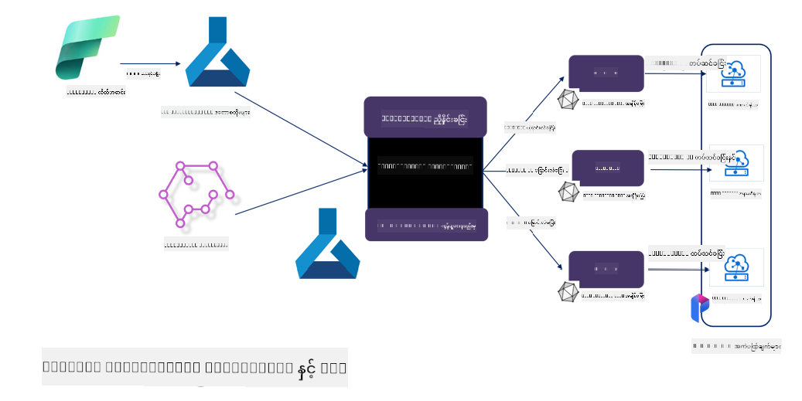

<!--
CO_OP_TRANSLATOR_METADATA:
{
  "original_hash": "5764be88ad2eb4f341e742eb8f14fab1",
  "translation_date": "2025-07-17T06:52:38+00:00",
  "source_file": "md/03.FineTuning/FineTuning_MicrosoftOlive.md",
  "language_code": "my"
}
-->
# **Microsoft Olive ဖြင့် Phi-3 ကို Fine-tuning ပြုလုပ်ခြင်း**

[Olive](https://github.com/microsoft/OLive?WT.mc_id=aiml-138114-kinfeylo) သည် မော်ဒယ်ဖိအားချုပ်ခြင်း၊ အဆင့်မြှင့်တင်ခြင်းနှင့် ကွန်ပိုင်လေးရှင်းဆိုင်ရာ နည်းပညာများကို စုပေါင်းထားသည့် လွယ်ကူစွာ အသုံးပြုနိုင်သော hardware-aware မော်ဒယ်အဆင့်မြှင့်တင်ရေးကိရိယာတစ်ခုဖြစ်သည်။

ဤကိရိယာသည် စက်မှုလုပ်ငန်းတွင် အသုံးပြုသော hardware architecture များအတွက် မော်ဒယ်များကို ထိရောက်စွာ အသုံးချနိုင်ရန် အဆင့်မြှင့်တင်ခြင်းလုပ်ငန်းစဉ်ကို လွယ်ကူစေဖို့ ရည်ရွယ်ထားသည်။

Cloud အခြေပြု application များဖြစ်စေ edge device များဖြစ်စေ Olive သည် မော်ဒယ်များကို လွယ်ကူပြီး ထိရောက်စွာ optimize ပြုလုပ်နိုင်စေသည်။

## အဓိက လက္ခဏာများ
- Olive သည် လိုအပ်သည့် hardware target များအတွက် optimization နည်းပညာများကို စုပေါင်းပြီး အလိုအလျောက် လုပ်ဆောင်ပေးသည်။
- တစ်ခုတည်းသော optimization နည်းပညာတစ်ခုဖြင့် အားလုံးကို ဖြေရှင်း၍ မရသဖြင့် Olive သည် စက်မှုလုပ်ငန်းကျွမ်းကျင်သူများ၏ နည်းပညာအသစ်များကို ထည့်သွင်းအသုံးပြုနိုင်ရန် ခွင့်ပြုထားသည်။

## အင်ဂျင်နီယာလုပ်အား လျော့နည်းစေခြင်း
- ဖွံ့ဖြိုးသူများသည် မော်ဒယ်များကို deployment အတွက် ပြင်ဆင် optimize ပြုလုပ်ရာတွင် hardware vendor-specific toolchain များစွာကို သင်ယူအသုံးပြုရသည်။
- Olive သည် လိုအပ်သည့် hardware အတွက် optimization နည်းပညာများကို အလိုအလျောက် လုပ်ဆောင်ပေးခြင်းဖြင့် အတွေ့အကြုံကို လွယ်ကူစေသည်။

## အသုံးပြုနိုင်သော End-to-End Optimization ဖြေရှင်းချက်
ပေါင်းစပ်ပြီး အဆင့်မြှင့်တင်ထားသော နည်းပညာများကို တစ်စုတစ်စည်းအဖြစ် ဖန်တီးပေးခြင်းဖြင့် Olive သည် end-to-end optimization အတွက် တစ်ခုတည်းသော ဖြေရှင်းချက်ကို ပေးသည်။
တိကျမှုနှင့် latency ကဲ့သို့သော ကန့်သတ်ချက်များကို ထည့်သွင်းစဉ်းစားကာ မော်ဒယ်များကို optimize ပြုလုပ်သည်။

## Microsoft Olive ဖြင့် Fine-tuning ပြုလုပ်ခြင်း

Microsoft Olive သည် generative artificial intelligence လောကတွင် fine-tuning နှင့် reference နှစ်မျိုးလုံးကို ဖုံးလွှမ်းနိုင်သော လွယ်ကူစွာ အသုံးပြုနိုင်သော open source မော်ဒယ် optimization ကိရိယာတစ်ခုဖြစ်သည်။ ရိုးရှင်းသော configuration တစ်ခုသာ လိုအပ်ပြီး open source small language model များနှင့် runtime ပတ်ဝန်းကျင်များ (AzureML / local GPU, CPU, DirectML) ကို ပေါင်းစပ်အသုံးပြုခြင်းဖြင့် မော်ဒယ်ကို အလိုအလျောက် optimize ပြုလုပ်ပြီး fine-tuning သို့မဟုတ် reference ပြုလုပ်နိုင်သည်။ ထို့နောက် cloud သို့မဟုတ် edge device များတွင် ထည့်သွင်းအသုံးပြုရန် အကောင်းဆုံး မော်ဒယ်ကို ရှာဖွေနိုင်သည်။ စီးပွားရေးလုပ်ငန်းများအနေဖြင့် မိမိတို့၏ စက်မှုလုပ်ငန်းအထူးပြု မော်ဒယ်များကို on-premises နှင့် cloud ပေါ်တွင် တည်ဆောက်နိုင်စေသည်။


## Phi-3 ကို Microsoft Olive ဖြင့် Fine-tuning ပြုလုပ်ခြင်း



## Phi-3 Olive နမူနာကုဒ်နှင့် ဥပမာ
ဤဥပမာတွင် Olive ကို အသုံးပြု၍ -

- LoRA adapter တစ်ခုကို စိတ်ခံစားချက်များ (ဝမ်းနည်းခြင်း၊ ပျော်ရွှင်ခြင်း၊ ကြောက်ရွံ့ခြင်း၊ အံ့အားသင့်ခြင်း) အလိုက် သတ်မှတ်ရန် fine-tune ပြုလုပ်မည်။
- Adapter ၏ အလေးချိန်များကို base model ထဲသို့ ပေါင်းစပ်မည်။
- မော်ဒယ်ကို optimize ပြုလုပ်ပြီး int4 အဖြစ် quantize ပြုလုပ်မည်။

[Sample Code](../../code/03.Finetuning/olive-ort-example/README.md)

### Microsoft Olive ကို တပ်ဆင်ခြင်း

Microsoft Olive ကို တပ်ဆင်ရလွယ်ကူပြီး CPU, GPU, DirectML နှင့် Azure ML အတွက်လည်း တပ်ဆင်နိုင်သည်။

```bash
pip install olive-ai
```

ONNX မော်ဒယ်ကို CPU ဖြင့် လည်ပတ်လိုပါက

```bash
pip install olive-ai[cpu]
```

GPU ဖြင့် ONNX မော်ဒယ် လည်ပတ်လိုပါက

```python
pip install olive-ai[gpu]
```

Azure ML အသုံးပြုလိုပါက

```python
pip install git+https://github.com/microsoft/Olive#egg=olive-ai[azureml]
```

**သတိပြုရန်**
OS လိုအပ်ချက် : Ubuntu 20.04 / 22.04

### **Microsoft Olive ၏ Config.json**

တပ်ဆင်ပြီးနောက် Config ဖိုင်မှတဆင့် မော်ဒယ်အလိုက် အမျိုးမျိုးသော ဆက်တင်များ (ဒေတာ၊ ကွန်ပျူတာ၊ လေ့ကျင့်မှု၊ deployment နှင့် မော်ဒယ်ဖန်တီးခြင်း) ကို ပြင်ဆင်နိုင်သည်။

**1. ဒေတာ**

Microsoft Olive တွင် local ဒေတာနှင့် cloud ဒေတာ နှစ်မျိုးလုံးဖြင့် လေ့ကျင့်နိုင်ပြီး ဆက်တင်များတွင် ပြင်ဆင်နိုင်သည်။

*Local ဒေတာ ဆက်တင်များ*

Fine-tuning အတွက် လေ့ကျင့်လိုသော ဒေတာစနစ်ကို ရိုးရှင်းစွာ သတ်မှတ်နိုင်ပြီး ပုံမှန်အားဖြင့် json ဖော်မတ်ဖြင့် ရေးသားထားသည်။ ဒေတာ template နှင့် ကိုက်ညီအောင် ပြင်ဆင်ရမည်။ မော်ဒယ်လိုအပ်ချက်အရ ပြင်ဆင်ရမည် (ဥပမာ - Microsoft Phi-3-mini အတွက် လိုအပ်သည့် ဖော်မတ်အတိုင်း ပြင်ဆင်ရန်။ အခြားမော်ဒယ်များရှိပါက အခြားမော်ဒယ်များ၏ fine-tuning ဖော်မတ်လိုအပ်ချက်များကို ကိုးကားရန်)

```json

    "data_configs": [
        {
            "name": "dataset_default_train",
            "type": "HuggingfaceContainer",
            "load_dataset_config": {
                "params": {
                    "data_name": "json", 
                    "data_files":"dataset/dataset-classification.json",
                    "split": "train"
                }
            },
            "pre_process_data_config": {
                "params": {
                    "dataset_type": "corpus",
                    "text_cols": [
                            "phrase",
                            "tone"
                    ],
                    "text_template": "### Text: {phrase}\n### The tone is:\n{tone}",
                    "corpus_strategy": "join",
                    "source_max_len": 2048,
                    "pad_to_max_len": false,
                    "use_attention_mask": false
                }
            }
        }
    ],
```

**Cloud ဒေတာရင်းမြစ် ဆက်တင်များ**

Azure AI Studio/Azure Machine Learning Service ၏ datastore ကို ချိတ်ဆက်၍ cloud တွင်ရှိသော ဒေတာများကို ချိတ်ဆက်နိုင်သည်။ Microsoft Fabric နှင့် Azure Data မှတဆင့် Azure AI Studio/Azure Machine Learning Service သို့ မတူညီသော ဒေတာရင်းမြစ်များကို ထည့်သွင်းနိုင်ပြီး fine-tuning အတွက် အထောက်အပံ့ပေးသည်။

```json

    "data_configs": [
        {
            "name": "dataset_default_train",
            "type": "HuggingfaceContainer",
            "load_dataset_config": {
                "params": {
                    "data_name": "json", 
                    "data_files": {
                        "type": "azureml_datastore",
                        "config": {
                            "azureml_client": {
                                "subscription_id": "Your Azure Subscrition ID",
                                "resource_group": "Your Azure Resource Group",
                                "workspace_name": "Your Azure ML Workspaces name"
                            },
                            "datastore_name": "workspaceblobstore",
                            "relative_path": "Your train_data.json Azure ML Location"
                        }
                    },
                    "split": "train"
                }
            },
            "pre_process_data_config": {
                "params": {
                    "dataset_type": "corpus",
                    "text_cols": [
                            "Question",
                            "Best Answer"
                    ],
                    "text_template": "<|user|>\n{Question}<|end|>\n<|assistant|>\n{Best Answer}\n<|end|>",
                    "corpus_strategy": "join",
                    "source_max_len": 2048,
                    "pad_to_max_len": false,
                    "use_attention_mask": false
                }
            }
        }
    ],
    
```

**2. ကွန်ပျူတာ ဆက်တင်များ**

Local ဖြစ်ရန်လိုပါက ဒေတာရင်းမြစ်များကို တိုက်ရိုက်အသုံးပြုနိုင်သည်။ Azure AI Studio / Azure Machine Learning Service ၏ အရင်းအမြစ်များကို အသုံးပြုလိုပါက Azure parameter များ၊ ကွန်ပျူတာအင်အားအမည် စသည့် ဆက်တင်များကို ပြင်ဆင်ရမည်။

```json

    "systems": {
        "aml": {
            "type": "AzureML",
            "config": {
                "accelerators": ["gpu"],
                "hf_token": true,
                "aml_compute": "Your Azure AI Studio / Azure Machine Learning Service Compute Name",
                "aml_docker_config": {
                    "base_image": "Your Azure AI Studio / Azure Machine Learning Service docker",
                    "conda_file_path": "conda.yaml"
                }
            }
        },
        "azure_arc": {
            "type": "AzureML",
            "config": {
                "accelerators": ["gpu"],
                "aml_compute": "Your Azure AI Studio / Azure Machine Learning Service Compute Name",
                "aml_docker_config": {
                    "base_image": "Your Azure AI Studio / Azure Machine Learning Service docker",
                    "conda_file_path": "conda.yaml"
                }
            }
        }
    },
```

***သတိပြုရန်***

Azure AI Studio/Azure Machine Learning Service တွင် container ဖြင့် လည်ပတ်သောကြောင့် လိုအပ်သော ပတ်ဝန်းကျင်ကို conda.yaml ဖိုင်တွင် ပြင်ဆင်ရမည်။

```yaml

name: project_environment
channels:
  - defaults
dependencies:
  - python=3.8.13
  - pip=22.3.1
  - pip:
      - einops
      - accelerate
      - azure-keyvault-secrets
      - azure-identity
      - bitsandbytes
      - datasets
      - huggingface_hub
      - peft
      - scipy
      - sentencepiece
      - torch>=2.2.0
      - transformers
      - git+https://github.com/microsoft/Olive@jiapli/mlflow_loading_fix#egg=olive-ai[gpu]
      - --extra-index-url https://aiinfra.pkgs.visualstudio.com/PublicPackages/_packaging/ORT-Nightly/pypi/simple/ 
      - ort-nightly-gpu==1.18.0.dev20240307004
      - --extra-index-url https://aiinfra.pkgs.visualstudio.com/PublicPackages/_packaging/onnxruntime-genai/pypi/simple/
      - onnxruntime-genai-cuda

    

```

**3. သင့် SLM ကို ရွေးချယ်ပါ**

Hugging face မှ မော်ဒယ်ကို တိုက်ရိုက်အသုံးပြုနိုင်သလို Azure AI Studio / Azure Machine Learning ၏ Model Catalog နှင့် ပေါင်းစပ်၍ အသုံးပြုမည့် မော်ဒယ်ကို ရွေးချယ်နိုင်သည်။ အောက်ပါကုဒ်နမူနာတွင် Microsoft Phi-3-mini ကို ဥပမာအဖြစ် အသုံးပြုထားသည်။

မော်ဒယ်ကို local တွင်ရှိပါက အောက်ပါနည်းလမ်းဖြင့် အသုံးပြုနိုင်သည်။

```json

    "input_model":{
        "type": "PyTorchModel",
        "config": {
            "hf_config": {
                "model_name": "model-cache/microsoft/phi-3-mini",
                "task": "text-generation",
                "model_loading_args": {
                    "trust_remote_code": true
                }
            }
        }
    },
```

Azure AI Studio / Azure Machine Learning Service မှ မော်ဒယ်အသုံးပြုလိုပါက အောက်ပါနည်းလမ်းဖြင့် အသုံးပြုနိုင်သည်။

```json

    "input_model":{
        "type": "PyTorchModel",
        "config": {
            "model_path": {
                "type": "azureml_registry_model",
                "config": {
                    "name": "microsoft/Phi-3-mini-4k-instruct",
                    "registry_name": "azureml-msr",
                    "version": "11"
                }
            },
             "model_file_format": "PyTorch.MLflow",
             "hf_config": {
                "model_name": "microsoft/Phi-3-mini-4k-instruct",
                "task": "text-generation",
                "from_pretrained_args": {
                    "trust_remote_code": true
                }
            }
        }
    },
```

**သတိပြုရန်:**
Azure AI Studio / Azure Machine Learning Service နှင့် ပေါင်းစပ်အသုံးပြုရန်လိုအပ်သဖြင့် မော်ဒယ်တပ်ဆင်ရာတွင် ဗားရှင်းနံပါတ်နှင့် နာမည်များကို ကိုးကားပါ။

Azure ပေါ်ရှိ မော်ဒယ်အားလုံးကို PyTorch.MLflow အဖြစ် သတ်မှတ်ရမည်။

Hugging face အကောင့်ရှိပြီး Azure AI Studio / Azure Machine Learning ၏ Key value နှင့် binding ပြုလုပ်ထားရမည်။

**4. အယ်လ်ဂိုရစ်သမ်**

Microsoft Olive သည် Lora နှင့် QLora fine-tuning အယ်လ်ဂိုရစ်သမ်များကို ကောင်းစွာ ထုပ်ပိုးထားသည်။ သင့်အား လိုအပ်သည့် parameter များကိုသာ ပြင်ဆင်ရမည်။ ဤနေရာတွင် QLora ကို ဥပမာအဖြစ် ယူထားသည်။

```json
        "lora": {
            "type": "LoRA",
            "config": {
                "target_modules": [
                    "o_proj",
                    "qkv_proj"
                ],
                "double_quant": true,
                "lora_r": 64,
                "lora_alpha": 64,
                "lora_dropout": 0.1,
                "train_data_config": "dataset_default_train",
                "eval_dataset_size": 0.3,
                "training_args": {
                    "seed": 0,
                    "data_seed": 42,
                    "per_device_train_batch_size": 1,
                    "per_device_eval_batch_size": 1,
                    "gradient_accumulation_steps": 4,
                    "gradient_checkpointing": false,
                    "learning_rate": 0.0001,
                    "num_train_epochs": 3,
                    "max_steps": 10,
                    "logging_steps": 10,
                    "evaluation_strategy": "steps",
                    "eval_steps": 187,
                    "group_by_length": true,
                    "adam_beta2": 0.999,
                    "max_grad_norm": 0.3
                }
            }
        },
```

Quantization ပြောင်းလဲလိုပါက Microsoft Olive main branch သည် onnxruntime-genai နည်းလမ်းကို ပံ့ပိုးပြီး သင့်လိုအပ်ချက်အရ ပြင်ဆင်နိုင်သည်။

1. Adapter အလေးချိန်များကို base model ထဲသို့ ပေါင်းစပ်ခြင်း
2. ModelBuilder ဖြင့် လိုအပ်သည့် တိကျမှုဖြင့် onnx မော်ဒယ်သို့ ပြောင်းလဲခြင်း

ဥပမာ - quantized INT4 သို့ ပြောင်းလဲခြင်း

```json

        "merge_adapter_weights": {
            "type": "MergeAdapterWeights"
        },
        "builder": {
            "type": "ModelBuilder",
            "config": {
                "precision": "int4"
            }
        }
```

**သတိပြုရန်**
- QLoRA အသုံးပြုပါက ONNXRuntime-genai ၏ quantization ပြောင်းလဲမှုကို ယခုအချိန်တွင် မပံ့ပိုးသေးပါ။
- အထက်ဖော်ပြပါ အဆင့်များကို သင့်လိုအပ်ချက်အရ ပြင်ဆင်နိုင်ပြီး အားလုံးကို တစ်ပြိုင်နက်တည်း ပြင်ဆင်ရန် မလိုအပ်ပါ။ လိုအပ်သလို အယ်လ်ဂိုရစ်သမ်အဆင့်များကို တိုက်ရိုက်အသုံးပြုနိုင်ပြီး နောက်ဆုံးတွင် engine များကို ပြင်ဆင်ရမည်။

```json

    "engine": {
        "log_severity_level": 0,
        "host": "aml",
        "target": "aml",
        "search_strategy": false,
        "execution_providers": ["CUDAExecutionProvider"],
        "cache_dir": "../model-cache/models/phi3-finetuned/cache",
        "output_dir" : "../model-cache/models/phi3-finetuned"
    }
```

**5. Fine-tuning ပြီးဆုံးခြင်း**

Command line တွင် olive-config.json ဖိုင်ရှိ directory တွင် အောက်ပါအတိုင်း လည်ပတ်ပါ။

```bash
olive run --config olive-config.json  
```

**အကြောင်းကြားချက်**  
ဤစာတမ်းကို AI ဘာသာပြန်ဝန်ဆောင်မှု [Co-op Translator](https://github.com/Azure/co-op-translator) ဖြင့် ဘာသာပြန်ထားပါသည်။ ကျွန်ုပ်တို့သည် တိကျမှန်ကန်မှုအတွက် ကြိုးစားသော်လည်း၊ အလိုအလျောက် ဘာသာပြန်ခြင်းသည် အမှားများ သို့မဟုတ် မှားယွင်းချက်များ ပါဝင်နိုင်ကြောင်း သတိပြုပါရန် မေတ္တာရပ်ခံအပ်ပါသည်။ မူရင်းစာတမ်းကို မိမိဘာသာစကားဖြင့်သာ တရားဝင်အရင်းအမြစ်အဖြစ် သတ်မှတ်သင့်ပါသည်။ အရေးကြီးသော အချက်အလက်များအတွက် လူ့ဘာသာပြန်ပညာရှင်မှ ဘာသာပြန်ခြင်းကို အကြံပြုပါသည်။ ဤဘာသာပြန်ချက်ကို အသုံးပြုရာမှ ဖြစ်ပေါ်လာနိုင်သည့် နားလည်မှုမှားယွင်းမှုများအတွက် ကျွန်ုပ်တို့သည် တာဝန်မယူပါ။