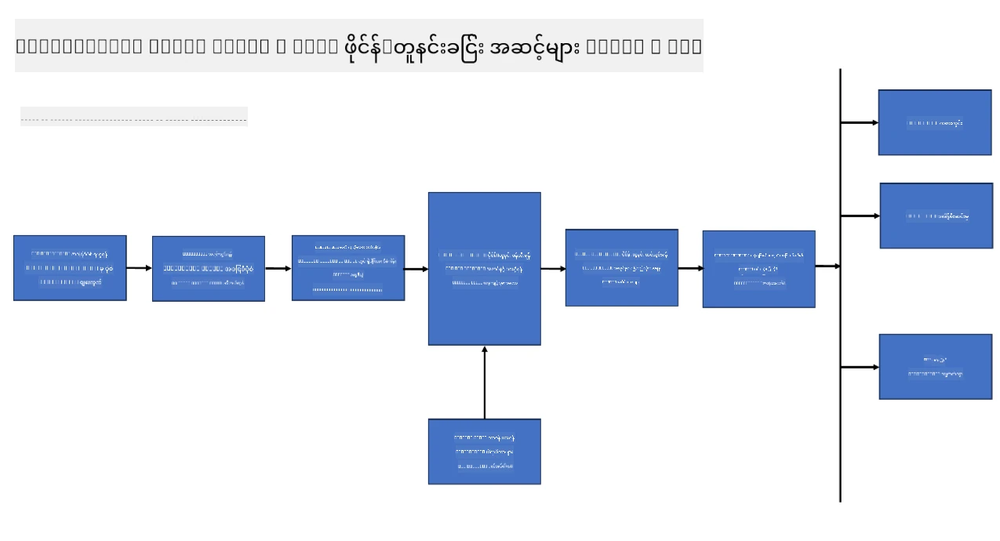
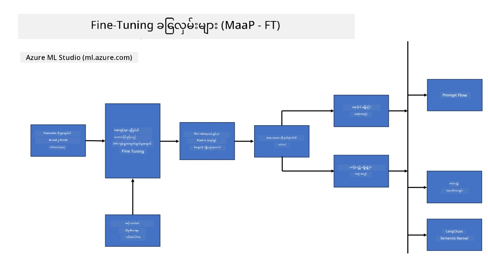
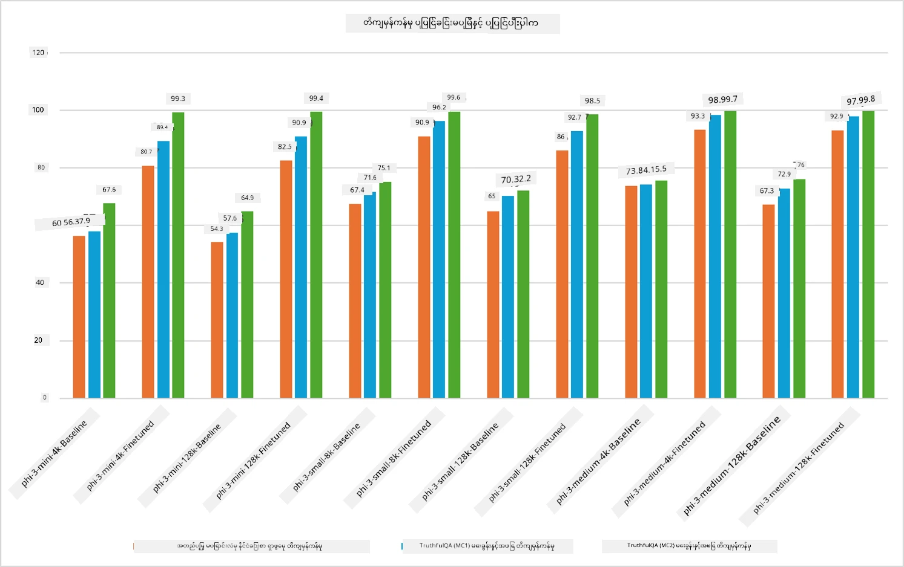

## Fine Tuning Scenarios

**Platform** ဒီမှာ Azure AI Foundry, Azure Machine Learning, AI Tools, Kaito, နဲ့ ONNX Runtime တို့လို နည်းပညာမျိုးစုံ ပါဝင်ပါတယ်။

**Infrastructure** ဒီမှာ fine-tuning လုပ်ငန်းစဉ်အတွက် အရေးကြီးတဲ့ CPU နဲ့ FPGA ပါဝင်ပါတယ်။ ဒီနည်းပညာတွေကို ကိုယ်တိုင်ပြသပေးပါမယ်။

**Tools & Framework** ဒီမှာ ONNX Runtime နှစ်ခုပါဝင်ပါတယ်။ ဒီနည်းပညာတွေကို ကိုယ်တိုင်ပြသပေးပါမယ်။

Microsoft နည်းပညာတွေနဲ့ fine-tuning လုပ်ငန်းစဉ်မှာ အစိတ်အပိုင်းနဲ့ ကိရိယာမျိုးစုံ ပါဝင်ပါတယ်။ ဒီနည်းပညာတွေကို နားလည်ပြီး အသုံးချခြင်းအားဖြင့် ကျွန်တော်တို့ရဲ့ အပလီကေးရှင်းတွေကို ထိရောက်စွာ fine-tune လုပ်နိုင်ပြီး ပိုမိုကောင်းမွန်တဲ့ ဖြေရှင်းချက်တွေ ဖန်တီးနိုင်ပါတယ်။

## Model as Service

Hosted fine-tuning ကို အသုံးပြုပြီး compute ကို ဖန်တီးစီမံရန် မလိုဘဲ မော်ဒယ်ကို fine-tune လုပ်နိုင်ပါတယ်။

Serverless fine-tuning ကို Phi-3-mini နဲ့ Phi-3-medium မော်ဒယ်များအတွက် အသုံးပြုနိုင်ပြီး developer များအတွက် cloud နဲ့ edge စနစ်များအတွက် မော်ဒယ်များကို လျင်မြန်လွယ်ကူစွာ စိတ်ကြိုက်ပြင်ဆင်နိုင်စေပါတယ်။ ထို့အပြင် Phi-3-small ကို Models-as-a-Service အဖြစ် ထုတ်ပြန်ထားပြီး developer များအတွက် အခြေခံအင်ဖရာစတပ်ချာကို စီမံခန့်ခွဲရန် မလိုဘဲ AI ဖွံ့ဖြိုးတိုးတက်မှုကို လျင်မြန်စွာ စတင်နိုင်ပါပြီ။

## Model as a Platform

အသုံးပြုသူများသည် မိမိတို့ compute ကို ကိုယ်တိုင် စီမံခန့်ခွဲပြီး မော်ဒယ်များကို fine-tune လုပ်ကြသည်။

[Fine Tuning Sample](https://github.com/Azure/azureml-examples/blob/main/sdk/python/foundation-models/system/finetune/chat-completion/chat-completion.ipynb)

## Fine Tuning Scenarios

| | | | | | | |
|-|-|-|-|-|-|-|
|Scenario|LoRA|QLoRA|PEFT|DeepSpeed|ZeRO|DORA|
|အကြိုသင်ကြားပြီးသား LLM များကို အထူးတာဝန်များ သို့မဟုတ် ဒိုမိန်းများအတွက် ကိုက်ညီစေရန်|Yes|Yes|Yes|Yes|Yes|Yes|
|စာသားခွဲခြားခြင်း၊ အမည်သတ်မှတ်ခြင်း၊ ဘာသာပြန်ခြင်းကဲ့သို့သော NLP လုပ်ငန်းများအတွက် fine-tuning|Yes|Yes|Yes|Yes|Yes|Yes|
|QA လုပ်ငန်းများအတွက် fine-tuning|Yes|Yes|Yes|Yes|Yes|Yes|
|chatbot များတွင် လူ့စကားသဘောအတိုင်း တုံ့ပြန်မှုများ ဖန်တီးရန် fine-tuning|Yes|Yes|Yes|Yes|Yes|Yes|
|တေးဂီတ၊ အနုပညာ သို့မဟုတ် အခြားဖန်တီးမှုအမျိုးအစားများ ဖန်တီးရန် fine-tuning|Yes|Yes|Yes|Yes|Yes|Yes|
|တွက်ချက်မှုနှင့် ငွေကြေးကုန်ကျစရိတ် လျော့ချခြင်း|Yes|Yes|No|Yes|Yes|No|
|မှတ်ဉာဏ်အသုံးပြုမှု လျော့ချခြင်း|No|Yes|No|Yes|Yes|Yes|
|ထိရောက်စွာ fine-tuning လုပ်ရန် ပိုမိုနည်းသော parameter များ အသုံးပြုခြင်း|No|Yes|Yes|No|No|Yes|
|GPU စက်ပစ္စည်းအားလုံး၏ စုစုပေါင်း GPU မှတ်ဉာဏ်ကို အသုံးပြုနိုင်စေသော မှတ်ဉာဏ်-ထိရောက်သော data parallelism ပုံစံ|No|No|No|Yes|Yes|Yes|

## Fine Tuning Performance Examples

**အကြောင်းကြားချက်**  
ဤစာတမ်းကို AI ဘာသာပြန်ဝန်ဆောင်မှု [Co-op Translator](https://github.com/Azure/co-op-translator) ဖြင့် ဘာသာပြန်ထားပါသည်။ ကျွန်ုပ်တို့သည် တိကျမှန်ကန်မှုအတွက် ကြိုးစားသော်လည်း အလိုအလျောက် ဘာသာပြန်ခြင်းတွင် အမှားများ သို့မဟုတ် မှားယွင်းချက်များ ပါဝင်နိုင်ကြောင်း သတိပြုပါရန် မေတ္တာရပ်ခံအပ်ပါသည်။ မူရင်းစာတမ်းကို မိမိဘာသာစကားဖြင့်သာ တရားဝင်အရင်းအမြစ်အဖြစ် ယူဆသင့်ပါသည်။ အရေးကြီးသော အချက်အလက်များအတွက် လူ့ပညာရှင်များ၏ ပရော်ဖက်ရှင်နယ် ဘာသာပြန်ခြင်းကို အကြံပြုပါသည်။ ဤဘာသာပြန်ချက်ကို အသုံးပြုရာမှ ဖြစ်ပေါ်လာနိုင်သည့် နားလည်မှုမှားယွင်းမှုများအတွက် ကျွန်ုပ်တို့သည် တာဝန်မယူပါ။