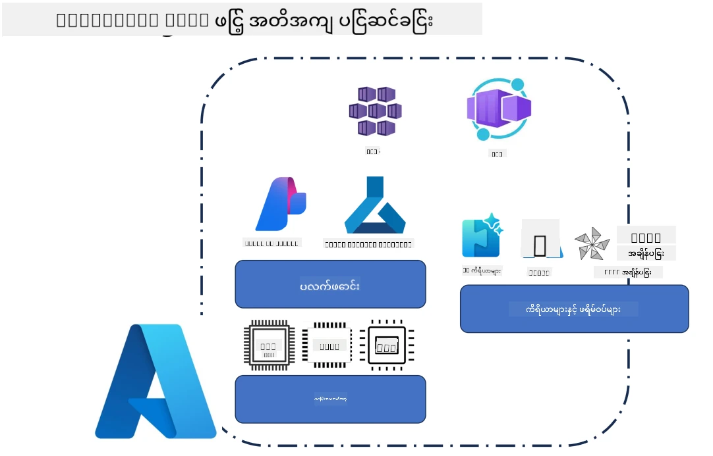
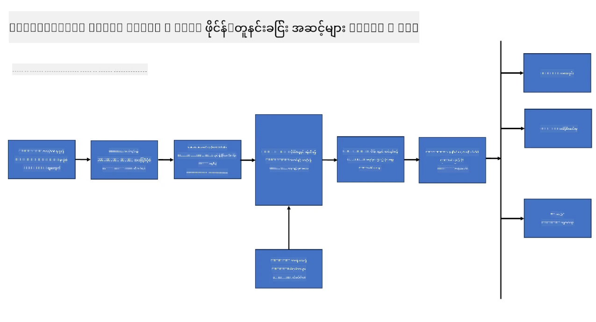
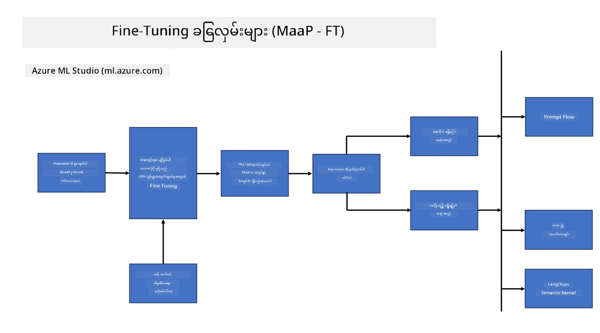

## Fine Tuning Scenarios

ဤအပိုင်းတွင် Microsoft Foundry နှင့် Azure ပတ်ဝန်းကျင်များမှာ fine-tuning အခြေနေများ၊ တပ်ဆင်ခြင်းပုံစံများ၊ အောက်ခံအဆင့်များ၊ နှင့် အများစုအသုံးပြုသော တိုးတက်မွမ်းမံမှုနည်းပညာများ အကျဉ်းချုပ် မိတ်ဆက်ထားသည်။

**Platform**  
ဤတွင် model ကျိုးခြင်း-စီမံခန့်ခွဲမှု၊ စီမံခန့်ခွဲခြင်း၊ စမ်းသပ်မှု လိုက်လံခြင်း နှင့် တပ်ဆင်ခြင်းလုပ်ငန်းစဉ်များပံ့ပိုးပေးသည့် Microsoft Foundry ( ယခင် Azure AI Foundry) နှင့် Azure Machine Learning ကဲ့သို့ စီမံခန့်ခွဲထားသည့် ဝန်ဆောင်မှုပေါင်းများပါဝင်သည်။

**Infrastructure**  
Fine-tuning တွင် တိုးတက်နိုင်သော ကွန်ပျူတာ အရင်းအမြစ်များ လိုအပ်သည်။ Azure ပတ်ဝန်းကျင်များတွင် ယင်းအား ဖြတ်သန်းသော GPU အခြေပြု virtual machine များ နှင့် အလင်းလေးသော လုပ်ငန်းအများအတွက် CPU အရင်းအမြစ်များ၊ ဒေတာများနှင့် checkpoint များအတွက် တိုးတက်နိုင်သော သိမ်းဆည်းမှုတို့ ပါဝင်သည်။

**Tools & Framework**  
Fine-tuning workflow များတွင် Hugging Face Transformers, DeepSpeed, PEFT (Parameter-Efficient Fine-Tuning) ဆော့ဖ်ဝဲ များနှင့် Optimization libraries များကို အများအားဖြင့် အသုံးပြုသည်။

Microsoft နည်းပညာများဖြင့် fine-tuning လုပ်ငန်းစဉ်သည် platform ဝန်ဆောင်မှုများ၊ ကွန်ပျူတာ အောက်ခံအဆင့်နှင့် သင်ကြားရေး ဖရိဏ်မာတိုက်များ ပေါင်းစပ် ဆောင်ရွက်သည်။ ဤအစိတ်အပိုင်းများ အပြန်အလှန် ကောင်းစွာ လုပ်ဆောင်ပုံကို နားလည်ခြင်းဖြင့် ဆော့ဖ်ဝဲ ဖန်တီးသူများသည် base models များကို သတ်မှတ်ထားသည့် လုပ်ငန်းများနှင့် ထုတ်လုပ်မှုအခြေအနေများတွင် ထိရောက်စွာ လိုက်ဖက်နိုင်သည်။

## Model as Service

Compute ကို ဖန်တီးခြင်းနှင့် စီမံခန့်ခွဲခြင်း မလိုအပ်ဘဲ hosted fine-tuning ဖြင့် model ကို အဆင်ပြေအောင် ပြင်ဆင်နိုင်သည်။

Phi-3၊ Phi-3.5 နှင့် Phi-4 model မျိုးစုံအတွက် serverless fine-tuning ယခုရနိုင်ပြီး၊ developer များသည် cloud နှင့် edge စနစ်များအတွက် မော်ဒယ်များကို ကွန်ပြူး စီစဉ်နိုင်ခြင်းမရှိဘဲ ဖျော်ဖြေချိတ်ဆက် ပြင်ဆင်နိုင်သည်။

## Model as a Platform 

အသုံးပြုသူများသည် မိမိတို့ compute ကို ကိုင်တွယ် စီမံခန့်ခွဲ၍ မော်ဒယ်များကို fine-tune ပြုလုပ်သည်။

[Fine Tuning Sample](https://github.com/Azure/azureml-examples/blob/main/sdk/python/foundation-models/system/finetune/chat-completion/chat-completion.ipynb)

## Fine-Tuning Techniques Comparison

|Scenario|LoRA|QLoRA|PEFT|DeepSpeed|ZeRO|DoRA|
|---|---|---|---|---|---|---|
|ပြင်ဆင်ပြီးသော LLM များကို သတ်မှတ်ထားသော လုပ်ငန်း သို့မဟုတ် domain များအတွင်း လိုက်ဖက်အောင် ပြင်ဆင်ခြင်း|Yes|Yes|Yes|Yes|Yes|Yes|
|စာသားအမျိုးအစားသတ်မှတ်ခြင်း၊ အမည်စနစ်သိရှိခြင်း နှင့် စက်ဘာသာပြန်ခြင်းကဲ့သို့သော NLP လုပ်ငန်းများအတွက် fine-tuning|Yes|Yes|Yes|Yes|Yes|Yes|
|QA လုပ်ငန်းများအတွက် fine-tuning|Yes|Yes|Yes|Yes|Yes|Yes|
|chatbot များတွင် လူသားကဲ့သို့ အဖြေများ စုပုံထုတ်လုပ်ရေးအတွက် fine-tuning|Yes|Yes|Yes|Yes|Yes|Yes|
|တေးဂီတ၊ အနုပညာ သို့မဟုတ် အခြား ဖန်တီးမှု အမျိုးအစားများ စုပုံထုတ်လုပ်ရေးအတွက် fine-tuning|Yes|Yes|Yes|Yes|Yes|Yes|
|ကွန်ပျူတာနှင့် င

---

<!-- CO-OP TRANSLATOR DISCLAIMER START -->
**မှတ်ချက်**  
ဤစာတမ်းကို AI ဘာသာပြန်ဝန်ဆောင်မှုဖြစ်သော [Co-op Translator](https://github.com/Azure/co-op-translator) ဖြင့် ဘာသာပြန်ထားခြင်းဖြစ်သည်။ ကျွန်ုပ်တို့သည် မှန်ကန်မှုကို ကြိုးပမ်းပါသည်၊ သို့သော် အလိုအလျောက် ဘာသာပြန်ထားမှုများတွင် အမှားများ သို့မဟုတ် မှန်မှန်းကန်မှု မရှိခြင်းများ ဖြစ်နိုင်သည်ကို ကျေးဇူးပြု၍ သိရှိပါ။ မူရင်းစာတမ်းကို မိမိဘာသာစကားဖြင့် သက်ဆိုင်ရာ အတည်ပြုအရင်းအမြစ်အဖြစ် သတ်မှတ်ရန်လိုသည်။ အရေးကြီးသော သတင်းအချက်အလက်များအတွက် လူမှုဖူလုံသော ဘာသာပြန်သူများ၏ ပရော်ဖက်ရှင်နယ် ဘာသာပြန်မှုကို အကြံပြုပါသည်။ ဤဘာသာပြန်မှုကို အသုံးပြုသောကြောင့် ဖြစ်ပေါ်လာသော အနားလွှတ်ချက်များ သို့မဟုတ် မှားယွင်းနားလည်မှုပျော်လောက်မှုများအတွက် ကျွန်ုပ်တို့သည် တာဝန်မခံပါ။
<!-- CO-OP TRANSLATOR DISCLAIMER END -->