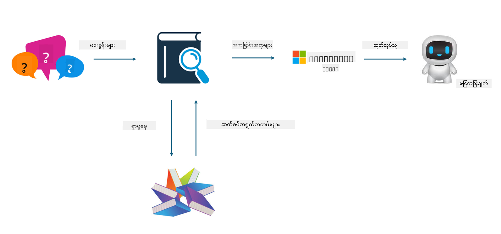

<!--
CO_OP_TRANSLATOR_METADATA:
{
  "original_hash": "e4e010400c2918557b36bb932a14004c",
  "translation_date": "2025-07-17T09:32:17+00:00",
  "source_file": "md/03.FineTuning/FineTuning_vs_RAG.md",
  "language_code": "my"
}
-->
## Finetuning နှင့် RAG

## Retrieval Augmented Generation

RAG သည် ဒေတာ ရှာဖွေခြင်းနှင့် စာသား ဖန်တီးခြင်း ပေါင်းစပ်မှုဖြစ်သည်။ စီးပွားရေးလုပ်ငန်း၏ ဖွဲ့စည်းထားသော ဒေတာနှင့် ဖွဲ့စည်းမထားသော ဒေတာများကို vector database တွင် သိမ်းဆည်းထားသည်။ သက်ဆိုင်ရာ အကြောင်းအရာကို ရှာဖွေနေစဉ်၊ သက်ဆိုင်ရာ အကျဉ်းချုပ်နှင့် အကြောင်းအရာများကို ရှာဖွေပြီး context တစ်ခု ဖန်တီးကာ LLM/SLM ၏ စာသား ပြည့်စုံစွမ်းရည်နှင့် ပေါင်းစပ်၍ အကြောင်းအရာကို ဖန်တီးပေးသည်။

## RAG လုပ်ငန်းစဉ်

## Fine-tuning
Fine-tuning သည် မော်ဒယ်တစ်ခု၏ တိုးတက်မှုအပေါ် အခြေခံသည်။ မော်ဒယ် အယ်လ်ဂိုရစ်သမ်မှ စတင်ရန် မလိုအပ်ပေမယ့် ဒေတာကို ဆက်လက် စုဆောင်းရမည်။ စက်မှုလုပ်ငန်းတွင် ပိုမိုတိကျသော စကားလုံးနှင့် ဘာသာစကား ဖော်ပြချက်လိုအပ်ပါက fine-tuning သည် သင့်အတွက် ပိုမိုသင့်တော်သော ရွေးချယ်မှုဖြစ်သည်။ သို့သော် ဒေတာများ မကြာခဏ ပြောင်းလဲလျှင် fine-tuning သည် ရှုပ်ထွေးနိုင်သည်။

## ရွေးချယ်ပုံ
အကယ်၍ ကျွန်ုပ်တို့၏ ဖြေကြားချက်တွင် ပြင်ပဒေတာ မိတ်ဆက်ရန် လိုအပ်ပါက RAG သည် အကောင်းဆုံး ရွေးချယ်မှုဖြစ်သည်။

စက်မှုလုပ်ငန်း အသိပညာကို တိကျပြီး တည်ငြိမ်စွာ ထုတ်ပေးရန် လိုအပ်ပါက fine-tuning သည် ကောင်းမွန်သော ရွေးချယ်မှုဖြစ်မည်။ RAG သည် သက်ဆိုင်ရာ အကြောင်းအရာကို ဆွဲထုတ်ပေးသော်လည်း အထူးပြု အသေးစိတ်များကို အမြဲတမ်း မှန်ကန်စွာ ဖော်ပြနိုင်ခြင်း မရှိနိုင်ပါ။

Fine-tuning သည် အရည်အသွေးမြင့် ဒေတာ စုစည်းမှု လိုအပ်ပြီး ဒေတာ အကွာအဝေး သေးငယ်ပါက အကျိုးသက်ရောက်မှု မကြီးမားပါ။ RAG သည် ပိုမို လွယ်ကူတတ်သည်။

Fine-tuning သည် အမှောင်ဘူးတစ်ခုကဲ့သို့ ဖြစ်ပြီး အတွင်းစိတ်ကူးကို နားလည်ရခက်သည်။ သို့သော် RAG သည် ဒေတာရင်းမြစ်ကို ရှာဖွေရာတွင် ပိုမိုလွယ်ကူစေပြီး hallucination သို့မဟုတ် အကြောင်းအရာ အမှားများကို ထိရောက်စွာ ပြင်ဆင်နိုင်ခြင်းနှင့် ပိုမိုထင်ရှားသော သက်သေခံမှု ပေးနိုင်သည်။

**အကြောင်းကြားချက်**  
ဤစာတမ်းကို AI ဘာသာပြန်ဝန်ဆောင်မှု [Co-op Translator](https://github.com/Azure/co-op-translator) ဖြင့် ဘာသာပြန်ထားပါသည်။ ကျွန်ုပ်တို့သည် တိကျမှန်ကန်မှုအတွက် ကြိုးစားသော်လည်း အလိုအလျောက် ဘာသာပြန်ခြင်းတွင် အမှားများ သို့မဟုတ် မှားယွင်းချက်များ ပါဝင်နိုင်ကြောင်း သတိပြုပါရန် မေတ္တာရပ်ခံအပ်ပါသည်။ မူရင်းစာတမ်းကို မိမိဘာသာစကားဖြင့်သာ တရားဝင်အချက်အလက်အဖြစ် ယူဆသင့်ပါသည်။ အရေးကြီးသော အချက်အလက်များအတွက် လူ့ဘာသာပြန်ပညာရှင်မှ ဘာသာပြန်ခြင်းကို အကြံပြုပါသည်။ ဤဘာသာပြန်ချက်ကို အသုံးပြုရာမှ ဖြစ်ပေါ်လာနိုင်သည့် နားလည်မှုမှားယွင်းမှုများအတွက် ကျွန်ုပ်တို့သည် တာဝန်မယူပါ။