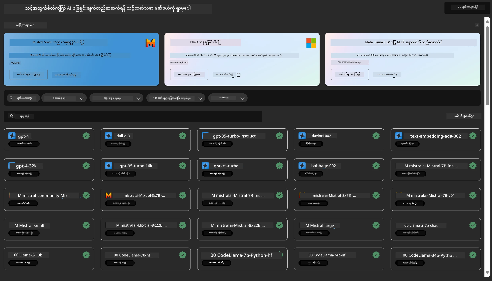
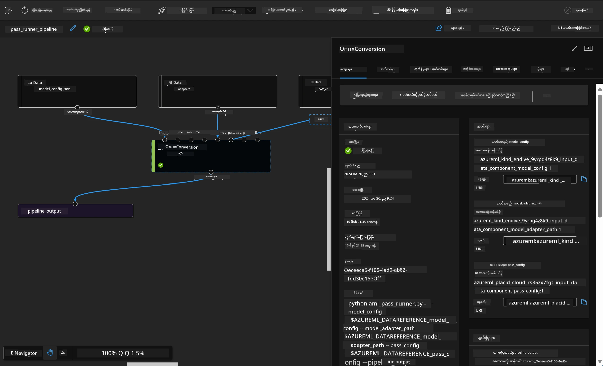

# **Azure Machine Learning Service ကို မိတ်ဆက်ခြင်း**

[Azure Machine Learning](https://ml.azure.com?WT.mc_id=aiml-138114-kinfeylo) သည် machine learning (ML) ပရောဂျက်၏ ဘဝစက်ဝန်းကို မြန်ဆန်စွာ စီမံခန့်ခွဲရန်နှင့် အရှိန်မြှင့်ရန် အသုံးပြုနိုင်သော cloud ဝန်ဆောင်မှုတစ်ခုဖြစ်သည်။

ML ပညာရှင်များ၊ ဒေတာသိပ္ပံပညာရှင်များနှင့် အင်ဂျင်နီယာများသည် နေ့စဉ်လုပ်ငန်းစဉ်များတွင် အောက်ပါအတိုင်း အသုံးပြုနိုင်သည်-

- မော်ဒယ်များကို လေ့ကျင့်ပြီး တပ်ဆင်ခြင်း။
- machine learning လုပ်ငန်းစဉ်များ (MLOps) ကို စီမံခန့်ခွဲခြင်း။
- Azure Machine Learning တွင် မော်ဒယ်တစ်ခု ဖန်တီးနိုင်ပြီး PyTorch, TensorFlow သို့မဟုတ် scikit-learn ကဲ့သို့သော open-source ပလက်ဖောင်းမှ တည်ဆောက်ထားသော မော်ဒယ်ကိုလည်း အသုံးပြုနိုင်သည်။
- MLOps ကိရိယာများက မော်ဒယ်များကို စောင့်ကြည့်၊ ပြန်လေ့ကျင့်၊ ပြန်တပ်ဆင်ရန် ကူညီပေးသည်။

## Azure Machine Learning ကို ဘယ်သူတွေ အသုံးပြုသင့်သလဲ?

**ဒေတာသိပ္ပံပညာရှင်များနှင့် ML အင်ဂျင်နီယာများ**

သူတို့၏ နေ့စဉ်လုပ်ငန်းစဉ်များကို မြန်ဆန်စွာ လုပ်ဆောင်ရန်နှင့် အလိုအလျောက်လုပ်ဆောင်ရန် ကိရိယာများကို အသုံးပြုနိုင်သည်။
Azure ML သည် တရားမျှတမှု၊ ရှင်းလင်းပြောကြားနိုင်မှု၊ လိုက်လံစောင့်ကြည့်မှုနှင့် စစ်ဆေးနိုင်မှု အတွက် လုပ်ဆောင်ချက်များကို ပံ့ပိုးပေးသည်။

**အပလီကေးရှင်း ဖန်တီးသူများ**

မော်ဒယ်များကို အပလီကေးရှင်းများ သို့မဟုတ် ဝန်ဆောင်မှုများထဲသို့ အဆင်ပြေစွာ ပေါင်းစည်းနိုင်သည်။

**ပလက်ဖောင်း ဖန်တီးသူများ**

Azure Resource Manager API များဖြင့် အားကောင်းသော ကိရိယာများကို အသုံးပြုနိုင်ပြီး အဆင့်မြင့် ML ကိရိယာများ ဖန်တီးနိုင်သည်။

**လုပ်ငန်းကြီးများ**

Microsoft Azure cloud တွင် လုပ်ကိုင်သော လုပ်ငန်းကြီးများသည် လုံခြုံရေးနှင့် အခန်းကဏ္ဍအခြေခံ ဝင်ခွင့်ထိန်းချုပ်မှုများကို အသုံးပြုနိုင်သည်။
ကာကွယ်ထားသော ဒေတာနှင့် အထူးလုပ်ဆောင်ချက်များအတွက် ဝင်ခွင့် ထိန်းချုပ်ရန် ပရောဂျက်များကို စီစဉ်နိုင်သည်။

## အဖွဲ့ဝင်တိုင်းအတွက် ထုတ်လုပ်မှုမြှင့်တင်မှု

ML ပရောဂျက်များတွင် အတတ်ပညာမျိုးစုံရှိသော အဖွဲ့လိုအပ်သည်။

Azure ML သည် အောက်ပါအတိုင်း ကိရိယာများကို ပံ့ပိုးပေးသည်-
- အဖွဲ့ဝင်များနှင့် အတူတကွ shared notebooks, compute resources, serverless compute, data နှင့် environments များမှတဆင့် ပူးပေါင်းဆောင်ရွက်နိုင်ခြင်း။
- တရားမျှတမှု၊ ရှင်းလင်းပြောကြားနိုင်မှု၊ လိုက်လံစောင့်ကြည့်မှုနှင့် စစ်ဆေးနိုင်မှုတို့ဖြင့် မော်ဒယ်များ ဖန်တီးနိုင်ခြင်း၊ lineage နှင့် audit လိုအပ်ချက်များကို ဖြည့်ဆည်းနိုင်ခြင်း။
- ML မော်ဒယ်များကို အရှိန်မြန်စွာ၊ အလွယ်တကူ တပ်ဆင်နိုင်ပြီး MLOps ဖြင့် ထိန်းချုပ် စီမံနိုင်ခြင်း။
- အဆောက်အအုံတွင် governance, security နှင့် compliance ပါဝင်သည့် machine learning လုပ်ငန်းများကို မည်သည့်နေရာတွင်မဆို ပြုလုပ်နိုင်ခြင်း။

## Cross-Compatible Platform Tools

ML အဖွဲ့ဝင် မည်သူမဆို ကိုယ်နှစ်သက်ရာ ကိရိယာများဖြင့် လုပ်ငန်းများကို ပြီးမြောက်စေပါသည်။
အမြန်စမ်းသပ်မှုများ၊ hyperparameter tuning, pipeline ဖန်တီးခြင်း သို့မဟုတ် inference စီမံခန့်ခွဲခြင်းတို့ကို familiar interface များဖြင့် လုပ်ဆောင်နိုင်သည်-
- Azure Machine Learning Studio
- Python SDK (v2)
- Azure CLI (v2)
- Azure Resource Manager REST APIs

မော်ဒယ်များကို တိုးတက်အောင် ပြုပြင်ခြင်းနှင့် ဖွံ့ဖြိုးတိုးတက်မှု လုပ်ငန်းစဉ်တစ်လျှောက် ပူးပေါင်းဆောင်ရွက်ရာတွင် Azure Machine Learning studio UI မှာ asset, resource နှင့် metrics များကို မျှဝေ၊ ရှာဖွေနိုင်သည်။

## **Azure ML တွင် LLM/SLM**

Azure ML သည် LLMOps နှင့် SLMOps ကို ပေါင်းစပ်ပြီး လုပ်ငန်းအနှံ့အပြား အသုံးပြုနိုင်သော generative artificial intelligence နည်းပညာ ပလက်ဖောင်းတစ်ခု ဖန်တီးရန် LLM/SLM ဆိုင်ရာ လုပ်ဆောင်ချက်များစွာ ထည့်သွင်းထားသည်။

### **Model Catalog**

လုပ်ငန်းအသုံးပြုသူများသည် Model Catalog မှတဆင့် ကွဲပြားသော စီးပွားရေးအခြေအနေများအလိုက် မော်ဒယ်များကို တပ်ဆင်နိုင်ပြီး၊ လုပ်ငန်းဖန်တီးသူများ သို့မဟုတ် အသုံးပြုသူများအတွက် Model as Service အဖြစ် ဝန်ဆောင်မှုပေးနိုင်သည်။

Azure Machine Learning studio တွင်ရှိသော Model Catalog သည် Generative AI အပလီကေးရှင်းများ ဖန်တီးရန် အသုံးပြုနိုင်သော မော်ဒယ်အမျိုးမျိုးကို ရှာဖွေ အသုံးပြုနိုင်သော ဗဟိုစင်တာဖြစ်သည်။ Model Catalog တွင် Azure OpenAI service, Mistral, Meta, Cohere, Nvidia, Hugging Face ကဲ့သို့သော မော်ဒယ်ပံ့ပိုးသူများမှ မော်ဒယ်များနှင့် Microsoft မှ လေ့ကျင့်ထားသော မော်ဒယ်များ ရှိသည်။ Microsoft မဟုတ်သော ပံ့ပိုးသူများမှ မော်ဒယ်များကို Microsoft ၏ Product Terms အရ Non-Microsoft Products ဟု သတ်မှတ်ပြီး မော်ဒယ်နှင့်အတူ ပေးထားသော စည်းမျဉ်းများအရ အသုံးပြုရမည်ဖြစ်သည်။

### **Job Pipeline**

machine learning pipeline ၏ အဓိကအချက်မှာ machine learning လုပ်ငန်းတစ်ခုကို အဆင့်များစွာဖြင့် ခွဲခြားခြင်းဖြစ်သည်။ အဆင့်တိုင်းသည် တစ်ခုချင်းစီ ဖန်တီး၊ တိုးတက်အောင် ပြုပြင်၊ ပြင်ဆင်၊ အလိုအလျောက်လုပ်ဆောင်နိုင်သော အစိတ်အပိုင်းတစ်ခုဖြစ်သည်။ အဆင့်များကို သတ်မှတ်ထားသော interface များဖြင့် ချိတ်ဆက်ထားသည်။ Azure Machine Learning pipeline ဝန်ဆောင်မှုသည် pipeline အဆင့်များအကြား အားလုံးသော ဆက်စပ်မှုများကို အလိုအလျောက် စီမံခန့်ခွဲပေးသည်။

SLM / LLM ကို fine-tuning ပြုလုပ်ရာတွင် Pipeline မှတဆင့် ဒေတာ၊ လေ့ကျင့်မှုနှင့် ဖန်တီးမှု လုပ်ငန်းစဉ်များကို စီမံနိုင်သည်။

### **Prompt flow**

Azure Machine Learning prompt flow ကို အသုံးပြုခြင်း၏ အကျိုးကျေးဇူးများ  
Azure Machine Learning prompt flow သည် စိတ်ကူးမှ စမ်းသပ်မှုများသို့၊ နောက်ဆုံးတွင် ထုတ်လုပ်ရန် အသင့်ပြင် LLM အခြေပြု အပလီကေးရှင်းများ ဖန်တီးရာတွင် အသုံးပြုသူများအား အောက်ပါအကျိုးများ ပေးစွမ်းသည်-

**Prompt engineering ၏ လျင်မြန်မှု**

- အပြန်အလှန်ရေးသားနိုင်မှု အတွေ့အကြုံ- Azure Machine Learning prompt flow သည် flow ၏ ဖွဲ့စည်းမှုကို မြင်သာစေပြီး အသုံးပြုသူများအား ပရောဂျက်များကို လွယ်ကူစွာ နားလည် သွားလာနိုင်စေသည်။ notebook ကဲ့သို့သော ကုဒ်ရေးသားမှု အတွေ့အကြုံကိုလည်း ပံ့ပိုးပေးကာ flow ဖန်တီးခြင်းနှင့် အမှားရှာဖွေရေးကို ထိရောက်စေသည်။
- prompt tuning အတွက် မတူညီသော variant များ- အသုံးပြုသူများသည် prompt variant များစွာ ဖန်တီးပြီး နှိုင်းယှဉ်နိုင်ကာ အဆင့်ဆင့် တိုးတက်အောင် ပြုပြင်နိုင်သည်။
- အကဲဖြတ်ခြင်း- အတွင်းပိုင်း အကဲဖြတ် flow များက အသုံးပြုသူများအား prompt နှင့် flow များ၏ အရည်အသွေးနှင့် ထိရောက်မှုကို သုံးသပ်နိုင်စေသည်။
- ပြည့်စုံသော အရင်းအမြစ်များ- Azure Machine Learning prompt flow တွင် ဖန်တီးမှုအတွက် စတင်အသုံးပြုနိုင်သော ကိရိယာများ၊ နမူနာများနှင့် ပုံစံများ ပါဝင်သည်၊ ဖန်တီးမှုကို အားပေးကာ လျင်မြန်စေသည်။

**LLM အခြေပြု အပလီကေးရှင်းများအတွက် လုပ်ငန်းကြီးအသင့်**

- ပူးပေါင်းဆောင်ရွက်မှု- Azure Machine Learning prompt flow သည် အဖွဲ့ဝင်များအတွက် ပူးပေါင်းဆောင်ရွက်နိုင်စေပြီး prompt engineering ပရောဂျက်များတွင် အတူတကွ လုပ်ဆောင်ခြင်း၊ အသိပညာမျှဝေခြင်းနှင့် ဗားရှင်းထိန်းချုပ်မှုကို ထိန်းသိမ်းနိုင်သည်။
- တစ်နေရာတည်း ပလက်ဖောင်း- Azure Machine Learning prompt flow သည် prompt engineering လုပ်ငန်းစဉ်အားလုံးကို တစ်နေရာတည်းတွင် စနစ်တကျ စီမံခန့်ခွဲပေးသည်။ အသုံးပြုသူများသည် flow များကို Azure Machine Learning endpoint အဖြစ် လွယ်ကူစွာ တပ်ဆင်နိုင်ပြီး အချိန်နှင့်တပြေးညီ စွမ်းဆောင်ရည်ကို စောင့်ကြည့်နိုင်သည်၊ ထိရောက်မှုမြင့်မားစေရန်နှင့် ဆက်လက်တိုးတက်အောင် ပြုလုပ်နိုင်သည်။
- Azure Machine Learning Enterprise Readiness Solutions- Prompt flow သည် Azure Machine Learning ၏ လုံခြုံမှု၊ တိုးချဲ့နိုင်မှုနှင့် ယုံကြည်စိတ်ချရမှုရှိသော လုပ်ငန်းကြီးအသင့် ဖြေရှင်းချက်များကို အသုံးပြုကာ flow များ ဖန်တီးခြင်း၊ စမ်းသပ်ခြင်းနှင့် တပ်ဆင်ခြင်းတို့အတွက် အခြေခံအဆောက်အအုံကို ပံ့ပိုးပေးသည်။

Azure Machine Learning prompt flow ဖြင့် အသုံးပြုသူများသည် prompt engineering ၏ လျင်မြန်မှုကို လွှတ်တင်နိုင်ပြီး ထိရောက်စွာ ပူးပေါင်းဆောင်ရွက်ကာ လုပ်ငန်းကြီးအသင့် ဖြေရှင်းချက်များကို အသုံးချ၍ LLM အခြေပြု အပလီကေးရှင်းများကို အောင်မြင်စွာ ဖန်တီး၊ တပ်ဆင်နိုင်သည်။

Azure ML ၏ ကွန်ပျူတာစွမ်းအား၊ ဒေတာနှင့် အစိတ်အပိုင်းများကို ပေါင်းစပ်၍ လုပ်ငန်းဖန်တီးသူများသည် ကိုယ်ပိုင် အတုအယောင်နည်းပညာ အပလီကေးရှင်းများကို လွယ်ကူစွာ ဖန်တီးနိုင်သည်။

**အကြောင်းကြားချက်**  
ဤစာတမ်းကို AI ဘာသာပြန်ဝန်ဆောင်မှု [Co-op Translator](https://github.com/Azure/co-op-translator) ဖြင့် ဘာသာပြန်ထားပါသည်။ ကျွန်ုပ်တို့သည် တိကျမှန်ကန်မှုအတွက် ကြိုးစားသော်လည်း၊ အလိုအလျောက် ဘာသာပြန်ခြင်းများတွင် အမှားများ သို့မဟုတ် မှားယွင်းချက်များ ပါဝင်နိုင်ကြောင်း သတိပြုပါရန် မေတ္တာရပ်ခံအပ်ပါသည်။ မူရင်းစာတမ်းကို မိမိဘာသာစကားဖြင့်သာ တရားဝင်အရင်းအမြစ်အဖြစ် သတ်မှတ်သင့်ပါသည်။ အရေးကြီးသော အချက်အလက်များအတွက် လူ့ဘာသာပြန်ပညာရှင်မှ ဘာသာပြန်ခြင်းကို အကြံပြုပါသည်။ ဤဘာသာပြန်ချက်ကို အသုံးပြုမှုကြောင့် ဖြစ်ပေါ်လာနိုင်သည့် နားလည်မှုမှားယွင်းမှုများအတွက် ကျွန်ုပ်တို့ တာဝန်မယူပါ။