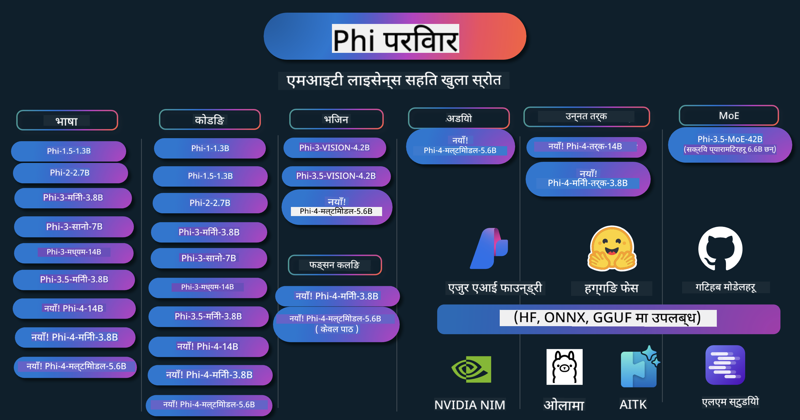

<!--
CO_OP_TRANSLATOR_METADATA:
{
  "original_hash": "1cab9282e04f2e1c388a38dca7763c16",
  "translation_date": "2025-05-09T03:48:10+00:00",
  "source_file": "README.md",
  "language_code": "ne"
}
-->
# Phi Cookbook: Microsoft का Phi मॉडलहरूसँग व्यावहारिक उदाहरणहरू

Phi Microsoft द्वारा विकास गरिएको खुला स्रोत AI मोडेलहरूको श्रृंखला हो।

Phi हाल सबैभन्दा शक्तिशाली र लागत-कुशल सानो भाषा मोडेल (SLM) हो, जसले बहुभाषिक, तर्क, पाठ/च्याट उत्पादन, कोडिङ, चित्र, अडियो र अन्य परिदृश्यहरूमा उत्कृष्ट प्रदर्शन गर्दछ।

तपाईं Phi लाई क्लाउड वा एज उपकरणहरूमा डिप्लोय गर्न सक्नुहुन्छ, र सीमित कम्प्युटिङ शक्ति सहित सजिलैसँग जनरेटिभ AI अनुप्रयोगहरू बनाउन सक्नुहुन्छ।

यी स्रोतहरू प्रयोग गर्न सुरु गर्न यी चरणहरू पालना गर्नुहोस्:
1. **रिपोजिटोरी Fork गर्नुहोस्**: क्लिक गर्नुहोस् 
2. **रिपोजिटोरी Clone गर्नुहोस्**: `git clone https://github.com/microsoft/PhiCookBook.git`
3. [**Microsoft AI Discord समुदायमा सामेल हुनुहोस् र विशेषज्ञ र अन्य विकासकर्ताहरूसँग भेट्नुहोस्**](https://discord.com/invite/ByRwuEEgH4?WT.mc_id=aiml-137032-kinfeylo)

## 🌐 बहुभाषिक समर्थन

### GitHub Action मार्फत समर्थन (स्वचालित र सधैं अपडेट हुने)

[French](../fr/README.md) | [Spanish](../es/README.md) | [German](../de/README.md) | [Russian](../ru/README.md) | [Arabic](../ar/README.md) | [Persian (Farsi)](../fa/README.md) | [Urdu](../ur/README.md) | [Chinese (Simplified)](../zh/README.md) | [Chinese (Traditional, Macau)](../mo/README.md) | [Chinese (Traditional, Hong Kong)](../hk/README.md) | [Chinese (Traditional, Taiwan)](../tw/README.md) | [Japanese](../ja/README.md) | [Korean](../ko/README.md) | [Hindi](../hi/README.md)

### CLI मार्फत समर्थन
## विषय सूची

- परिचय
- [Phi परिवारमा स्वागत छ](./md/01.Introduction/01/01.PhiFamily.md)
  - [आफ्नो वातावरण सेटअप गर्दै](./md/01.Introduction/01/01.EnvironmentSetup.md)
  - [प्रमुख प्रविधिहरू बुझ्दै](./md/01.Introduction/01/01.Understandingtech.md)
  - [Phi मोडेलहरूको लागि AI सुरक्षा](./md/01.Introduction/01/01.AISafety.md)
  - [Phi हार्डवेयर समर्थन](./md/01.Introduction/01/01.Hardwaresupport.md)
  - [Phi मोडेलहरू र प्लेटफर्महरूमा उपलब्धता](./md/01.Introduction/01/01.Edgeandcloud.md)
  - [Guidance-ai र Phi को प्रयोग](./md/01.Introduction/01/01.Guidance.md)
  - [GitHub Marketplace मोडेलहरू](https://github.com/marketplace/models)
  - [Azure AI मोडेल क्याटलग](https://ai.azure.com)

- विभिन्न वातावरणमा Phi को इनफेरेंस
    -  [Hugging face](./md/01.Introduction/02/01.HF.md)
    -  [GitHub मोडेलहरू](./md/01.Introduction/02/02.GitHubModel.md)
    -  [Azure AI Foundry मोडेल क्याटलग](./md/01.Introduction/02/03.AzureAIFoundry.md)
    -  [Ollama](./md/01.Introduction/02/04.Ollama.md)
    -  [AI Toolkit VSCode (AITK)](./md/01.Introduction/02/05.AITK.md)
    -  [NVIDIA NIM](./md/01.Introduction/02/06.NVIDIA.md)

- Phi परिवारमा इनफेरेंस
    - [iOS मा Phi इनफेरेंस](./md/01.Introduction/03/iOS_Inference.md)
    - [Android मा Phi इनफेरेंस](./md/01.Introduction/03/Android_Inference.md)
    - [Jetson मा Phi इनफेरेंस](./md/01.Introduction/03/Jetson_Inference.md)
    - [AI PC मा Phi इनफेरेंस](./md/01.Introduction/03/AIPC_Inference.md)
    - [Apple MLX Framework सँग Phi इनफेरेंस](./md/01.Introduction/03/MLX_Inference.md)
    - [स्थानीय सर्भरमा Phi इनफेरेंस](./md/01.Introduction/03/Local_Server_Inference.md)
    - [AI Toolkit प्रयोग गरेर रिमोट सर्भरमा Phi इनफेरेंस](./md/01.Introduction/03/Remote_Interence.md)
    - [Rust सँग Phi इनफेरेंस](./md/01.Introduction/03/Rust_Inference.md)
    - [स्थानीयमा Phi--Vision इनफेरेंस](./md/01.Introduction/03/Vision_Inference.md)
    - [Kaito AKS, Azure Containers (अधिकारिक समर्थन) सँग Phi इनफेरेंस](./md/01.Introduction/03/Kaito_Inference.md)
-  [Phi परिवारको क्वान्टिफाइङ](./md/01.Introduction/04/QuantifyingPhi.md)
    - [llama.cpp प्रयोग गरेर Phi-3.5 / 4 क्वान्टाइजिङ](./md/01.Introduction/04/UsingLlamacppQuantifyingPhi.md)
    - [onnxruntime को लागि Generative AI एक्सटेन्सन प्रयोग गरेर Phi-3.5 / 4 क्वान्टाइजिङ](./md/01.Introduction/04/UsingORTGenAIQuantifyingPhi.md)
    - [Intel OpenVINO प्रयोग गरेर Phi-3.5 / 4 क्वान्टाइजिङ](./md/01.Introduction/04/UsingIntelOpenVINOQuantifyingPhi.md)
    - [Apple MLX Framework प्रयोग गरेर Phi-3.5 / 4 क्वान्टाइजिङ](./md/01.Introduction/04/UsingAppleMLXQuantifyingPhi.md)

- Phi को मूल्यांकन
- [Response AI](./md/01.Introduction/05/ResponsibleAI.md)
    - [Azure AI Foundry for Evaluation](./md/01.Introduction/05/AIFoundry.md)
    - [Using Promptflow for Evaluation](./md/01.Introduction/05/Promptflow.md)
 
- RAG सँग Azure AI Search
    - [Azure AI Search सँग Phi-4-mini र Phi-4-multimodal(RAG) कसरी प्रयोग गर्ने](https://github.com/microsoft/PhiCookBook/blob/main/code/06.E2E/E2E_Phi-4-RAG-Azure-AI-Search.ipynb)

- Phi एप्लिकेशन विकास नमूनाहरू
  - पाठ र च्याट एप्लिकेशनहरू
    - Phi-4 नमूनाहरू 🆕
      - [📓] [Phi-4-mini ONNX मोडेलसँग च्याट गर्नुहोस्](./md/02.Application/01.TextAndChat/Phi4/ChatWithPhi4ONNX/README.md)
      - [Phi-4 स्थानीय ONNX मोडेल .NET सँग च्याट गर्नुहोस्](../../md/04.HOL/dotnet/src/LabsPhi4-Chat-01OnnxRuntime)
      - [Semantic Kernel प्रयोग गरी Phi-4 ONNX सँग .NET कन्सोल एप्लिकेशनमा च्याट](../../md/04.HOL/dotnet/src/LabsPhi4-Chat-02SK)
    - Phi-3 / 3.5 नमूनाहरू
      - [Phi3, ONNX Runtime Web र WebGPU प्रयोग गरी ब्राउजरमा स्थानीय च्याटबोट](https://github.com/microsoft/onnxruntime-inference-examples/tree/main/js/chat)
      - [OpenVino च्याट](./md/02.Application/01.TextAndChat/Phi3/E2E_OpenVino_Chat.md)
      - [धेरै मोडेल - अन्तरक्रियात्मक Phi-3-mini र OpenAI Whisper](./md/02.Application/01.TextAndChat/Phi3/E2E_Phi-3-mini_with_whisper.md)
      - [MLFlow - Phi-3 को लागि रैपर बनाउने र MLFlow सँग प्रयोग गर्ने](./md//02.Application/01.TextAndChat/Phi3/E2E_Phi-3-MLflow.md)
      - [मोडेल अनुकूलन - Olive प्रयोग गरी Phi-3-mini मोडेललाई ONNX Runtime Web का लागि कसरी अनुकूल गर्ने](https://github.com/microsoft/Olive/tree/main/examples/phi3)
      - [Phi-3 mini-4k-instruct-onnx सहित WinUI3 एप्लिकेशन](https://github.com/microsoft/Phi3-Chat-WinUI3-Sample/)
      - [WinUI3 धेरै मोडेल AI Powered नोट्स एप नमूना](https://github.com/microsoft/ai-powered-notes-winui3-sample)
      - [Prompt flow सँग कस्टम Phi-3 मोडेलहरू फाइन-ट्यून र एकीकृत गर्ने](./md/02.Application/01.TextAndChat/Phi3/E2E_Phi-3-FineTuning_PromptFlow_Integration.md)
      - [Azure AI Foundry मा Prompt flow सँग कस्टम Phi-3 मोडेलहरू फाइन-ट्यून र एकीकृत गर्ने](./md/02.Application/01.TextAndChat/Phi3/E2E_Phi-3-FineTuning_PromptFlow_Integration_AIFoundry.md)
      - [Microsoft को Responsible AI सिद्धान्तहरूमा केन्द्रित भएर Azure AI Foundry मा फाइन-ट्यून गरिएको Phi-3 / Phi-3.5 मोडेलको मूल्यांकन गर्ने](./md/02.Application/01.TextAndChat/Phi3/E2E_Phi-3-Evaluation_AIFoundry.md)
      - [📓] [Phi-3.5-mini-instruct भाषा पूर्वानुमान नमूना (चीनियाँ/अंग्रेजी)](../../md/02.Application/01.TextAndChat/Phi3/phi3-instruct-demo.ipynb)
      - [Phi-3.5-Instruct WebGPU RAG च्याटबोट](./md/02.Application/01.TextAndChat/Phi3/WebGPUWithPhi35Readme.md)
      - [Windows GPU प्रयोग गरी Phi-3.5-Instruct ONNX सँग Prompt flow समाधान बनाउने](./md/02.Application/01.TextAndChat/Phi3/UsingPromptFlowWithONNX.md)
      - [Microsoft Phi-3.5 tflite प्रयोग गरी Android एप बनाउने](./md/02.Application/01.TextAndChat/Phi3/UsingPhi35TFLiteCreateAndroidApp.md)
      - [Microsoft.ML.OnnxRuntime प्रयोग गरी स्थानीय ONNX Phi-3 मोडेलसँग Q&A .NET उदाहरण](../../md/04.HOL/dotnet/src/LabsPhi301)
      - [Semantic Kernel र Phi-3 सँग कन्सोल च्याट .NET एप](../../md/04.HOL/dotnet/src/LabsPhi302)

  - Azure AI Inference SDK कोड आधारित नमूनाहरू 
    - Phi-4 नमूनाहरू 🆕
      - [📓] [Phi-4-multimodal प्रयोग गरी प्रोजेक्ट कोड उत्पन्न गर्ने](./md/02.Application/02.Code/Phi4/GenProjectCode/README.md)
    - Phi-3 / 3.5 नमूनाहरू
      - [Microsoft Phi-3 परिवारसँग आफ्नो Visual Studio Code GitHub Copilot Chat बनाउने](./md/02.Application/02.Code/Phi3/VSCodeExt/README.md)
      - [GitHub मोडेलहरूसँग Phi-3.5 प्रयोग गरी आफ्नो Visual Studio Code Chat Copilot Agent सिर्जना गर्ने](/md/02.Application/02.Code/Phi3/CreateVSCodeChatAgentWithGitHubModels.md)

  - उन्नत तर्क नमूनाहरू
    - Phi-4 नमूनाहरू 🆕
      - [📓] [Phi-4-mini-reasoning वा Phi-4-reasoning नमूनाहरू](./md/02.Application/03.AdvancedReasoning/Phi4/AdvancedResoningPhi4mini/README.md)
      - [📓] [Microsoft Olive सँग Phi-4-mini-reasoning को फाइन-ट्यूनिंग](../../md/02.Application/03.AdvancedReasoning/Phi4/AdvancedResoningPhi4mini/olive_ft_phi_4_reasoning_with_medicaldata.ipynb)
      - [📓] [Apple MLX सँग Phi-4-mini-reasoning को फाइन-ट्यूनिंग](../../md/02.Application/03.AdvancedReasoning/Phi4/AdvancedResoningPhi4mini/mlx_ft_phi_4_reasoning_with_medicaldata.ipynb)
      - [📓] [GitHub मोडेलहरूसँग Phi-4-mini-reasoning](../../md/02.Application/02.Code/Phi4r/github_models_inference.ipynb)
- [📓] [Phi-4-mini reasoning with Azure AI Foundry Models](../../md/02.Application/02.Code/Phi4r/azure_models_inference.ipynb)
  - Demos
      - [Phi-4-mini demos hosted on Hugging Face Spaces](https://huggingface.co/spaces/microsoft/phi-4-mini?WT.mc_id=aiml-137032-kinfeylo)
      - [Phi-4-multimodal demos hosted on Hugginge Face Spaces](https://huggingface.co/spaces/microsoft/phi-4-multimodal?WT.mc_id=aiml-137032-kinfeylo)
  - Vision Samples
    - Phi-4 Samples 🆕
      - [📓] [Use Phi-4-multimodal to read images and generate code](./md/02.Application/04.Vision/Phi4/CreateFrontend/README.md) 
    - Phi-3 / 3.5 Samples
      -  [📓][Phi-3-vision-Image text to text](../../md/02.Application/04.Vision/Phi3/E2E_Phi-3-vision-image-text-to-text-online-endpoint.ipynb)
      - [Phi-3-vision-ONNX](https://onnxruntime.ai/docs/genai/tutorials/phi3-v.html)
      - [📓][Phi-3-vision CLIP Embedding](../../md/02.Application/04.Vision/Phi3/E2E_Phi-3-vision-image-text-to-text-online-endpoint.ipynb)
      - [DEMO: Phi-3 Recycling](https://github.com/jennifermarsman/PhiRecycling/)
      - [Phi-3-vision - Visual language assistant - with Phi3-Vision and OpenVINO](https://docs.openvino.ai/nightly/notebooks/phi-3-vision-with-output.html)
      - [Phi-3 Vision Nvidia NIM](./md/02.Application/04.Vision/Phi3/E2E_Nvidia_NIM_Vision.md)
      - [Phi-3 Vision OpenVino](./md/02.Application/04.Vision/Phi3/E2E_OpenVino_Phi3Vision.md)
      - [📓][Phi-3.5 Vision multi-frame or multi-image sample](../../md/02.Application/04.Vision/Phi3/phi3-vision-demo.ipynb)
      - [Phi-3 Vision Local ONNX Model using the Microsoft.ML.OnnxRuntime .NET](../../md/04.HOL/dotnet/src/LabsPhi303)
      - [Menu based Phi-3 Vision Local ONNX Model using the Microsoft.ML.OnnxRuntime .NET](../../md/04.HOL/dotnet/src/LabsPhi304)

  - Audio Samples
    - Phi-4 Samples 🆕
      - [📓] [Extracting audio transcripts using Phi-4-multimodal](./md/02.Application/05.Audio/Phi4/Transciption/README.md)
      - [📓] [Phi-4-multimodal Audio Sample](../../md/02.Application/05.Audio/Phi4/Siri/demo.ipynb)
      - [📓] [Phi-4-multimodal Speech Translation Sample](../../md/02.Application/05.Audio/Phi4/Translate/demo.ipynb)
      - [.NET console application using Phi-4-multimodal Audio to analyze an audio file and generate transcript](../../md/04.HOL/dotnet/src/LabsPhi4-MultiModal-02Audio)

  - MOE Samples
    - Phi-3 / 3.5 Samples
      - [📓] [Phi-3.5 Mixture of Experts Models (MoEs) Social Media Sample](../../md/02.Application/06.MoE/Phi3/phi3_moe_demo.ipynb)
      - [📓] [Building a Retrieval-Augmented Generation (RAG) Pipeline with NVIDIA NIM Phi-3 MOE, Azure AI Search, and LlamaIndex](../../md/02.Application/06.MoE/Phi3/azure-ai-search-nvidia-rag.ipynb)
  - Function Calling Samples
    - Phi-4 Samples 🆕
      -  [📓] [Using Function Calling With Phi-4-mini](./md/02.Application/07.FunctionCalling/Phi4/FunctionCallingBasic/README.md)
      -  [📓] [Using Function Calling to create multi-agents With Phi-4-mini](../../md/02.Application/07.FunctionCalling/Phi4/Multiagents/Phi_4_mini_multiagent.ipynb)
      -  [📓] [Using Function Calling with Ollama](../../md/02.Application/07.FunctionCalling/Phi4/Ollama/ollama_functioncalling.ipynb)
  - Multimodal Mixing Samples
    - Phi-4 Samples 🆕
      -  [📓] [Using Phi-4-multimodal as a Technology journalist](../../md/02.Application/08.Multimodel/Phi4/TechJournalist/phi_4_mm_audio_text_publish_news.ipynb)
      - [.NET console application using Phi-4-multimodal to analyze images](../../md/04.HOL/dotnet/src/LabsPhi4-MultiModal-01Images)

- Fine-tuning Phi Samples
  - [Fine-tuning Scenarios](./md/03.FineTuning/FineTuning_Scenarios.md)
  - [Fine-tuning vs RAG](./md/03.FineTuning/FineTuning_vs_RAG.md)
  - [Fine-tuning Let Phi-3 become an industry expert](./md/03.FineTuning/LetPhi3gotoIndustriy.md)
  - [Fine-tuning Phi-3 with AI Toolkit for VS Code](./md/03.FineTuning/Finetuning_VSCodeaitoolkit.md)
  - [Fine-tuning Phi-3 with Azure Machine Learning Service](./md/03.FineTuning/Introduce_AzureML.md)
- [Fine-tuning Phi-3 with Lora](./md/03.FineTuning/FineTuning_Lora.md)
  - [Fine-tuning Phi-3 with QLora](./md/03.FineTuning/FineTuning_Qlora.md)
  - [Fine-tuning Phi-3 with Azure AI Foundry](./md/03.FineTuning/FineTuning_AIFoundry.md)
  - [Fine-tuning Phi-3 with Azure ML CLI/SDK](./md/03.FineTuning/FineTuning_MLSDK.md)
  - [Fine-tuning with Microsoft Olive](./md/03.FineTuning/FineTuning_MicrosoftOlive.md)
  - [Fine-tuning with Microsoft Olive Hands-On Lab](./md/03.FineTuning/olive-lab/readme.md)
  - [Fine-tuning Phi-3-vision with Weights and Bias](./md/03.FineTuning/FineTuning_Phi-3-visionWandB.md)
  - [Fine-tuning Phi-3 with Apple MLX Framework](./md/03.FineTuning/FineTuning_MLX.md)
  - [Fine-tuning Phi-3-vision (official support)](./md/03.FineTuning/FineTuning_Vision.md)
  - [Fine-Tuning Phi-3 with Kaito AKS , Azure Containers(official Support)](./md/03.FineTuning/FineTuning_Kaito.md)
  - [Fine-Tuning Phi-3 and 3.5 Vision](https://github.com/2U1/Phi3-Vision-Finetune)

- Hands on Lab
  - [Exploring cutting-edge models: LLMs, SLMs, local development and more](https://github.com/microsoft/aitour-exploring-cutting-edge-models)
  - [Unlocking NLP Potential: Fine-Tuning with Microsoft Olive](https://github.com/azure/Ignite_FineTuning_workshop)

- Academic Research Papers and Publications
  - [Textbooks Are All You Need II: phi-1.5 technical report](https://arxiv.org/abs/2309.05463)
  - [Phi-3 Technical Report: A Highly Capable Language Model Locally on Your Phone](https://arxiv.org/abs/2404.14219)
  - [Phi-4 Technical Report](https://arxiv.org/abs/2412.08905)
  - [Phi-4-Mini Technical Report: Compact yet Powerful Multimodal Language Models via Mixture-of-LoRAs](https://arxiv.org/abs/2503.01743)
  - [Optimizing Small Language Models for In-Vehicle Function-Calling](https://arxiv.org/abs/2501.02342)
  - [(WhyPHI) Fine-Tuning PHI-3 for Multiple-Choice Question Answering: Methodology, Results, and Challenges](https://arxiv.org/abs/2501.01588)
  - [Phi-4-reasoning Technical Report](https://www.microsoft.com/en-us/research/wp-content/uploads/2025/04/phi_4_reasoning.pdf)
  - [Phi-4-mini-reasoning Technical Report](https://huggingface.co/microsoft/Phi-4-mini-reasoning/blob/main/Phi-4-Mini-Reasoning.pdf)

## Phi मोडेलहरू प्रयोग गर्ने तरिका

### Azure AI Foundry मा Phi

तपाईं Microsoft Phi कसरी प्रयोग गर्ने र विभिन्न हार्डवेयर उपकरणहरूमा E2E समाधान कसरी निर्माण गर्ने सिक्न सक्नुहुन्छ। आफैं Phi अनुभव गर्न, मोडेलहरूसँग खेल्न सुरु गर्नुहोस् र आफ्नो परिदृश्यका लागि Phi अनुकूलित गर्न [Azure AI Foundry Azure AI Model Catalog](https://aka.ms/phi3-azure-ai) प्रयोग गर्नुहोस्। थप जान्नको लागि [Azure AI Foundry](./md/02.QuickStart/AzureAIFoundry_QuickStart.md) बाट सुरुवात गर्नुहोस्।

**Playground**  
प्रत्येक मोडेलको परीक्षण गर्नको लागि समर्पित playground छ [Azure AI Playground](https://aka.ms/try-phi3)।

### GitHub मोडेलहरूमा Phi

तपाईं Microsoft Phi कसरी प्रयोग गर्ने र विभिन्न हार्डवेयर उपकरणहरूमा E2E समाधान कसरी निर्माण गर्ने सिक्न सक्नुहुन्छ। आफैं Phi अनुभव गर्न, मोडेलसँग खेल्न सुरु गर्नुहोस् र आफ्नो परिदृश्यका लागि Phi अनुकूलित गर्न [GitHub Model Catalog](https://github.com/marketplace/models?WT.mc_id=aiml-137032-kinfeylo) प्रयोग गर्नुहोस्। थप जान्नको लागि [GitHub Model Catalog](./md/02.QuickStart/GitHubModel_QuickStart.md) बाट सुरुवात गर्नुहोस्।

**Playground**  
प्रत्येक मोडेलको परीक्षण गर्न समर्पित [playground छ](/md/02.QuickStart/GitHubModel_QuickStart.md)।

### Hugging Face मा Phi

तपाईं मोडेललाई [Hugging Face](https://huggingface.co/microsoft) मा पनि भेट्टाउन सक्नुहुन्छ।

**Playground**  
[Hugging Chat playground](https://huggingface.co/chat/models/microsoft/Phi-3-mini-4k-instruct)

## जिम्मेवार AI

Microsoft ले हाम्रा ग्राहकहरूलाई AI उत्पादनहरू जिम्मेवार तरिकाले प्रयोग गर्न मद्दत पुर्‍याउन प्रतिबद्ध छ, हाम्रा सिकाइहरू साझा गर्ने र Transparency Notes र Impact Assessments जस्ता उपकरणमार्फत विश्वासमा आधारित साझेदारीहरू निर्माण गर्ने। यी स्रोतहरूको धेरै [https://aka.ms/RAI](https://aka.ms/RAI) मा उपलब्ध छन्।  
Microsoft को जिम्मेवार AI दृष्टिकोण हाम्रो AI सिद्धान्तहरूमा आधारित छ जसमा fairness, reliability र safety, privacy र security, inclusiveness, transparency, र accountability समावेश छन्।
ठूला स्तरको प्राकृतिक भाषा, छवि, र भाषण मोडेलहरू - जस्तै यस नमुनामा प्रयोग गरिएका - सम्भावित रूपमा अन्यायपूर्ण, अविश्वसनीय, वा अपमानजनक तरिकाले व्यवहार गर्न सक्छन्, जसले हानि पुर्‍याउन सक्छ। कृपया जोखिम र सीमाहरूको बारेमा जानकारी पाउन [Azure OpenAI service Transparency note](https://learn.microsoft.com/legal/cognitive-services/openai/transparency-note?tabs=text) सल्लाह लिनुहोस्।

यी जोखिमहरू कम गर्न सिफारिस गरिएको उपाय भनेको तपाईँको संरचनामा यस्तो सुरक्षा प्रणाली समावेश गर्नु हो जसले हानिकारक व्यवहार पत्ता लगाउन र रोक्न सक्छ। [Azure AI Content Safety](https://learn.microsoft.com/azure/ai-services/content-safety/overview) एक स्वतन्त्र सुरक्षा तह प्रदान गर्दछ, जसले अनुप्रयोग र सेवाहरूमा हानिकारक प्रयोगकर्ता-निर्मित र AI-निर्मित सामग्री पत्ता लगाउन सक्छ। Azure AI Content Safety मा पाठ र छवि API हरू समावेश छन् जसले हानिकारक सामग्री पत्ता लगाउन अनुमति दिन्छ। Azure AI Foundry भित्र, Content Safety सेवा तपाईँलाई विभिन्न मोडालिटीहरूमा हानिकारक सामग्री पत्ता लगाउन नमूना कोड हेर्न, अन्वेषण गर्न र प्रयास गर्न अनुमति दिन्छ। तलको [quickstart documentation](https://learn.microsoft.com/azure/ai-services/content-safety/quickstart-text?tabs=visual-studio%2Clinux&pivots=programming-language-rest) ले तपाईँलाई सेवामा अनुरोधहरू कसरी गर्ने भनेर मार्गदर्शन गर्दछ।

अर्को ध्यान दिनुपर्ने पक्ष भनेको समग्र अनुप्रयोगको प्रदर्शन हो। बहु-मोडाल र बहु-मोडेल अनुप्रयोगहरूमा, प्रदर्शनको अर्थ हो प्रणालीले तपाईँ र तपाईँका प्रयोगकर्ताहरूले अपेक्षा गरेजस्तै काम गर्नु, जसमा हानिकारक नतिजाहरू नउत्पन्न हुनु पनि समावेश छ। तपाईँले आफ्नो समग्र अनुप्रयोगको प्रदर्शन मूल्यांकन गर्न [Performance and Quality and Risk and Safety evaluators](https://learn.microsoft.com/azure/ai-studio/concepts/evaluation-metrics-built-in) प्रयोग गर्नुपर्छ। तपाईँसँग [custom evaluators](https://learn.microsoft.com/azure/ai-studio/how-to/develop/evaluate-sdk#custom-evaluators) सिर्जना र मूल्यांकन गर्ने क्षमता पनि छ।

तपाईँले आफ्नो विकास वातावरणमा [Azure AI Evaluation SDK](https://microsoft.github.io/promptflow/index.html) प्रयोग गरी आफ्नो AI अनुप्रयोग मूल्यांकन गर्न सक्नुहुन्छ। परीक्षण डाटासेट वा लक्ष्य दिइएपछि, तपाईँको जनरेटिभ AI अनुप्रयोगका उत्पादनहरू स्वचालित मूल्यांकनकर्ताहरू वा तपाईँले रोजेका अनुकूल मूल्यांकनकर्ताहरूको माध्यमबाट मात्रात्मक रूपमा मापन गरिन्छ। आफ्नो प्रणाली मूल्यांकन गर्न azure ai evaluation sdk सँग सुरु गर्न, तपाईँले [quickstart guide](https://learn.microsoft.com/azure/ai-studio/how-to/develop/flow-evaluate-sdk) अनुसरण गर्न सक्नुहुन्छ। मूल्यांकन चलाएपछि, तपाईँ [Azure AI Foundry मा परिणामहरू दृश्यात्मक रूपमा हेर्न](https://learn.microsoft.com/azure/ai-studio/how-to/evaluate-flow-results) सक्नुहुन्छ।

## Trademarks

यस परियोजनामा परियोजना, उत्पादन, वा सेवाका ट्रेडमार्क वा लोगोहरू समावेश हुन सक्छन्। Microsoft ट्रेडमार्क वा लोगोहरूको अधिकृत प्रयोग [Microsoft's Trademark & Brand Guidelines](https://www.microsoft.com/legal/intellectualproperty/trademarks/usage/general) अनुसार हुनुपर्छ र त्यसलाई पालना गर्नुपर्छ। यस परियोजनाको परिमार्जित संस्करणहरूमा Microsoft ट्रेडमार्क वा लोगोहरूको प्रयोगले भ्रम सिर्जना गर्नु हुँदैन वा Microsoft को प्रायोजन संकेत गर्नु हुँदैन। तेस्रो पक्षका ट्रेडमार्क वा लोगोहरूको कुनै पनि प्रयोग तिनका नीतिहरू अनुसार हुनेछ।

**अस्वीकरण**:  
यो दस्तावेज AI अनुवाद सेवा [Co-op Translator](https://github.com/Azure/co-op-translator) को प्रयोग गरेर अनुवाद गरिएको हो। हामी सटीकताको प्रयास गर्छौं भने पनि, कृपया ध्यान दिनुहोस् कि स्वचालित अनुवादमा त्रुटिहरू वा असत्यताहरू हुन सक्छन्। मूल दस्तावेजलाई यसको मातृभाषामा आधिकारिक स्रोतको रूपमा मानिनु पर्छ। महत्वपूर्ण जानकारीको लागि, व्यावसायिक मानव अनुवाद सिफारिस गरिन्छ। यस अनुवादको प्रयोगबाट उत्पन्न कुनै पनि गलतफहमी वा गलत व्याख्याका लागि हामी जिम्मेवार छैनौं।