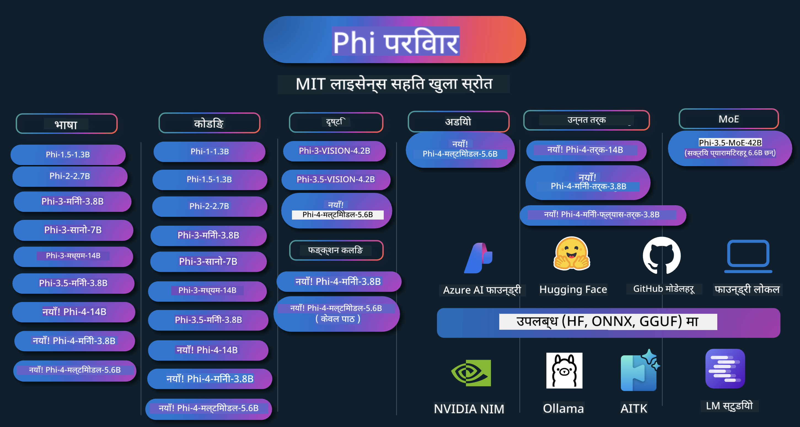

<!--
CO_OP_TRANSLATOR_METADATA:
{
  "original_hash": "5c07bb4c3c89a36c9be332a065a9a33c",
  "translation_date": "2025-07-16T15:05:45+00:00",
  "source_file": "README.md",
  "language_code": "ne"
}
-->
# Phi कुकबुक: Microsoft का Phi मोडेलहरूसँग व्यावहारिक उदाहरणहरू

  

  
  
  

  
  

Phi Microsoft द्वारा विकास गरिएको खुला स्रोत AI मोडेलहरूको श्रृंखला हो।

Phi हाल सबैभन्दा शक्तिशाली र लागत-कुशल सानो भाषा मोडेल (SLM) हो, जसले बहुभाषिक, तर्क, पाठ/च्याट उत्पादन, कोडिङ, छवि, अडियो र अन्य परिदृश्यहरूमा उत्कृष्ट प्रदर्शन देखाएको छ।

तपाईं Phi लाई क्लाउड वा एज उपकरणहरूमा तैनाथ गर्न सक्नुहुन्छ, र सीमित कम्प्युटिङ शक्ति प्रयोग गरेर सजिलै जनरेटिभ AI अनुप्रयोगहरू बनाउन सक्नुहुन्छ।

यी स्रोतहरू प्रयोग गर्न सुरु गर्न यी चरणहरू पालना गर्नुहोस्:  
1. **रिपोजिटरी फोर्क गर्नुहोस्**: क्लिक गर्नुहोस्   
2. **रिपोजिटरी क्लोन गर्नुहोस्**: `git clone https://github.com/microsoft/PhiCookBook.git`  
3. [**Microsoft AI Discord समुदायमा सामेल हुनुहोस् र विशेषज्ञ तथा अन्य विकासकर्ताहरूसँग भेट्नुहोस्**](https://discord.com/invite/ByRwuEEgH4?WT.mc_id=aiml-137032-kinfeylo)

### 🌐 बहुभाषिक समर्थन

#### GitHub Action मार्फत समर्थित (स्वचालित र सधैं अपडेट हुने)

[French](../fr/README.md) | [Spanish](../es/README.md) | [German](../de/README.md) | [Russian](../ru/README.md) | [Arabic](../ar/README.md) | [Persian (Farsi)](../fa/README.md) | [Urdu](../ur/README.md) | [Chinese (Simplified)](../zh/README.md) | [Chinese (Traditional, Macau)](../mo/README.md) | [Chinese (Traditional, Hong Kong)](../hk/README.md) | [Chinese (Traditional, Taiwan)](../tw/README.md) | [Japanese](../ja/README.md) | [Korean](../ko/README.md) | [Hindi](../hi/README.md)  
[Bengali](../bn/README.md) | [Marathi](../mr/README.md) | [Nepali](./README.md) | [Punjabi (Gurmukhi)](../pa/README.md) | [Portuguese (Portugal)](../pt/README.md) | [Portuguese (Brazil)](../br/README.md) | [Italian](../it/README.md) | [Polish](../pl/README.md) | [Turkish](../tr/README.md) | [Greek](../el/README.md) | [Thai](../th/README.md) | [Swedish](../sv/README.md) | [Danish](../da/README.md) | [Norwegian](../no/README.md) | [Finnish](../fi/README.md) | [Dutch](../nl/README.md) | [Hebrew](../he/README.md) | [Vietnamese](../vi/README.md) | [Indonesian](../id/README.md) | [Malay](../ms/README.md) | [Tagalog (Filipino)](../tl/README.md) | [Swahili](../sw/README.md) | [Hungarian](../hu/README.md) | [Czech](../cs/README.md) | [Slovak](../sk/README.md) | [Romanian](../ro/README.md) | [Bulgarian](../bg/README.md) | [Serbian (Cyrillic)](../sr/README.md) | [Croatian](../hr/README.md) | [Slovenian](../sl/README.md)

## सामग्री तालिका

- परिचय  
  - [Phi परिवारमा स्वागत छ](./md/01.Introduction/01/01.PhiFamily.md)  
  - [आफ्नो वातावरण सेटअप गर्ने तरिका](./md/01.Introduction/01/01.EnvironmentSetup.md)  
  - [प्रमुख प्रविधिहरू बुझ्ने](./md/01.Introduction/01/01.Understandingtech.md)  
  - [Phi मोडेलहरूको लागि AI सुरक्षा](./md/01.Introduction/01/01.AISafety.md)  
  - [Phi हार्डवेयर समर्थन](./md/01.Introduction/01/01.Hardwaresupport.md)  
  - [Phi मोडेलहरू र प्लेटफर्महरूमा उपलब्धता](./md/01.Introduction/01/01.Edgeandcloud.md)  
  - [Guidance-ai र Phi को प्रयोग](./md/01.Introduction/01/01.Guidance.md)  
  - [GitHub Marketplace मोडेलहरू](https://github.com/marketplace/models)  
  - [Azure AI मोडेल क्याटलग](https://ai.azure.com)

- विभिन्न वातावरणमा Phi को इन्फरेन्स  
  - [Hugging face](./md/01.Introduction/02/01.HF.md)  
  - [GitHub मोडेलहरू](./md/01.Introduction/02/02.GitHubModel.md)  
  - [Azure AI Foundry मोडेल क्याटलग](./md/01.Introduction/02/03.AzureAIFoundry.md)  
  - [Ollama](./md/01.Introduction/02/04.Ollama.md)  
  - [AI Toolkit VSCode (AITK)](./md/01.Introduction/02/05.AITK.md)  
  - [NVIDIA NIM](./md/01.Introduction/02/06.NVIDIA.md)  
  - [Foundry Local](./md/01.Introduction/02/07.FoundryLocal.md)

- Phi परिवारको इन्फरेन्स  
  - [iOS मा Phi को इन्फरेन्स](./md/01.Introduction/03/iOS_Inference.md)  
  - [Android मा Phi को इन्फरेन्स](./md/01.Introduction/03/Android_Inference.md)  
  - [Jetson मा Phi को इन्फरेन्स](./md/01.Introduction/03/Jetson_Inference.md)  
  - [AI PC मा Phi को इन्फरेन्स](./md/01.Introduction/03/AIPC_Inference.md)  
  - [Apple MLX Framework सँग Phi को इन्फरेन्स](./md/01.Introduction/03/MLX_Inference.md)  
  - [स्थानीय सर्भरमा Phi को इन्फरेन्स](./md/01.Introduction/03/Local_Server_Inference.md)  
  - [AI Toolkit प्रयोग गरी रिमोट सर्भरमा Phi को इन्फरेन्स](./md/01.Introduction/03/Remote_Interence.md)  
  - [Rust सँग Phi को इन्फरेन्स](./md/01.Introduction/03/Rust_Inference.md)  
  - [स्थानीयमा Phi--Vision को इन्फरेन्स](./md/01.Introduction/03/Vision_Inference.md)  
  - [Kaito AKS, Azure Containers (आधिकारिक समर्थन) सँग Phi को इन्फरेन्स](./md/01.Introduction/03/Kaito_Inference.md)  
- [Phi परिवारको क्वान्टिफाइङ](./md/01.Introduction/04/QuantifyingPhi.md)  
  - [llama.cpp प्रयोग गरी Phi-3.5 / 4 को क्वान्टाइजिङ](./md/01.Introduction/04/UsingLlamacppQuantifyingPhi.md)  
  - [onnxruntime का लागि जनरेटिभ AI एक्सटेन्सनहरू प्रयोग गरी Phi-3.5 / 4 को क्वान्टाइजिङ](./md/01.Introduction/04/UsingORTGenAIQuantifyingPhi.md)  
  - [Intel OpenVINO प्रयोग गरी Phi-3.5 / 4 को क्वान्टाइजिङ](./md/01.Introduction/04/UsingIntelOpenVINOQuantifyingPhi.md)  
  - [Apple MLX Framework प्रयोग गरी Phi-3.5 / 4 को क्वान्टाइजिङ](./md/01.Introduction/04/UsingAppleMLXQuantifyingPhi.md)

- Phi को मूल्याङ्कन  
  - [Responsible AI](./md/01.Introduction/05/ResponsibleAI.md)  
  - [मूल्याङ्कनका लागि Azure AI Foundry](./md/01.Introduction/05/AIFoundry.md)  
  - [मूल्याङ्कनका लागि Promptflow को प्रयोग](./md/01.Introduction/05/Promptflow.md)

- Azure AI Search सँग RAG  
  - [Phi-4-mini र Phi-4-multimodal(RAG) लाई Azure AI Search सँग कसरी प्रयोग गर्ने](https://github.com/microsoft/PhiCookBook/blob/main/code/06.E2E/E2E_Phi-4-RAG-Azure-AI-Search.ipynb)

- Phi अनुप्रयोग विकास नमूनाहरू  
  - पाठ र च्याट अनुप्रयोगहरू  
    - Phi-4 नमूनाहरू 🆕  
      - [📓] [Phi-4-mini ONNX मोडेलसँग च्याट गर्नुहोस्](./md/02.Application/01.TextAndChat/Phi4/ChatWithPhi4ONNX/README.md)  
      - [Phi-4 स्थानीय ONNX मोडेलसँग च्याट .NET](../../md/04.HOL/dotnet/src/LabsPhi4-Chat-01OnnxRuntime)  
      - [Semantic Kernel प्रयोग गरी Phi-4 ONNX सँग .NET कन्सोल एप्लिकेसनमा च्याट](../../md/04.HOL/dotnet/src/LabsPhi4-Chat-02SK)  
    - Phi-3 / 3.5 नमूनाहरू  
      - [Phi3, ONNX Runtime Web र WebGPU प्रयोग गरी ब्राउजरमा स्थानीय च्याटबोट](https://github.com/microsoft/onnxruntime-inference-examples/tree/main/js/chat)  
      - [OpenVino च्याट](./md/02.Application/01.TextAndChat/Phi3/E2E_OpenVino_Chat.md)  
      - [बहु मोडेल - अन्तरक्रियात्मक Phi-3-mini र OpenAI Whisper](./md/02.Application/01.TextAndChat/Phi3/E2E_Phi-3-mini_with_whisper.md)  
      - [MLFlow - Phi-3 सँग MLFlow प्रयोग गरी र्यापर बनाउने](./md//02.Application/01.TextAndChat/Phi3/E2E_Phi-3-MLflow.md)  
      - [मोडेल अप्टिमाइजेसन - ONNX Runtime Web का लागि Phi-3-mini मोडेल कसरी अप्टिमाइज गर्ने Olive प्रयोग गरी](https://github.com/microsoft/Olive/tree/main/examples/phi3)  
      - [Phi-3 mini-4k-instruct-onnx सँग WinUI3 एप्लिकेसन](https://github.com/microsoft/Phi3-Chat-WinUI3-Sample/)  
      - [WinUI3 बहु मोडेल AI पावर्ड नोट्स एप्लिकेसन नमूना](https://github.com/microsoft/ai-powered-notes-winui3-sample)
- [Prompt flow सँग कस्टम Phi-3 मोडेलहरूलाई Fine-tune र एकीकृत गर्ने](./md/02.Application/01.TextAndChat/Phi3/E2E_Phi-3-FineTuning_PromptFlow_Integration.md)
- [Azure AI Foundry मा Prompt flow सँग कस्टम Phi-3 मोडेलहरूलाई Fine-tune र एकीकृत गर्ने](./md/02.Application/01.TextAndChat/Phi3/E2E_Phi-3-FineTuning_PromptFlow_Integration_AIFoundry.md)
- [Microsoft को Responsible AI सिद्धान्तहरूमा केन्द्रित भएर Azure AI Foundry मा Fine-tuned Phi-3 / Phi-3.5 मोडेलको मूल्याङ्कन गर्ने](./md/02.Application/01.TextAndChat/Phi3/E2E_Phi-3-Evaluation_AIFoundry.md)
- [📓] [Phi-3.5-mini-instruct भाषा पूर्वानुमान नमूना (चिनियाँ/अंग्रेजी)](../../md/02.Application/01.TextAndChat/Phi3/phi3-instruct-demo.ipynb)
- [Phi-3.5-Instruct WebGPU RAG Chatbot](./md/02.Application/01.TextAndChat/Phi3/WebGPUWithPhi35Readme.md)
- [Windows GPU प्रयोग गरेर Phi-3.5-Instruct ONNX सँग Prompt flow समाधान सिर्जना गर्ने](./md/02.Application/01.TextAndChat/Phi3/UsingPromptFlowWithONNX.md)
- [Microsoft Phi-3.5 tflite प्रयोग गरेर Android एप बनाउने](./md/02.Application/01.TextAndChat/Phi3/UsingPhi35TFLiteCreateAndroidApp.md)
- [Microsoft.ML.OnnxRuntime प्रयोग गरी स्थानीय ONNX Phi-3 मोडेलसँग Q&A .NET उदाहरण](../../md/04.HOL/dotnet/src/LabsPhi301)
- [Semantic Kernel र Phi-3 सँग Console chat .NET एप](../../md/04.HOL/dotnet/src/LabsPhi302)

- Azure AI Inference SDK कोड आधारित नमूनाहरू  
  - Phi-4 नमूनाहरू 🆕  
    - [📓] [Phi-4-multimodal प्रयोग गरी प्रोजेक्ट कोड उत्पन्न गर्ने](./md/02.Application/02.Code/Phi4/GenProjectCode/README.md)  
  - Phi-3 / 3.5 नमूनाहरू  
    - [Microsoft Phi-3 परिवारसँग आफ्नो Visual Studio Code GitHub Copilot Chat बनाउने](./md/02.Application/02.Code/Phi3/VSCodeExt/README.md)  
    - [GitHub मोडेलहरू प्रयोग गरी Phi-3.5 सँग आफ्नो Visual Studio Code Chat Copilot Agent सिर्जना गर्ने](/md/02.Application/02.Code/Phi3/CreateVSCodeChatAgentWithGitHubModels.md)  

- उन्नत तर्क नमूनाहरू  
  - Phi-4 नमूनाहरू 🆕  
    - [📓] [Phi-4-mini-reasoning वा Phi-4-reasoning नमूनाहरू](./md/02.Application/03.AdvancedReasoning/Phi4/AdvancedResoningPhi4mini/README.md)  
    - [📓] [Microsoft Olive सँग Phi-4-mini-reasoning को Fine-tuning](../../md/02.Application/03.AdvancedReasoning/Phi4/AdvancedResoningPhi4mini/olive_ft_phi_4_reasoning_with_medicaldata.ipynb)  
    - [📓] [Apple MLX सँग Phi-4-mini-reasoning को Fine-tuning](../../md/02.Application/03.AdvancedReasoning/Phi4/AdvancedResoningPhi4mini/mlx_ft_phi_4_reasoning_with_medicaldata.ipynb)  
    - [📓] [GitHub मोडेलहरूसँग Phi-4-mini-reasoning](../../md/02.Application/02.Code/Phi4r/github_models_inference.ipynb)  
    - [📓] [Azure AI Foundry मोडेलहरूसँग Phi-4-mini-reasoning](../../md/02.Application/02.Code/Phi4r/azure_models_inference.ipynb)  
- डेमोहरू  
    - [Phi-4-mini डेमोहरू Hugging Face Spaces मा होस्ट गरिएको](https://huggingface.co/spaces/microsoft/phi-4-mini?WT.mc_id=aiml-137032-kinfeylo)  
    - [Phi-4-multimodal डेमोहरू Hugging Face Spaces मा होस्ट गरिएको](https://huggingface.co/spaces/microsoft/phi-4-multimodal?WT.mc_id=aiml-137032-kinfeylo)  
- भिजन नमूनाहरू  
  - Phi-4 नमूनाहरू 🆕  
    - [📓] [Phi-4-multimodal प्रयोग गरी तस्बिरहरू पढ्ने र कोड उत्पन्न गर्ने](./md/02.Application/04.Vision/Phi4/CreateFrontend/README.md)  
  - Phi-3 / 3.5 नमूनाहरू  
    - [📓][Phi-3-vision-तस्बिरबाट पाठमा रूपान्तरण](../../md/02.Application/04.Vision/Phi3/E2E_Phi-3-vision-image-text-to-text-online-endpoint.ipynb)  
    - [Phi-3-vision-ONNX](https://onnxruntime.ai/docs/genai/tutorials/phi3-v.html)  
    - [📓][Phi-3-vision CLIP एम्बेडिङ](../../md/02.Application/04.Vision/Phi3/E2E_Phi-3-vision-image-text-to-text-online-endpoint.ipynb)  
    - [डेमो: Phi-3 रिसाइकलिङ](https://github.com/jennifermarsman/PhiRecycling/)  
    - [Phi-3-vision - भिजुअल भाषा सहायक - Phi3-Vision र OpenVINO सँग](https://docs.openvino.ai/nightly/notebooks/phi-3-vision-with-output.html)  
    - [Phi-3 Vision Nvidia NIM](./md/02.Application/04.Vision/Phi3/E2E_Nvidia_NIM_Vision.md)  
    - [Phi-3 Vision OpenVino](./md/02.Application/04.Vision/Phi3/E2E_OpenVino_Phi3Vision.md)  
    - [📓][Phi-3.5 Vision बहु-फ्रेम वा बहु-तस्बिर नमूना](../../md/02.Application/04.Vision/Phi3/phi3-vision-demo.ipynb)  
    - [Microsoft.ML.OnnxRuntime .NET प्रयोग गरी स्थानीय ONNX मोडेलसहित Phi-3 Vision](../../md/04.HOL/dotnet/src/LabsPhi303)  
    - [मेनु आधारित Microsoft.ML.OnnxRuntime .NET प्रयोग गरी स्थानीय ONNX मोडेलसहित Phi-3 Vision](../../md/04.HOL/dotnet/src/LabsPhi304)  

- गणित नमूनाहरू  
  - Phi-4-Mini-Flash-Reasoning-Instruct नमूनाहरू 🆕 [Phi-4-Mini-Flash-Reasoning-Instruct सँग गणित डेमो](../../md/02.Application/09.Math/MathDemo.ipynb)  

- अडियो नमूनाहरू  
  - Phi-4 नमूनाहरू 🆕  
    - [📓] [Phi-4-multimodal प्रयोग गरी अडियो ट्रान्सक्रिप्ट निकाल्ने](./md/02.Application/05.Audio/Phi4/Transciption/README.md)  
    - [📓] [Phi-4-multimodal अडियो नमूना](../../md/02.Application/05.Audio/Phi4/Siri/demo.ipynb)  
    - [📓] [Phi-4-multimodal भाषण अनुवाद नमूना](../../md/02.Application/05.Audio/Phi4/Translate/demo.ipynb)  
    - [Phi-4-multimodal प्रयोग गरी अडियो फाइल विश्लेषण र ट्रान्सक्रिप्ट उत्पन्न गर्ने .NET कन्सोल एप्लिकेसन](../../md/04.HOL/dotnet/src/LabsPhi4-MultiModal-02Audio)  

- MOE नमूनाहरू  
  - Phi-3 / 3.5 नमूनाहरू  
    - [📓] [Phi-3.5 Mixture of Experts Models (MoEs) सामाजिक मिडिया नमूना](../../md/02.Application/06.MoE/Phi3/phi3_moe_demo.ipynb)  
    - [📓] [NVIDIA NIM Phi-3 MOE, Azure AI Search, र LlamaIndex सँग Retrieval-Augmented Generation (RAG) पाइपलाइन बनाउने](../../md/02.Application/06.MoE/Phi3/azure-ai-search-nvidia-rag.ipynb)  

- Function Calling नमूनाहरू  
  - Phi-4 नमूनाहरू 🆕  
    - [📓] [Phi-4-mini सँग Function Calling प्रयोग गर्ने](./md/02.Application/07.FunctionCalling/Phi4/FunctionCallingBasic/README.md)  
    - [📓] [Phi-4-mini सँग Function Calling प्रयोग गरी बहु-एजेन्टहरू सिर्जना गर्ने](../../md/02.Application/07.FunctionCalling/Phi4/Multiagents/Phi_4_mini_multiagent.ipynb)  
    - [📓] [Ollama सँग Function Calling प्रयोग गर्ने](../../md/02.Application/07.FunctionCalling/Phi4/Ollama/ollama_functioncalling.ipynb)  
    - [📓] [ONNX सँग Function Calling प्रयोग गर्ने](../../md/02.Application/07.FunctionCalling/Phi4/ONNX/onnx_parallel_functioncalling.ipynb)  

- Multimodal Mixing नमूनाहरू  
  - Phi-4 नमूनाहरू 🆕  
    - [📓] [प्रविधि पत्रकारको रूपमा Phi-4-multimodal प्रयोग गर्ने](../../md/02.Application/08.Multimodel/Phi4/TechJournalist/phi_4_mm_audio_text_publish_news.ipynb)  
    - [Phi-4-multimodal प्रयोग गरी तस्बिरहरू विश्लेषण गर्ने .NET कन्सोल एप्लिकेसन](../../md/04.HOL/dotnet/src/LabsPhi4-MultiModal-01Images)  

- Phi नमूनाहरूको Fine-tuning  
  - [Fine-tuning परिदृश्यहरू](./md/03.FineTuning/FineTuning_Scenarios.md)  
  - [Fine-tuning र RAG बीचको तुलना](./md/03.FineTuning/FineTuning_vs_RAG.md)  
  - [Phi-3 लाई उद्योग विशेषज्ञ बनाउने Fine-tuning](./md/03.FineTuning/LetPhi3gotoIndustriy.md)  
  - [VS Code को लागि AI Toolkit सँग Phi-3 को Fine-tuning](./md/03.FineTuning/Finetuning_VSCodeaitoolkit.md)  
  - [Azure Machine Learning Service सँग Phi-3 को Fine-tuning](./md/03.FineTuning/Introduce_AzureML.md)  
  - [Lora सँग Phi-3 को Fine-tuning](./md/03.FineTuning/FineTuning_Lora.md)  
  - [QLora सँग Phi-3 को Fine-tuning](./md/03.FineTuning/FineTuning_Qlora.md)  
  - [Azure AI Foundry सँग Phi-3 को Fine-tuning](./md/03.FineTuning/FineTuning_AIFoundry.md)  
  - [Azure ML CLI/SDK सँग Phi-3 को Fine-tuning](./md/03.FineTuning/FineTuning_MLSDK.md)  
  - [Microsoft Olive सँग Fine-tuning](./md/03.FineTuning/FineTuning_MicrosoftOlive.md)  
  - [Microsoft Olive Hands-On Lab सँग Fine-tuning](./md/03.FineTuning/olive-lab/readme.md)  
  - [Weights and Bias सँग Phi-3-vision को Fine-tuning](./md/03.FineTuning/FineTuning_Phi-3-visionWandB.md)  
  - [Apple MLX Framework सँग Phi-3 को Fine-tuning](./md/03.FineTuning/FineTuning_MLX.md)  
  - [Phi-3-vision को Fine-tuning (आधिकारिक समर्थन)](./md/03.FineTuning/FineTuning_Vision.md)  
  - [Kaito AKS, Azure Containers सँग Phi-3 को Fine-tuning (आधिकारिक समर्थन)](./md/03.FineTuning/FineTuning_Kaito.md)  
  - [Phi-3 र 3.5 Vision को Fine-Tuning](https://github.com/2U1/Phi3-Vision-Finetune)  

- Hands on Lab  
  - [अत्याधुनिक मोडेलहरू अन्वेषण: LLMs, SLMs, स्थानीय विकास र थप](https://github.com/microsoft/aitour-exploring-cutting-edge-models)  
  - [NLP क्षमता खोल्दै: Microsoft Olive सँग Fine-Tuning](https://github.com/azure/Ignite_FineTuning_workshop)  

- शैक्षिक अनुसन्धान कागजातहरू र प्रकाशनहरू  
  - [Textbooks Are All You Need II: phi-1.5 प्राविधिक रिपोर्ट](https://arxiv.org/abs/2309.05463)  
  - [Phi-3 प्राविधिक रिपोर्ट: तपाईंको फोनमा स्थानीय रूपमा उच्च क्षमताको भाषा मोडेल](https://arxiv.org/abs/2404.14219)  
  - [Phi-4 प्राविधिक रिपोर्ट](https://arxiv.org/abs/2412.08905)  
  - [Phi-4-Mini प्राविधिक रिपोर्ट: मिश्रण-ऑफ-LoRAs मार्फत सानो तर शक्तिशाली बहु-मोडल भाषा मोडेलहरू](https://arxiv.org/abs/2503.01743)  
  - [सवारीसाधनमा Function-Calling का लागि साना भाषा मोडेलहरू अनुकूलन गर्ने](https://arxiv.org/abs/2501.02342)  
  - [(WhyPHI) बहुविकल्प प्रश्न उत्तरका लागि PHI-3 को Fine-Tuning: विधि, परिणामहरू, र चुनौतीहरू](https://arxiv.org/abs/2501.01588)
- [Phi-4-reasoning प्राविधिक प्रतिवेदन](https://www.microsoft.com/en-us/research/wp-content/uploads/2025/04/phi_4_reasoning.pdf)
- [Phi-4-mini-reasoning प्राविधिक प्रतिवेदन](https://huggingface.co/microsoft/Phi-4-mini-reasoning/blob/main/Phi-4-Mini-Reasoning.pdf)

## Phi मोडेलहरू प्रयोग गर्ने तरिका

### Azure AI Foundry मा Phi

तपाईं Microsoft Phi कसरी प्रयोग गर्ने र विभिन्न हार्डवेयर उपकरणहरूमा E2E समाधानहरू कसरी निर्माण गर्ने सिक्न सक्नुहुन्छ। आफैं Phi अनुभव गर्न, मोडेलहरूसँग खेल्न सुरु गर्नुहोस् र तपाईंका परिदृश्यहरूका लागि Phi अनुकूलन गर्नुहोस् [Azure AI Foundry Azure AI Model Catalog](https://aka.ms/phi3-azure-ai) प्रयोग गरेर। थप जानकारीका लागि [Azure AI Foundry](/md/02.QuickStart/AzureAIFoundry_QuickStart.md) बाट सुरु गर्न सक्नुहुन्छ।

**प्लेल्यान्ड**
प्रत्येक मोडेलसँग परीक्षण गर्न समर्पित प्लेल्यान्ड छ [Azure AI Playground](https://aka.ms/try-phi3)।

### GitHub मोडेलहरूमा Phi

तपाईं Microsoft Phi कसरी प्रयोग गर्ने र विभिन्न हार्डवेयर उपकरणहरूमा E2E समाधानहरू कसरी निर्माण गर्ने सिक्न सक्नुहुन्छ। आफैं Phi अनुभव गर्न, मोडेलसँग खेल्न सुरु गर्नुहोस् र तपाईंका परिदृश्यहरूका लागि Phi अनुकूलन गर्नुहोस् [GitHub Model Catalog](https://github.com/marketplace/models?WT.mc_id=aiml-137032-kinfeylo) प्रयोग गरेर। थप जानकारीका लागि [GitHub Model Catalog](/md/02.QuickStart/GitHubModel_QuickStart.md) बाट सुरु गर्न सक्नुहुन्छ।

**प्लेल्यान्ड**
प्रत्येक मोडेलसँग परीक्षण गर्न समर्पित [प्लेल्यान्ड छ](/md/02.QuickStart/GitHubModel_QuickStart.md)।

### Hugging Face मा Phi

तपाईं मोडेल [Hugging Face](https://huggingface.co/microsoft) मा पनि फेला पार्न सक्नुहुन्छ।

**प्लेल्यान्ड**
[Hugging Chat प्लेल्यान्ड](https://huggingface.co/chat/models/microsoft/Phi-3-mini-4k-instruct)

## जिम्मेवार AI

Microsoft ले हाम्रा ग्राहकहरूलाई AI उत्पादनहरू जिम्मेवार तरिकाले प्रयोग गर्न मद्दत गर्ने, हाम्रा सिकाइहरू साझा गर्ने, र Transparency Notes र Impact Assessments जस्ता उपकरणहरू मार्फत विश्वासमा आधारित साझेदारीहरू निर्माण गर्ने प्रतिबद्धता जनाएको छ। यी स्रोतहरू धेरै [https://aka.ms/RAI](https://aka.ms/RAI) मा उपलब्ध छन्।  
Microsoft को जिम्मेवार AI दृष्टिकोण हाम्रो AI सिद्धान्तहरूमा आधारित छ जसमा न्याय, विश्वसनीयता र सुरक्षा, गोपनीयता र सुरक्षा, समावेशिता, पारदर्शिता, र जवाफदेहिताको समावेश छ।

ठूला प्राकृतिक भाषा, छवि, र भाषण मोडेलहरू - जस्तै यस नमूनामा प्रयोग भएका मोडेलहरू - सम्भावित रूपमा अन्यायपूर्ण, अविश्वसनीय, वा अपमानजनक व्यवहार गर्न सक्छन्, जसले हानि पुर्‍याउन सक्छ। कृपया जोखिम र सीमाहरूको जानकारीका लागि [Azure OpenAI सेवा Transparency note](https://learn.microsoft.com/legal/cognitive-services/openai/transparency-note?tabs=text) सल्लाह लिनुहोस्।

यी जोखिमहरू कम गर्न सिफारिस गरिएको तरिका भनेको तपाईंको वास्तुकलामा यस्तो सुरक्षा प्रणाली समावेश गर्नु हो जसले हानिकारक व्यवहार पत्ता लगाउन र रोक्न सक्छ। [Azure AI Content Safety](https://learn.microsoft.com/azure/ai-services/content-safety/overview) ले स्वतन्त्र सुरक्षा तह प्रदान गर्दछ, जसले अनुप्रयोग र सेवाहरूमा हानिकारक प्रयोगकर्ता-निर्मित र AI-निर्मित सामग्री पत्ता लगाउन सक्षम छ। Azure AI Content Safety मा पाठ र छवि API हरू छन् जसले हानिकारक सामग्री पत्ता लगाउन मद्दत गर्छ। Azure AI Foundry भित्र, Content Safety सेवा विभिन्न मोडालिटीहरूमा हानिकारक सामग्री पत्ता लगाउन नमूना कोड हेर्न, अन्वेषण गर्न र प्रयास गर्न अनुमति दिन्छ। तलको [छिटो सुरु गर्ने कागजात](https://learn.microsoft.com/azure/ai-services/content-safety/quickstart-text?tabs=visual-studio%2Clinux&pivots=programming-language-rest) ले तपाईंलाई सेवामा अनुरोधहरू गर्ने तरिका सिकाउँछ।

अर्को विचार गर्नुपर्ने पक्ष भनेको समग्र अनुप्रयोग प्रदर्शन हो। बहु-मोडाल र बहु-मोडेल अनुप्रयोगहरूमा, प्रदर्शन भन्नाले प्रणाली तपाईं र तपाईंका प्रयोगकर्ताहरूले अपेक्षा गरेजस्तै काम गर्ने, जसमा हानिकारक नतिजा नउत्पन्न गर्नु पनि समावेश छ। तपाईंले आफ्नो समग्र अनुप्रयोगको प्रदर्शन [Performance and Quality and Risk and Safety evaluators](https://learn.microsoft.com/azure/ai-studio/concepts/evaluation-metrics-built-in) प्रयोग गरेर मूल्याङ्कन गर्नुपर्छ। तपाईंले [custom evaluators](https://learn.microsoft.com/azure/ai-studio/how-to/develop/evaluate-sdk#custom-evaluators) पनि सिर्जना र मूल्याङ्कन गर्न सक्नुहुन्छ।

तपाईं आफ्नो विकास वातावरणमा [Azure AI Evaluation SDK](https://microsoft.github.io/promptflow/index.html) प्रयोग गरेर AI अनुप्रयोग मूल्याङ्कन गर्न सक्नुहुन्छ। परीक्षण डाटासेट वा लक्ष्य दिइएपछि, तपाईंको जनरेटिभ AI अनुप्रयोगका उत्पादनहरू built-in वा तपाईंले रोजेको custom evaluators द्वारा मात्रात्मक रूपमा मापन गरिन्छ। Azure AI Evaluation SDK प्रयोग गरेर प्रणाली मूल्याङ्कन गर्न सुरु गर्न, तपाईं [छिटो सुरु गर्ने मार्गदर्शक](https://learn.microsoft.com/azure/ai-studio/how-to/develop/flow-evaluate-sdk) अनुसरण गर्न सक्नुहुन्छ। मूल्याङ्कन चलाएपछि, तपाईं [Azure AI Foundry मा परिणामहरू दृश्यात्मक रूपमा हेर्न](https://learn.microsoft.com/azure/ai-studio/how-to/evaluate-flow-results) सक्नुहुन्छ।

## ट्रेडमार्कहरू

यस परियोजनामा परियोजना, उत्पादन, वा सेवाहरूका ट्रेडमार्क वा लोगोहरू समावेश हुन सक्छन्। Microsoft ट्रेडमार्क वा लोगोहरूको अधिकृत प्रयोग [Microsoft को ट्रेडमार्क र ब्रान्ड दिशानिर्देशहरू](https://www.microsoft.com/legal/intellectualproperty/trademarks/usage/general) अनुसार हुनुपर्छ।  
यस परियोजनाका संशोधित संस्करणहरूमा Microsoft ट्रेडमार्क वा लोगोहरूको प्रयोगले भ्रम सिर्जना गर्नु हुँदैन वा Microsoft को प्रायोजन संकेत गर्नु हुँदैन। तेस्रो पक्षका ट्रेडमार्क वा लोगोहरूको कुनै पनि प्रयोग तिनीहरूको नीति अनुसार हुनुपर्छ।

**अस्वीकरण**:  
यो दस्तावेज AI अनुवाद सेवा [Co-op Translator](https://github.com/Azure/co-op-translator) प्रयोग गरी अनुवाद गरिएको हो। हामी शुद्धताका लागि प्रयासरत छौं, तर कृपया ध्यान दिनुहोस् कि स्वचालित अनुवादमा त्रुटि वा अशुद्धता हुन सक्छ। मूल दस्तावेज यसको मूल भाषामा नै अधिकारिक स्रोत मानिनुपर्छ। महत्वपूर्ण जानकारीका लागि व्यावसायिक मानव अनुवाद सिफारिस गरिन्छ। यस अनुवादको प्रयोगबाट उत्पन्न कुनै पनि गलतफहमी वा गलत व्याख्याका लागि हामी जिम्मेवार छैनौं।