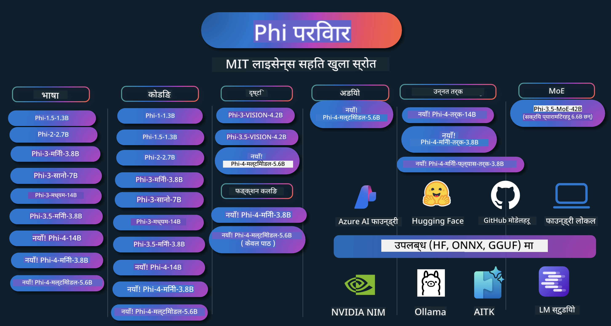

<!--
CO_OP_TRANSLATOR_METADATA:
{
  "original_hash": "ef3a50368712b1a7483d0def1f70c490",
  "translation_date": "2025-12-21T11:06:19+00:00",
  "source_file": "README.md",
  "language_code": "ne"
}
-->
# Phi Cookbook: Microsoft's Phi मोडेलहरूसँग व्यावहारिक उदाहरणहरू

Phi माइक्रोसफ्टद्वारा विकास गरिएको खुला स्रोत एआई मोडेलहरूको श्रृंखला हो। 

Phi अहिले सबैभन्दा शक्तिशाली र लागत-प्रभावी सानो भाषा मोडेल (SLM) मध्ये एक हो, जसले बहुभाषी, तर्क, पाठ/च्याट उत्पादन, कोडिङ, छविहरू, अडियो र अन्य परिदृश्यहरूमा राम्रो बेंचमार्कहरू देखाउँछ। 

तपाईं Phi लाई क्लाउडमा वा एज उपकरणहरूमा परिनियोजन गर्न सक्नुहुन्छ, र सीमित कम्प्युटिङ शक्तिसँग सजिलै जेनेरेटिभ एआई अनुप्रयोगहरू बनाउन सक्नुहुन्छ।

यी स्रोतहरू प्रयोग गर्न सुरु गर्न यी कदमहरू अनुसरण गर्नुहोस् :
1. **रिपोजिटरी फोर्क गर्नुहोस्**: Click 
2. **रिपोजिटरी क्लोन गर्नुहोस्**:   `git clone https://github.com/microsoft/PhiCookBook.git`
3. [**Microsoft AI Discord समुदायमा सामेल हुनुहोस् र विशेषज्ञ तथा सह-डेभलपरहरूसँग भेट्नुहोस्**](https://discord.com/invite/ByRwuEEgH4?WT.mc_id=aiml-137032-kinfeylo)

### 🌐 बहु-भाषा समर्थन

#### GitHub Action मार्फत समर्थन (स्वचालित र सधैं अद्यावधिक)

<!-- CO-OP TRANSLATOR LANGUAGES TABLE START -->
[अरबी](../ar/README.md) | [बंगाली](../bn/README.md) | [बुल्गेरियाली](../bg/README.md) | [बर्मी (म्यानमार)](../my/README.md) | [चिनियाँ (सरलीकृत)](../zh/README.md) | [चिनियाँ (परम्परागत, हङकङ)](../hk/README.md) | [चिनियाँ (परम्परागत, मकाउ)](../mo/README.md) | [चिनियाँ (परम्परागत, ताइवान)](../tw/README.md) | [क्रोएशियाली](../hr/README.md) | [चेक](../cs/README.md) | [डेनिश](../da/README.md) | [डच](../nl/README.md) | [एस्टोनियाली](../et/README.md) | [फिनिश](../fi/README.md) | [फ्रेन्च](../fr/README.md) | [जर्मन](../de/README.md) | [ग्रीक](../el/README.md) | [हिब्रू](../he/README.md) | [हिन्दी](../hi/README.md) | [हङ्गेरियन](../hu/README.md) | [इन्डोनेशियाली](../id/README.md) | [इटालियन](../it/README.md) | [जापानी](../ja/README.md) | [कन्नड](../kn/README.md) | [कोरियन](../ko/README.md) | [लिथुआनियाली](../lt/README.md) | [मलय](../ms/README.md) | [मलयालम](../ml/README.md) | [मराठी](../mr/README.md) | [नेपाली](./README.md) | [नाइजीरियन पिजिन](../pcm/README.md) | [नर्वेजियन](../no/README.md) | [फारसी (फारसी)](../fa/README.md) | [पोलिश](../pl/README.md) | [पोर्चुगिज (ब्राजिल)](../br/README.md) | [पोर्चुगिज (पोर्चुगल)](../pt/README.md) | [पञ्जाबी (गुरमुखी)](../pa/README.md) | [रोमानियन](../ro/README.md) | [रूसी](../ru/README.md) | [सर्बियाली (सिरिलिक)](../sr/README.md) | [स्लोभाक](../sk/README.md) | [स्लोभेनियाली](../sl/README.md) | [स्पेनी](../es/README.md) | [स्वाहिली](../sw/README.md) | [स्वीडिश](../sv/README.md) | [ट्यागालोग (फिलिपिनो)](../tl/README.md) | [तमिल](../ta/README.md) | [तेलुगु](../te/README.md) | [थाई](../th/README.md) | [टर्की](../tr/README.md) | [युक्रेनी](../uk/README.md) | [उर्दू](../ur/README.md) | [भियतनामी](../vi/README.md)
<!-- CO-OP TRANSLATOR LANGUAGES TABLE END -->

## सामग्री तालिका

- परिचय
  - [Phi परिवारमा स्वागत](./md/01.Introduction/01/01.PhiFamily.md)
  - [आफ्नो वातावरण सेटअप गर्ने](./md/01.Introduction/01/01.EnvironmentSetup.md)
  - [प्रमुख प्रविधिहरू बुझ्ने](./md/01.Introduction/01/01.Understandingtech.md)
  - [Phi मोडेलहरूको लागि एआई सुरक्षा](./md/01.Introduction/01/01.AISafety.md)
  - [Phi हार्डवेयर समर्थन](./md/01.Introduction/01/01.Hardwaresupport.md)
  - [Phi मोडेलहरू र प्लेटफर्महरूमा उपलब्धता](./md/01.Introduction/01/01.Edgeandcloud.md)
  - [Guidance-ai तथा Phi प्रयोग गर्ने](./md/01.Introduction/01/01.Guidance.md)
  - [GitHub Marketplace मोडेलहरू](https://github.com/marketplace/models)
  - [Azure AI मोडेल क्याटलग](https://ai.azure.com)

- विभिन्न वातावरणहरूमा Phi इन्फेरेन्स
    -  [Hugging face](./md/01.Introduction/02/01.HF.md)
    -  [GitHub मोडेलहरू](./md/01.Introduction/02/02.GitHubModel.md)
    -  [Azure AI Foundry मोडेल क्याटलग](./md/01.Introduction/02/03.AzureAIFoundry.md)
    -  [Ollama](./md/01.Introduction/02/04.Ollama.md)
    -  [AI Toolkit VSCode (AITK)](./md/01.Introduction/02/05.AITK.md)
    -  [NVIDIA NIM](./md/01.Introduction/02/06.NVIDIA.md)
    -  [Foundry Local](./md/01.Introduction/02/07.FoundryLocal.md)

- Phi परिवारमा इन्फेरेन्स
    - [iOS मा Phi इन्फेरेन्स](./md/01.Introduction/03/iOS_Inference.md)
    - [Android मा Phi इन्फेरेन्स](./md/01.Introduction/03/Android_Inference.md)
    - [Jetson मा Phi इन्फेरेन्स](./md/01.Introduction/03/Jetson_Inference.md)
    - [AI PC मा Phi इन्फेरेन्स](./md/01.Introduction/03/AIPC_Inference.md)
    - [Apple MLX फ्रेमवर्कसँग Phi इन्फेरेन्स](./md/01.Introduction/03/MLX_Inference.md)
    - [स्थानीय सर्भरमा Phi इन्फेरेन्स](./md/01.Introduction/03/Local_Server_Inference.md)
    - [AI Toolkit प्रयोग गरी रिमोट सर्भरमा Phi इन्फेरेन्स](./md/01.Introduction/03/Remote_Interence.md)
    - [Rust सँग Phi इन्फेरेन्स](./md/01.Introduction/03/Rust_Inference.md)
    - [स्थानीयमा Phi--दृश्य (Vision) इन्फेरेन्स](./md/01.Introduction/03/Vision_Inference.md)
    - [Kaito AKS, Azure Containers प्रयोग गरी Phi इन्फेरेन्स (आधिकारिक समर्थन)](./md/01.Introduction/03/Kaito_Inference.md)
-  [Phi परिवार क्वान्टिफाइ गर्ने](./md/01.Introduction/04/QuantifyingPhi.md)
    - [llama.cpp प्रयोग गरी Phi-3.5 / 4 क्वान्टाइज गर्ने](./md/01.Introduction/04/UsingLlamacppQuantifyingPhi.md)
    - [onnxruntime का लागि Generative AI विस्तारहरू प्रयोग गरी Phi-3.5 / 4 क्वान्टाइज गर्ने](./md/01.Introduction/04/UsingORTGenAIQuantifyingPhi.md)
    - [Intel OpenVINO प्रयोग गरी Phi-3.5 / 4 क्वान्टाइज गर्ने](./md/01.Introduction/04/UsingIntelOpenVINOQuantifyingPhi.md)
    - [Apple MLX फ्रेमवर्क प्रयोग गरी Phi-3.5 / 4 क्वान्टाइज गर्ने](./md/01.Introduction/04/UsingAppleMLXQuantifyingPhi.md)

- Phi मूल्याङ्कन
    - [उत्तरदायी एआई (Response AI)](./md/01.Introduction/05/ResponsibleAI.md)
    - [मूल्याङ्कनका लागि Azure AI Foundry](./md/01.Introduction/05/AIFoundry.md)
    - [मूल्याङ्कनका लागि Promptflow प्रयोग गर्ने](./md/01.Introduction/05/Promptflow.md)
 
- RAG संग Azure AI Search
    - [Phi-4-mini र Phi-4-multimodal(RAG) लाई Azure AI Search सँग कसरी प्रयोग गर्ने](https://github.com/microsoft/PhiCookBook/blob/main/code/06.E2E/E2E_Phi-4-RAG-Azure-AI-Search.ipynb)

- Phi अनुप्रयोग विकास नमूनाहरू
  - पाठ तथा च्याट अनुप्रयोगहरू
    - Phi-4 नमूनाहरू 🆕
      - [📓] [Phi-4-mini ONNX मोडेलसँग च्याट गर्नुहोस्](./md/02.Application/01.TextAndChat/Phi4/ChatWithPhi4ONNX/README.md)
      - [Phi-4 स्थानीय ONNX मोडेलसँग च्याट (.NET)](../../md/04.HOL/dotnet/src/LabsPhi4-Chat-01OnnxRuntime)
      - [Sementic Kernel प्रयोग गरी Phi-4 ONNX सँग .NET कन्सोल एप्लिकमा च्याट](../../md/04.HOL/dotnet/src/LabsPhi4-Chat-02SK)
    - Phi-3 / 3.5 नमूनाहरू
      - [ब्राउज़रमा Phi3, ONNX Runtime Web र WebGPU प्रयोग गरी स्थानीय चैटबट](https://github.com/microsoft/onnxruntime-inference-examples/tree/main/js/chat)
      - [OpenVino च्याट](./md/02.Application/01.TextAndChat/Phi3/E2E_OpenVino_Chat.md)
      - [मल्टि मोडेल - अन्तरक्रियात्मक Phi-3-mini र OpenAI Whisper](./md/02.Application/01.TextAndChat/Phi3/E2E_Phi-3-mini_with_whisper.md)
      - [MLFlow - रैपर निर्माण र MLFlow सँग Phi-3 प्रयोग गर्ने](./md//02.Application/01.TextAndChat/Phi3/E2E_Phi-3-MLflow.md)
      - [मोडेल अनुकूलन - Olive सँग ONNX Runtime Web का लागि Phi-3-min मोडेल कसरी अनुकूल गर्ने](https://github.com/microsoft/Olive/tree/main/examples/phi3)
      - [Phi-3 mini-4k-instruct-onnx सहित WinUI3 एप](https://github.com/microsoft/Phi3-Chat-WinUI3-Sample/)
      -[WinUI3 बहु-मोडेल AI संचालित नोट्स एप नमूना](https://github.com/microsoft/ai-powered-notes-winui3-sample)
      - [Prompt flow सँग कस्टम Phi-3 मोडेलहरूलाई फाइन-ट्युन र एकीकृत गर्ने](./md/02.Application/01.TextAndChat/Phi3/E2E_Phi-3-FineTuning_PromptFlow_Integration.md)
      - [Azure AI Foundry मा Prompt flow सँग कस्टम Phi-3 मोडेलहरू फाइन-ट्युन र एकीकृत गर्ने](./md/02.Application/01.TextAndChat/Phi3/E2E_Phi-3-FineTuning_PromptFlow_Integration_AIFoundry.md)
      - [Microsoft का Responsible AI सिद्धान्तहरूमा केन्द्रित हुँदै Azure AI Foundry मा फाइन-ट्युन गरिएको Phi-3 / Phi-3.5 मोडेलको मूल्याङ्कन गर्ने](./md/02.Application/01.TextAndChat/Phi3/E2E_Phi-3-Evaluation_AIFoundry.md)
      - [📓] [Phi-3.5-mini-instruct भाषा पूर्वानुमान नमूना (चीनी/अङ्ग्रेजी)](./md/02.Application/01.TextAndChat/Phi3/phi3-instruct-demo.ipynb)
      - [Phi-3.5-Instruct WebGPU RAG च्याटबोट](./md/02.Application/01.TextAndChat/Phi3/WebGPUWithPhi35Readme.md)
      - [Phi-3.5-Instruct ONNX सहित Prompt flow समाधान सिर्जना गर्न Windows GPU प्रयोग गर्ने](./md/02.Application/01.TextAndChat/Phi3/UsingPromptFlowWithONNX.md)
      - [Android एप बनाउन Microsoft Phi-3.5 tflite प्रयोग गर्ने](./md/02.Application/01.TextAndChat/Phi3/UsingPhi35TFLiteCreateAndroidApp.md)
      - [स्थानीय ONNX Phi-3 मोडेल प्रयोग गरेर Microsoft.ML.OnnxRuntime प्रयोग गर्ने Q&A .NET उदाहरण](../../md/04.HOL/dotnet/src/LabsPhi301)
      - [Semantic Kernel र Phi-3 सहित कन्सोल च्याट .NET एप](../../md/04.HOL/dotnet/src/LabsPhi302)

  - Azure AI Inference SDK कोड-आधारित नमूनाहरू 
    - Phi-4 नमूनाहरू 🆕
      - [📓] [Phi-4-multimodal प्रयोग गरी परियोजना कोड उत्पन्न गर्ने](./md/02.Application/02.Code/Phi4/GenProjectCode/README.md)
    - Phi-3 / 3.5 नमूनाहरू
      - [आफ्नै Visual Studio Code GitHub Copilot च्याट Microsoft Phi-3 परिवारसँग बनाउने](./md/02.Application/02.Code/Phi3/VSCodeExt/README.md)
      - [GitHub Models द्वारा Phi-3.5 प्रयोग गरी आफ्नै Visual Studio Code Chat Copilot Agent बनाउने](/md/02.Application/02.Code/Phi3/CreateVSCodeChatAgentWithGitHubModels.md)

  - उन्नत तर्क नमूनाहरू
    - Phi-4 नमूनाहरू 🆕
      - [📓] [Phi-4-mini-reasoning वा Phi-4-reasoning नमूनाहरू](./md/02.Application/03.AdvancedReasoning/Phi4/AdvancedResoningPhi4mini/README.md)
      - [📓] [Microsoft Olive सँग Phi-4-mini-reasoning फाइन-ट्युन गर्ने](./md/02.Application/03.AdvancedReasoning/Phi4/AdvancedResoningPhi4mini/olive_ft_phi_4_reasoning_with_medicaldata.ipynb)
      - [📓] [Apple MLX सँग Phi-4-mini-reasoning फाइन-ट्युन गर्ने](./md/02.Application/03.AdvancedReasoning/Phi4/AdvancedResoningPhi4mini/mlx_ft_phi_4_reasoning_with_medicaldata.ipynb)
      - [📓] [GitHub Models सँग Phi-4-mini-reasoning](./md/02.Application/02.Code/Phi4r/github_models_inference.ipynb)
      - [📓] [Azure AI Foundry Models सँग Phi-4-mini-reasoning](./md/02.Application/02.Code/Phi4r/azure_models_inference.ipynb)
  - डेमोहरू
      - [Hugging Face Spaces मा होस्ट गरिएका Phi-4-mini डेमोहरू](https://huggingface.co/spaces/microsoft/phi-4-mini?WT.mc_id=aiml-137032-kinfeylo)
      - [Hugginge Face Spaces मा होस्ट गरिएका Phi-4-multimodal डेमोहरू](https://huggingface.co/spaces/microsoft/phi-4-multimodal?WT.mc_id=aiml-137032-kinfeylo)
  - Vision Samples
    - Phi-4 नमूनाहरू 🆕
      - [📓] [छविहरू पढ्न र कोड उत्पन्न गर्न Phi-4-multimodal प्रयोग गर्ने](./md/02.Application/04.Vision/Phi4/CreateFrontend/README.md) 
    - Phi-3 / 3.5 नमूनाहरू
      -  [📓][Phi-3-vision-Image टेक्स्ट देखि टेक्स्ट](./md/02.Application/04.Vision/Phi3/E2E_Phi-3-vision-image-text-to-text-online-endpoint.ipynb)
      - [Phi-3-vision-ONNX](https://onnxruntime.ai/docs/genai/tutorials/phi3-v.html)
      - [📓][Phi-3-vision CLIP एम्बेडिङ](./md/02.Application/04.Vision/Phi3/E2E_Phi-3-vision-image-text-to-text-online-endpoint.ipynb)
      - [डेमो: Phi-3 रीसाइक्लिङ](https://github.com/jennifermarsman/PhiRecycling/)
      - [Phi-3-vision - भिजुअल भाषा सहायक - Phi3-Vision र OpenVINO सहित](https://docs.openvino.ai/nightly/notebooks/phi-3-vision-with-output.html)
      - [Phi-3 Vision Nvidia NIM](./md/02.Application/04.Vision/Phi3/E2E_Nvidia_NIM_Vision.md)
      - [Phi-3 Vision OpenVino](./md/02.Application/04.Vision/Phi3/E2E_OpenVino_Phi3Vision.md)
      - [📓][Phi-3.5 Vision बहु-फ्रेम वा बहु-छवि नमूना](./md/02.Application/04.Vision/Phi3/phi3-vision-demo.ipynb)
      - [Microsoft.ML.OnnxRuntime .NET प्रयोग गरी Phi-3 Vision स्थानीय ONNX मोडेल](../../md/04.HOL/dotnet/src/LabsPhi303)
      - [मेनु आधारित Phi-3 Vision स्थानीय ONNX मोडेल Microsoft.ML.OnnxRuntime .NET प्रयोग गरेर](../../md/04.HOL/dotnet/src/LabsPhi304)

  - गणित नमूनाहरू
    -  Phi-4-Mini-Flash-Reasoning-Instruct नमूनाहरू 🆕 [Phi-4-Mini-Flash-Reasoning-Instruct सहित गणित डेमो](./md/02.Application/09.Math/MathDemo.ipynb)

  - अडियो नमूनाहरू
    - Phi-4 नमूनाहरू 🆕
      - [📓] [Phi-4-multimodal प्रयोग गरी अडियो ट्रान्सक्रिप्टहरू निकाल्ने](./md/02.Application/05.Audio/Phi4/Transciption/README.md)
      - [📓] [Phi-4-multimodal अडियो नमूना](./md/02.Application/05.Audio/Phi4/Siri/demo.ipynb)
      - [📓] [Phi-4-multimodal भाषण अनुवाद नमूना](./md/02.Application/05.Audio/Phi4/Translate/demo.ipynb)
      - [.NET कन्सोल अनुप्रयोग जुन छविहरू विश्लेषण गर्न Phi-4-multimodal प्रयोग गर्छ](../../md/04.HOL/dotnet/src/LabsPhi4-MultiModal-02Audio)

  - MOE नमूनाहरू
    - Phi-3 / 3.5 नमूनाहरू
      - [📓] [Phi-3.5 Mixture of Experts Models (MoEs) सामाजिक मिडिया नमूना](./md/02.Application/06.MoE/Phi3/phi3_moe_demo.ipynb)
      - [📓] [NVIDIA NIM Phi-3 MOE, Azure AI Search, र LlamaIndex सँग Retrieval-Augmented Generation (RAG) पाइपलाइन बनाउने](./md/02.Application/06.MoE/Phi3/azure-ai-search-nvidia-rag.ipynb)
      - 
  - फङ्क्सन कलिङ नमूनाहरू
    - Phi-4 नमूनाहरू 🆕
      -  [📓] [Phi-4-mini सँग फङ्क्सन कलिङ प्रयोग गर्ने](./md/02.Application/07.FunctionCalling/Phi4/FunctionCallingBasic/README.md)
      -  [📓] [Phi-4-mini सँग बहु-एजेन्टहरू सिर्जना गर्न फङ्क्सन कलिङ प्रयोग गर्ने](./md/02.Application/07.FunctionCalling/Phi4/Multiagents/Phi_4_mini_multiagent.ipynb)
      -  [📓] [Ollama सँग फङ्क्सन कलिङ प्रयोग गर्ने](./md/02.Application/07.FunctionCalling/Phi4/Ollama/ollama_functioncalling.ipynb)
      -  [📓] [ONNX सँग फङ्क्सन कलिङ प्रयोग गर्ने](./md/02.Application/07.FunctionCalling/Phi4/ONNX/onnx_parallel_functioncalling.ipynb)
  - मल्टिमोडल मिक्सिङ नमूनाहरू
    - Phi-4 नमूनाहरू 🆕
      -  [📓] [प्रविधि पत्रकारको रूपमा Phi-4-multimodal प्रयोग गर्ने](./md/02.Application/08.Multimodel/Phi4/TechJournalist/phi_4_mm_audio_text_publish_news.ipynb)
      - [.NET कन्सोल अनुप्रयोग जुन छविहरू विश्लेषण गर्न Phi-4-multimodal प्रयोग गर्छ](../../md/04.HOL/dotnet/src/LabsPhi4-MultiModal-01Images)

- Phi नमूनाहरू फाइन-ट्युन
  - [फाइन-ट्युनिङ परिदृश्यहरू](./md/03.FineTuning/FineTuning_Scenarios.md)
  - [फाइन-ट्युनिङ बनाम RAG](./md/03.FineTuning/FineTuning_vs_RAG.md)
  - [फाइन-ट्युनिङ: Phi-3 लाई उद्योग विशेषज्ञ बनाउने](./md/03.FineTuning/LetPhi3gotoIndustriy.md)
  - [VS Code का लागि AI Toolkit सँग Phi-3 फाइन-ट्युन गर्ने](./md/03.FineTuning/Finetuning_VSCodeaitoolkit.md)
  - [Azure Machine Learning Service सँग Phi-3 फाइन-ट्युन गर्ने](./md/03.FineTuning/Introduce_AzureML.md)
  - [Lora सँग Phi-3 फाइन-ट्युन गर्ने](./md/03.FineTuning/FineTuning_Lora.md)
  - [QLora सँग Phi-3 फाइन-ट्युन गर्ने](./md/03.FineTuning/FineTuning_Qlora.md)
  - [Azure AI Foundry सँग Phi-3 फाइन-ट्युन गर्ने](./md/03.FineTuning/FineTuning_AIFoundry.md)
  - [Azure ML CLI/SDK सँग Phi-3 फाइन-ट्युन गर्ने](./md/03.FineTuning/FineTuning_MLSDK.md)
  - [Microsoft Olive सँग फाइन-ट्युन गर्ने](./md/03.FineTuning/FineTuning_MicrosoftOlive.md)
  - [Microsoft Olive Hands-On Lab सँग फाइन-ट्युन गर्ने](./md/03.FineTuning/olive-lab/readme.md)
  - [Weights and Bias सँग Phi-3-vision फाइन-ट्युन गर्ने](./md/03.FineTuning/FineTuning_Phi-3-visionWandB.md)
  - [Apple MLX Framework सँग Phi-3 फाइन-ट्युन गर्ने](./md/03.FineTuning/FineTuning_MLX.md)
  - [Phi-3-vision फाइन-ट्युन (आधिकारिक समर्थन)](./md/03.FineTuning/FineTuning_Vision.md)
  - [Kaito AKS , Azure Containers(official Support) सँग Phi-3 फाइन-ट्युन गर्ने](./md/03.FineTuning/FineTuning_Kaito.md)
  - [Phi-3 र 3.5 Vision फाइन-ट्युन](https://github.com/2U1/Phi3-Vision-Finetune)

- ह्यान्ड्स-ऑन ल्याब
  - [उन्नत मोडेलहरू अन्वेषण गर्दै: LLMs, SLMs, स्थानीय विकास र थप](https://github.com/microsoft/aitour-exploring-cutting-edge-models)
  - [NLP क्षमता अनलक गर्दै: Microsoft Olive सँग फाइन-ट्युनिङ](https://github.com/azure/Ignite_FineTuning_workshop)

- शैक्षिक अनुसन्धान कागजातहरू र प्रकाशनहरू
  - [Textbooks Are All You Need II: phi-1.5 प्राविधिक प्रतिवेदन](https://arxiv.org/abs/2309.05463)
  - [Phi-3 प्राविधिक प्रतिवेदन: तपाईंको फोनमा स्थानीय रूपमा उच्च क्षमता भएको भाषा मोडेल](https://arxiv.org/abs/2404.14219)
  - [Phi-4 प्राविधिक प्रतिवेदन](https://arxiv.org/abs/2412.08905)
  - [Phi-4-Mini Technical Report: Mixture-of-LoRAs मार्फत सन्निपात तर शक्तिशाली बहु-मोडल भाषा मोडेलहरू](https://arxiv.org/abs/2503.01743)
  - [सवारीभित्रको फङ्सन-कलका लागि साना भाषा मोडेलहरूको अनुकूलन](https://arxiv.org/abs/2501.02342)
  - [(WhyPHI) PHI-3 लाई बहुविकल्प प्रश्नोत्तरका लागि फाइन-ट्युनिङ: पद्धति, परिणामहरू, र चुनौतीहरू](https://arxiv.org/abs/2501.01588)
  - [Phi-4-reasoning प्राविधिक प्रतिवेदन](https://www.microsoft.com/en-us/research/wp-content/uploads/2025/04/phi_4_reasoning.pdf)
  - [Phi-4-mini-reasoning प्राविधिक प्रतिवेदन](https://huggingface.co/microsoft/Phi-4-mini-reasoning/blob/main/Phi-4-Mini-Reasoning.pdf)

## Phi मोडेलहरूको प्रयोग

### Azure AI Foundry मा Phi

तपाईं Microsoft Phi कसरी प्रयोग गर्ने र विभिन्न हार्डवेयर उपकरणहरूमा E2E समाधानहरू कसरी निर्माण गर्ने सिक्न सक्नुहुन्छ। Phi लाई आफैं अनुभव गर्नका लागि, मोडेलहरूसँग प्रयोग गरेर र आफ्नो परिदृश्यअनुसार Phi अनुकूलन गर्न [Azure AI Foundry Azure AI Model Catalog](https://aka.ms/phi3-azure-ai) प्रयोग गरेर सुरु गर्नुहोस्। थप जानकारीका लागि [Azure AI Foundry](/md/02.QuickStart/AzureAIFoundry_QuickStart.md) को परिचय (Getting Started) हेर्नुहोस्।

**Playground**
प्रत्येक मोडेलको परीक्षणका लागि एउटा समर्पित प्लेग्राउन्ड छ [Azure AI Playground](https://aka.ms/try-phi3).

### GitHub मोडेलहरूमा Phi

तपाईं Microsoft Phi कसरी प्रयोग गर्ने र विभिन्न हार्डवेयर उपकरणहरूमा E2E समाधानहरू कसरी निर्माण गर्ने सिक्न सक्नुहुन्छ। Phi लाई आफैं अनुभव गर्नका लागि, मोडेलसँग खेल्दै र आफ्नो परिदृश्यअनुसार Phi अनुकूलन गरेर [GitHub Model Catalog](https://github.com/marketplace/models?WT.mc_id=aiml-137032-kinfeylo) प्रयोग गरेर सुरु गर्नुहोस्। थप जानकारीका लागि [GitHub Model Catalog](/md/02.QuickStart/GitHubModel_QuickStart.md) को परिचय हेर्नुहोस्।

**Playground**
प्रत्येक मोडेलको परीक्षणका लागि एउटा समर्पित [playground to test the model](/md/02.QuickStart/GitHubModel_QuickStart.md) छ।

### Hugging Face मा Phi

तपाईं मोडेललाई [Hugging Face](https://huggingface.co/microsoft) मा पनि फेला पार्न सक्नुहुन्छ।

**Playground**
 [Hugging Chat प्लेग्राउन्ड](https://huggingface.co/chat/models/microsoft/Phi-3-mini-4k-instruct)

 ## 🎒 अन्य पाठ्यक्रमहरू

हाम्रो टोलीले अन्य पाठ्यक्रमहरू पनि तयार गर्दछ! हेर्नुहोस्:

<!-- CO-OP TRANSLATOR OTHER COURSES START -->
### LangChain

---

### Azure / Edge / MCP / Agents

---
 
### Generative AI Series

[-9333EA?style=for-the-badge&labelColor=E5E7EB&color=9333EA)](https://github.com/microsoft/Generative-AI-for-beginners-dotnet?WT.mc_id=academic-105485-koreyst)
[-C084FC?style=for-the-badge&labelColor=E5E7EB&color=C084FC)](https://github.com/microsoft/generative-ai-for-beginners-java?WT.mc_id=academic-105485-koreyst)
[-E879F9?style=for-the-badge&labelColor=E5E7EB&color=E879F9)](https://github.com/microsoft/generative-ai-with-javascript?WT.mc_id=academic-105485-koreyst)

---
 
### Core Learning

---
 
### Copilot Series

<!-- CO-OP TRANSLATOR OTHER COURSES END -->

## उत्तरदायी AI 

Microsoft हाम्रो ग्राहकहरूलाई हाम्रा AI उत्पादनहरू जिम्मेवार तरिकाले प्रयोग गर्न मद्दत गर्न, हाम्रा सिकाइहरू साझा गर्न, र Transparency Notes र Impact Assessments जस्ता उपकरणमार्फत विश्वास-आधारित साझेदारीहरू निर्माण गर्न प्रतिबद्ध छ। यी स्रोतहरू मध्ये धेरै [https://aka.ms/RAI](https://aka.ms/RAI) मा फेला पार्न सकिन्छ।
Microsoft को जिम्मेवार AI गर्ने दृष्टिकोण हाम्रो निष्पक्षता, भरपर्दोपन र सुरक्षा, गोपनीयता र सुरक्षा, समावेशीता, पारदर्शिता, र जवाफदेहिताका AI सिद्धान्तहरूमा आधारित छ।

ठूला-परिमाणका प्राकृतिक भाषा, छवि, र आवाज मोडेलहरू — जस्तै यस नमुनामा प्रयोग गरिएका मोडेलहरू — सम्भावित रूपमा अन्यायपूर्ण, अविश्वसनीय, वा अपमानजनक तरिकाले व्यवहार गर्न सक्छन्, जसले नोक्सान पुर्‍याउन सक्छ। जोखिम र सीमाहरूबारे जानकारीका लागि कृपया [Azure OpenAI service Transparency note](https://learn.microsoft.com/legal/cognitive-services/openai/transparency-note?tabs=text) सल्लाह लिनुहोस्।

यी जोखिमहरू घटाउन सिफारिस गरिएको उपाय भनेको तपाईंको आर्किटेक्चरमा एउटा सुरक्षा प्रणाली समावेश गर्नु हो जसले हानिकारक व्यवहार पत्ता लगाउन र रोक्न सक्छ। [Azure AI Content Safety](https://learn.microsoft.com/azure/ai-services/content-safety/overview) ले स्वतन्त्र सुरक्षाको तह प्रदान गर्छ, जसले एप्लिकेसन र सेवाहरूमा प्रयोगकर्ताद्वारा सिर्जित र AI-द्वारा सिर्जित हानिकारक सामग्री पत्ता लगाउन सक्षम बनाउँछ। Azure AI Content Safety मा त्यो हानिकारक सामग्री पत्ता लगाउन टेक्स्ट र छवि API हरू समावेश छन्। Azure AI Foundry भित्र, Content Safety सेवा विभिन्न मोडालिटीहरूमा हानिकारक सामग्री पत्ता लगाउने नमूना कोड हेर्न, अन्वेषण गर्न र परीक्षण गर्न अनुमति दिन्छ। निम्न [quickstart documentation](https://learn.microsoft.com/azure/ai-services/content-safety/quickstart-text?tabs=visual-studio%2Clinux&pivots=programming-language-rest) ले सेवा तर्फ अनुरोधहरू कसरी गर्ने भन्ने मार्गदर्शन गर्दछ।

ध्यान दिनुपर्ने अर्को पक्ष भनेको समग्र एप्लिकेशनको प्रदर्शन हो। बहु-मोडल र बहु-मोडेल एप्लिकेसनहरूमा, हामी प्रदर्शन भन्नाले प्रणाली तपाईं र तपाईंका प्रयोगकर्ताहरूले अपेक्षा गरे अनुसार काम गर्नु हो भनेर बुझ्छौं, जसमा हानिकारक आउटपुटहरू उत्पादन नगर्नु पनि समावेश हुन्छ। तपाईंले आफ्नो समग्र एप्लिकेसनको प्रदर्शन जाँच गर्न [Performance and Quality and Risk and Safety evaluators](https://learn.microsoft.com/azure/ai-studio/concepts/evaluation-metrics-built-in) प्रयोग गर्नु महत्त्वपूर्ण छ। तपाईंले [custom evaluators](https://learn.microsoft.com/azure/ai-studio/how-to/develop/evaluate-sdk#custom-evaluators) सिर्जना र मूल्याङ्कन गर्ने क्षमता पनि राख्नुहुन्छ।

तपाईंले आफ्नो विकास वातावरणमा [Azure AI Evaluation SDK](https://microsoft.github.io/promptflow/index.html) प्रयोग गरी आफ्नो AI एप्लिकेसन मूल्याङ्कन गर्न सक्नुहुन्छ। परीक्षण डेटासेट वा लक्ष्य दिएमा, तपाईंको सृजनात्मक AI एप्लिकेसनका उत्पन्न परिणामहरू built-in evaluator वा तपाईंले रोजेको custom evaluator द्वारा मात्रात्मक रूपमा मापन गरिन्छ। प्रणाली मूल्याङ्कन गर्न Azure AI Evaluation SDK बाट सुरु गर्नका लागि, तपाईंले [quickstart guide](https://learn.microsoft.com/azure/ai-studio/how-to/develop/flow-evaluate-sdk) अनुसरण गर्न सक्नुहुन्छ। एकपटक तपाईंले एक मूल्याङ्कन रन सञ्चालन गरेपछि, तपाईं [Azure AI Foundry मा नतिजा भिजुअलाइज] गर्न सक्नुहुन्छ [visualize the results in Azure AI Foundry](https://learn.microsoft.com/azure/ai-studio/how-to/evaluate-flow-results)। 

## ट्रेडमार्कहरू
यो परियोजनामा परियोजना, उत्पादन, वा सेवाका ट्रेडमार्क वा लोगोहरू समावेश हुन सक्छन्। Microsoft का ट्रेडमार्क वा लोगोहरूको अधिकृत प्रयोग [Microsoft का ट्रेडमार्क र ब्रान्ड दिशा-निर्देशहरू](https://www.microsoft.com/legal/intellectualproperty/trademarks/usage/general) लाई मान्नुपर्छ र त्यसको पालना गर्नुपर्छ।
यो परियोजनाको परिमार्जित संस्करणहरूमा Microsoft का ट्रेडमार्क वा लोगोहरूको प्रयोगले भ्रम पैदा गर्नु हुँदैन वा Microsoft को प्रायोजनको संकेत गर्नु हुँदैन। तेस्रो-पक्षका ट्रेडमार्क वा लोगोहरूको कुनै पनि प्रयोग ती तेस्रो-पक्षका नीतिहरूको अधीनमा हुन्छ।

## मद्दत

यदि तपाईं अड्किनुभयो वा AI एप्स निर्माण गर्दा कुनै प्रश्न भए, सामेल हुनुहोस्:

यदि तपाईंलाई उत्पादन सम्बन्धी प्रतिक्रिया वा निर्माण गर्दा त्रुटिहरू भएमा, भ्रमण गर्नुहोस्:

---

<!-- CO-OP TRANSLATOR DISCLAIMER START -->
अस्वीकरण:
यो दस्तावेज AI अनुवाद सेवा [Co-op Translator](https://github.com/Azure/co-op-translator) प्रयोग गरी अनुवाद गरिएको हो। हामी शुद्धतामा प्रयासरत भए पनि, कृपया ध्यान दिनुहोस् कि स्वचालित अनुवादमा त्रुटि वा अशुद्धता हुनसक्छ। मूल दस्तावेजलाई यसको मूल भाषामा नै अधिकारिक स्रोत मान्नुपर्छ। महत्त्वपूर्ण जानकारीका लागि पेशेवर मानव अनुवाद सिफारिस गरिन्छ। यस अनुवादको प्रयोगबाट उत्पन्न कुनै पनि गलतफहमी वा गलत व्याख्याका लागि हामी जिम्मेवार छैनौं।
<!-- CO-OP TRANSLATOR DISCLAIMER END -->