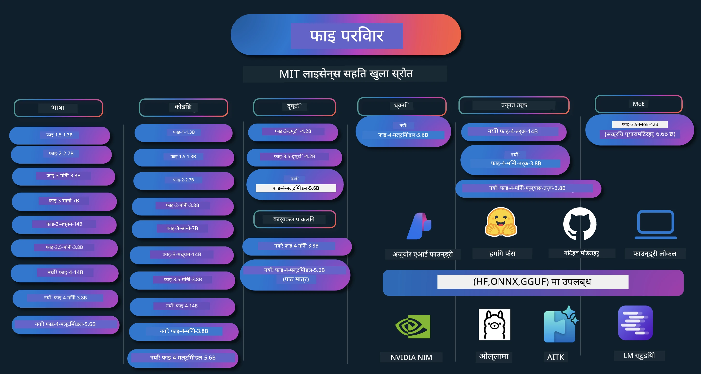

# Phi कुकबुक: Microsoft का Phi मोडेलहरूसँग व्यावहारिक उदाहरणहरू

[](https://codespaces.new/microsoft/phicookbook)
[](https://vscode.dev/redirect?url=vscode://ms-vscode-remote.remote-containers/cloneInVolume?url=https://github.com/microsoft/phicookbook)

[](https://GitHub.com/microsoft/phicookbook/graphs/contributors/?WT.mc_id=aiml-137032-kinfeylo)
[](https://GitHub.com/microsoft/phicookbook/issues/?WT.mc_id=aiml-137032-kinfeylo)
[](https://GitHub.com/microsoft/phicookbook/pulls/?WT.mc_id=aiml-137032-kinfeylo)
[](http://makeapullrequest.com?WT.mc_id=aiml-137032-kinfeylo)

[](https://GitHub.com/microsoft/phicookbook/watchers/?WT.mc_id=aiml-137032-kinfeylo)
[](https://GitHub.com/microsoft/phicookbook/network/?WT.mc_id=aiml-137032-kinfeylo)
[](https://GitHub.com/microsoft/phicookbook/stargazers/?WT.mc_id=aiml-137032-kinfeylo)

[](https://discord.com/invite/ByRwuEEgH4)

Phi Microsoft द्वारा विकास गरिएको एक श्रृंखला खुला स्रोत AI मोडेलहरू हुन्।

Phi हाल सबैभन्दा शक्तिशाली र लागत-कुशल सानो भाषा मोडेल (SLM) हो, जसले बहुभाषिक, तर्क, पाठ/च्याट उत्पादन, कोडिङ, छवि, आवाज र अन्य परिदृश्यहरूमा राम्रो प्रदर्शन गर्दछ।

तपाईं Phi लाई क्लाउड वा एज उपकरणहरूमा डिप्लोय गर्न सक्नुहुन्छ, र सीमित कम्प्युटिंग शक्तिसँग सजिलो रूपमा सृजनात्मक AI अनुप्रयोगहरू बनाउन सक्नुहुन्छ।

यी स्रोतहरू प्रयोगमा सुरु गर्न यी चरणहरू पछ्याउनुहोस्:
1. **रिपोजिटोरीलाई फोर्क गर्नुहोस्**: क्लिक गर्नुहोस् [](https://GitHub.com/microsoft/phicookbook/network/?WT.mc_id=aiml-137032-kinfeylo)
2. **रिपोजिटोरी क्लोन गर्नुहोस्**:   `git clone https://github.com/microsoft/PhiCookBook.git`
3. [**Microsoft AI Discord समुदायमा सहभागी हुनुहोस् र विशेषज्ञ तथा अन्य विकासकर्ताहरूलाई भेट्नुहोस्**](https://discord.com/invite/ByRwuEEgH4?WT.mc_id=aiml-137032-kinfeylo)



### 🌐 बहुभाषिक समर्थन

#### GitHub Action मार्फत समर्थन (स्वचालित र सधैं अद्यावधिक)

<!-- CO-OP TRANSLATOR LANGUAGES TABLE START -->
[Arabic](../ar/README.md) | [Bengali](../bn/README.md) | [Bulgarian](../bg/README.md) | [Burmese (Myanmar)](../my/README.md) | [Chinese (Simplified)](../zh-CN/README.md) | [Chinese (Traditional, Hong Kong)](../zh-HK/README.md) | [Chinese (Traditional, Macau)](../zh-MO/README.md) | [Chinese (Traditional, Taiwan)](../zh-TW/README.md) | [Croatian](../hr/README.md) | [Czech](../cs/README.md) | [Danish](../da/README.md) | [Dutch](../nl/README.md) | [Estonian](../et/README.md) | [Finnish](../fi/README.md) | [French](../fr/README.md) | [German](../de/README.md) | [Greek](../el/README.md) | [Hebrew](../he/README.md) | [Hindi](../hi/README.md) | [Hungarian](../hu/README.md) | [Indonesian](../id/README.md) | [Italian](../it/README.md) | [Japanese](../ja/README.md) | [Kannada](../kn/README.md) | [Korean](../ko/README.md) | [Lithuanian](../lt/README.md) | [Malay](../ms/README.md) | [Malayalam](../ml/README.md) | [Marathi](../mr/README.md) | [Nepali](./README.md) | [Nigerian Pidgin](../pcm/README.md) | [Norwegian](../no/README.md) | [Persian (Farsi)](../fa/README.md) | [Polish](../pl/README.md) | [Portuguese (Brazil)](../pt-BR/README.md) | [Portuguese (Portugal)](../pt-PT/README.md) | [Punjabi (Gurmukhi)](../pa/README.md) | [Romanian](../ro/README.md) | [Russian](../ru/README.md) | [Serbian (Cyrillic)](../sr/README.md) | [Slovak](../sk/README.md) | [Slovenian](../sl/README.md) | [Spanish](../es/README.md) | [Swahili](../sw/README.md) | [Swedish](../sv/README.md) | [Tagalog (Filipino)](../tl/README.md) | [Tamil](../ta/README.md) | [Telugu](../te/README.md) | [Thai](../th/README.md) | [Turkish](../tr/README.md) | [Ukrainian](../uk/README.md) | [Urdu](../ur/README.md) | [Vietnamese](../vi/README.md)

> **स्थानीय रूपमा क्लोन गर्न चाहनुहुन्छ?**
>
> यो रिपोजिटोरीमा ५०+ भाषाहरूका अनुवादहरू समावेश छन् जुन डाउनलोड साइजलाई धेरै बढाउँछ। अनुवादहरू नचाहिँदा क्लोन गर्न sparse checkout प्रयोग गर्नुहोस्:
>
> **Bash / macOS / Linux:**
> ```bash
> git clone --filter=blob:none --sparse https://github.com/microsoft/PhiCookBook.git
> cd PhiCookBook
> git sparse-checkout set --no-cone '/*' '!translations' '!translated_images'
> ```
>
> **CMD (Windows):**
> ```cmd
> git clone --filter=blob:none --sparse https://github.com/microsoft/PhiCookBook.git
> cd PhiCookBook
> git sparse-checkout set --no-cone "/*" "!translations" "!translated_images"
> ```
>
> यसले तपाईंलाई कोर्स पूरा गर्न आवश्यक सबै सामग्री छिटो डाउनलोड गर्ने सुविधा दिन्छ।
<!-- CO-OP TRANSLATOR LANGUAGES TABLE END -->

## सामग्री सूची

- परिचय
  - [Phi परिवारमा स्वागत](./md/01.Introduction/01/01.PhiFamily.md)
  - [आफ्नो वातावरण सेटअप गर्दै](./md/01.Introduction/01/01.EnvironmentSetup.md)
  - [मुख्य प्रविधिहरू बुझ्नुहोस्](./md/01.Introduction/01/01.Understandingtech.md)
  - [Phi मोडेलहरूको लागि AI सुरक्षा](./md/01.Introduction/01/01.AISafety.md)
  - [Phi हार्डवेयर समर्थन](./md/01.Introduction/01/01.Hardwaresupport.md)
  - [प्लेटफर्महरूमा Phi मोडेलहरू र उपलब्धता](./md/01.Introduction/01/01.Edgeandcloud.md)
  - [Guidance-ai र Phi प्रयोग गर्दै](./md/01.Introduction/01/01.Guidance.md)
  - [GitHub मार्केटप्लेस मोडेलहरू](https://github.com/marketplace/models)
  - [Azure AI मोडेल सूची](https://ai.azure.com)

- भिन्न-भिन्न वातावरणमा Phi निष्कर्षण
    -  [Hugging face](./md/01.Introduction/02/01.HF.md)
    -  [GitHub मोडेलहरू](./md/01.Introduction/02/02.GitHubModel.md)
    -  [Microsoft Foundry मोडेल सूची](./md/01.Introduction/02/03.AzureAIFoundry.md)
    -  [Ollama](./md/01.Introduction/02/04.Ollama.md)
    -  [AI टूलकिट VSCode (AITK)](./md/01.Introduction/02/05.AITK.md)
    -  [NVIDIA NIM](./md/01.Introduction/02/06.NVIDIA.md)
    -  [Foundry लोकल](./md/01.Introduction/02/07.FoundryLocal.md)

- Phi परिवारको निष्कर्षण
    - [iOS मा Phi निष्कर्षण](./md/01.Introduction/03/iOS_Inference.md)
    - [Android मा Phi निष्कर्षण](./md/01.Introduction/03/Android_Inference.md)
    - [Jetson मा Phi निष्कर्षण](./md/01.Introduction/03/Jetson_Inference.md)
    - [AI PC मा Phi निष्कर्षण](./md/01.Introduction/03/AIPC_Inference.md)
    - [Apple MLX Framework संग Phi निष्कर्षण](./md/01.Introduction/03/MLX_Inference.md)
    - [स्थानीय सर्भरमा Phi निष्कर्षण](./md/01.Introduction/03/Local_Server_Inference.md)
    - [AI टूलकिट प्रयोग गरी रिमोट सर्भरमा Phi निष्कर्षण](./md/01.Introduction/03/Remote_Interence.md)
    - [Rust संग Phi निष्कर्षण](./md/01.Introduction/03/Rust_Inference.md)
    - [स्थानीयमा Phi--Vision निष्कर्षण](./md/01.Introduction/03/Vision_Inference.md)
    - [Kaito AKS, Azure Containers (अधिकारिक समर्थन) संग Phi निष्कर्षण](./md/01.Introduction/03/Kaito_Inference.md)
-  [Phi परिवार क्वान्टिफाइ गर्दै](./md/01.Introduction/04/QuantifyingPhi.md)
    - [llama.cpp प्रयोग गरी Phi-3.5 / 4 क्वान्टाइजिङ](./md/01.Introduction/04/UsingLlamacppQuantifyingPhi.md)
    - [onnxruntime का लागि Generative AI एक्सटेन्सनहरू प्रयोग गरी Phi-3.5 / 4 क्वान्टाइजिङ](./md/01.Introduction/04/UsingORTGenAIQuantifyingPhi.md)
    - [Intel OpenVINO प्रयोग गरी Phi-3.5 / 4 क्वान्टाइजिङ](./md/01.Introduction/04/UsingIntelOpenVINOQuantifyingPhi.md)
    - [Apple MLX Framework प्रयोग गरी Phi-3.5 / 4 क्वान्टाइजिङ](./md/01.Introduction/04/UsingAppleMLXQuantifyingPhi.md)

-  Phi मूल्यांकन
    - [जिम्मेवार AI](./md/01.Introduction/05/ResponsibleAI.md)
    - [मूल्यांकनको लागि Microsoft Foundry](./md/01.Introduction/05/AIFoundry.md)
    - [मूल्यांकनका लागि Promptflow प्रयोग गर्दै](./md/01.Introduction/05/Promptflow.md)
 
- Azure AI Search संग RAG
    - [Phi-4-mini र Phi-4-multimodal (RAG) लाई Azure AI Search संग कसरी प्रयोग गर्ने](https://github.com/microsoft/PhiCookBook/blob/main/code/06.E2E/E2E_Phi-4-RAG-Azure-AI-Search.ipynb)

- Phi अनुप्रयोग विकास नमूनाहरू
  - पाठ र च्याट अनुप्रयोगहरू
    - Phi-4 नमूना 🆕
      - [📓] [Phi-4-mini ONNX मोडेलसँग च्याट](./md/02.Application/01.TextAndChat/Phi4/ChatWithPhi4ONNX/README.md)
      - [स्थानीय Phi-4 ONNX मोडेलसँग च्याट .NET](../../md/04.HOL/dotnet/src/LabsPhi4-Chat-01OnnxRuntime)
      - [Semantic Kernel प्रयोग गरी Phi-4 ONNX सँग च्याट .NET कन्सोल एप](../../md/04.HOL/dotnet/src/LabsPhi4-Chat-02SK)
    - Phi-3 / 3.5 नमूना
      - [Phi3, ONNX Runtime Web र WebGPU प्रयोग गरी ब्राउजरमा स्थानीय च्याटबोट](https://github.com/microsoft/onnxruntime-inference-examples/tree/main/js/chat)
      - [OpenVino Chat](./md/02.Application/01.TextAndChat/Phi3/E2E_OpenVino_Chat.md)
      - [मल्टि मोडेल - अन्तरक्रियात्मक Phi-3-मिनी र OpenAI Whisper](./md/02.Application/01.TextAndChat/Phi3/E2E_Phi-3-mini_with_whisper.md)
      - [MLFlow - र्यापर बनाउने र Phi-3 संग MLFlow को प्रयोग](./md//02.Application/01.TextAndChat/Phi3/E2E_Phi-3-MLflow.md)
      - [मोडेल अनुकूलन - Olive सँग ONNX Runtime Web को लागि Phi-3-min मोडेल कसरी अनुकूलित गर्ने](https://github.com/microsoft/Olive/tree/main/examples/phi3)
      - [Phi-3 मिनी-4k-इन्स्ट्रक्ट-onnx सहित WinUI3 एप](https://github.com/microsoft/Phi3-Chat-WinUI3-Sample/)
      -[WinUI3 मल्टि मोडेल AI पावर्ड नोट्स एप नमुना](https://github.com/microsoft/ai-powered-notes-winui3-sample)
      - [फाइन-ट्युन र कस्टम Phi-3 मोडेलहरूलाई Prompt flow सँग एकीकृत गर्ने](./md/02.Application/01.TextAndChat/Phi3/E2E_Phi-3-FineTuning_PromptFlow_Integration.md)
      - [Microsoft Foundry मा Prompt flow सँग कस्टम Phi-3 मोडेलहरू फाइन-ट्युन र एकीकृत गर्ने](./md/02.Application/01.TextAndChat/Phi3/E2E_Phi-3-FineTuning_PromptFlow_Integration_AIFoundry.md)
      - [Microsoft को जिम्मेवार AI सिद्धान्तहरूमा केन्द्रित भएर Microsoft Foundry मा फाइन-ट्युन गरिएको Phi-3 / Phi-3.5 मोडेलको मूल्यांकन गर्ने](./md/02.Application/01.TextAndChat/Phi3/E2E_Phi-3-Evaluation_AIFoundry.md)
      - [📓] [Phi-3.5-मिनी-इन्स्ट्रक्ट भाषा पूर्वानुमान नमूना (चिनियाँ/अंग्रेजी)](./md/02.Application/01.TextAndChat/Phi3/phi3-instruct-demo.ipynb)
      - [Phi-3.5-इन्स्ट्रक्ट WebGPU RAG Chatbot](./md/02.Application/01.TextAndChat/Phi3/WebGPUWithPhi35Readme.md)
      - [Windows GPU को प्रयोग गरेर Phi-3.5-इन्स्ट्रक्ट ONNX सँग Prompt flow समाधान बनाउने](./md/02.Application/01.TextAndChat/Phi3/UsingPromptFlowWithONNX.md)
      - [Microsoft Phi-3.5 tflite प्रयोग गरेर Android एप बनाउने](./md/02.Application/01.TextAndChat/Phi3/UsingPhi35TFLiteCreateAndroidApp.md)
      - [स्थानीय ONNX Phi-3 मोडेल प्रयोग गरी Microsoft.ML.OnnxRuntime सँग Q&A .NET उदाहरण](../../md/04.HOL/dotnet/src/LabsPhi301)
      - [Semantic Kernel र Phi-3 सँग کنसोल च्याट .NET एप](../../md/04.HOL/dotnet/src/LabsPhi302)

  - Azure AI Inference SDK कोड आधारित नमूनाहरू
    - Phi-4 नमूनाहरू 🆕
      - [📓] [Phi-4-multimodal प्रयोग गरेर परियोजना कोड उत्पन्न गर्ने](./md/02.Application/02.Code/Phi4/GenProjectCode/README.md)
    - Phi-3 / 3.5 नमूनाहरू
      - [Microsoft Phi-3 परिवारसँग आफ्नो Visual Studio Code GitHub Copilot Chat बनाउने](./md/02.Application/02.Code/Phi3/VSCodeExt/README.md)
      - [GitHub मोडेलहरू द्वारा Phi-3.5 सहित आफ्नो Visual Studio Code Chat Copilot Agent सिर्जना गर्ने](/md/02.Application/02.Code/Phi3/CreateVSCodeChatAgentWithGitHubModels.md)

  - उन्नत तर्क नमूनाहरू
    - Phi-4 नमूनाहरू 🆕
      - [📓] [Phi-4-मिनी-तर्क किंवा Phi-4-तर्क नमूनाहरू](./md/02.Application/03.AdvancedReasoning/Phi4/AdvancedResoningPhi4mini/README.md)
      - [📓] [Microsoft Olive सँग Phi-4-मिनी-तर्क को फाइन-ट्युनिङ](./md/02.Application/03.AdvancedReasoning/Phi4/AdvancedResoningPhi4mini/olive_ft_phi_4_reasoning_with_medicaldata.ipynb)
      - [📓] [Apple MLX सँग Phi-4-मिनी-तर्क को फाइन-ट्युनिङ](./md/02.Application/03.AdvancedReasoning/Phi4/AdvancedResoningPhi4mini/mlx_ft_phi_4_reasoning_with_medicaldata.ipynb)
      - [📓] [GitHub मोडेलहरूसँग Phi-4-मिनी-तर्क](./md/02.Application/02.Code/Phi4r/github_models_inference.ipynb)
      - [📓] [Microsoft Foundry मोडेलहरूसँग Phi-4-मिनी-तर्क](./md/02.Application/02.Code/Phi4r/azure_models_inference.ipynb)
  - डेमोहरू
      - [Phi-4-मिनी डेमोहरू Hugging Face Spaces मा होस्ट गरिएको](https://huggingface.co/spaces/microsoft/phi-4-mini?WT.mc_id=aiml-137032-kinfeylo)
      - [Phi-4-multimodal डेमोहरू Hugging Face Spaces मा होस्ट गरिएको](https://huggingface.co/spaces/microsoft/phi-4-multimodal?WT.mc_id=aiml-137032-kinfeylo)
  - भिजन नमूनाहरू
    - Phi-4 नमूनाहरू 🆕
      - [📓] [Phi-4-multimodal प्रयोग गरी तस्वीरहरू पढ्ने र कोड उत्पन्न गर्ने](./md/02.Application/04.Vision/Phi4/CreateFrontend/README.md) 
    - Phi-3 / 3.5 नमूनाहरू
      -  [📓][Phi-3-भिजन-तस्वीर पाठबाट पाठ](./md/02.Application/04.Vision/Phi3/E2E_Phi-3-vision-image-text-to-text-online-endpoint.ipynb)
      - [Phi-3-भिजन-ONNX](https://onnxruntime.ai/docs/genai/tutorials/phi3-v.html)
      - [📓][Phi-3-भिजन CLIP एम्बेडिङ](./md/02.Application/04.Vision/Phi3/E2E_Phi-3-vision-image-text-to-text-online-endpoint.ipynb)
      - [डेमो: Phi-3 रिसाइकलिङ](https://github.com/jennifermarsman/PhiRecycling/)
      - [Phi-3-भिजन - Visual भाषा सहायक - Phi3-Vision र OpenVINO सँग](https://docs.openvino.ai/nightly/notebooks/phi-3-vision-with-output.html)
      - [Phi-3 Vision Nvidia NIM](./md/02.Application/04.Vision/Phi3/E2E_Nvidia_NIM_Vision.md)
      - [Phi-3 Vision OpenVino](./md/02.Application/04.Vision/Phi3/E2E_OpenVino_Phi3Vision.md)
      - [📓][Phi-3.5 Vision बहु-फ्रेम वा बहु-तस्वीर नमूना](./md/02.Application/04.Vision/Phi3/phi3-vision-demo.ipynb)
      - [Microsoft.ML.OnnxRuntime .NET को प्रयोग गरेर Phi-3 Vision स्थानीय ONNX मोडेल](../../md/04.HOL/dotnet/src/LabsPhi303)
      - [मेनु आधारित Phi-3 Vision स्थानीय ONNX मोडेल Microsoft.ML.OnnxRuntime .NET प्रयोग गरी](../../md/04.HOL/dotnet/src/LabsPhi304)

  - गणित नमूनाहरू
    -  Phi-4-मिनी-फ्ल्यास-तर्क-इन्स्ट्रक्ट नमूनाहरू 🆕 [Phi-4-मिनी-फ्ल्यास-तर्क-इन्स्ट्रक्टसँग गणित डेमो](./md/02.Application/09.Math/MathDemo.ipynb)

  - अडियो नमूनाहरू
    - Phi-4 नमूनाहरू 🆕
      - [📓] [Phi-4-multimodal प्रयोग गरी अडियो ट्रान्सक्रिप्ट निकाल्ने](./md/02.Application/05.Audio/Phi4/Transciption/README.md)
      - [📓] [Phi-4-multimodal अडियो नमूना](./md/02.Application/05.Audio/Phi4/Siri/demo.ipynb)
      - [📓] [Phi-4-multimodal भाषण अनुवाद नमूना](./md/02.Application/05.Audio/Phi4/Translate/demo.ipynb)
      - [.NET कन्सोल अनुप्रयोग Phi-4-multimodal अडियो प्रयोग गरेर अडियो फाइल विश्लेषण र ट्रान्सक्रिप्ट उत्पन्न गर्न](../../md/04.HOL/dotnet/src/LabsPhi4-MultiModal-02Audio)

  - MOE नमूनाहरू
    - Phi-3 / 3.5 नमूनाहरू
      - [📓] [Phi-3.5 विशेषज्ञहरूको मिश्रण (MoEs) सामाजिक मिडिया नमूना](./md/02.Application/06.MoE/Phi3/phi3_moe_demo.ipynb)
      - [📓] [NVIDIA NIM Phi-3 MOE, Azure AI खोज, र LlamaIndex सँग Retrieval-Augmented Generation (RAG) पाइपलाइन निर्माण गर्ने](./md/02.Application/06.MoE/Phi3/azure-ai-search-nvidia-rag.ipynb)
      - 
  - फङ्क्शन कलिङ नमूनाहरू
    - Phi-4 नमूनाहरू 🆕
      -  [📓] [Phi-4-मिनी सँग फङ्क्शन कलिङ प्रयोग गर्ने](./md/02.Application/07.FunctionCalling/Phi4/FunctionCallingBasic/README.md)
      -  [📓] [Phi-4-मिनी सँग फङ्क्शन कलिङ प्रयोग गरेर बहु-प्रतिनिधि सिर्जना गर्ने](./md/02.Application/07.FunctionCalling/Phi4/Multiagents/Phi_4_mini_multiagent.ipynb)
      -  [📓] [Ollama सँग फङ्क्शन कलिङ प्रयोग गर्ने](./md/02.Application/07.FunctionCalling/Phi4/Ollama/ollama_functioncalling.ipynb)
      -  [📓] [ONNX सँग फङ्क्शन कलिङ प्रयोग गर्ने](./md/02.Application/07.FunctionCalling/Phi4/ONNX/onnx_parallel_functioncalling.ipynb)
  - मल्टि-मोडल मिक्सिङ नमूनाहरू
    - Phi-4 नमूनाहरू 🆕
      -  [📓] [Phi-4-multimodal लाई प्रविधि पत्रकारको रूपमा प्रयोग गर्ने](./md/02.Application/08.Multimodel/Phi4/TechJournalist/phi_4_mm_audio_text_publish_news.ipynb)
      - [.NET कन्सोल अनुप्रयोग Phi-4-multimodal प्रयोग गरेर तस्वीरहरूको विश्लेषण गर्ने](../../md/04.HOL/dotnet/src/LabsPhi4-MultiModal-01Images)

- फाइन-ट्युनिङ Phi नमूनाहरू
  - [फाइन-ट्युनिङ परिदृश्यहरू](./md/03.FineTuning/FineTuning_Scenarios.md)
  - [फाइन-ट्युनिङ बनाम RAG](./md/03.FineTuning/FineTuning_vs_RAG.md)
  - [Phi-3 लाई उद्योग विशेषज्ञ बनाउने फाइन-ट्युनिङ](./md/03.FineTuning/LetPhi3gotoIndustriy.md)
  - [VS कोडका लागि AI टुलकिटसँग Phi-3 को फाइन-ट्युनिङ](./md/03.FineTuning/Finetuning_VSCodeaitoolkit.md)
  - [Azure मशीन लर्निंग सेवा संग Phi-3 को फाइन-ट्युनिङ](./md/03.FineTuning/Introduce_AzureML.md)
  - [Lora सँग Phi-3 को फाइन-ट्युनिङ](./md/03.FineTuning/FineTuning_Lora.md)
  - [QLora सँग Phi-3 को फाइन-ट्युनिङ](./md/03.FineTuning/FineTuning_Qlora.md)
  - [Microsoft Foundry सँग Phi-3 को फाइन-ट्युनिङ](./md/03.FineTuning/FineTuning_AIFoundry.md)
  - [Azure ML CLI/SDK सँग Phi-3 को फाइन-ट्युनिङ](./md/03.FineTuning/FineTuning_MLSDK.md)
  - [Microsoft Olive सँग फाइन-ट्युनिङ](./md/03.FineTuning/FineTuning_MicrosoftOlive.md)
  - [Microsoft Olive Hands-On Lab सँग फाइन-ट्युनिङ](./md/03.FineTuning/olive-lab/readme.md)
  - [Weights and Bias सँग Phi-3-vision को फाइन-ट्युनिङ](./md/03.FineTuning/FineTuning_Phi-3-visionWandB.md)
  - [Apple MLX Framework सँग Phi-3 को फाइन-ट्युनिङ](./md/03.FineTuning/FineTuning_MLX.md)
  - [Phi-3-vision (आधिकारिक समर्थन)](./md/03.FineTuning/FineTuning_Vision.md)
  - [Kaito AKS, Azure Containers (आधिकारिक समर्थन) सँग Phi-3 को फाइन-ट्युनिङ](./md/03.FineTuning/FineTuning_Kaito.md)
  - [Phi-3 र 3.5 भिजन को फाइन-ट्युनिङ](https://github.com/2U1/Phi3-Vision-Finetune)

- हातमा ल्याउने प्रयोगशाला
  - [अत्याधुनिक मोडेलहरू अन्वेषण गर्दै: LLMs, SLMs, स्थानीय विकास र थप](https://github.com/microsoft/aitour-exploring-cutting-edge-models)
  - [NLP क्षमता अनलॉक गर्दै: Microsoft Olive संग फाइन-ट्युनिङ](https://github.com/azure/Ignite_FineTuning_workshop)
- शैक्षिक अनुसन्धान पत्रहरू र प्रकाशनहरू
  - [पाठ्यपुस्तकहरू मात्र आवश्यक छन् II: phi-1.5 प्राविधिक रिपोर्ट](https://arxiv.org/abs/2309.05463)
  - [Phi-3 प्राविधिक रिपोर्ट: तपाईंको फोनमा स्थानिय रूपमा उच्च क्षमता भएको भाषा मोडेल](https://arxiv.org/abs/2404.14219)
  - [Phi-4 प्राविधिक रिपोर्ट](https://arxiv.org/abs/2412.08905)
  - [Phi-4-Mini प्राविधिक रिपोर्ट: मिश्रण-ऑफ-लोरा मार्फत कम्प्याक्ट तर शक्तिशाली बहु-मोडल भाषा मोडेलहरू](https://arxiv.org/abs/2503.01743)
  - [सवारीसाधनमा कार्य कलिङ्गका लागि साना भाषा मोडेलहरूको अनुकूलन](https://arxiv.org/abs/2501.02342)
  - [(WhyPHI) PHI-3 लाई बहु-चयन प्रश्न उत्तरका लागि फाइन्-ट्युनिङ्ग: पद्धति, नतिजा, र चुनौतीहरू](https://arxiv.org/abs/2501.01588)
  - [Phi-4-तर्क प्राविधिक रिपोर्ट](https://www.microsoft.com/en-us/research/wp-content/uploads/2025/04/phi_4_reasoning.pdf)
  - [Phi-4-mini-तर्क प्राविधिक रिपोर्ट](https://huggingface.co/microsoft/Phi-4-mini-reasoning/blob/main/Phi-4-Mini-Reasoning.pdf)

## Phi मोडेलहरू प्रयोग गर्दै

### Microsoft Foundry मा Phi

तपाईं Microsoft Phi कसरी प्रयोग गर्ने र विभिन्न हार्डवेयर उपकरणहरूमा E2E समाधानहरू कसरी निर्माण गर्ने सिक्न सक्नुहुन्छ। आफैं Phi अनुभव गर्नका लागि, मोडेलहरूसँग खेल्न सुरु गर्नुहोस् र आफ्नो परिदृश्यहरूका लागि Phi अनुकूलन गर्नुहोस् [Microsoft Foundry Azure AI Model Catalog](https://aka.ms/phi3-azure-ai) प्रयोग गरेर। तपाईं [Microsoft Foundry सँग सुरु गर्ने](/md/02.QuickStart/AzureAIFoundry_QuickStart.md) मा थप जान्न सक्नुहुन्छ।

**प्लेग्राउन्ड**  
हरेक मोडेलसँग परीक्षण गर्न एक समर्पित प्लेग्राउन्ड छ [Azure AI Playground](https://aka.ms/try-phi3)।

### GitHub मोडेलहरूमा Phi

तपाईं Microsoft Phi कसरी प्रयोग गर्ने र विभिन्न हार्डवेयर उपकरणहरूमा E2E समाधानहरू कसरी निर्माण गर्ने सिक्न सक्नुहुन्छ। आफैं Phi अनुभव गर्नका लागि, मोडेलसँग खेल्न सुरु गर्नुहोस् र आफ्नो परिदृश्यहरूका लागि Phi अनुकूलन गर्नुहोस् [GitHub Model Catalog](https://github.com/marketplace/models?WT.mc_id=aiml-137032-kinfeylo) प्रयोग गरेर। तपाईं [GitHub Model Catalog सँग सुरु गर्ने](/md/02.QuickStart/GitHubModel_QuickStart.md) मा थप जान्न सक्नुहुन्छ।

**प्लेग्राउन्ड**  
हरेक मोडेलसँग परीक्षण गर्न समर्पित [प्लेग्राउन्ड छ](/md/02.QuickStart/GitHubModel_QuickStart.md)।

### Hugging Face मा Phi

तपाईं मोडेललाई [Hugging Face](https://huggingface.co/microsoft) मा पनि फेला पार्न सक्नुहुन्छ।

**प्लेग्राउन्ड**  
[Hugging Chat playground](https://huggingface.co/chat/models/microsoft/Phi-3-mini-4k-instruct)

## 🎒 अन्य कोर्सहरू

हाम्रो टोलीले अन्य कोर्सहरू पनि उत्पादन गरेको छ! जाँच गर्नुहोस्:

<!-- CO-OP TRANSLATOR OTHER COURSES START -->
### LangChain  
[](https://aka.ms/langchain4j-for-beginners)  
[](https://aka.ms/langchainjs-for-beginners?WT.mc_id=m365-94501-dwahlin)  
[](https://github.com/microsoft/langchain-for-beginners?WT.mc_id=m365-94501-dwahlin)  
---

### Azure / Edge / MCP / Agents  
[](https://github.com/microsoft/AZD-for-beginners?WT.mc_id=academic-105485-koreyst)  
[](https://github.com/microsoft/edgeai-for-beginners?WT.mc_id=academic-105485-koreyst)  
[](https://github.com/microsoft/mcp-for-beginners?WT.mc_id=academic-105485-koreyst)  
[](https://github.com/microsoft/ai-agents-for-beginners?WT.mc_id=academic-105485-koreyst)  

---

### Generative AI Series  
[](https://github.com/microsoft/generative-ai-for-beginners?WT.mc_id=academic-105485-koreyst)  
[-9333EA?style=for-the-badge&labelColor=E5E7EB&color=9333EA)](https://github.com/microsoft/Generative-AI-for-beginners-dotnet?WT.mc_id=academic-105485-koreyst)  
[-C084FC?style=for-the-badge&labelColor=E5E7EB&color=C084FC)](https://github.com/microsoft/generative-ai-for-beginners-java?WT.mc_id=academic-105485-koreyst)  
[-E879F9?style=for-the-badge&labelColor=E5E7EB&color=E879F9)](https://github.com/microsoft/generative-ai-with-javascript?WT.mc_id=academic-105485-koreyst)  

---

### मुख्य सिकाइ  
[](https://aka.ms/ml-beginners?WT.mc_id=academic-105485-koreyst)  
[](https://aka.ms/datascience-beginners?WT.mc_id=academic-105485-koreyst)  
[](https://aka.ms/ai-beginners?WT.mc_id=academic-105485-koreyst)  
[](https://github.com/microsoft/Security-101?WT.mc_id=academic-96948-sayoung)  
[](https://aka.ms/webdev-beginners?WT.mc_id=academic-105485-koreyst)  
[](https://aka.ms/iot-beginners?WT.mc_id=academic-105485-koreyst)  
[](https://github.com/microsoft/xr-development-for-beginners?WT.mc_id=academic-105485-koreyst)  

---

### Copilot श्रृंखला  
[](https://aka.ms/GitHubCopilotAI?WT.mc_id=academic-105485-koreyst)  
[](https://github.com/microsoft/mastering-github-copilot-for-dotnet-csharp-developers?WT.mc_id=academic-105485-koreyst)  
[](https://github.com/microsoft/CopilotAdventures?WT.mc_id=academic-105485-koreyst)  
<!-- CO-OP TRANSLATOR OTHER COURSES END -->

## जिम्मेवार AI  

Microsoft हाम्रा ग्राहकहरूलाई हाम्रा AI उत्पादनहरू जिम्मेवारीपूर्वक प्रयोग गर्न मद्दत गर्न समर्पित छ, हाम्रा सिकाइहरू साझेदारी गर्दै, र पारदर्शिता नोटहरू र प्रभाव मूल्याङ्कन जस्ता उपकरणहरूको माध्यमबाट विश्वास-आधारित साझेदारीहरू निर्माण गर्दै। यी मध्ये धेरै स्रोतहरू [https://aka.ms/RAI](https://aka.ms/RAI) मा फेला पार्न सकिन्छ।  
Microsoft को जिम्मेवार AI को दृष्टिकोण हाम्रो न्याय, विश्वसनीयता र सुरक्षा, गोपनीयता र सुरक्षा, समावेशिता, पारदर्शिता, र जवाफदेहिताको AI सिद्धान्तहरूमा आधारित छ।

ठूला प्राकृतिक भाषा, छवि, र भाषण मोडेलहरू - यस नमूनामा प्रयोग गरिएका जस्ता - सम्भावित रूपमा अन्यायपूर्ण, अविश्वसनीय, वा आपत्तिजनक व्यवहार गर्न सक्छन्, जसले हानि पुर्याउन सक्छ। कृपया जोखिमहरू र सीमाहरूका बारेमा जानकारी पाउन [Azure OpenAI सेवा पारदर्शिता नोट](https://learn.microsoft.com/legal/cognitive-services/openai/transparency-note?tabs=text) सल्लाह गर्नुहोस्।  

यी जोखिमहरू न्यूनीकरण गर्ने सिफारिस गरिएको तरीका भनेको तपाईंको अभिकल्पनामा एउटा सुरक्षा प्रणाली समावेश गर्नु हो, जसले हानिकारक व्यवहार पत्ता लगाउन र रोक्न सक्छ। [Azure AI Content Safety](https://learn.microsoft.com/azure/ai-services/content-safety/overview) ले स्वतन्त्र सुरक्षा तह प्रदान गर्छ, जसले अनुप्रयोगहरू र सेवाहरूमा प्रयोगकर्ता-उत्पन्न र AI-उत्पन्न हानिकारक सामग्री पत्ता लगाउन सक्छ। Microsoft Foundry भित्र, Content Safety सेवा विभिन्न मोडालिटीहरूमा हानिकारक सामग्री पत्ता लगाउन नमूना कोडहरू हेर्न, अन्वेषण गर्न र प्रयास गर्न अनुमति दिन्छ। तल दिइएको [छिटो सुरु गर्ने कागजात](https://learn.microsoft.com/azure/ai-services/content-safety/quickstart-text?tabs=visual-studio%2Clinux&pivots=programming-language-rest) ले तपाईलाई सेवामा अनुरोधहरू गर्न मार्गदर्शन गर्दछ।
अर्को पक्ष विचार गर्नुपर्ने छ सम्पूर्ण एप्लिकेसन प्रदर्शन हो। बहु-मोडल र बहु-मोडल एप्लिकेसनहरूमा, हामी प्रदर्शनलाई अर्थ लगाउँछौं कि प्रणाली तपाईं र तपाईंका प्रयोगकर्ताहरूले आशा गरेजस्तै काम गर्दछ, जसमा हानिकारक आउटपुट नउत्पन्न गर्नु पनि समावेश छ। तपाईंको सम्पूर्ण एप्लिकेसनको प्रदर्शन मूल्याङ्कन गर्न [प्रदर्शन र गुणस्तर र जोखिम र सुरक्षा मूल्याङ्कनकर्ताहरू](https://learn.microsoft.com/azure/ai-studio/concepts/evaluation-metrics-built-in) प्रयोग गर्नु महत्त्वपूर्ण छ। तपाईंले [कस्टम मूल्याङ्कनकर्ताहरू](https://learn.microsoft.com/azure/ai-studio/how-to/develop/evaluate-sdk#custom-evaluators) समेत सिर्जना गरी मूल्याङ्कन गर्ने क्षमता पनि राख्नुहुन्छ।

तपाईं आफ्नो विकास वातावरणमा [Azure AI मूल्याङ्कन SDK](https://microsoft.github.io/promptflow/index.html) प्रयोग गरी आफ्नो AI एप्लिकेसन मूल्याङ्कन गर्न सक्नुहुन्छ। परीक्षण डाटासेट वा लक्ष्य दिइएमा, तपाईंको उत्पन्न AI एप्लिकेसनका उत्पन्नहरूलाई बिल्ट-इन मूल्याङ्कनकर्ताहरू वा तपाईंले रोजेको कस्टम मूल्याङ्कनकर्ताले मात्रात्मक रूपमा मापन गरिन्छ। आफ्नो प्रणाली मूल्याङ्कन गर्न azure ai मूल्याङ्कन sdk सुरु गर्नको लागि, तपाईं [द्रुत आरम्भ गाइड](https://learn.microsoft.com/azure/ai-studio/how-to/develop/flow-evaluate-sdk) मा पालना गर्न सक्नुहुन्छ। मूल्याङ्कन रन पूरा भएपछि, तपाईं [Microsoft Foundry मा परिणामहरू दृश्यात्मक रूपमा हेर्न](https://learn.microsoft.com/azure/ai-studio/how-to/evaluate-flow-results) सक्नुहुन्छ। 

## ट्रेडमार्कहरू

यस परियोजनामा परियोजना, उत्पादन वा सेवाहरूका लागि ट्रेडमार्क वा लोगोहरू समावेश हुन सक्छन्। माइक्रोसफ्ट ट्रेडमार्क वा लोगोहरूको अधिकृत प्रयोग [माइक्रोसफ्टको ट्रेडमार्क र ब्रान्ड दिशानिर्देशहरू](https://www.microsoft.com/legal/intellectualproperty/trademarks/usage/general) अनुसार हुनुपर्दछ र त्यसलाई पालना गर्नु आवश्यक छ। यस परियोजनाका परिमार्जित संस्करणहरूमा माइक्रोसफ्ट ट्रेडमार्क वा लोगोहरूको प्रयोगले भ्रम उत्पन्न गर्न वा माइक्रोसफ्ट प्रायोजनलाई संकेत गर्नु हुँदैन। तेस्रो-पक्ष ट्रेडमार्क वा लोगोहरूको कुनै पनि प्रयोग तिनका नीति अनुसार हुनेछन्।

## मद्दत प्राप्त गर्नुहोस्

यदि तपाईं अड्किनुभयो वा AI एपहरू निर्माण गर्ने विषयमा कुनै प्रश्न छ भने, सामेल हुनुहोस्:

[](https://aka.ms/foundry/discord)

यदि तपाईंलाई उत्पादन प्रतिक्रिया वा निर्माण गर्दा त्रुटिहरू भएमा भ्रमण गर्नुहोस्:

[](https://aka.ms/foundry/forum)

---

<!-- CO-OP TRANSLATOR DISCLAIMER START -->
**अस्वीकरण**:
यो कागजात एआई अनुवाद सेवा [Co-op Translator](https://github.com/Azure/co-op-translator) को प्रयोग गरेर अनुवाद गरिएको हो। हामी शुद्धताको प्रयास गर्छौं भने पनि, कृपया ध्यान दिनुहोस् कि स्वचालित अनुवादमा त्रुटि वा असन्तुष्टता हुन सक्दछ। मूल कागजात यसको स्थानीय भाषामा नै आधिकारिक स्रोत मानिनु पर्छ। महत्वपूर्ण जानकारीका लागि व्यावसायिक मान्छेले गरिएको अनुवाद सिफारिस गरिन्छ। यस अनुवादको प्रयोगबाट हुने कुनै पनि गलत बुझाइ वा गलत अर्थ लगाउने जिम्मेवारी हामीले लिन सक्दैनौं।
<!-- CO-OP TRANSLATOR DISCLAIMER END -->