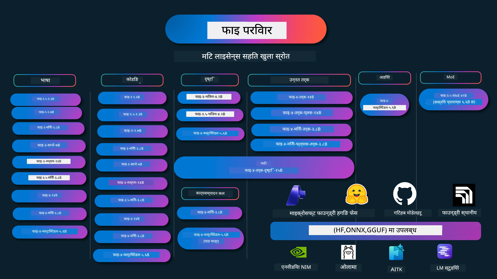

# फाइ कुकबुक: माइक्रोसफ्टको फाइ मोडेलहरूसँग हातले काम गर्ने उदाहरणहरू

[](https://codespaces.new/microsoft/phicookbook)
[](https://vscode.dev/redirect?url=vscode://ms-vscode-remote.remote-containers/cloneInVolume?url=https://github.com/microsoft/phicookbook)

[](https://GitHub.com/microsoft/phicookbook/graphs/contributors/?WT.mc_id=aiml-137032-kinfeylo)
[](https://GitHub.com/microsoft/phicookbook/issues/?WT.mc_id=aiml-137032-kinfeylo)
[](https://GitHub.com/microsoft/phicookbook/pulls/?WT.mc_id=aiml-137032-kinfeylo)
[](http://makeapullrequest.com?WT.mc_id=aiml-137032-kinfeylo)

[](https://GitHub.com/microsoft/phicookbook/watchers/?WT.mc_id=aiml-137032-kinfeylo)
[](https://GitHub.com/microsoft/phicookbook/network/?WT.mc_id=aiml-137032-kinfeylo)
[](https://GitHub.com/microsoft/phicookbook/stargazers/?WT.mc_id=aiml-137032-kinfeylo)

[](https://discord.com/invite/ByRwuEEgH4)

फाइ माइक्रोसफ्टद्वारा विकास गरिएको खुला स्रोत एआई मोडेलहरूको एक शृंखला हो।

फाइ हाल सानो भाषा मोडेल (SLM)मा सबैभन्दा शक्तिशाली र लागत-प्रभावकारी हो, धेरै-भाषा, तर्क, पाठ/च्याट सिर्जना, कोडिङ, छवि, अडियो र अन्य परिदृश्यहरूमा राम्रो मापन परिणामहरू सहित।

तपाइँ फाइलाई क्लाउड वा एज उपकरणहरूमा तैनाथ गर्न सक्नुहुन्छ, र सीमित कम्प्युटिङ पावरसहित सजिलैसँग जनरेटिभ एआई अनुप्रयोगहरू निर्माण गर्न सक्नुहुन्छ।

यी स्रोतहरू प्रयोग गर्न सुरू गर्न तलका चरणहरू पालना गर्नुहोस्:
1. **रिपोजिटरी फोर्क गर्नुहोस्**: क्लिक गर्नुहोस् [](https://GitHub.com/microsoft/phicookbook/network/?WT.mc_id=aiml-137032-kinfeylo)
2. **रिपोजिटरी क्लोन गर्नुहोस्**: `git clone https://github.com/microsoft/PhiCookBook.git`
3. [**माइक्रोसफ्ट एआई डिस्कोर्ड समुदायमा सामेल हुनुहोस् र विशेषज्ञहरू र अन्य विकासकर्ताहरूलाई भेट्नुहोस्**](https://discord.com/invite/ByRwuEEgH4?WT.mc_id=aiml-137032-kinfeylo)



### 🌐 बहु-भाषा समर्थन

#### GitHub Action द्वारा समर्थित (स्वचालित र सधैं अद्यावधिक)

<!-- CO-OP TRANSLATOR LANGUAGES TABLE START -->
[Arabic](../ar/README.md) | [Bengali](../bn/README.md) | [Bulgarian](../bg/README.md) | [Burmese (Myanmar)](../my/README.md) | [Chinese (Simplified)](../zh-CN/README.md) | [Chinese (Traditional, Hong Kong)](../zh-HK/README.md) | [Chinese (Traditional, Macau)](../zh-MO/README.md) | [Chinese (Traditional, Taiwan)](../zh-TW/README.md) | [Croatian](../hr/README.md) | [Czech](../cs/README.md) | [Danish](../da/README.md) | [Dutch](../nl/README.md) | [Estonian](../et/README.md) | [Finnish](../fi/README.md) | [French](../fr/README.md) | [German](../de/README.md) | [Greek](../el/README.md) | [Hebrew](../he/README.md) | [Hindi](../hi/README.md) | [Hungarian](../hu/README.md) | [Indonesian](../id/README.md) | [Italian](../it/README.md) | [Japanese](../ja/README.md) | [Kannada](../kn/README.md) | [Khmer](../km/README.md) | [Korean](../ko/README.md) | [Lithuanian](../lt/README.md) | [Malay](../ms/README.md) | [Malayalam](../ml/README.md) | [Marathi](../mr/README.md) | [Nepali](./README.md) | [Nigerian Pidgin](../pcm/README.md) | [Norwegian](../no/README.md) | [Persian (Farsi)](../fa/README.md) | [Polish](../pl/README.md) | [Portuguese (Brazil)](../pt-BR/README.md) | [Portuguese (Portugal)](../pt-PT/README.md) | [Punjabi (Gurmukhi)](../pa/README.md) | [Romanian](../ro/README.md) | [Russian](../ru/README.md) | [Serbian (Cyrillic)](../sr/README.md) | [Slovak](../sk/README.md) | [Slovenian](../sl/README.md) | [Spanish](../es/README.md) | [Swahili](../sw/README.md) | [Swedish](../sv/README.md) | [Tagalog (Filipino)](../tl/README.md) | [Tamil](../ta/README.md) | [Telugu](../te/README.md) | [Thai](../th/README.md) | [Turkish](../tr/README.md) | [Ukrainian](../uk/README.md) | [Urdu](../ur/README.md) | [Vietnamese](../vi/README.md)

> **स्थानीय रूपमा क्लोन गर्न रुचाउनुहुन्छ?**
>
> यो रिपोजिटरीमा ५०+ भाषा अनुवादहरू समावेश छन् जसले डाउनलोड साइजलाई धेरै बृद्धि गर्छ। अनुवादहरू बिना क्लोन गर्न स्पार्स चेकआउट प्रयोग गर्नुहोस्:
>
> **Bash / macOS / Linux:**
> ```bash
> git clone --filter=blob:none --sparse https://github.com/microsoft/PhiCookBook.git
> cd PhiCookBook
> git sparse-checkout set --no-cone '/*' '!translations' '!translated_images'
> ```
>
> **CMD (Windows):**
> ```cmd
> git clone --filter=blob:none --sparse https://github.com/microsoft/PhiCookBook.git
> cd PhiCookBook
> git sparse-checkout set --no-cone "/*" "!translations" "!translated_images"
> ```
>
> यसले तपाईंलाई कोर्स पूरा गर्न आवश्यक सबै कुरा छिटो डाउनलोडको साथ दिन्छ।
<!-- CO-OP TRANSLATOR LANGUAGES TABLE END -->

## विषय सूची

- परिचय
  - [फाइ परिवारमा स्वागत छ](./md/01.Introduction/01/01.PhiFamily.md)
  - [तपाईंको वातावरण सेटअप गर्दै](./md/01.Introduction/01/01.EnvironmentSetup.md)
  - [महत्त्वपूर्ण प्रविधिहरू बुझ्दै](./md/01.Introduction/01/01.Understandingtech.md)
  - [फाइ मोडेलहरूको लागि एआई सुरक्षा](./md/01.Introduction/01/01.AISafety.md)
  - [फाइ हार्डवेयर समर्थन](./md/01.Introduction/01/01.Hardwaresupport.md)
  - [प्लेटफर्महरूमा फाइ मोडेलहरू र उपलब्धता](./md/01.Introduction/01/01.Edgeandcloud.md)
  - [Guidance-ai र फाइ उपयोग गर्दै](./md/01.Introduction/01/01.Guidance.md)
  - [GitHub मार्केटप्लेस मोडेलहरू](https://github.com/marketplace/models)
  - [Azure AI मोडेल क्याटलग](https://ai.azure.com)

- फरक वातावरणमा फाइ इन्फरेन्स
    -  [Hugging face](./md/01.Introduction/02/01.HF.md)
    -  [GitHub मोडेलहरू](./md/01.Introduction/02/02.GitHubModel.md)
    -  [Microsoft Foundry मोडेल क्याटलग](./md/01.Introduction/02/03.AzureAIFoundry.md)
    -  [Ollama](./md/01.Introduction/02/04.Ollama.md)
    -  [AI टुलकिट VSCode (AITK)](./md/01.Introduction/02/05.AITK.md)
    -  [NVIDIA NIM](./md/01.Introduction/02/06.NVIDIA.md)
    -  [Foundry लोकल](./md/01.Introduction/02/07.FoundryLocal.md)

- फाइ परिवार इन्फरेन्स
    - [iOS मा फाइ इन्फरेन्स](./md/01.Introduction/03/iOS_Inference.md)
    - [Android मा फाइ इन्फरेन्स](./md/01.Introduction/03/Android_Inference.md)
    - [Jetson मा फाइ इन्फरेन्स](./md/01.Introduction/03/Jetson_Inference.md)
    - [AI PC मा फाइ इन्फरेन्स](./md/01.Introduction/03/AIPC_Inference.md)
    - [Apple MLX फ्रेमवर्क प्रयोग गरी फाइ इन्फरेन्स](./md/01.Introduction/03/MLX_Inference.md)
    - [लोकल सर्भरमा फाइ इन्फरेन्स](./md/01.Introduction/03/Local_Server_Inference.md)
    - [AI टुलकिट प्रयोग गरी रिमोट सर्भरमा फाइ इन्फरेन्स](./md/01.Introduction/03/Remote_Interence.md)
    - [Rust संग फाइ इन्फरेन्स](./md/01.Introduction/03/Rust_Inference.md)
    - [लोकलमा फाइ--भिजन इन्फरेन्स](./md/01.Introduction/03/Vision_Inference.md)
    - [Kaito AKS, Azure Containers (अधिकृत समर्थन) संग फाइ इन्फरेन्स](./md/01.Introduction/03/Kaito_Inference.md)
-  [फाइ परिवार क्वान्टिफाइङ](./md/01.Introduction/04/QuantifyingPhi.md)
    - [llama.cpp प्रयोग गरी Phi-3.5 / 4 क्वान्टाइजिङ](./md/01.Introduction/04/UsingLlamacppQuantifyingPhi.md)
    - [onnxruntime को लागि जनरेटिभ AI विस्तारहरू प्रयोग गरी Phi-3.5 / 4 क्वान्टाइजिङ](./md/01.Introduction/04/UsingORTGenAIQuantifyingPhi.md)
    - [Intel OpenVINO प्रयोग गरी Phi-3.5 / 4 क्वान्टाइजिङ](./md/01.Introduction/04/UsingIntelOpenVINOQuantifyingPhi.md)
    - [Apple MLX Framework प्रयोग गरी Phi-3.5 / 4 क्वान्टाइजिङ](./md/01.Introduction/04/UsingAppleMLXQuantifyingPhi.md)

-  फाइको मूल्यांकन
    - [उत्तरदायी एआई](./md/01.Introduction/05/ResponsibleAI.md)
    - [माइक्रोसफ्ट Foundry को मूल्यांकनका लागि](./md/01.Introduction/05/AIFoundry.md)
    - [मूल्यांकनका लागि Promptflow को प्रयोग](./md/01.Introduction/05/Promptflow.md)
 
- Azure AI Search सँग RAG
    - [Phi-4-mini र Phi-4-multimodal (RAG) Azure AI Search सँग कसरी प्रयोग गर्ने](https://github.com/microsoft/PhiCookBook/blob/main/code/06.E2E/E2E_Phi-4-RAG-Azure-AI-Search.ipynb)
    - [Zero-Cloud Local Hybrid RAG SQLite FTS5 र phi-4-mini सँग](https://github.com/microsoft/PhiCookBook/blob/main/code/06.E2E/E2E_Phi-4-mini_Local_Hybrid_RAG_SQLite_FTS5.ipynb)

- फाइ अनुप्रयोग विकास नमूनाहरू
  - पाठ र च्याट अनुप्रयोगहरू
    - Phi-4 नमूनाहरू 
      - [📓] [Phi-4-mini ONNX मोडेलसँग च्याट](./md/02.Application/01.TextAndChat/Phi4/ChatWithPhi4ONNX/README.md)
      - [Phi-4 लोकल ONNX मोडेलसँग च्याट .NET](../../md/04.HOL/dotnet/src/LabsPhi4-Chat-01OnnxRuntime)
      - [Semantic Kernel प्रयोग गरी Phi-4 ONNX सहित च्याट .NET कन्सोल अनुप्रयोग](../../md/04.HOL/dotnet/src/LabsPhi4-Chat-02SK)

    - Phi-3 / 3.5 नमुना
      - [Phi3, ONNX Runtime Web र WebGPU प्रयोग गरेर ब्राउजरमा स्थानीय च्याटबोट](https://github.com/microsoft/onnxruntime-inference-examples/tree/main/js/chat)
      - [OpenVino च्याट](./md/02.Application/01.TextAndChat/Phi3/E2E_OpenVino_Chat.md)
      - [धेरै मोडल - अन्तरक्रियात्मक Phi-3-mini र OpenAI Whisper](./md/02.Application/01.TextAndChat/Phi3/E2E_Phi-3-mini_with_whisper.md)
      - [MLFlow - रैपर बनाउन र MLFlow सँग Phi-3 प्रयोग गर्न](./md//02.Application/01.TextAndChat/Phi3/E2E_Phi-3-MLflow.md)
      - [मोडेल अनुकूलन - Olive सँग ONNX Runtime Web को लागि Phi-3-min मोडल कसरी अनुकूल गर्ने](https://github.com/microsoft/Olive/tree/main/examples/phi3)
      - [WinUI3 एप Phi-3 mini-4k-instruct-onnx सँग](https://github.com/microsoft/Phi3-Chat-WinUI3-Sample/)
      -[WinUI3 धेरै मोडल AI सञ्चालित नोट्स एप नमुना](https://github.com/microsoft/ai-powered-notes-winui3-sample)
      - [विशेष अनुकूलन र Prompt flow सँग आफ्नै Phi-3 मोडलहरू एकीकृत गर्नुहोस्](./md/02.Application/01.TextAndChat/Phi3/E2E_Phi-3-FineTuning_PromptFlow_Integration.md)
      - [Microsoft Foundry मा Prompt flow सँग Phi-3 मोडल विशेष अनुकूलन र एकीकरण](./md/02.Application/01.TextAndChat/Phi3/E2E_Phi-3-FineTuning_PromptFlow_Integration_AIFoundry.md)
      - [Microsoft को जिम्मेवार AI सिद्धान्तहरूमा केन्द्रित Microsoft Foundry मा विशेष अनुकूलित Phi-3 / Phi-3.5 मोडल मूल्याङ्कन](./md/02.Application/01.TextAndChat/Phi3/E2E_Phi-3-Evaluation_AIFoundry.md)
      - [📓] [Phi-3.5-mini-instruct भाषा पूर्वानुमान नमुना (चिनियाँ/अंग्रेजी)](./md/02.Application/01.TextAndChat/Phi3/phi3-instruct-demo.ipynb)
      - [Phi-3.5-Instruct WebGPU RAG च्याटबोट](./md/02.Application/01.TextAndChat/Phi3/WebGPUWithPhi35Readme.md)
      - [Windows GPU प्रयोग गरेर Phi-3.5-Instruct ONNX सँग Prompt flow समाधान सिर्जना गर्ने](./md/02.Application/01.TextAndChat/Phi3/UsingPromptFlowWithONNX.md)
      - [Microsoft Phi-3.5 tflite प्रयोग गरेर Android एप सिर्जना गर्ने](./md/02.Application/01.TextAndChat/Phi3/UsingPhi35TFLiteCreateAndroidApp.md)
      - [स्थानीय ONNX Phi-3 मोडल प्रयोग गरेर Microsoft.ML.OnnxRuntime सँग Q&A .NET उदाहरण](../../md/04.HOL/dotnet/src/LabsPhi301)
      - [Semantic Kernel र Phi-3 सहित कन्सोल च्याट .NET एप](../../md/04.HOL/dotnet/src/LabsPhi302)

  - Azure AI Inferencing SDK कोड आधारित नमुना 
    - Phi-4 नमुना 
      - [📓] [Phi-4-multimodal प्रयोग गरेर प्रोजेक्ट कोड निर्माण](./md/02.Application/02.Code/Phi4/GenProjectCode/README.md)
    - Phi-3 / 3.5 नमुना
      - [Microsoft Phi-3 परिवारसँग आफ्नै Visual Studio Code GitHub Copilot च्याट निर्माण गर्नुहोस्](./md/02.Application/02.Code/Phi3/VSCodeExt/README.md)
      - [GitHub मोडेलहरूद्वारा Phi-3.5 सँग आफ्नै Visual Studio Code च्याट कोपिलट एजेन्ट सिर्जना गर्नुहोस्](/md/02.Application/02.Code/Phi3/CreateVSCodeChatAgentWithGitHubModels.md)

  - उन्नत तर्क नमुना
    - Phi-4 नमुना 
      - [📓] [Phi-4-mini-तर्क वा Phi-4-तर्क नमुना](./md/02.Application/03.AdvancedReasoning/Phi4/AdvancedResoningPhi4mini/README.md)
      - [📓] [Microsoft Olive सँग Phi-4-mini-तर्क विशेष अनुकूलन](./md/02.Application/03.AdvancedReasoning/Phi4/AdvancedResoningPhi4mini/olive_ft_phi_4_reasoning_with_medicaldata.ipynb)
      - [📓] [Apple MLX सँग Phi-4-mini-तर्क विशेष अनुकूलन](./md/02.Application/03.AdvancedReasoning/Phi4/AdvancedResoningPhi4mini/mlx_ft_phi_4_reasoning_with_medicaldata.ipynb)
      - [📓] [GitHub मोडेलहरूसँग Phi-4-mini-तर्क](./md/02.Application/02.Code/Phi4r/github_models_inference.ipynb)
      - [📓] [Microsoft Foundry मोडेलहरू साथ Phi-4-mini-तर्क](./md/02.Application/02.Code/Phi4r/azure_models_inference.ipynb)
  - डेमो
      - [Phi-4-mini डेमोहरू Hugging Face Spaces मा होस्ट गरिएको](https://huggingface.co/spaces/microsoft/phi-4-mini?WT.mc_id=aiml-137032-kinfeylo)
      - [Phi-4-multimodal डेमोहरू Hugging Face Spaces मा होस्ट गरिएको](https://huggingface.co/spaces/microsoft/phi-4-multimodal?WT.mc_id=aiml-137032-kinfeylo)
  - दृश्य नमुना
    - Phi-4 नमुना 
      - [📓] [Phi-4-multimodal प्रयोग गरेर छविहरू पढ्नुहोस् र कोड उत्पादन गर्नुहोस्](./md/02.Application/04.Vision/Phi4/CreateFrontend/README.md) 
    - Phi-3 / 3.5 नमुना
      -  [📓][Phi-3-vision-छवि पाठ देखि पाठ](./md/02.Application/04.Vision/Phi3/E2E_Phi-3-vision-image-text-to-text-online-endpoint.ipynb)
      - [Phi-3-vision-ONNX](https://onnxruntime.ai/docs/genai/tutorials/phi3-v.html)
      - [📓][Phi-3-vision CLIP एम्बेडिङ](./md/02.Application/04.Vision/Phi3/E2E_Phi-3-vision-image-text-to-text-online-endpoint.ipynb)
      - [DEMO: Phi-3 रीसाइकलिंग](https://github.com/jennifermarsman/PhiRecycling/)
      - [Phi-3-vision - दृश्य भाषा सहायक - Phi3-Vision र OpenVINO सँग](https://docs.openvino.ai/nightly/notebooks/phi-3-vision-with-output.html)
      - [Phi-3 Vision Nvidia NIM](./md/02.Application/04.Vision/Phi3/E2E_Nvidia_NIM_Vision.md)
      - [Phi-3 Vision OpenVino](./md/02.Application/04.Vision/Phi3/E2E_OpenVino_Phi3Vision.md)
      - [📓][Phi-3.5 Vision बहु-फ्रेम वा बहु-छवि नमुना](./md/02.Application/04.Vision/Phi3/phi3-vision-demo.ipynb)
      - [Microsoft.ML.OnnxRuntime .NET प्रयोग गरेर Phi-3 Vision स्थानीय ONNX मोडल](../../md/04.HOL/dotnet/src/LabsPhi303)
      - [मेनु आधारित Phi-3 Vision स्थानीय ONNX मोडल Microsoft.ML.OnnxRuntime .NET सँग](../../md/04.HOL/dotnet/src/LabsPhi304)

  - तर्क-भिजन नमुना
    - Phi-4-तर्क-भिजन-15B 
      - [📓] [Phi-4-तर्क-भिजन-15B प्रयोग गरेर jaywalking पत्ता लगाउने](./md/02.Application/10.ReasoningVision/Phi_4_reasoning_vision_15b_Jaywalking.ipynb)
      - [📓] [Phi-4-तर्क-भिजन-15B प्रयोग गरेर गणित](./md/02.Application/10.ReasoningVision/Phi_4_reasoning_vision_15b_Math.ipynb)
      - [📓] [Phi-4-तर्क-भिजन-15B प्रयोग गरेर UI पत्ता लगाउने](./md/02.Application/10.ReasoningVision/Phi_4_reasoning_vision_15b_ui.ipynb)

  - गणित नमुना
    -  Phi-4-मिनी-फ्ल्यास-तर्क-निर्देशन नमुना  [Phi-4-मिनी-फ्ल्यास-तर्क-निर्देशन संग गणित डेमो](./md/02.Application/09.Math/MathDemo.ipynb)

  - अडियो नमुना
    - Phi-4 नमुना 
      - [📓] [Phi-4-multimodal प्रयोग गरेर अडियो ट्रान्सक्रिप्ट निकाल्ने](./md/02.Application/05.Audio/Phi4/Transciption/README.md)
      - [📓] [Phi-4-multimodal अडियो नमुना](./md/02.Application/05.Audio/Phi4/Siri/demo.ipynb)
      - [📓] [Phi-4-multimodal भाषण अनुवाद नमुना](./md/02.Application/05.Audio/Phi4/Translate/demo.ipynb)
      - [.NET कन्सोल अनुप्रयोग Phi-4-multimodal प्रयोग गरेर अडियो फाइल विश्लेषण र ट्रान्सक्रिप्ट उत्पादन](../../md/04.HOL/dotnet/src/LabsPhi4-MultiModal-02Audio)

  - MOE नमुना
    - Phi-3 / 3.5 नमुना
      - [📓] [Phi-3.5 विशेषज्ञहरूको मिश्रण मोडेलहरू (MoEs) सामाजिक मिडिया नमुना](./md/02.Application/06.MoE/Phi3/phi3_moe_demo.ipynb)
      - [📓] [NVIDIA NIM Phi-3 MOE, Azure AI खोज, र LlamaIndex सँग Retrieval-Augmented Generation (RAG) पाइपलाइन निर्माण](./md/02.Application/06.MoE/Phi3/azure-ai-search-nvidia-rag.ipynb)
      - 
  - कार्य कलिङ नमुना
    - Phi-4 नमुना 🆕
      -  [📓] [Phi-4-mini प्रयोग गरेर कार्य कलिङ](./md/02.Application/07.FunctionCalling/Phi4/FunctionCallingBasic/README.md)
      -  [📓] [Phi-4-mini सँग बहु-एजेन्ट सिर्जना गर्न कार्य कलिङ प्रयोग](./md/02.Application/07.FunctionCalling/Phi4/Multiagents/Phi_4_mini_multiagent.ipynb)
      -  [📓] [Ollama सँग कार्य कलिङ प्रयोग](./md/02.Application/07.FunctionCalling/Phi4/Ollama/ollama_functioncalling.ipynb)
      -  [📓] [ONNX सँग कार्य कलिङ प्रयोग](./md/02.Application/07.FunctionCalling/Phi4/ONNX/onnx_parallel_functioncalling.ipynb)
  - बहु-मोडल मिक्सिङ नमुना
    - Phi-4 नमुना 🆕
      -  [📓] [प्रविधि पत्रकारको रूपमा Phi-4-multimodal प्रयोग](./md/02.Application/08.Multimodel/Phi4/TechJournalist/phi_4_mm_audio_text_publish_news.ipynb)
      - [.NET कन्सोल अनुप्रयोग Phi-4-multimodal प्रयोग गरेर छविहरू विश्लेषण गर्न](../../md/04.HOL/dotnet/src/LabsPhi4-MultiModal-01Images)

- Phi नमुनाहरूमा विशेष अनुकूलन
  - [विशेष अनुकूलन परिदृश्यहरू](./md/03.FineTuning/FineTuning_Scenarios.md)
  - [विशेष अनुकूलन र RAG तुलना](./md/03.FineTuning/FineTuning_vs_RAG.md)
  - [Phi-3 लाई उद्योग विशेषज्ञ बन्नुहोस् विशेष अनुकूलन](./md/03.FineTuning/LetPhi3gotoIndustriy.md)
  - [VS Code का लागि AI टूलकिटको साथ Phi-3 विशेष अनुकूलन](./md/03.FineTuning/Finetuning_VSCodeaitoolkit.md)
  - [Azure मशीन लर्निंग सेवा सँग Phi-3 विशेष अनुकूलन](./md/03.FineTuning/Introduce_AzureML.md)
  - [Lora सँग Phi-3 विशेष अनुकूलन](./md/03.FineTuning/FineTuning_Lora.md)
  - [QLora सँग Phi-3 विशेष अनुकूलन](./md/03.FineTuning/FineTuning_Qlora.md)
  - [Microsoft Foundry सँग Phi-3 विशेष अनुकूलन](./md/03.FineTuning/FineTuning_AIFoundry.md)
  - [Azure ML CLI/SDK सँग Phi-3 विशेष अनुकूलन](./md/03.FineTuning/FineTuning_MLSDK.md)
  - [Microsoft Olive सँग विशेष अनुकूलन](./md/03.FineTuning/FineTuning_MicrosoftOlive.md)
  - [Microsoft Olive Hands-On Lab सँग विशेष अनुकूलन](./md/03.FineTuning/olive-lab/readme.md)
  - [Weights and Bias प्रयोग गरेर Phi-3-vision विशेष अनुकूलन](./md/03.FineTuning/FineTuning_Phi-3-visionWandB.md)

  - [एप्पल MLX फ्रेमवर्कसँग Phi-3 को फाइन-ट्यूनिङ](./md/03.FineTuning/FineTuning_MLX.md)
  - [Phi-3-vision को फाइन-ट्यूनिङ (औपचारिक समर्थन)](./md/03.FineTuning/FineTuning_Vision.md)
  - [Kaito AKS, Azure कन्टेनरहरू (औपचारिक समर्थन) सँग Phi-3 को फाइन-ट्यूनिङ](./md/03.FineTuning/FineTuning_Kaito.md)
  - [Phi-3 र 3.5 Vision को फाइन-ट्यूनिङ](https://github.com/2U1/Phi3-Vision-Finetune)

- हैण्ड्स अन ल्याब
  - [अत्याधुनिक मोडेलहरू अन्वेषण गर्दै: LLMs, SLMs, स्थानीय विकास र थप](https://github.com/microsoft/aitour-exploring-cutting-edge-models)
  - [NLP क्षमता अनलक गर्दै: Microsoft Olive सँग फाइन-ट्यूनिङ](https://github.com/azure/Ignite_FineTuning_workshop)

- शैक्षिक अनुसन्धान पत्रहरू र प्रकाशनहरू
  - [Textbooks Are All You Need II: phi-1.5 प्राविधिक रिपोर्ट](https://arxiv.org/abs/2309.05463)
  - [Phi-3 प्राविधिक रिपोर्ट: तपाईंको फोनमा स्थानीय रूपमा अत्यधिक सक्षम भाषा मोडेल](https://arxiv.org/abs/2404.14219)
  - [Phi-4 प्राविधिक रिपोर्ट](https://arxiv.org/abs/2412.08905)
  - [Phi-4-Mini प्राविधिक रिपोर्ट: मिक्स्चर-ऑफ-LoRAs मार्फत कम्प्याक्ट तर शक्तिशाली बहुमाध्यम भाषा मोडेलहरू](https://arxiv.org/abs/2503.01743)
  - [सवारीसाधन भित्र कार्य-कलिङका लागि साना भाषा मोडेलहरूको अनुकूलन](https://arxiv.org/abs/2501.02342)
  - [(WhyPHI) बहुविकल्पीय प्रश्नोत्तरको लागि PHI-3 को फाइन-ट्यूनिङ: विधि, परिणामहरू, र चुनौतीहरू](https://arxiv.org/abs/2501.01588)
  - [Phi-4-कारण प्राविधिक रिपोर्ट](https://www.microsoft.com/en-us/research/wp-content/uploads/2025/04/phi_4_reasoning.pdf)
  - [Phi-4-मिनी-कारण प्राविधिक रिपोर्ट](https://huggingface.co/microsoft/Phi-4-mini-reasoning/blob/main/Phi-4-Mini-Reasoning.pdf)

## Phi मोडेलहरू प्रयोग गर्दै

### Microsoft Foundry मा Phi

तपाईं Microsoft Phi कसरी प्रयोग गर्ने र तपाईका विभिन्न हार्डवेयर उपकरणहरूमा ई2ई समाधान कसरी बनाउने भन्ने सिक्न सक्नुहुन्छ। आफैं Phi अनुभव गर्न, मोडेलहरूसँग खेल्न सुरु गर्नुहोस् र तपाईका परिदृश्यहरूको लागि Phi अनुकूलन गर्नुहोस् [Microsoft Foundry Azure AI Model Catalog](https://aka.ms/phi3-azure-ai) प्रयोग गरेर। तपाईले [Microsoft Foundry](/md/02.QuickStart/AzureAIFoundry_QuickStart.md) सँग सुरु गर्ने विषयमा थप जान्न सक्नुहुन्छ।

**प्लेलगाउन्ड**
प्रत्येक मोडेलसँग परीक्षण गर्नको लागि समर्पित प्लेलगाउन्ड छ [Azure AI Playground](https://aka.ms/try-phi3)।

### GitHub मोडेलहरूमा Phi

तपाईं Microsoft Phi कसरी प्रयोग गर्ने र तपाईका विभिन्न हार्डवेयर उपकरणहरूमा ई2ई समाधान कसरी बनाउने भन्ने सिक्न सक्नुहुन्छ। आफैं Phi अनुभव गर्न, मोडेलसँग खेल्न सुरु गर्नुहोस् र तपाईका परिदृश्यहरूको लागि Phi अनुकूलन गर्नुहोस् [GitHub Model Catalog](https://github.com/marketplace/models?WT.mc_id=aiml-137032-kinfeylo) प्रयोग गरेर। तपाईले [GitHub Model Catalog](/md/02.QuickStart/GitHubModel_QuickStart.md) सँग सुरु गर्ने विषयमा थप जान्न सक्नुहुन्छ।

**प्लेलगाउन्ड**
प्रत्येक मोडेलसँग परीक्षण गर्नको लागि समर्पित [प्लेलगाउन्ड छ](/md/02.QuickStart/GitHubModel_QuickStart.md)।

### Hugging Face मा Phi

तपाईं मोडेललाई पनि [Hugging Face](https://huggingface.co/microsoft) मा फेला पार्न सक्नुहुन्छ।

**प्लेलगाउन्ड**
 [Hugging Chat प्लेलगाउन्ड](https://huggingface.co/chat/models/microsoft/Phi-3-mini-4k-instruct)

 ## 🎒 अन्य पाठ्यक्रमहरू

हाम्रो टोलीले अन्य पाठ्यक्रमहरू उत्पादन गर्दछ! हेर्नुहोस्:

<!-- CO-OP TRANSLATOR OTHER COURSES START -->
### LangChain
[](https://aka.ms/langchain4j-for-beginners)
[](https://aka.ms/langchainjs-for-beginners?WT.mc_id=m365-94501-dwahlin)
[](https://github.com/microsoft/langchain-for-beginners?WT.mc_id=m365-94501-dwahlin)
---

### Azure / Edge / MCP / एजेन्टहरू
[](https://github.com/microsoft/AZD-for-beginners?WT.mc_id=academic-105485-koreyst)
[](https://github.com/microsoft/edgeai-for-beginners?WT.mc_id=academic-105485-koreyst)
[](https://github.com/microsoft/mcp-for-beginners?WT.mc_id=academic-105485-koreyst)
[](https://github.com/microsoft/ai-agents-for-beginners?WT.mc_id=academic-105485-koreyst)

---
 
### सृजनात्मक AI श्रृंखला
[](https://github.com/microsoft/generative-ai-for-beginners?WT.mc_id=academic-105485-koreyst)
[-9333EA?style=for-the-badge&labelColor=E5E7EB&color=9333EA)](https://github.com/microsoft/Generative-AI-for-beginners-dotnet?WT.mc_id=academic-105485-koreyst)
[-C084FC?style=for-the-badge&labelColor=E5E7EB&color=C084FC)](https://github.com/microsoft/generative-ai-for-beginners-java?WT.mc_id=academic-105485-koreyst)
[-E879F9?style=for-the-badge&labelColor=E5E7EB&color=E879F9)](https://github.com/microsoft/generative-ai-with-javascript?WT.mc_id=academic-105485-koreyst)

---
 
### मुख्य सिकाइ
[](https://aka.ms/ml-beginners?WT.mc_id=academic-105485-koreyst)
[](https://aka.ms/datascience-beginners?WT.mc_id=academic-105485-koreyst)
[](https://aka.ms/ai-beginners?WT.mc_id=academic-105485-koreyst)
[](https://github.com/microsoft/Security-101?WT.mc_id=academic-96948-sayoung)
[](https://aka.ms/webdev-beginners?WT.mc_id=academic-105485-koreyst)
[](https://aka.ms/iot-beginners?WT.mc_id=academic-105485-koreyst)
[](https://github.com/microsoft/xr-development-for-beginners?WT.mc_id=academic-105485-koreyst)

---
 
### Copilot श्रृंखला
[](https://aka.ms/GitHubCopilotAI?WT.mc_id=academic-105485-koreyst)
[](https://github.com/microsoft/mastering-github-copilot-for-dotnet-csharp-developers?WT.mc_id=academic-105485-koreyst)
[](https://github.com/microsoft/CopilotAdventures?WT.mc_id=academic-105485-koreyst)
<!-- CO-OP TRANSLATOR OTHER COURSES END -->

## दायित्वपूर्बक AI

Microsoft हाम्रा ग्राहकहरूलाई हाम्रो AI उत्पादनहरू दायित्वपूर्वक प्रयोग गर्न मद्दत गर्न, हाम्रो सिकाइहरू साझेदारी गर्न, र पारदर्शिता नोटहरू र प्रभाव मूल्यांकन जस्ता उपकरणहरू मार्फत विश्वासमा आधारित साझेदारीहरू निर्माण गर्न प्रतिबद्ध छ। यी मध्ये धेरै स्रोतहरू [https://aka.ms/RAI](https://aka.ms/RAI) मा फेला पार्न सकिन्छ।
Microsoft को दायित्वपूर्ण AI दृष्टिकोण हाम्रो निष्पक्षता, विश्वसनीयता र सुरक्षा, गोपनीयता र सुरक्षा, समावेशिता, पारदर्शिता, र जवाफदेहिताका AI सिद्धान्तहरूमा आधारित छ।

ठूलो स्तरका प्राकृतिक भाषा, छवि, र भाषण मोडेलहरू - जस्तै यस नमुनामा प्रयोग गरिएका - सम्भावित रूपमा निष्पक्ष छैनन्, अविश्वसनीय वा आपत्तिजनक व्यवहार गर्न सक्छन्, जसले नोक्सान पुर्‍याउन सक्छ। कृपया जोखिम र सीमाहरूको बारेमा जानकारी पाउन [Azure OpenAI सेवा पारदर्शिता नोट](https://learn.microsoft.com/legal/cognitive-services/openai/transparency-note?tabs=text) परामर्श गर्नुहोस्।


यी जोखिमहरू कम गर्न सिफारिस गरिएको तरिका भनेको तपाईंको आर्किटेक्चरमा एउटा सुरक्षा प्रणाली समावेश गर्नु हो जसले हानिकारक व्यवहार पत्ता लगाउन र रोक्न सक्छ। [Azure AI Content Safety](https://learn.microsoft.com/azure/ai-services/content-safety/overview) एउटा स्वतन्त्र सुरक्षा तह प्रदान गर्छ, जुन अनुप्रयोग र सेवाहरूमा हानिकारक प्रयोगकर्ता-जनित र AI-जनित सामग्री पत्ता लगाउन सक्षम छ। Azure AI Content Safety मा टेक्स्ट र इमेज APIहरू समावेश छन् जसले तपाईंलाई हानिकारक सामग्री पत्ता लगाउन अनुमति दिन्छ। Microsoft Foundry भित्र, Content Safety सेवा तपाईंलाई फरक-फरक प्रकारका हानिकारक सामग्री पत्ता लगाउन नमूना कोड हेर्न, अन्वेषण गर्न, र प्रयास गर्न अनुमति दिन्छ। निम्न [शीघ्र सुरु दस्तावेज](https://learn.microsoft.com/azure/ai-services/content-safety/quickstart-text?tabs=visual-studio%2Clinux&pivots=programming-language-rest) ले तपाईंलाई सेवामा अनुरोधहरू गर्न मार्गदर्शन गर्छ।

अर्को कुरामा ध्यान दिनुपर्ने हो भने समग्र अनुप्रयोगको प्रदर्शन हो। मल्टि-मोडल र मल्टि-मोडल अनुप्रयोगहरूसँग, हामीले प्रदर्शनलाई यस्तो अर्थ दिन्छौं कि प्रणाली तपाईं र तपाईंका प्रयोगकर्ताहरूले अपेक्षा गरेझैं काम गर्छ, जसमा हानिकारक नतिजा नजन्माउनु पनि पर्दछ। तपाईंले [प्रदर्शन र गुणस्तर र जोखिम र सुरक्षा मूल्यांकनकर्ता](https://learn.microsoft.com/azure/ai-studio/concepts/evaluation-metrics-built-in) प्रयोग गरेर तपाईंको समग्र अनुप्रयोगको प्रदर्शन मूल्यांकन गर्नु महत्वपूर्ण छ। तपाईंले [अनुकूली मूल्यांकनकर्ताहरू](https://learn.microsoft.com/azure/ai-studio/how-to/develop/evaluate-sdk#custom-evaluators) सिर्जना र मूल्यांकन गर्ने क्षमता पनि राख्नुहुन्छ।

तपाईं आफ्नो विकास वातावरणमा AI अनुप्रयोग मूल्यांकन गर्न सक्नुहुन्छ [Azure AI Evaluation SDK](https://microsoft.github.io/promptflow/index.html) प्रयोग गरेर। परीक्षण डाटासेट वा लक्ष्य दिइएको अवस्थामा, तपाईंको जेनेरेटिभ AI अनुप्रयोगका उत्पन्नहरू निर्माण गरिएको मूल्यांकनकर्ता वा तपाईंको रोजाइका अनुकूली मूल्यांकनकर्ताहरूको साथ मात्रात्मक रूपमा मापन गरिन्छ। तपाईंको प्रणाली मूल्यांकन गर्न azure ai evaluation sdk सँग सुरु गर्न [शीघ्र सुरु मार्गदर्शन](https://learn.microsoft.com/azure/ai-studio/how-to/develop/flow-evaluate-sdk) पालन गर्न सक्नुहुन्छ। एकपटक मूल्यांकन चलाएपछि, तपाईं [Microsoft Foundry मा परिणामहरू देख्न](https://learn.microsoft.com/azure/ai-studio/how-to/evaluate-flow-results) सक्नुहुन्छ। 

## ट्रेडमार्कहरू

यो परियोजनामा परियोजना, उत्पादन, वा सेवाका लागि ट्रेडमार्क वा लोगोहरू समावेश हुन सक्छ। Microsoft ट्रेडमार्क वा लोगोहरूको अधिकृत प्रयोग [Microsoft's Trademark & Brand Guidelines](https://www.microsoft.com/legal/intellectualproperty/trademarks/usage/general) अनुसार हुनुपर्छ र तिनको पालना गर्नुपर्दछ।
यस परियोजनाको परिमार्जित संस्करणमा Microsoft ट्रेडमार्क वा लोगोहरूको प्रयोगले भ्रम उत्पन्न गर्नु हुँदैन वा Microsoft प्रायोजनको संकेत गर्नु हुँदैन। तेस्रो-पक्ष ट्रेडमार्क वा लोगोहरूको कुनै पनि प्रयोग तिनका नीति अनुसार हुनुपर्दछ।

## सहयोग प्राप्त गर्ने तरिका

तपाईं अड्किनुभए वा AI अनुप्रयोग निर्माणबारे कुनै प्रश्न भएमा, सामेल हुनुहोस्:

[](https://aka.ms/foundry/discord)

यदि तपाईंलाई उत्पादन प्रतिक्रिया वा त्रुटिहरू छन् भने:

[](https://aka.ms/foundry/forum)

---

<!-- CO-OP TRANSLATOR DISCLAIMER START -->
**अस्वीकरण**:
यो दस्तावेज़ AI अनुवाद सेवा [Co-op Translator](https://github.com/Azure/co-op-translator) प्रयोग गरेर अनुवाद गरिएको हो। हामी सही हुन प्रयास गर्छौं, तर कृपया जानकार हुनुस् कि स्वचालित अनुवादमा त्रुटिहरू वा अशुद्धताहरू हुन सक्छन्। मूल दस्तावेज़ यसको मूल भाषामा आधिकारिक स्रोत मानिनुपर्छ। महत्वपूर्ण जानकारीका लागि व्यावसायिक मानव अनुवाद सिफारिस गरिन्छ। यस अनुवादको प्रयोगबाट उत्पन्न कुनै पनि गलत बुझाइ वा त्रुटिको लागि हामी जिम्मेवार छैनौं।
<!-- CO-OP TRANSLATOR DISCLAIMER END -->