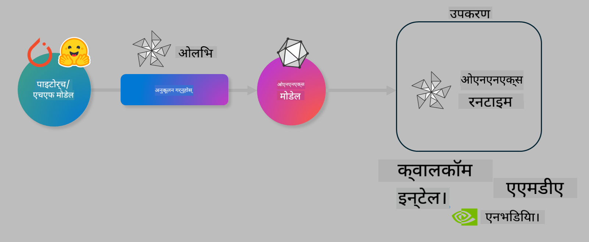

<!--
CO_OP_TRANSLATOR_METADATA:
{
  "original_hash": "6bbe47de3b974df7eea29dfeccf6032b",
  "translation_date": "2025-05-09T04:22:26+00:00",
  "source_file": "code/03.Finetuning/olive-lab/readme.md",
  "language_code": "ne"
}
-->
# Lab. On-Device Inference का लागि AI मोडेलहरू अनुकूलन गर्नुहोस्

## परिचय

> [!IMPORTANT]  
> यो ल्याबका लागि **Nvidia A10 वा A100 GPU** र सम्बन्धित ड्राइभरहरू र CUDA टूलकिट (संस्करण 12+) स्थापना गरिएको हुनुपर्छ।

> [!NOTE]  
> यो **35 मिनेट** लामो ल्याब हो जसले OLIVE प्रयोग गरी मोडेलहरूलाई on-device inference का लागि अनुकूलन गर्ने मुख्य अवधारणाहरूमा व्यावहारिक परिचय दिन्छ।

## सिकाइ उद्देश्यहरू

यस ल्याबको अन्त्यसम्म, तपाईं OLIVE प्रयोग गरेर यी गर्न सक्षम हुनुहुनेछ:

- AWQ क्वान्टाइजेसन विधि प्रयोग गरी AI मोडेल क्वान्टाइज गर्नुहोस्।  
- विशेष कार्यका लागि AI मोडेललाई फाइन-ट्यून गर्नुहोस्।  
- ONNX Runtime मा कुशल on-device inference का लागि LoRA एडाप्टरहरू (फाइन-ट्यून गरिएको मोडेल) उत्पन्न गर्नुहोस्।

### Olive के हो

Olive (*O*NNX *live*) एक मोडेल अनुकूलन उपकरण हो जससँग CLI पनि छ जसले ONNX runtime +++https://onnxruntime.ai+++ का लागि गुणस्तर र प्रदर्शनका साथ मोडेलहरू पठाउन मद्दत गर्दछ।



Olive मा इनपुट प्रायः PyTorch वा Hugging Face मोडेल हुन्छ र आउटपुट एक अनुकूलित ONNX मोडेल हुन्छ जुन ONNX runtime चलाउने डिभाइस (डिप्लोयमेन्ट टार्गेट) मा कार्यान्वयन हुन्छ। Olive ले डिप्लोयमेन्ट टार्गेटको AI एक्सेलेरेटर (NPU, GPU, CPU) जसलाई Qualcomm, AMD, Nvidia वा Intel जस्ता हार्डवेयर विक्रेताले प्रदान गरेको छ, को लागि मोडेललाई अनुकूलित गर्दछ।

Olive ले *workflow* सञ्चालन गर्छ, जुन मोडेल अनुकूलनका व्यक्तिगत कार्यहरूको क्रमबद्ध श्रृंखला हो जसलाई *passes* भनिन्छ - उदाहरणका लागि: मोडेल कम्प्रेसन, ग्राफ क्याप्चर, क्वान्टाइजेसन, ग्राफ अनुकूलन। प्रत्येक पाससँग त्यस्ता प्यारामिटरहरू हुन्छन् जुन उत्कृष्ट मेट्रिक्स जस्तै सटीकता र लेटेन्सी प्राप्त गर्न ट्यून गर्न सकिन्छ जुन सम्बन्धित इभालुएटरले मूल्याङ्कन गर्छ। Olive ले खोज रणनीति प्रयोग गर्छ जसले खोज एल्गोरिदम मार्फत प्रत्येक पासलाई एक-एक गरी वा समूहमा अटो-ट्यून गर्छ।

#### Olive का फाइदाहरू

- ग्राफ अनुकूलन, कम्प्रेसन र क्वान्टाइजेसनका विभिन्न प्रविधिहरूमा म्यानुअल प्रयास र समय घटाउनुहोस्। आफ्नो गुणस्तर र प्रदर्शन सीमाहरू परिभाषित गर्नुहोस् र Olive लाई सर्वश्रेष्ठ मोडेल स्वचालित रूपमा खोज्न दिनुहोस्।  
- ४०+ निर्मित मोडेल अनुकूलन कम्पोनेन्टहरू जसले क्वान्टाइजेसन, कम्प्रेसन, ग्राफ अनुकूलन र फाइनट्यूनिङका अत्याधुनिक प्रविधिहरू समेट्छ।  
- सामान्य मोडेल अनुकूलन कार्यहरूका लागि सजिलो CLI, जस्तै olive quantize, olive auto-opt, olive finetune।  
- मोडेल प्याकेजिङ र डिप्लोयमेन्ट इन-बिल्ट।  
- **Multi LoRA serving** का लागि मोडेलहरू उत्पन्न गर्न समर्थन।  
- YAML/JSON प्रयोग गरी वर्कफ्लोहरू निर्माण गर्न सकिन्छ जसले मोडेल अनुकूलन र डिप्लोयमेन्ट कार्यहरू समन्वय गर्छ।  
- **Hugging Face** र **Azure AI** सँग एकीकरण।  
- लागत बचतका लागि इन-बिल्ट **क्यासिङ** मेकानिज्म।

## ल्याब निर्देशनहरू

> [!NOTE]  
> कृपया सुनिश्चित गर्नुहोस् कि तपाईंले Azure AI Hub र Project प्रावधान गर्नुभएको छ र Lab 1 अनुसार A100 compute सेटअप गर्नुभएको छ।

### चरण 0: Azure AI Compute सँग जडान गर्नुहोस्

तपाईंले **VS Code** को रिमोट सुविधा प्रयोग गरी Azure AI compute सँग जडान गर्नुहुनेछ।

1. आफ्नो **VS Code** डेस्कटप एप्लिकेसन खोल्नुहोस्।  
1. **Shift+Ctrl+P** थिचेर **command palette** खोल्नुहोस्।  
1. कमाण्ड प्यालेटमा **AzureML - remote: Connect to compute instance in New Window** खोज्नुहोस्।  
1. स्क्रिनमा देखाइएका निर्देशनहरू पालना गर्दै Compute सँग जडान गर्नुहोस्। यसमा तपाईंको Azure Subscription, Resource Group, Project र Lab 1 मा सेटअप गरेको Compute नाम चयन गर्नुपर्नेछ।  
1. एकपटक Azure ML Compute नोडसँग जडान भएपछि, यो **Visual Code को तल बायाँ कुनामा** देखिनेछ `><Azure ML: Compute Name`।

### चरण 1: यो रिपो क्लोन गर्नुहोस्

VS Code मा नयाँ टर्मिनल खोल्न **Ctrl+J** थिच्नुहोस् र यो रिपो क्लोन गर्नुहोस्:

टर्मिनलमा तपाईंलाई प्रॉम्प्ट देखिनेछ

```
azureuser@computername:~/cloudfiles/code$ 
```  
Solution क्लोन गर्नुहोस्  

```bash
cd ~/localfiles
git clone https://github.com/microsoft/phi-3cookbook.git
```

### चरण 2: VS Code मा फोल्डर खोल्नुहोस्

संबन्धित फोल्डरमा VS Code खोल्न तलको कमाण्ड टर्मिनलमा चलाउनुहोस् जसले नयाँ विन्डो खोल्नेछ:

```bash
code phi-3cookbook/code/04.Finetuning/Olive-lab
```

अथवा, तपाईं **File** > **Open Folder** बाट फोल्डर खोल्न सक्नुहुन्छ।

### चरण 3: निर्भरता स्थापना गर्नुहोस्

VS Code मा Azure AI Compute Instance मा टर्मिनल खोल्नुहोस् (टिप: **Ctrl+J**) र तलका कमाण्डहरू चलाएर निर्भरता स्थापना गर्नुहोस्:

```bash
conda create -n olive-ai python=3.11 -y
conda activate olive-ai
pip install -r requirements.txt
az extension remove -n azure-cli-ml
az extension add -n ml
```

> [!NOTE]  
> सबै निर्भरता स्थापना गर्न लगभग ५ मिनेट लाग्नेछ।

यस ल्याबमा तपाईं Azure AI Model catalog बाट मोडेलहरू डाउनलोड र अपलोड गर्नुहुनेछ। मोडेल क्याटलग पहुँच गर्न, Azure मा लगइन गर्नुहोस्:

```bash
az login
```

> [!NOTE]  
> लगइन गर्दा तपाईंलाई आफ्नो सब्स्क्रिप्शन चयन गर्न भनिनेछ। कृपया यस ल्याबको लागि दिइएको सब्स्क्रिप्शन चयन गर्नुहोस्।

### चरण 4: Olive कमाण्डहरू चलाउनुहोस्

VS Code मा Azure AI Compute Instance मा टर्मिनल खोल्नुहोस् (टिप: **Ctrl+J**) र `olive-ai` conda वातावरण सक्रिय छ भनी सुनिश्चित गर्नुहोस्:

```bash
conda activate olive-ai
```

अर्को, कमाण्ड लाइनमा तलका Olive कमाण्डहरू चलाउनुहोस्।

1. **डेटा निरीक्षण गर्नुहोस्:** यस उदाहरणमा, तपाईं Phi-3.5-Mini मोडेललाई यात्रा सम्बन्धी प्रश्नहरूको जवाफ दिन विशेष बनाउन फाइन-ट्यून गर्दै हुनुहुन्छ। तलको कोडले JSON lines ढाँचामा रहेको डाटासेटका केही पहिलो रेकर्डहरू देखाउँछ:

    ```bash
    head data/data_sample_travel.jsonl
    ```

1. **मोडेल क्वान्टाइज गर्नुहोस्:** मोडेललाई प्रशिक्षण गर्नु अघि, तलको कमाण्डले Active Aware Quantization (AWQ) +++https://arxiv.org/abs/2306.00978+++ नामक प्रविधि प्रयोग गरी क्वान्टाइज गर्दछ। AWQ ले मोडेलका तौलहरू क्वान्टाइज गर्दा इन्फरेन्सको समयमा उत्पन्न हुने एक्टिवेसनहरूलाई ध्यानमा राख्छ। यसको अर्थ क्वान्टाइजेसन प्रक्रियाले एक्टिवेसनमा रहेको वास्तविक डेटा वितरणलाई समेट्छ जसले परम्परागत तौल क्वान्टाइजेसन विधिहरूको तुलनामा मोडेल सटीकतामा राम्रो संरक्षण गर्छ।

    ```bash
    olive quantize \
       --model_name_or_path microsoft/Phi-3.5-mini-instruct \
       --trust_remote_code \
       --algorithm awq \
       --output_path models/phi/awq \
       --log_level 1
    ```

    AWQ क्वान्टाइजेसन पूरा गर्न **लगभग ८ मिनेट** लाग्छ र यसले मोडेलको आकारलाई करिब ~7.5GB बाट ~2.5GB मा घटाउँछ।

    यस ल्याबमा, हामीले Hugging Face बाट मोडेलहरू इनपुट गर्ने तरिका देखाउँदैछौं (उदाहरणका लागि: `microsoft/Phi-3.5-mini-instruct`). However, Olive also allows you to input models from the Azure AI catalog by updating the `model_name_or_path` argument to an Azure AI asset ID (for example:  `azureml://registries/azureml/models/Phi-3.5-mini-instruct/versions/4`). 

1. **Train the model:** Next, the `olive finetune` कमाण्डले क्वान्टाइज गरिएको मोडेललाई फाइन-ट्यून गर्छ। क्वान्टाइजेसन पछि होइन, फाइन-ट्यूनिङ अघि मोडेल क्वान्टाइज गर्दा राम्रो सटीकता पाइन्छ किनभने फाइन-ट्यूनिङले क्वान्टाइजेसनबाट आएको केही हानि पुनः प्राप्त गर्छ।

    ```bash
    olive finetune \
        --method lora \
        --model_name_or_path models/phi/awq \
        --data_files "data/data_sample_travel.jsonl" \
        --data_name "json" \
        --text_template "<|user|>\n{prompt}<|end|>\n<|assistant|>\n{response}<|end|>" \
        --max_steps 100 \
        --output_path ./models/phi/ft \
        --log_level 1
    ```

    फाइन-ट्यूनिङ (१०० स्टेप्स) पूरा गर्न **लगभग ६ मिनेट** लाग्छ।

1. **अनुकूलन गर्नुहोस्:** मोडेल प्रशिक्षण पछि, Olive को `auto-opt` command, which will capture the ONNX graph and automatically perform a number of optimizations to improve the model performance for CPU by compressing the model and doing fusions. It should be noted, that you can also optimize for other devices such as NPU or GPU by just updating the `--device` and `--provider` आर्गुमेन्टहरू प्रयोग गरी मोडेल अनुकूलन गर्नुहोस् - तर यस ल्याबको लागि हामी CPU प्रयोग गर्नेछौं।

    ```bash
    olive auto-opt \
       --model_name_or_path models/phi/ft/model \
       --adapter_path models/phi/ft/adapter \
       --device cpu \
       --provider CPUExecutionProvider \
       --use_ort_genai \
       --output_path models/phi/onnx-ao \
       --log_level 1
    ```

    अनुकूलन पूरा गर्न **लगभग ५ मिनेट** लाग्छ।

### चरण 5: मोडेल इन्फरेन्स छिटो परीक्षण

मोडेल इन्फरेन्स परीक्षण गर्न, आफ्नो फोल्डरमा **app.py** नामको Python फाइल बनाउनुहोस् र तलको कोड कपी-पेस्ट गर्नुहोस्:

```python
import onnxruntime_genai as og
import numpy as np

print("loading model and adapters...", end="", flush=True)
model = og.Model("models/phi/onnx-ao/model")
adapters = og.Adapters(model)
adapters.load("models/phi/onnx-ao/model/adapter_weights.onnx_adapter", "travel")
print("DONE!")

tokenizer = og.Tokenizer(model)
tokenizer_stream = tokenizer.create_stream()

params = og.GeneratorParams(model)
params.set_search_options(max_length=100, past_present_share_buffer=False)
user_input = "what is the best thing to see in chicago"
params.input_ids = tokenizer.encode(f"<|user|>\n{user_input}<|end|>\n<|assistant|>\n")

generator = og.Generator(model, params)

generator.set_active_adapter(adapters, "travel")

print(f"{user_input}")

while not generator.is_done():
    generator.compute_logits()
    generator.generate_next_token()

    new_token = generator.get_next_tokens()[0]
    print(tokenizer_stream.decode(new_token), end='', flush=True)

print("\n")
```

कोड चलाउन:

```bash
python app.py
```

### चरण 6: मोडेल Azure AI मा अपलोड गर्नुहोस्

मोडेललाई Azure AI मोडेल रिपोजिटरीमा अपलोड गर्दा तपाईंको विकास टोलीका अन्य सदस्यहरूसँग मोडेल साझा गर्न सकिन्छ र मोडेलको भर्सन कन्ट्रोल पनि हुन्छ। मोडेल अपलोड गर्न तलको कमाण्ड चलाउनुहोस्:

> [!NOTE]  
> `{}` placeholders with the name of your resource group and Azure AI Project Name. 

To find your resource group `` भित्रको "resourceGroup" र Azure AI Project नाम अपडेट गर्न नबिर्सनुहोस्।

```
az ml workspace show
```

वा +++ai.azure.com+++ मा गएर **management center** > **project** > **overview** चयन गर्न सक्नुहुन्छ।

`{}` प्लेसहोल्डरहरूलाई आफ्नो resource group र Azure AI Project नामले अपडेट गर्नुहोस्।

```bash
az ml model create \
    --name ft-for-travel \
    --version 1 \
    --path ./models/phi/onnx-ao \
    --resource-group {RESOURCE_GROUP_NAME} \
    --workspace-name {PROJECT_NAME}
```  
तपाईंले आफ्नो अपलोड गरिएको मोडेल हेर्न र डिप्लोय गर्न https://ml.azure.com/model/list जान सक्नुहुन्छ।

**अस्वीकरण**:  
यो दस्तावेज AI अनुवाद सेवा [Co-op Translator](https://github.com/Azure/co-op-translator) प्रयोग गरी अनुवाद गरिएको हो। हामी शुद्धताको प्रयास गर्छौं, तर कृपया ध्यान दिनुहोस् कि स्वचालित अनुवादमा त्रुटि वा अशुद्धता हुन सक्छ। मूल दस्तावेज यसको मूल भाषामा आधिकारिक स्रोत मान्नुपर्छ। महत्वपूर्ण जानकारीका लागि व्यावसायिक मानव अनुवाद सिफारिस गरिन्छ। यस अनुवादको प्रयोगबाट उत्पन्न हुने कुनै पनि गलतफहमी वा गलत व्याख्याका लागि हामी जिम्मेवार छैनौं।