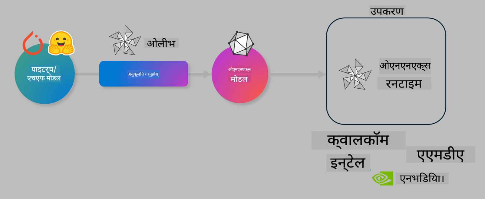

<!--
CO_OP_TRANSLATOR_METADATA:
{
  "original_hash": "6bbe47de3b974df7eea29dfeccf6032b",
  "translation_date": "2025-05-09T04:35:34+00:00",
  "source_file": "code/04.Finetuning/olive-lab/readme.md",
  "language_code": "ne"
}
-->
# Lab. मोबाइल डिभाइसमा AI मोडेलहरू इन्फरेन्सका लागि अनुकूलन गर्नुहोस्

## परिचय

> [!IMPORTANT]  
> यस ल्याबका लागि **Nvidia A10 वा A100 GPU** र सम्बन्धित ड्राइभरहरू र CUDA टूलकिट (संस्करण 12+) स्थापना गरिएको हुन आवश्यक छ।

> [!NOTE]  
> यो एक **35 मिनेटको** ल्याब हो जसले तपाईंलाई OLIVE प्रयोग गरेर मोबाइल डिभाइसमा मोडेलहरू अनुकूलन गर्ने मुख्य अवधारणाहरूमा व्यावहारिक परिचय दिनेछ।

## सिकाइ उद्देश्यहरू

यस ल्याबको अन्त्यसम्म, तपाईं OLIVE प्रयोग गरेर निम्न कार्यहरू गर्न सक्नुहुनेछ:

- AWQ क्वान्टाइजेसन विधि प्रयोग गरी AI मोडेल क्वान्टाइज गर्नुहोस्।
- विशेष कार्यको लागि AI मोडेललाई फाइन-ट्यून गर्नुहोस्।
- ONNX Runtime मा कुशल मोबाइल इन्फरेन्सका लागि LoRA एडाप्टरहरू (फाइन-ट्यून गरिएको मोडेल) उत्पन्न गर्नुहोस्।

### Olive के हो

Olive (*O*NNX *live*) एक मोडेल अनुकूलन टूलकिट हो जसमा CLI पनि समावेश छ जसले तपाईंलाई ONNX runtime +++https://onnxruntime.ai+++ का लागि गुणस्तर र प्रदर्शनसहित मोडेलहरू तयार पार्न मद्दत गर्छ।



Olive को इनपुट सामान्यतया PyTorch वा Hugging Face मोडेल हुन्छ र आउटपुट एक अनुकूलित ONNX मोडेल हो जुन ONNX runtime चलाउने डिभाइसमा कार्यान्वयन हुन्छ। Olive ले मोडेललाई तैनाथ गर्ने डिभाइसको AI एक्सेलेरेटर (NPU, GPU, CPU) अनुसार अनुकूलन गर्छ, जुन Qualcomm, AMD, Nvidia वा Intel जस्ता हार्डवेयर प्रदायकहरूले उपलब्ध गराउँछन्।

Olive ले *workflow* चलाउँछ, जुन मोडेल अनुकूलन कार्यहरूको क्रमबद्ध श्रृंखला हो जसलाई *passes* भनिन्छ - उदाहरणका लागि: मोडेल कम्प्रेसन, ग्राफ क्याप्चर, क्वान्टाइजेसन, ग्राफ अनुकूलन। प्रत्येक पासमा त्यस्ता प्यारामिटरहरू हुन्छन् जसलाई उत्कृष्ट मेट्रिक्स (जस्तै सटीकता र विलम्ब) प्राप्त गर्न ट्यून गर्न सकिन्छ, जुन सम्बन्धित इभालुएटरले मूल्यांकन गर्छ। Olive ले खोज एल्गोरिदम प्रयोग गरी प्रत्येक पास वा पासहरूको सेटलाई स्वचालित रूपमा ट्यून गर्ने खोज रणनीति अपनाउँछ।

#### Olive का फाइदाहरू

- ग्राफ अनुकूलन, कम्प्रेसन र क्वान्टाइजेसनका विभिन्न प्रविधिहरूमा म्यानुअल प्रयास र समय कम गर्नुहोस्। तपाईंका गुणस्तर र प्रदर्शन सीमाहरू परिभाषित गर्नुहोस् र Olive ले स्वतः तपाईंका लागि उत्तम मोडेल खोज्छ।
- **40+ पूर्वनिर्मित मोडेल अनुकूलन कम्पोनेन्टहरू** जसले क्वान्टाइजेसन, कम्प्रेसन, ग्राफ अनुकूलन र फाइन-ट्यूनिङका अत्याधुनिक प्रविधिहरू समेट्छ।
- सामान्य मोडेल अनुकूलन कार्यहरूको लागि सजिलो CLI। जस्तै, olive quantize, olive auto-opt, olive finetune।
- मोडेल प्याकेजिङ र डिप्लोयमेन्ट इनबिल्ट।
- **Multi LoRA serving** का लागि मोडेल उत्पन्न गर्ने समर्थन।
- YAML/JSON प्रयोग गरेर वर्कफ्लोहरू निर्माण गरी मोडेल अनुकूलन र डिप्लोयमेन्ट कार्यहरू समन्वय गर्न सकिन्छ।
- **Hugging Face** र **Azure AI** एकीकरण।
- लागत बचतका लागि इनबिल्ट **क्यासिङ** मेकानिज्म।

## ल्याब निर्देशनहरू

> [!NOTE]  
> कृपया सुनिश्चित गर्नुहोस् कि तपाईंले Azure AI Hub र प्रोजेक्ट तयार पार्नुभएको छ र Lab 1 अनुसार A100 कम्प्युट सेटअप गर्नुभएको छ।

### चरण 0: Azure AI Compute सँग जडान गर्नुहोस्

तपाईं **VS Code** को रिमोट सुविधा प्रयोग गरेर Azure AI कम्प्युटमा जडान हुनुहुनेछ।

1. तपाईंको **VS Code** डेस्कटप एप्लिकेशन खोल्नुहोस्।  
2. **Shift+Ctrl+P** थिचेर कमाण्ड प्यालेट खोल्नुहोस्।  
3. कमाण्ड प्यालेटमा **AzureML - remote: Connect to compute instance in New Window** खोज्नुहोस्।  
4. स्क्रिनमा देखाइएका निर्देशनहरू पालना गर्दै Compute सँग जडान गर्नुहोस्। यसमा Azure Subscription, Resource Group, Project र Lab 1 मा सेट गरिएको Compute नाम चयन गर्नुपर्नेछ।  
5. Azure ML Compute नोडसँग जडान भएपछि, यो **Visual Code को तल बायाँ** भागमा देखिनेछ `><Azure ML: Compute Name`।

### चरण 1: यो रिपोजिटोरी क्लोन गर्नुहोस्

VS Code मा नयाँ टर्मिनल खोल्न **Ctrl+J** थिच्नुहोस् र यो रिपो क्लोन गर्नुहोस्:

टर्मिनलमा तपाईंसँग निम्न प्रॉम्प्ट देखिनु पर्छ:

```
azureuser@computername:~/cloudfiles/code$ 
```  
सोलुसन क्लोन गर्नुहोस्

```bash
cd ~/localfiles
git clone https://github.com/microsoft/phi-3cookbook.git
```

### चरण 2: VS Code मा फोल्डर खोल्नुहोस्

टर्मिनलमा तलको कमाण्ड चलाएर सम्बन्धित फोल्डरमा VS Code नयाँ विन्डो खोल्नुहोस्:

```bash
code phi-3cookbook/code/04.Finetuning/Olive-lab
```

अथवा, **File** > **Open Folder** चयन गरेर पनि फोल्डर खोल्न सकिन्छ।

### चरण 3: निर्भरता स्थापना गर्नुहोस्

VS Code मा Azure AI Compute Instance को टर्मिनल (सुझाव: **Ctrl+J**) खोल्नुहोस् र निर्भरता स्थापना गर्न तलका कमाण्डहरू चलाउनुहोस्:

```bash
conda create -n olive-ai python=3.11 -y
conda activate olive-ai
pip install -r requirements.txt
az extension remove -n azure-cli-ml
az extension add -n ml
```

> [!NOTE]  
> सबै निर्भरता स्थापना गर्न करिब ~5 मिनेट लाग्छ।

यस ल्याबमा तपाईंले Azure AI Model क्याटलगमा मोडेलहरू डाउनलोड र अपलोड गर्नुहुनेछ। मोडेल क्याटलग पहुँच गर्न, Azure मा लगइन गर्नुहोस्:

```bash
az login
```

> [!NOTE]  
> लगइन गर्दा तपाईंलाई आफ्नो सब्सक्रिप्शन चयन गर्न भनिनेछ। कृपया ल्याबका लागि प्रदान गरिएको सब्सक्रिप्शन सेट गर्नुहोस्।

### चरण 4: Olive कमाण्डहरू चलाउनुहोस्

VS Code मा Azure AI Compute Instance को टर्मिनल खोल्नुहोस् (सुझाव: **Ctrl+J**) र `olive-ai` conda environment सक्रिय छ कि छैन सुनिश्चित गर्नुहोस्:

```bash
conda activate olive-ai
```

पछि, तलका Olive कमाण्डहरू कमाण्ड लाइनमा चलाउनुहोस्।

1. **डेटा निरीक्षण गर्नुहोस्:** यस उदाहरणमा, तपाईं Phi-3.5-Mini मोडेललाई ट्राभल सम्बन्धी प्रश्नहरूको उत्तर दिनेमा विशेषज्ञ बनाउन फाइन-ट्यून गर्दै हुनुहुन्छ। तलको कोडले JSON lines फर्म्याटमा रहेको डेटासेटका केही सुरुवाती रेकर्डहरू देखाउँछ:

    ```bash
    head data/data_sample_travel.jsonl
    ```

2. **मोडेल क्वान्टाइज गर्नुहोस्:** मोडेल प्रशिक्षण अघि, तलको कमाण्डले Active Aware Quantization (AWQ) नामक प्रविधि प्रयोग गरी क्वान्टाइजेसन गर्छ +++https://arxiv.org/abs/2306.00978+++. AWQ ले मोडेलका तौलहरू क्वान्टाइज गर्दा इन्फरेन्सको क्रममा उत्पन्न एक्टिभेसनहरूलाई विचार गर्छ। यसले क्वान्टाइजेसन प्रक्रियामा वास्तविक डेटा वितरणलाई समावेश गरेर परम्परागत तौल क्वान्टाइजेसन भन्दा राम्रो सटीकता कायम राख्छ।

    ```bash
    olive quantize \
       --model_name_or_path microsoft/Phi-3.5-mini-instruct \
       --trust_remote_code \
       --algorithm awq \
       --output_path models/phi/awq \
       --log_level 1
    ```

    AWQ क्वान्टाइजेसन पूरा गर्न **~8 मिनेट** लाग्छ, जसले मोडेल साइजलाई करिब ~7.5GB बाट ~2.5GB मा घटाउँछ।

    यस ल्याबमा, हामीले Hugging Face बाट मोडेल इनपुट गर्ने तरिका देखाउँदैछौं (जस्तै: `microsoft/Phi-3.5-mini-instruct`). However, Olive also allows you to input models from the Azure AI catalog by updating the `model_name_or_path` argument to an Azure AI asset ID (for example:  `azureml://registries/azureml/models/Phi-3.5-mini-instruct/versions/4`). 

1. **Train the model:** Next, the `olive finetune` कमाण्डले क्वान्टाइज गरिएको मोडेललाई फाइन-ट्यून गर्छ)। क्वान्टाइजेसनपछि होइन, फाइन-ट्यूनिङअघि मोडेल क्वान्टाइज गर्दा राम्रो सटीकता प्राप्त हुन्छ किनभने फाइन-ट्यूनिङले क्वान्टाइजेसनबाट भएको केही हानि पूर्ति गर्छ।

    ```bash
    olive finetune \
        --method lora \
        --model_name_or_path models/phi/awq \
        --data_files "data/data_sample_travel.jsonl" \
        --data_name "json" \
        --text_template "<|user|>\n{prompt}<|end|>\n<|assistant|>\n{response}<|end|>" \
        --max_steps 100 \
        --output_path ./models/phi/ft \
        --log_level 1
    ```

    फाइन-ट्यूनिङ (100 स्टेप्स) पूरा गर्न करिब **~6 मिनेट** लाग्छ।

3. **अनुकूलन गर्नुहोस्:** मोडेल प्रशिक्षण पछि, Olive को `auto-opt` command, which will capture the ONNX graph and automatically perform a number of optimizations to improve the model performance for CPU by compressing the model and doing fusions. It should be noted, that you can also optimize for other devices such as NPU or GPU by just updating the `--device` and `--provider` आर्गुमेन्टहरू प्रयोग गरी मोडेल अनुकूलन गर्नुहोस् - तर यस ल्याबका लागि CPU प्रयोग गरिनेछ।

    ```bash
    olive auto-opt \
       --model_name_or_path models/phi/ft/model \
       --adapter_path models/phi/ft/adapter \
       --device cpu \
       --provider CPUExecutionProvider \
       --use_ort_genai \
       --output_path models/phi/onnx-ao \
       --log_level 1
    ```

    अनुकूलन पूरा गर्न करिब **~5 मिनेट** लाग्छ।

### चरण 5: मोडेल इन्फरेन्स छिटो परीक्षण

मोडेल इन्फरेन्स परीक्षण गर्न, आफ्नो फोल्डरमा **app.py** नामको Python फाइल बनाउनुहोस् र तलको कोड कपी-पेस्ट गर्नुहोस्:

```python
import onnxruntime_genai as og
import numpy as np

print("loading model and adapters...", end="", flush=True)
model = og.Model("models/phi/onnx-ao/model")
adapters = og.Adapters(model)
adapters.load("models/phi/onnx-ao/model/adapter_weights.onnx_adapter", "travel")
print("DONE!")

tokenizer = og.Tokenizer(model)
tokenizer_stream = tokenizer.create_stream()

params = og.GeneratorParams(model)
params.set_search_options(max_length=100, past_present_share_buffer=False)
user_input = "what is the best thing to see in chicago"
params.input_ids = tokenizer.encode(f"<|user|>\n{user_input}<|end|>\n<|assistant|>\n")

generator = og.Generator(model, params)

generator.set_active_adapter(adapters, "travel")

print(f"{user_input}")

while not generator.is_done():
    generator.compute_logits()
    generator.generate_next_token()

    new_token = generator.get_next_tokens()[0]
    print(tokenizer_stream.decode(new_token), end='', flush=True)

print("\n")
```

कोड चलाउन:

```bash
python app.py
```

### चरण 6: मोडेल Azure AI मा अपलोड गर्नुहोस्

मोडेल Azure AI मोडेल रिपोजिटोरीमा अपलोड गर्दा तपाईंको विकास टोलीका अन्य सदस्यहरूसँग मोडेल साझा गर्न र मोडेलको भर्सन कन्ट्रोल गर्न सजिलो हुन्छ। मोडेल अपलोड गर्न तलको कमाण्ड चलाउनुहोस्:

> [!NOTE]  
> `{}` placeholders with the name of your resource group and Azure AI Project Name. 

To find your resource group `"resourceGroup"` र Azure AI Project नाम अपडेट गर्नुहोस् र तलको कमाण्ड चलाउनुहोस्।

```
az ml workspace show
```

वा +++ai.azure.com+++ मा गएर **management center** > **project** > **overview** चयन गर्न सकिन्छ।

`{}` प्लेसहोल्डरहरूमा आफ्नो Resource Group र Azure AI Project नाम राख्नुहोस्।

```bash
az ml model create \
    --name ft-for-travel \
    --version 1 \
    --path ./models/phi/onnx-ao \
    --resource-group {RESOURCE_GROUP_NAME} \
    --workspace-name {PROJECT_NAME}
```

तपाईंले अपलोड गरेको मोडेल हेर्न र डिप्लोय गर्न https://ml.azure.com/model/list मा जान सक्नुहुन्छ।

**अस्वीकरण**:  
यो दस्तावेज AI अनुवाद सेवा [Co-op Translator](https://github.com/Azure/co-op-translator) को प्रयोग गरी अनुवाद गरिएको हो। हामी सटीकता को लागि प्रयासरत छौं, तर कृपया ध्यान दिनुहोस् कि स्वचालित अनुवादहरूमा त्रुटिहरू वा अशुद्धता हुनसक्छ। मूल दस्तावेज यसको मूल भाषामा नै आधिकारिक स्रोत मानिनु पर्छ। महत्वपूर्ण जानकारीका लागि व्यावसायिक मानव अनुवाद सिफारिस गरिन्छ। यस अनुवादको प्रयोगबाट उत्पन्न हुने कुनै पनि गलतफहमी वा गलत व्याख्याको लागि हामी जिम्मेवार छैनौं।