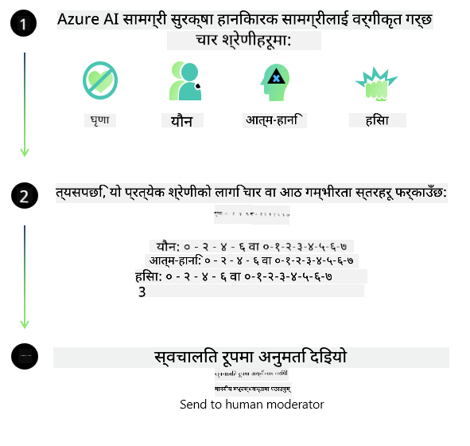
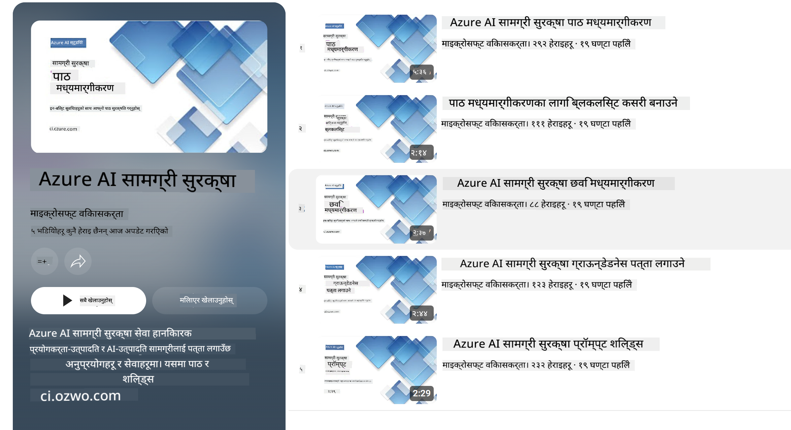

<!--
CO_OP_TRANSLATOR_METADATA:
{
  "original_hash": "c8273672cc57df2be675407a1383aaf0",
  "translation_date": "2025-05-09T05:49:42+00:00",
  "source_file": "md/01.Introduction/01/01.AISafety.md",
  "language_code": "ne"
}
-->
# Phi मोडेलहरूको लागि AI सुरक्षा  
Phi मोडेल परिवार [Microsoft Responsible AI Standard](https://query.prod.cms.rt.microsoft.com/cms/api/am/binary/RE5cmFl) अनुसार विकास गरिएको हो, जुन कम्पनीभरिका आवश्यकताहरूको सेट हो र यसले छ वटा मुख्य सिद्धान्तहरू समेट्छ: जवाफदेहिता, पारदर्शिता, निष्पक्षता, विश्वसनीयता र सुरक्षा, गोपनीयता र सुरक्षा, र समावेशिता जुन [Microsoft का Responsible AI सिद्धान्तहरू](https://www.microsoft.com/ai/responsible-ai) हुन्।  

अघिल्लो Phi मोडेलहरू जस्तै, बहुआयामिक सुरक्षा मूल्यांकन र सुरक्षा पोस्ट-ट्रेनिङ्ग विधि अपनाइएको छ, साथै यस रिलिजका बहुभाषिक क्षमताहरूलाई ध्यानमा राख्दै थप उपायहरू लिइएको छ। हाम्रो सुरक्षा प्रशिक्षण र मूल्यांकनको दृष्टिकोण, जसमा विभिन्न भाषाहरू र जोखिम वर्गहरूमा परीक्षण समावेश छ, [Phi Safety Post-Training Paper](https://arxiv.org/abs/2407.13833) मा उल्लेख गरिएको छ। यद्यपि Phi मोडेलहरूले यस दृष्टिकोणबाट लाभ पाउँछन्, विकासकर्ताहरूले आफ्नो विशिष्ट प्रयोग केस र सांस्कृतिक तथा भाषिक सन्दर्भ अनुसार जोखिमहरू नक्सांकन, मापन, र न्यूनीकरण गर्ने जिम्मेवारी लिनुपर्छ।  

## उत्तम अभ्यासहरू  

अन्य मोडेलहरू जस्तै, Phi मोडेल परिवारले कहिलेकाहीं अन्यायपूर्ण, अविश्वसनीय, वा आपत्तिजनक व्यवहार गर्न सक्छ।  

SLM र LLM का केही सीमित व्यवहारहरू जुन तपाईंले जान्न आवश्यक छ:  

- **सेवाको गुणस्तर:** Phi मोडेलहरू मुख्य रूपमा अंग्रेजी पाठमा तालिम लिएका छन्। अंग्रेजी बाहेकका भाषाहरूमा प्रदर्शन कम हुन सक्छ। तालिम डाटामा कम प्रतिनिधित्व भएका अंग्रेजीका भेरायटीहरूले सामान्य अमेरिकी अंग्रेजीको तुलनामा कमजोर प्रदर्शन गर्न सक्छन्।  
- **हानिकारक प्रतिनिधित्व र पूर्वाग्रहहरूको पुनरावृत्ति:** यी मोडेलहरूले केही समूहहरूलाई बढी वा कम प्रतिनिधित्व गर्न सक्छन्, केही समूहहरूको प्रतिनिधित्व मेटाउन सक्छन्, वा अपमानजनक वा नकारात्मक पूर्वाग्रहहरूलाई बलियो बनाउन सक्छन्। सुरक्षा पोस्ट-ट्रेनिङ्ग पछि पनि यी सीमितताहरू रहन सक्छन् किनभने विभिन्न समूहहरूको प्रतिनिधित्वको स्तर फरक हुन्छ वा तालिम डाटामा नकारात्मक पूर्वाग्रहका उदाहरणहरू व्यापक छन् जुन वास्तविक संसारका ढाँचाहरू र सामाजिक पूर्वाग्रहहरू प्रतिबिम्बित गर्छ।  
- **अशिष्ट वा आपत्तिजनक सामग्री:** यी मोडेलहरूले अन्य प्रकारका अशिष्ट वा आपत्तिजनक सामग्री उत्पादन गर्न सक्छन्, जसले संवेदनशील सन्दर्भमा थप न्यूनीकरण उपायहरू बिना तिनीहरूलाई प्रयोग गर्न अनुपयुक्त बनाउन सक्छ।  
- **सूचना विश्वसनीयता:** भाषा मोडेलहरूले अर्थहीन सामग्री उत्पादन गर्न सक्छन् वा यस्तो सामग्री बनाउन सक्छन् जुन सुनिनमा तार्किक लाग्छ तर गलत वा पुरानो हुन्छ।  
- **कोडको सीमित दायरा:** Phi-3 को अधिकांश तालिम डाटा Python मा आधारित छ र सामान्य प्याकेजहरू जस्तै "typing, math, random, collections, datetime, itertools" प्रयोग गर्दछ। यदि मोडेलले अन्य प्याकेजहरू वा अन्य भाषाका स्क्रिप्टहरू उत्पादन गर्छ भने, हामी प्रयोगकर्ताहरूलाई सबै API प्रयोगहरू म्यानुअली जाँच गर्न सिफारिस गर्छौं।  

विकासकर्ताहरूले जिम्मेवार AI उत्तम अभ्यासहरू अपनाउनुपर्छ र निश्चित प्रयोग केसले सम्बन्धित कानून र नियमहरू (जस्तै गोपनीयता, व्यापार आदि) पालना गरेको सुनिश्चित गर्न जिम्मेवार छन्।  

## जिम्मेवार AI विचारहरू  

अन्य भाषा मोडेलहरू जस्तै, Phi श्रृंखला मोडेलहरूले अन्यायपूर्ण, अविश्वसनीय, वा आपत्तिजनक व्यवहार गर्न सक्छन्। जान्नुपर्ने केही सीमित व्यवहारहरू:  

**सेवाको गुणस्तर:** Phi मोडेलहरू मुख्य रूपमा अंग्रेजी पाठमा तालिम लिएका छन्। अंग्रेजी बाहेकका भाषाहरूमा प्रदर्शन कम हुन सक्छ। तालिम डाटामा कम प्रतिनिधित्व भएका अंग्रेजीका भेरायटीहरूले सामान्य अमेरिकी अंग्रेजीको तुलनामा कमजोर प्रदर्शन गर्न सक्छन्।  

**हानिकारक प्रतिनिधित्व र पूर्वाग्रहहरूको पुनरावृत्ति:** यी मोडेलहरूले केही समूहहरूलाई बढी वा कम प्रतिनिधित्व गर्न सक्छन्, केही समूहहरूको प्रतिनिधित्व मेटाउन सक्छन्, वा अपमानजनक वा नकारात्मक पूर्वाग्रहहरूलाई बलियो बनाउन सक्छन्। सुरक्षा पोस्ट-ट्रेनिङ्ग पछि पनि यी सीमितताहरू रहन सक्छन् किनभने विभिन्न समूहहरूको प्रतिनिधित्वको स्तर फरक हुन्छ वा तालिम डाटामा नकारात्मक पूर्वाग्रहका उदाहरणहरू व्यापक छन् जुन वास्तविक संसारका ढाँचाहरू र सामाजिक पूर्वाग्रहहरू प्रतिबिम्बित गर्छ।  

**अशिष्ट वा आपत्तिजनक सामग्री:** यी मोडेलहरूले अन्य प्रकारका अशिष्ट वा आपत्तिजनक सामग्री उत्पादन गर्न सक्छन्, जसले संवेदनशील सन्दर्भमा थप न्यूनीकरण उपायहरू बिना तिनीहरूलाई प्रयोग गर्न अनुपयुक्त बनाउन सक्छ।  
**सूचना विश्वसनीयता:** भाषा मोडेलहरूले अर्थहीन सामग्री उत्पादन गर्न सक्छन् वा यस्तो सामग्री बनाउन सक्छन् जुन सुनिनमा तार्किक लाग्छ तर गलत वा पुरानो हुन्छ।  

**कोडको सीमित दायरा:** Phi-3 को अधिकांश तालिम डाटा Python मा आधारित छ र सामान्य प्याकेजहरू जस्तै "typing, math, random, collections, datetime, itertools" प्रयोग गर्दछ। यदि मोडेलले अन्य प्याकेजहरू वा अन्य भाषाका स्क्रिप्टहरू उत्पादन गर्छ भने, हामी प्रयोगकर्ताहरूलाई सबै API प्रयोगहरू म्यानुअली जाँच गर्न सिफारिस गर्छौं।  

विकासकर्ताहरूले जिम्मेवार AI उत्तम अभ्यासहरू अपनाउनुपर्छ र निश्चित प्रयोग केसले सम्बन्धित कानून र नियमहरू (जस्तै गोपनीयता, व्यापार आदि) पालना गरेको सुनिश्चित गर्न जिम्मेवार छन्। विचार गर्नुपर्ने महत्त्वपूर्ण क्षेत्रहरू:  

**वितरण:** मोडेलहरू त्यस्ता परिदृश्यहरूमा उपयुक्त नहुन सक्छन् जसले कानूनी स्थिति वा स्रोतहरू वा जीवनका अवसरहरूको वितरणमा महत्वपूर्ण प्रभाव पार्न सक्छ (जस्तै: आवास, रोजगार, क्रेडिट आदि) बिना थप मूल्यांकन र अतिरिक्त पूर्वाग्रह हटाउने प्रविधिहरू।  

**उच्च जोखिम परिदृश्यहरू:** विकासकर्ताहरूले उच्च जोखिम परिदृश्यहरूमा मोडेलको प्रयोगको उपयुक्तता मूल्यांकन गर्नुपर्छ जहाँ अन्यायपूर्ण, अविश्वसनीय, वा आपत्तिजनक आउटपुटले अत्यधिक खर्चिलो वा हानिकारक परिणाम ल्याउन सक्छ। यसमा संवेदनशील वा विशेषज्ञ क्षेत्रहरूमा सल्लाह प्रदान गर्नु पर्ने अवस्थामा जहाँ शुद्धता र विश्वसनीयता महत्वपूर्ण हुन्छ (जस्तै: कानूनी वा स्वास्थ्य सल्लाह)। थप सुरक्षा उपायहरू आवेदन स्तरमा परिनियोजन सन्दर्भ अनुसार लागू गर्नुपर्छ।  

**गलत सूचना:** मोडेलहरूले गलत जानकारी उत्पादन गर्न सक्छन्। विकासकर्ताहरूले पारदर्शिता उत्तम अभ्यासहरू पालन गर्नुपर्छ र अन्तिम प्रयोगकर्तालाई उनीहरू AI प्रणालीसँग अन्तरक्रिया गरिरहेका छन् भनी सूचित गर्नुपर्छ। आवेदन स्तरमा, विकासकर्ताहरूले प्रतिक्रिया संयन्त्र र पाइपलाइनहरू निर्माण गर्न सक्छन् जसले प्रतिक्रियाहरूलाई प्रयोग केस विशेष, सन्दर्भगत जानकारीमा आधारित बनाउँछ, जसलाई Retrieval Augmented Generation (RAG) भनिन्छ।  

**हानिकारक सामग्री उत्पादन:** विकासकर्ताहरूले सन्दर्भ अनुसार आउटपुटको मूल्यांकन गर्नुपर्छ र उपलब्ध सुरक्षा वर्गीकरण उपकरणहरू वा आफ्नै समाधानहरू प्रयोग गर्नुपर्छ जुन उनीहरूको प्रयोग केसका लागि उपयुक्त हो।  

**दुरुपयोग:** धोखाधडी, स्प्याम, वा मालवेयर उत्पादन जस्ता अन्य प्रकारका दुरुपयोग सम्भव हुन सक्छन्, र विकासकर्ताहरूले सुनिश्चित गर्नुपर्छ कि तिनीहरूको अनुप्रयोगहरू लागू हुने कानून र नियमहरू उल्लंघन नगर्ने।  

### फाइनट्यूनिङ र AI सामग्री सुरक्षा  

मोडेललाई फाइनट्यून गरेपछि, हामी अत्यधिक सिफारिस गर्छौं कि [Azure AI Content Safety](https://learn.microsoft.com/azure/ai-services/content-safety/overview) उपायहरू प्रयोग गरियोस् जसले मोडेलहरूले उत्पादन गरेको सामग्री निगरानी गर्छ, सम्भावित जोखिम, खतरा, र गुणस्तर समस्याहरू पत्ता लगाउँछ र अवरुद्ध गर्छ।  

  

[Azure AI Content Safety](https://learn.microsoft.com/azure/ai-services/content-safety/overview) ले पाठ र छवि सामग्री दुवैलाई समर्थन गर्छ। यसलाई क्लाउड, डिस्कनेक्टेड कन्टेनरहरू, र एज/एम्बेडेड उपकरणहरूमा परिनियोजन गर्न सकिन्छ।  

## Azure AI Content Safety को अवलोकन  

Azure AI Content Safety सबैका लागि एउटै समाधान होइन; यसलाई व्यवसायका विशिष्ट नीतिहरूसँग मिलाउन अनुकूलन गर्न सकिन्छ। साथै, यसको बहुभाषिक मोडेलहरूले एकै पटक धेरै भाषाहरू बुझ्न सक्षम बनाउँछन्।  

  

- **Azure AI Content Safety**  
- **Microsoft Developer**  
- **5 भिडियोहरू**  

Azure AI Content Safety सेवा अनुप्रयोगहरू र सेवाहरूमा हानिकारक प्रयोगकर्ता-निर्मित र AI-निर्मित सामग्री पत्ता लगाउँछ। यसले पाठ र छवि API हरू समावेश गर्दछ जसले हानिकारक वा अनुपयुक्त सामग्री पत्ता लगाउन मद्दत गर्छ।  

[AI Content Safety Playlist](https://www.youtube.com/playlist?list=PLlrxD0HtieHjaQ9bJjyp1T7FeCbmVcPkQ)

**अस्वीकरण**:  
यो दस्तावेज़ AI अनुवाद सेवा [Co-op Translator](https://github.com/Azure/co-op-translator) को प्रयोग गरी अनुवाद गरिएको हो। हामी सटीकता को लागि प्रयास गर्छौं, तर कृपया ध्यान दिनुहोस् कि स्वचालित अनुवादमा त्रुटिहरू वा अशुद्धिहरू हुन सक्छन्। मूल दस्तावेज़ यसको मूल भाषामा अधिकारिक स्रोत मानिनुपर्छ। महत्वपूर्ण जानकारीको लागि, व्यावसायिक मानव अनुवाद सिफारिस गरिन्छ। यस अनुवादको प्रयोगबाट उत्पन्न कुनै पनि गलतफहमी वा गलत व्याख्याको लागि हामी जिम्मेवार छैनौं।