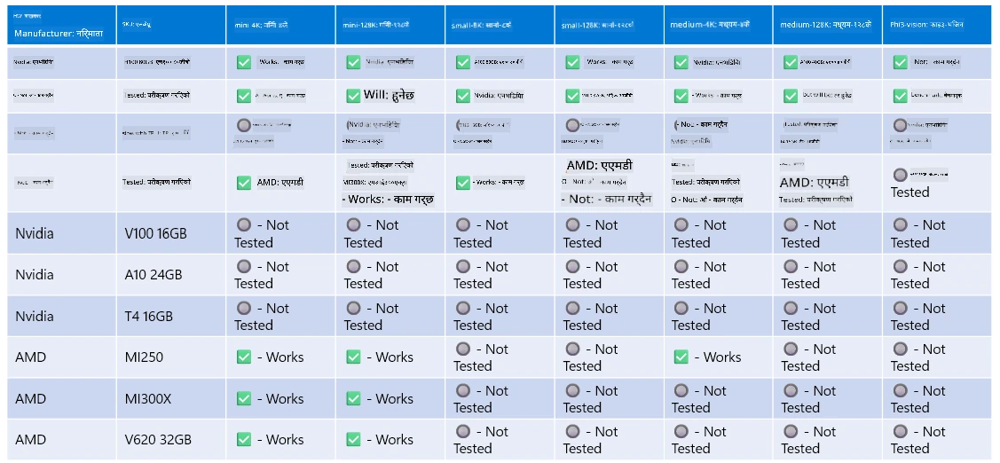

# Phi हार्डवेयर समर्थन

Microsoft Phi लाई ONNX Runtime का लागि अनुकूलित गरिएको छ र Windows DirectML समर्थन गर्दछ। यो विभिन्न प्रकारका हार्डवेयरहरूमा राम्रोसँग काम गर्छ, जस्तै GPU, CPU, र मोबाइल उपकरणहरूमा पनि।

## उपकरण हार्डवेयर  
विशेष गरी, समर्थन गरिएको हार्डवेयरहरूमा समावेश छन्:

- GPU SKU: RTX 4090 (DirectML)
- GPU SKU: 1 A100 80GB (CUDA)
- CPU SKU: Standard F64s v2 (64 vCPUs, 128 GiB मेमोरी)

## मोबाइल SKU

- Android - Samsung Galaxy S21
- Apple iPhone 14 वा माथिको A16/A17 प्रोसेसर

## Phi हार्डवेयर विशिष्टता

- न्यूनतम कन्फिगरेसन आवश्यक।
- Windows: DirectX 12-सक्षम GPU र कम्तीमा 4GB संयुक्त RAM

CUDA: Compute Capability >= 7.02 भएको NVIDIA GPU



## धेरै GPU मा onnxruntime चलाउने

हाल उपलब्ध Phi ONNX मोडेलहरू केवल 1 GPU का लागि हुन्। Phi मोडेलका लागि मल्टि-GPU समर्थन सम्भव छ, तर 2 GPU सहितको ORT ले 2 वटा ORT इन्स्ट्यान्सको तुलनामा बढी थ्रूपुट दिने ग्यारेन्टी गर्दैन। कृपया [ONNX Runtime](https://onnxruntime.ai/) मा नवीनतम अपडेटहरू हेर्नुहोस्।

[Build 2024 मा GenAI ONNX टोली](https://youtu.be/WLW4SE8M9i8?si=EtG04UwDvcjunyfC) ले Phi मोडेलहरूका लागि मल्टि-GPU को सट्टा मल्टि-इन्स्ट्यान्स सक्षम गरेको घोषणा गर्यो।

अहिले यसले तपाईंलाई CUDA_VISIBLE_DEVICES वातावरण चर प्रयोग गरेर एक onnxruntime वा onnxruntime-genai इन्स्ट्यान्स चलाउन अनुमति दिन्छ।

```Python
CUDA_VISIBLE_DEVICES=0 python infer.py
CUDA_VISIBLE_DEVICES=1 python infer.py
```

Phi लाई अझै अन्वेषण गर्न [Azure AI Foundry](https://ai.azure.com) मा जानुहोस्।

**अस्वीकरण**:  
यो दस्तावेज AI अनुवाद सेवा [Co-op Translator](https://github.com/Azure/co-op-translator) प्रयोग गरी अनुवाद गरिएको हो। हामी शुद्धताका लागि प्रयासरत छौं, तर कृपया ध्यान दिनुहोस् कि स्वचालित अनुवादमा त्रुटि वा अशुद्धता हुन सक्छ। मूल दस्तावेज यसको मूल भाषामा नै अधिकारिक स्रोत मानिनु पर्छ। महत्वपूर्ण जानकारीका लागि व्यावसायिक मानव अनुवाद सिफारिस गरिन्छ। यस अनुवादको प्रयोगबाट उत्पन्न कुनै पनि गलतफहमी वा गलत व्याख्याका लागि हामी जिम्मेवार छैनौं।