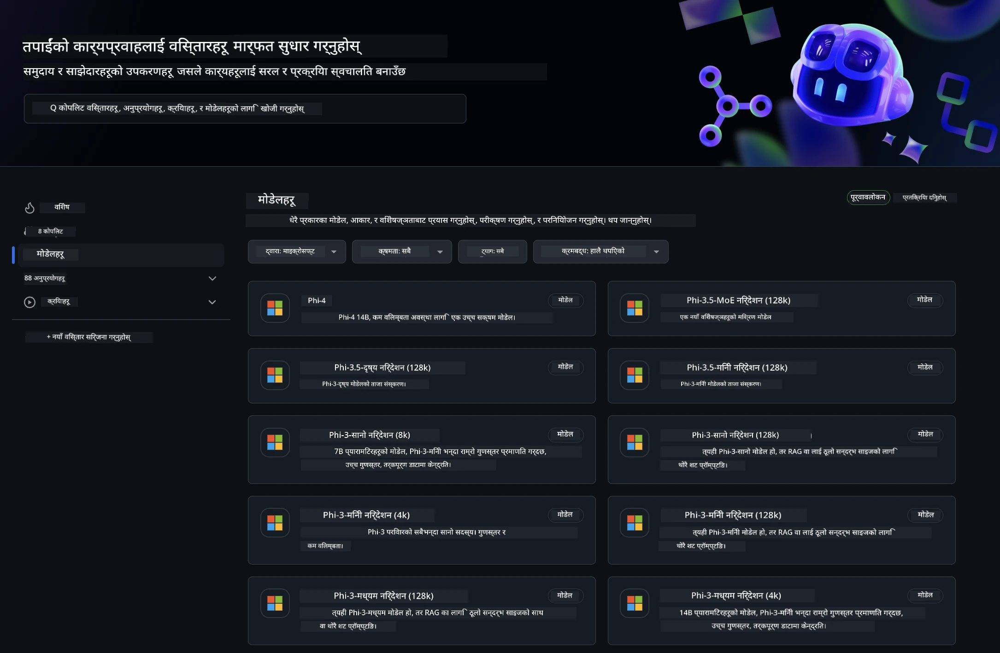
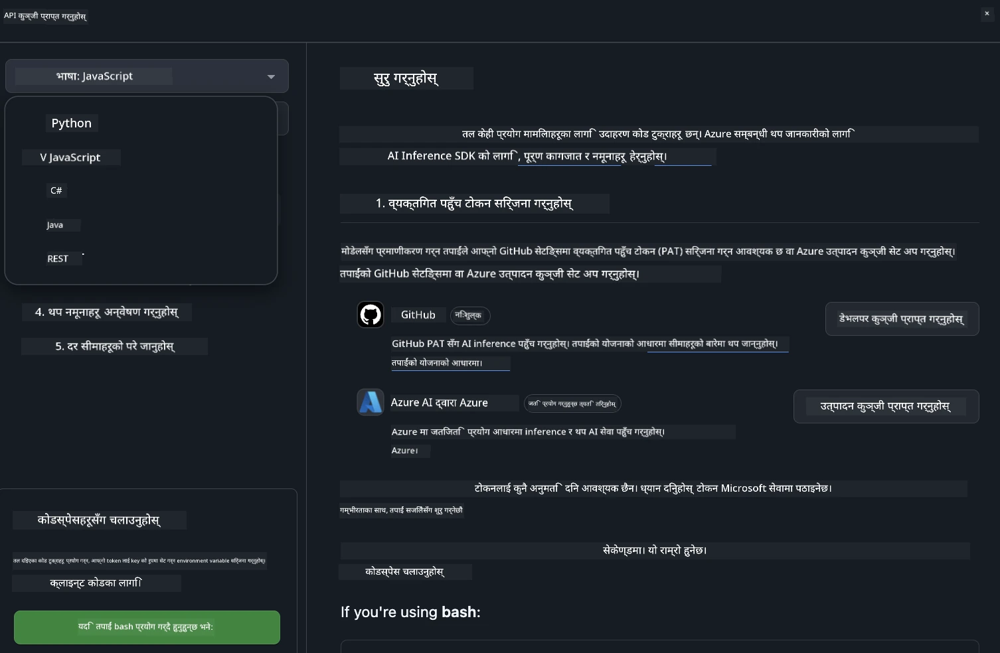
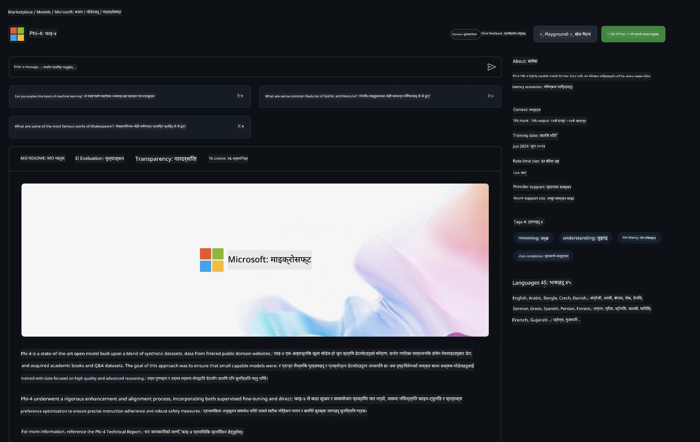

## GitHub मोडेलहरूमा Phi परिवार

[GitHub Models](https://github.com/marketplace/models) मा स्वागत छ! हामीले Azure AI मा होस्ट गरिएका AI मोडेलहरू अन्वेषण गर्न तपाईंका लागि सबै तयारी गरिसकेका छौं।



GitHub Models मा उपलब्ध मोडेलहरूको थप जानकारीका लागि [GitHub Model Marketplace](https://github.com/marketplace/models) हेर्नुहोस्।

## उपलब्ध मोडेलहरू

प्रत्येक मोडेलसँग समर्पित प्लेग्राउन्ड र नमूना कोड उपलब्ध छ।


### GitHub Model Catalog मा Phi परिवार

- [Phi-4](https://github.com/marketplace/models/azureml/Phi-4)

- [Phi-3.5-MoE instruct (128k)](https://github.com/marketplace/models/azureml/Phi-3-5-MoE-instruct)

- [Phi-3.5-vision instruct (128k)](https://github.com/marketplace/models/azureml/Phi-3-5-vision-instruct)

- [Phi-3.5-mini instruct (128k)](https://github.com/marketplace/models/azureml/Phi-3-5-mini-instruct)

- [Phi-3-Medium-128k-Instruct](https://github.com/marketplace/models/azureml/Phi-3-medium-128k-instruct)

- [Phi-3-medium-4k-instruct](https://github.com/marketplace/models/azureml/Phi-3-medium-4k-instruct)

- [Phi-3-mini-128k-instruct](https://github.com/marketplace/models/azureml/Phi-3-mini-128k-instruct)

- [Phi-3-mini-4k-instruct](https://github.com/marketplace/models/azureml/Phi-3-mini-4k-instruct)

- [Phi-3-small-128k-instruct](https://github.com/marketplace/models/azureml/Phi-3-small-128k-instruct)

- [Phi-3-small-8k-instruct](https://github.com/marketplace/models/azureml/Phi-3-small-8k-instruct)

## सुरु गर्ने तरिका

केही आधारभूत उदाहरणहरू तपाईंले चलाउन तयार छन्। तपाईंले तिनीहरूलाई samples डाइरेक्टरीमा फेला पार्न सक्नुहुन्छ। यदि तपाईं आफ्नो मनपर्ने भाषामा सिधै जान चाहनुहुन्छ भने, निम्न भाषाहरूमा उदाहरणहरू उपलब्ध छन्:

- Python  
- JavaScript  
- C#  
- Java  
- cURL  

नमूना र मोडेलहरू चलाउनको लागि समर्पित Codespaces Environment पनि उपलब्ध छ।



## नमूना कोड

तल केही प्रयोगका लागि उदाहरण कोड स्निपेटहरू छन्। Azure AI Inference SDK को थप जानकारीका लागि पूर्ण कागजात र नमूनाहरू हेर्नुहोस्।

## सेटअप

1. व्यक्तिगत पहुँच टोकन बनाउनुहोस्  
टोकनलाई कुनै अनुमति दिन आवश्यक छैन। ध्यान दिनुहोस् कि टोकन Microsoft सेवामा पठाइनेछ।

तलको कोड स्निपेटहरू प्रयोग गर्न, आफ्नो टोकनलाई क्लाइन्ट कोडको लागि कुञ्जीको रूपमा सेट गर्न वातावरण चर बनाउनुहोस्।

यदि तपाईं bash प्रयोग गर्दै हुनुहुन्छ:  
```
export GITHUB_TOKEN="<your-github-token-goes-here>"
```  
यदि तपाईं powershell मा हुनुहुन्छ:  

```
$Env:GITHUB_TOKEN="<your-github-token-goes-here>"
```  

यदि तपाईं Windows command prompt प्रयोग गर्दै हुनुहुन्छ:  

```
set GITHUB_TOKEN=<your-github-token-goes-here>
```  

## Python नमूना

### निर्भरता स्थापना गर्नुहोस्  
pip मार्फत Azure AI Inference SDK स्थापना गर्नुहोस् (आवश्यक: Python >=3.8):

```
pip install azure-ai-inference
```  
### आधारभूत कोड नमूना चलाउनुहोस्

यो नमूनाले chat completion API को आधारभूत कल देखाउँछ। यसले GitHub AI मोडेल inference endpoint र तपाईंको GitHub टोकन प्रयोग गरिरहेको छ। कल synchronous छ।

```python
import os
from azure.ai.inference import ChatCompletionsClient
from azure.ai.inference.models import SystemMessage, UserMessage
from azure.core.credentials import AzureKeyCredential

endpoint = "https://models.inference.ai.azure.com"
model_name = "Phi-4"
token = os.environ["GITHUB_TOKEN"]

client = ChatCompletionsClient(
    endpoint=endpoint,
    credential=AzureKeyCredential(token),
)

response = client.complete(
    messages=[
        UserMessage(content="I have $20,000 in my savings account, where I receive a 4% profit per year and payments twice a year. Can you please tell me how long it will take for me to become a millionaire? Also, can you please explain the math step by step as if you were explaining it to an uneducated person?"),
    ],
    temperature=0.4,
    top_p=1.0,
    max_tokens=2048,
    model=model_name
)

print(response.choices[0].message.content)
```

### बहु-चरण संवाद चलाउनुहोस्

यो नमूनाले chat completion API सँग बहु-चरण संवाद देखाउँछ। जब तपाईं मोडेललाई च्याट एप्लिकेसनका लागि प्रयोग गर्नुहुन्छ, तपाईंले संवादको इतिहास व्यवस्थापन गर्नुपर्नेछ र मोडेलमा सबैभन्दा नयाँ सन्देशहरू पठाउनुपर्नेछ।

```
import os
from azure.ai.inference import ChatCompletionsClient
from azure.ai.inference.models import AssistantMessage, SystemMessage, UserMessage
from azure.core.credentials import AzureKeyCredential

token = os.environ["GITHUB_TOKEN"]
endpoint = "https://models.inference.ai.azure.com"
# Replace Model_Name
model_name = "Phi-4"

client = ChatCompletionsClient(
    endpoint=endpoint,
    credential=AzureKeyCredential(token),
)

messages = [
    SystemMessage(content="You are a helpful assistant."),
    UserMessage(content="What is the capital of France?"),
    AssistantMessage(content="The capital of France is Paris."),
    UserMessage(content="What about Spain?"),
]

response = client.complete(messages=messages, model=model_name)

print(response.choices[0].message.content)
```

### आउटपुट स्ट्रिम गर्नुहोस्

उपयोगकर्ताको अनुभव सुधार गर्न, तपाईंले मोडेलको प्रतिक्रिया स्ट्रिम गर्न चाहनुहुनेछ ताकि पहिलो टोकन छिटो देखियोस् र लामो प्रतिक्रिया पर्खन नपरोस्।

```
import os
from azure.ai.inference import ChatCompletionsClient
from azure.ai.inference.models import SystemMessage, UserMessage
from azure.core.credentials import AzureKeyCredential

token = os.environ["GITHUB_TOKEN"]
endpoint = "https://models.inference.ai.azure.com"
# Replace Model_Name
model_name = "Phi-4"

client = ChatCompletionsClient(
    endpoint=endpoint,
    credential=AzureKeyCredential(token),
)

response = client.complete(
    stream=True,
    messages=[
        SystemMessage(content="You are a helpful assistant."),
        UserMessage(content="Give me 5 good reasons why I should exercise every day."),
    ],
    model=model_name,
)

for update in response:
    if update.choices:
        print(update.choices[0].delta.content or "", end="")

client.close()
```

## GitHub मोडेलहरूको निःशुल्क प्रयोग र दर सीमाहरू



[प्लेग्राउन्ड र निःशुल्क API प्रयोगका लागि दर सीमाहरू](https://docs.github.com/en/github-models/prototyping-with-ai-models#rate-limits) तपाईंलाई मोडेलहरू परीक्षण गर्न र AI एप्लिकेसनको प्रोटोटाइप बनाउन मद्दत गर्न बनाइएका हुन्। ती सीमाहरू भन्दा बढी प्रयोगका लागि, र तपाईंको एप्लिकेसनलाई स्केलमा ल्याउन, तपाईंले Azure खाताबाट स्रोतहरू प्रावधान गर्नुपर्नेछ र त्यहाँबाट प्रमाणिकरण गर्नुपर्नेछ, तपाईंको GitHub व्यक्तिगत पहुँच टोकनको सट्टा। तपाईंले आफ्नो कोडमा अरू केही परिवर्तन गर्न आवश्यक छैन। Azure AI मा निःशुल्क स्तर सीमाहरू पार गर्ने तरिका जान्न यो लिंक प्रयोग गर्नुहोस्।

### खुलासा

मोडेलसँग अन्तरक्रिया गर्दा तपाईं AI सँग प्रयोग गर्दै हुनुहुन्छ भन्ने सम्झनुहोस्, त्यसैले सामग्रीमा त्रुटिहरू हुन सक्छन्।

यो सुविधा विभिन्न सीमाहरू (जस्तै प्रति मिनेट अनुरोध, प्रति दिन अनुरोध, अनुरोधमा टोकन संख्या, र एकै समयमा अनुरोधहरू) अन्तर्गत छ र उत्पादन प्रयोगका लागि डिजाइन गरिएको छैन।

GitHub Models ले Azure AI Content Safety प्रयोग गर्छ। यी फिल्टरहरू GitHub Models अनुभवको भागको रूपमा बन्द गर्न सकिँदैन। यदि तपाईंले तिर्ने सेवाबाट मोडेलहरू प्रयोग गर्ने निर्णय गर्नुभयो भने, कृपया आफ्नो सामग्री फिल्टरहरू तपाईंको आवश्यकताअनुसार कन्फिगर गर्नुहोस्।

यो सेवा GitHub को प्रि-रिलिज सर्तहरू अन्तर्गत छ।

**अस्वीकरण**:  
यो दस्तावेज AI अनुवाद सेवा [Co-op Translator](https://github.com/Azure/co-op-translator) प्रयोग गरी अनुवाद गरिएको हो। हामी शुद्धताका लागि प्रयासरत छौं, तर कृपया ध्यान दिनुहोस् कि स्वचालित अनुवादमा त्रुटि वा अशुद्धता हुनसक्छ। मूल दस्तावेज यसको मूल भाषामा नै अधिकारिक स्रोत मानिनुपर्छ। महत्वपूर्ण जानकारीका लागि व्यावसायिक मानव अनुवाद सिफारिस गरिन्छ। यस अनुवादको प्रयोगबाट उत्पन्न कुनै पनि गलतफहमी वा गलत व्याख्याका लागि हामी जिम्मेवार छैनौं।