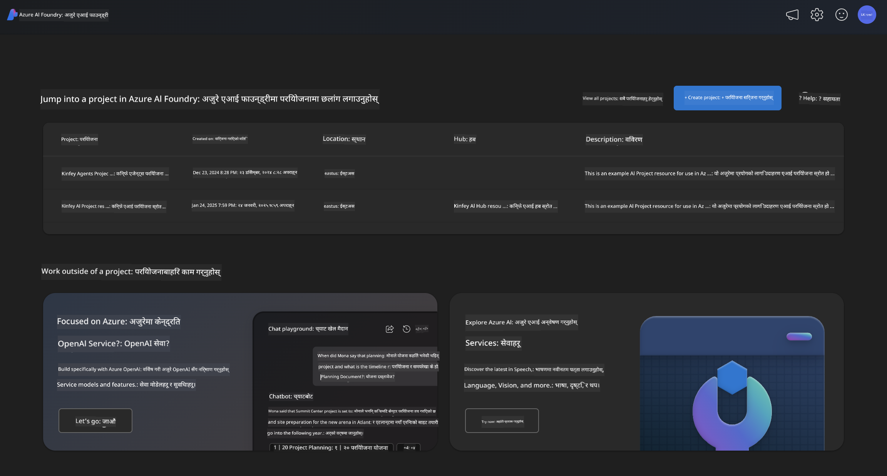
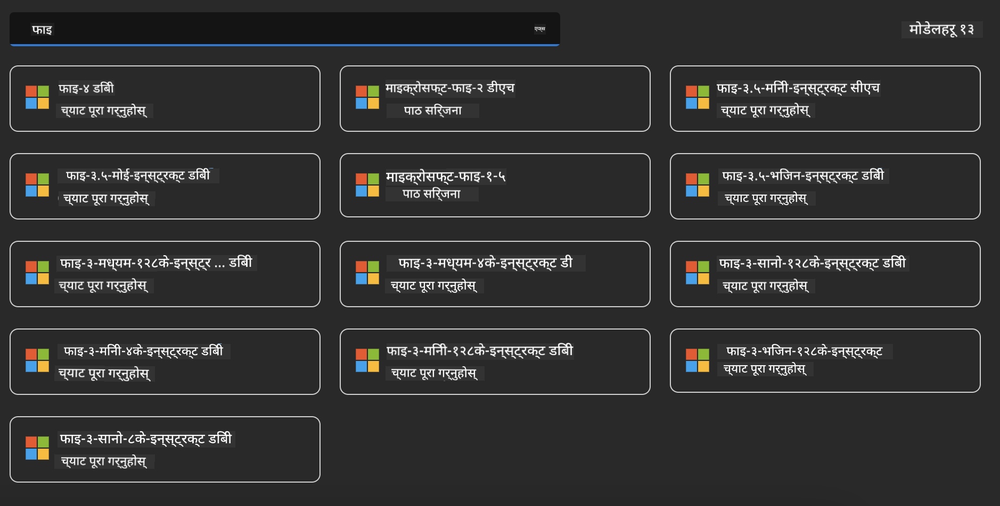
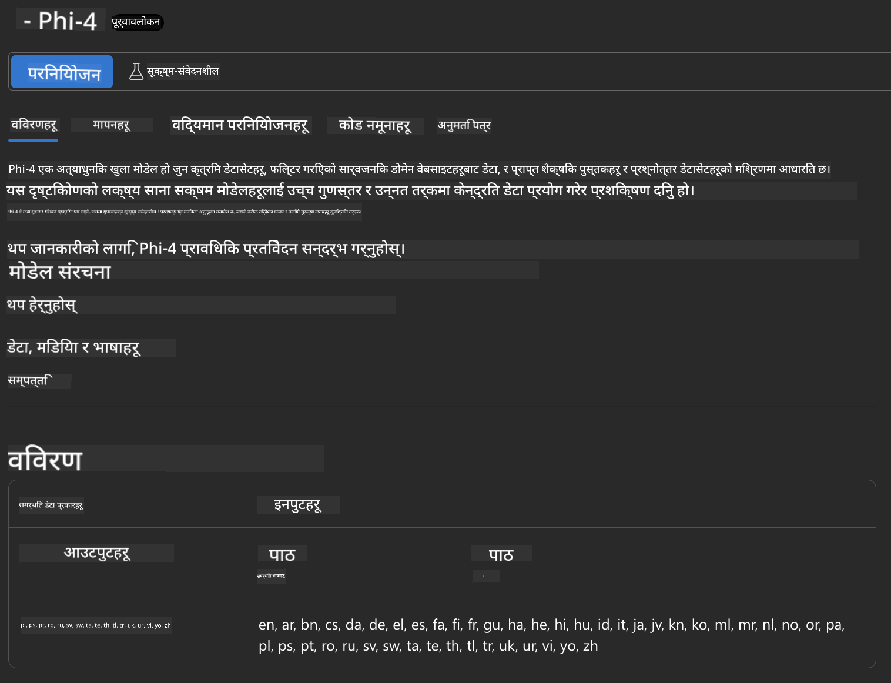
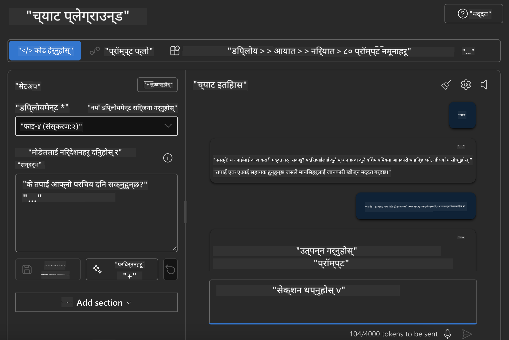

<!--
CO_OP_TRANSLATOR_METADATA:
{
  "original_hash": "3ae21dc5554e888defbe57946ee995ee",
  "translation_date": "2025-07-16T19:08:24+00:00",
  "source_file": "md/01.Introduction/02/03.AzureAIFoundry.md",
  "language_code": "ne"
}
-->
## Azure AI Foundry मा Phi परिवार

[Azure AI Foundry](https://ai.azure.com) एक विश्वसनीय प्लेटफर्म हो जसले विकासकर्ताहरूलाई सुरक्षित, सुरक्षित र जिम्मेवार तरिकाले AI मार्फत नवप्रवर्तन गर्न र भविष्यलाई आकार दिन सक्षम बनाउँछ।

[Azure AI Foundry](https://ai.azure.com) विकासकर्ताहरूका लागि डिजाइन गरिएको छ ताकि:

- उद्यम-स्तरको प्लेटफर्ममा जेनेरेटिभ AI अनुप्रयोगहरू निर्माण गर्न सकियोस्।
- जिम्मेवार AI अभ्यासमा आधारित अत्याधुनिक AI उपकरण र ML मोडेलहरू प्रयोग गरी अन्वेषण, निर्माण, परीक्षण र परिनियोजन गर्न सकियोस्।
- अनुप्रयोग विकासको सम्पूर्ण जीवनचक्रका लागि टोलीसँग सहकार्य गर्न सकियोस्।

Azure AI Foundry सँग, तपाईं विभिन्न मोडेलहरू, सेवाहरू र क्षमताहरू अन्वेषण गर्न सक्नुहुन्छ र तपाईंका लक्ष्यहरूलाई सबैभन्दा राम्रो सेवा गर्ने AI अनुप्रयोगहरू निर्माण गर्न थाल्न सक्नुहुन्छ। Azure AI Foundry प्लेटफर्मले प्रमाण अवधारणाहरूलाई पूर्ण उत्पादन अनुप्रयोगहरूमा सजिलै रूपान्तरण गर्न मापनयोग्यता प्रदान गर्दछ। निरन्तर अनुगमन र सुधारले दीर्घकालीन सफलतालाई समर्थन गर्दछ।



Azure AI Foundry मा Azure AOAI सेवा प्रयोग गर्नुका साथै, तपाईं Azure AI Foundry मोडेल क्याटलगमा तेस्रो-पक्षका मोडेलहरू पनि प्रयोग गर्न सक्नुहुन्छ। यदि तपाईं Azure AI Foundry लाई आफ्नो AI समाधान प्लेटफर्मको रूपमा प्रयोग गर्न चाहनुहुन्छ भने यो राम्रो विकल्प हो।

हामी Azure AI Foundry मा मोडेल क्याटलग मार्फत छिटो Phi परिवारका मोडेलहरू परिनियोजन गर्न सक्छौं

[Microsoft Phi Models in Azure AI Foundry Models](https://ai.azure.com/explore/models/?selectedCollection=phi)



### **Azure AI Foundry मा Phi-4 परिनियोजन गर्नुहोस्**




### **Azure AI Foundry Playground मा Phi-4 परीक्षण गर्नुहोस्**



### **Azure AI Foundry Phi-4 कल गर्न Python कोड चलाउँदै**


```python

import os  
import base64
from openai import AzureOpenAI  
from azure.identity import DefaultAzureCredential, get_bearer_token_provider  
        
endpoint = os.getenv("ENDPOINT_URL", "Your Azure AOAI Service Endpoint")  
deployment = os.getenv("DEPLOYMENT_NAME", "Phi-4")  
      
token_provider = get_bearer_token_provider(  
    DefaultAzureCredential(),  
    "https://cognitiveservices.azure.com/.default"  
)  
  
client = AzureOpenAI(  
    azure_endpoint=endpoint,  
    azure_ad_token_provider=token_provider,  
    api_version="2024-05-01-preview",  
)  
  

chat_prompt = [
    {
        "role": "system",
        "content": "You are an AI assistant that helps people find information."
    },
    {
        "role": "user",
        "content": "can you introduce yourself"
    }
] 
    
# Include speech result if speech is enabled  
messages = chat_prompt 

completion = client.chat.completions.create(  
    model=deployment,  
    messages=messages,
    max_tokens=800,  
    temperature=0.7,  
    top_p=0.95,  
    frequency_penalty=0,  
    presence_penalty=0,
    stop=None,  
    stream=False  
)  
  
print(completion.to_json())  

```

**अस्वीकरण**:  
यो दस्तावेज AI अनुवाद सेवा [Co-op Translator](https://github.com/Azure/co-op-translator) प्रयोग गरी अनुवाद गरिएको हो। हामी शुद्धताका लागि प्रयासरत छौं, तर कृपया ध्यान दिनुहोस् कि स्वचालित अनुवादमा त्रुटि वा अशुद्धता हुन सक्छ। मूल दस्तावेज यसको मूल भाषामा नै अधिकारिक स्रोत मानिनु पर्छ। महत्वपूर्ण जानकारीका लागि व्यावसायिक मानव अनुवाद सिफारिस गरिन्छ। यस अनुवादको प्रयोगबाट उत्पन्न कुनै पनि गलतफहमी वा गलत व्याख्याका लागि हामी जिम्मेवार छैनौं।