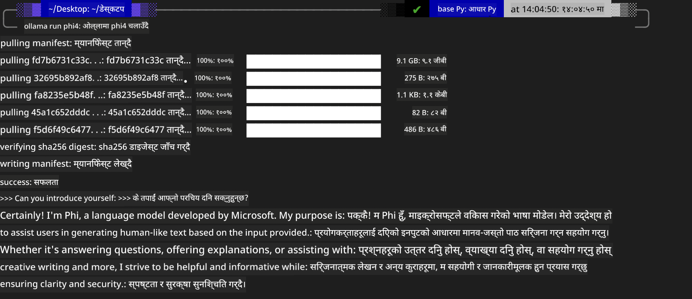
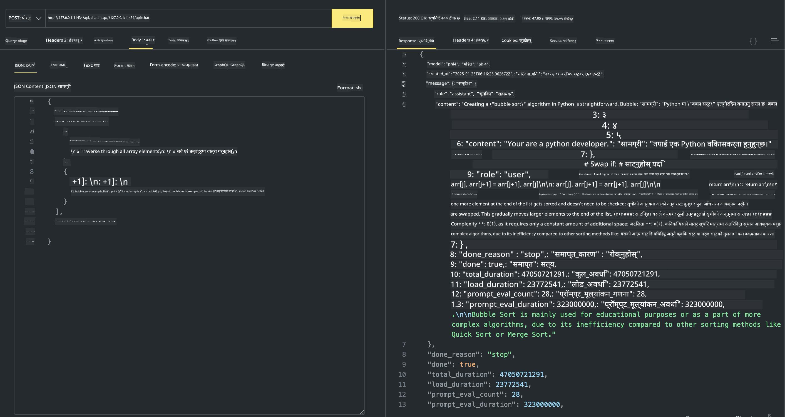

<!--
CO_OP_TRANSLATOR_METADATA:
{
  "original_hash": "0b38834693bb497f96bf53f0d941f9a1",
  "translation_date": "2025-07-16T19:14:52+00:00",
  "source_file": "md/01.Introduction/02/04.Ollama.md",
  "language_code": "ne"
}
-->
## Ollama मा Phi परिवार


[Ollama](https://ollama.com) ले धेरैलाई सजिलै स्क्रिप्टमार्फत खुला स्रोत LLM वा SLM सिधै डिप्लोय गर्न अनुमति दिन्छ, र स्थानीय Copilot एप्लिकेसन परिदृश्यहरूमा सहयोग पुर्‍याउन API पनि बनाउन सक्छ।

## **1. स्थापना**

Ollama Windows, macOS, र Linux मा चलाउन समर्थन गर्छ। तपाईं यस लिंक ([https://ollama.com/download](https://ollama.com/download)) बाट Ollama स्थापना गर्न सक्नुहुन्छ। सफलतापूर्वक स्थापना भएपछि, तपाईं टर्मिनल विन्डोबाट सिधै Ollama स्क्रिप्ट प्रयोग गरी Phi-3 कल गर्न सक्नुहुन्छ। तपाईं सबै [Ollama मा उपलब्ध पुस्तकालयहरू](https://ollama.com/library) हेर्न सक्नुहुन्छ। यदि तपाईंले यो रिपोजिटरी Codespace मा खोल्नुभयो भने, Ollama पहिले नै स्थापना गरिएको हुनेछ।

```bash

ollama run phi4

```

> [!NOTE]
> मोडेल पहिलो पटक चलाउँदा डाउनलोड हुनेछ। पक्कै पनि, तपाईं सिधै डाउनलोड गरिएको Phi-4 मोडेल पनि निर्दिष्ट गर्न सक्नुहुन्छ। हामी WSL लाई उदाहरणको रूपमा कमाण्ड चलाउने तरिका देखाउँछौं। मोडेल सफलतापूर्वक डाउनलोड भएपछि, तपाईं टर्मिनलमा सिधै अन्तरक्रिया गर्न सक्नुहुन्छ।



## **2. Ollama बाट phi-4 API कल गर्ने**

यदि तपाईं Ollama द्वारा सिर्जना गरिएको Phi-4 API कल गर्न चाहनुहुन्छ भने, टर्मिनलमा यो कमाण्ड प्रयोग गरी Ollama सर्भर सुरु गर्न सक्नुहुन्छ।

```bash

ollama serve

```

> [!NOTE]
> यदि तपाईं MacOS वा Linux मा हुनुहुन्छ भने, कृपया ध्यान दिनुहोस् कि तपाईंले निम्न त्रुटि सामना गर्न सक्नुहुन्छ **"Error: listen tcp 127.0.0.1:11434: bind: address already in use"** यो त्रुटि कमाण्ड चलाउँदा आउन सक्छ। तपाईं यो त्रुटि बेवास्ता गर्न सक्नुहुन्छ किनभने यसले सामान्यतया सर्भर पहिले नै चलिरहेको छ भन्ने जनाउँछ, वा तपाईं Ollama लाई रोकेर पुनः सुरु गर्न सक्नुहुन्छ:

**macOS**

```bash

brew services restart ollama

```

**Linux**

```bash

sudo systemctl stop ollama

```

Ollama ले दुई API समर्थन गर्छ: generate र chat। तपाईं आफ्नो आवश्यकताअनुसार Ollama द्वारा प्रदान गरिएको मोडेल API कल गर्न सक्नुहुन्छ, स्थानीय सेवामा पोर्ट 11434 मा अनुरोध पठाएर।

**Chat**

```bash

curl http://127.0.0.1:11434/api/chat -d '{
  "model": "phi3",
  "messages": [
    {
      "role": "system",
      "content": "Your are a python developer."
    },
    {
      "role": "user",
      "content": "Help me generate a bubble algorithm"
    }
  ],
  "stream": false
  
}'

This is the result in Postman



## Additional Resources

Check the list of available models in Ollama in [their library](https://ollama.com/library).

Pull your model from the Ollama server using this command

```bash
ollama pull phi4
```

Run the model using this command

```bash
ollama run phi4
```

***Note:*** Visit this link [https://github.com/ollama/ollama/blob/main/docs/api.md](https://github.com/ollama/ollama/blob/main/docs/api.md) to learn more

## Calling Ollama from Python

You can use `requests` or `urllib3` to make requests to the local server endpoints used above. However, a popular way to use Ollama in Python is via the [openai](https://pypi.org/project/openai/) SDK, since Ollama provides OpenAI-compatible server endpoints as well.

Here is an example for phi3-mini:

```python
import openai

client = openai.OpenAI(
    base_url="http://localhost:11434/v1",
    api_key="nokeyneeded",
)

response = client.chat.completions.create(
    model="phi4",
    temperature=0.7,
    n=1,
    messages=[
        {"role": "system", "content": "You are a helpful assistant."},
        {"role": "user", "content": "Write a haiku about a hungry cat"},
    ],
)

print("Response:")
print(response.choices[0].message.content)
```

## Calling Ollama from JavaScript 

```javascript
// Phi-4 सँग फाइल सारांश गर्ने उदाहरण
script({
    model: "ollama:phi4",
    title: "Phi-4 सँग सारांश",
    system: ["system"],
})

// सारांश गर्ने उदाहरण
const file = def("FILE", env.files)
$`Summarize ${file} in a single paragraph.`
```

## Calling Ollama from C#

Create a new C# Console application and add the following NuGet package:

```bash
dotnet add package Microsoft.SemanticKernel --version 1.34.0
```

Then replace this code in the `Program.cs` file

```csharp
using Microsoft.SemanticKernel;
using Microsoft.SemanticKernel.ChatCompletion;

// स्थानीय ollama सर्भर अन्तबिन्दु प्रयोग गरी chat completion सेवा थप्नुहोस्
#pragma warning disable SKEXP0001, SKEXP0003, SKEXP0010, SKEXP0011, SKEXP0050, SKEXP0052
builder.AddOpenAIChatCompletion(
    modelId: "phi4",
    endpoint: new Uri("http://localhost:11434/"),
    apiKey: "non required");

// chat सेवामा सरल प्रॉम्प्ट कल गर्नुहोस्
string prompt = "Write a joke about kittens";
var response = await kernel.InvokePromptAsync(prompt);
Console.WriteLine(response.GetValue<string>());
```

Run the app with the command:

```bash
dotnet run


**अस्वीकरण**:  
यो दस्तावेज AI अनुवाद सेवा [Co-op Translator](https://github.com/Azure/co-op-translator) प्रयोग गरी अनुवाद गरिएको हो। हामी शुद्धताका लागि प्रयासरत छौं, तर कृपया ध्यान दिनुहोस् कि स्वचालित अनुवादमा त्रुटि वा अशुद्धता हुन सक्छ। मूल दस्तावेज यसको मूल भाषामा आधिकारिक स्रोत मानिनुपर्छ। महत्वपूर्ण जानकारीका लागि व्यावसायिक मानव अनुवाद सिफारिस गरिन्छ। यस अनुवादको प्रयोगबाट उत्पन्न कुनै पनि गलतफहमी वा गलत व्याख्याका लागि हामी जिम्मेवार छैनौं।