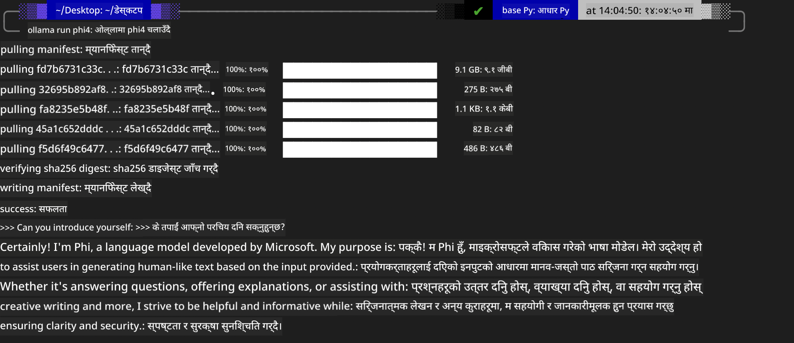
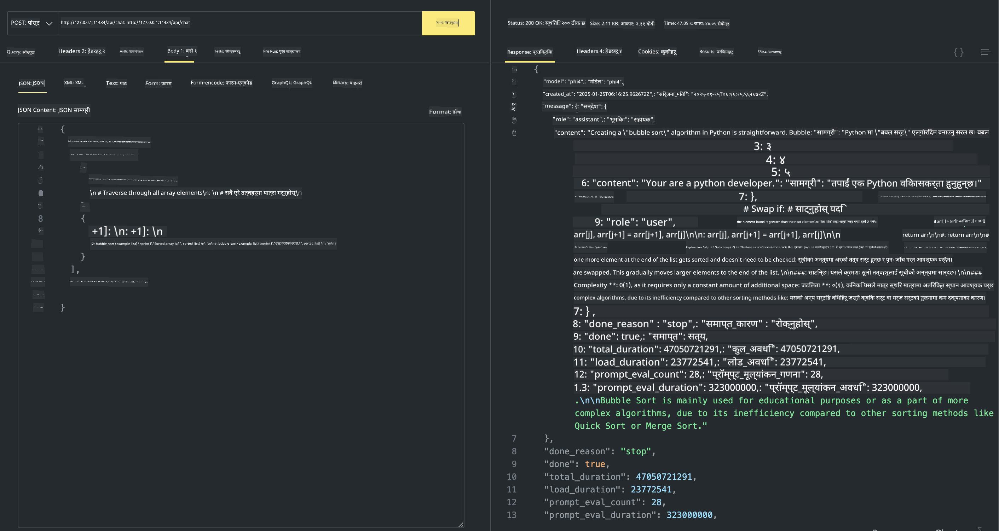

<!--
CO_OP_TRANSLATOR_METADATA:
{
  "original_hash": "2aa35f3c8b437fd5dc9995d53909d495",
  "translation_date": "2025-12-21T11:10:12+00:00",
  "source_file": "md/01.Introduction/02/04.Ollama.md",
  "language_code": "ne"
}
-->
## Ollama मा Phi परिवार


[Ollama](https://ollama.com) ले साधारण स्क्रिप्टमार्फत खुला स्रोत LLM वा SLM प्रत्यक्ष रूपमा तैनाथ गर्न बढी मानिसहरूलाई सक्षम बनाउँछ, र स्थानीय Copilot अनुप्रयोग परिदृश्यहरूका लागि API हरू पनि निर्माण गर्न सक्छ।

## **1. स्थापना**

Ollama Windows, macOS, र Linux मा चलाउन समर्थन गर्छ। तपाईं यो लिंक ([https://ollama.com/download](https://ollama.com/download)) बाट Ollama इन्स्टल गर्न सक्नुहुन्छ। सफल रूपमा स्थापना गरेपछि, तपाईं टर्मिनल विन्डोबाट प्रत्यक्ष रूपमा Ollama स्क्रिप्ट प्रयोग गरेर Phi-3 कल गर्न सक्नुहुन्छ। तपाईं सबै [Ollama मा उपलब्ध सबै पुस्तकालयहरू](https://ollama.com/library) हेर्न सक्नुहुन्छ। यदि तपाईं यो रिपोजिटरी Codespace मा खोल्नुहुन्छ भने, यसमा पहिले नै Ollama इन्स्टल गरिसकेको हुनेछ।

```bash

ollama run phi4

```

> [!NOTE]
> मोडेल पहिलो पटक चलाउँदा पहिले डाउनलोड हुनेछ। अवश्य पनि, तपाईंले पहिले नै डाउनलोड गरेको Phi-4 मोडेल सिधै निर्दिष्ट पनि गर्न सक्नुहुन्छ। कमाण्ड चलाउन हामी WSL लाई उदाहरणका रूपमा लिएका छौं। मोडेल सफलतापूर्वक डाउनलोड भएपछि, तपाईं सिधै टर्मिनलमा अन्तरक्रिया गर्न सक्नुहुन्छ।



## **2. Ollama बाट phi-4 API कल गर्ने**

यदि तपाईं Ollama द्वारा उत्पन्न Phi-4 API कल गर्न चाहनुहुन्छ भने, Ollama सर्भर सुरु गर्न टर्मिनलमा यो कमाण्ड प्रयोग गर्न सक्नुहुन्छ।

```bash

ollama serve

```

> [!NOTE]
> यदि MacOS वा Linux मा चलाइरहनु भएको छ भने, कृपया ध्यान दिनुहोस् कि तपाईंले निम्न त्रुटि सामना गर्न सक्नुहुन्छ **"Error: listen tcp 127.0.0.1:11434: bind: address already in use"**। यो कमाण्ड चलाउँदा तपाईँलाई यो त्रुटि आउन सक्छ। यो सामान्यतया सर्भर पहिले नै चलिरहेको संकेत गर्ने हुनाले, तपाईंले त्यो त्रुटिलाई बेवास्ता गर्न सक्नुहुन्छ, वा Ollama लाई रोकेर पुन: सुरु गर्न सक्नुहुन्छ:

**macOS**

```bash

brew services restart ollama

```

**Linux**

```bash

sudo systemctl stop ollama

```

Ollama ले दुईवटा API समर्थन गर्छ: generate र chat। तपाईं आफ्नो आवश्यकता अनुसार Ollama ले प्रदान गरेको मोडेल API लाई कल गर्न सक्नुहुन्छ, स्थानीय सर्भिसमा पोर्ट 11434 मा चलिरहेको अनुरोध पठाएर।

**Chat**

```bash

curl http://127.0.0.1:11434/api/chat -d '{
  "model": "phi3",
  "messages": [
    {
      "role": "system",
      "content": "Your are a python developer."
    },
    {
      "role": "user",
      "content": "Help me generate a bubble algorithm"
    }
  ],
  "stream": false
  
}'
```

यो Postman मा नतिजा हो



## थप स्रोतहरू

Ollama मा उपलब्ध मोडेलहरूको सूची [तिनीहरूको पुस्तकालय](https://ollama.com/library) मा जाँच गर्नुहोस्।

Ollama सर्भरबाट आफ्नो मोडेल यस कमाण्ड प्रयोग गरेर तान्नुहोस्

```bash
ollama pull phi4
```

यो कमाण्ड प्रयोग गरेर मोडेल चलाउनुहोस्

```bash
ollama run phi4
```

***नोट:*** थप जानकारीका लागि यो लिंक भ्रमण गर्नुहोस् [https://github.com/ollama/ollama/blob/main/docs/api.md](https://github.com/ollama/ollama/blob/main/docs/api.md)

## Python बाट Ollama कल गर्ने

माथि प्रयोग गरिएका स्थानीय सर्भर एन्डपोइन्टहरूमा अनुरोध गर्न तपाईं `requests` वा `urllib3` प्रयोग गर्न सक्नुहुन्छ। यद्यपि, Python मा Ollama प्रयोग गर्ने लोकप्रिय तरिका OpenAI-अनुकूल सर्भर एन्डपोइन्ट प्रदान गर्ने भएकाले [openai](https://pypi.org/project/openai/) SDK मार्फत हो।

यहाँ phi3-mini को लागि एउटा उदाहरण छ:

```python
import openai

client = openai.OpenAI(
    base_url="http://localhost:11434/v1",
    api_key="nokeyneeded",
)

response = client.chat.completions.create(
    model="phi4",
    temperature=0.7,
    n=1,
    messages=[
        {"role": "system", "content": "You are a helpful assistant."},
        {"role": "user", "content": "Write a haiku about a hungry cat"},
    ],
)

print("Response:")
print(response.choices[0].message.content)
```

## JavaScript बाट Ollama कल गर्ने 
```javascript
// Phi-4 प्रयोग गरेर फाइलको सारांश गर्ने उदाहरण
script({
    model: "ollama:phi4",
    title: "Summarize with Phi-4",
    system: ["system"],
})

// सारांश गर्ने उदाहरण
const file = def("FILE", env.files)
$`Summarize ${file} in a single paragraph.`
```

## C# बाट Ollama कल गर्ने

नयाँ C# Console एप्लिकेशन सिर्जना गर्नुहोस् र निम्न NuGet प्याकेज थप्नुहोस्:

```bash
dotnet add package Microsoft.SemanticKernel --version 1.34.0
```

त्यसपछि `Program.cs` फाइलमा यो कोड प्रतिस्थापन गर्नुहोस्

```csharp
using Microsoft.SemanticKernel;
using Microsoft.SemanticKernel.ChatCompletion;

// add chat completion service using the local ollama server endpoint
#pragma warning disable SKEXP0001, SKEXP0003, SKEXP0010, SKEXP0011, SKEXP0050, SKEXP0052
builder.AddOpenAIChatCompletion(
    modelId: "phi4",
    endpoint: new Uri("http://localhost:11434/"),
    apiKey: "non required");

// invoke a simple prompt to the chat service
string prompt = "Write a joke about kittens";
var response = await kernel.InvokePromptAsync(prompt);
Console.WriteLine(response.GetValue<string>());
```

एप चलाउन यो कमाण्ड प्रयोग गर्नुहोस्:

```bash
dotnet run
```

---

<!-- CO-OP TRANSLATOR DISCLAIMER START -->
अस्वीकरण:
यो दस्तावेज AI अनुवाद सेवा Co-op Translator (https://github.com/Azure/co-op-translator) प्रयोग गरेर अनुवाद गरिएको हो। हामी शुद्धताको प्रयास गर्छौं, तर कृपया ध्यान दिनुहोस् कि स्वचालित अनुवादमा त्रुटि वा अशुद्धता हुनसक्छ। मूल दस्तावेजलाई यसको मूल भाषामै अधिकारिक स्रोत मान्नुपर्छ। महत्वपूर्ण जानकारीका लागि पेशेवर मानव अनुवादको सिफारिस गरिन्छ। यो अनुवादको प्रयोगबाट उत्पन्न हुने कुनै पनि गलतफहमी वा गलत व्याख्याका लागि हामी जिम्मेवार छैनौं।
<!-- CO-OP TRANSLATOR DISCLAIMER END -->