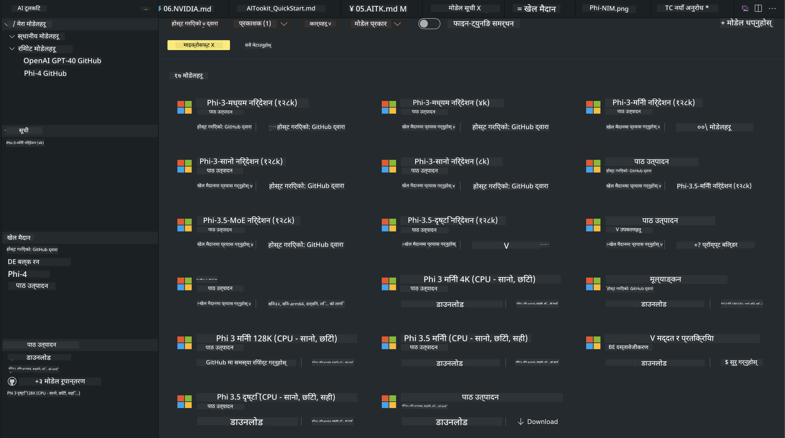
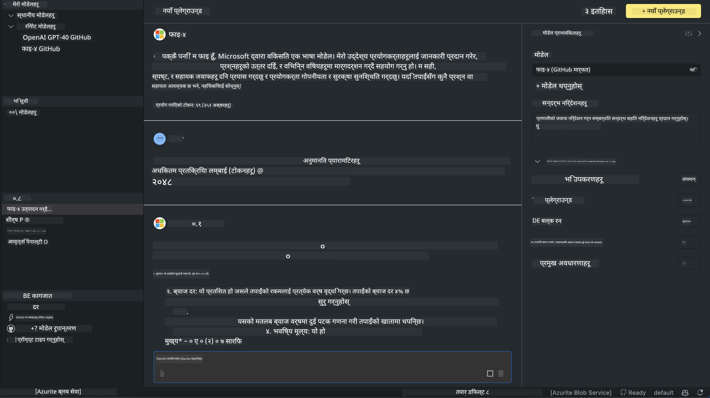

<!--
CO_OP_TRANSLATOR_METADATA:
{
  "original_hash": "4951d458c0b60c02cd1e751b40903877",
  "translation_date": "2025-05-09T09:28:34+00:00",
  "source_file": "md/01.Introduction/02/05.AITK.md",
  "language_code": "ne"
}
-->
# Phi Family in AITK

[AI Toolkit for VS Code](https://marketplace.visualstudio.com/items?itemName=ms-windows-ai-studio.windows-ai-studio) ले Azure AI Foundry Catalog र Hugging Face जस्ता अन्य क्याटलगहरूबाट अत्याधुनिक AI विकास उपकरण र मोडेलहरूलाई एकसाथ ल्याएर जनरेटिभ AI एप विकासलाई सजिलो बनाउँछ। तपाईं GitHub Models र Azure AI Foundry Model Catalogs द्वारा समर्थित AI मोडेल क्याटलग ब्राउज गर्न, तिनीहरूलाई स्थानीय वा रिमोटमा डाउनलोड गर्न, फाइन-ट्युन गर्न, परीक्षण गर्न र आफ्नो एपमा प्रयोग गर्न सक्नुहुनेछ।

AI Toolkit Preview स्थानीय रूपमा चल्नेछ। स्थानीय इन्फरेन्स वा फाइन-ट्युनिङ चयन गरेको मोडेलमा निर्भर गर्दछ, तपाईंलाई NVIDIA CUDA GPU जस्ता GPU आवश्यक पर्न सक्छ। तपाईं AITK मार्फत सिधै GitHub Models पनि चलाउन सक्नुहुन्छ।

## सुरु गर्ने तरिका

[Windows subsystem for Linux कसरी इन्स्टल गर्ने सिक्नुहोस्](https://learn.microsoft.com/windows/wsl/install?WT.mc_id=aiml-137032-kinfeylo)

र [डिफल्ट वितरण कसरी परिवर्तन गर्ने](https://learn.microsoft.com/windows/wsl/install#change-the-default-linux-distribution-installed)।

[AI Toolkit GitHub Repo](https://github.com/microsoft/vscode-ai-toolkit/)

- Windows, Linux, macOS
  
- Windows र Linux दुवैमा फाइनट्युनिङका लागि Nvidia GPU आवश्यक पर्छ। थप रूपमा, **Windows** मा Ubuntu 18.4 वा माथिको वितरणसहित subsystem for Linux चाहिन्छ। [Windows subsystem for Linux कसरी इन्स्टल गर्ने](https://learn.microsoft.com/windows/wsl/install) र [डिफल्ट वितरण कसरी परिवर्तन गर्ने](https://learn.microsoft.com/windows/wsl/install#change-the-default-linux-distribution-installed) बारे थप जान्नुहोस्।

### AI Toolkit इन्स्टल गर्ने

AI Toolkit [Visual Studio Code Extension](https://code.visualstudio.com/docs/setup/additional-components#_vs-code-extensions) को रूपमा उपलब्ध छ, त्यसैले पहिले [VS Code](https://code.visualstudio.com/docs/setup/windows?WT.mc_id=aiml-137032-kinfeylo) इन्स्टल गर्नुहोस् र AI Toolkit लाई [VS Marketplace](https://marketplace.visualstudio.com/items?itemName=ms-windows-ai-studio.windows-ai-studio) बाट डाउनलोड गर्नुहोस्।  
[AI Toolkit Visual Studio Marketplace मा उपलब्ध छ](https://marketplace.visualstudio.com/items?itemName=ms-windows-ai-studio.windows-ai-studio) र अन्य VS Code एक्सटेन्सनहरू जस्तै इन्स्टल गर्न सकिन्छ।  

यदि तपाईंलाई VS Code एक्सटेन्सन इन्स्टल गर्ने तरिका थाहा छैन भने, यी चरणहरू पालना गर्नुहोस्:

### साइन इन गर्ने

1. VS Code को Activity Bar मा **Extensions** छान्नुहोस्  
1. Extensions Search बारमा "AI Toolkit" टाइप गर्नुहोस्  
1. "AI Toolkit for Visual Studio code" छान्नुहोस्  
1. **Install** मा क्लिक गर्नुहोस्  

अब तपाईं एक्सटेन्सन प्रयोग गर्न तयार हुनुहुन्छ!

तपाईंलाई GitHub मा साइन इन गर्न आग्रह गरिनेछ, कृपया जारी राख्न "Allow" मा क्लिक गर्नुहोस्। तपाईं GitHub साइन इन पृष्ठमा रिडिरेक्ट हुनुहुनेछ।

कृपया साइन इन गरी प्रक्रिया पूरा गर्नुहोस्। सफल भएपछि तपाईं VS Code मा फिर्ता जानुहुनेछ।

एक्सटेन्सन इन्स्टल भएपछि Activity Bar मा AI Toolkit आइकन देखिनेछ।

अब उपलब्ध कार्यहरू अन्वेषण गरौं!

### उपलब्ध कार्यहरू

AI Toolkit को मुख्य साइडबार यसरी व्यवस्थित छ:

- **Models**  
- **Resources**  
- **Playground**  
- **Fine-tuning**  
- **Evaluation**

Resources सेक्सनमा उपलब्ध छन्। सुरु गर्न **Model Catalog** छान्नुहोस्।

### क्याटलगबाट मोडेल डाउनलोड गर्ने

VS Code साइडबारबाट AI Toolkit सुरु गर्दा निम्न विकल्पहरू देख्न सक्नुहुन्छ:



- **Model Catalog** बाट समर्थन गरिएको मोडेल खोजेर स्थानीय रूपमा डाउनलोड गर्नुहोस्  
- **Model Playground** मा मोडेल इन्फरेन्स परीक्षण गर्नुहोस्  
- **Model Fine-tuning** मा मोडेल स्थानीय वा रिमोट रूपमा फाइन-ट्युन गर्नुहोस्  
- AI Toolkit को कमाण्ड प्यालेट मार्फत क्लाउडमा फाइन-ट्युन गरिएका मोडेल तैनाथ गर्नुहोस्  
- मोडेल मूल्याङ्कन गर्नुहोस्  

> [!NOTE]
>  
> **GPU Vs CPU**  
>  
> मोडेल कार्डहरूले मोडेल साइज, प्लेटफर्म र एक्सेलेरेटर प्रकार (CPU, GPU) देखाउँछन्। **Windows उपकरणहरूमा जुन कम्तीमा एक GPU छ**, प्रदर्शन सुधार गर्न Windows मात्र लक्षित गर्ने मोडेल संस्करणहरू चयन गर्नुहोस्।  
>  
> यसले DirectML एक्सेलेरेटरको लागि अनुकूलित मोडेल सुनिश्चित गर्दछ।  
>  
> मोडेल नामहरू यस ढाँचामा हुन्छन्:  
>  
> - `{model_name}-{accelerator}-{quantization}-{format}`।  
>  
> Windows उपकरणमा GPU छ कि छैन जाँच्न **Task Manager** खोल्नुहोस् र **Performance** ट्याब छान्नुहोस्। GPU(हरू) "GPU 0" वा "GPU 1" जस्ता नाममा सूचीबद्ध हुनेछन्।

### प्लेग्राउन्डमा मोडेल चलाउने

सबै प्यारामिटर सेट गरेपछि, **Generate Project** मा क्लिक गर्नुहोस्।

मोडेल डाउनलोड भएपछि, क्याटलगमा मोडेल कार्डमा **Load in Playground** छान्नुहोस्:

- मोडेल डाउनलोड सुरु गर्नुहोस्  
- सबै आवश्यक पूर्वाधार र निर्भरता इन्स्टल गर्नुहोस्  
- VS Code कार्यक्षेत्र सिर्जना गर्नुहोस्  



### आफ्नो एपमा REST API प्रयोग गर्ने

AI Toolkit सँग स्थानीय REST API वेब सर्भर छ **पोर्ट 5272 मा**, जुन [OpenAI chat completions format](https://platform.openai.com/docs/api-reference/chat/create) प्रयोग गर्छ।  

यसले तपाईंलाई क्लाउड AI मोडेल सेवामा भर नपरी आफ्नो एप स्थानीय रूपमा परीक्षण गर्न सक्षम बनाउँछ। उदाहरणका लागि, तलको JSON फाइलले अनुरोधको बडी कसरी कन्फिगर गर्ने देखाउँछ:

```json
{
    "model": "Phi-4",
    "messages": [
        {
            "role": "user",
            "content": "what is the golden ratio?"
        }
    ],
    "temperature": 0.7,
    "top_p": 1,
    "top_k": 10,
    "max_tokens": 100,
    "stream": true
}
```

तपाईं REST API परीक्षण गर्न (जस्तै) [Postman](https://www.postman.com/) वा CURL (Client URL) युटिलिटी प्रयोग गर्न सक्नुहुन्छ:

```bash
curl -vX POST http://127.0.0.1:5272/v1/chat/completions -H 'Content-Type: application/json' -d @body.json
```

### Python को लागि OpenAI क्लाइन्ट लाइब्रेरी प्रयोग गर्ने

```python
from openai import OpenAI

client = OpenAI(
    base_url="http://127.0.0.1:5272/v1/", 
    api_key="x" # required for the API but not used
)

chat_completion = client.chat.completions.create(
    messages=[
        {
            "role": "user",
            "content": "what is the golden ratio?",
        }
    ],
    model="Phi-4",
)

print(chat_completion.choices[0].message.content)
```

### .NET को लागि Azure OpenAI क्लाइन्ट लाइब्रेरी प्रयोग गर्ने

NuGet प्रयोग गरी आफ्नो प्रोजेक्टमा [Azure OpenAI client library for .NET](https://www.nuget.org/packages/Azure.AI.OpenAI/) थप्नुहोस्:

```bash
dotnet add {project_name} package Azure.AI.OpenAI --version 1.0.0-beta.17
```

**OverridePolicy.cs** नामको C# फाइल प्रोजेक्टमा थपेर तलको कोड पेस्ट गर्नुहोस्:

```csharp
// OverridePolicy.cs
using Azure.Core.Pipeline;
using Azure.Core;

internal partial class OverrideRequestUriPolicy(Uri overrideUri)
    : HttpPipelineSynchronousPolicy
{
    private readonly Uri _overrideUri = overrideUri;

    public override void OnSendingRequest(HttpMessage message)
    {
        message.Request.Uri.Reset(_overrideUri);
    }
}
```

पछि, आफ्नो **Program.cs** फाइलमा तलको कोड पेस्ट गर्नुहोस्:

```csharp
// Program.cs
using Azure.AI.OpenAI;

Uri localhostUri = new("http://localhost:5272/v1/chat/completions");

OpenAIClientOptions clientOptions = new();
clientOptions.AddPolicy(
    new OverrideRequestUriPolicy(localhostUri),
    Azure.Core.HttpPipelinePosition.BeforeTransport);
OpenAIClient client = new(openAIApiKey: "unused", clientOptions);

ChatCompletionsOptions options = new()
{
    DeploymentName = "Phi-4",
    Messages =
    {
        new ChatRequestSystemMessage("You are a helpful assistant. Be brief and succinct."),
        new ChatRequestUserMessage("What is the golden ratio?"),
    }
};

StreamingResponse<StreamingChatCompletionsUpdate> streamingChatResponse
    = await client.GetChatCompletionsStreamingAsync(options);

await foreach (StreamingChatCompletionsUpdate chatChunk in streamingChatResponse)
{
    Console.Write(chatChunk.ContentUpdate);
}
```


## AI Toolkit सँग फाइन ट्युनिङ

- मोडेल खोज र प्लेग्राउन्डबाट सुरु गर्नुहोस्।  
- स्थानीय कम्प्युटिङ स्रोतहरू प्रयोग गरी मोडेल फाइन-ट्युन र इन्फरेन्स।  
- Azure स्रोतहरू प्रयोग गरी रिमोट फाइन-ट्युन र इन्फरेन्स।  

[Fine Tuning with AI Toolkit](../../03.FineTuning/Finetuning_VSCodeaitoolkit.md)

## AI Toolkit Q&A स्रोतहरू

सबैभन्दा सामान्य समस्या र समाधानका लागि कृपया हाम्रो [Q&A पृष्ठ](https://github.com/microsoft/vscode-ai-toolkit/blob/main/archive/QA.md) हेर्नुहोस्।

**अस्वीकरण**:  
यो दस्तावेज़ AI अनुवाद सेवा [Co-op Translator](https://github.com/Azure/co-op-translator) को प्रयोग गरी अनुवाद गरिएको हो। हामी सटीकता सुनिश्चित गर्न प्रयासरत छौं, तर कृपया ध्यान दिनुहोस् कि स्वचालित अनुवादमा त्रुटिहरू वा अशुद्धिहरू हुन सक्छन्। मूल दस्तावेज़लाई यसको स्वदेशी भाषामा आधिकारिक स्रोतको रूपमा मानिनु पर्छ। महत्वपूर्ण जानकारीको लागि व्यावसायिक मानव अनुवाद सिफारिस गरिन्छ। यस अनुवादको प्रयोगबाट उत्पन्न कुनै पनि गलतफहमी वा गलत व्याख्याका लागि हामी जिम्मेवार छैनौं।