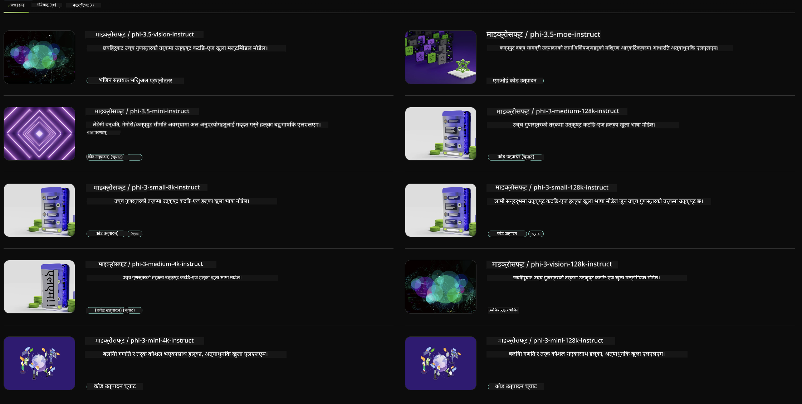

<!--
CO_OP_TRANSLATOR_METADATA:
{
  "original_hash": "7b08e277df2a9307f861ae54bc30c772",
  "translation_date": "2025-05-09T09:50:22+00:00",
  "source_file": "md/01.Introduction/02/06.NVIDIA.md",
  "language_code": "ne"
}
-->
## Phi परिवार NVIDIA NIM मा

NVIDIA NIM सजिलै प्रयोग गर्न मिल्ने माइक्रोसर्भिसहरूको सेट हो जुन क्लाउड, डेटा सेन्टर, र वर्कस्टेशनहरूमा जेनेरेटिभ AI मोडेलहरूको डिप्लोयमेन्ट छिटो बनाउन डिजाइन गरिएको हो। NIM हरू मोडेल परिवार र मोडेल अनुसार वर्गीकृत गरिएका छन्। उदाहरणका लागि, ठूलो भाषा मोडेलहरू (LLMs) का लागि NVIDIA NIM ले अत्याधुनिक LLM हरूको शक्ति एंटरप्राइज अनुप्रयोगहरूमा ल्याउँछ, जसले अप्रतिद्वन्द्वी प्राकृतिक भाषा प्रशोधन र बुझाइ क्षमता प्रदान गर्दछ।

NIM ले IT र DevOps टोलीहरूलाई आफ्नै व्यवस्थापन गरिएका वातावरणहरूमा ठूलो भाषा मोडेलहरू (LLMs) स्व-होस्ट गर्न सजिलो बनाउँछ भने विकासकर्ताहरूलाई उद्योग मानक API हरू प्रदान गर्दछ जसले शक्तिशाली कोपाइलट, च्याटबोट, र AI सहायकहरू बनाउन अनुमति दिन्छ जसले उनीहरूको व्यवसाय रूपान्तरण गर्न सक्छ। NVIDIA को अत्याधुनिक GPU एक्सेलेरेशन र स्केलेबल डिप्लोयमेन्टको फाइदा उठाउँदै, NIM ले अभूतपूर्व प्रदर्शनसहित सबैभन्दा छिटो इन्फरेन्स पथ प्रदान गर्दछ।

तपाईं NVIDIA NIM प्रयोग गरेर Phi परिवारका मोडेलहरूमा इन्फरेन्स गर्न सक्नुहुन्छ



### **नमूनाहरू - NVIDIA NIM मा Phi-3-Vision**

कल्पना गर्नुहोस् तपाईंसँग एउटा छवि (`demo.png`) छ र तपाईँले त्यो छवि प्रोसेस गर्ने र नयाँ संस्करण (`phi-3-vision.jpg`) बचत गर्ने Python कोड बनाउन चाहनुहुन्छ।

माथिको कोडले यो प्रक्रिया स्वचालित बनाउँछ:

1. वातावरण र आवश्यक कन्फिगरेसनहरू सेटअप गर्ने।
2. मोडेललाई आवश्यक Python कोड उत्पन्न गर्न निर्देशन दिने प्रॉम्प्ट बनाउने।
3. प्रॉम्प्ट मोडेलमा पठाउने र उत्पन्न कोड सङ्कलन गर्ने।
4. उत्पन्न कोड निकाल्ने र चलाउने।
5. मूल र प्रोसेस गरिएका छविहरू प्रदर्शन गर्ने।

यो तरिका AI को शक्ति प्रयोग गरेर छवि प्रशोधन कार्यहरू स्वचालित बनाउँछ, जसले तपाईँका लक्ष्यहरू सजिलो र छिटो प्राप्त गर्न मद्दत गर्दछ।

[Sample Code Solution](../../../../../code/06.E2E/E2E_Nvidia_NIM_Phi3_Vision.ipynb)

आउनुहोस् सम्पूर्ण कोड के गर्छ भन्ने चरणबद्ध रूपमा हेरौं:

1. **आवश्यक प्याकेज स्थापना गर्नुहोस्**:
    ```python
    !pip install langchain_nvidia_ai_endpoints -U
    ```
    यो कमाण्डले `langchain_nvidia_ai_endpoints` प्याकेज स्थापना गर्छ, र सुनिश्चित गर्छ कि यो नयाँ संस्करण हो।

2. **आवश्यक मोड्युलहरू आयात गर्नुहोस्**:
    ```python
    from langchain_nvidia_ai_endpoints import ChatNVIDIA
    import getpass
    import os
    import base64
    ```
    यी आयातहरूले NVIDIA AI endpoints सँग अन्तरक्रिया गर्न, पासवर्ड सुरक्षित रूपमा सम्हाल्न, अपरेटिङ सिस्टमसँग काम गर्न, र base64 ढाँचामा डाटा एन्कोड/डिकोड गर्न आवश्यक मोड्युलहरू ल्याउँछन्।

3. **API कुञ्जी सेटअप गर्नुहोस्**:
    ```python
    if not os.getenv("NVIDIA_API_KEY"):
        os.environ["NVIDIA_API_KEY"] = getpass.getpass("Enter your NVIDIA API key: ")
    ```
    यो कोडले `NVIDIA_API_KEY` वातावरण चर सेट गरिएको छ कि छैन जाँच गर्छ। नभएमा, प्रयोगकर्तालाई सुरक्षित रूपमा API कुञ्जी प्रविष्ट गर्न आग्रह गर्छ।

4. **मोडेल र छवि पथ परिभाषित गर्नुहोस्**:
    ```python
    model = 'microsoft/phi-3-vision-128k-instruct'
    chat = ChatNVIDIA(model=model)
    img_path = './imgs/demo.png'
    ```
    यसले प्रयोग गर्नुपर्ने मोडेल सेट गर्छ, निर्दिष्ट मोडेलसँग `ChatNVIDIA` को एक उदाहरण बनाउँछ, र छवि फाइलको पथ परिभाषित गर्छ।

5. **टेक्स्ट प्रॉम्प्ट बनाउनुहोस्**:
    ```python
    text = "Please create Python code for image, and use plt to save the new picture under imgs/ and name it phi-3-vision.jpg."
    ```
    यसले मोडेललाई छवि प्रोसेस गर्ने Python कोड उत्पन्न गर्न निर्देशन दिने टेक्स्ट प्रॉम्प्ट परिभाषित गर्छ।

6. **छविलाई Base64 मा एन्कोड गर्नुहोस्**:
    ```python
    with open(img_path, "rb") as f:
        image_b64 = base64.b64encode(f.read()).decode()
    image = f''
    ```
    यो कोडले छवि फाइल पढ्छ, base64 मा एन्कोड गर्छ, र एन्कोड गरिएको डाटासहित HTML छवि ट्याग बनाउँछ।

7. **टेक्स्ट र छवि प्रॉम्प्टमा मिलाउनुहोस्**:
    ```python
    prompt = f"{text} {image}"
    ```
    यसले टेक्स्ट प्रॉम्प्ट र HTML छवि ट्यागलाई एकल स्ट्रिङमा जोड्छ।

8. **ChatNVIDIA प्रयोग गरेर कोड उत्पन्न गर्नुहोस्**:
    ```python
    code = ""
    for chunk in chat.stream(prompt):
        print(chunk.content, end="")
        code += chunk.content
    ```
    यो कोडले प्रॉम्प्टलाई `ChatNVIDIA` model and collects the generated code in chunks, printing and appending each chunk to the `code` स्ट्रिङमा पठाउँछ।

9. **उत्पन्न सामग्रीबाट Python कोड निकाल्नुहोस्**:
    ```python
    begin = code.index('```python') + 9
    code = code[begin:]
    end = code.index('```')
    code = code[:end]
    ```
    यो markdown फर्म्याटिङ हटाएर उत्पन्न सामग्रीबाट वास्तविक Python कोड निकाल्छ।

10. **उत्पन्न कोड चलाउनुहोस्**:
    ```python
    import subprocess
    result = subprocess.run(["python", "-c", code], capture_output=True)
    ```
    यो निकालिएको Python कोड subprocess को रूपमा चलाउँछ र यसको आउटपुट समात्छ।

11. **छविहरू प्रदर्शन गर्नुहोस्**:
    ```python
    from IPython.display import Image, display
    display(Image(filename='./imgs/phi-3-vision.jpg'))
    display(Image(filename='./imgs/demo.png'))
    ```
    यी लाइनहरूले `IPython.display` मोड्युल प्रयोग गरेर छविहरू प्रदर्शन गर्छन्।

**अस्वीकरण**:  
यो दस्तावेज AI अनुवाद सेवा [Co-op Translator](https://github.com/Azure/co-op-translator) प्रयोग गरी अनुवाद गरिएको हो। हामी शुद्धताका लागि प्रयासरत छौं, तर कृपया ध्यान दिनुहोस् कि स्वचालित अनुवादमा त्रुटिहरू वा अशुद्धता हुनसक्छ। मूल दस्तावेज यसको मूल भाषामा नै अधिकारिक स्रोत मानिनुपर्छ। महत्वपूर्ण जानकारीको लागि व्यावसायिक मानव अनुवाद सिफारिस गरिन्छ। यस अनुवादको प्रयोगबाट उत्पन्न कुनै पनि गलत बुझाइ वा व्याख्याको लागि हामी जिम्मेवार छैनौं।